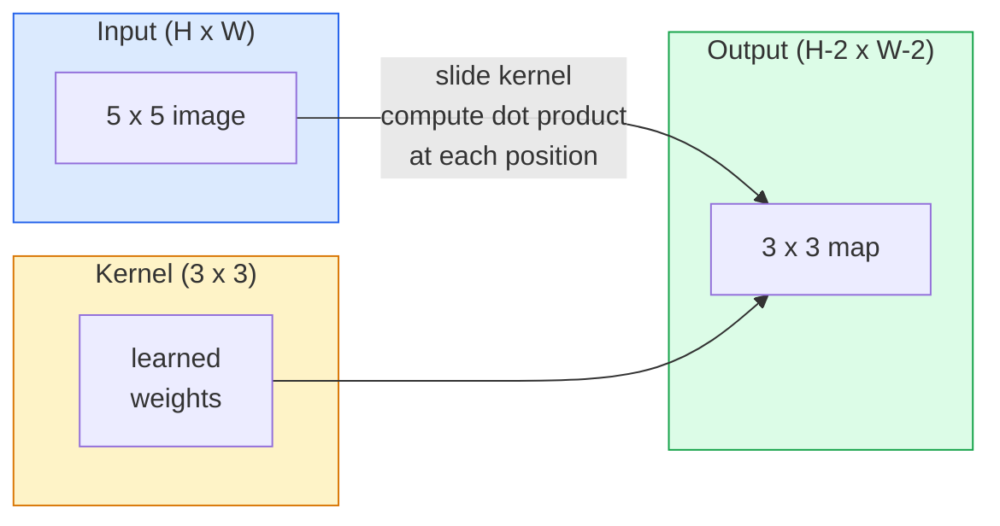
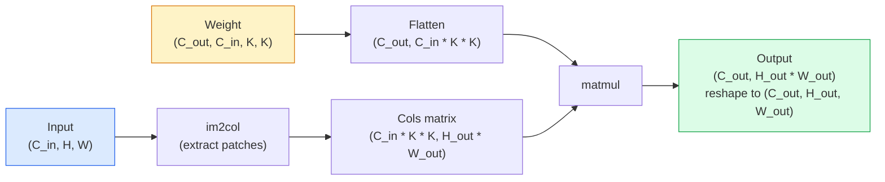

# Chuyển đổi từ không

> Sự xoắn ốc là một lớp dày đặc rất nhỏ, bạn trượt qua một bức ảnh, và chia sẻ cùng một nhóm trọng lượng ở mỗi vị trí.

**Type:** Build
**Languages:** Python
**Prerequisites:** Phase 3 (Deep Learning Core), Phase 4 Lesson 01 (Image Fundamentals)
**Time:** ~75 分钟

## Học mục tiêu
- Chỉ sử dụng NumPy từ zero thực hiện 2D convolution, bao gồm nested-loop  phiên bản và vectorized `im2col`版本
- 针对 input size、kernel size、padding 和 step 的任意组合,计算输出空间尺寸,并解释 `(H - K + 2P) / S + 1`公式为什么成立
- 手工设计 kernels ((edge、blur、sharpen、Sobel),并解释 mỗi vì sao sẽ xảy ra các hoạt động đối phó
- Chuyển các biến động  xếp vào một bộ khai thác tính năng, và kết nối độ sâu của sự xếp vào kích thước của trường thụ thể

## 问题
Trong một bức ảnh RGB 224x224 sử dụng một lớp kết nối hoàn toàn, mỗi tế bào thần kinh 需要224 * 224 * 3 = 150,528 输入权重. Một lớp ẩn chỉ có 1.000 đơn vị đã có 1.5 tỷ tham số, và điều này cũng là trước khi bạn học được bất cứ điều gì hữu ích.

图像模型 cần hai tính chất:**translation equivariance**(输入移动时输出也随其移动) và **parameter sharing**(同一个功能探测器 在所有位置运行) ――Cơn lớp dày đặc 两者都不给你――Convolution 两者都天然具备――

Convolution không phải là phát minh cho Deep Learning. Nó cũng là một hoạt động tương tự trong việc nén JPEG, phát hiện các mờ mờ Gaussian trong Photoshop, và gần như tất cả các bộ lọc âm thanh. CNN từ năm 2012 đến năm 2020 đã dẫn dắt ImageNet là vì, convolution là một cách phù hợp với loại dữ liệu này.

## 概念
### Một hạt nhân, trượt

2D convolution sẽ lấy một khối lượng nhỏ được gọi là hạt nhân, sẽ trượt qua đầu vào, và trong mỗi vị trí tính toán từng phần tử nhân số và.



Một ví dụ cụ thể 3x3, nhập vào 5x5 ((không đệm, bước 1):

```
Input X (5 x 5):                Kernel W (3 x 3):

  1  2  0  1  2                   1  0 -1
  0  1  3  1  0                   2  0 -2
  2  1  0  2  1                   1  0 -1
  1  0  2  1  3
  2  1  1  0  1

The kernel slides across every valid 3 x 3 window. Output Y is 3 x 3:

 Y[0,0] = sum( W * X[0:3, 0:3] )
 Y[0,1] = sum( W * X[0:3, 1:4] )
 Y[0,2] = sum( W * X[0:3, 2:5] )
 Y[1,0] = sum( W * X[1:4, 0:3] )
 ... and so on
```

Đây là một công thức, đó là**shared weights、locality、sliding window**,就是完整思想. Tất cả những thứ khác đều là kế toán.

### Công thức kích thước sản xuất

给定输入空间尺寸 `H`、 kích thước hạt nhân `K`、đóng đệm `P`、 bước đi `S`- Có thể là:

```
H_out = floor( (H - K + 2P) / S ) + 1
```

Hãy nhớ nó. Bạn sẽ tính toán nó vài lần trong mỗi kiến trúc.

| Scenario | H | K | P | S | H_out |
|----------|---|---|---|---|-------|
| Valid conv，无 padding | 32 | 3 | 0 | 1 | 30 |
| Same conv（保持尺寸） | 32 | 3 | 1 | 1 | 32 |
| 按 2 倍 downsample | 32 | 3 | 1 | 2 | 16 |
| Pool 2x2 | 32 | 2 | 0 | 2 | 16 |
| 大 receptive field | 32 | 7 | 3 | 2 | 16 |

"Đồng độ đệm" có nghĩa là chọn P, để làm cho khi S == 1 时 H_out == H。 đối với số kỳ lạ K, cũng là P = (K - 1) / 2。 Đó là lý do tại sao các hạt nhân 3x3 chiếm vị trí chủ yếu: chúng vẫn có hạt nhân kỳ lạ tối thiểu ở trung tâm điểm。

### Đánh đệm

Không đệm, mỗi lần xoay quanh sẽ làm giảm bản đồ tính năng. Sau khi xếp 20 lần, 224x224 hình ảnh của bạn sẽ trở thành 184x184, điều này cũng làm cho việc tính toán trên biên giới lãng phí, cũng sẽ khiến cho các kết nối còn lại của hình dạng phù hợp trở nên phức tạp.

```
Zero padding (P = 1) on a 5 x 5 input:

  0  0  0  0  0  0  0
  0  1  2  0  1  2  0
  0  0  1  3  1  0  0
  0  2  1  0  2  1  0       Now the kernel can centre on pixel
  0  1  0  2  1  3  0       (0, 0) and still have three rows and
  0  2  1  1  0  1  0       three columns of values to multiply.
  0  0  0  0  0  0  0
```

实践中会遇到的模式:`zero`(đối thường thấy)`reflect`(镜像边缘, trong các mô hình tạo tránh biên giới cứng)`replicate`(复制边缘)`circular`(环绕, trong các vấn đề toroidal 中使用)

### Động thái

Lần bước là bước trượt dài.`stride=1`Đó là giá trị được xác định.`stride=2`会让空间维度减半, trong CNN không sử dụng lớp hợp nhất riêng lẻ mà thực hiện theo cách cổ điển. Mỗi loại kiến trúc hiện đại (ResNet,ConvNeXt,MobileNet) đều ở đâu đó sử dụng các conv ích cấp  thay thế max-pool).

```
Stride 1 on a 5 x 5 input, 3 x 3 kernel:

  starts: (0,0) (0,1) (0,2)        -> output row 0
          (1,0) (1,1) (1,2)        -> output row 1
          (2,0) (2,1) (2,2)        -> output row 2

  Output: 3 x 3

Stride 2 on the same input:

  starts: (0,0) (0,2)              -> output row 0
          (2,0) (2,2)              -> output row 1

  Output: 2 x 2
```

### Nhiều kênh nhập

Thực tế hình ảnh có ba kênh. RGB  nhập 3x3 convolution  thực tế là một 3x3x3 体积: mỗi kênh nhập có một 3x3 切片.

```
Input:   (C_in,  H,  W)        3 x 5 x 5
Kernel:  (C_in,  K,  K)        3 x 3 x 3 (one kernel)
Output:  (1,     H', W')       2D map

For a layer that produces C_out output channels, you stack C_out kernels:

Weight:  (C_out, C_in, K, K)   e.g. 64 x 3 x 3 x 3
Output:  (C_out, H', W')       64 x 3 x 3

Parameter count: C_out * C_in * K * K + C_out   (the + C_out is biases)
```

Cuối cùng là bạn lập kế hoạch mô hình khi sẽ tính toán nội dung.`64 * 3 * 3 * 3 + 64 = 1,792`个参数―― rất dễ dàng――

### Trù của Im2col

Các vòng tròn  dễ đọc, nhưng rất chậm. GPU  muốn là các nhân vật ma trận lớn.



Mỗi sản xuất cấp conv 实现 đều là cái này nghĩ thêm vào cache-tiling 技巧的某种变体(直 conv  Winograd 大内核使用FFT conv) 

### Vùng tiếp nhận

单个3x3 conv 会查看9 输入像素――堆叠两个3x3 conv,第二层中的一个神经元 会查看5x5 输入像素――三个3x3 conv 给出7x7――一般来说:

```
RF after L stacked K x K convs (stride 1) = 1 + L * (K - 1)

With strides:   RF grows multiplicatively with stride along each layer.
```

Lý do cơ bản của "一路 3x3" có thể hiệu quả là, hai conv 3x3  nhìn thấy khu vực nhập với một conv 5x5 tương tự, nhưng số参数 ít hơn, và giữa nhiều một không tuyến tính.


```figure
convolution-kernel
```

##  xây dựng nó
### 步骤 1: Pad một mảng

Từ tối thiểu nguyên thủy  bắt đầu: một trong các hàm H x W mảng  xung quanh bổ sung 0.

```python
import numpy as np

def pad2d(x, p):
    if p == 0:
        return x
    h, w = x.shape[-2:]
    out = np.zeros(x.shape[:-2] + (h + 2 * p, w + 2 * p), dtype=x.dtype)
    out[..., p:p + h, p:p + w] = x
    return out

x = np.arange(9).reshape(3, 3)
print(x)
print()
print(pad2d(x, 1))
```

trục trục trục trục trục trục trục trục trục trục trục trục trục trục trục trục trục trục trục trục trục trục trục trục trục trục trục trục trục trục trục trục trục trục trục trục trục trục trục trục trục trục trục trục trục trục trục trục trục trục trục trục trục trục trục trục trục trục trục trục trục trục trục trục trục trục trục trục trục trục trục trục trục trục trục trục trục trục trục trục trục trục trục trục trục trục trục trục trục trục trục trục trục trục trục trục trục trục trục trục trục trục trục trục trục trục trục trục trục trục trục trục trục trục trục trục trục trục trục trục trục trục trục trục trục trục trục trục trục trục trục trục trục trục trục trục trục trục trục trục trục trục trục trục trục trục trục trục trục trục trục trục trục trục trục trục trục trục trục trục trục trục trục trục trục trục trục trục trục trục trục trục trục trục trục trục trục trục trục trục trục trục trục trục trục trục trục trục trục trục trục trục tr trục trục tr tr tr trục trục tr tr tr tr tr tr tr tr tr tr tr trục trục tr tr tr tr tr tr tr tr tr tr tr tr tr tr tr tr tr tr tr tr tr trục tr tr tr tr tr tr tr tr tr tr tr tr trục tr tr tr tr tr tr tr tr tr tr tr tr tr tr tr tr tr tr tr tr tr tr tr tr tr tr tr tr tr tr tr tr tr tr tr`x.shape[:-2]`Ý nghĩa là, cùng một hàm không cần phải sửa đổi có thể tác dụng vào `(H, W)``(C, H, W)`Hoặc`(N, C, H, W)`

### Bước 2: Sử dụng vòng lặp嵌套 để thực hiện sự xoay quanh 2D

参考实现:慢,但毫不含糊. Về cơ bản, đây là`torch.nn.functional.conv2d`Làm gì đó.

```python
def conv2d_naive(x, w, b=None, stride=1, padding=0):
    c_in, h, w_in = x.shape
    c_out, c_in_w, kh, kw = w.shape
    assert c_in == c_in_w

    x_pad = pad2d(x, padding)
    h_out = (h + 2 * padding - kh) // stride + 1
    w_out = (w_in + 2 * padding - kw) // stride + 1

    out = np.zeros((c_out, h_out, w_out), dtype=np.float32)
    for oc in range(c_out):
        for i in range(h_out):
            for j in range(w_out):
                hs = i * stride
                ws = j * stride
                patch = x_pad[:, hs:hs + kh, ws:ws + kw]
                out[oc, i, j] = np.sum(patch * w[oc])
        if b is not None:
            out[oc] += b[oc]
    return out
```

4 vòng tròn tròn tròn tròn tròn tròn tròn tròn tròn tròn tròn tròn tròn tròn tròn tròn tròn tròn tròn tròn tròn tròn tròn tròn tròn tròn tròn tròn tròn tròn tròn tròn tròn tròn tròn tròn tròn tròn tròn tròn tròn tròn tròn tròn tròn tròn tròn tròn tròn tròn tròn tròn tròn tròn tròn tròn tròn tròn tròn tròn tròn tròn tròn tròn tròn tròn tròn tròn tròn tròn tròn tròn tròn tròn tròn tròn tròn tròn tròn tròn tròn tròn tròn tròn tròn tròn tròn tròn tròn tròn tròn tròn tròn tròn tròn tròn tròn tròn tròn tròn tròn tròn tròn tròn tròn tròn tròn tròn tròn tròn tròn tròn tròn tròn tròn tròn tròn tròn tròn tròn tròn tròn tròn tròn tròn tròn tròn tròn tròn tròn tròn tròn tròn tròn tròn tròn tròn tròn tròn tròn tròn tròn tròn tròn tròn tròn tròn tròn tròn tròn tròn tròn tròn tròn tròn tròn tròn tròn tròn tròn tròn tròn tròn tròn tròn tròn tròn tròn tròn tròn tròn tròn tròn tròn tròn tròn tròn tròn tròn tròn tròn tròn tròn tròn tròn tròn tròn tròn tròn tròn tròn tròn tròn tròn tròn tròn tròn tròn tròn tròn tròn tròn tròn tròn tròn tròn tròn tròn tròn tròn tròn tròn tròn tròn tròn tròn tròn tròn tròn tròn tròn tròn tròn tròn tròn tròn tròn tròn tròn tròn tròn tròn tròn tròn tròn tròn tròn tròn tròn tròn tròn tròn tròn tròn tròn tròn tròn tròn tròn tròn tròn tròn tròn tròn

### Bước 3: Kiểm tra hạt nhân được thiết kế bằng tay

Xây dựng một hạt nhân Sobel dọc, đưa nó vào một hình ảnh bước tổng hợp, sau đó quan sát cạnh dọc được chiếu sáng.

```python
def synthetic_step_image():
    img = np.zeros((1, 16, 16), dtype=np.float32)
    img[:, :, 8:] = 1.0
    return img

sobel_x = np.array([
    [[-1, 0, 1],
     [-2, 0, 2],
     [-1, 0, 1]]
], dtype=np.float32)[None]

x = synthetic_step_image()
y = conv2d_naive(x, sobel_x, padding=1)
print(y[0].round(1))
```

预期在第7列出现较大的正值 ((从左到右亮度增加),其他位置为零――这个印就是你确认数学正确的智能检查――

### 步骤 4: im2col

把输入中每个核尺寸窗口 转换为矩阵的一列──对`C_in=3, K=3`, mỗi hàng là 27 con số.

```python
def im2col(x, kh, kw, stride=1, padding=0):
    c_in, h, w = x.shape
    x_pad = pad2d(x, padding)
    h_out = (h + 2 * padding - kh) // stride + 1
    w_out = (w + 2 * padding - kw) // stride + 1

    cols = np.zeros((c_in * kh * kw, h_out * w_out), dtype=x.dtype)
    col = 0
    for i in range(h_out):
        for j in range(w_out):
            hs = i * stride
            ws = j * stride
            patch = x_pad[:, hs:hs + kh, ws:ws + kw]
            cols[:, col] = patch.reshape(-1)
            col += 1
    return cols, h_out, w_out
```

Nó vẫn là vòng Python, nhưng bây giờ tính toán nặng sẽ trở thành một matmul vectorized.

### Bước 5: Thông qua im2col + matmul 实现快速 conv

Sử dụng một lần nhân tử liệu thay thế vòng lặp bốn lần.

```python
def conv2d_im2col(x, w, b=None, stride=1, padding=0):
    c_out, c_in, kh, kw = w.shape
    cols, h_out, w_out = im2col(x, kh, kw, stride, padding)
    w_flat = w.reshape(c_out, -1)
    out = w_flat @ cols
    if b is not None:
        out += b[:, None]
    return out.reshape(c_out, h_out, w_out)
```

Chuyên nghiệm chính xác: 2 thực hiện và so sánh:

```python
rng = np.random.default_rng(0)
x = rng.normal(0, 1, (3, 16, 16)).astype(np.float32)
w = rng.normal(0, 1, (8, 3, 3, 3)).astype(np.float32)
b = rng.normal(0, 1, (8,)).astype(np.float32)

y_naive = conv2d_naive(x, w, b, padding=1)
y_im2col = conv2d_im2col(x, w, b, padding=1)

print(f"max abs diff: {np.max(np.abs(y_naive - y_im2col)):.2e}")
```

`max abs diff` nên ở `1e-5`左右── sự khác biệt này đến từ điểm nổi 累加顺序, không phải lỗi──

### 步骤 6: một nhóm các hạt nhân thiết kế thủ công

5 bộ lọc, hiển thị một lớp chứa đơn trong bất kỳ bài tập nào trước khi có thể biểu hiện gì.

```python
KERNELS = {
    "identity": np.array([[0, 0, 0], [0, 1, 0], [0, 0, 0]], dtype=np.float32),
    "blur_3x3": np.ones((3, 3), dtype=np.float32) / 9.0,
    "sharpen": np.array([[0, -1, 0], [-1, 5, -1], [0, -1, 0]], dtype=np.float32),
    "sobel_x": np.array([[-1, 0, 1], [-2, 0, 2], [-1, 0, 1]], dtype=np.float32),
    "sobel_y": np.array([[-1, -2, -1], [0, 0, 0], [1, 2, 1]], dtype=np.float32),
}

def apply_kernel(img2d, kernel):
    x = img2d[None].astype(np.float32)
    w = kernel[None, None]
    return conv2d_im2col(x, w, padding=1)[0]
```

 áp dụng cho hình ảnh dạ dày màu xám bất kỳ lúc nào, mờ mờ, sắc nét sẽ làm cho cạnh sáng hơn, Sô-bên-x sẽ làm sáng hơn các cạnh thẳng đứng, Sô-bên-y sẽ làm sáng hơn các cạnh ngang.

## Sử dụng nó
PyTorch của `nn.Conv2d`Sử dụng tự cấp  CUDA hạt nhân và cuDNN tối ưu hóa 包装了同一个操作──形态语义 完全相同──

```python
import torch
import torch.nn as nn

conv = nn.Conv2d(in_channels=3, out_channels=64, kernel_size=3, stride=1, padding=1)
print(conv)
print(f"weight shape: {tuple(conv.weight.shape)}   # (C_out, C_in, K, K)")
print(f"bias shape:   {tuple(conv.bias.shape)}")
print(f"param count:  {sum(p.numel() for p in conv.parameters())}")

x = torch.randn(8, 3, 224, 224)
y = conv(x)
print(f"\ninput  shape: {tuple(x.shape)}")
print(f"output shape: {tuple(y.shape)}")
```

- Đưa đi.`padding=1`换成 `padding=0`, 输遇降至222x222 `stride=1`换成 `stride=2`, mất gặp xuống 112x112... đó là cùng một công thức mà bạn nhớ ở trên.

## 交付 nó
本课会产出:

- `outputs/prompt-cnn-architect.md`: một prompt, cho định lượng đầu vào, số parameter ngân sách và mục tiêu lĩnh vực nhận thức, thiết kế`Conv2d`Lớp, và mỗi bước sử dụng đúng K/S/P
- `outputs/skill-conv-shape-calculator.md`Một kỹ năng, từng tầng qua các thông số mạng,并 quay lại hình dạng đầu ra của mỗi khối, lĩnh vực nhận và số parameter.

## 练习
1. **(Easy)**Đặt một quy mô màu xám 128x128 输入,以及一组 `[Conv3x3(s=1,p=1), Conv3x3(s=2,p=1), Conv3x3(s=1,p=1), Conv3x3(s=2,p=1)]`, thủ công tính toán kích thước không gian xuất và lĩnh vực nhận thức của mỗi tầng.`nn.Sequential` tiến hành kiểm tra.
2. **(Medium)**扩展 `conv2d_naive`和 `conv2d_im2col`, để họ chấp nhận `groups`参数―― chứng minh `groups=C_in=C_out`có thể có thể có một sự xoay quanh chiều sâu, và số parameter của nó là `C * K * K`, thay vì `C * C * K * K`
3. **(Hard)**手工实现 `conv2d_im2col`Đường chuyển ngược:给定输出 Gradient,计算 `x`和 `w`của Gradient. trong cùng đầu vào và trọng lượng trên cùng với`torch.autograd.grad`验证──关键技巧是:im2col 的 Gradient 是`col2im`Và nó phải được thêm cửa sổ.

## 关键术语
| Term | What people say | What it actually means |
|------|----------------|----------------------|
| Convolution | “滑动一个 filter” | 一个在每个空间位置用 shared weights 应用的可学习 dot product；数学上是 cross-correlation，但大家都叫它 convolution |
| Kernel / filter | “feature detector” | 一个形状为 (C_in, K, K) 的小型 weight tensor，它与输入窗口的 dot product 会产生一个输出像素 |
| Stride | “每次跳多远” | 连续 kernel placements 之间的步长；stride 2 会让每个空间维度减半 |
| Padding | “边缘上的零” | 在输入周围添加的额外值，使 kernel 可以以边界像素为中心；`same` padding 会让输出尺寸等于输入尺寸 |
| Receptive field | “neuron 能看到多少” | 某个输出 activation 所依赖的原始输入 patch，会随着深度和 stride 增长 |
| im2col | “GEMM trick” | 把每个 receptive window 重排成列，让 convolution 变成一次大型 matrix multiply，这是每个快速 conv kernel 的核心 |
| Depthwise conv | “每个 channel 一个 kernel” | 一个满足 `groups == C_in` 的 conv，每个输出 channel 只由匹配的输入 channel 计算得到；是 MobileNet 和 ConvNeXt 的 backbone |
| Translation equivariance | “输入平移，输出平移” | 输入平移 k 个像素时，输出也平移 k 个像素的性质；shared weights 天然带来这个性质 |

## 延伸阅读
- [A guide to convolution arithmetic for deep learning (Dumoulin & Visin, 2016)](https://arxiv.org/abs/1603.07285) Mỗi门课程都会借鉴 của bọc / bước / mở rộng 权威图解
- [CS231n: Convolutional Neural Networks for Visual Recognition](https://cs231n.github.io/convolutional-networks/) 经典 bài giảng ghi chú, bao gồm các đầu tiên im2col  giải thích
- [The Annotated ConvNet (fast.ai)](https://nbviewer.org/github/fastai/fastbook/blob/master/13_convolutions.ipynb) Một cuốn sổ ghi chép từ con đường viết tay 走到训练 số phân loại
- [Receptive Field Arithmetic for CNNs (Dang Ha The Hien)](https://distill.pub/2019/computing-receptive-fields/) 具備论文级质量的接收场 计算交互式讲解器
