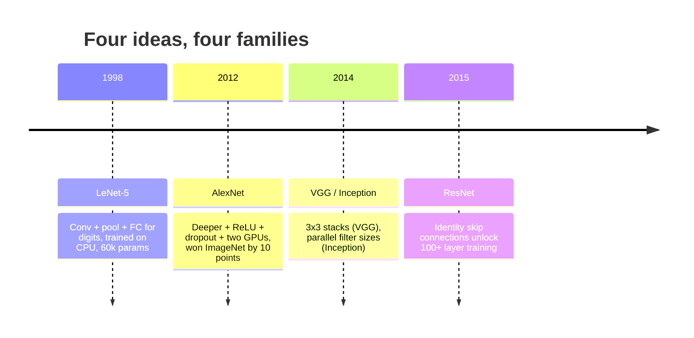
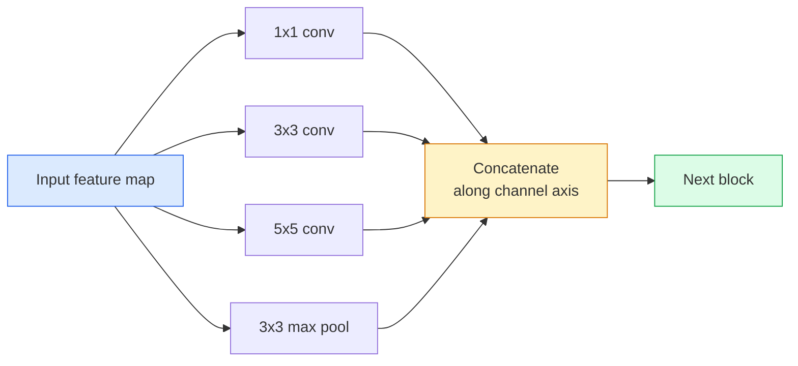
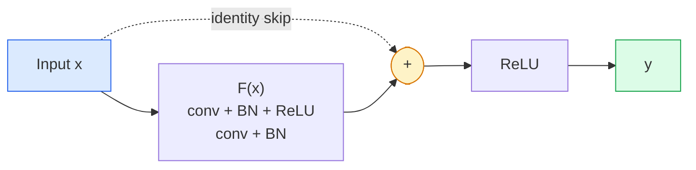

# CNNs  LeNet đến ResNet

> Trong 3 thập kỷ qua, mỗi CNN quan trọng, về bản chất đều là một con số không tuyến tính  downsample 配方, thêm vào một ý tưởng mới.

**Type:** 学习 + 构建
**Languages:** Python
**先修要求：**Giai đoạn 3 Bài học 11 (PyTorch), Giai đoạn 4 Bài học 01 (Tầm nhìn về hình ảnh), Giai đoạn 4 Bài học 02 (Tình hình từ đầu)
**Time:** ~75 分钟

## Học mục tiêu
- 追踪 LeNet-5 -> AlexNet -> VGG -> Inception -> ResNet's architecture,并说明每个家庭贡献的单一新想法
- Trong PyTorch thực hiện LeNet-5 、 một khối kiểu VGG, cũng như một ResNet BasicBlock, mỗi điều khiển trong 40 行
-  Giải thích tại sao các kết nối còn lại có thể biến một mạng không thể huấn luyện được 1000 tầng thành hiện đại
- 阅读一个现代脊柱 (ResNet-18, ResNet-50), và xem xem nguồn码前预测 hình thức đầu ra của nó、 lĩnh vực nhận và số parameter

## 问题
Năm 2011, độ chính xác 5 trong top 5 của phân loại ImageNet là khoảng 74%[6]. Năm 2012 AlexNet đạt 85%[6]. Năm 2015 ResNet đạt 96%[6]. Không có dữ liệu mới[6]. Không có GPU mới nào[6]. nâng cao từ ý tưởng cấu trúc[6]. Một kỹ sư tầm nhìn có thể làm việc phải biết ý tưởng nào đến từ bài luận nào, bởi vì bạn sẽ phát hành vào năm 2026 mỗi sản xuất, đều là xương sống của các thành phần này; cũng vì những ý tưởng này sẽ tiếp tục di chuyển: các conv tập hợp từ CNN di chuyển sang biến đổi, kết nối dư thừa từ ResNet di chuyển sang tồn tại trong mỗi LLM, chuẩn hóa hàng loạt hiện có trong các mô hình truyền tải.

按顺序学习这些网络也能让你避免一个常见错误: Trong mạng LeNet kích thước 就能解决问题时,直接使用可用的最大模型――MNIST không cần ResNet――了解每个家庭的规模曲线,能告诉你应该落在曲线的位置――

## 概念
###  thay đổi tầm nhìn của bốn ý tưởng



Trong tầm nhìn cổ điển, không có gì quan trọng hơn 4 lần này.

### LeNet-5 (1998)

Yann LeCun's digit recognitioner──60,000 个参数── hai khối conv-pool── hai lớp kết nối hoàn toàn──tanh activations── nó xác định từng mô hình của CNN:

```
input (1, 32, 32)
  conv 5x5 -> (6, 28, 28)
  avg pool 2x2 -> (6, 14, 14)
  conv 5x5 -> (16, 10, 10)
  avg pool 2x2 -> (16, 5, 5)
  flatten -> 400
  dense -> 120
  dense -> 84
  dense -> 10
```

现代世界所说的CNN,即交替转变和下样再接一个小型分类器头,本质上就是层数更多的频道 更大的激活更好的LeNet──

### AlexNet (2012)

Ba biến động kết hợp đã phá vỡ ImageNet:

1. 用 **ReLU**替代 tanh──Gradients 不再消失──训练速度提升六倍──
2. Trong đầu được kết nối đầy đủ 中使用 **Dropout**❖ Quy định hóa  biến thành một lớp, thay vì một kỹ thuật ❖
3. **Depth and width**❖ 5 lớp conve, 3 lớp dày đặc, 60M tham số, trên 2 khối GPU trên tập luyện,并把模型 chia thành 2 khối卡上――

Hình 2 của bài luận vẫn cho thấy chia GPU, tức là hai dòng song song. Sự song song này là giải pháp giải quyết ở cấp độ phần cứng, không phải là cấu trúc; nhưng ba ý tưởng trên vẫn tồn tại trong mỗi mô hình bạn sử dụng.

### VGG (2014)

VGG hỏi một câu hỏi: Nếu chỉ sử dụng 3x3 biến dạng, và tiếp tục gia tăng, sẽ xảy ra gì?

```
stack:   conv 3x3 -> conv 3x3 -> pool 2x2
repeat:  16 or 19 conv layers
```

Hai conv 3x3  nhìn thấy không gian đầu vào tương tự như một conv 5x5, nhưng các tham số hơn (2 * 9 * C^2 = 18C^2 so với 25 * C^2), và giữa thêm nhiều một ReLU。 VGG Đặt quan sát này thành một cấu trúc hoàn chỉnh。 tính đơn giản của nó, đó là một loại khối phản复堆叠, để nó trở thành điểm tham chiếu sau tất cả các cấu trúc。

代价:138M tham số, huấn luyện chậm, suy luận 昂贵

### Sự khởi đầu (2014,同年)

Google trả lời về kích thước hạt nhân nào mà tôi nên sử dụng là:



Mỗi chi nhánh thành phố được chuyên dụng: 1x1 sử dụng để trộn kênh, 3x3 sử dụng để kết cấu địa phương, 5x5 sử dụng cho các mô hình lớn hơn, tập hợp sử dụng các tính năng thay đổi thay đổi; tập hợp 让下一层选择任何有用的分支.

### Vấn đề suy thoái

Đến năm 2015, VGG-19 能工作, còn VGG-32 不能── Depth 应该有帮助, nhưng sau khoảng 20 tầng, việc đào tạo mất và mất kiểm tra đều khác nhau── Đây không phải là quá phù hợp── Đây là Optimizer 无法 tìm thấy trọng lượng hữu ích, vì Gradients sẽ đi qua mỗi tầng thời gian bằng cách nhân nhỏ──

```
Plain deep network:
  y = f_L( f_{L-1}( ... f_1(x) ... ) )

Gradient wrt early layer:
  dL/dW_1 = dL/dy * df_L/df_{L-1} * ... * df_2/df_1 * df_1/dW_1

Each multiplicative term has magnitude roughly (weight magnitude) * (activation gain).
Stack 100 of them with gains < 1 and the gradient is effectively zero.
```

VGG có thể làm việc ở 19 tầng, vì chuẩn hàng loạt gần như xuất bản) để hoạt động giữ một quy mô tốt.

### ResNet (2015)

Anh ấy, Zhang, Ren, Sun đã đưa ra một kế hoạch thay đổi mọi thứ:

```
standard block:   y = F(x)
residual block:   y = F(x) + x
```

`+ x`biểu hiện lớp 总能通过把 `F(x)`推到零来选择什么都不做──一个1000层 ResNet 现在最差也不差于1层网络 差,因为 mỗi khối bổ sung đều có một lỗ thoát hiểm tầm thường── có đảm bảo này, Optimizer 愿意让每个块变得*稍微* hữu ích;而一个稍微有用的块 堆叠100次,就是最先进的──



Hai biến thể của khối này có thể thấy ở khắp mọi nơi:

- **BasicBlock**(ResNet-18, ResNet-34): 2 con tàu 3x3, nhảy qua 2 người
- **Bottleneck**(ResNet-50, -101, -152): 1x1 xuống, 3x3 trung, 1x1 lên, nhảy 跨过三者──当频道数量 很高时更便宜──

Khi skip  phải vượt qua downsample (stride=2) 时, path của ID sẽ được thay thế thành một 1x1 step=2 conv, để phù hợp hình dạng.

### Tại sao dư lượng của ý nghĩa vượt qua tầm nhìn

Ý tưởng này thực sự quan tâm không phải đến phân loại hình ảnh. Nó quan tâm đến việc chuyển các mạng sâu từ  cầu nguyện Gradients 能幸存下来 thành công cụ kỹ thuật đáng tin cậy, có thể mở rộng. Bạn sẽ đọc trong giai đoạn tiếp theo mỗi biến thể, trong mỗi khối có kết nối bỏ qua hoàn toàn giống nhau. Không ResNet, không GPT.


```figure
pooling
```

##  xây dựng nó
### 步骤 1: LeNet-5

Một mạng lưới nhỏ nhất và trung thực.`nn.CrossEntropyLoss`, thay vì các kết nối Gaussian ban đầu.

```python
import torch
import torch.nn as nn
import torch.nn.functional as F

class LeNet5(nn.Module):
    def __init__(self, num_classes=10):
        super().__init__()
        self.conv1 = nn.Conv2d(1, 6, kernel_size=5)
        self.conv2 = nn.Conv2d(6, 16, kernel_size=5)
        self.pool = nn.AvgPool2d(2)
        self.fc1 = nn.Linear(16 * 5 * 5, 120)
        self.fc2 = nn.Linear(120, 84)
        self.fc3 = nn.Linear(84, num_classes)

    def forward(self, x):
        x = self.pool(torch.tanh(self.conv1(x)))
        x = self.pool(torch.tanh(self.conv2(x)))
        x = torch.flatten(x, 1)
        x = torch.tanh(self.fc1(x))
        x = torch.tanh(self.fc2(x))
        return self.fc3(x)

net = LeNet5()
x = torch.randn(1, 1, 32, 32)
print(f"output: {net(x).shape}")
print(f"params: {sum(p.numel() for p in net.parameters()):,}")
```

Tạo sản lượng dự kiến: `output: torch.Size([1, 10])`- `params: 61,706` Đó là một phân loại chữ số hoàn chỉnh của OpenModern Vision

### 步骤 2: Một khối VGG

Một khối có thể sử dụng: hai con 3x3, ReLU, batch chuẩn, tối đa hồ bơi.

```python
class VGGBlock(nn.Module):
    def __init__(self, in_c, out_c):
        super().__init__()
        self.conv1 = nn.Conv2d(in_c, out_c, kernel_size=3, padding=1)
        self.bn1 = nn.BatchNorm2d(out_c)
        self.conv2 = nn.Conv2d(out_c, out_c, kernel_size=3, padding=1)
        self.bn2 = nn.BatchNorm2d(out_c)
        self.pool = nn.MaxPool2d(2)

    def forward(self, x):
        x = F.relu(self.bn1(self.conv1(x)))
        x = F.relu(self.bn2(self.conv2(x)))
        return self.pool(x)

class MiniVGG(nn.Module):
    def __init__(self, num_classes=10):
        super().__init__()
        self.stack = nn.Sequential(
            VGGBlock(3, 32),
            VGGBlock(32, 64),
            VGGBlock(64, 128),
        )
        self.head = nn.Sequential(
            nn.AdaptiveAvgPool2d(1),
            nn.Flatten(),
            nn.Linear(128, num_classes),
        )

    def forward(self, x):
        return self.head(self.stack(x))

net = MiniVGG()
x = torch.randn(1, 3, 32, 32)
print(f"output: {net(x).shape}")
print(f"params: {sum(p.numel() for p in net.parameters()):,}")
```

Trong đầu vào kích thước CIFAR 上 sử dụng ba khối VGG, một hồ bơi thích ứng, một lớp tuyến tính.

### 步骤 3: Một ResNet BasicBlock

Các khối xây dựng cốt lõi của ResNet-18 và ResNet-34

```python
class BasicBlock(nn.Module):
    def __init__(self, in_c, out_c, stride=1):
        super().__init__()
        self.conv1 = nn.Conv2d(in_c, out_c, kernel_size=3, stride=stride, padding=1, bias=False)
        self.bn1 = nn.BatchNorm2d(out_c)
        self.conv2 = nn.Conv2d(out_c, out_c, kernel_size=3, stride=1, padding=1, bias=False)
        self.bn2 = nn.BatchNorm2d(out_c)
        if stride != 1 or in_c != out_c:
            self.shortcut = nn.Sequential(
                nn.Conv2d(in_c, out_c, kernel_size=1, stride=stride, bias=False),
                nn.BatchNorm2d(out_c),
            )
        else:
            self.shortcut = nn.Identity()

    def forward(self, x):
        out = F.relu(self.bn1(self.conv1(x)))
        out = self.bn2(self.conv2(out))
        out = out + self.shortcut(x)
        return F.relu(out)
```

Conv lớp 上 的 `bias=False`Đó là một thói quen chuẩn hàng loạt, vì các tham số beta của BN đã xử lý sự thiên vị, vì vậy đồng thời mang theo sự thiên vị con là sự lãng phí. Chỉ khi bước hoặc số lượng kênh thay đổi,`shortcut`才需要真正的 conv;否则它就是一个无运身份――

### Bước 4: Một ResNet nhỏ

堆叠四组 BasicBlocks, nhận được một thích hợp cho các đầu vào kích thước CIFAR của ResNet có thể làm việc.

```python
class TinyResNet(nn.Module):
    def __init__(self, num_classes=10):
        super().__init__()
        self.stem = nn.Sequential(
            nn.Conv2d(3, 32, kernel_size=3, stride=1, padding=1, bias=False),
            nn.BatchNorm2d(32),
            nn.ReLU(inplace=True),
        )
        self.layer1 = self._make_group(32, 32, num_blocks=2, stride=1)
        self.layer2 = self._make_group(32, 64, num_blocks=2, stride=2)
        self.layer3 = self._make_group(64, 128, num_blocks=2, stride=2)
        self.layer4 = self._make_group(128, 256, num_blocks=2, stride=2)
        self.head = nn.Sequential(
            nn.AdaptiveAvgPool2d(1),
            nn.Flatten(),
            nn.Linear(256, num_classes),
        )

    def _make_group(self, in_c, out_c, num_blocks, stride):
        blocks = [BasicBlock(in_c, out_c, stride=stride)]
        for _ in range(num_blocks - 1):
            blocks.append(BasicBlock(out_c, out_c, stride=1))
        return nn.Sequential(*blocks)

    def forward(self, x):
        x = self.stem(x)
        x = self.layer1(x)
        x = self.layer2(x)
        x = self.layer3(x)
        x = self.layer4(x)
        return self.head(x)

net = TinyResNet()
x = torch.randn(1, 3, 32, 32)
print(f"output: {net(x).shape}")
print(f"params: {sum(p.numel() for p in net.parameters()):,}")
```

Bảng bốn, mỗi nhóm hai. 2, 3, 4 组开头使用步骤 2., mỗi lần downsample 时 kênh số lượng 翻倍.

### 步骤 5: So sánh hiệu quả từ tham số đến tính năng

Đưa cùng một đầu vào qua ba mạng, và so sánh số parameter.

```python
def summary(name, net, x):
    y = net(x)
    params = sum(p.numel() for p in net.parameters())
    print(f"{name:12s}  input {tuple(x.shape)} -> output {tuple(y.shape)}  params {params:>10,}")

x = torch.randn(1, 3, 32, 32)
summary("LeNet5",     LeNet5(),       torch.randn(1, 1, 32, 32))
summary("MiniVGG",    MiniVGG(),      x)
summary("TinyResNet", TinyResNet(),   x)
```

Đối với độ chính xác CIFAR-10, đào tạo một vài thời đại 后大致需要:LeNet 60%,MiniVGG 89%,TinyResNet 93%。

## Sử dụng nó
`torchvision.models`提供上所有模型的预训版本──不同家族的呼叫签名 完全一致,这正是脊柱抽象的意义──

```python
from torchvision.models import resnet18, ResNet18_Weights, vgg16, VGG16_Weights

r18 = resnet18(weights=ResNet18_Weights.IMAGENET1K_V1)
r18.eval()

print(f"ResNet-18 params: {sum(p.numel() for p in r18.parameters()):,}")
print(r18.layer1[0])
print()

v16 = vgg16(weights=VGG16_Weights.IMAGENET1K_V1)
v16.eval()
print(f"VGG-16   params: {sum(p.numel() for p in v16.parameters()):,}")
```

ResNet-18 có 11.7M tham số. VGG-16 có 138M. Độ chính xác hàng đầu của ImageNet gần như là (69.8% so với 71.6%) . Kết nối dư thừa mang lại hiệu quả tham số 12x cho bạn. Đó là lý do tại sao từ năm 2016 đến ViT trước khi xuất hiện vào năm 2021, các biến thể của ResNet đã chiếm ưu thế và vẫn chiếm ưu thế trong việc triển khai thực tế trong máy tính bị hạn chế.

Đối với việc học chuyển, phương pháp luôn giống nhau: tải trước khi được đào tạo, đóng băng xương sống, thay thế đầu phân loại.

```python
for p in r18.parameters():
    p.requires_grad = False
r18.fc = nn.Linear(r18.fc.in_features, 10)
```

三行──现在你拥有一个10级CIFAR分类器,它继承了ImageNet 训练出的表示──

## 交付 nó
本课会产出:

- `outputs/prompt-backbone-selector.md`Một lời khuyên, sẽ tùy thuộc vào nhiệm vụ, kích thước bộ dữ liệu và ngân sách tính toán  chọn phù hợp với gia đình CNN (LeNet/VGG/ResNet/MobileNet/ConvNeXt)
- `outputs/skill-residual-block-reviewer.md`: một kỹ năng,会读取 PyTorch module并标记跳连接 错误( bước thay đổi 时缺少快捷径、快捷径激活顺序、BN 相对的位置)

## 练习
1. **(Easy)**手动 từng tầng tính toán`TinyResNet`Các tham số của`sum(p.numel() for p in net.parameters())`Đối với các tham số ngân sách, phần chính đã đi đâu, là convsBN, hay đầu phân loại?
2. **(Medium)**实现 Bottleneck block (1x1 -> 3x3 -> 1x1 với skip), và sử dụng nó để xây dựng một mạng ResNet-50 kiểu CIFAR.`TinyResNet`Đối với...
3. **(Hard)**Từ `BasicBlock`Trung chuyển đổi kết nối bỏ qua, trong CIFAR-10 上分别训练一个34 khối "sơn" mạng 和一个34 khối ResNet,各训练 10 epochs──绘制二者的训练损失对 epoch──复现 He et al.

## 关键术语
| Term | What people say | What it actually means |
|------|----------------|----------------------|
| Backbone | “模型” | 产生 feature map 并馈送给 task head 的 convolutional blocks 堆栈 |
| Residual connection | “Skip connection” | `y = F(x) + x`；通过将 F 设为零，让 Optimizer 学习 identity，从而让任意 depth 可训练 |
| BasicBlock | “两个带 skip 的 3x3 convs” | ResNet-18/34 的 building block：conv-BN-ReLU-conv-BN-add-ReLU |
| Bottleneck | “1x1 down，3x3，1x1 up” | ResNet-50/101/152 block；在高 channel counts 下成本低，因为 3x3 运行在缩减后的 width 上 |
| Degradation problem | “更深反而更差” | 超过约 20 个 plain conv layers 后，training error 和 test error 都会增加；由 residual connections 解决，而不是靠更多数据 |
| Stem | “第一层” | 将 3-channel input 转换为基础 feature width 的初始 conv；ImageNet 通常是 7x7 stride 2，CIFAR 通常是 3x3 stride 1 |
| Head | “分类器” | final backbone block 之后的 layers：adaptive pool、flatten、linear(s) |
| Transfer learning | “Pretrained weights” | 加载在 ImageNet 上训练过的 backbone，并且只在你的 task 上 fine-tune head |

## 延伸阅读
- [Deep Residual Learning for Image Recognition (He et al., 2015)](https://arxiv.org/abs/1512.03385) ResNet 论文; mỗi张图都值得研究
- [Very Deep Convolutional Networks (Simonyan & Zisserman, 2014)](https://arxiv.org/abs/1409.1556) VGG 论文; vẫn là hiểu  tại sao là 3x3  tốt nhất tài liệu tham khảo
- [ImageNet Classification with Deep CNNs (Krizhevsky et al., 2012)](https://papers.nips.cc/paper_files/paper/2012/hash/c399862d3b9d6b76c8436e924a68c45b-Abstract.html) AlexNet;终结 tay làm-chức năng 时代的论文
- [Going Deeper with Convolutions (Szegedy et al., 2014)](https://arxiv.org/abs/1409.4842) Sự khởi đầu v1; vẫn sẽ xuất hiện trong các biến đổi tầm nhìn Trung tâm - lọc song song  ý tưởng
