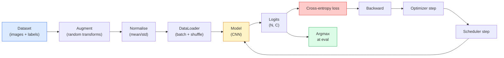

# Định dạng hình ảnh

> classifier là một hàm phân phối xác suất từ pixel đến lớp trên.

**Type:** Build
**Languages:** Python
**Prerequisites:** Phase 2 Lesson 09 (Model Evaluation), Phase 3 Lesson 10 (Mini Framework), Phase 4 Lesson 03 (CNNs)
**Time:** ~75 minutes

## Học mục tiêu

- Trong CIFAR-10 trên xây dựng đầu cuối hình ảnh phân loại đường ống: tập hợp dữ liệu, tăng cường, mô hình, vòng đào tạo, đánh giá
- 解释 từng thành phần của tác dụng của mình (data loader, loss, optimizer, scheduler, augmentation), và dự đoán bất kỳ một trong số đó sẽ xuất hiện như thế nào trong Loss 曲线
- Từ zero để đạt được hỗn hợp, cắt và làm trơn nhãn, và giải thích khi nào đáng để thêm chúng vào
- 阅读 mê hoặc matrix 和 trên bảng độ chính xác/tái nhớ mỗi lớp, sử dụng độ chính xác tổng thể  ngoài bộ dữ liệu chẩn đoán thông tin và mô hình của mô hình thất bại

## 问题

Mỗi nhiệm vụ tầm nhìn cuối cùng trên đường, ở một số cấp độ đều được chuyển sang phân loại hình ảnh. Chẩn đoán sẽ làm cho các vùng phân loại. phân loại sẽ làm cho các pixel phân loại. Khám phá sẽ làm cho các thứ tự tương tự như các lớp trung tâm.

Phần lớn lỗi phân loại không nằm trong mô hình. Chúng nằm trong đường ống dẫn: phá vỡ tiêu chuẩn hóa không có sự pha trộn, tập hợp đào tạo sẽ làm đảo ngược các nhãn, tăng cường dữ liệu được đào tạo phân chia xác nhận ô nhiễm, tỷ lệ học tập phát tán sau thời gian 30 ⋅ một trong các thiết lập chính xác có thể đạt 93% trên CIFAR-10 trên CNN, trong thiết lập phá vỡ thường chỉ có thể đạt được 70-75%, trong khi đường cong mất trông toàn bộ là rất hợp lý.

Bài học này sẽ làm việc trong toàn bộ đường ống, để mọi phần đều được kiểm tra.`torchvision.datasets`Trong bất cứ thứ gì có thể ẩn được của lỗi.

## 核心概念

### Đường ống phân loại



Mỗi dòng trong vòng này có thể chứa lỗi. Cross-entropy nhận logits thô, thay vì đầu ra softmax, vì vậy trước khi mất  làm bất cứ điều gì `model(x).softmax()`Thành phố  tính toán sai lầm của Gradient.`optimizer.zero_grad()`必须执行每一步一次;跳过它会积累渐进,看起来就像学习率极不稳定――每一个这些错误都会让学习曲线变平,但不会抛出错误――

### Cross-entropy ̊logits với softmax

phân loại sẽ tạo ra mỗi bức ảnh`C`个数字, được gọi là logits. ứng dụng softmax 会把它们转换为概率分布:

```
softmax(z)_i = exp(z_i) / sum_j exp(z_j)
```

Cross-entropy 衡量正确 class 的 âm log xác suất:

```
CE(z, y) = -log( softmax(z)_y )
        = -z_y + log( sum_j exp(z_j) )
```

Right side forma is numeric value stable forma (trước đây là hình thức số-tổng-tổng)`nn.CrossEntropyLoss`会在一个 op 中融合 softmax + NLL,并直接接收原始logits──自己先应用 softmax 几乎总是 bug,因为你计算的是 log(softmax(softmax(z))),这是一个没有意义的量──

### Tại sao tăng cường hiệu quả

CNN đối với dịch  có thiên vị inductive (được chia sẻ trọng lượng), nhưng đối với cây trồng, cúi, màu sắc, sự lắc lắc hoặc sự che giấu không có sự bất biến trong nội tại.

```
Original crop:  "dog facing left"
Flip:           "dog facing right"       <- same label, different pixels
Rotate(+15):    "dog, slight tilt"
Colour jitter:  "dog in warmer light"
RandomErasing:  "dog with patch missing"
```

Quy tắc là: tăng  phải giữ nhãn. Đối với số làm cắt và quay có thể biến 6  thành 9; Đối với bộ dữ liệu này, bạn nên sử dụng phạm vi quay nhỏ hơn,并 chọn tôn trọng các sự khác biệt cụ thể về số.

### Trộn lẫn cắt

Thông thường tăng sẽ chuyển đổi pixel, nhưng giữ nhãn vì một-sốc.**Mixup**和 **cutmix**Sẽ qua cùng lúc để phá vỡ điều này.

```
Mixup:
  lambda ~ Beta(a, a)
  x = lambda * x_i + (1 - lambda) * x_j
  y = lambda * y_i + (1 - lambda) * y_j

Cutmix:
  paste a random rectangle of x_j into x_i
  y = area-weighted mix of y_i and y_j
```

Nó có ích vì sao: mô hình không nhớ lại các mục tiêu nóng nhất, mà học tập giữa các lớp 插值── Training loss will rise, test accuracy will rise── nó là loại hình nào cũng có giá rẻ nhất nâng cấp độ bền──

### Đơn vị nhãn

- Không, không, không, không.`[0, 0, 1, 0, 0]`作为训练目标,而是用 `[eps/C, eps/C, 1-eps, eps/C, eps/C]`, trong số đó `eps`Nó ngăn chặn mô hình tạo ra bất kỳ logic cấp cao, và hầu như không tốn kém để cải thiện hiệu chuẩn.`nn.CrossEntropyLoss(label_smoothing=0.1)`

### Đánh giá ngoài độ chính xác

Độ chính xác tổng hợp sẽ che giấu sự mất cân bằng. Nếu luôn dự đoán lớp đa số, cũng có thể đạt được 90%.

- **Per-class accuracy** Mỗi lớp một số; sẽ ngay lập tức lộ ra những lớp học thiếu hiệu suất.
- **Confusion matrix** C x C lưới, trong đó hàng i col j = class i thực i được dự đoán là class j số lượng; hình dạng là đúng dự đoán, off-diagonals 才是 model 问题所在。
- **Top-1 / Top-5** Cổ số chính xác có trong số 1 hoặc 5 dự đoán hàng đầu không;Top-5 đối với ImageNet  rất quan trọng, bởi vì như Norwich Terrier 和 Norfolk Terrier những lớp như vậy 确实存在差义──
- **Calibration (ECE)** 0.8 độ tin cậy dự đoán có thực sự có 80% thời gian là đúng?


```figure
receptive-field
```

##  xây dựng nó

### 步骤 1: xác định bộ dữ liệu tổng hợp

CIFAR-10 nằm trên đĩa. Để làm cho bài học này có thể thực hiện và nhanh chóng, chúng tôi xây dựng một tập hợp dữ liệu tổng hợp trông giống như CIFAR, đó là có cấu trúc cụ thể cho lớp, mô hình phải học được hình ảnh 32x32 RGB.

```python
import numpy as np
import torch
from torch.utils.data import Dataset


def synthetic_cifar(num_per_class=1000, num_classes=10, seed=0):
    rng = np.random.default_rng(seed)
    X = []
    Y = []
    for c in range(num_classes):
        centre = rng.uniform(0, 1, (3,))
        freq = 2 + c
        for _ in range(num_per_class):
            yy, xx = np.meshgrid(np.linspace(0, 1, 32), np.linspace(0, 1, 32), indexing="ij")
            r = np.sin(xx * freq) * 0.5 + centre[0]
            g = np.cos(yy * freq) * 0.5 + centre[1]
            b = (xx + yy) * 0.5 * centre[2]
            img = np.stack([r, g, b], axis=-1)
            img += rng.normal(0, 0.08, img.shape)
            img = np.clip(img, 0, 1)
            X.append(img.astype(np.float32))
            Y.append(c)
    X = np.stack(X)
    Y = np.array(Y)
    idx = rng.permutation(len(X))
    return X[idx], Y[idx]


class ArrayDataset(Dataset):
    def __init__(self, X, Y, transform=None):
        self.X = X
        self.Y = Y
        self.transform = transform

    def __len__(self):
        return len(self.X)

    def __getitem__(self, i):
        img = self.X[i]
        if self.transform is not None:
            img = self.transform(img)
        img = torch.from_numpy(img).permute(2, 0, 1)
        return img, int(self.Y[i])
```

Mỗi lớp có màu sắc và tần số của riêng mình, thêm vào tiếng ồn Gaussian, bắt buộc mô hình học tập tín hiệu, thay vì nhớ pixel.

### 步骤 2:Tình thường hóa và tăng cường

Mỗi đường ống nhìn đều có hai biến đổi này.

```python
def standardize(mean, std):
    mean = np.array(mean, dtype=np.float32)
    std = np.array(std, dtype=np.float32)
    def _fn(img):
        return (img - mean) / std
    return _fn


def random_hflip(p=0.5):
    def _fn(img):
        if np.random.random() < p:
            return img[:, ::-1, :].copy()
        return img
    return _fn


def random_crop(pad=4):
    def _fn(img):
        h, w = img.shape[:2]
        padded = np.pad(img, ((pad, pad), (pad, pad), (0, 0)), mode="reflect")
        y = np.random.randint(0, 2 * pad)
        x = np.random.randint(0, 2 * pad)
        return padded[y:y + h, x:x + w, :]
    return _fn


def compose(*fns):
    def _fn(img):
        for fn in fns:
            img = fn(img)
        return img
    return _fn
```

Trong khi đó, trước khi thu hoạch, sử dụng tấm phản xạ, thay vì tấm không, vì khung màu đen là một tín hiệu, mô hình 会学会以一种无用的方式忽略它.

### 步骤 3:Xem

Trong giai đoạn đào tạo 内部混合两张图像 和两个标签── nó được thực hiện để chuyển đổi hàng loạt, vì vậy nó nằm gần chuyển tiếp phía trước, chứ không phải là bộ dữ liệu 内部──

```python
def mixup_batch(x, y, num_classes, alpha=0.2):
    if alpha <= 0:
        return x, torch.nn.functional.one_hot(y, num_classes).float()
    lam = float(np.random.beta(alpha, alpha))
    idx = torch.randperm(x.size(0), device=x.device)
    x_mixed = lam * x + (1 - lam) * x[idx]
    y_onehot = torch.nn.functional.one_hot(y, num_classes).float()
    y_mixed = lam * y_onehot + (1 - lam) * y_onehot[idx]
    return x_mixed, y_mixed


def soft_cross_entropy(logits, soft_targets):
    log_probs = torch.log_softmax(logits, dim=-1)
    return -(soft_targets * log_probs).sum(dim=-1).mean()
```

`soft_cross_entropy`Nó là đối với phân phối nhãn mềm của sự phân phối chéo. Khi mục tiêu 恰好是 one-hot 时, nó sẽ trở thành một 情况 热 时.

### 步骤 4: Trình tập

完整配方: xuyên qua một lần dữ liệu, mỗi lô 计算 một lần gradients, mỗi thời đại  thực hiện một bước lập trình viên。

```python
import torch
import torch.nn as nn
from torch.utils.data import DataLoader
from torch.optim import SGD
from torch.optim.lr_scheduler import CosineAnnealingLR

def train_one_epoch(model, loader, optimizer, device, num_classes, use_mixup=True):
    model.train()
    total, correct, loss_sum = 0, 0, 0.0
    for x, y in loader:
        x, y = x.to(device), y.to(device)
        if use_mixup:
            x_m, y_soft = mixup_batch(x, y, num_classes)
            logits = model(x_m)
            loss = soft_cross_entropy(logits, y_soft)
        else:
            logits = model(x)
            loss = nn.functional.cross_entropy(logits, y, label_smoothing=0.1)
        optimizer.zero_grad()
        loss.backward()
        optimizer.step()
        loss_sum += loss.item() * x.size(0)
        total += x.size(0)
        # Training accuracy vs the un-mixed labels `y` is only an approximation
        # when mixup is on (the model saw soft targets, not y). Treat it as a
        # rough progress signal; rely on val accuracy for real performance.
        with torch.no_grad():
            pred = logits.argmax(dim=-1)
            correct += (pred == y).sum().item()
    return loss_sum / total, correct / total


@torch.no_grad()
def evaluate(model, loader, device, num_classes):
    model.eval()
    total, correct = 0, 0
    loss_sum = 0.0
    cm = torch.zeros(num_classes, num_classes, dtype=torch.long)
    for x, y in loader:
        x, y = x.to(device), y.to(device)
        logits = model(x)
        loss = nn.functional.cross_entropy(logits, y)
        pred = logits.argmax(dim=-1)
        for t, p in zip(y.cpu(), pred.cpu()):
            cm[t, p] += 1
        loss_sum += loss.item() * x.size(0)
        total += x.size(0)
        correct += (pred == y).sum().item()
    return loss_sum / total, correct / total, cm
```

Mỗi lần viết vòng đào tạo , chúng ta phải kiểm tra 5 biến thể:

1. đào tạo 前调用 `model.train()`, đánh giá 前调用 `model.eval()`, sẽ thay đổi việc bỏ học và hành vi chuẩn mực.
2. Trong `.backward()`前调用 `.zero_grad()`
3. 累积 metrics 时使用 `.item()`, như vậy sẽ không làm cho đồ thị tính toán luôn sống còn.
4. đánh giá 期间使用 `@torch.no_grad()`, tiết kiệm bộ nhớ và thời gian, ngăn ngừa tai nạn nhỏ.
5. Đối với các logit thô làm argmax, thay vì đối với softmax làm argmax, kết quả giống nhau, ít một op¬¬¬¬¬¬¬¬¬¬¬¬¬¬¬¬¬¬¬¬¬¬¬¬¬¬

### Bước 5: Sắp ráp

Sử dụng trên một lớp của `TinyResNet`, tập một vài thời đại, rồi đánh giá.

```python
from main import synthetic_cifar, ArrayDataset
from main import standardize, random_hflip, random_crop, compose
from main import mixup_batch, soft_cross_entropy
from main import train_one_epoch, evaluate
# TinyResNet comes from the previous lesson (03-cnns-lenet-to-resnet).
# Adjust the import path to wherever you stored the previous lesson's code.
from cnns_lenet_to_resnet import TinyResNet  # example placeholder

X, Y = synthetic_cifar(num_per_class=500)
split = int(0.9 * len(X))
X_train, Y_train = X[:split], Y[:split]
X_val, Y_val = X[split:], Y[split:]

mean = [0.5, 0.5, 0.5]
std = [0.25, 0.25, 0.25]
train_tf = compose(random_hflip(), random_crop(pad=4), standardize(mean, std))
eval_tf = standardize(mean, std)

train_ds = ArrayDataset(X_train, Y_train, transform=train_tf)
val_ds = ArrayDataset(X_val, Y_val, transform=eval_tf)

train_loader = DataLoader(train_ds, batch_size=128, shuffle=True, num_workers=0)
val_loader = DataLoader(val_ds, batch_size=256, shuffle=False, num_workers=0)

device = "cuda" if torch.cuda.is_available() else "cpu"
model = TinyResNet(num_classes=10).to(device)
optimizer = SGD(model.parameters(), lr=0.1, momentum=0.9, weight_decay=5e-4, nesterov=True)
scheduler = CosineAnnealingLR(optimizer, T_max=10)

for epoch in range(10):
    tr_loss, tr_acc = train_one_epoch(model, train_loader, optimizer, device, 10, use_mixup=True)
    va_loss, va_acc, _ = evaluate(model, val_loader, device, 10)
    scheduler.step()
    print(f"epoch {epoch:2d}  lr {scheduler.get_last_lr()[0]:.4f}  "
          f"train {tr_loss:.3f}/{tr_acc:.3f}  val {va_loss:.3f}/{va_acc:.3f}")
```

Trên bộ dữ liệu tổng hợp, nó sẽ đạt được độ chính xác xác xác thực gần như hoàn hảo trong năm thời đại, đây chính là trọng tâm: đường ống là đúng, mô hình có thể học được thứ gì đó.

### Bước 6: đọc mã số nhầm lẫn

Chỉ dựa vào độ chính xác, không thể nói cho bạn mô hình ở đâu thất bại.

```python
def print_confusion(cm, labels=None):
    c = cm.shape[0]
    labels = labels or [str(i) for i in range(c)]
    print(f"{'':>6}" + "".join(f"{l:>5}" for l in labels))
    for i in range(c):
        row = cm[i].tolist()
        print(f"{labels[i]:>6}" + "".join(f"{v:>5}" for v in row))
    print()
    tp = cm.diag().float()
    fp = cm.sum(dim=0).float() - tp
    fn = cm.sum(dim=1).float() - tp
    prec = tp / (tp + fp).clamp_min(1)
    rec = tp / (tp + fn).clamp_min(1)
    f1 = 2 * prec * rec / (prec + rec).clamp_min(1e-9)
    for i in range(c):
        print(f"{labels[i]:>6}  prec {prec[i]:.3f}  rec {rec[i]:.3f}  f1 {f1[i]:.3f}")

_, _, cm = evaluate(model, val_loader, device, 10)
print_confusion(cm)
```

行是真实类,列是预测. Trong khi đó, giữa lớp 3 và 5 có một số lượng ngoại hình, có nghĩa là mô hình đã kết hợp hai loại này,并为定向数据收集或类别增强提供起点.

## Sử dụng nó

`torchvision`Để thực hiện CIFAR-10, toàn bộ đường ống chỉ cần bốn đường, thêm một vòng huấn luyện nữa.

```python
from torchvision.datasets import CIFAR10
from torchvision.transforms import Compose, RandomCrop, RandomHorizontalFlip, ToTensor, Normalize

mean = (0.4914, 0.4822, 0.4465)
std = (0.2470, 0.2435, 0.2616)
train_tf = Compose([
    RandomCrop(32, padding=4, padding_mode="reflect"),
    RandomHorizontalFlip(),
    ToTensor(),
    Normalize(mean, std),
])
eval_tf = Compose([ToTensor(), Normalize(mean, std)])

train_ds = CIFAR10(root="./data", train=True,  download=True, transform=train_tf)
val_ds   = CIFAR10(root="./data", train=False, download=True, transform=eval_tf)
```

Có hai điểm cần lưu ý: nghĩa là /std là **dataset-specific**Trong đó, chúng được tính toán trên bộ đào tạo CIFAR-10, chứ không phải là ImageNet; Reflect Pad là chính sách trồng trọt mặc định của cộng đồng.

## 交付 nó

本课会产出:

- `outputs/prompt-classifier-pipeline-auditor.md`Một bản ghi chép đào tạo kiểm toán nhanh chóng, không đáp ứng được 5 biến thể trên, và tiết lộ vi phạm thứ nhất.
- `outputs/skill-classification-diagnostics.md` Một kỹ năng, cho phép mã số nhầm lẫn và tên lớp 列表后,总结 per class failures,并提出最有影响力的单个修复――

## 练习

1. **(Easy)**Trên bộ dữ liệu tổng hợp, sử dụng cùng một mô hình phân biệt đào tạo có hỗn hợp và không hỗn hợp phiên bản, mỗi đào tạo năm thời đại.
2. **(Medium)**实现 Cutout: trong mỗi张 training image 中随机把一个8x8 方块置零,并运行ablation,对比无增长、hflip+crop、hflip+crop+cutout、hflip+crop+mixup。报告每种设置的 val精度──
3. **(Hard)** xây dựng đường ống CIFAR-100 ((100 lớp, cùng kích thước đầu vào),并复现一次 ResNet-34 chạy đào tạo, làm cho kết quả và sự khác biệt về độ chính xác được xuất bản là 1% 以内。

## 关键术语

| Term | 人们通常怎么说 | 它实际是什么意思 |
|------|----------------|----------------------|
| Logits | “Raw outputs” | 每张图像对应的 pre-softmax C 维 Vector；cross-entropy 期望接收它们，而不是 softmaxed values |
| Cross-entropy | “The loss” | 正确 class 的 negative log-probability；在一个稳定 op 中结合 log-softmax 和 NLL |
| DataLoader | “The batcher” | 用 shuffling、batching 和（可选）multi-worker loading 包装 dataset；一半 training bugs 都会被怪到它头上 |
| Augmentation | “Random transforms” | training time 的任何 pixel-level transform，只要它保留 label；教会 CNN 它原生不具备的 invariances |
| Mixup / Cutmix | “Mix two images” | 同时混合 inputs 和 labels，让 classifier 学习平滑插值，而不是硬边界 |
| Label smoothing | “Softer targets” | 用 (1-eps, eps/(C-1), ...) 替换 one-hot；改善 calibration，并略微提升 accuracy |
| Top-k accuracy | “Top-5” | 正确 class 位于 k 个最高 probability predictions 之中；用于包含真实歧义 classes 的 datasets |
| Confusion matrix | “Where errors live” | C x C table，其中 entry (i, j) 统计 true class i 被预测为 j 的 images 数量；diagonal 是正确项，off-diagonal 告诉你该修什么 |

## 延伸阅读

- [CS231n: Training Neural Networks](https://cs231n.github.io/neural-networks-3/)  vẫn là đối với đào tạo ống dẫn
- [Bag of Tricks for Image Classification (He et al., 2019)](https://arxiv.org/abs/1812.01187) Tất cả các kỹ thuật nhỏ hợp tác, có thể làm cho ImageNet trên độ chính xác ResNet tăng 3-4%
- [mixup: Beyond Empirical Risk Minimization (Zhang et al., 2017)](https://arxiv.org/abs/1710.09412) Báo hỗn hợp ban đầu; 3 trang lý thuyết cộng với các thí nghiệm thuyết phục
- [Why temperature scaling matters (Guo et al., 2017)](https://arxiv.org/abs/1706.04599)Bài báo này chứng minh mạng hiện đại có sự sai cân bằng, và đã sửa nó bằng một tham số quy mô.
