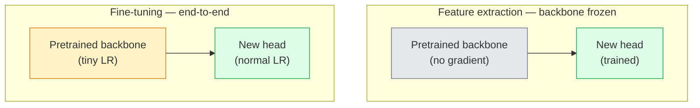

# Chuyển tập và điều chỉnh tốt

> Người khác đã chi hàng triệu GPU, cho một mạng lưới thần kinh  nhận dạng các cạnh, cấu trúc và phần vật thể là như thế nào. Trước khi đào tạo mô hình của bạn, bạn nên vay những tính năng này.

**Type:** Build
**Languages:** Python
**Prerequisites:** Phase 4 Lesson 03 (CNNs), Phase 4 Lesson 04 (Image Classification)
**Time:** ~75 minutes

## Học mục tiêu
- 区分 tính năng khai thác và điều chỉnh tinh tế,并 dựa trên kích thước tập dữ liệu, khoảng cách miền và ngân sách tính toán  chọn phương pháp thích hợp
- Lên xương sống đã được đào tạo trước, thay thế đầu phân loại của nó, và chỉ được đào tạo đầu trong 20 行  có sẵn cơ sở
- Sử dụng tỷ lệ học tập phân biệt 逐步解 lớp, để làm cho các tính năng chung sớm của bản cập nhật nhỏ hơn các tính năng cụ thể nhiệm vụ giai đoạn sau
- 诊断三类常见失败: khối không đóng băng 上 LR 过高导致 tính năng drift、mặt dữ liệu trên BN thống kê sụp đổ, cũng như quên lãng thảm khốc

## 问题
Trong ImageNet, đào tạo một ResNet-50 mất khoảng 2.000 giờ GPU. Rất ít nhóm có thể thực hiện nhiệm vụ này cho mỗi nhiệm vụ trên mạng. Hầu như tất cả các nhóm thực sự trên mạng đều là một xương sống được đào tạo trước cùng với một đầu mới, trong khi đầu này được đào tạo trong vài trăm hoặc vài ngàn hình ảnh cụ thể về nhiệm vụ.

Đây không phải là một lối đi. Không có bất kỳ một phần nào được đào tạo trên ImageNet trên CNN, khối đầu tiên của nó là một khối lượng học tập thành phố và các bộ lọc giống Gabor. Các khối tiếp theo là một vài khối học văn hóa và các mô hình đơn giản.

Thực hiện chuyển giao tốt có ba lỗi đang chờ đợi bạn: sử dụng tốc độ học tập quá cao phá hủy các tính năng được đào tạo trước; kết thúc quá nhiều dẫn đến thiếu thông tin mô hình; để số liệu thống kê chạy của BatchNorm di chuyển sang một bộ dữ liệu nhỏ, trong khi phần còn lại của mạng Neural chưa bao giờ học được gì đó từ bộ dữ liệu này.

## 概念
### Đặc điểm:

两种模式, phụ thuộc vào bạn có nhiều tính năng được đào tạo trước khi tin tưởng, cũng như bạn có bao nhiêu dữ liệu.



经验法则:

| Dataset size | Domain distance | Recipe |
|--------------|-----------------|--------|
| < 1k images | 接近 ImageNet | 冻结 backbone，只训练 head |
| 1k-10k | 接近 | 冻结前 2-3 个 stages，fine-tune 其余部分 |
| 10k-100k | 任意 | 使用 discriminative LR 进行 end-to-end fine-tune |
| 100k+ | 远 | Fine-tune 全部参数；如果 domain 足够远，考虑从零训练 |

 gần ImageNet大致 có nghĩa là có nội dung giống như đối tượng của các bức ảnh RGB tự nhiên.

### Tại sao việc đóng băng lại hiệu quả?

Các tính năng ImageNet được học trên CNN không dành riêng cho 1.000 loại này. Chúng đặc biệt phù hợp với các tính năng thống kê của hình ảnh tự nhiên: cạnh, kết cấu, mô hình tương phản, hình dạng nguyên thủy: những tính năng thống kê này ở hầu hết các miền hình ảnh mà con người có thể nói là rất ổn định. Đó là lý do tại sao một mô hình được đào tạo trên ImageNet, trong CIFAR-10 với ảnh chụp không mới, chỉ cần thêm một đầu tuyến tính (không âm thanh hoàn hảo) để đạt được độ chính xác 80%+.

### Tỷ lệ học tập phân biệt đối xử

Khi bạn thực sự giải thích, các lớp sớm  nên tập luyện hơn các lớp muộn  luyện tập chậm hơn.

```
Typical recipe:

  stage 0 (stem + first group): lr = base_lr / 100    (mostly fixed)
  stage 1:                       lr = base_lr / 10
  stage 2:                       lr = base_lr / 3
  stage 3 (last backbone group): lr = base_lr
  head:                          lr = base_lr  (or slightly higher)
```

Trong PyTorch, đây chỉ là truyền tải cho Optimizer các nhóm tham số 列表. Một mô hình, năm tỷ lệ học tập, zero mã cộng thêm.

### Vấn đề BatchNorm

BN Layer  nắm giữ trên ImageNet trên tính toán được `running_mean`和 `running_var`Buffers. Nếu nhiệm vụ của bạn có phân bố pixel khác nhau, ví dụ như ánh sáng khác nhau, cảm biến khác nhau, không gian màu khác nhau, thì các bộ đệm này là lỗi của.

1. **在 train mode 下 fine-tune BN。**让 BN 随其它部分一起更新运行统计.
2. **在 eval mode 下冻结 BN。**Bảo trì thống kê ImageNet, chỉ tập cân. Nếu tập dữ liệu của bạn nhỏ đến trung bình động của BN 会很杂时,这是正确选择.
3. **用 GroupNorm 替换 BN。**完全移除移动平均 问题──用于 phát hiện và phân đoạn xương sống, vì kích thước lô của mỗi GPU trên 很小──

Đây là một sự cố làm sai để làm cho độ chính xác giảm 5-15%

### Thiết kế đầu

Đầu phân loại là 1-3 lớp tuyến tính thêm một loại bỏ tùy chọn. Mỗi xương sống của torchvision đều có một cái đầu mặc định, bạn cần thay thế nó:

```
backbone.fc = nn.Linear(backbone.fc.in_features, num_classes)          # ResNet
backbone.classifier[1] = nn.Linear(..., num_classes)                    # EfficientNet, MobileNet
backbone.heads.head = nn.Linear(..., num_classes)                       # torchvision ViT
```

Đối với các tập dữ liệu nhỏ, một lớp tuyến tính đơn lẻ thường là đủ. Khi phân phối nhiệm vụ và phân phối đào tạo của cột sống, hãy thêm lớp ẩn.

### Lớp-thông LR phân rã

Đây là phiên bản mềm hơn của LR được sử dụng trong các giai điệu tinh tế hiện đại (BeiT, Dinov2, ViT-B). Không phân loại các lớp thành các giai đoạn, mà để mỗi lớp LR đều nhỏ hơn nó:

```
lr_layer_k = base_lr * decay^(L - k)
```

Khi phân rã = 0,75 且 L = 12 khối biến đổi 时,第一个块的训练 LR 是头 LR 的 `0.75^11 ≈ 0.04x` Điều này đối với các âm thanh tinh tế biến đổi hơn đối với CNN; đối với CNN, các LR nhóm sân khấu thường đã đủ.

### Điều gì để đánh giá

Chuyển tập chạy  cần hai bạn chạy trong đầu không theo dõi số:

- **Pretrained-only accuracy** xương sống 结时时的精度.
- **Fine-tuned accuracy** đào tạo toàn diện 后同一个模型的精度──这是你的天花板──

Nếu điều chỉnh tốt hơn so với chỉ được đào tạo trước, bạn sẽ có tỷ lệ học hoặc BN bug.


```figure
transfer-learning
```

##  xây dựng nó
### 步骤 1: Lắp một xương sống đã được đào tạo trước và kiểm tra nó

```python
import torch
import torch.nn as nn
from torchvision.models import resnet18, ResNet18_Weights

backbone = resnet18(weights=ResNet18_Weights.IMAGENET1K_V1)
print(backbone)
print()
print("classifier head:", backbone.fc)
print("feature dim:", backbone.fc.in_features)
```

`ResNet18`Có 4 giai đoạn.`layer1..layer4`), ngoài một cái gốc 和 một `fc`đầu── mỗi xương sống phân loại hình đèn pin đều có cấu trúc tương tự──

### 步骤 2: Chất xuất tính năng  đóng băng tất cả, thay thế đầu

```python
def make_feature_extractor(num_classes=10):
    model = resnet18(weights=ResNet18_Weights.IMAGENET1K_V1)
    for p in model.parameters():
        p.requires_grad = False
    model.fc = nn.Linear(model.fc.in_features, num_classes)
    return model

model = make_feature_extractor(num_classes=10)
trainable = sum(p.numel() for p in model.parameters() if p.requires_grad)
frozen = sum(p.numel() for p in model.parameters() if not p.requires_grad)
print(f"trainable: {trainable:>10,}")
print(f"frozen:    {frozen:>10,}")
```

Chỉ có`model.fc`Có thể huấn luyện được. Hậu cột là một máy thu thập tính chất đóng băng.

### 步骤 3: Định nghĩa tinh tế phân biệt đối xử

Một tiện ích, được sử dụng để xây dựng các nhóm tham số của tỷ lệ học tập cụ thể giai đoạn có

```python
def discriminative_param_groups(model, base_lr=1e-3, decay=0.3):
    stages = [
        ["conv1", "bn1"],
        ["layer1"],
        ["layer2"],
        ["layer3"],
        ["layer4"],
        ["fc"],
    ]
    groups = []
    for i, names in enumerate(stages):
        lr = base_lr * (decay ** (len(stages) - 1 - i))
        params = [p for n, p in model.named_parameters()
                  if any(n.startswith(k) for k in names)]
        if params:
            groups.append({"params": params, "lr": lr, "name": "_".join(names)})
    return groups

model = resnet18(weights=ResNet18_Weights.IMAGENET1K_V1)
model.fc = nn.Linear(model.fc.in_features, 10)
for p in model.parameters():
    p.requires_grad = True

groups = discriminative_param_groups(model)
for g in groups:
    print(f"{g['name']:>10s}  lr={g['lr']:.2e}  params={sum(p.numel() for p in g['params']):>8,}")
```

`decay=0.3`Chỉ ra tốc độ tập luyện của mỗi giai đoạn là 30% của giai đoạn tiếp theo.`fc` Đưa ra `base_lr`- Tôi không biết.`layer4` Đưa ra `0.3 * base_lr`- Tôi không biết.`conv1` Đưa ra `0.3^5 * base_lr ≈ 0.00243 * base_lr` nghe có vẻ cực kỳ; kinh nghiệm trên nó thực sự hiệu quả

### 步骤 4: xử lý BatchNorm

用于结 BN chạy thống kê và không结其权重的辅助者──

```python
def freeze_bn_stats(model):
    for m in model.modules():
        if isinstance(m, (nn.BatchNorm1d, nn.BatchNorm2d, nn.BatchNorm3d)):
            m.eval()
            for p in m.parameters():
                p.requires_grad = False
    return model
```

Trong mỗi thời đại  bắt đầu `model.train()`之后调用 nó.`model.train()`会把所有内容切切到训练模式; hàm này sẽ chỉ được chuyển sang các lớp BN ngược lại.

### 步骤 5: Một vòng tròn điều chỉnh tinh tế tối thiểu từ đầu đến cuối

```python
from torch.optim import SGD
from torch.utils.data import DataLoader
from torch.optim.lr_scheduler import CosineAnnealingLR
import torch.nn.functional as F

def fine_tune(model, train_loader, val_loader, device, epochs=5, base_lr=1e-3, freeze_bn=False):
    model = model.to(device)
    groups = discriminative_param_groups(model, base_lr=base_lr)
    optimizer = SGD(groups, momentum=0.9, weight_decay=1e-4, nesterov=True)
    scheduler = CosineAnnealingLR(optimizer, T_max=epochs)

    for epoch in range(epochs):
        model.train()
        if freeze_bn:
            freeze_bn_stats(model)
        tr_loss, tr_correct, tr_total = 0.0, 0, 0
        for x, y in train_loader:
            x, y = x.to(device), y.to(device)
            logits = model(x)
            loss = F.cross_entropy(logits, y, label_smoothing=0.1)
            optimizer.zero_grad()
            loss.backward()
            optimizer.step()
            tr_loss += loss.item() * x.size(0)
            tr_total += x.size(0)
            tr_correct += (logits.argmax(-1) == y).sum().item()
        scheduler.step()

        model.eval()
        va_total, va_correct = 0, 0
        with torch.no_grad():
            for x, y in val_loader:
                x, y = x.to(device), y.to(device)
                pred = model(x).argmax(-1)
                va_total += x.size(0)
                va_correct += (pred == y).sum().item()
        print(f"epoch {epoch}  train {tr_loss/tr_total:.3f}/{tr_correct/tr_total:.3f}  "
              f"val {va_correct/va_total:.3f}")
    return model
```

Sử dụng công thức trên trong CIFAR-10 lên đào tạo năm thời đại, bạn có thể`ResNet18-IMAGENET1K_V1`Từ khoảng 70% độ chính xác của thăm dò tuyến tính bằng shot không tăng lên khoảng 93% độ chính xác tinh chỉnh. Nếu chỉ tập đầu và hoàn toàn không di chuyển xương sống, độ chính xác sẽ ở khoảng 86% vào cao nguyên.

### 步骤 6: Khử đông dần

Một loại từ cuối đến cuối trước mỗi thời đại giải một giai đoạn lịch trình. Nó được sử dụng thêm thời đại để giảm giá tính năng trôi chảy.

```python
def progressive_unfreeze_schedule(model):
    stages = ["layer4", "layer3", "layer2", "layer1"]
    yielded = set()

    def start():
        for p in model.parameters():
            p.requires_grad = False
        for p in model.fc.parameters():
            p.requires_grad = True

    def unfreeze(epoch):
        if epoch < len(stages):
            name = stages[epoch]
            yielded.add(name)
            for n, p in model.named_parameters():
                if n.startswith(name):
                    p.requires_grad = True
            return name
        return None

    return start, unfreeze
```

Trong thời đại thứ nhất  trước khi được sử dụng một lần `start()`                                                                                                                                                                                                                                                              `unfreeze(epoch)`Mỗi khi các tham số có thể được đào tạo  tập hợp xảy ra thay đổi, phải xây dựng lại Optimizer, nếu không các tham số đóng băng  vẫn giữ khoá thời điểm, sẽ làm gián đoạn nó。

## Sử dụng nó
Đối với hầu hết các nhiệm vụ thực tế,`torchvision.models`+3行代码就足够了. Cơ chế nặng hơn trên, chỉ quan trọng khi bạn gặp phải các lỗi thư viện không thể giải quyết được.

```python
from torchvision.models import resnet50, ResNet50_Weights

model = resnet50(weights=ResNet50_Weights.IMAGENET1K_V2)
model.fc = nn.Linear(model.fc.in_features, num_classes)
optimizer = torch.optim.AdamW(model.parameters(), lr=1e-4, weight_decay=1e-4)
```

 Hai trường hợp cố định cấp sản xuất khác:

- `timm`提供约800 个预训视图骨干,并带一个一致的API(`timm.create_model("resnet50", pretrained=True, num_classes=10)`Đối với bất kỳ âm thanh tinh tế nào bên ngoài vườn thú, đó là lựa chọn tiêu chuẩn.
- Đối với các bộ biến đổi,`transformers.AutoModelForImageClassification.from_pretrained(name, num_labels=N)`会给你 ViT / BEiT / DeiT, và tải ngữ nghĩa với các mô hình văn bản tương tự.

## 交付 nó
本课会产出:

- `outputs/prompt-fine-tune-planner.md` Một prompt, sẽ tùy thuộc vào kích thước bộ dữ liệu, khoảng cách miền và ngân sách tính toán, chọn tính năng khai thác, chỉnh sửa tiến bộ hoặc chỉnh sửa hoàn chỉnh từ đầu đến cuối.
- `outputs/skill-freeze-inspector.md`Một kỹ năng, được định hình theo mô hình PyTorch, sẽ báo cáo các tham số nào có thể được đào tạo, các lớp BatchNorm nào đang trong chế độ đánh giá, cũng như Optimizer có thực sự đạt được các tham số có thể được đào tạo không.

## 练习
1. **(Easy)**Trong cùng một tập hợp dữ liệu CIFAR tổng hợp trên, sẽ `ResNet18`分别作为线性探测器 (骨结结) 和完整细调 进行训练――并排报告两者精度――解释哪个缺口 说明特征转移 效果好,哪个缺口 说明效果不好――
2. **(Medium)**Ý định đưa ra một lỗi:`base_lr = 1e-1`, thay vì đầu lên.  Bỏ ra sự mất tập luyện, rồi thông qua ứng dụng.`discriminative_param_groups`trợ lý  phục hồi ⋅ ghi lại từng giai đoạn  bắt đầu phát triển ⋅ LR
3. **(Hard)**选取一个医学成像数据集(例如CheXpert-small、PatchCamelyon 或 HAM10000),比较三种制度:(a) ImageNet-pretrained frozen backbone + linear head;(b) ImageNet-pretrained end-to-end fine-tune;(c) 긁 training──报告每种方法的精度和计算成本──在什么数据集尺寸下, 긁 training 开始具备竞争力?

## 关键术语
| Term | What people say | What it actually means |
|------|----------------|----------------------|
| Feature extraction | “Freeze and train head” | Backbone parameters 冻结，只有新的 classifier head 接收 Gradient |
| Fine-tuning | “Retrain end-to-end” | 所有 parameters 都 trainable，通常使用比 scratch training 小得多的 LR |
| Discriminative LR | “Smaller LR for early layers” | Optimizer parameter groups，其中 early-stage LR 是 late-stage LR 的一部分 |
| Layer-wise LR decay | “Smooth LR gradient” | 每层 LR 乘以 decay^(L - k)；常见于 transformer fine-tunes |
| Catastrophic forgetting | “The model lost ImageNet” | 过高 LR 在新任务信号被学到之前覆盖了 pretrained features |
| BN statistics drift | “Running mean is wrong” | BatchNorm running_mean/var 是在不同于当前任务的 distribution 上计算的，会悄悄损害 accuracy |
| Linear probe | “Frozen backbone + linear head” | 对 pretrained features 的评估，即 frozen representation 之上最佳 linear classifier 的 accuracy |
| Catastrophic collapse | “Everything predicts one class” | 当 fine-tuning 的 LR 高到在 head 的 Gradient 能稳定之前就破坏 features 时发生 |

## 延伸阅读
- [How transferable are features in deep neural networks? (Yosinski et al., 2014)](https://arxiv.org/abs/1411.1792) Bài viết này đã định lượng các tính năng chuyển giao giữa các lớp khác nhau
- [Universal Language Model Fine-tuning (ULMFiT, Howard & Ruder, 2018)](https://arxiv.org/abs/1801.06146) Lưu ý phân biệt đối xử LR / cách thức giải phóng đông lạnh tiến bộ ban đầu; những ý tưởng này có thể chuyển trực tiếp đến tầm nhìn
- [timm documentation](https://huggingface.co/docs/timm) 现代 thị giác xương sống 以及其训练时精确调节 mặc định
- [A Simple Framework for Linear-Probe Evaluation (Kornblith et al., 2019)](https://arxiv.org/abs/1805.08974) Tại sao độ chính xác của thăm dò tuyến tính  rất quan trọng, cũng như cách chính xác báo cáo nó
