# 目标检测  Từ zero thực hiện YOLO

> Khám phá là phân loại cộng với sự lùi, chạy trên mỗi vị trí của bản đồ tính năng, sau đó sử dụng việc đàn áp không tối đa 清理结果。

**类型：**构建
**语言：**Python
**前置要求：**Giai đoạn 4 Bài học 03 (CNN), Giai đoạn 4 Bài học 04 (Tân loại hình ảnh), Giai đoạn 4 Bài học 05 (Việc học chuyển)
**时间：**约75分钟

## Học mục tiêu

- 解释 lưới và neo  thiết kế làm thế nào để phát hiện  chuyển thành dự đoán dày đặc  vấn đề,并说明输出 tensor 中每个数字的含义
- 计算 box   giữa giao thông giữa Liên minh,并从零 đạt được việc ngăn chặn không tối đa
- Trong xương sống đã được đào tạo trước 之 xây dựng một đầu YOLO 风格 tối thiểu, bao gồm phân loại √ đối tượng và lỗ hổng thấu trường
- 读懂一行检测测测量(precision@0.5, nhớ lại, mAP@0.5, mAP@0.5:0.95),并判断下一步应该调整哪个扣

## 问题

Classification 会说 This张图是一个狗──Detection 会说 在像素 (112, 40, 280, 210) 处有一个狗, 在 (400, 180, 560, 310) 处有一个猫,画面中没有其他东西──这个结构变化预测数量可变的带标签盒,而不是每张图一个标签是每个自动驾驶系统"",每个监控产品"",每个文件布局解析器和每条工厂视觉产线的依赖能力──

Khám phá cũng là nơi mà tất cả các công trình trong hình ảnh đều xuất hiện cùng lúc. Bạn muốn hộp 准确(đối đầu), mong muốn mỗi hộp lớp 正确(đối đầu phân loại), mong muốn mô hình biết khi nào không có gì cần kiểm tra.

YOLO(You Only Look Once, Redmon et al. 2016) là một thiết kế, nó thông qua connet của connet một lần tiến qua 让所有这些实时运行起来;同样结构决策至今仍然是现代探测器 ((YOLOv8, YOLOv9, YOLO-NAS, RT-DETR) của cột sống.

## 概念

### Khám phá  như dự đoán mật độ

Classifier 每张图输出 C 个数字――YOLO 风格探测器 每张图输出 `(S x S x (5 + C))`个数字, trong đó S là kích thước lưới không gian.

```mermaid
flowchart LR
    IMG["Input 416x416 RGB"] --> BB["Backbone<br/>(ResNet, DarkNet, ...)"]
    BB --> FM["Feature map<br/>(C_feat, 13, 13)"]
    FM --> HEAD["Detection head<br/>(1x1 convs)"]
    HEAD --> OUT["Output tensor<br/>(13, 13, B * (5 + C))"]
    OUT --> DEC["Decode<br/>(grid + sigmoid + exp)"]
    DEC --> NMS["Non-max suppression"]
    NMS --> RESULT["Final boxes"]

    style IMG fill:#dbeafe,stroke:#2563eb
    style HEAD fill:#fef3c7,stroke:#d97706
    style NMS fill:#fecaca,stroke:#dc2626
    style RESULT fill:#dcfce7,stroke:#16a34a
```



Mỗi người`S * S`Hạng lưới điện 会预测 `B`个盒子. Đối với mỗi hộp:

- 4 个数字 mô tả hình học:`tx, ty, tw, th`
- 1 个数字 là điểm đối tượng: Có một đối tượng nào đó nằm ở trung tâm trong tế bào này không?
- C 个数字 là xác suất lớp học.

Tổng số của mỗi tế bào:`B * (5 + C)` Đối với VOC,若 `S=13, B=2, C=20`, là mỗi tế bào 50 số.

### Tại sao cần lưới và neo

朴素逆转会为每个对象 预测绝对坐标形式 的 `(x, y, w, h)` Điều này đối với mạng conv rất khó để nói, bởi vì hình ảnh không nên để tất cả dự đoán đều di chuyển bằng một số lượng  mỗi đối tượng đều được định định trên không gian  lưới thông qua phân chia mỗi hộp thực tại căn bản cho các tế bào lưới nằm ở trung tâm của nó để giải quyết vấn đề này; chỉ có một tế bào  chịu trách nhiệm đối tượng 

Phân tích  giải quyết vấn đề thứ hai──3x3 conv  rất khó từ các tính năng của các tế bào 16 pixel field 中 Regression xuất hiện trong một hộp rộng 500 pixel── do đó, chúng ta trong mỗi tế bào 预先定义`B`个先验盒形 () ,并从每个 预测小的 delta──模型学习选择正确的并微调它,而不是从零 Regression──

```
Anchor box priors (example for 416x416 input):

  small:   (30,  60)
  medium:  (75,  170)
  large:   (200, 380)

At each grid cell, every anchor emits (tx, ty, tw, th, obj, c_1, ..., c_C).
```

现代探测器 thường sử dụng FPN, ở độ phân giải khác nhau 上 sử dụng các bộ neo khác nhau 浅层高分辨率地图 上放小,深层低分辨率地图 上放大──同样的思想,更多尺度──

### 解码 dự đoán

 原始的`tx, ty, tw, th`Không phải là các phối hợp hộp; chúng là các mục tiêu Regression cần được chuyển đổi trước khi vẽ:

```
centre x  = (sigmoid(tx) + cell_x) * stride
centre y  = (sigmoid(ty) + cell_y) * stride
width     = anchor_w * exp(tw)
height    = anchor_h * exp(th)
```

`sigmoid`Để tập trung chuyển giới hạn trong tế bào bên trong.`exp`让宽可以从号自由缩缩而不会发生符号翻转.`stride`Hãy đưa các điều phối lưới 缩放 trở lại các pixel. Đây là bước giải mã từ v2 đến nay trong mỗi phiên bản YOLO đều giống nhau.

### Tỷ lệ

Phân tích trong đo hai hộp:

```
IoU(A, B) = area(A intersect B) / area(A union B)
```

IoU = 1 biểu hiện hoàn toàn giống nhau;IoU = 0 biểu hiện không có chồng lên. Ước tính và hộp thực tại cơ bản Ước tính một dự đoán nào đó là có hay không tính toán thành tích thực (truly positive) thường IoU >= 0.5);;

### Phong trào không tối đa

Trong các neo lân cận trên mạng conv tập trung thường sẽ được sử dụng cho cùng một đối tượng  dự đoán xếp chồng hộp. NMS giữ sự tự tin dự đoán cao nhất, và xóa bất kỳ dự đoán khác IoU cao hơn  giá trị.

```
NMS(boxes, scores, iou_threshold):
    sort boxes by score descending
    keep = []
    while boxes not empty:
        pick the top-scoring box, add to keep
        remove every box with IoU > iou_threshold to the picked box
    return keep
```

典型值:object detection 中为0.45──近期探测器 会用 `soft-NMS``DIoU-NMS`替代标准 NMS, hoặc trực tiếp học suppressionRT-DETR), nhưng mục đích cấu trúc giống nhau.

### Lối mất

Lãng mất là 3 lỗ nặng hơn:

```
L = lambda_coord * L_box(pred, target, where obj=1)
  + lambda_obj   * L_obj(pred, 1,     where obj=1)
  + lambda_noobj * L_obj(pred, 0,     where obj=0)
  + lambda_cls   * L_cls(pred, target, where obj=1)
```

只有包含对象的细胞 才会贡献框回归和分类损失──不包含对象的细胞 只贡献对象性损失──教模型保持沉默)──`lambda_noobj`Thông thường hơn khoảng 0,5, vì hầu hết các tế bào đều trống rỗng, nếu không sẽ dẫn đến tổng tổn thất.

现代变体会把 MSE box loss 换成 CIoU / DIoU(直接优化 IoU), sử dụng tiêu cự  xử lý mất cân bằng lớp học,并 sử dụng tiêu cự chất lượng平衡 đối tượng性──三组件结构保持不变──

### Các số liệu phát hiện

Độ chính xác không thể chuyển trực tiếp đến phát hiện.

- **Precision@IoU=0.5**Trong số những dự đoán được tính tích cực, có rất nhiều điều thực sự đúng.
- **Recall@IoU=0.5**Trong những vật thực, chúng ta đã tìm thấy rất nhiều.
- **AP@0.5** Đường ngưỡng IoU 0.5 下 đường cong nhớ chính xác của 面积; mỗi lớp một số.
- **mAP@0.5:0.95** 在 IoU ngưỡng 0.5, 0.55, ..., 0.95 上对 AP 求平均──COCO metric;最严格,也最有信息量──

Nếu một bộ cảm biến ở mAP@0.5 上很强, nhưng ở mAP@0.5:0.95 上很弱,说明定位大致正确但不够紧; dùng tốt hơn để giảm hộp-được hồi quy 修复;; Nếu độ chính xác của bộ cảm biến cao, nhớ lại thấp,说明 nó quá bảo trì; giảm ngưỡng tin cậy hoặc nâng cao trọng lượng đối tượng 权重。


```figure
object-detection-nms
```

##  xây dựng nó

### 步骤 1: IoU

整节课的核心工具──作用于两个 `(x1, y1, x2, y2)`格式的盒子阵列──

```python
import numpy as np

def box_iou(boxes_a, boxes_b):
    ax1, ay1, ax2, ay2 = boxes_a[:, 0], boxes_a[:, 1], boxes_a[:, 2], boxes_a[:, 3]
    bx1, by1, bx2, by2 = boxes_b[:, 0], boxes_b[:, 1], boxes_b[:, 2], boxes_b[:, 3]

    inter_x1 = np.maximum(ax1[:, None], bx1[None, :])
    inter_y1 = np.maximum(ay1[:, None], by1[None, :])
    inter_x2 = np.minimum(ax2[:, None], bx2[None, :])
    inter_y2 = np.minimum(ay2[:, None], by2[None, :])

    inter_w = np.clip(inter_x2 - inter_x1, 0, None)
    inter_h = np.clip(inter_y2 - inter_y1, 0, None)
    inter = inter_w * inter_h

    area_a = (ax2 - ax1) * (ay2 - ay1)
    area_b = (bx2 - bx1) * (by2 - by1)
    union = area_a[:, None] + area_b[None, :] - inter
    return inter / np.clip(union, 1e-8, None)
```

Trở lại một`(N_a, N_b)`của cặp IoU Matrix── phải và đơn lẻ thực tại-đầu hộp so sánh, đưa một trong số đó các mảng làm thành hình `(1, 4)`

### 步骤 2: Tấm tắt không tối đa

```python
def nms(boxes, scores, iou_threshold=0.45):
    order = np.argsort(-scores)
    keep = []
    while len(order) > 0:
        i = order[0]
        keep.append(i)
        if len(order) == 1:
            break
        rest = order[1:]
        ious = box_iou(boxes[[i]], boxes[rest])[0]
        order = rest[ious <= iou_threshold]
    return np.array(keep, dtype=np.int64)
```

确定性实现,排序带来 `O(N log N)`复杂度, và phù hợp trên cùng một đầu vào `torchvision.ops.nms`Động thái của mình.

### 步骤 3:Khóa mã hóa và giải mã

Trong các phối hợp pixel và mạng lưới  thực tế Regression của `(tx, ty, tw, th)`Mục tiêu 之间转换――

```python
def encode(box_xyxy, cell_x, cell_y, stride, anchor_wh):
    x1, y1, x2, y2 = box_xyxy
    cx = 0.5 * (x1 + x2)
    cy = 0.5 * (y1 + y2)
    w = x2 - x1
    h = y2 - y1
    tx = cx / stride - cell_x
    ty = cy / stride - cell_y
    tw = np.log(w / anchor_wh[0] + 1e-8)
    th = np.log(h / anchor_wh[1] + 1e-8)
    return np.array([tx, ty, tw, th])


def decode(tx_ty_tw_th, cell_x, cell_y, stride, anchor_wh):
    tx, ty, tw, th = tx_ty_tw_th
    cx = (sigmoid(tx) + cell_x) * stride
    cy = (sigmoid(ty) + cell_y) * stride
    w = anchor_wh[0] * np.exp(tw)
    h = anchor_wh[1] * np.exp(th)
    return np.array([cx - w / 2, cy - h / 2, cx + w / 2, cy + h / 2])


def sigmoid(x):
    return 1.0 / (1.0 + np.exp(-x))
```

测试: mã hóa một hộp  Redescode  bạn nên có thể nhận được rất gần với giá trị gốc của kết quả`tx`Không ở phạm vi hậu sigmoid trung bình, ngược sigmoid không hoàn toàn có thể đảo ngược, do đó sẽ có sự khác biệt nhẹ)

### Bước 4: Một cái đầu YOLO nhỏ nhất

Bản đồ tính năng trên một 1x1 con, tái hình thành vì `(B, S, S, num_anchors, 5 + C)`

```python
import torch
import torch.nn as nn

class YOLOHead(nn.Module):
    def __init__(self, in_c, num_anchors, num_classes):
        super().__init__()
        self.num_anchors = num_anchors
        self.num_classes = num_classes
        self.conv = nn.Conv2d(in_c, num_anchors * (5 + num_classes), kernel_size=1)

    def forward(self, x):
        n, _, h, w = x.shape
        y = self.conv(x)
        y = y.view(n, self.num_anchors, 5 + self.num_classes, h, w)
        y = y.permute(0, 3, 4, 1, 2).contiguous()
        return y
```

输出 hình dạng:`(N, H, W, num_anchors, 5 + C)`❖ cuối cùng 维度保存 `[tx, ty, tw, th, obj, cls_0, ..., cls_{C-1}]`

### 步骤 5: Đề xuất thực tại cơ bản

Đối với mỗi hộp chân lý, quyết định cái gì?`(cell, anchor)`n trách nhiệm.

```python
def assign_targets(boxes_xyxy, classes, anchors, stride, grid_size, num_classes):
    num_anchors = len(anchors)
    target = np.zeros((grid_size, grid_size, num_anchors, 5 + num_classes), dtype=np.float32)
    has_obj = np.zeros((grid_size, grid_size, num_anchors), dtype=bool)

    for box, cls in zip(boxes_xyxy, classes):
        x1, y1, x2, y2 = box
        cx, cy = 0.5 * (x1 + x2), 0.5 * (y1 + y2)
        gx, gy = int(cx / stride), int(cy / stride)
        bw, bh = x2 - x1, y2 - y1

        ious = np.array([
            (min(bw, aw) * min(bh, ah)) / (bw * bh + aw * ah - min(bw, aw) * min(bh, ah))
            for aw, ah in anchors
        ])
        best = int(np.argmax(ious))
        aw, ah = anchors[best]

        target[gy, gx, best, 0] = cx / stride - gx
        target[gy, gx, best, 1] = cy / stride - gy
        target[gy, gx, best, 2] = np.log(bw / aw + 1e-8)
        target[gy, gx, best, 3] = np.log(bh / ah + 1e-8)
        target[gy, gx, best, 4] = 1.0
        target[gy, gx, best, 5 + cls] = 1.0
        has_obj[gy, gx, best] = True
    return target, has_obj
```

Sự lựa chọn neo là  với sự thật cơ bản  có hình dạng tốt nhất IoU đây là một đại diện giá rẻ, phù hợp với nhiệm vụ YOLOv2/v3──v5 及后续版本使用更复杂的策略(tác vụ phù hợp, động lực k) 來细化相同思路──

### Bước 6: Ba lỗ

```python
def yolo_loss(pred, target, has_obj, lambda_coord=5.0, lambda_obj=1.0, lambda_noobj=0.5, lambda_cls=1.0):
    has_obj_t = torch.from_numpy(has_obj).bool()
    target_t = torch.from_numpy(target).float()

    # box-regression loss: only on cells with objects
    box_pred = pred[..., :4][has_obj_t]
    box_true = target_t[..., :4][has_obj_t]
    loss_box = torch.nn.functional.mse_loss(box_pred, box_true, reduction="sum")

    # objectness loss
    obj_pred = pred[..., 4]
    obj_true = target_t[..., 4]
    loss_obj_pos = torch.nn.functional.binary_cross_entropy_with_logits(
        obj_pred[has_obj_t], obj_true[has_obj_t], reduction="sum")
    loss_obj_neg = torch.nn.functional.binary_cross_entropy_with_logits(
        obj_pred[~has_obj_t], obj_true[~has_obj_t], reduction="sum")

    # classification loss on cells with objects
    cls_pred = pred[..., 5:][has_obj_t]
    cls_true = target_t[..., 5:][has_obj_t]
    loss_cls = torch.nn.functional.binary_cross_entropy_with_logits(
        cls_pred, cls_true, reduction="sum")

    total = (lambda_coord * loss_box
             + lambda_obj * loss_obj_pos
             + lambda_noobj * loss_obj_neg
             + lambda_cls * loss_cls)
    return total, {"box": loss_box.item(), "obj_pos": loss_obj_pos.item(),
                   "obj_neg": loss_obj_neg.item(), "cls": loss_cls.item()}
```

5 siêu tham số, mỗi tutorial YOLO phải mã cứng, phải quét, tỉ lệ rất quan trọng:`lambda_coord=5, lambda_noobj=0.5`Đối với giấy YOLOv1 nguyên thủy, và cho đến nay vẫn là giá trị được xác định hợp lý.

### 步骤 7: Đường ống dẫn dẫn

Tự phát đầu đầu nguyên thủy, áp dụng sigmoid/exp, theo ngưỡng đối tượng 过, sau đó thực hiện NMS。

```python
def postprocess(pred_tensor, anchors, stride, img_size, conf_threshold=0.25, iou_threshold=0.45):
    pred = pred_tensor.detach().cpu().numpy()
    grid_h, grid_w = pred.shape[1], pred.shape[2]
    num_anchors = len(anchors)

    boxes, scores, classes = [], [], []
    for gy in range(grid_h):
        for gx in range(grid_w):
            for a in range(num_anchors):
                tx, ty, tw, th, obj, *cls = pred[0, gy, gx, a]
                score = sigmoid(obj) * sigmoid(np.array(cls)).max()
                if score < conf_threshold:
                    continue
                cls_idx = int(np.argmax(cls))
                cx = (sigmoid(tx) + gx) * stride
                cy = (sigmoid(ty) + gy) * stride
                w = anchors[a][0] * np.exp(tw)
                h = anchors[a][1] * np.exp(th)
                boxes.append([cx - w / 2, cy - h / 2, cx + w / 2, cy + h / 2])
                scores.append(float(score))
                classes.append(cls_idx)

    if not boxes:
        return np.zeros((0, 4)), np.zeros((0,)), np.zeros((0,), dtype=int)
    boxes = np.array(boxes)
    scores = np.array(scores)
    classes = np.array(classes)
    keep = nms(boxes, scores, iou_threshold)
    return boxes[keep], scores[keep], classes[keep]
```

Đây là toàn bộ evalu 路径: đầu -> giải mã -> ngưỡng -> NMS。

## Sử dụng nó

`torchvision.models.detection`提供具有相同概念结构的生产级探测器──加载预训练模型只需要三行──

```python
import torch
from torchvision.models.detection import fasterrcnn_resnet50_fpn_v2

model = fasterrcnn_resnet50_fpn_v2(weights="DEFAULT")
model.eval()
with torch.no_grad():
    predictions = model([torch.randn(3, 400, 600)])
print(predictions[0].keys())
print(f"boxes:  {predictions[0]['boxes'].shape}")
print(f"scores: {predictions[0]['scores'].shape}")
print(f"labels: {predictions[0]['labels'].shape}")
```

Đối với các đường ống dẫn suy luận thời gian thực,`ultralytics`(YOLOv8/v9) là tiêu chuẩn chọn:`from ultralytics import YOLO; model = YOLO('yolov8n.pt'); model(img)` Mô hình sẽ xử lý nội bộ giải mã và NMS, và quay lại cùng với các cấu trúc trên bạn`boxes / scores / labels`三元组──

## 交付 nó

本课会产出:

- `outputs/prompt-detection-metric-reader.md` Một lời nhắc,把一行 `precision, recall, AP, mAP@0.5:0.95`转换为一个诊断和最有用的下一个实验.
- `outputs/skill-anchor-designer.md`Một kỹ năng, cho các hộp thực tại cơ bản,`(w, h)`上运行 k-means,并返回 mỗi FPN level của bộ neo và chọn đúng neo số lượng cần thiết thống kê bảo hiểm.

## 练习

1. **（简单）**实现 `box_iou`, và 1000 组随机 hộp cặp lên với `torchvision.ops.box_iou`Đối với                                                                                                                                                                                                                                                              `1e-6`
2. **（中等）**sẽ`yolo_loss`移植为使用 `CIoU`Box loss không phải phiên bản của MSE. Trong một tập dữ liệu tổng hợp 100 hình ảnh 上展示: trong cùng thời đại 数下, CIoU hơn MSE 收到更好最终 mAP@0.5:0.95。
3. **（困难）**实现 đa quy mô suy luận:以三种分辨率将同一图像输入模型,合并框预测,并最后运行一次NMS──在持久的集合上测量相比单尺度 suy luận的mAP提升──

## 关键术语

| Term | 人们怎么说 | 它实际是什么意思 |
|------|----------------|----------------------|
| Anchor | “Box prior” | 每个 grid cell 上的预定义 box shape，network 从中预测 deltas，而不是预测绝对坐标 |
| IoU | “Overlap” | 两个 box 的 Intersection-over-union；detection 中通用的相似度度量 |
| NMS | “Deduplicate” | 贪心算法，保留最高分 predictions，并移除高于阈值的重叠 predictions |
| Objectness | “Is there something here” | 每个 anchor、每个 cell 的 scalar，用于预测是否有 object 的中心落在该 cell 中 |
| Grid stride | “Downsample factor” | 每个 grid cell 对应的 pixels 数；416-px input 配 13-grid head 时 stride 为 32 |
| mAP | “Mean average precision” | precision-recall curve 下方面积的平均值，对 classes 求平均，并且（对 COCO）也对 IoU thresholds 求平均 |
| AP@0.5 | “PASCAL VOC AP” | IoU threshold 0.5 下的 average precision；该 metric 的宽松版本 |
| mAP@0.5:0.95 | “COCO AP” | 在 IoU thresholds 0.5..0.95、步长 0.05 上求平均；严格版本，也是当前社区标准 |

## 延伸阅读

- [YOLOv1: You Only Look Once (Redmon et al., 2016)](https://arxiv.org/abs/1506.02640)  giấy nền tảng; sau đó mỗi YOLO đều là cải tiến về cấu trúc
- [YOLOv3 (Redmon & Farhadi, 2018)](https://arxiv.org/abs/1804.02767)  Tạo ra các loại giấy đầu kiểu FPN đa quy mô; cho đến nay vẫn có sơ đồ rõ ràng nhất
- [Ultralytics YOLOv8 docs](https://docs.ultralytics.com) 当前生产参考; bao gồm các định dạng tập dữ liệu, tăng cường, công thức đào tạo
- [The Illustrated Guide to Object Detection (Jonathan Hui)](https://jonathan-hui.medium.com/object-detection-series-24d03a12f904) Đối với một động vật thú toàn diện , 导览; Đối với sự hiểu biết về mối quan hệ giữa DETR、RetinaNet、FCOS và YOLO rất quý giá
