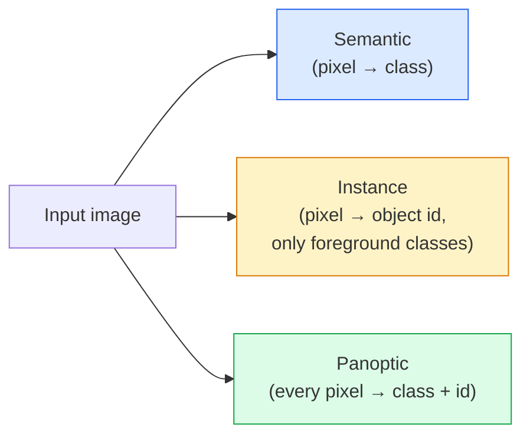
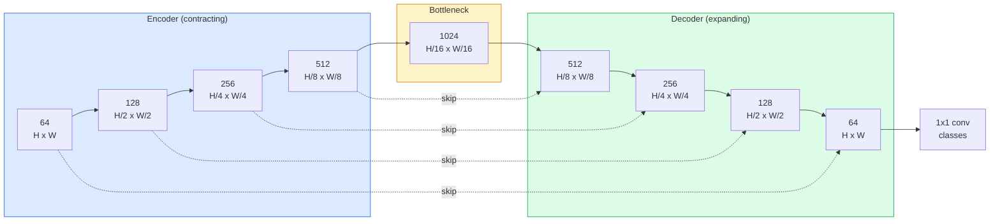

# Phân tích ngữ nghĩa  U-Net

> Segmentation là để phân loại cho mỗi pixel. U-Net sẽ sử dụng mã hóa mẫu dưới cùng với mã hóa mẫu trên.

**Type:** Build
**Languages:** Python
**Prerequisites:** Phase 4 Lesson 03 (CNNs), Phase 4 Lesson 04 (Image Classification)
**Time:** ~75 minutes

## Học mục tiêu
- 区分语义,实例和泛观 phân đoạn,并为给定问题选择正确任务
- Trong PyTorch từ zero xây dựng U-Net, chứa các khối mã hóa, nút thắt nút thắt, decoder của các biến động được chuyển giao, cũng như các kết nối bỏ qua
- 实现 pixel-wise cross-entropy、Dice mất mát, cũng như hiện tại y tế và phân đoạn công nghiệp của mất mát kết hợp cố định
- Theo lớp 解读 IoU 和 Dice metrics,并诊断低分是来自小物体回忆、边界精度,还是类失衡

## 问题
Đánh phân đối với mỗi ảnh 输出一个标签―― Phát hiện đối với mỗi ảnh 输出少量框―― phân vùng đối với mỗi pixel 输出一个标签―― đối với kích thước nhỏ`H x W`                                                                                                                                                                                                                                                              `H x W`(tôn ngữ) hoặc `H x W x N_instances`(nhiều kiện) của tensor. Điều này có nghĩa là mỗi hình ảnh có hàng triệu dự đoán, chứ không phải một.

Các cấu trúc phân chia giải thích tại sao nó hỗ trợ hầu hết các hình ảnh dự đoán dày đặc 产品: hình ảnh y tế (tâm khối u)  lái xe tự trị (cũng đường, đường cong, trở ngại)  vệ tinh (các dấu chân xây dựng)  ranh giới cây trồng (các vùng bố trí)  robot (các vùng có thể nắm bắt)  Những nhiệm vụ này không thể vượt qua đối tượng (đơn một hộp để giải quyết)

Ưu điểm của kiến trúc nói lên đơn giản, nhưng giải quyết không đơn giản: bạn cần mạng để cùng xem bối cảnh toàn cầu của hình ảnh (đây là loại cảnh gì) và chi tiết pixel địa phương (đúng là đường, cái nào là trottoir) 

## 概念
### 语义 vs 实例 vs 全景



- **Semantic**Nói rằng:  Pixel này là đường, đó là xe.
- **Instance**biểu hiện  pixel này là xe #3, đó pixel là xe #5:
- **Panoptic**Để kết hợp với nhau: mỗi pixel đều có một nhãn lớp, mỗi instance đều có một ID duy nhất, vật và vật được phân đoạn.

本课涵盖语义──下一课(Mask R-CNN) bao gồm trường hợp──

### Hình dạng U-Net



Encoder sẽ phân giải không gian  giảm nửa bốn lần,并将 kênh 翻倍――Decoder 反向执行:将空间分辨率 翻倍四次,并将频道 减半――Skip kết nối 会在每个分辨率上把匹配的编码功能与解码功能 进行连接――最终的1x1 conv 在全分辨率下将`64 -> num_classes`

Tại sao bỏ qua các kết nối là cần thiết: khi decoder  cố gắng để xuất ra các dự đoán cấp pixel 时, nó chỉ thấy rất ít các bản đồ tính năng. Không bỏ qua, nó không thể xác định vị trí các cạnh, bởi vì thông tin này đã bị nén trong bộ encoder.

### Chuyển đổi đối với mẫu tăng hàng tỷ

Decoder  phải mở rộng kích thước không gian. Có hai lựa chọn:

- **Transposed convolution**(`nn.ConvTranspose2d` 可学习的 upsample──历史上的 U-Net 默认方案──如果步骤和内核尺寸 不能整除,可能产生棋牌文物──
- **Bilinear upsample + 3x3 conv** 平滑 upsample 后一个 conv──Artifacts 更少,参数 更少,现在是现代默认方案──

Trong các dự án thực tế, tất cả đều có thể thấy được.

### Trình pixel trên của Cross-entropy

Đối với bao gồm các lớp C phân đoạn ngữ nghĩa, mô hình đầu ra là`(N, C, H, W)`❖ Mục tiêu là `(N, H, W)`, chứa các ID lớp toàn số. Cross-entropy với Classification 场景 hoàn toàn giống nhau, chỉ áp dụng ở mỗi vị trí không gian trên:

```
Loss = mean over (n, h, w) of -log( softmax(logits[n, :, h, w])[target[n, h, w]] )
```

PyTorch 中的 `F.cross_entropy`Đáng tạo để xử lý hình dạng này.

### Sự mất mát của các con số và tại sao cần nó

Cross-entropy  bình đẳng đối xử với mỗi pixel. Khi một lớp chiếm phần lớn khung hình, đây là sai lầm.

Sự mất mát đường đốm  thông qua trực tiếp tối ưu hóa sự chồng chéo giữa mặt nạ dự đoán và mặt nạ thực sự để giải quyết vấn đề này:

```
Dice(p, y) = 2 * sum(p * y) / (sum(p) + sum(y) + epsilon)
Dice_loss = 1 - Dice
```

Trong số đó `p`là một lớp của bản đồ xác suất sigmoid / softmax,`y`Đó là mặt nạ thực sự nhị phân. Chỉ khi chồng chéo, mất mát chỉ là không. Bởi vì nó dựa trên tỷ lệ, mất cân bằng lớp học không liên quan nữa.

实践中, sử dụng **combined loss**- Có thể là:

```
L = L_cross_entropy + lambda * L_dice       (lambda ~ 1)
```

Cross-entropy trong đào tạo 早期提供稳定的 Gradient;Dice 将培训 后段聚焦在真正匹配面具形上――这个组合是医学图像的默认方案,在任何类-不平衡的数据集上都很难被超越――

### Các số liệu đánh giá

- **Pixel accuracy** 预测 chính xác của các pixel 百分比──计算便宜──与分类中的精度一样,在不平衡的数据上会失效──
- **IoU per class** Mỗi lớp mặt nạ của giao lộ trên liên đoàn; qua các lớp 求平均 = mIoU。
- **Dice (F1 on pixels)** 类似 IoU;`Dice = 2 * IoU / (1 + IoU)`❖ hình ảnh y tế hơn hơn hơn hơn Dice, lái xe cộng đồng hơn hơn hơn IoU;
- **Boundary F1** Đánh giá các ranh giới dự đoán với mức độ gần gũi của ranh giới thực-cơ sở, ngay cả khi có sự chuyển động nhỏ cũng sẽ bị trừng phạt.

报告 IoU cho mỗi lớp, không chỉ là mIoU.  Tỷ lệ trung bình IoU sẽ chỉ bao gồm một lớp chỉ 15%; trong khi chín lớp khác có 85% tình huống.

### Định nghĩa đầu vào 权衡

Các mã hóa của U-Net sẽ giảm độ phân giải 4 lần, vì vậy đầu vào phải được 16 整除── hình ảnh y tế thường là 512x512 hoặc 1024x1024── tự động lái xe là 2048x1024── chi phí bộ nhớ của U-Net 随`H * W * C_max`缩放, trong 1024x1024 且瓶 kênh 为 1024 时,forward pass 已经会使用数 GB VRAM。

两个标准解决方案:
1. Đặt tay vào  处理带 chồng chéo 256x256 tấm, sau đó đan.
2. Sử dụng các biến dạng mở rộng thay thế nút chai, trong khi giữ độ phân giải không gian cao hơn.

Đối với mô hình thứ nhất, sử dụng đầu vào 256x256 và 64-channel-base U-Net có thể được tập luyện trên 8 GB VRAM.


```figure
segmentation-flood
```

##  xây dựng nó
### 步骤 1: Block mã hóa

2 conv 3x3,带 batch norm 和 ReLU。

```python
import torch
import torch.nn as nn
import torch.nn.functional as F

class DoubleConv(nn.Module):
    def __init__(self, in_c, out_c):
        super().__init__()
        self.net = nn.Sequential(
            nn.Conv2d(in_c, out_c, kernel_size=3, padding=1, bias=False),
            nn.BatchNorm2d(out_c),
            nn.ReLU(inplace=True),
            nn.Conv2d(out_c, out_c, kernel_size=3, padding=1, bias=False),
            nn.BatchNorm2d(out_c),
            nn.ReLU(inplace=True),
        )

    def forward(self, x):
        return self.net(x)
```

Phòng này sẽ được sử dụng trong suốt quá trình.`bias=False`Đó là vì beta của BN đã xử lý sự thiên vị.

### 步骤 2: Các khối xuống và lên

```python
class Down(nn.Module):
    def __init__(self, in_c, out_c):
        super().__init__()
        self.net = nn.Sequential(
            nn.MaxPool2d(2),
            DoubleConv(in_c, out_c),
        )

    def forward(self, x):
        return self.net(x)


class Up(nn.Module):
    def __init__(self, in_c, out_c):
        super().__init__()
        self.up = nn.Upsample(scale_factor=2, mode="bilinear", align_corners=False)
        self.conv = DoubleConv(in_c, out_c)

    def forward(self, x, skip):
        x = self.up(x)
        if x.shape[-2:] != skip.shape[-2:]:
            x = F.interpolate(x, size=skip.shape[-2:], mode="bilinear", align_corners=False)
        x = torch.cat([skip, x], dim=1)
        return self.conv(x)
```

Chỉ kiểm tra hình dạng không gian`shape[-2:]`) có thể xử lý các kích thước không thể được 16 整除的输入; một an toàn `F.interpolate`会在 concat 前对齐 tensor──比较完整形也会因频道数差 触发,而这种差异应该是明确报错,不应该被静静地插曲──

### 步骤 3: U-Net

```python
class UNet(nn.Module):
    def __init__(self, in_channels=3, num_classes=2, base=64):
        super().__init__()
        self.inc = DoubleConv(in_channels, base)
        self.d1 = Down(base, base * 2)
        self.d2 = Down(base * 2, base * 4)
        self.d3 = Down(base * 4, base * 8)
        self.d4 = Down(base * 8, base * 16)
        self.u1 = Up(base * 16 + base * 8, base * 8)
        self.u2 = Up(base * 8 + base * 4, base * 4)
        self.u3 = Up(base * 4 + base * 2, base * 2)
        self.u4 = Up(base * 2 + base, base)
        self.outc = nn.Conv2d(base, num_classes, kernel_size=1)

    def forward(self, x):
        x1 = self.inc(x)
        x2 = self.d1(x1)
        x3 = self.d2(x2)
        x4 = self.d3(x3)
        x5 = self.d4(x4)
        x = self.u1(x5, x4)
        x = self.u2(x, x3)
        x = self.u3(x, x2)
        x = self.u4(x, x1)
        return self.outc(x)

net = UNet(in_channels=3, num_classes=2, base=32)
x = torch.randn(1, 3, 256, 256)
print(f"output: {net(x).shape}")
print(f"params: {sum(p.numel() for p in net.parameters()):,}")
```

Hình dạng đầu ra `(1, 2, 256, 256)` Với kích thước không gian của đầu vào tương tự, chứa `num_classes`个 kênh.`base=32`时约7.7M tham số:

### 步骤 4: Khối lỗ

```python
def dice_loss(logits, targets, num_classes, eps=1e-6):
    probs = F.softmax(logits, dim=1)
    targets_one_hot = F.one_hot(targets, num_classes).permute(0, 3, 1, 2).float()
    dims = (0, 2, 3)
    intersection = (probs * targets_one_hot).sum(dim=dims)
    denom = probs.sum(dim=dims) + targets_one_hot.sum(dim=dims)
    dice = (2 * intersection + eps) / (denom + eps)
    return 1 - dice.mean()


def combined_loss(logits, targets, num_classes, lam=1.0):
    ce = F.cross_entropy(logits, targets)
    dc = dice_loss(logits, targets, num_classes)
    return ce + lam * dc, {"ce": ce.item(), "dice": dc.item()}
```

Dice 按类 计算后再平均(macro Dice)。`eps`防止批中缺失某些类 时出现除零──

### 步骤 5: IoU métric

```python
@torch.no_grad()
def iou_per_class(logits, targets, num_classes):
    preds = logits.argmax(dim=1)
    ious = torch.zeros(num_classes)
    for c in range(num_classes):
        pred_c = (preds == c)
        true_c = (targets == c)
        inter = (pred_c & true_c).sum().float()
        union = (pred_c | true_c).sum().float()
        ious[c] = (inter / union) if union > 0 else torch.tensor(float("nan"))
    return ious
```

返回长度为 C của vector。`nan`标记批 中缺失类  计算 mIoU 时不要把这些值纳入平均――

### 步骤 6: Bộ dữ liệu tổng hợp để xác minh toàn diện

Trong nền màu sắc lên tạo hình dạng, làm cho mạng  phải học hình dạng, thay vì màu pixel.

```python
import numpy as np
from torch.utils.data import Dataset, DataLoader

def synthetic_segmentation(num_samples=200, size=64, seed=0):
    rng = np.random.default_rng(seed)
    images = np.zeros((num_samples, size, size, 3), dtype=np.float32)
    masks = np.zeros((num_samples, size, size), dtype=np.int64)
    for i in range(num_samples):
        bg = rng.uniform(0, 1, (3,))
        images[i] = bg
        masks[i] = 0
        num_shapes = rng.integers(1, 4)
        for _ in range(num_shapes):
            cls = int(rng.integers(1, 3))
            color = rng.uniform(0, 1, (3,))
            cx, cy = rng.integers(10, size - 10, size=2)
            r = int(rng.integers(4, 12))
            yy, xx = np.meshgrid(np.arange(size), np.arange(size), indexing="ij")
            if cls == 1:
                mask = (xx - cx) ** 2 + (yy - cy) ** 2 < r ** 2
            else:
                mask = (np.abs(xx - cx) < r) & (np.abs(yy - cy) < r)
            images[i][mask] = color
            masks[i][mask] = cls
        images[i] += rng.normal(0, 0.02, images[i].shape)
        images[i] = np.clip(images[i], 0, 1)
    return images, masks


class SegDataset(Dataset):
    def __init__(self, images, masks):
        self.images = images
        self.masks = masks

    def __len__(self):
        return len(self.images)

    def __getitem__(self, i):
        img = torch.from_numpy(self.images[i]).permute(2, 0, 1).float()
        mask = torch.from_numpy(self.masks[i]).long()
        return img, mask
```

Ba lớp: nền (0) √ vòng tròn (1) √ vuông (2) √ Mạng √ phải học cách phân biệt hình dạng

### Bước 7: vòng đào tạo

```python
def train_one_epoch(model, loader, optimizer, device, num_classes):
    model.train()
    loss_sum, total = 0.0, 0
    iou_sum = torch.zeros(num_classes)
    for x, y in loader:
        x, y = x.to(device), y.to(device)
        logits = model(x)
        loss, _ = combined_loss(logits, y, num_classes)
        optimizer.zero_grad()
        loss.backward()
        optimizer.step()
        loss_sum += loss.item() * x.size(0)
        total += x.size(0)
        iou_sum += iou_per_class(logits, y, num_classes).nan_to_num(0)
    return loss_sum / total, iou_sum / len(loader)
```

Trong tập dữ liệu tổng hợp 上运行 10-30 thời đại, quan sát mIoU của lớp hình dạng 爬升到 0.9 以上──注意,`nan_to_num(0)`会把批中缺失类当作零; Để có được xác định cho từng lớp IoU, trong giai đoạn đánh giá 应按存在做口罩,并跨批使用 `torch.nanmean`, thay vì ở đây trung bình trực tiếp.

## Sử dụng nó
 Đối với sản xuất,`segmentation_models_pytorch`("smp") dùng bất kỳ torchvision hoặc timm backbone 封装了所有标准 phân đoạn kiến trúc。三行代码:

```python
import segmentation_models_pytorch as smp

model = smp.Unet(
    encoder_name="resnet34",
    encoder_weights="imagenet",
    in_channels=3,
    classes=3,
)
```

实际工作中 cũng đáng để biết:
- **DeepLabV3+**Sử dụng conv dilated thay thế dựa trên điểm tối đa của downsampling, làm cho nút thắt nút thắt giữ độ phân giải; trên vệ tinh và dữ liệu lái xe 上边界更快──
- **SegFormer**将 conv encoder 替换为级别变压器; trong nhiều tiêu chuẩn 上是当前SOTA。
- **Mask2Former**- **OneFormer**Trong một kiến trúc đơn, trong một kiến trúc phân tích ngữ nghĩa, ví dụ và phân đoạn toàn cảnh.

Người này đang ở trong`smp`Hoặc`transformers`Trong đó có thể được sử dụng như là thay thế,并 sử dụng cùng một bộ tải dữ liệu.

## 交付 nó
本课产 出:

- `outputs/prompt-segmentation-task-picker.md`Một lời nhắc, được sử dụng để lựa chọn giữa phân đoạn ngữ nghĩa, ví dụ và toàn cảnh,并为给定任务命名架构.
- `outputs/skill-segmentation-mask-inspector.md` Một kỹ năng, để báo cáo phân phối lớp, thống kê mặt nạ dự đoán, cũng như các lớp không dự đoán hoặc không rõ ràng về ranh giới.

## 练习
1. **(Easy)**为 phân đoạn nhị phân nhiệm vụ ((phát hình vs nền) thực hiện `bce_dice_loss`Trong bộ dữ liệu hai lớp tổng hợp 上验证, khi đứng đầu chỉ chiếm 5% pixel 时, mất tích kết hợp so với đơn lẻ BCE 收更快──
2. **(Medium)**sẽ`nn.Upsample + conv`up-block 替换为 `nn.ConvTranspose2d`up-block── trên tập hợp dữ liệu tổng hợp 上训练二者并比较 mIoU──观察 chuyển thể-conv 版本中棋牌文物 出现位置──
3. **(Hard)**选取一个真实细分数据集 ((Oxford-IIIT Pets、Citiescapes mini split,或一个医学子集),并将 U-Net 训练到距离 `smp.Unet`tham chiếu không quá 2 điểm IoU ⋅ báo cáo cho mỗi lớp IoU,并识别哪些类从向损失中加入 Dice 获取最多──

## 关键术语
| Term | What people say | What it actually means |
|------|----------------|----------------------|
| Semantic segmentation | “标注每个 pixel” | 对每个 pixel 进行 C classes 的 Classification；同一 class 的 instances 会合并 |
| Instance segmentation | “标注每个 object” | 分离同一 class 的不同 instances；仅 foreground |
| Panoptic segmentation | “Semantic + instance” | 每个 pixel 得到一个 class；每个 thing instance 还得到一个唯一 id |
| Skip connection | “U-Net bridge” | 将 encoder features concatenate 到匹配 resolution 的 decoder features 中；保留 high-frequency detail |
| Transposed conv | “Deconvolution” | 可学习的 upsampling；可能产生 checkerboard artifacts |
| Dice loss | “Overlap loss” | 1 - 2|A ∩ B| / (|A| + |B|)；直接优化 mask overlap，并且对 class imbalance 鲁棒 |
| mIoU | “Mean intersection over union” | 跨 classes 平均 IoU；segmentation 的 community-standard metric |
| Boundary F1 | “Boundary accuracy” | 只在 boundary pixels 上计算的 F1 score；对 precision-critical tasks 很重要 |

## 延伸阅读
- [U-Net: Convolutional Networks for Biomedical Image Segmentation (Ronneberger et al., 2015)](https://arxiv.org/abs/1505.04597) Bức giấy gốc; tất cả mọi người sẽ có hình ảnh tái khắc trên trang 2
- [Fully Convolutional Networks (Long et al., 2015)](https://arxiv.org/abs/1411.4038) 首个将 phân đoạn 变成 cuối đến cuối con vấn đề của giấy
- [segmentation_models_pytorch](https://github.com/qubvel/segmentation_models.pytorch) phân đoạn sản xuất; chứa tất cả các tiêu chuẩn kiến trúc và tất cả các tiêu chuẩn mất mát
- [Lessons learned from training SOTA segmentation (kaggle.com competitions)](https://www.kaggle.com/code/iafoss/carvana-unet-pytorch) 讲解 tại sao TTA  giả định nhãn và trọng lượng lớp là rất quan trọng trên dữ liệu thực
