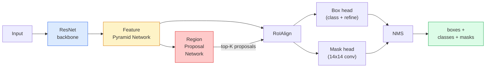

# Phân tích giai đoạn  Mask R-CNN

> Cho máy dò R-CNN nhanh hơn, thêm một nhánh nạ rất nhỏ, chúng tôi đã có được phân đoạn ví dụ.

**Type:** Build + Learn
**Languages:** Python
**Prerequisites:** Phase 4 Lesson 06 (YOLO), Phase 4 Lesson 07 (U-Net)
**Time:** ~75 minutes

## Học mục tiêu
- 端到端追踪 Mask R-CNN 架构: xương sống, FPN, RPN, Road align, hộp đầu, mặt nạ đầu
- Từ zero thực hiện RoIAlign,并 giải thích tại sao RoIPool không được sử dụng nữa
- Sử dụng torchvision của `maskrcnn_resnet50_fpn_v2`mô hình trước khi được đào tạo 生成生产质量实例面具,并正确读取它的输出格式
- Thông qua thay thế hộp và mặt nạ đầu,并 giữ xương sống 结, trong tập hợp dữ liệu tự định nghĩa nhỏ, chỉnh sửa tốt Mask R-CNN

## 问题
Phân khu vực ngữ nghĩa cho mỗi lớp  đưa ra một mặt nạ. Phân khu vực thực hiện cho mỗi đối tượng  đưa ra một mặt nạ, ngay cả khi hai đối tượng thuộc cùng một lớp.

Mask R-CNN (He et al., 2017) 通过把实例细分重新表述为检测-plus-a-mask来解决这个问题――这个设计非常简单,到下五年里,几乎每篇实例细分论文都是 Mask R-CNN 的变体,而火视觉实现至今仍是中小型数据集的生产默认选择――

困难的工程问题是采样: làm thế nào để cắt ra một khu vực tính năng cố định trong một hộp đề xuất, trong khi các góc điểm của hộp không phù hợp với giới hạn pixel đối với nhau?

## 概念
### Kiến trúc



需要理解五个部分:

1. **Backbone** Trong ImageNet 上训练的ResNet-50 或ResNet-101──生成步骤为 4、8、16、32 tính năng bản đồ 层级──
2. **FPN (Feature Pyramid Network)** kết nối phía trên xuống + bên, để mỗi cấp có các tính năng của các kênh C.
3. **RPN (Region Proposal Network)**Một đầu khoang nhỏ, ở mỗi vị trí neo lên dự đoán liệu có một vật liệu ở đây không?
4. **RoIAlign** Từ mức FPN tùy chọn trên của hộp tùy chọn 中采样固定大小(ví dụ 7x7) của tính năng váy── sử dụng lấy mẫu hàng tuyến, không làm quantisation──
5. **Heads** 两层 box head,用于精细盒并选择类;再加一个小型 conv head,为每一个提案 输出一个 `28x28`Mặt nạ nhị phân.

### Tại sao RoIAlign, không phải RoIPool

Đầu tiên Fast R-CNN sử dụng RoIPool, nó làm cho hộp đề xuất  tách thành một lưới, lấy tính năng lớn nhất trong mỗi tế bào, và đưa tất cả các tập hợp tròn đến tổng số.

```
RoIPool:
  box (34.7, 51.3, 98.2, 142.9)
  round -> (34, 51, 98, 142)
  split grid -> round each cell boundary
  misalignment accumulates at every step

RoIAlign:
  box (34.7, 51.3, 98.2, 142.9)
  sample at exact float coordinates using bilinear interpolation
  no rounding anywhere
```

RoIAlign có thể nâng cao miễn phí 3-4 điểm của mặt nạ AP.

### RPN trong một đoạn

Trong mỗi vị trí trên bản đồ tính năng, đặt K 个 个 个 个 个 个 个 个 个 个 个 个 个 个 个 个 个 个 个 个 个 个 个 个 个 个 个 个 个 个 个 个 个 个 个 个 个 个 个 个 个 个 个 个 个 个 个 个 个 个 个 个 个 个 个 个 个 个 个 个 个 个 个 个 个 个 个 个 个 个 个 个 个 个 个 个 个 个 个 个 个 个 个 个 个 个 个 个 个 个 个 个 个 个 个 个 个 个 个 个 个 个 个 个 个 个 个 个 个 个 个 个 个 个 个 个 个 个 个 个 个 个 个 个 个 个 个 个 个 个 个 个 个 个 个 个 个 个 个 个 个 个 个 个 个 个 个 个 个 个 个 个 个 个 个 个 个 个 个 个 个 个 个 个 个 个 个 个 个 个 个 个 个 个 个 个 个 个 个 个 个 个 个 个 个 个 个 个 个 个 个 个 个 个 个 个 个 个 个 个 个 个 个 个 个 个 个 个 个 个 个 个 个 个 个 个 个 个 个 个 个 个 个 个 个 个 个 个 个 个 个 个 个 个 个 个 个 个 个 个 个 个 个 个 个 个 个 个 个

### Đầu mặt nạ

Đối với mỗi đề xuất, đầu mặt nạ là một FCN rất nhỏ: bốn con 3x3 ∙ một con 2x deconv ∙ một con cuối cùng của 1x1 ∙`28x28`giải pháp 下生成 `num_classes`个输出── chỉ giữ lại với dự đoán lớp đối ứng với kênh; các kênh khác sẽ bị bỏ qua──

Đặt mẫu mặt nạ 28x28 lên đến đề xuất kích thước pixel ban đầu, nhận được mặt nạ nhị phân cuối cùng.

### Khối thối

R-CNN có 4 loại lỗ hơn:

```
L = L_rpn_cls + L_rpn_box + L_box_cls + L_box_reg + L_mask
```

- `L_rpn_cls`- `L_rpn_box` Chủ thể của các đề xuất RPN + hộp Regression。
- `L_box_cls` phân loại đầu 上 nhắm vào (C+1) lớp (含背景) của chéo entropy.
- `L_box_reg` tinh tế hộp đầu                                                                                                                                                                                                                                                            
- `L_mask` 28x28 đầu ra mặt nạ 上的每像素二进化

Mỗi lỗ đều có trọng lượng tiêu chuẩn riêng của mình; việc thực hiện thị lực sẽ làm cho chúng trở thành các lập luận xây dựng  xuất hiện.

### Phương thức đầu ra

`torchvision.models.detection.maskrcnn_resnet50_fpn_v2`返回一个字符列表,每张图像对应一个字符:

```
{
    "boxes":  (N, 4) in (x1, y1, x2, y2) pixel coordinates,
    "labels": (N,) class IDs, 0 = background so indices are 1-based,
    "scores": (N,) confidence scores,
    "masks":  (N, 1, H, W) float masks in [0, 1] — threshold at 0.5 for binary,
}
```

mặt nạ 已是全图像分辨率──28x28 đầu đầu đầu 已在内部完成upsample──


```figure
cv3-roialign-sampling
```

##  xây dựng nó
### 步骤 1: Định hướng từ đầu

Bộ phận này của R-CNN, sử dụng mã hóa để hiểu hơn so với mô tả văn bản đơn giản hơn.

```python
import torch
import torch.nn.functional as F

def roi_align_single(feature, box, output_size=7, spatial_scale=1 / 16.0):
    """
    feature: (C, H, W) single-image feature map
    box: (x1, y1, x2, y2) in original image pixel coordinates
    output_size: side of the output grid (7 for box head, 14 for mask head)
    spatial_scale: reciprocal of the feature map stride
    """
    C, H, W = feature.shape
    x1, y1, x2, y2 = [c * spatial_scale - 0.5 for c in box]
    bin_w = (x2 - x1) / output_size
    bin_h = (y2 - y1) / output_size

    grid_y = torch.linspace(y1 + bin_h / 2, y2 - bin_h / 2, output_size)
    grid_x = torch.linspace(x1 + bin_w / 2, x2 - bin_w / 2, output_size)
    yy, xx = torch.meshgrid(grid_y, grid_x, indexing="ij")

    gx = 2 * (xx + 0.5) / W - 1
    gy = 2 * (yy + 0.5) / H - 1
    grid = torch.stack([gx, gy], dim=-1).unsqueeze(0)
    sampled = F.grid_sample(feature.unsqueeze(0), grid, mode="bilinear",
                            align_corners=False)
    return sampled.squeeze(0)
```

Mỗi số lượng đều đến từ vị trí mẫu hình hai tuyến. Không tròn, không định lượng, cũng không mất gradient.

### 步骤 2: So sánh với RoIAlign của torchvision

```python
from torchvision.ops import roi_align

feature = torch.randn(1, 16, 50, 50)
boxes = torch.tensor([[0, 10, 20, 100, 90]], dtype=torch.float32)  # (batch_idx, x1, y1, x2, y2)

ours = roi_align_single(feature[0], boxes[0, 1:].tolist(), output_size=7, spatial_scale=1/4)
theirs = roi_align(feature, boxes, output_size=(7, 7), spatial_scale=1/4, sampling_ratio=1, aligned=True)[0]

print(f"shape ours:   {tuple(ours.shape)}")
print(f"shape theirs: {tuple(theirs.shape)}")
print(f"max|diff|:    {(ours - theirs).abs().max().item():.3e}")
```

Trong `sampling_ratio=1`且 `aligned=True`时,两者能在 `1e-5`Và nó phù hợp.

### 步骤 3: Lắp một mặt nạ R-CNN được huấn luyện trước

```python
import torch
from torchvision.models.detection import maskrcnn_resnet50_fpn_v2, MaskRCNN_ResNet50_FPN_V2_Weights

model = maskrcnn_resnet50_fpn_v2(weights=MaskRCNN_ResNet50_FPN_V2_Weights.DEFAULT)
model.eval()
print(f"params: {sum(p.numel() for p in model.parameters()):,}")
print(f"classes (including background): {len(model.roi_heads.box_predictor.cls_score.out_features * [0])}")
```

46M tham số, 91 lớp ((COCO) ⋅第一个类 ((id 0) là nền;模型实际检测所有内容都从 id 1 开始。

### 步骤 4: Đi kết luận

```python
with torch.no_grad():
    x = torch.randn(3, 400, 600)
    predictions = model([x])
p = predictions[0]
print(f"boxes:  {tuple(p['boxes'].shape)}")
print(f"labels: {tuple(p['labels'].shape)}")
print(f"scores: {tuple(p['scores'].shape)}")
print(f"masks:  {tuple(p['masks'].shape)}")
```

hình dạng của tensor mặt nạ là `(N, 1, H, W)`△ 0,5 đối với ngưỡng, cho mỗi đối tượng  nhận được mặt nạ nhị phân:

```python
binary_masks = (p['masks'] > 0.5).squeeze(1)  # (N, H, W) boolean
```

### 步骤 5: Thay đổi đầu cho một class count tùy chỉnh

常见的细调配方:复用脊椎、FPN 和 RPN; thay thế hai đầu phân loại.

```python
from torchvision.models.detection.faster_rcnn import FastRCNNPredictor
from torchvision.models.detection.mask_rcnn import MaskRCNNPredictor

def build_custom_maskrcnn(num_classes):
    model = maskrcnn_resnet50_fpn_v2(weights=MaskRCNN_ResNet50_FPN_V2_Weights.DEFAULT)
    in_features = model.roi_heads.box_predictor.cls_score.in_features
    model.roi_heads.box_predictor = FastRCNNPredictor(in_features, num_classes)
    in_features_mask = model.roi_heads.mask_predictor.conv5_mask.in_channels
    hidden_layer = 256
    model.roi_heads.mask_predictor = MaskRCNNPredictor(in_features_mask, hidden_layer, num_classes)
    return model

custom = build_custom_maskrcnn(num_classes=5)
print(f"custom cls_score.out_features: {custom.roi_heads.box_predictor.cls_score.out_features}")
```

`num_classes`必须包含背景类, vì vậy một có 4 lớp đối tượng của tập dữ liệu nên sử dụng `num_classes=5`

### Bước 6: Tắt những gì không cần đào tạo

Trong tập dữ liệu nhỏ, 结骨干和FPN── chỉ để RPN đối tượng tính + hồi quy và hai đầu học.

```python
def freeze_backbone_and_fpn(model):
    # torchvision Mask R-CNN packs the FPN inside `model.backbone` (as
    # `model.backbone.fpn`), so iterating `model.backbone.parameters()` covers
    # both the ResNet feature layers and the FPN lateral/output convs.
    for p in model.backbone.parameters():
        p.requires_grad = False
    return model

custom = freeze_backbone_and_fpn(custom)
trainable = sum(p.numel() for p in custom.parameters() if p.requires_grad)
print(f"trainable after freeze: {trainable:,}")
```

Trong dữ liệu hình ảnh 500, đó là sự khác biệt giữa nhận và quá phù hợp.

## Sử dụng nó
Phòng đào tạo hoàn chỉnh của R-CNN chỉ có 40 行, và không thay đổi giữa các nhiệm vụ khác nhau: thay thế các tập dữ liệu, sau đó bắt đầu đào tạo.

```python
def train_step(model, images, targets, optimizer):
    model.train()
    loss_dict = model(images, targets)
    losses = sum(loss for loss in loss_dict.values())
    optimizer.zero_grad()
    losses.backward()
    optimizer.step()
    return {k: v.item() for k, v in loss_dict.items()}
```

`targets`Danh sách phải chứa mỗi hình ảnh đối với các lệnh, trong đó có`boxes``labels`和 `masks`(Như `(num_instances, H, W)`mô hình trong đào tạo 时返回四个损失的句子, trong eval 时返回预测 列表,由 `model.training`quyết định.

`pycocotools`Người đánh giá sẽ cùng lúc dùng hộp và mặt nạ 生成 mAP@IoU=0.5:0.95; bạn cần hai con số, để quyết định chai là đầu hộp hay là đầu mặt nạ.

## 交付 nó
本课会产出:

- `outputs/prompt-instance-vs-semantic-router.md`Một lời nhắc, sẽ đưa ra ba vấn đề,并 chọn ví dụ vs ngữ nghĩa vs toàn quan,以及精确的起始模型──
- `outputs/skill-mask-rcnn-head-swapper.md`Một kỹ năng, cho một kỹ năng mới.`num_classes`, cho mô hình phát hiện phát hiện đèn pin tùy chọn 生成用于 trao đổi đầu của 10 行代码。

## 练习
1. **(Easy)**Trong 100 hộp ngẫu nhiên `torchvision.ops.roi_align`验证你的RoIAlign──报告最大绝对差值──同时运行RoIPool(pre-2017 behavior),并显示它 nằm gần biên giới các hộp trên khoảng 1-2 piksel của bản đồ tính năng──
2. **(Medium)**Trong một bộ dữ liệu tùy chỉnh 50 hình ảnh ((bất kỳ hai lớp: bóng, cá, lỗ, logo) trên tinh chỉnh`maskrcnn_resnet50_fpn_v2`结脊椎, huấn luyện 20 thời đại, báo cáo mặt nạ AP@0.5。
3. **(Hard)**Để thay thế đầu mặt nạ của R-CNN với dự đoán 56x56 thay vì phiên bản 28x28 ⋅ mAP@IoU=0.75 ⋅ giải thích tại sao nâng cấp (hoặc không nâng cấp) phù hợp với dự kiến biên giới-sự chính xác / khoá trade-off ⋅

## 关键术语
| Term | What people say | What it actually means |
|------|----------------|----------------------|
| Mask R-CNN | “Detection plus masks” | Faster R-CNN + 一个小型 FCN head，为每个 proposal 的每个 class 预测一个 28x28 mask |
| FPN | “Feature pyramid” | top-down + lateral connections，让每个 stride level 都有 C channels 的语义丰富 features |
| RPN | “Region proposer” | 一个小型 conv head，每张图像生成约 1000 个 object/no-object proposals |
| RoIAlign | “No-rounding crop” | 从任意 float-coordinate box 中以 bilinear 方式采样固定大小的 feature grid |
| RoIPool | “Pre-2017 crop” | 与 RoIAlign 用途相同，但会 round box coordinates；已经过时 |
| Mask AP | “Instance mAP” | 使用 mask IoU 而不是 box IoU 计算的 average precision；COCO instance segmentation metric |
| Binary mask head | “Per-class mask” | 为每个 proposal 的每个 class 预测一个 binary mask；只保留 predicted class 的 channel |
| Background class | “Class 0” | 兜底的 “no object” class；真实 classes 的 indices 从 1 开始 |

## 延伸阅读
- [Mask R-CNN (He et al., 2017)](https://arxiv.org/abs/1703.06870) 论文; Về RoIAlign's thứ 3 phần là quan trọng đọc
- [FPN: Feature Pyramid Networks (Lin et al., 2017)](https://arxiv.org/abs/1612.03144) FPN 论文; mỗi máy dò hiện đại đều sử dụng nó
- [torchvision Mask R-CNN tutorial](https://pytorch.org/tutorials/intermediate/torchvision_tutorial.html) vòng tròn điều chỉnh tinh tế
- [Detectron2 model zoo](https://github.com/facebookresearch/detectron2/blob/main/MODEL_ZOO.md) Thực hiện cấp sinh sản, cung cấp hầu hết các phát hiện và phân đoạn  biến thể của trọng lượng được đào tạo
