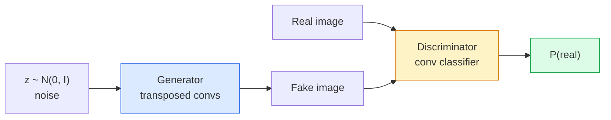
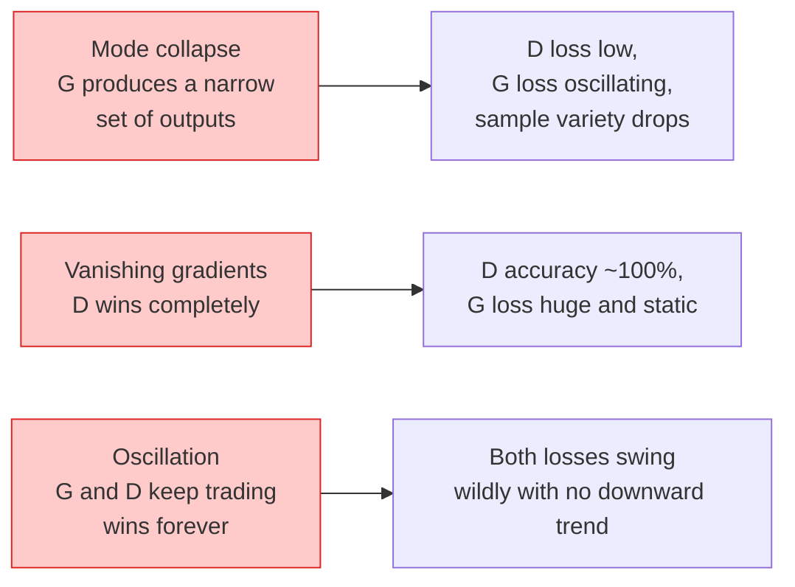

# Tạo hình ảnh  GAN

> GAN là một hệ thống cố định giữa hai mạng thần kinh. Một người chịu trách nhiệm vẽ, một người chịu trách nhiệm đánh giá. Chúng trở nên tốt hơn với nhau, cho đến khi kết quả vẽ bị lừa bởi nhà đánh giá.

**Type:** Build
**Languages:** Python
**Prerequisites:** Phase 4 Lesson 03 (CNNs), Phase 3 Lesson 06 (Optimizers), Phase 3 Lesson 07 (Regularization)
**Time:** ~75 分钟

## Học mục tiêu
- 解释 tối thiểu giữa nhà phát triển và phân biệt đối xử, và tại sao cân bằng đối với p_model = p_data
- Trong PyTorch thực hiện DCGAN, và trong 60 行 để nó tạo ra liên tục 32x32 hình ảnh tổng hợp
- Sử dụng三种标准技巧稳定 GAN 训练: mất không bão hòa, tiêu chuẩn quang phổ, TTUR (quyền cập nhật hai lần)
- 读取训练曲线,区分健康收与模式崩, dao động, phân biệt đối xử-lợi nhuận-làm toàn bộ

## 问题
Các hệ thống phân loại sẽ đưa hình ảnh lên các nhãn. Thế hệ đã biến đổi vấn đề này: mẫu xuất hiện trông giống như hình ảnh mới từ phân bố tương tự. Ở đây không có thể sử dụng sự khác biệt đối với phân phối chính xác. Chỉ có một phân bố mà bạn muốn mô phỏng.

标准 Loss Function (MSE、cross-entropy) không thể đo lường liệu mô hình này có đến từ phân bố thực ⋅ ⋅ ⋅ ⋅ ⋅ ⋅ ⋅ ⋅ ⋅ ⋅ ⋅ ⋅ ⋅ ⋅ ⋅ ⋅ ⋅ ⋅ ⋅ ⋅ ⋅ ⋅ ⋅ ⋅ ⋅ ⋅ ⋅ ⋅ ⋅ ⋅ ⋅ ⋅ ⋅ ⋅ ⋅ ⋅ ⋅ ⋅ ⋅ ⋅ ⋅ ⋅ ⋅ ⋅ ⋅ ⋅ ⋅ ⋅ ⋅ ⋅ ⋅ ⋅ ⋅ ⋅ ⋅ ⋅ ⋅ ⋅ ⋅ ⋅ ⋅ ⋅ ⋅ ⋅ ⋅ ⋅ ⋅ ⋅ ⋅ ⋅ ⋅ ⋅ ⋅ ⋅ ⋅ ⋅ ⋅ ⋅ ⋅ ⋅ ⋅ ⋅ ⋅ ⋅ ⋅ ⋅ ⋅ ⋅ ⋅ ⋅ ⋅ ⋅ ⋅ ⋅ ⋅ ⋅ ⋅ ⋅ ⋅ ⋅ ⋅ ⋅ ⋅ ⋅ ⋅ ⋅ ⋅ ⋅ ⋅ ⋅ ⋅ ⋅ ⋅ ⋅ ⋅ ⋅ ⋅ ⋅ ⋅ ⋅ ⋅ ⋅ ⋅ ⋅ ⋅ ⋅ ⋅ ⋅ ⋅ ⋅ ⋅ ⋅ ⋅ ⋅ ⋅ ⋅ ⋅ ⋅ ⋅ ⋅ ⋅ ⋅ ⋅ ⋅ ⋅ ⋅ ⋅ ⋅ ⋅ ⋅ ⋅ ⋅ ⋅ ⋅ ⋅ ⋅ ⋅ ⋅ ⋅ ⋅ ⋅ ⋅ ⋅ ⋅ ⋅ ⋅ ⋅ ⋅ ⋅ ⋅ ⋅ ⋅ ⋅ ⋅ ⋅ ⋅ ⋅ ⋅ ⋅ ⋅ ⋅ ⋅ ⋅ ⋅ ⋅ ⋅ ⋅ ⋅ ⋅ ⋅ ⋅ ⋅ ⋅ ⋅ ⋅ ⋅     ⋅                                                                                

GANs (Goodfellow et al., 2014) đã xác định khung này. Đến năm 2018, StyleGAN đã có thể tạo ra với ảnh khó phân biệt 1024x1024 khuôn mặt người. Sau đó các mô hình phân tán chủ yếu chiếm ưu thế trên chất lượng và khả năng điều khiển, nhưng để phân tán trở nên hữu ích.

## 概念
### Hai mạng lưới



**generator**G 接收一个噪音 `z`Và xuất một张图像──**discriminator**D 接收一张图像并输出单个标量: 图像为真实的概率──

### Trò chơi

G 希望 D 犯错――D 希望自己判断正确――形式化地说:

```
min_G max_D  E_x[log D(x)] + E_z[log(1 - D(G(z)))]
```

Từ phải sang trái đọc:D đang làm tối đa hóa nó trong thực`log D(real)`(với giả)`log (1 - D(fake))`(G đang được tối thiểu hóa D trong giả trên độ chính xác của nó mong muốn)`D(G(z))` rất cao.

Người bạn tốt đã chứng minh rằng tối thiểu là sự cân bằng toàn diện, trong đó có`p_G = p_data`,D ở tất cả các vị trí đều xuất phát 0,5, và tạo ra phân bố và phân bố thực sự giữa sự khác biệt Jensen-Shannon là 0.

### Thiệt hại không bão hòa

hình thức trên trên không ổn định trên số lượng.`D(G(z))`Đối với mỗi giả đều gần như không, vì vậy`log(1 - D(G(z)))`Đối với G của Gradient 会消失──修复方法:翻转 G của Loss──

```
L_D = -E_x[log D(x)] - E_z[log(1 - D(G(z)))]
L_G = -E_z[log D(G(z))]                          # non-saturating
```

现在当 `D(G(z))`接近零时,G 的损失 很大,Gradient 也有信息量──每个现代GAN都使用这个变体进行训练──

### Quy tắc kiến trúc DCGAN

Radford、Metz、Chintala (2015) sẽ nhiều năm thất bại thực nghiệm luyện thành 5 quy tắc, làm cho GAN  luyện tập ổn định hơn:

1. Sử dụng con đường bước thay thế tập hợp (both networks are so)
2. Trong các nhà phát điện và phân biệt đối xử đều sử dụng tiêu chuẩn lô, nhưng G của xuất và D của nhập trừ.
3. Trong cấu trúc sâu hơn, di chuyển các lớp kết nối hoàn toàn.
4. G trong trừ输出层外所有层使用 ReLU(输出层用 tanh,将输出限制在 [-1, 1])。
5. D 在所有层使用LeakyReLU(negative_slope=0.2)。

Mỗi GAN dựa trên con-Modern (StyleGAN, BigGAN, GigaGAN) vẫn xuất phát từ những quy tắc này, và một lần thay thế một phần trong đó.

### Các chế độ thất bại  và các đặc điểm



- **Mode collapse**:G 找到一张能骗过D 的图像,然后只生成它──修复:加入迷你批次歧视、光谱规范,或标签条件──
- **Discriminator wins**:D 变强太快,G 的 Gradient 消失──修复:减小 D、降低 D learning rate,或对真实标签 应用标签 smoothing──
- **Oscillation**Hai mạng liên tục chiếm ưu thế lẫn nhau, nhưng không gần cân bằng.

### Đánh giá

GAN không có sự thật, vậy làm sao bạn biết chúng đang làm việc không?

- **Sample inspection** mỗi thời đại kết thúc 直接查看 64 个样本──不可妥协──
- **FID (Fréchet Inception Distance)** thực tế tập hợp với tạo tập hợp của Inception-v3 phân phối tính năng  khoảng cách giữa──越低越好──社区标准──
- **Inception Score**较旧,也更脆弱; ưu tiên sử dụng FID。
- **Precision/Recall for generative models**分别衡量质量 (đúng lượng) và phủ sóng (khải ý) .

Đối với các dữ liệu tổng hợp nhỏ, kiểm tra mẫu là đủ.


```figure
cv-gan-image
```

##  xây dựng nó
### 步骤 1: Generator

Một máy phát điện DCGAN nhỏ, nhận 64 维 tiếng ồn và tạo ra một张 32x32 图像──

```python
import torch
import torch.nn as nn

class Generator(nn.Module):
    def __init__(self, z_dim=64, img_channels=3, feat=64):
        super().__init__()
        self.net = nn.Sequential(
            nn.ConvTranspose2d(z_dim, feat * 4, kernel_size=4, stride=1, padding=0, bias=False),
            nn.BatchNorm2d(feat * 4),
            nn.ReLU(inplace=True),
            nn.ConvTranspose2d(feat * 4, feat * 2, kernel_size=4, stride=2, padding=1, bias=False),
            nn.BatchNorm2d(feat * 2),
            nn.ReLU(inplace=True),
            nn.ConvTranspose2d(feat * 2, feat, kernel_size=4, stride=2, padding=1, bias=False),
            nn.BatchNorm2d(feat),
            nn.ReLU(inplace=True),
            nn.ConvTranspose2d(feat, img_channels, kernel_size=4, stride=2, padding=1, bias=False),
            nn.Tanh(),
        )

    def forward(self, z):
        return self.net(z.view(z.size(0), -1, 1, 1))
```

4 con tàu được chuyển giao, mỗi người sử dụng.`kernel_size=4, stride=2, padding=1`, để chúng có thể làm sạch sẽ kích thước không gian gấp đôi.

### 步骤 2: Phân biệt đối xử

Lớp của máy phát điện: LeakyReLU, trục trặc, cuối cùng xuất ra một biểu tượng.

```python
class Discriminator(nn.Module):
    def __init__(self, img_channels=3, feat=64):
        super().__init__()
        self.net = nn.Sequential(
            nn.Conv2d(img_channels, feat, kernel_size=4, stride=2, padding=1),
            nn.LeakyReLU(0.2, inplace=True),
            nn.Conv2d(feat, feat * 2, kernel_size=4, stride=2, padding=1, bias=False),
            nn.BatchNorm2d(feat * 2),
            nn.LeakyReLU(0.2, inplace=True),
            nn.Conv2d(feat * 2, feat * 4, kernel_size=4, stride=2, padding=1, bias=False),
            nn.BatchNorm2d(feat * 4),
            nn.LeakyReLU(0.2, inplace=True),
            nn.Conv2d(feat * 4, 1, kernel_size=4, stride=1, padding=0),
        )

    def forward(self, x):
        return self.net(x).view(-1)
```

Con cuối cùng sẽ`4x4`bản đồ tính năng 降到 `1x1`◊输出是每张图像一个标量; chỉ trong Loss 计算期间应用 sigmoid。

### 步骤 3: bước đào tạo

交替执行: Mỗi lô trước mới một lần D, lại mới một lần G。

```python
import torch.nn.functional as F

def train_step(G, D, real, z, opt_g, opt_d, device):
    real = real.to(device)
    bs = real.size(0)

    # D step
    opt_d.zero_grad()
    d_real = D(real)
    d_fake = D(G(z).detach())
    loss_d = (F.binary_cross_entropy_with_logits(d_real, torch.ones_like(d_real))
              + F.binary_cross_entropy_with_logits(d_fake, torch.zeros_like(d_fake)))
    loss_d.backward()
    opt_d.step()

    # G step
    opt_g.zero_grad()
    d_fake = D(G(z))
    loss_g = F.binary_cross_entropy_with_logits(d_fake, torch.ones_like(d_fake))
    loss_g.backward()
    opt_g.step()

    return loss_d.item(), loss_g.item()
```

D bước trung `G(z).detach()`至关重要: Chúng tôi không muốn được cập nhật D 时 Gradient 流 vào G ⋅ quên rằng đó là lỗi của học viên sơ sinh cổ điển ⋅

### 步骤 4: Trong hình dạng tổng hợp 上运行完整训练循环

```python
from torch.utils.data import DataLoader, TensorDataset
import numpy as np

def synthetic_images(num=2000, size=32, seed=0):
    rng = np.random.default_rng(seed)
    imgs = np.zeros((num, 3, size, size), dtype=np.float32) - 1.0
    for i in range(num):
        r = rng.uniform(6, 12)
        cx, cy = rng.uniform(r, size - r, size=2)
        yy, xx = np.meshgrid(np.arange(size), np.arange(size), indexing="ij")
        mask = (xx - cx) ** 2 + (yy - cy) ** 2 < r ** 2
        color = rng.uniform(-0.5, 1.0, size=3)
        for c in range(3):
            imgs[i, c][mask] = color[c]
    return torch.from_numpy(imgs)

device = "cuda" if torch.cuda.is_available() else "cpu"
data = synthetic_images()
loader = DataLoader(TensorDataset(data), batch_size=64, shuffle=True)

G = Generator(z_dim=64, img_channels=3, feat=32).to(device)
D = Discriminator(img_channels=3, feat=32).to(device)
opt_g = torch.optim.Adam(G.parameters(), lr=2e-4, betas=(0.5, 0.999))
opt_d = torch.optim.Adam(D.parameters(), lr=2e-4, betas=(0.5, 0.999))

for epoch in range(10):
    for (batch,) in loader:
        z = torch.randn(batch.size(0), 64, device=device)
        ld, lg = train_step(G, D, batch, z, opt_g, opt_d, device)
    print(f"epoch {epoch}  D {ld:.3f}  G {lg:.3f}")
```

`Adam(lr=2e-4, betas=(0.5, 0.999))`                                                                                                                                                                                                                                                              

### 步骤 5: Tiêu chuẩn

```python
@torch.no_grad()
def sample(G, n=16, z_dim=64, device="cpu"):
    G.eval()
    z = torch.randn(n, z_dim, device=device)
    imgs = G(z)
    imgs = (imgs + 1) / 2
    return imgs.clamp(0, 1)
```

采样前始终切换到 eval mode── đối với DCGAN, điều này rất quan trọng, bởi vì quy tắc lô sẽ sử dụng số liệu thống kê chạy, chứ không phải số liệu của lô hiện tại──

### Bước 6:Tình chuẩn hóa phổ

Đánh giá của BN là một cách dễ dàng hơn.

```python
from torch.nn.utils import spectral_norm

def build_sn_discriminator(img_channels=3, feat=64):
    return nn.Sequential(
        spectral_norm(nn.Conv2d(img_channels, feat, 4, 2, 1)),
        nn.LeakyReLU(0.2, inplace=True),
        spectral_norm(nn.Conv2d(feat, feat * 2, 4, 2, 1)),
        nn.LeakyReLU(0.2, inplace=True),
        spectral_norm(nn.Conv2d(feat * 2, feat * 4, 4, 2, 1)),
        nn.LeakyReLU(0.2, inplace=True),
        spectral_norm(nn.Conv2d(feat * 4, 1, 4, 1, 0)),
    )
```

sẽ`Discriminator`替换为 `build_sn_discriminator()`Sau đó, bạn thường không cần kỹ năng TTUR nữa.

## Sử dụng nó
Đối với thế hệ nghiêm, sử dụng trọng lượng được đào tạo trước hoặc chuyển đổi sang phân bố:

- `torch_fidelity`Bạn có thể tự định nghĩa các mã đánh giá trên máy phát điện của bạn.
- `pytorch-gan-zoo`(trong thừa kế)`StudioGAN`提供经过测试的DCGAN、WGAN-GP、SN-GAN、StyleGAN 和 BigGAN 实现──

Đến năm 2026, GANs vẫn là lựa chọn tốt nhất của những cảnh này: thực tế hình ảnh tạo ra: thời gian trễ <10 ms) ‧ chuyển giao phong cách ‧ có sự kiểm soát chính xác của chuyển dịch hình ảnh sang hình ảnh ‧Pix2Pix、CycleGAN) ‧ Sự phân tán trong quang học và điều kiện văn bản 上胜出──

## 交付 nó
本课产 出:

- `outputs/prompt-gan-training-triage.md` một lời nhắc, dùng để đọc tập luyện曲线 mô tả并选择 fail mode ((mode collapse、D-wins、oscillation),以及单个推修复方案。
- `outputs/skill-dcgan-scaffold.md`Một kỹ năng, có thể dựa trên`z_dim`、 mục tiêu `image_size`和 `num_channels`编写 dải DCGAN, bao gồm vòng huấn luyện và tiết kiệm mẫu.

## 练习
1. **(Easy)**Trong tập hợp dữ liệu vòng tròn tổng hợp trên tập luyện trên DCGAN, và lưu trữ 16 mẫu hình lưới vào cuối mỗi thời đại.
2. **(Medium)**Sử dụng tiêu chuẩn quang phổ thay thế tiêu chuẩn phân biệt đối xử.
3. **(Hard)**实现 condicional DCGAN:将类标签 输入 G 和 D(在 G 中将 one-hot拼接到噪音,在 D 中拼接一个类嵌入频道) ⋅ 在课7的合成"圆与平方"数据集 上训练,并通过使用指定标签 采样来展示类调节 有效──

## 关键术语
| Term | What people say | What it actually means |
|------|----------------|----------------------|
| Generator (G) | “负责画东西的网络” | 将 noise 映射到图像；训练目标是骗过 discriminator |
| Discriminator (D) | “评判者” | Binary classifier；训练目标是区分真实图像与生成图像 |
| Minimax | “这个博弈” | 在 adversarial loss 上对 G 取 min、对 D 取 max；均衡是 p_G = p_data |
| Non-saturating loss | “数值上合理的版本” | G 的 Loss 是 -log(D(G(z)))，而不是 log(1 - D(G(z)))，以避免训练早期 Gradient 消失 |
| Mode collapse | “Generator 只生成一种东西” | G 只生成数据分布中的一小部分；用 SN、minibatch discrimination 或更大的 batch 修复 |
| TTUR | “两个 learning rates” | D 比 G 学得更快，通常快 2-4 倍；稳定训练 |
| Spectral norm | “1-Lipschitz layer” | 一种 weight-normalisation，用来限制每层的 Lipschitz constant；防止 D 变得任意陡峭 |
| FID | “Fréchet Inception Distance” | 真实集合与生成集合的 Inception-v3 feature distributions 之间的距离；标准评估指标 |

## 延伸阅读
- [Generative Adversarial Networks (Goodfellow et al., 2014)](https://arxiv.org/abs/1406.2661) Khám phá hướng này
- [DCGAN (Radford, Metz, Chintala, 2015)](https://arxiv.org/abs/1511.06434)让GAN 可训练的架构规则
- [Spectral Normalization for GANs (Miyato et al., 2018)](https://arxiv.org/abs/1802.05957) Những kỹ thuật ổn định đơn giản hữu ích nhất
- [StyleGAN3 (Karras et al., 2021)](https://arxiv.org/abs/2106.12423)SOTA GAN; đọc như là tập hợp chọn lọc tất cả các kỹ thuật trong thập kỷ qua
