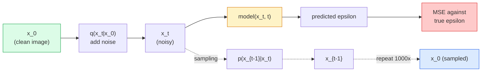

# 图像生成  Mô hình phân tán

> Mô hình phân tán học là denoise. Trình luyện nó để loại bỏ một phần nhỏ tiếng ồn trong hình ảnh có tiếng ồn, ngược lại lặp lại quá trình này một ngàn lần, bạn đã có được một máy tạo hình ảnh.

**Type:** Build
**Languages:** Python
**Prerequisites:** Phase 4 Lesson 07 (U-Net), Phase 1 Lesson 06 (Probability), Phase 3 Lesson 06 (Optimizers)
**Time:** ~75 分钟

## Học mục tiêu

- 推导 tiến hành quá trình âm thanh `x_0 -> x_1 -> ... -> x_T`, và giải thích tại sao lại đóng cửa`q(x_t | x_0)`Đối với bất cứ thành phố nào
- 实现一个DDPM 风格的训练目标,用于回归每一步加入的噪音,并实现一个从纯噪音 逐步回归图像的样本
-  xây dựng một U-Net thời gian điều kiện(小到可以在CPU上训练), được sử dụng để dự đoán bất kỳ bước thời gian tiếng ồn
- Giải thích sự khác biệt giữa việc lấy mẫu DDPM và DDIM, cũng như các trường hợp ứng dụng riêng của họ (Dân bài 23 会深入讲解流相匹配和修正流)

## 问题

GAN là một lần tạo: tiếng ồn  nhập, hình ảnh ra, chỉ cần một lần đi về phía trước. Chúng nhanh chóng, nhưng rất khó đào tạo. Các mô hình phân tán là một cách tạo ra: từ tiếng ồn nguyên chất, thông qua các bước nhỏ để chỉ ra, hình ảnh dần xuất hiện. Chúng chậm, nhưng dễ dàng đào tạo. Trong 5 năm qua, một đặc điểm sau đó chiếm ưu thế: bất kỳ nhóm nhỏ nào có thể đào tạo một mô hình phân tán và nhận được một mẫu hợp lý; trong khi đó, GAN là một kỹ thuật cần thiết trong nhiều năm thất bại trong hoạt động của Trung học.

Ngoài việc đào tạo ổn định, cấu trúc của Diffusion cũng giải quyết tất cả các khả năng trong sản xuất hình ảnh hiện đại: điều kiện văn bản, vẽ, chỉnh sửa hình ảnh, độ phân giải siêu cao, phong cách có thể kiểm soát. Mỗi bước trong vòng lấy mẫu đều là một bước vào một khối mới. Chính cái nón này, giúp Stable Diffusion, hình ảnh, DALL-E 3 và mỗi mô hình hình ảnh có thể kiểm soát được bạn sử dụng đều dựa trên Diffusion.

本课会构建一个最小的DDPM:forward noise、backward denoising、training loop──下一课(Stable Diffusion) sẽ kết nối nó vào một hệ thống sản xuất, trong đó có chứa VAE、text encoder 和 hướng dẫn không có phân loại──

## 核心概念

### tiến trình

取一张图像 `x_0`❖加入少量 Gaussian noise 得到 `x_1`                                                                                                                                                                                                                                                              `x_2` tiếp tục tiến hành các bước này cho đến khi`x_T`几乎无法与纯 Gaussian noise 区分──

```
q(x_t | x_{t-1}) = N(x_t; sqrt(1 - beta_t) * x_{t-1},  beta_t * I)
```

`beta_t`Đây là một lịch trình biến thể nhỏ hơn, thường trong T=1000 bước từ 0.0001 线性增长到0.02── mỗi bước sẽ giảm nhẹ tín hiệu và truyền vào tiếng ồn mới──

### 闭式跳转

Tiếp theo, tiếng ồn là một chuỗi Markov, nhưng toán học có thể gấp đôi: bạn có thể tiến một bước trực tiếp từ `x_0`mẫu xuất `x_t`

```
Define alpha_t = 1 - beta_t
Define alpha_bar_t = prod_{s=1..t} alpha_s

Then:
  q(x_t | x_0) = N(x_t; sqrt(alpha_bar_t) * x_0,  (1 - alpha_bar_t) * I)

Equivalently:
  x_t = sqrt(alpha_bar_t) * x_0 + sqrt(1 - alpha_bar_t) * epsilon
  where epsilon ~ N(0, I)
```

Cái cách duy nhất này là sự phân tán có thể thực hiện được tất cả các lý do. Khi tập luyện, bạn tự chọn một.`t`, trực tiếp từ`x_0`mẫu xuất `x_t`,并一步完成训练, không cần phải mô phỏng toàn bộ chuỗi Markov.

### quá trình ngược lại

tiến trình là cố định.`p(x_{t-1} | x_t)`Là mạng thần kinh cần học nội dung.`x_{t-1}`; chúng dự đoán trong bước thứ 3 加入的噪音 `epsilon`, rồi do các công thức toán học đưa ra`x_{t-1}`



### 训练 Loss

Đối với mỗi bước tập luyện:

1. mẫu 一张真实图像 `x_0`
2. Từ [1, T] 中 trung bình mẫu một bước thời gian `t`
3. Phản ứng âm thanh mẫu `epsilon ~ N(0, I)`
4. 计算 `x_t = sqrt(alpha_bar_t) * x_0 + sqrt(1 - alpha_bar_t) * epsilon`
5. 用 mạng 预测 `epsilon_theta(x_t, t)`
6. Tối thiểu`|| epsilon - epsilon_theta(x_t, t) ||^2`

Đó là như vậy. Mạng thần kinh học học ở bất kỳ thời gian nào.

### mẫu (DDPM)

生成时: từ `x_T ~ N(0, I)`开始, một bước ngược lại.

```
for t = T, T-1, ..., 1:
    eps = model(x_t, t)
    x_{t-1} = (1 / sqrt(alpha_t)) * (x_t - (beta_t / sqrt(1 - alpha_bar_t)) * eps) + sqrt(beta_t) * z
    where z ~ N(0, I) if t > 1, else 0
return x_0
```

Điều quan trọng là, mặc dù điều kiện ngược thường không có hình thức đóng cửa được biết đến, nhưng đối với quy trình tiến bộ Gaussian cụ thể này, nó là có kết thúc. Những hình thức không quá đẹp mắt có nguồn gốc từ quy tắc Bayes.

### Sao lại là 1000 bước?

Mục tiêu của việc chọn lịch âm thanh tiến tới là để mỗi bước gia nhập một số lượng âm thanh đủ tốt, làm cho bước ngược gần giống với Gaussian.

### DDIM:快 20 倍的抽样

训练相同,样本化 改变──DDIM(Song et al., 2020) xác định một quy trình ngược xác định, có thể nhảy qua các bước thời gian trong trường hợp không tái tập luyện── sử dụng DDIM theo 50 bước lấy mẫu, có thể đạt được gần 1000 bước chất lượng của DDPM── mỗi hệ thống sản xuất đều sử dụng DDIM hoặc các biến thể nhanh hơn(DPM-Solver、Euler tổ tiên)──

### Điều kiện thời gian

mạng lưới `epsilon_theta(x_t, t)`需要知道它正在指代 哪个时间步骤――现代 Diffusion Models 通过突状时间嵌入 注入 `t`(Điều tương tự như việc mã hóa vị trí trong các biến đổi), và mỗi cấp độ U-Net đưa nó vào các bản đồ tính năng trên.

```
t_embedding = sinusoidal(t)
feature_map += MLP(t_embedding)
```

Không có điều kiện thời gian, mạng lưới cần phải đoán mức độ tiếng ồn từ hình ảnh, điều này cũng có thể làm việc, nhưng hiệu quả mẫu sẽ thấp hơn rất nhiều.


```figure
cv-diffusion-image
```

##  xây dựng nó

### 步骤 1: lịch trình tiếng ồn

```python
import torch

def linear_beta_schedule(T=1000, beta_start=1e-4, beta_end=2e-2):
    return torch.linspace(beta_start, beta_end, T)


def precompute_schedule(betas):
    alphas = 1.0 - betas
    alphas_cumprod = torch.cumprod(alphas, dim=0)
    return {
        "betas": betas,
        "alphas": alphas,
        "alphas_cumprod": alphas_cumprod,
        "sqrt_alphas_cumprod": torch.sqrt(alphas_cumprod),
        "sqrt_one_minus_alphas_cumprod": torch.sqrt(1.0 - alphas_cumprod),
        "sqrt_recip_alphas": torch.sqrt(1.0 / alphas),
    }

schedule = precompute_schedule(linear_beta_schedule(T=1000))
```

预计算一次, trong đào tạo và lấy mẫu 时按指数收集──

### 步骤 2: Phân phối về phía trước (q_sample)

```python
def q_sample(x0, t, noise, schedule):
    sqrt_a = schedule["sqrt_alphas_cumprod"][t].view(-1, 1, 1, 1)
    sqrt_one_minus_a = schedule["sqrt_one_minus_alphas_cumprod"][t].view(-1, 1, 1, 1)
    return sqrt_a * x0 + sqrt_one_minus_a * noise
```

Một đường đi đóng cửa`t`Đó là một loạt các bước thời gian, hàng trong mỗi张图像对应一个.

### 步骤 3: Một U-Net thời gian điều kiện nhỏ

```python
import torch.nn as nn
import torch.nn.functional as F
import math

def timestep_embedding(t, dim=64):
    half = dim // 2
    freqs = torch.exp(-math.log(10000) * torch.arange(half, device=t.device) / half)
    args = t[:, None].float() * freqs[None]
    emb = torch.cat([args.sin(), args.cos()], dim=-1)
    return emb


class TinyUNet(nn.Module):
    def __init__(self, img_channels=3, base=32, t_dim=64):
        super().__init__()
        self.t_mlp = nn.Sequential(
            nn.Linear(t_dim, base * 4),
            nn.SiLU(),
            nn.Linear(base * 4, base * 4),
        )
        self.t_dim = t_dim
        self.enc1 = nn.Conv2d(img_channels, base, 3, padding=1)
        self.enc2 = nn.Conv2d(base, base * 2, 4, stride=2, padding=1)
        self.mid = nn.Conv2d(base * 2, base * 2, 3, padding=1)
        self.dec1 = nn.ConvTranspose2d(base * 2, base, 4, stride=2, padding=1)
        self.dec2 = nn.Conv2d(base * 2, img_channels, 3, padding=1)
        self.time_proj = nn.Linear(base * 4, base * 2)

    def forward(self, x, t):
        t_emb = timestep_embedding(t, self.t_dim)
        t_emb = self.t_mlp(t_emb)
        t_proj = self.time_proj(t_emb)[:, :, None, None]

        h1 = F.silu(self.enc1(x))
        h2 = F.silu(self.enc2(h1)) + t_proj
        h3 = F.silu(self.mid(h2))
        d1 = F.silu(self.dec1(h3))
        d2 = torch.cat([d1, h1], dim=1)
        return self.dec2(d2)
```

两层 U-Net, và nút chai vào điều kiện thời gian.

### Bước 4: vòng đào tạo

```python
def train_step(model, x0, schedule, optimizer, device, T=1000):
    model.train()
    x0 = x0.to(device)
    bs = x0.size(0)
    t = torch.randint(0, T, (bs,), device=device)
    noise = torch.randn_like(x0)
    x_t = q_sample(x0, t, noise, schedule)
    pred = model(x_t, t)
    loss = F.mse_loss(pred, noise)
    optimizer.zero_grad()
    loss.backward()
    optimizer.step()
    return loss.item()
```

Đó là vòng huấn luyện hoàn chỉnh. Không có trò chơi GAN, không có thua lỗ đặc biệt. Chỉ có một lần MSE 调用.

### 步骤 5: Sampler (DDPM)

```python
@torch.no_grad()
def sample(model, schedule, shape, T=1000, device="cpu"):
    model.eval()
    x = torch.randn(shape, device=device)
    betas = schedule["betas"].to(device)
    sqrt_one_minus_a = schedule["sqrt_one_minus_alphas_cumprod"].to(device)
    sqrt_recip_alphas = schedule["sqrt_recip_alphas"].to(device)

    for t in reversed(range(T)):
        t_batch = torch.full((shape[0],), t, dtype=torch.long, device=device)
        eps = model(x, t_batch)
        coef = betas[t] / sqrt_one_minus_a[t]
        mean = sqrt_recip_alphas[t] * (x - coef * eps)
        if t > 0:
            x = mean + torch.sqrt(betas[t]) * torch.randn_like(x)
        else:
            x = mean
    return x
```

Để tạo ra một loạt mẫu cần phải vượt qua 1000 lần. Trong thực code, bạn sẽ thay thế nó thành mẫu 50 bước DDIM.

### 步骤 6: Dùng mẫu DDIM (确定性,约快 20倍)

```python
@torch.no_grad()
def sample_ddim(model, schedule, shape, steps=50, T=1000, device="cpu", eta=0.0):
    model.eval()
    x = torch.randn(shape, device=device)
    alphas_cumprod = schedule["alphas_cumprod"].to(device)

    ts = torch.linspace(T - 1, 0, steps + 1).long()
    for i in range(steps):
        t = ts[i]
        t_prev = ts[i + 1]
        t_batch = torch.full((shape[0],), t, dtype=torch.long, device=device)
        eps = model(x, t_batch)
        a_t = alphas_cumprod[t]
        a_prev = alphas_cumprod[t_prev] if t_prev >= 0 else torch.tensor(1.0, device=device)
        x0_pred = (x - torch.sqrt(1 - a_t) * eps) / torch.sqrt(a_t)
        sigma = eta * torch.sqrt((1 - a_prev) / (1 - a_t) * (1 - a_t / a_prev))
        dir_xt = torch.sqrt(1 - a_prev - sigma ** 2) * eps
        noise = sigma * torch.randn_like(x) if eta > 0 else 0
        x = torch.sqrt(a_prev) * x0_pred + dir_xt + noise
    return x
```

`eta=0`                                                                                                                                                                                                                                                              `eta=1`会恢复 DDPM.

## Sử dụng nó

生产工作中, sử dụng `diffusers`- Có thể là:

```python
from diffusers import DDPMScheduler, UNet2DModel

unet = UNet2DModel(sample_size=32, in_channels=3, out_channels=3, layers_per_block=2)
scheduler = DDPMScheduler(num_train_timesteps=1000)
```

Đây là một công cụ cung cấp các lập trình viên hiện tại (DDPM, DDIM, DPM-Solver, Euler, Heun)  có thể cấu hình U-Nets, văn bản-to-image và hình ảnh-to-image, cũng như các trợ lý điều chỉnh tinh tế LoRA.

Trong nghiên cứu,`k-diffusion`(Katherine Crowson) có những phương pháp lấy mẫu tốt nhất và những phương pháp thực hiện đáng tin cậy nhất.

## 交付 nó

本课会产出:

- `outputs/prompt-diffusion-sampler-picker.md` Một lời nhắc, sẽ dựa trên chất lượng mục tiêu 延迟预算和条件 类型选择 DDPM / DDIM / DPM-Solver / Euler。
- `outputs/skill-noise-schedule-designer.md`Một kỹ năng, sẽ dựa trên T 和 mục tiêu mức độ tham nhũng 生成 tuyến tính, cócsin hoặc sigmoid beta lịch trình,并附带信号-噪音 tỷ lệ 随时间变化的诊断图――

## 练习

1. **（简单）**可视化 tiến trình:取一张图像,并绘画 `t in [0, 100, 250, 500, 750, 1000]`时的 `x_t`❖ 验证`x_1000`Có vẻ như là tiếng ồn Gaussian.
2. **（中等）**Trong tập dữ liệu vòng tròn tổng hợp 上训练 TinyUNet 20 个时代,并样 16 vòng tròn.
3. **（困难）**实现 cosine noise schedule ((Nichol & Dhariwal, 2021):`alpha_bar_t = cos^2((t/T + s) / (1 + s) * pi / 2)` Sử dụng lịch trình tuyến tính và cosine  luyện tập cùng một mô hình,并 hiển thị cosine trong số bước thấp có thể tạo ra mô hình tốt hơn 

## 关键术语

| Term | 人们通常怎么说 | 实际含义 |
|------|----------------|----------------------|
| Forward process | “随时间加入 noise” | 一个固定的 Markov chain，会在 T 步内把图像破坏成 Gaussian noise |
| Reverse process | “一步步 denoise” | 学到的分布，会从 noise 逐步走回图像 |
| Epsilon prediction | “预测 noise” | 训练目标：`epsilon_theta(x_t, t)` 预测在第 t 步加入的 noise |
| Beta schedule | “noise 大小” | T 个小 variance 组成的序列，定义每一步进入多少 noise |
| alpha_bar_t | “累计保留因子” | 到时间 t 为止的 (1 - beta_s) 乘积；t 越大，剩余信号越少 |
| DDPM sampler | “Ancestral，随机” | 从每个 x_{t-1} 的 conditional Gaussian 中 sample；1000 步 |
| DDIM sampler | “确定性，快速” | 将 sampling 重写为确定性 ODE；20-100 步即可得到相似质量 |
| Time conditioning | “告诉 model 当前是哪个 t” | 注入 U-Net 的 t 的 sinusoidal embedding，让它知道 noise level |

## 延伸阅读

- [Denoising Diffusion Probabilistic Models (Ho et al., 2020)](https://arxiv.org/abs/2006.11239) 让 Diffusion 变得实用并 FID 上击败 GANs 的论文
- [Improved DDPM (Nichol & Dhariwal, 2021)](https://arxiv.org/abs/2102.09672) lịch trình cosine và v-chỉ số hóa
- [DDIM (Song, Meng, Ermon, 2020)](https://arxiv.org/abs/2010.02502) 让实时推断 成为可能的确定性样本
- [Elucidating the Design Space of Diffusion (Karras et al., 2022)](https://arxiv.org/abs/2206.00364) Đối với mỗi Diffusion 设计选择的统一视角; hiện tại 参考最佳参考
