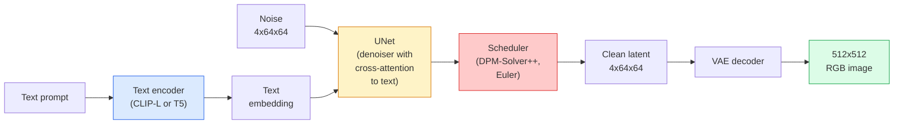

# Sự pha trộn ổn định  架构与细调

> Stable Diffusion là một loại DDPM, nó hoạt động trong không gian ẩn trong VAE, thông qua sự chú ý chéo 以文本为条件, sử dụng giải pháp ODE có độ nhanh nhất định 进行采样,并由类型无导导导导导导导导导.

**Type:** Learn + Use
**Languages:** Python
**Prerequisites:** Phase 4 Lesson 10 (Diffusion), Phase 7 Lesson 02 (Self-Attention)
**Time:** ~75 分钟

## Học mục tiêu
- 追踪 Stable Diffusion pipeline's五个组成部分:VAE、text encoder、U-Net、scheduler、security checker,并理解它们各自实际做什么
- 解释 sự phân tán ẩn, cũng như tại sao tập luyện trong không gian ẩn 4x64x64 thay vì tập luyện trên hình ảnh 3x512x512) có thể trong trường hợp không mất chất lượng sẽ giảm lượng tính toán 48x
- Sử dụng `diffusers`生成图像,运行 hình ảnh-to-photos、inpainting 和 ControlNet 引导的生成
- Trong tập dữ liệu tự định nhỏ sử dụng LoRA fine-tune Stable Diffusion, và suy luận 时加载 LoRA adapter

## 问题
直接在 512x512 RGB 图像上训练 DDPM 成本很高. Mỗi bước đào tạo phải đi qua một U-Net làm Backpropagation, trong khi U-Net này thấy là 3x512x512 = 786,432 个输入值;采样 cũng cần thông qua cùng một U-Net  thực hiện 50+ lần tiến hành.

让开权文字-to-image 变得实用技巧是 **latent diffusion**(Rombach et al., CVPR 2022)  đào tạo một VAE, sẽ 3x512x512 图像映射到4x64x64 潜伏子 再映射回来,然后在这个潜伏空间中做 Diffusion──计算量下降 `(3*512*512)/(4*64*64) = 48x`Trên cùng một chip GPU, thời gian lấy mẫu từ vài giây xuống còn hai giây.

Hầu như tất cả các mô hình hiện đại tạo mô hình SDXL、SD3、FLUX、HunyuanDiT、Wan-Video đều là mô hình phân tán tiềm ẩn, chỉ có những thay đổi trong mã hóa tự động、denoiser(U-Net hoặc DiT) và điều kiện văn bản.

## 概念
### Đường ống



- **VAE** 结的自动编码器──Encoder sẽ chuyển hình ảnh thành ẩn dụ(用于 img2img 和训练)──Decoder sẽ chuyển hình ảnh trở lại ẩn dụ──
- **Text encoder** CLIP text encoder(SD 1.x/2.x)、CLIP-L + CLIP-G(SDXL) hoặc T5-XXL(SD3/FLUX)。 tạo một chuỗi các token được nhúng。
- **U-Net** denoiser──包含 cross-attention 层, trong mỗi phân giải cấp độ từ latences tham dự đến văn bản nhúng──
- **Scheduler** 采样算法(DDIM、Euler、DPM-Solver++)。 chọn sigmas,并将预测的噪音 混合回 latente。
- **Safety checker** 可选的输出图像 NSFW / 非法内容过器──

### Hướng dẫn không có phân loại (CFG)

Thông thường văn bản điều kiện sẽ nhắm vào mỗi yêu cầu `c`Học tập`epsilon_theta(x_t, t, c)` CFG  đào tạo cùng một mạng, nhưng có 10% thời gian sẽ bị bỏ qua `c`(đổi thay cho không gian nhúng), để có được một có thể đồng thời dự đoán điều kiện 和 không điều kiện tiếng ồn một mô hình.

```
eps = eps_uncond + w * (eps_cond - eps_uncond)
```

`w`Đó là quy mô hướng dẫn.`w=0`Không có điều kiện,`w=1`là điều kiện bình thường,`w>1`会把输出推向更快 条件约束, giá cả là nhiều tính năng giảm.`w=7.5`

CFG là văn bản-để hình ảnh có thể đạt được chất lượng sản xuất. Không có nó, nhanh chóng để chuyển hướng đầu ra là yếu; có nó, nhanh chóng sẽ chiếm chủ quyền.

### Xơ cấu không gian trần gian

VAE's 4-channel latent không chỉ là hình ảnh sau khi nén. Nó là một đa dạng, trong đó là toán học vận hành lớn đối với các ứng dụng ngữ nghĩa edit(Quick engineering + interpolation đều xảy ra ở đây), cũng là Diffusion U-Net 投入全部建模预算进行训练的空间──解码 một không gian không gian tự nhiên 4x64x64 latent sẽ không tạo ra hình ảnh tự nhiên, nhưng sẽ tạo ra kết quả rác, vì chỉ có một số lượng tiềm ẩn cụ thể có thể giải mã cho hình ảnh hiệu quả──

2 kết quả:

1. **Img2img**= Để mã hóa hình ảnh như ẩn, thêm phần tiếng ồn, vận hành biểu thị, mã hóa lại.
2. **Inpainting**= tương tự như img2img, nhưng chỉ mới hóa trang 区域;非面膜 区域保留为已编码的隐藏──

### Kiến trúc U-Net

SD U-Net là phiên bản lớn của TinyUNet trong Bài học 10, và tăng thêm ba điểm:

- Mỗi không gian phân giải trên **Transformer blocks**, bao gồm sự chú ý tự trọng + sự chú ý chéo vào việc nhúng văn bản.
- Thông qua mã hóa sinus trên MLP  nhận được **Time embedding**
- mã hóa và decoder trong sự phù hợp phân giải giữa **Skip connections**

Tổng số参数 của SD 1.5: khoảng 860M。SDXL: khoảng 2.6B。FLUX: khoảng 12B。 Sự gia tăng của số参数 chủ yếu đến từ Attention Layer。

### LoRA tinh chỉnh

Đối với Stable Diffusion thực hiện điều chỉnh hoàn chỉnh  cần 20+ GB VRAM,并更新 860M 个参数。LoRA(Low-Rank Adaptation) giữ nguyên mô hình cơ bản 结,并向 Attention 层注入小型级分解矩阵。 được sử dụng cho SD của LoRA bộ chuyển đổi thường là 10-50 MB, trên đơn khối tiêu thụ cấp GPU trên đào tạo 10-60 phút, và suy luận 时作为降入修改 加载。

```
Original: W_q : (d_in, d_out)   frozen
LoRA:     W_q + alpha * (A @ B)   where A : (d_in, r), B : (r, d_out)

r is typically 4-32.
```

LoRA là một cách phát triển của hầu hết các cộng đồng.

### Các lịch trình bạn sẽ thấy

- **DDIM** 确定性, khoảng 50 bước, đơn giản.
- **Euler ancestral** 随机性,30-50 bước,样本略有创意──
- **DPM-Solver++ 2M Karras** 确定性,20-30 bước, sản xuất默认选择──
- **LCM / TCD / Turbo** mô hình phù hợp và các biến thể chưng cất;1-4 bước, nhưng sẽ hy sinh phần chất lượng.

Trong `diffusers`Trung chuyển lịch trình chỉ cần thay đổi một dòng, đôi khi không cần bất kỳ đào tạo nào về việc có thể sửa chữa các vấn đề mẫu.


```figure
cv3-latent-compression
```

##  xây dựng nó
本课端到端使用 `diffusers`, thay vì từ zero tái tạo Stable Diffusion. Bạn cần tái tạo phần của mình (VAE, text encoder, U-Net, scheduler) là chủ đề của mỗi khóa học của mình; mục tiêu của nó là quen thuộc với API cấp sản xuất.

### 步骤 1: Text-to-image

```python
import torch
from diffusers import StableDiffusionPipeline

pipe = StableDiffusionPipeline.from_pretrained(
    "runwayml/stable-diffusion-v1-5",
    torch_dtype=torch.float16,
).to("cuda")

image = pipe(
    prompt="a dog riding a skateboard in tokyo, studio ghibli style",
    guidance_scale=7.5,
    num_inference_steps=25,
    generator=torch.Generator("cuda").manual_seed(42),
).images[0]
image.save("dog.png")
```

`float16`Trong trường hợp không có mất chất lượng có thể nhìn thấy, VRAM sẽ giảm một nửa.`num_inference_steps=25`效果 tương đương với việc sử dụng DDIM 时 `num_inference_steps=50`

### 步骤 2: Thay đổi lập trình viên

```python
from diffusers import DPMSolverMultistepScheduler, EulerAncestralDiscreteScheduler

pipe.scheduler = DPMSolverMultistepScheduler.from_config(pipe.scheduler.config)
pipe.scheduler = EulerAncestralDiscreteScheduler.from_config(pipe.scheduler.config)
```

Các tập thể hiện được trong các tập thể hiện trên DDPM, sau đó sử dụng bất kỳ trình lập lịch nào.

### 步骤 3: Hình ảnh-đến-hình ảnh

```python
from diffusers import StableDiffusionImg2ImgPipeline
from PIL import Image

img2img = StableDiffusionImg2ImgPipeline.from_pretrained(
    "runwayml/stable-diffusion-v1-5",
    torch_dtype=torch.float16,
).to("cuda")

init_image = Image.open("dog.png").convert("RGB").resize((512, 512))
out = img2img(
    prompt="a dog riding a skateboard, oil painting",
    image=init_image,
    strength=0.6,
    guidance_scale=7.5,
).images[0]
```

`strength`biểu hiện trong việc chỉ định  trước phải gia nhập nhiều tiếng ồn(0.0 = 不变,1.0 = 完全重新生成) ・0.5-0.7 là phạm vi tiêu chuẩn chuyển giao phong cách。

### 步骤 4: Đơn

```python
from diffusers import StableDiffusionInpaintPipeline

inpaint = StableDiffusionInpaintPipeline.from_pretrained(
    "runwayml/stable-diffusion-inpainting",
    torch_dtype=torch.float16,
).to("cuda")

image = Image.open("dog.png").convert("RGB").resize((512, 512))
mask = Image.open("dog_mask.png").convert("L").resize((512, 512))

out = inpaint(
    prompt="a cat",
    image=image,
    mask_image=mask,
    guidance_scale=7.5,
).images[0]
```

Hình ảnh màu trắng trong mặt nạ là khu vực được tái tạo.

### 步骤 5: LoRA tải

```python
pipe.load_lora_weights("sayakpaul/sd-lora-ghibli")
pipe.fuse_lora(lora_scale=0.8)

image = pipe(prompt="a village square in ghibli style").images[0]
```

`lora_scale`控制强度;0.0 = 无效,1.0 = 完整效果──`fuse_lora`Sẽ chuyển đổi chuyển đổi, nhưng sẽ ngăn chặn chuyển đổi.`pipe.unfuse_lora()`

### 步骤 6: đào tạo LoRA (phác thảo)

Thực sự đào tạo LoRA 位于 `peft`Hoặc`diffusers.training`Trung Ương:

```python
# Pseudocode
for step, batch in enumerate(dataloader):
    images, prompts = batch
    latents = vae.encode(images).latent_dist.sample() * 0.18215

    t = torch.randint(0, num_train_timesteps, (batch_size,))
    noise = torch.randn_like(latents)
    noisy_latents = scheduler.add_noise(latents, noise, t)

    text_emb = text_encoder(tokenizer(prompts))

    pred_noise = unet(noisy_latents, t, text_emb)  # LoRA weights injected here

    loss = F.mse_loss(pred_noise, noise)
    loss.backward()
    optimizer.step()
```

Chỉ có các matrices LoRA 会接收 Gradient;base U-Net、VAE 和 text encoder đều được kết thúc. Sử dụng kích thước lô 为 1 和 điểm kiểm tra gradient, điều này có thể phù hợp với 8 GB VRAM。

## Sử dụng nó
Trong quá trình sản xuất, bạn thực sự cần phải làm một quyết định là:

- **Model family**SD 1.5 dùng cho mã nguồn mở  cộng đồng fine-tune,SDXL dùng cho độ trung thành cao hơn,SD3 / FLUX dùng cho hiện đại và yêu cầu giấy phép nghiêm ngặt.
- **Scheduler**:20-30 bước sử dụng DPM-Solver++ 2M Karras; khi độ trễ 低于 1s 时 sử dụng LCM-LoRA。
- **Precision**0480/4090 上使用 `float16`,A100 及更新设备上使用 `bfloat16`,VRAM 紧张时使用 `int8`(cứ qua `bitsandbytes`Hoặc`compel`(■)
- **Conditioning**:普通文本可用; Nếu cần kiểm soát mạnh hơn, trên đường ống cơ sở 之上加入ControlNet(canny、depth、pose)

Đối với lượng sản xuất,`AUTO1111`- `ComfyUI`是社区工具; đối với sản xuất API, sử dụng `diffusers`+ `accelerate`, hoặc sử dụng với TensorRT biên soạn của `optimum-nvidia`

## 交付 nó
本课产 出:

- `outputs/prompt-sd-pipeline-planner.md` Một lời nhắc, sẽ dựa trên ngân sách thời gian trễ  mục tiêu trung thành và hạn chế cấp phép  chọn SD 1.5 / SDXL / SD3 / FLUX, cũng như lập trình viên và độ chính xác.
- `outputs/skill-lora-training-setup.md` Một kỹ năng, được sử dụng để tự xác định tập dữ liệu biên soạn cấu hình đào tạo LoRA hoàn chỉnh, bao gồm tiêu đề, xếp hạng, kích thước lô và tốc độ học.

## 练习
1. **(Easy)**Sử dụng `[1, 3, 5, 7.5, 10, 15]`Trung `guidance_scale`生成同一个提示――描述图像如何变化―― 在哪个指导值开始出现文物?
2. **(Medium)** chọn tùy chọn thực tế ảnh, trong `[0.2, 0.4, 0.6, 0.8, 1.0]`của `strength`- Địa điểm`StableDiffusionImg2ImgPipeline`运行―― lực lượng nào có thể giữ lại cấu trúc trong khi thay đổi phong cách? Tại sao 1.0 sẽ hoàn toàn bỏ qua nhập?
3. **(Hard)**Sử dụng một đối tượng đơn lẻ (物、logo、角色) 10-20张 hình ảnh đào tạo một LoRA, và tạo ra những cảnh tượng mới của đối tượng đó.

## 关键术语
| Term | What people say | What it actually means |
|------|----------------|----------------------|
| Latent diffusion | “在 latents 中 diffuse” | 在 VAE latent space（4x64x64）而不是 pixel space（3x512x512）中运行整个 DDPM；节省 48x 计算量 |
| VAE scale factor | “0.18215” | 将 VAE 的原始 latent 重新缩放到大致 unit variance 的常数；硬编码在每个 SD pipeline 中 |
| Classifier-free guidance | “CFG” | 混合 conditional 和 unconditional noise predictions；影响最大的 inference knob |
| Scheduler | “Sampler” | 将 noise + model predictions 转换为 denoised latent trajectory 的算法 |
| LoRA | “Low-rank adapter” | 小型 rank-decomposition matrices，可在不触碰 base weights 的情况下 fine-tune Attention 层 |
| Cross-attention | “Text-image attention” | 从 latent tokens 到 text tokens 的 Attention；在每个 U-Net 层级注入 prompt 信息 |
| ControlNet | “Structure conditioning” | 一个单独训练的 adapter，用额外输入（canny、depth、pose、segmentation）引导 SD |
| DPM-Solver++ | “默认 scheduler” | 二阶确定性 ODE solver；在低 step counts（20-30）下拥有最佳质量（2026 年） |

## 延伸阅读
- [High-Resolution Image Synthesis with Latent Diffusion (Rombach et al., 2022)](https://arxiv.org/abs/2112.10752) Stable Diffusion 论文; chứa chứng minh rằng mỗi phân tích được thiết kế hợp lý
- [Classifier-Free Diffusion Guidance (Ho & Salimans, 2022)](https://arxiv.org/abs/2207.12598) CFG 论文
- [LoRA: Low-Rank Adaptation of Large Language Models (Hu et al., 2021)](https://arxiv.org/abs/2106.09685) LoRA ban đầu được sử dụng trong NLP; nó hầu như không cần phải sửa đổi khi chuyển sang SD
- [diffusers documentation](https://huggingface.co/docs/diffusers) Mỗi đường ống SD / SDXL / SD3 / FLUX
