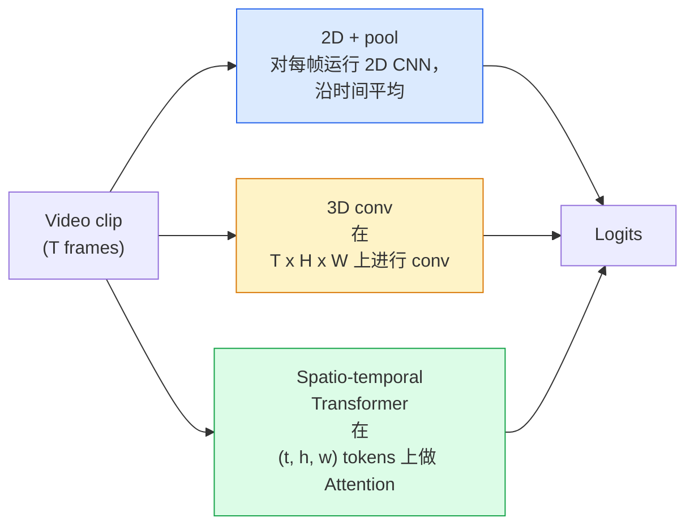

# Video Nghĩa  时间建模

> Video là một loạt các hình ảnh, cộng với các quy tắc vật lý kết nối chúng. Mỗi video mô hình phải xem thời gian như một trục phụ (xích) 3D conv, hoặc xem nó như một chuỗi cần phải thực hiện sự chú ý (xích) Transformer, hoặc xem nó như một đặc điểm một lần lần khai thác và tập hợp (xích) 2D + pool.

**类型：**Học tập + xây dựng
**语言：**Python
**先修要求：**Giai đoạn 4 Bài học 03(CNN),Giai đoạn 4 Bài học 04(Tân loại hình ảnh)
**时间：**~ 45 phút

## Học mục tiêu

- 区分三种主要视频建模方法(2D+pool、3D conv、space-temporal Transformer),并预测 chúng được lấy trên chi phí và tỷ lệ chính xác
- Trong PyTorch thực hiện lấy mẫu khung, hợp nhất thời gian, cũng như một phân loại đường cơ sở 2D + pool
- 解释 tại sao các hạt nhân I3D tăng 3D 能很好从 ImageNet trọng lượng 迁移,以及因数化 (2+1)D conv 的不同之处
- Nghĩ các tập hợp dữ liệu nhận dạng hành động tiêu chuẩn với các số liệu:Kinetics-400/600、UCF101、Something-Something V2; mức độ clip và mức độ video chính xác hàng đầu-1

## 问题

Một video 30 giây、30 fps chứa 900张图像── đơn giản xem, phân loại video là chạy phân loại hình ảnh 900 lần, sau đó làm một loại tập hợp── khi hoạt động gần như là hiển thị trong mỗi, phương pháp này hiệu quả(体育、、健身视频); nhưng khi hoạt động tự của mình được định nghĩa bởi động, nó sẽ bị thất bại nghiêm trọng:  đẩy một cái gì đó từ trái sang phải trong mỗi trông chỉ là hai vật tĩnh.

Vấn đề cốt lõi của mỗi video là: cấu trúc thời gian trong thời gian nào, bằng cách nào được xây dựng? Câu trả lời sẽ quyết định tất cả mọi thứ khác, bao gồm tính toán chi phí, chiến lược đào tạo, liệu có thể sử dụng lại trọng lượng ImageNet hay không, cũng như các tập hợp dữ liệu mà mô hình sẽ tập luyện trên.

本课刻意比静态图像课程更短──核心图像机制已经存在,而视频理解主要关注时间度的故事:样本化、建模和汇集──

## 核心概念

### 三类架构家族



### 2D + hồ bơi

取一个2D CNN(ResNet、EfficientNet、ViT) ⋅在每个采样上独立运行它──对每的嵌入做平均(或最大池,或注意池)──将聚向量输入分类器──

优点:
- ImageNet dự kiến đào tạo có thể chuyển trực tiếp.
- 实现最简单――
- 便宜:T  * 单张图像推断成本──

缺点:
- 无法建模运动──Action = sự tập hợp của sự xuất hiện──
- Tiếp tục hợp nhất thời gian đối với thứ tự không nhạy cảm;  cửa mở và  cửa đóng trông giống nhau

适用场景: để xuất hiện như một nhiệm vụ chủ yếu  小视频数据集 chuyển giao học  初始基线

### Chuyển chuyển 3D

Để thay thế các hạt nhân 2D (H, W) thành hạt nhân 3D (T, H, W).

I3D 技巧: lấy một mô hình 2D ImageNet được đào tạo trước, sẽ mỗi hạt nhân 2D 沿新时间轴复制,从而膨──一个 3x3 2D conv 变成一个 3x3x3 3D conv──这让 3D model 拥有强大的预训重,而不是从零开始训练──

优点:
- 直接建模 motion.
- Tăng lạm phát I3D  cung cấp học tập chuyển tiếp miễn phí.

缺点:
- 比对应的2D模型多 T/8的FLOPs (Từ 3 đến 3 lần)
- Các hạt nhân thời gian 很小;长程 chuyển động 需要金字塔或双流方法──

适用场景:motion 是信号的行动识别 ()  something-something V2 包含大量的运动重类的动力学) 

### 时空 Các biến thể

将视频 Tokenize 成空间-时间补丁 网格, và trong tất cả các补丁 之间做注意──TimeSformer、ViViT、Video Swin、VideoMAE──

 Quan trọng Các mô hình chú ý:
- **Joint** 在 (t, h, w) 上做一次大注意──对 `T*H*W`呈二次复杂度;昂贵.
- **Divided** Mỗi khối làm hai lần chú ý: một lần dọc theo thời gian, một lần dọc theo không gian.
- **Factorised** sự chú ý thời gian và sự chú ý không gian 在块之间交换──

优点:
- Trong tất cả các điểm chuẩn chính trên đạt được độ chính xác SOTA.
- 通过补丁通胀 从 hình ảnh Transformers(ViT)迁移──
- 通过稀疏关注 支持长文段视频──

缺点:
- 计算需求高――
- 需要谨慎选择 注意模式,否则运行时间会膨胀──

适用场景: 大数据集、高保真 video hiểu biết、 đa phương thức video+làm văn bản.

### Phân mẫu khung

Một clip 10 giây ≈ 30 fps có 300 ; đưa tất cả 300  vào bất kỳ mô hình nào đều rất lãng phí.

- **Uniform sampling** 在 clip 中均选取 T ──2D+pool 的默认选择──
- **Dense sampling** 随机连续 T-pháp cửa sổ──3D convs 中常见,因为 chuyển động 需要相邻──
- **Multi-clip** Từ cùng một video trong nhiều cửa sổ khung T, phân biệt phân loại, và trong thử nghiệm dự đoán trung bình.

T thường là 8、16、32 hoặc 64。 T cao hơn = 更多时间信号, cũng có nghĩa là nhiều hơn tính toán。

### Đánh giá

Hai cấp độ:
- **Clip-level accuracy** 模型 nhìn thấy một clip khung T, báo cáo top-k。
- **Video-level accuracy** Dự đoán cấp độ clip cho nhiều clip của mỗi video lấy trung bình; cao hơn và ổn định hơn.

始终报告两者──一个得分为78% clip / 82% video模型高度依赖测试时间平均;一个得分为80% / 81%模型在每片上更强──

### Các bạn sẽ gặp dữ liệu tập hợp

- **Kinetics-400 / 600 / 700** 通用 hành động tập dữ liệu──400k clip;YouTube URLs(很多现在已失效)──
- **Something-Something V2** 由 motion 定义的行动(移动X từ trái sang phải)。无法使用2D+pool 解决。
- **UCF-101****HMDB-51** 更老、更小, nhưng vẫn được báo cáo.
- **AVA** Trong không gian và thời gian hành động *localization*; Than phân loại hơn khó khăn.


```figure
v4-video-temporal
```

##  xây dựng nó

### 步骤 1: Phân mẫu khung

适用于 khung hình 列表(或 video tensor) 和 密集 mẫu đơn vị

```python
import numpy as np

def sample_uniform(num_frames_total, T):
    if num_frames_total <= T:
        return list(range(num_frames_total)) + [num_frames_total - 1] * (T - num_frames_total)
    step = num_frames_total / T
    return [int(i * step) for i in range(T)]


def sample_dense(num_frames_total, T, rng=None):
    rng = rng or np.random.default_rng()
    if num_frames_total <= T:
        return list(range(num_frames_total)) + [num_frames_total - 1] * (T - num_frames_total)
    start = int(rng.integers(0, num_frames_total - T + 1))
    return list(range(start, start + T))
```

Hai người đều quay lại`T`个 chỉ số, được sử dụng cho clip video tensor

### 步骤 2: một 2D + pool cơ sở

Trong mỗi hoạt động trên 2D ResNet-18, tính năng trung bình-bể, rồi phân loại.

```python
import torch
import torch.nn as nn
from torchvision.models import resnet18, ResNet18_Weights

class FramePool(nn.Module):
    def __init__(self, num_classes=400, pretrained=True):
        super().__init__()
        weights = ResNet18_Weights.IMAGENET1K_V1 if pretrained else None
        backbone = resnet18(weights=weights)
        self.features = nn.Sequential(*(list(backbone.children())[:-1]))  # global avg pool kept
        self.head = nn.Linear(512, num_classes)

    def forward(self, x):
        # x: (N, T, 3, H, W)
        N, T = x.shape[:2]
        x = x.view(N * T, *x.shape[2:])
        feats = self.features(x).view(N, T, -1)
        pooled = feats.mean(dim=1)
        return self.head(pooled)

model = FramePool(num_classes=10)
x = torch.randn(2, 8, 3, 224, 224)
print(f"output: {model(x).shape}")
print(f"params: {sum(p.numel() for p in model.parameters()):,}")
```

Một ngàn một triệu tham số,ImageNet được đào tạo trước, từng hoạt động, trung bình, phân loại. Trong các công việc có vẻ nặng nề, đường cơ sở này thường chỉ thấp 5-10 điểm so với các mô hình 3D thực tế, đôi khi thậm chí tốt hơn, bởi vì nó đã sử dụng xương sống ImageNet mạnh hơn.

### 步骤 3:I3D kiểu bơm 3D

Thông qua các trọng lượng trọng lượng thời gian mới, sẽ có một con 2D chuyển thành con 3D.

```python
def inflate_2d_to_3d(conv2d, time_kernel=3):
    out_c, in_c, kh, kw = conv2d.weight.shape
    weight_3d = conv2d.weight.data.unsqueeze(2)  # (out, in, 1, kh, kw)
    weight_3d = weight_3d.repeat(1, 1, time_kernel, 1, 1) / time_kernel
    conv3d = nn.Conv3d(in_c, out_c, kernel_size=(time_kernel, kh, kw),
                        padding=(time_kernel // 2, conv2d.padding[0], conv2d.padding[1]),
                        stride=(1, conv2d.stride[0], conv2d.stride[1]),
                        bias=False)
    conv3d.weight.data = weight_3d
    return conv3d

conv2d = nn.Conv2d(3, 64, kernel_size=3, padding=1, bias=False)
conv3d = inflate_2d_to_3d(conv2d, time_kernel=3)
print(f"2D weight shape:  {tuple(conv2d.weight.shape)}")
print(f"3D weight shape:  {tuple(conv3d.weight.shape)}")
x = torch.randn(1, 3, 8, 56, 56)
print(f"3D output shape:  {tuple(conv3d(x).shape)}")
```

Ngoài ra`time_kernel`会让 kích hoạt quy mô 大致保持不变, điều này rất quan trọng đối với không phá hủy các thống kê chuẩn hàng loạt trong quá trình truyền tải lần đầu tiên.

### 步骤 4:Trong các yếu tố (2+1) D con

Để phân chia 3D conv thành một 2D không gian conv và một 1D thời gian conv.

```python
class Conv2Plus1D(nn.Module):
    def __init__(self, in_c, out_c, kernel_size=3):
        super().__init__()
        mid_c = (in_c * out_c * kernel_size * kernel_size * kernel_size) \
                // (in_c * kernel_size * kernel_size + out_c * kernel_size)
        self.spatial = nn.Conv3d(in_c, mid_c, kernel_size=(1, kernel_size, kernel_size),
                                 padding=(0, kernel_size // 2, kernel_size // 2), bias=False)
        self.bn = nn.BatchNorm3d(mid_c)
        self.act = nn.ReLU(inplace=True)
        self.temporal = nn.Conv3d(mid_c, out_c, kernel_size=(kernel_size, 1, 1),
                                  padding=(kernel_size // 2, 0, 0), bias=False)

    def forward(self, x):
        return self.temporal(self.act(self.bn(self.spatial(x))))

c = Conv2Plus1D(3, 64)
x = torch.randn(1, 3, 8, 56, 56)
print(f"(2+1)D output: {tuple(c(x).shape)}")
```

完整的R(2+1)D网络就像一个ResNet-18, chỉ cần thay đổi mỗi 3x3conv thành`Conv2Plus1D`

## Sử dụng nó

Hai bộ phận bao gồm các hoạt động video:

- `torchvision.models.video` R(2+1) D、MViT、Swin3D, với trọng lượng Kinetics được đào tạo trước.
- `pytorchvideo`(Meta)  mô hình zoo 、 được sử dụng cho các bộ tải dữ liệu của Kinetics / SSv2 / AVA 、 chuẩn chuyển đổi ⋅

对于视频模特视频语言 (视频标题,视频质量),使用 `transformers`(`VideoMAE``VideoLLaMA``InternVideo`(■)

## 交付 nó

本课会产出:

- `outputs/prompt-video-architecture-picker.md` Một lời nhắc, dựa trên hình dạng đối với chuyển động, kích thước bộ dữ liệu và ngân sách tính toán  chọn 2D+pool / I3D / (2+1)D / Transformer。
- `outputs/skill-frame-sampler-auditor.md` Một kỹ năng, được sử dụng để kiểm tra mẫu ống dẫn video,并标记常见错误:off-by-one index`num_frames < T`时 lấy mẫu 不均、缺少 aspect-preserving crop 等──

## 练习

1. **（简单）**计算 FramePool trong T=8 时的 FLOPs(近似值),并与 T=8 的 I3D-style 3D ResNet对比──说明为什么 2D+pool 便宜 3-5 倍──
2. **（中等）**生成一个合成视频数据集:随机小球朝随机方向移动,并按运动方向标注(左到右、右到左、斜向) ⋅ trên đó luyện tập FramePool── hiển thị tỷ lệ độ chính xác của nó gần như随机水平, do đó chứng minh chỉ dựa trên ngoại hình không đủ để hoàn thành các nhiệm vụ chuyển động──
3. **（困难）**通过将 ResNet-18 中的每个 Conv2d 替换为 `Conv2Plus1D`, xây dựng một R(2+1) D-18── sử dụng ImageNet được đào tạo trước ResNet-18 thổi bồng thứ nhất con số của khối lượng── trên tập 2 của bộ dữ liệu chuyển động 上训练,并超过 FramePool──

## 关键术语

| Term | 人们常说 | 实际含义 |
|------|----------------|----------------------|
| 2D + pool | “Per-frame classifier” | 在每个采样帧上运行 2D CNN，跨时间 average-pool features，然后分类 |
| 3D convolution | “Spatio-temporal kernel” | 在 (T, H, W) 上进行 conv 的 kernel；可以原生建模 motion |
| Inflation | “Lift 2D weights to 3D” | 通过沿新的时间轴重复 2D conv 的 weights 来初始化 3D conv weights，然后除以 kernel_T 以保持 activation scale |
| (2+1)D | “Factorised conv” | 将 3D 拆成 2D spatial + 1D temporal；参数更少，中间多一个非线性 |
| Divided attention | “Time then space” | 每层有两次 Attention 的 Transformer block：一次在同一帧的 tokens 上，一次在同一位置的 tokens 上 |
| Clip | “T-frame window” | T 帧的采样子序列；video model 消费的单位 |
| Clip vs video accuracy | “Two eval settings” | Clip = 每个视频一个 sample，video = 对多个 sampled clips 取平均 |
| Kinetics | “The ImageNet of video” | 400-700 个 action classes，300k+ YouTube clips，标准 video pretraining corpus |

## 延伸阅读

- [I3D: Quo Vadis, Action Recognition (Carreira & Zisserman, 2017)](https://arxiv.org/abs/1705.07750)  đề xuất lạm phát và bộ dữ liệu Kinetics
- [R(2+1)D: A Closer Look at Spatiotemporal Convolutions (Tran et al., 2018)](https://arxiv.org/abs/1711.11248) con số được phân tích, cho đến nay vẫn là cơ sở mạnh
- [TimeSformer: Is Space-Time Attention All You Need? (Bertasius et al., 2021)](https://arxiv.org/abs/2102.05095) Đầu tiên là máy biến thể video mạnh mẽ
- [VideoMAE (Tong et al., 2022)](https://arxiv.org/abs/2203.12602) Sử dụng video của tự động mã hóa che giấu dự phòng đào tạo; hiện tại chính thống chế độ dự phòng đào tạo
