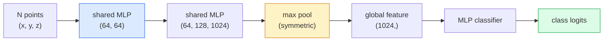

# 3D Vision  Point Clouds & NeRFs

> Tầm nhìn 3D có hai hình thức. Mây điểm là đầu ra đầu tiên của cảm biến. NeRF là lĩnh vực khối lượng mà bạn học được.

**类型：**Học + xây dựng
**语言：**Python
**先修：**Giai đoạn 4 Bài học 03 (CNN), Giai đoạn 1 Bài học 12 (Hành động áp lực)
**时间：**~ 45 phút

## Học mục tiêu
- 区分显式(point cloud、mesh、voxel) 和隐式(signed distance field、NeRF) 3D representations,并理解各自适用场景
- Nghĩ về chức năng đối xứng của PointNet: làm thế nào nó làm cho mạng thần kinh đối với các tập điểm không có thứ tự có tính chất không thay đổi
-  theo dõi NeRF đi trước: phát tia ng số lượng ng định vị ng độ mật độ MLP + đầu màu
- Sử dụng `nerfstudio`Hoặc`instant-ngp`Dựa trên hình ảnh của một số ít có thể chụp hình ảnh, thực hiện tái tạo 3D được đào tạo trước

## 问题
Camera  tạo hình ảnh 2D。LIDAR  tạo một nhóm không có thứ tự của các điểm 3D。Structure-from-motion pipeline  tạo ra những điểm khóa 3D hiếm có mây。NeRF có thể từ một lượng nhỏ có hình ảnh chụp lại toàn bộ cảnh 3D。These are all belong to vision, but they are not like CNN 想要的密集 tensor。

Tầm nhìn 3D rất quan trọng, bởi vì hầu hết các nhiệm vụ robot có giá trị cao đều hoạt động trong 3D: nắm bắt, tránh rào cản, điều hướng, bịt kín của AR, chụp nội dung 3D. Chỉ cần hiểu kỹ sư tầm nhìn của hình ảnh 2D, sẽ bị loại trừ khỏi phần phát triển nhanh nhất trong lĩnh vực này.

Đây là hai loại đại diện vì các lý do khác nhau. Các đám mây điểm là cảm biến 免费给你东西. NeRFs 及其后者.

## 概念
### Những đám mây điểm

Point cloud là tập hợp không trật tự của các điểm R^3 trong N 个点, mỗi điểm có tính năng màu sắc, cường độ, bình thường)

```
cloud = [
  (x1, y1, z1, r1, g1, b1),
  (x2, y2, z2, r2, g2, b2),
  ...
  (xN, yN, zN, rN, gN, bN),
]
```

Không có lưới điện, không có kết nối. Hai tính chất khiến cho mạng thần kinh gặp khó khăn:

- **Permutation invariance** 输出 không thể phụ thuộc vào thứ tự.
- **Variable N** Một mô hình  phải có thể xử lý các đám mây khác nhau kích thước.

PointNet (Qi et al., 2017) dùng một ý tưởng giải quyết hai điều: đối với mỗi ứng dụng điểm chia sẻ MLP, sau đó sử dụng hàm đối xứng (max pool)聚合── kết quả là một vector cố định lớn, và không phụ thuộc vào thứ tự.

```
f(P) = max_{p in P} MLP(p)
```

Đây là toàn bộ lõi của PointNet. Các biến thể sâu hơn của PointNet (PointNet++、Point Transformer) đã gia nhập các mẫu phân cấp và tổng hợp địa phương, nhưng các kỹ năng đối xứng không thay đổi.

### Kiến trúc PointNet



 chia sẻ MLP biểu thị cùng một MLP 独立地运行在每个点上──为了效率, thường được thực hiện cho chiều kích dọc của 1x1 conv──

### Các trường phát xạ thần kinh (Neural Radiance Fields - NeRF)

NeRFs (Mildenhall et al., 2020)  đưa ra câu hỏi: 我们能否从 N 张照片重建一个3D场景?答案是:用一个自自就是场景的神经网络.`(x, y, z, viewing_direction)`映射到 `(density, colour)`染新视角 là một vòng tròn phóng xạ xung quanh mạng lưới.

```
NeRF MLP:  (x, y, z, theta, phi) -> (sigma, r, g, b)

To render a pixel (u, v) of a new view:
  1. Cast a ray from the camera through pixel (u, v)
  2. Sample points along the ray at distances t_1, t_2, ..., t_N
  3. Query the MLP at each point
  4. Composite the colours weighted by (1 - exp(-sigma * dt))
  5. The sum is the rendered pixel colour
```

Loss 会将染出像素与训练照片中的地面真相像素 进行比较──通过染步骤做 Backprop 来更新 MLP──没有3D地面真相,没有显式几何场景 存储在MLP权重中──

### NèRF trong mã hóa vị trí

作用在 `(x, y, z)`MLP vanilla trên không thể biểu hiện chi tiết频 cao, vì MLP trên tần số chuyển sang频 thấp. NeRF thông qua chuyển vào MLP trước, sẽ sửa đổi mỗi phối hợp thành Vêctơ tính năng Fourier:

```
gamma(p) = (sin(2^0 pi p), cos(2^0 pi p), sin(2^1 pi p), cos(2^1 pi p), ...)
```

Tối cao đến L=10 个 tần số. Đây là cùng một kỹ thuật với các biến áp sử dụng các vị trí, cũng sẽ xuất hiện trong điều kiện thời gian phân phối (Dân học 10) một lần nữa. Không có nó, NeRF trông sẽ rất mờ.

### Phân tích khối lượng

```
C(r) = sum_i T_i * (1 - exp(-sigma_i * delta_i)) * c_i

T_i  = exp(- sum_{j<i} sigma_j * delta_j)
delta_i = t_{i+1} - t_i
```

`T_i`Đó là sự truyền tải, đó là có nhiều ánh sáng có thể đạt đến điểm i.`(1 - exp(-sigma_i * delta_i))`n n n n n n n n n n n n n n n n n n n n n n n n n n n n n n n n n n n n n n n n n n n n n n n n n n n n n n n n n n n n n n n n n n n n n n n n n n n n n n n n n n n n n n n n n n n n n n n n n n`c_i`là màu. Cuối cùng, pixel là trên xơ xơ.

### Điều gì thay thế NeRF

纯 NeRFs 训练慢(数小时), 染也慢(每张图数秒)

- **Instant-NGP**(2022)  mã hóa lưới hash 替代 MLP 位置 input;数秒内完成训练──
- **Mip-NeRF 360**  xử lý các cảnh không giới hạn 和 chống liềm.
- **3D Gaussian Splatting**(2023)  Sử dụng hàng triệu Gaussians 3D thay thế lĩnh vực khối lượng; số phút luyện tập, thực thời染──

Năm 2026 hầu hết các sản phẩm NeRF thực tế đều là 3D Gaussian splatting.

### Các bộ dữ liệu và các chỉ số tham chiếu

- **ShapeNet** Phân tích mô hình CAD 3D  như đám mây điểm  thực hiện phân loại và phân đoạn.
- **ScanNet** Sử dụng để phân đoạn trong thực tế phòng quét.
- **KITTI** Sử dụng cho lái xe tự động của户外 LIDAR điểm đám mây
- **NeRF Synthetic**- **Blended MVS** dùng để xem tổng hợp các bộ dữ liệu hình ảnh được đặt trên hình ảnh.
- **Mip-NeRF 360**bộ dữ liệu  không giới hạn các cảnh thực。


```figure
nerf-rays
```

##  xây dựng nó
### 步骤 1: Cân loại PointNet

```python
import torch
import torch.nn as nn

class PointNet(nn.Module):
    def __init__(self, num_classes=10):
        super().__init__()
        self.mlp1 = nn.Sequential(
            nn.Conv1d(3, 64, 1),    nn.BatchNorm1d(64),   nn.ReLU(inplace=True),
            nn.Conv1d(64, 64, 1),   nn.BatchNorm1d(64),   nn.ReLU(inplace=True),
        )
        self.mlp2 = nn.Sequential(
            nn.Conv1d(64, 128, 1),  nn.BatchNorm1d(128),  nn.ReLU(inplace=True),
            nn.Conv1d(128, 1024, 1), nn.BatchNorm1d(1024), nn.ReLU(inplace=True),
        )
        self.head = nn.Sequential(
            nn.Linear(1024, 512),   nn.BatchNorm1d(512),  nn.ReLU(inplace=True),
            nn.Dropout(0.3),
            nn.Linear(512, 256),    nn.BatchNorm1d(256),  nn.ReLU(inplace=True),
            nn.Dropout(0.3),
            nn.Linear(256, num_classes),
        )

    def forward(self, x):
        # x: (N, 3, num_points) — transposed for Conv1d
        x = self.mlp1(x)
        x = self.mlp2(x)
        x = torch.max(x, dim=-1)[0]       # (N, 1024)
        return self.head(x)

pts = torch.randn(4, 3, 1024)
net = PointNet(num_classes=10)
print(f"output: {net(pts).shape}")
print(f"params: {sum(p.numel() for p in net.parameters()):,}")
```

约1.6M tham số. Mỗi đám mây hoạt động trên 1.024 điểm.

### 步骤 2: Mã hóa vị trí

```python
def positional_encoding(x, L=10):
    """
    x: (..., D) -> (..., D * 2 * L)
    """
    freqs = 2.0 ** torch.arange(L, dtype=x.dtype, device=x.device)
    args = x.unsqueeze(-1) * freqs * 3.141592653589793
    sinc = torch.cat([args.sin(), args.cos()], dim=-1)
    return sinc.reshape(*x.shape[:-1], -1)

x = torch.randn(5, 3)
y = positional_encoding(x, L=10)
print(f"input:  {x.shape}")
print(f"encoded: {y.shape}     # (5, 60)")
```

- Đúng rồi.`2^l * pi`Sẽ có tần số cao hơn dần dần.

### 步骤 3: NLP NeRF nhỏ

```python
class TinyNeRF(nn.Module):
    def __init__(self, L_pos=10, L_dir=4, hidden=128):
        super().__init__()
        self.L_pos = L_pos
        self.L_dir = L_dir
        pos_dim = 3 * 2 * L_pos
        dir_dim = 3 * 2 * L_dir
        self.trunk = nn.Sequential(
            nn.Linear(pos_dim, hidden), nn.ReLU(inplace=True),
            nn.Linear(hidden, hidden),  nn.ReLU(inplace=True),
            nn.Linear(hidden, hidden),  nn.ReLU(inplace=True),
            nn.Linear(hidden, hidden),  nn.ReLU(inplace=True),
        )
        self.sigma = nn.Linear(hidden, 1)
        self.color = nn.Sequential(
            nn.Linear(hidden + dir_dim, hidden // 2), nn.ReLU(inplace=True),
            nn.Linear(hidden // 2, 3), nn.Sigmoid(),
        )

    def forward(self, x, d):
        x_enc = positional_encoding(x, self.L_pos)
        d_enc = positional_encoding(d, self.L_dir)
        h = self.trunk(x_enc)
        sigma = torch.relu(self.sigma(h)).squeeze(-1)
        rgb = self.color(torch.cat([h, d_enc], dim=-1))
        return sigma, rgb

nerf = TinyNeRF()
x = torch.randn(128, 3)
d = torch.randn(128, 3)
s, c = nerf(x, d)
print(f"sigma: {s.shape}   rgb: {c.shape}")
```

Tương tự với NeRF nguyên thủy, có 2 个 độ sâu 8 của MLP thân) tương đương rất nhỏ.

### 步骤 4: Phân tích quy mô dọc theo một tia

```python
def volumetric_render(sigma, rgb, t_vals):
    """
    sigma: (..., N_samples)
    rgb:   (..., N_samples, 3)
    t_vals: (N_samples,) distances along the ray
    """
    delta = torch.cat([t_vals[1:] - t_vals[:-1], torch.full_like(t_vals[:1], 1e10)])
    alpha = 1.0 - torch.exp(-sigma * delta)
    trans = torch.cumprod(torch.cat([torch.ones_like(alpha[..., :1]), 1.0 - alpha + 1e-10], dim=-1), dim=-1)[..., :-1]
    weights = alpha * trans
    rendered = (weights.unsqueeze(-1) * rgb).sum(dim=-2)
    depth = (weights * t_vals).sum(dim=-1)
    return rendered, depth, weights


N = 64
t_vals = torch.linspace(2.0, 6.0, N)
sigma = torch.rand(N) * 0.5
rgb = torch.rand(N, 3)
rendered, depth, weights = volumetric_render(sigma, rgb, t_vals)
print(f"rendered colour: {rendered.tolist()}")
print(f"depth:           {depth.item():.2f}")
```

Một xơ, 64 mẫu, hợp thành một pixel RGB và một độ sâu.

## Sử dụng nó
用于真实工作:

- `nerfstudio`(Tancik et al.)  当前用于 NeRF / Instant-NGP / Gaussian Splatting 的参考库──命令行加 web viewer──
- `pytorch3d`(Meta)  phân biệt rendering, point-cloud utilities, mesh ops.
- `open3d` xử lý đám mây điểm, đăng ký, hình ảnh hóa.

部署时,3D Gaussian splatting 已基本取代纯 NeRFs, vì nó 染速度快 100倍──

## 交付 nó
本课产 出:

- `outputs/prompt-3d-task-router.md` Một lời nhắc, sẽ tùy thuộc vào nhiệm vụ và dữ liệu nhập 路由到合适的 3D đại diện ((point cloud、mesh、voxel、NeRF、Gaussian splat) 
- `outputs/skill-point-cloud-loader.md`Một kỹ năng, để viết PyTorch`Dataset`, tải .ply / .pcd / .xyz 文件,并 thực hiện chuẩn hóa chính xác, tập trung và lấy mẫu điểm

## 练习
1. **（Easy）**证明 PointNet là permutation-invariant: sẽ cùng một đám mây 运行两次,一次保持原顺序,一次打乱点――验证输出除了浮点噪音 之外完全相同――
2. **（Medium）**实现一个最小射线生成函数:给定摄像头内在和姿势,为 H x W hình ảnh của mỗi pixel 生成射线起源和方向――
3. **（Hard）**Trong hình ảnh rendered của color cube 合成 dataset 上训练 TinyNeRF(可通过可分化 rendering或简单射线追踪生成) ⋅ báo cáo thời đại 1、10 和 100 của rendering loss──Model 在哪个时代 产生可识别的视图?

## 关键术语
| Term | 人们常说 | 实际含义 |
|------|----------------|----------------------|
| Point cloud | “来自 LIDAR 的 3D points” | 无序的 (x, y, z) 集合 + 每个点可选的 features |
| PointNet | “第一个用于 point clouds 的 neural net” | 每个点一个 shared MLP + symmetric (max) pool；结构上天然 permutation-invariant |
| NeRF | “本身就是 scene 的 MLP” | 将 (x, y, z, dir) 映射到 (density, colour) 的 network；通过 ray casting 渲染 |
| Positional encoding | “Fourier features” | 将每个 coordinate 编码为多个 frequencies 下的 sin/cos，以克服 MLP 的低频偏置 |
| Volumetric rendering | “Ray integration” | 使用 transmittance 和 alpha 将 ray 上的 samples 合成为单个 pixel |
| Instant-NGP | “Hash-grid NeRF” | 用 multi-resolution hash grid 替换 NeRF 的 coordinate MLP；快 100-1000 倍 |
| 3D Gaussian splatting | “数百万个 Gaussians” | Scene = 3D Gaussians 的集合；实时渲染，数分钟训练 |
| SDF | “Signed distance field” | 返回到最近 surface 的 signed distance 的 function；另一种 implicit representation |

## 延伸阅读
- [PointNet (Qi et al., 2017)](https://arxiv.org/abs/1612.00593) Định dạng hóa biến đổi thay đổi
- [NeRF (Mildenhall et al., 2020)](https://arxiv.org/abs/2003.08934) 让从照片进行3D重建 成为神经网络问题 的论文
- [Instant-NGP (Müller et al., 2022)](https://arxiv.org/abs/2201.05989) lưới hash,1000 倍加速
- [3D Gaussian Splatting (Kerbl et al., 2023)](https://arxiv.org/abs/2308.04079) Trong sản xuất thay thế NeRFs kiến trúc
