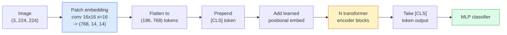

# Máy biến hình thị giác (ViT)

> Để hình ảnh cắt thành các bản vá, để mỗi bản vá như một từ, vận hành tiêu chuẩn biến đổi.

**类型：**构建
**语言：**Python
**前置要求：**Giai đoạn 7 Bài học 02 (Tự chú ý), Giai đoạn 4 Bài học 04 (Tân loại hình ảnh)
**时间：**~ 45 phút

## Học mục tiêu

- Từ việc thực hiện zero patch embedment, học được embedment vị trí, class token và transformer encoder blocks, xây dựng một ViT tối thiểu
- 解释 tại sao ViT  từng được cho là cần thiết cho dữ liệu đào tạo trước biển, cho đến khi DeiT và MAE chứng minh không phải vậy
- Từ góc độ kiến trúc tiên tiến so sánh ViT、Swin 和 ConvNeXt(无先验、本地窗口注意、conv spine)
- Sử dụng `timm`和标准 tuyến tính-sử / tinh chỉnh 流程, trong小数据集上细调 预训练 ViT

## 问题

Trong 10 năm qua, sự biến đổi gần như là một từ ngữ của tầm nhìn máy tính. CNN có những thiên vị gợi cảm rất mạnh, bao gồm cả địa điểm, tương đương dịch, không ai nghĩ rằng bạn có thể thay thế chúng.

关键 là ở  quy mô đủ lớn. Ở ImageNet-1k, ViT đã chuyển giao ResNet. Trước đó tại ImageNet-21k hoặc JFT-300M, lại ở ImageNet-1k, ViT trong các bản chỉnh sửa tinh tế đã vượt qua nó. Kết luận lúc đó là: các nhà biến đổi thiếu kinh nghiệm hữu ích, nhưng có thể học được những kinh nghiệm này từ đủ dữ liệu.

Đến năm 2026, CNN trong các thiết bị cạnh tranh vẫn có sức cạnh tranh, nhưng các nhà biến đổi đã chủ yếu hướng tới hầu hết các phương diện khác: phân đoạn, phát hiện, phân tích, phân tích, phân tích, phân tích, phân tích, phân tích, phân tích, phân tích, phân tích, phân tích, phân tích, phân tích, phân tích, phân tích, phân tích, phân tích, phân tích, phân tích, phân tích, phân tích, phân tích, phân tích, phân tích, phân tích, phân tích, phân tích, phân tích, phân tích, phân tích, phân tích, phân tích, phân tích, phân tích, phân tích, phân tích, phân tích, phân tích, phân tích, phân tích, phân tích, phân tích, phân tích, phân tích, phân tích, phân tích, phân tích, phân tích, phân tích, phân tích, phân tích, phân tích, phân tích, phân tích, phân tích, phân tích, phân tích, phân tích, phân tích, phân tích, phân tích, phân tích, phân tích, phân tích, phân tích, phân tích, phân tích, phân tích, phân tích, phân tích, phân tích, phân tích, phân tích, phân tích, phân tích, phân tích, phân tích, phân tích, phân tích, phân tích, phân tích, phân tích, phân tích, phân tích, phân tích, phân tích, phân tích, phân tích, phân tích, phân tích, phân tích, phân tích, phân tích, phân tích, phân tích, phân tích, phân tích, phân tích, phân tích, phân tích, phân tích, phân tích, phân tích, phân tích, phân tích, phân tích, phân tích, phân tích, phân tích, phân tích, phân tích, phân tích, phân tích, phân tích, phân tích, phân tích, phân tích, phân tích, và phân tích, và phân tích, và phân tích, và phân tích, và phân tích, và phân tích.

## 核心概念

### 流程



七个步骤――Patches -> tokens -> attention -> classifier──每个变体(DeiT、Swin、ConvNeXt、MAE pretraining)都只改变这七步中的一个两个,其余保持不变──

### Đẹp đệm

Đầu tiên là quan trọng. Bộ nhớ lõi kích thước 16, bước 16, do đó, một张 224x224 hình ảnh sẽ trở thành một hình dạng 14x14 của mạng, được tạo thành từ 16x16 phích  cấu thành, mỗi phích được chiếu thành 768 chiều nhúng.

```
Input:  (3, 224, 224)
Conv (3 -> 768, k=16, s=16, no padding):
Output: (768, 14, 14)
Flatten spatial: (196, 768)
```

196 bản vá = 196 token。 kích thước tính năng của mỗi token là 768(ViT-B)、1024(ViT-L) hoặc 1280(ViT-H)。

### Mã chỉ số lớp

Trong序列前加上 một vector học:

```
tokens = [CLS; patch_1; patch_2; ...; patch_196]   shape (197, 768)
```

经过 N 个 biến thể khối 后,`[CLS]`output là toàn cảnh hình ảnh biểu hiện.

### Đài đặt

Các biến thể không có khái niệm vị trí không gian trong đó.

```
tokens = tokens + learned_pos_embedding   (also shape (197, 768))
```

Việc nhúng là một tham số của mô hình; đào tạo dựa trên độ lệch sẽ làm cho nó phù hợp với cấu trúc hình ảnh 2D.

### Block encoder biến thể

标准结构──Multi-head self-attention、MLP、những kết nối còn lại、pre-LayerNorm。

```
x = x + MSA(LN(x))
x = x + MLP(LN(x))

MLP is two-layer with GELU: Linear(d -> 4d) -> GELU -> Linear(4d -> d)
```

ViT-B/16  堆积 12 khối như thế này, mỗi khối có 12 đầu chú ý, tổng cộng 86M tham số.

### Tại sao sử dụng pre-LN

早期 biến đổi 使用 post-LN(`x = LN(x + sublayer(x))`Trong trường hợp không có sự nóng lên, tập luyện vượt quá 6-8 tầng là rất khó khăn.`x = x + sublayer(LN(x))`(văn khoái) có thể được đào tạo ổn định hơn trong các mạng lưới không có sự nóng lên.

### kích thước nhựa 权衡

- 16x16 patches -> 196 token, tiêu chuẩn đặt
- 32x32 patches -> 49 token, nhanh hơn nhưng độ phân giải thấp hơn.
- 8x8 patches -> 784 token, hơn精细, nhưng O(n^2) chi phí chú ý 扩展性很差──

Các bản vá lớn hơn = ít hơn các token = nhanh hơn nhưng không gian chi tiết hơn. SwinV2 sử dụng các bản vá 4x4 trong các cửa sổ cấp bậc.

### DeiT trong ImageNet-1k 上训练 ViT

始 ViT 需要JFT-300M 才能超过CNN──DeiT(Touvron et al., 2020) chỉ sử dụng ImageNet-1k,就通过四项改动把ViT-B 训练到81.8% top-1:

1. Tăng cường nặng:Tăng cường ngẫu nhiên,X mixup,CutMix,Random Erasing.
2. Độ sâu stochastic (trenage)
3. Phân tích lặp đi lặp lại (the same image in each batch) 中采样 3 次)
4. Từ giáo viên CNN  tiến hành Distillation (tăng độ chính xác)

Mỗi phương pháp huấn luyện ViT hiện đại đều xuất phát từ DeiT.

### Swin vs ConvNeXt

- **Swin**(Liu et al., 2021)  基于窗户的注意──每个块只在本地窗户内进行注意──交换块 会移动窗户,以便跨窗户 混合信息──同时保留注意操作员,重新引入类似CNN的本地之前──
- **ConvNeXt**(Liu et al., 2022)  重新设计的CNN,匹配 Swin 的架构选择(深度 convs、LayerNorm、GELU、反转瓶)  它表明差距不是注意与曲,而是现代训练配方 + 架构──

Trong năm 2026, ConvNeXt-V2 và Swin-V2 đều là lựa chọn cấp sản xuất; chính xác lựa chọn phụ thuộc vào đống suy luận của bạn(ConvNeXt 更适合边缘 编译) và cơ thể đào tạo trước。

### Đào tạo trước

Masked Autoencoder(He et al., 2022):随机 mask 75% các bản vá, tập luyện mã hóa chỉ xử lý 25% của thấy được, tái tập luyện một bộ giải mã nhỏ, dựa trên sản lượng mã hóa 重建被 mask 的 patches──预训完成后,丢弃解码并调细编码──

MAE 让 ViT chỉ sử dụng ImageNet-1k cũng có thể được đào tạo, đạt được SOTA, và là hiện tại默认 tự giám sát 配方.


```figure
batchnorm-inference
```

##  xây dựng nó

### 步骤 1: Patch embedding

```python
import torch
import torch.nn as nn

class PatchEmbedding(nn.Module):
    def __init__(self, in_channels=3, patch_size=16, dim=192, image_size=64):
        super().__init__()
        assert image_size % patch_size == 0
        self.proj = nn.Conv2d(in_channels, dim, kernel_size=patch_size, stride=patch_size)
        num_patches = (image_size // patch_size) ** 2
        self.num_patches = num_patches

    def forward(self, x):
        x = self.proj(x)
        return x.flatten(2).transpose(1, 2)
```

Một con, một phẳng, một chuyển giao. Đó là bước hoàn chỉnh của hình ảnh-to-tokens.

### 步骤 2: khối biến thể

LN trước ‧đánh giá nhiều đầu ‧带 GELU ‧ MLP ‧ kết nối dư thừa ‧

```python
class Block(nn.Module):
    def __init__(self, dim, num_heads, mlp_ratio=4, dropout=0.0):
        super().__init__()
        self.ln1 = nn.LayerNorm(dim)
        self.attn = nn.MultiheadAttention(dim, num_heads, dropout=dropout, batch_first=True)
        self.ln2 = nn.LayerNorm(dim)
        self.mlp = nn.Sequential(
            nn.Linear(dim, dim * mlp_ratio),
            nn.GELU(),
            nn.Dropout(dropout),
            nn.Linear(dim * mlp_ratio, dim),
            nn.Dropout(dropout),
        )

    def forward(self, x):
        a, _ = self.attn(self.ln1(x), self.ln1(x), self.ln1(x), need_weights=False)
        x = x + a
        x = x + self.mlp(self.ln2(x))
        return x
```

`nn.MultiheadAttention`负责拆分头, quy mô điểm sản phẩm và dự báo đầu ra.`batch_first=True`, do đó hình dạng là `(N, seq, dim)`

### 步骤 3: ViT

```python
class ViT(nn.Module):
    def __init__(self, image_size=64, patch_size=16, in_channels=3,
                 num_classes=10, dim=192, depth=6, num_heads=3, mlp_ratio=4):
        super().__init__()
        self.patch = PatchEmbedding(in_channels, patch_size, dim, image_size)
        num_patches = self.patch.num_patches
        self.cls_token = nn.Parameter(torch.zeros(1, 1, dim))
        self.pos_embed = nn.Parameter(torch.zeros(1, num_patches + 1, dim))
        self.blocks = nn.ModuleList([
            Block(dim, num_heads, mlp_ratio) for _ in range(depth)
        ])
        self.ln = nn.LayerNorm(dim)
        self.head = nn.Linear(dim, num_classes)
        nn.init.trunc_normal_(self.pos_embed, std=0.02)
        nn.init.trunc_normal_(self.cls_token, std=0.02)

    def forward(self, x):
        x = self.patch(x)
        cls = self.cls_token.expand(x.size(0), -1, -1)
        x = torch.cat([cls, x], dim=1)
        x = x + self.pos_embed
        for blk in self.blocks:
            x = blk(x)
        x = self.ln(x[:, 0])
        return self.head(x)

vit = ViT(image_size=64, patch_size=16, num_classes=10, dim=192, depth=6, num_heads=3)
x = torch.randn(2, 3, 64, 64)
print(f"output: {vit(x).shape}")
print(f"params: {sum(p.numel() for p in vit.parameters()):,}")
```

Khoảng 2.8M tham số, một ViT nhỏ có thể xử lý trên CPU.`dim=768, depth=12, num_heads=12`

### 步骤 4: Kiểm tra tinh thần  单图像 inference

```python
logits = vit(torch.randn(1, 3, 64, 64))
print(f"logits: {logits}")
print(f"probs:  {logits.softmax(-1)}")
```

应该能无错运行──Tình lí 总和为1──

## Sử dụng nó

`timm`提供了所有 ViT 变体及其ImageNet được huấn luyện trước trọng lượng.

```python
import timm

model = timm.create_model("vit_base_patch16_224", pretrained=True, num_classes=10)
```

`timm`Đây là sản xuất tùy chọn của các biến đổi tầm nhìn năm 2026. Nó trong cùng một API dưới sự hỗ trợ của ViT, DeiT, Swin, Swin-V2, ConvNeXt, ConvNeXt-V2, MaxViT, MViT, EfficientFormer và hàng chục mô hình khác.

对于多模工作 (photos + text),`transformers`提供 CLIP、SigLIP、BLIP-2、LLaVA── các mã hóa hình ảnh trong các mô hình này đều là một số biến thể ViT──

## 交付 nó

本课会产出:

- `outputs/prompt-vit-vs-cnn-picker.md`Một lời nhắc, dựa trên kích thước bộ dữ liệu, tính toán và xếp hàng suy luận, trong ViT, ConvNeXt hoặc Swin 之间做选择.
- `outputs/skill-vit-patch-and-pos-embed-inspector.md` Một kỹ năng, để xác minh việc nhúng vá của ViT và hình dạng nhúng vị trí có phù hợp với chiều dài chuỗi mong đợi của mô hình, bắt được lỗi cấy ghép phổ biến nhất.

## 练习

1. **（Easy）**印上小型ViT 中一次前传的每个中间子形――确认:input `(N, 3, 64, 64)`-> các vá `(N, 16, 192)`-> với CLS `(N, 17, 192)`-> nhập vào phân loại `(N, 192)`-> đầu ra `(N, num_classes)`
2. **（Medium）**Trong bài học 4 của tổng hợp-CIFAR dữ liệu tập hợp tinh chỉnh một bài tập trước `timm`ViT-S/16──与同一数据上的ResNet-18细调做比较──报告训练时间和最终精度──
3. **（Hard）**Để thực hiện các bản vá MAE trước khi tập luyện: mặt nạ 75%, tập luyện mã hóa + một decoder nhỏ để xây dựng lại các bản vá được trang bị mặt nạ.

## 关键术语

| Term | 人们常说 | 实际含义 |
|------|----------------|----------------------|
| Patch embedding | “第一个 conv” | kernel size = stride = patch size 的 conv；将图像转换为 token embeddings 的网格 |
| Class token | “[CLS]” | 加在 token sequence 前面的 learned vector；它的最终 output 是全局图像表示 |
| Positional embedding | “Learned pos” | 添加到每个 token 上的 learned vector，让 transformer 知道每个 patch 来自哪里 |
| Pre-LN | “LayerNorm before sublayer” | 稳定的 transformer 变体：使用 `x + sublayer(LN(x))`，而不是 `LN(x + sublayer(x))` |
| Multi-head attention | “Parallel attention” | 标准 transformer attention，被拆分为 num_heads 个独立子空间，之后再 concatenated |
| ViT-B/16 | “Base, patch 16” | 规范尺寸：dim=768、depth=12、heads=12、patch_size=16、image=224；约 86M params |
| DeiT | “Data-efficient ViT” | 只用 ImageNet-1k 并配合强 augmentation 训练的 ViT；证明大型 pretraining datasets 并非绝对必要 |
| MAE | “Masked autoencoder” | Self-supervised pretraining：mask 75% 的 patches 并重建；主流 ViT pretraining 配方 |

## 延伸阅读

- [An Image is Worth 16x16 Words (Dosovitskiy et al., 2020)](https://arxiv.org/abs/2010.11929) ViT 论文
- [DeiT: Data-efficient Image Transformers (Touvron et al., 2020)](https://arxiv.org/abs/2012.12877) 如何只使用ImageNet-1k 训练ViT
- [Masked Autoencoders are Scalable Vision Learners (He et al., 2022)](https://arxiv.org/abs/2111.06377) MAE 预训练
- [timm documentation](https://huggingface.co/docs/timm) Tài liệu tham khảo của mỗi loại biến đổi thị giác bạn sử dụng trong sản xuất
