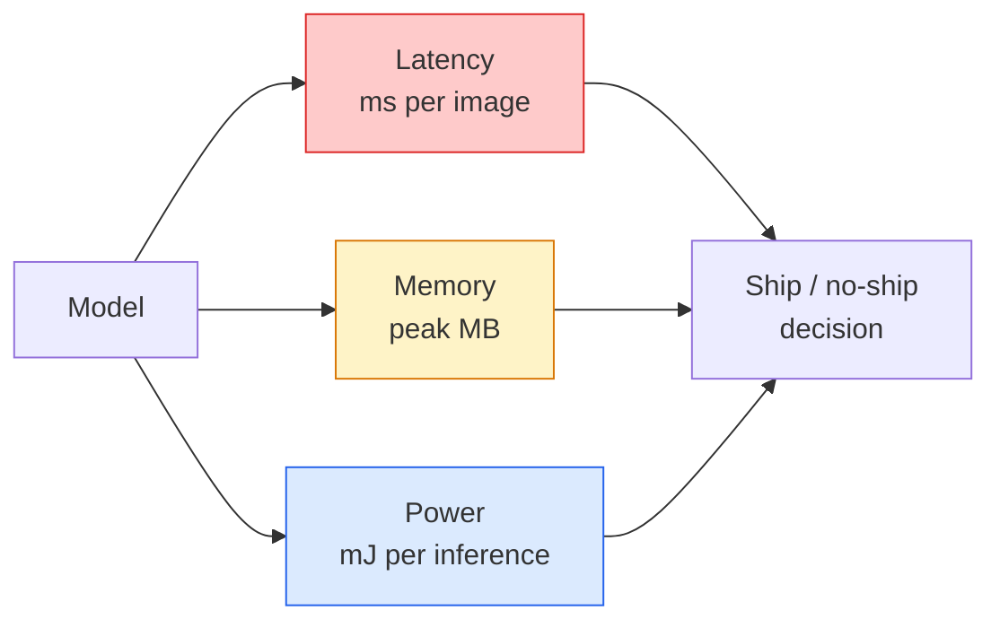

# Khán giả thời gian thực  边缘部署

> Kết luận cạnh là để cho một mô hình 90 độ chính xác trên thiết bị chỉ có 2 GB RAM chạy với 30 fps.

**Type:** Learn + Build
**Languages:** Python
**Prerequisites:** Phase 4 Lesson 04 (Image Classification), Phase 10 Lesson 11 (Quantization)
**Time:** ~75 minutes

## Học mục tiêu
- 测量任意 PyTorch model 的推理延迟、峰值内存和吞吐量,并读懂 FLOPs / params /延迟 之间的权衡
- Sử dụng PyTorch của định lượng sau khi đào tạo sẽ mô hình thị giác  định lượng thành INT8,并验证 sự mất độ chính xác < 1%
- 导出到ONNX,并使用ONNX Runtime或TensorRT 编译; nói出三种最常见的导出失败原因及其修复方式
- 解释在边缘 约束下何时选择 MobileNetV3、EfficientNet-Lite、ConvNeXt-Tiny hoặc MobileViT

## 问题
Mô hình tầm nhìn của giai đoạn đào tạo thường là một điểm nổi 巨兽──100M tham số── mỗi lần tiến qua 10 GFLOPs──2 GB VRAM── tất cả đều không thể lắp đặt vào điện thoại, bộ phận thông tin giải trí trong xe, máy ảnh công nghiệp hoặc máy bay không người lái── giao một hệ thống tầm nhìn, có nghĩa là phải lắp đặt khả năng dự đoán tương tự vào ngân sách nhỏ hơn 100 lần.

√ 大部分工作由三个旋完成:model choice(使用相同的配方的更小架构) √量化(使用INT8 替代FP32) 和推断运行时间(ONNX Runtime、TensorRT、Core ML、TFLite)  √ √ √ √ √ √ √ √ √ √ √ √ √ √ √ √ √ √ √ √ √ √ √ √ √ √ √ √ √ √ √ √ √ √ √ √ √ √ √ √ √ √ √ √ √ √ √ √ √ √ √ √ √ √ √ √ √ √ √ √ √ √ √ √ √ √ √ √ √ √ √ √ √ √ √ √ √ √ √ √ √ √ √ √ √ √ √ √ √ √ √ √ √ √ √ √ √ √ √ √ √ √ √ √ √ √ √ √ √ √ √ √ √ √ √ √ √ √ √ √ √ √ √ √ √ √ √ √ √ √ √ √ √ √ √ √ √ √ √ √ √ √ √ √ √ √ √ √ √ √ √ √ √ √ √ √ √ √ √ √ √ √ √ √ √ √ √ √ √ √ √ √ √ √ √ √ √ √ √ √ √ √ √ √ √ √ √ √ √ √ √ √ √ √ √ √ √ √ √ √ √ √ √ √ √ √ √ √ √ √ √ √ √ √ √ √ √ √ √ √ √

Bài học này bắt đầu xây dựng kỷ luật đo lường (không thể đo lường được không thể tối ưu hóa), sau đó giải thích ba vòng này. Mục tiêu không phải là học hết mỗi thời gian chạy cạnh, mà là biết có những đòn bẩy nào, và làm thế nào để xác minh mỗi đòn bẩy thực sự đã làm được những gì bạn nghĩ nó đang làm.

## 概念
### 三个预算



- **Latency**:p50、p95、p99── chỉ xem p50 平均值会掩盖对实时系统 很重要的尾部行为──
- **Peak memory**Các thiết bị đã từng thấy giá trị tối đa, chứ không phải là trung bình ổn định.
- **Power / energy**Các máy tính điện tử có thể được sử dụng trong các hệ thống điện tử.

Edge  quyết định phụ thuộc vào một张 (chương trình, độ trễ, bộ nhớ, độ chính xác) 表── mỗi đơn vị đều phải được đo trên thiết bị mục tiêu, chứ không phải trên trạm làm việc.

### Thiết kế đo lường

Mỗi lần hồ sơ cạnh đều nên tuân thủ 3 quy tắc:

1. Trong phép đo trước sử dụng 5-10 lần điền điền điền điền**Warm up**mô hình── lạnh缓存和 JIT biên soạn 会产生不代表性的首次数值──
2. Trong khối thời gian 前后用 `torch.cuda.synchronize()` **Synchronise**Nhiệm vụ làm việc của GPU. Không, bạn nhận thấy là việc phát triển hạt nhân, chứ không phải việc thực hiện hạt nhân.
3. sẽ kích thước đầu vào **Fix**Đến độ phân giải sản xuất ⋅ 224x224 độ trễ trên không phải là 512x512 độ trễ trên ⋅

### FLOPs  như là đại diện

FLOPs (FLOPs) là một loại proxy độ trễ rẻ tiền, không liên quan đến thiết bị. Nó phù hợp với so sánh kiến trúc, nhưng như một chiếc đồng hồ tường tuyệt đối sẽ tạo ra sai hướng. Một mô hình FLOPs nhiều hơn 10% trong thực tế có thể nhanh hơn 2x, bởi vì nó sử dụng các ops phù hợp hơn với phần cứng.

规则: Sử dụng FLOPs để tìm kiếm kiến trúc, sử dụng độ trễ trên thiết bị để đưa ra quyết định triển khai.

### Quantization 一段话说明

Sử dụng INT8  thay thế trọng lượng FP32 và kích hoạt. Quy mô mô: giảm 4x, băng thông bộ nhớ giảm 4x, trong các phần cứng của lõi INT8  giảm 2-4x.

类型:

- **Dynamic** 将 trọng lượng 量化为INT8, kích hoạt 以 FP 计算――简单,速度提升较小――
- **Static (post-training)** 量化 trọng lượng, và bộ hiệu chuẩn nhỏ 上校准 kích hoạt phạm vi──比 động 快得多──
- **Quantisation-aware training (QAT)** Trong quá trình đào tạo, hãy tạo mẫu học tập để phù hợp với nó.

Đối với tầm nhìn, việc định lượng tĩnh sau đào tạo sử dụng 5% công suất đạt được 95% lợi ích. Chỉ khi PTQ gây ra mất độ chính xác là không thể chấp nhận được khi sử dụng QAT.

### Trẻ và chưng cất

- **Pruning** 移除不重要重量 (nói trên quy mô) hoặc kênh (nói trên cấu trúc)    移除不重要重量 (nói trên quy mô)    移除不重要重量 (nói trên quy mô)    移除不重要重量 (nói trên quy mô)     移除不重要重量 (nói trên quy mô)     移除不重要重量 (nói trên quy mô)     移除不重要重量 (nói trên quy mô)                                                                                                                                                                                    
- **Distillation** 训练一个小学生 去模仿大老师的逻辑──通常能恢复缩小模型 后损失的大部分精度──生产边缘模型的标准做法──

### Thời gian chạy của Inference

- **PyTorch eager** 慢, không phù hợp với việc triển khai.
- **TorchScript** di sản──已被 `torch.compile`Và ONNX xuất khẩu 取代
- **ONNX Runtime** Trung lập thời gian chạy──CPU、CUDA、CoreML、TensorRT、OpenVINO đều có các nhà cung cấp ONNX── từ đây bắt đầu──
- **TensorRT** NVIDIA ở biên dịch viên.
- **Core ML** Thời gian chạy iOS/macOS của Apple.`.mlmodel`Hoặc`.mlpackage`
- **TFLite** Thời gian chạy Android/ARM của Google.`.tflite`
- **OpenVINO** Thời gian chạy CPU/VPU của Intel.`.xml`+ `.bin`

Thực tế: xuất khẩu PyTorch -> ONNX -> 为 mục tiêu 选择 runtime。ONNX là ngôn ngữ Pháp。

### Bộ chọn kiến trúc cạnh

| Budget | Model | Why |
|--------|-------|-----|
| < 3M params | MobileNetV3-Small | 到处都能编译，是很好的 baseline |
| 3-10M | EfficientNet-Lite-B0 | TFLite 上每 param 的 accuracy 最好 |
| 10-20M | ConvNeXt-Tiny | accuracy-per-param 最好，且 CPU-friendly |
| 20-30M | MobileViT-S or EfficientViT | 具备 ImageNet accuracy 的 Transformer |
| 30-80M | Swin-V2-Tiny | 如果 stack 支持 window attention |

Trừ khi có lý do rõ ràng không làm như vậy, nếu không hãy định lượng tất cả các điều này thành INT8


```figure
cnn-param-count
```

##  xây dựng nó
### 步骤 1: 正确 đo độ trễ

```python
import time
import torch

def measure_latency(model, input_shape, device="cpu", warmup=10, iters=50):
    model = model.to(device).eval()
    x = torch.randn(input_shape, device=device)
    with torch.no_grad():
        for _ in range(warmup):
            model(x)
        if device == "cuda":
            torch.cuda.synchronize()
        times = []
        for _ in range(iters):
            if device == "cuda":
                torch.cuda.synchronize()
            t0 = time.perf_counter()
            model(x)
            if device == "cuda":
                torch.cuda.synchronize()
            times.append((time.perf_counter() - t0) * 1000)
    times.sort()
    return {
        "p50_ms": times[len(times) // 2],
        "p95_ms": times[int(len(times) * 0.95)],
        "p99_ms": times[int(len(times) * 0.99)],
        "mean_ms": sum(times) / len(times),
    }
```

Sưởi ấm, đồng bộ hóa, sử dụng `time.perf_counter()` báo cáo phần trăm, không chỉ có nghĩa 

### 步骤 2: Parameter và FLOP đếm

```python
def parameter_count(model):
    return sum(p.numel() for p in model.parameters())

def flops_estimate(model, input_shape):
    """
    Rough FLOP count for a conv/linear-only model. For production use `fvcore` or `ptflops`.
    """
    total = 0
    def conv_hook(m, inp, out):
        nonlocal total
        c_out, c_in, kh, kw = m.weight.shape
        h, w = out.shape[-2:]
        total += 2 * c_in * c_out * kh * kw * h * w
    def linear_hook(m, inp, out):
        nonlocal total
        total += 2 * m.in_features * m.out_features
    hooks = []
    for m in model.modules():
        if isinstance(m, torch.nn.Conv2d):
            hooks.append(m.register_forward_hook(conv_hook))
        elif isinstance(m, torch.nn.Linear):
            hooks.append(m.register_forward_hook(linear_hook))
    model.eval()
    with torch.no_grad():
        model(torch.randn(input_shape))
    for h in hooks:
        h.remove()
    return total
```

Thực tế trong dự án `fvcore.nn.FlopCountAnalysis`Hoặc`ptflops`; chúng có thể xử lý đúng mỗi loại mô-đun.

### 步骤 3: Quantization tĩnh sau khi đào tạo

```python
def quantise_ptq(model, calibration_loader, backend="x86"):
    import torch.ao.quantization as tq
    model = model.eval().cpu()
    model.qconfig = tq.get_default_qconfig(backend)
    tq.prepare(model, inplace=True)
    with torch.no_grad():
        for x, _ in calibration_loader:
            model(x)
    tq.convert(model, inplace=True)
    return model
```

三个步骤:configure、prepare(插入观察员)、用真实数据校准、转换(fuse + quantize)。`Conv -> BN -> ReLU`-> `ConvBnReLU`), có thể`torch.ao.quantization.fuse_modules`处理──

### 步骤 4: 导出到ONNX

```python
def export_onnx(model, sample_input, path="model.onnx"):
    model = model.eval()
    torch.onnx.export(
        model,
        sample_input,
        path,
        input_names=["input"],
        output_names=["output"],
        dynamic_axes={"input": {0: "batch"}, "output": {0: "batch"}},
        opset_version=17,
    )
    return path
```

`opset_version=17`Đó là giá trị an ninh năm 2026:`dynamic_axes`Hãy sử dụng bất kỳ kích thước lô nào để vận hành mô hình ONNX.

### Bước 5: Định nghĩa và so sánh các chế độ khác nhau

```python
import torch.nn as nn
from torchvision.models import mobilenet_v3_small

def compare_regimes():
    model = mobilenet_v3_small(weights=None, num_classes=10)
    params = parameter_count(model)
    flops = flops_estimate(model, (1, 3, 224, 224))
    lat_fp32 = measure_latency(model, (1, 3, 224, 224), device="cpu")
    print(f"FP32 MobileNetV3-Small: {params:,} params  {flops/1e9:.2f} GFLOPs  "
          f"p50={lat_fp32['p50_ms']:.2f}ms  p95={lat_fp32['p95_ms']:.2f}ms")
```

Đối với`resnet50``efficientnet_v2_s`和 `convnext_tiny`运行 cùng một hàm, bạn就能得到部署决策所需的比较表──

## Sử dụng nó
Các đống sản xuất thường收到三条路径之一:

- **Web / serverless**:PyTorch -> ONNX -> ONNX Runtime(CPU hoặc CUDA nhà cung cấp) ⋅最简单, đối với hầu hết các场景足够好──
- **NVIDIA edge (Jetson, GPU server)**:PyTorch -> ONNX -> TensorRT──trễ nhất, nỗ lực kỹ thuật tối đa──
- **Mobile**:PyTorch -> ONNX -> Core ML (iOS) hoặc TFLite (Android)

测量方面,`torch-tb-profiler``nvprof`- `nsys`, cũng như các công cụ trên macOS có thể cung cấp phân tích lớp theo lớp.`benchmark_app`(OpenVINO) 和 `trtexec`(TensorRT) có thể cung cấp CLI độc lập số chữ.

## 交付 nó
本课会产出:

- `outputs/prompt-edge-deployment-planner.md` Một lời nhắc, sẽ dựa trên thiết bị mục tiêu và độ trễ SLA  chọn backbone、 định lượng chiến lược 和 runtime。
- `outputs/skill-latency-profiler.md`Một kỹ năng, được sử dụng để viết toàn bộ kịch bản đánh giá độ trễ, bao gồm warmup, đồng bộ hóa, phần trăm và theo dõi bộ nhớ.

## 练习
1. **(Easy)**Trong CPU trên với 224x224  đo `resnet18``mobilenet_v3_small``efficientnet_v2_s`和 `convnext_tiny`Ưu điểm của p50 độ trễ.
2. **(Medium)**Đối với`mobilenet_v3_small`应用后训练静数量化――报告 CIFAR-10 或类似数据集 held-out subset 上的 FP32 vs INT8 độ trễ và mất độ chính xác――
3. **(Hard)**sẽ`convnext_tiny`导出到 ONNX,用 `CPUExecutionProvider` Thông qua `onnxruntime`运行,并将延迟与 PyTorch eager baseline 比较.

## 关键术语
| Term | What people say | What it actually means |
|------|----------------|----------------------|
| Latency | “有多快” | 从 input 到 output 的时间；看 p50/p95/p99 percentiles，而不是 mean |
| FLOPs | “Model size” | 每次 forward pass 的 floating-point ops；compute cost 的粗略 proxy |
| INT8 quantisation | “8-bit” | 用 8-bit integers 替代 FP32 weights/activations；体积约小 4x，速度快 2-4x |
| PTQ | “Post-training quantisation” | 在不 retraining 的情况下量化 trained model；简单，通常足够 |
| QAT | “Quantisation-aware training” | 训练期间模拟 quantisation；accuracy 最好，需要 labelled data |
| ONNX | “中立格式” | 每个主流 inference runtime 都支持的 model exchange format |
| TensorRT | “NVIDIA compiler” | 将 ONNX 编译为面向 NVIDIA GPUs 的 optimised engine |
| Distillation | “Teacher -> student” | 训练 small model 去模仿 big model 的 logits；恢复大部分损失的 accuracy |

## 延伸阅读
- [EfficientNet (Tan & Le, 2019)](https://arxiv.org/abs/1905.11946) Scaling hợp chất của cấu trúc cao hiệu quả
- [MobileNetV3 (Howard et al., 2019)](https://arxiv.org/abs/1905.02244) kiến trúc di động đầu tiên, bao gồm h-swish và squeeze-excite
- [A Practical Guide to TensorRT Optimization (NVIDIA)](https://developer.nvidia.com/blog/accelerating-model-inference-with-tensorrt-tips-and-best-practices-for-pytorch-users/) 如何真正获得论文中的吞吐量数
- [ONNX Runtime docs](https://onnxruntime.ai/docs/) định lượng, tối ưu hóa biểu đồ, lựa chọn nhà cung cấp
