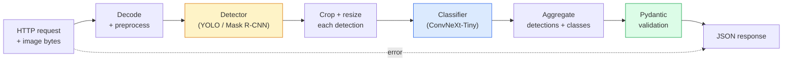

# 构建完整 Vision Pipeline  Capstone

> Hệ thống tầm nhìn cấp sản xuất là một chuỗi gồm các mô hình và quy tắc, và thông qua hợp đồng dữ liệu 串联起来.

**Type:** Build
**Languages:** Python
**Prerequisites:** Phase 4 Lessons 01-15
**Time:** ~120 minutes

## Học mục tiêu
- Thiết kế một ống dẫn tầm nhìn cấp sản xuất, được sử dụng để kiểm tra đối tượng, phân loại, và xuất ra cấu trúc JSON, đồng thời xử lý tất cả các đường thất bại
- sẽ phát hiện máy tính r-CNN hoặc YOLO) ✓ phân loại máy tính convNeXt-Tiny) và hợp đồng dữ liệu
- Đối với đường ống kết thúc  thực hiện đánh giá chuẩn,并识别 đầu tiên nút thắt chai(thường trước tiên là xử lý trước, sau đó là máy dò)
- 发布 một dịch vụ FastAPI tối thiểu, chấp nhận tải lên hình ảnh, vận hành đường ống dẫn,并 quay lại với phân loại  kết quả

## 问题
单个视觉模型 很有用;视觉产品是由它们组成的链条──零售货架审计是检测器 加产品分类器 再加价格-OCR管道──自动驾驶是 2D检测器 加 3D检测器 加段加跟踪器 加规划器──医疗预查是分类器 加地区分类器 加临床医生 UI──

Để kết nối các liên kết này, chính là phân biệt giữa nguyên mẫu ML và phần quan trọng của sản phẩm. Mỗi giao diện giữa các mô hình đều là nguồn lỗi mới. Mỗi lần chuyển đổi phối hợp, mỗi lần bình thường hóa, mỗi lần kích thước mặt nạ, tất cả có thể trở thành điểm thất bại tĩnh lặng.

Đây là một nền tảng xây dựng đường ống tối thiểu có thể sử dụng: phát hiện + phân loại + sản xuất có cấu trúc + lớp phục vụ.

## 概念
### Đường ống



七个阶段──两个模型阶段 开销很大;另五个阶段则是bug 最常出现的地方──

### 使用 Pydantic 定义 Hợp đồng dữ liệu

Mỗi giới hạn mô hình đều trở thành một đối tượng được phân loại.

```
Detection(
    box: tuple[float, float, float, float],   # (x1, y1, x2, y2), absolute pixels
    score: float,                              # [0, 1]
    class_id: int,                             # from detector's label map
    mask: Optional[list[list[int]]],           # RLE-encoded if present
)

PipelineResult(
    image_id: str,
    detections: list[Detection],
    classifications: list[Classification],
    inference_ms: float,
)
```

Khi máy dò quay lại là`(cx, cy, w, h)`Không phải`(x1, y1, x2, y2)`Khi, việc xác nhận của Pydantic sẽ thất bại ở biên giới, bạn sẽ ngay lập tức phát hiện ra vấn đề, thay vì đi điều tra một cây trồng xuống, nó chỉ là một sự tĩnh lặng quay lại vùng trống.

### 延迟花在哪里

Hầu như mọi đường ống nhìn đều đáp ứng 3 thực tế:

1. **Preprocessing 通常是最大的单个模块。**解码 JPEG, chuyển đổi màu không gian, kích thước, tất cả đều bị ràng buộc bởi CPU, và dễ bị bỏ qua.
2. **Detector 主导 GPU 时间。**70-90% GPU  thời gian dành trong phát hiện vượt qua phía trước trên.
3. **Postprocessing（NMS、RLE encode/decode）在 GPU 上便宜，在 CPU 上昂贵。**Một định phải sử dụng thực tế mục tiêu môi trường để làm hồ sơ.

Nghĩ phân tán, để biến tối ưu hóa thành một thứ tự ưu tiên.

### Các chế độ thất bại

- **Empty detections** 返回空列表, đừng sụp đổ.
- **Out-of-bounds boxes** cắt trước clamp đến kích thước hình ảnh.
- **Tiny crops** đối với loại hình nhỏ nhất 跳过分类.
- **Corrupt upload** 返回带有具体错误代码 的 400 phản hồi, chứ không phải 500。
- **Model load failure** Trong khởi động dịch vụ 失败, thay vì trong yêu cầu đầu tiên 时失败。

Lầu ống sản xuất sẽ xử lý từng tình huống, thay vì viết một phổ biến.`try/except`Để thất bại ẩn lên. Mỗi thất bại đều có mã và câu trả lời.

### Nhóm

Dịch vụ cấp sinh sản 会服务多个客户──跨请求 对检测和分类 进行批量可成倍提升吞吐量──代价是: chờ批量 填满会带来额外延迟──典型设置:最多收集 20ms 请求,合并成批量,处理,再发送响应──`torchserve`和 `triton`Động cơ này được hỗ trợ bởi các dịch vụ nhỏ có thể dự đoán tải thường tự thực hiện micro-batcher.


```figure
v4-vision-pipeline
```

##  xây dựng nó
### 步骤 1: Hợp đồng dữ liệu

```python
from pydantic import BaseModel, Field
from typing import List, Optional, Tuple

class Detection(BaseModel):
    box: Tuple[float, float, float, float]
    score: float = Field(ge=0, le=1)
    class_id: int = Field(ge=0)
    mask_rle: Optional[str] = None


class Classification(BaseModel):
    detection_index: int
    class_id: int
    class_name: str
    score: float = Field(ge=0, le=1)


class PipelineResult(BaseModel):
    image_id: str
    detections: List[Detection]
    classifications: List[Classification]
    inference_ms: float
```

Cód của 5 giây, có thể dùng cho bất kỳ đường ống nào nghiêm ngặt 省一小时调试时间.

### 步骤 2: Một loại đường ống nhỏ nhất

```python
import time
import numpy as np
import torch
from PIL import Image

class VisionPipeline:
    def __init__(self, detector, classifier, class_names,
                 device="cpu", min_crop=32):
        self.detector = detector.to(device).eval()
        self.classifier = classifier.to(device).eval()
        self.class_names = class_names
        self.device = device
        self.min_crop = min_crop

    def preprocess(self, image):
        """
        image: PIL.Image or np.ndarray (H, W, 3) uint8
        returns: CHW float tensor on device
        """
        if isinstance(image, Image.Image):
            image = np.asarray(image.convert("RGB"))
        tensor = torch.from_numpy(image).permute(2, 0, 1).float() / 255.0
        return tensor.to(self.device)

    @torch.no_grad()
    def detect(self, image_tensor):
        return self.detector([image_tensor])[0]

    @torch.no_grad()
    def classify(self, crops):
        if len(crops) == 0:
            return []
        batch = torch.stack(crops).to(self.device)
        logits = self.classifier(batch)
        probs = logits.softmax(-1)
        scores, cls = probs.max(-1)
        return list(zip(cls.tolist(), scores.tolist()))

    def run(self, image, image_id="anonymous"):
        t0 = time.perf_counter()
        tensor = self.preprocess(image)
        det = self.detect(tensor)

        crops = []
        detections = []
        valid_indices = []
        for i, (box, score, cls) in enumerate(zip(det["boxes"], det["scores"], det["labels"])):
            x1, y1, x2, y2 = [max(0, int(b)) for b in box.tolist()]
            x2 = min(x2, tensor.shape[-1])
            y2 = min(y2, tensor.shape[-2])
            detections.append(Detection(
                box=(x1, y1, x2, y2),
                score=float(score),
                class_id=int(cls),
            ))
            if (x2 - x1) < self.min_crop or (y2 - y1) < self.min_crop:
                continue
            crop = tensor[:, y1:y2, x1:x2]
            crop = torch.nn.functional.interpolate(
                crop.unsqueeze(0),
                size=(224, 224),
                mode="bilinear",
                align_corners=False,
            )[0]
            crops.append(crop)
            valid_indices.append(i)

        class_preds = self.classify(crops)

        classifications = []
        for valid_idx, (cls_id, cls_score) in zip(valid_indices, class_preds):
            classifications.append(Classification(
                detection_index=valid_idx,
                class_id=int(cls_id),
                class_name=self.class_names[cls_id],
                score=float(cls_score),
            ))

        return PipelineResult(
            image_id=image_id,
            detections=detections,
            classifications=classifications,
            inference_ms=(time.perf_counter() - t0) * 1000,
        )
```

Mỗi giao diện đều được phân loại. Mỗi đường thất bại đều có một quyết định xử lý rõ ràng.

### 步骤 3: kết nối một bộ phát hiện và một bộ phân loại

```python
from torchvision.models.detection import maskrcnn_resnet50_fpn_v2
from torchvision.models import convnext_tiny

# Use ImageNet-pretrained weights for a realistic pipeline without training
detector = maskrcnn_resnet50_fpn_v2(weights="DEFAULT")
classifier = convnext_tiny(weights="DEFAULT")
class_names = [f"imagenet_class_{i}" for i in range(1000)]

pipe = VisionPipeline(detector, classifier, class_names)

# Smoke test with a synthetic image
test_image = (np.random.rand(400, 600, 3) * 255).astype(np.uint8)
result = pipe.run(test_image, image_id="demo")
print(result.model_dump_json(indent=2)[:500])
```

### 步骤 4: Dịch vụ FastAPI

```python
from fastapi import FastAPI, UploadFile, HTTPException
from io import BytesIO

app = FastAPI()
pipe = None  # initialised on startup

@app.on_event("startup")
def load():
    global pipe
    detector = maskrcnn_resnet50_fpn_v2(weights="DEFAULT").eval()
    classifier = convnext_tiny(weights="DEFAULT").eval()
    pipe = VisionPipeline(detector, classifier, class_names=[f"c{i}" for i in range(1000)])

@app.post("/detect")
async def detect_endpoint(file: UploadFile):
    if file.content_type not in {"image/jpeg", "image/png", "image/webp"}:
        raise HTTPException(status_code=400, detail="unsupported image type")
    data = await file.read()
    try:
        img = Image.open(BytesIO(data)).convert("RGB")
    except Exception:
        raise HTTPException(status_code=400, detail="cannot decode image")
    result = pipe.run(img, image_id=file.filename or "upload")
    return result.model_dump()
```

Sử dụng `uvicorn main:app --host 0.0.0.0 --port 8000`运行。使用 `curl -F 'file=@dog.jpg' http://localhost:8000/detect`测试──

### 步骤 5: Điểm chuẩn của đường ống này

```python
import time

def benchmark(pipe, num_runs=20, image_size=(400, 600)):
    img = (np.random.rand(*image_size, 3) * 255).astype(np.uint8)
    pipe.run(img)  # warm up

    stages = {"preprocess": [], "detect": [], "classify": [], "total": []}
    for _ in range(num_runs):
        t0 = time.perf_counter()
        tensor = pipe.preprocess(img)
        t1 = time.perf_counter()
        det = pipe.detect(tensor)
        t2 = time.perf_counter()
        crops = []
        for box in det["boxes"]:
            x1, y1, x2, y2 = [max(0, int(b)) for b in box.tolist()]
            x2 = min(x2, tensor.shape[-1])
            y2 = min(y2, tensor.shape[-2])
            if (x2 - x1) >= pipe.min_crop and (y2 - y1) >= pipe.min_crop:
                crop = tensor[:, y1:y2, x1:x2]
                crop = torch.nn.functional.interpolate(
                    crop.unsqueeze(0), size=(224, 224), mode="bilinear", align_corners=False
                )[0]
                crops.append(crop)
        pipe.classify(crops)
        t3 = time.perf_counter()
        stages["preprocess"].append((t1 - t0) * 1000)
        stages["detect"].append((t2 - t1) * 1000)
        stages["classify"].append((t3 - t2) * 1000)
        stages["total"].append((t3 - t0) * 1000)

    for stage, times in stages.items():
        times.sort()
        print(f"{stage:12s}  p50={times[len(times)//2]:7.1f} ms  p95={times[int(len(times)*0.95)]:7.1f} ms")
```

CPU trên tiêu chuẩn đầu ra: quá trình trước ~ 3 ms, phát hiện 300-500 ms, phân loại 20-40 ms, tổng 350-550 ms. Trên GPU, phát hiện là 20-40 ms.

## Sử dụng nó
生产模板最终会收收到相同结构,外加:

- **Model versioning** 始终在回应 中记录模型名 和权重 hash。
- **Per-request trace IDs**  ghi lại từng yêu cầu của từng giai đoạn thời gian, để có thể đưa phản ứng chậm và giai đoạn 关联起来.
- **Fallback path** Nếu thời gian phân loại, trả về không mang theo việc phát hiện phân loại, thay vì để toàn bộ yêu cầu 失败。
- **Safety filters** NSFW / PII filter 在分类后 之后、响应 离开服务 之前运行。
- **Batch endpoint** Một `/detect_batch`, chấp nhận URL hình ảnh 列表 được sử dụng để xử lý hàng loạt。

对于生产服务,`torchserve``Triton Inference Server`和 `BentoML`开箱即可处理批发, phiên bản, métrics và kiểm tra sức khỏe.`FastAPI`适合原型 和小规模产品──

## 交付 nó
本课会产出:

- `outputs/prompt-vision-service-shape-reviewer.md` Một lời nhắc, được sử dụng để kiểm tra dịch vụ thị giác 代码中的 hợp đồng/ phản ứng hình dạng 违规,并指出第一个破裂 bug──
- `outputs/skill-pipeline-budget-planner.md` Một kỹ năng, cho được mục tiêu chậm trễ và thông qua, chia thời gian ngân sách cho mỗi giai đoạn đường ống, và đánh dấu giai đoạn nào sẽ vượt quá ngân sách trước tiên.

## 练习
1. **(Easy)**Trong tập dữ liệu mở tùy ý 10 张 hình ảnh trên đường ống dẫn.
2. **(Medium)** Đưa `Detection`Thêm trường đầu ra mặt nạ,并将其编码为 RLE──验证 ngay cả khi hình ảnh 10 đối tượng, JSON cũng giữ ở 1MB 以下──
3. **(Hard)**Trong trình phân loại trước thêm một micro-batcher: thu thập nhiều nhất 10 ms của sản phẩm, sử dụng một cuộc gọi GPU để phân loại tất cả chúng, sau đó theo yêu cầu trả lại kết quả.

## 关键术语
| Term | What people say | What it actually means |
|------|----------------|----------------------|
| Pipeline | “系统” | 由 preprocessing、inference 和 postprocessing step 组成的有序链条，每一对 step 之间都有类型化 interface |
| Data contract | “schema” | 每个 stage 的 input 和 output 都必须符合的 Pydantic / dataclass 定义；在边界处捕获 integration bug |
| Preprocessing | “model 之前” | 解码、颜色转换、resizing、normalising；通常是最大的 CPU 时间消耗点 |
| Postprocessing | “model 之后” | NMS、mask resize、threshold、RLE encode；在 GPU 上便宜，在 CPU 上昂贵 |
| Microbatcher | “先收集再 forward” | 在固定窗口内等待多个 request，然后运行一次 batched forward pass 的 aggregator |
| Trace ID | “Request id” | 每个 request 的标识符，会在每个 stage 记录，因此 slow request 可以端到端追踪 |
| Failure code | “命名错误” | 每类 failure 都有具体 error code，而不是泛化的 500；支持 client retry logic |
| Health check | “Readiness probe” | 一个低成本 endpoint，用于报告 service 是否可以响应；loadbalancer 依赖它 |

## 延伸阅读
- [Full Stack Deep Learning — Deploying Models](https://fullstackdeeplearning.com/course/2022/lecture-5-deployment/) Kỷ lục cổ điển về việc triển khai ML cấp sinh sản
- [BentoML docs](https://docs.bentoml.com)  hỗ trợ phân phối, phiên bản và métrics của khung phục vụ
- [torchserve docs](https://pytorch.org/serve/) PyTorch 官方 thư viện phục vụ
- [NVIDIA Triton Inference Server](https://developer.nvidia.com/triton-inference-server) 支持批发和多型的高吞吐量服务
