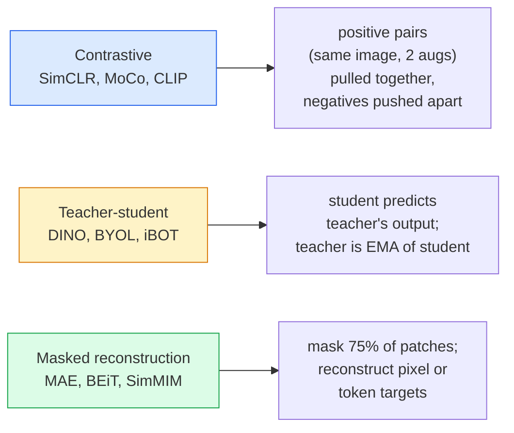

# Tầm nhìn tự giám sát  SimCLR, DINO, MAE

> Labels are overseen vision ── tự giám sát trước khi tập luyện 移除它们: từ 100M 张无标记图像中学习视觉特征,再在 10k 张有标记图像上细调──

**类型：**Học tập + xây dựng
**语言：**Python
**先修要求：**Giai đoạn 4 Bài học 04(Tân loại hình ảnh),Giai đoạn 4 Bài học 14(ViT)
**时间：**约75分钟

## Học mục tiêu

- 理三大 tự giám sát gia đình  tương phản SimCLR)  giáo viên- học sinh DINO)  tái tạo mặt nạ MAE)  并说明每种在优化什么
- Từ zero để đạt được sự mất mát của InfoNCE,并 giải thích tại sao kích thước lô là 512 có thể đi, và lô là 32 sẽ thất bại
- 解释 tại sao tỷ lệ che giấu 75% của MAE không được thiết lập tùy ý, cũng như nó và 15% trong văn bản BERT có gì khác nhau
- Sử dụng DINOv2 hoặc MAE ImageNet checkpoints  thực hiện thăm dò tuyến tính và lấy lại bằng shot không

## 问题

ImageNet được giám sát có 1,3 triệu张 có hình ảnh được đánh dấu, theo ước tính chi phí đánh dấu là 10 triệu đô la. Các bộ dữ liệu y tế và công nghiệp nhỏ hơn, chi phí đánh dấu cũng cao hơn. Mỗi tầm nhìn, nhóm sẽ hỏi: chúng ta có thể trước tiên tập trung vào dữ liệu không đánh dấu giá rẻ trên YouTube 、 truy cập web 、 quay phim webcam web, quét vệ tinh  Sau đó, quy mô nhỏ có đánh dấu tập hợp để chỉnh sửa?

Học tự giám sát là câu trả lời. Một trong các phương pháp tự giám sát hiện đại được đào tạo tại LAION hoặc JFT, sau đó có thể đạt được hoặc vượt qua tỷ lệ xác định của ImageNet được giám sát. Nó cũng giống như việc đào tạo trước khi được giám sát.

概念上的转变是:pretext task  模型被训练完成的任务  不必是下游任务──关键在于它是否迫使模型学习有用特征──预测灰度尺度图像的颜色、旋转图像并让模型分类旋转角度、面具补丁并重建它们 这些方法都奏效过──能够规模化的三种方法是对比学习、老师-学生蒸和掩饰重建──

## 概念

### 3 gia đình



### Học học tương phản (SimCLR)

取一张图像,应用两次随机增强,得到两次见解――将二者送入同一个编码加投影头――最小化一个损失,含义是

```
Loss for positive pair (z_i, z_j) among 2N views per batch:

   L_ij = -log( exp(sim(z_i, z_j) / tau) / sum_k in batch \ {i} exp(sim(z_i, z_k) / tau) )

sim = cosine similarity
tau = temperature (0.1 standard)
```

Đây là sự mất mát của InfoNCE. Nó đòi hỏi mỗi tích cực có nhiều tiêu cực, vì vậy kích thước lô rất quan trọng. SimCLR cần 512-8192.

### Giáo viên- học sinh ((DINO)

Hai cấu trúc giống nhau: học sinh và giáo viên. Giáo viên là học sinh. Đường trung bình chuyển động thoáng tính của trọng lượng của học sinh.

```
loss = CE( student_output(view_1),  teacher_output(view_2) )
     + CE( student_output(view_2),  teacher_output(view_1) )

teacher_weights = m * teacher_weights + (1 - m) * student_weights   (m ≈ 0.996)
```

Tại sao nó không sụp đổ 成预测一个常量:teacher's输遇被集中了(减去每个维度的平均值)并磨削了(除以较小温度) ・中心化 防止某个维度占主导;磨削了 防止输出崩 为均──

DINO là nền tảng của quy mô DINOv2,DINOv2 trong 142M 张 hình ảnh được sắp xếp trên đào tạo.

### Tái tạo mặt nạ (MAE)

Mask một ViT 输入中75% của các bản vá. Chỉ sẽ thấy 25% 送入编码. Một decoder nhỏ 接收编码.

```
Encoder:  visible 25% of patches -> features
Decoder:  features + mask tokens at masked positions -> reconstructed pixels
Loss:     MSE between reconstructed and original pixels on masked patches only
```

让 MAE 有效的关键设计选择:

- **75% mask ratio** 很高──迫使编码 学习语义特征; tái tạo 25% 会接近微不足道(相邻像素的相关性太强, đến nỗi CNN 都能轻松完成)。
- **Asymmetric encoder/decoder**                                                                                                                                                                                                                                                              
- **Pixel-space reconstruction target** Nhóm mục tiêu được đánh giá là đơn giản hơn, và hiệu quả tốt hơn trong ViT 上.

Sau khi tập luyện, bỏ đi bộ giải mã.

### Tại sao là 75% chứ không phải 15%?

BERT mask 15% của token──MAE mask 75%── khác biệt là mật độ thông tin──

- Ngôn ngữ tự nhiên Mỗi token của rất cao 预测 15% của token  vẫn rất khó khăn, vì mỗi vị trí che giấu có rất nhiều hoàn thành hợp lý
- Các bản vá hình ảnh của  rất thấp  Một vùng lân cận không bị che đậy thường có thể quyết định chính xác các pixel của bản vá che đậy.

75%  đủ cao, làm cho không gian đơn giản không thể giải quyết nhiệm vụ; trình mã hóa phải hiển thị nội dung hình ảnh.

### Đánh giá bằng thăm dò tuyến tính

tự giám sát trước khi đào tạo  sau đó, tiêu chuẩn đánh giá là **linear probe**:结 mã hóa, dựa trên các nhãn ImageNet 训练一个单层线性分类器――报告 top-1 chính xác――

- SimCLR ResNet-50: khoảng 71%(2020)
- DINO ViT-S/16: khoảng 77%(2021)
- MAE ViT-L/16: khoảng 76%(2022)
- DINOv2 ViT-g/14: khoảng 86%(2023)

Hình tra tuyến tính là một phép đo tinh khiết về chất lượng của các đặc điểm; điều chỉnh tinh tế thường tăng 2-5 điểm, nhưng cũng sẽ liên quan đến tác động của đào tạo lại đầu.


```figure
data-augmentation
```

##  xây dựng nó

### 步骤 1:Dây ống tăng cường hai quan điểm

```python
import torch
import torchvision.transforms as T

two_view_train = lambda: T.Compose([
    T.RandomResizedCrop(96, scale=(0.2, 1.0)),
    T.RandomHorizontalFlip(),
    T.ColorJitter(0.4, 0.4, 0.4, 0.1),
    T.RandomGrayscale(p=0.2),
    T.ToTensor(),
])


class TwoViewDataset(torch.utils.data.Dataset):
    def __init__(self, base):
        self.base = base
        self.aug = two_view_train()

    def __len__(self):
        return len(self.base)

    def __getitem__(self, i):
        img, _ = self.base[i]
        v1 = self.aug(img)
        v2 = self.aug(img)
        return v1, v2
```

Mỗi người__getitem__Trở lại hai hình ảnh tăng cường của cùng một hình ảnh; không cần nhãn.

### 步骤 2:Khung mất thông tin

```python
import torch.nn.functional as F

def info_nce(z1, z2, tau=0.1):
    """
    z1, z2: (N, D) L2-normalised embeddings of paired views
    """
    N, D = z1.shape
    z = torch.cat([z1, z2], dim=0)  # (2N, D)
    sim = z @ z.T / tau              # (2N, 2N)

    mask = torch.eye(2 * N, dtype=torch.bool, device=z.device)
    sim = sim.masked_fill(mask, float("-inf"))

    targets = torch.cat([torch.arange(N, 2 * N), torch.arange(0, N)]).to(z.device)
    return F.cross_entropy(sim, targets)
```

调用前先对  thực hiện L2 bình thường hóa.`tau=0.1`Đó là giá trị mặc định của SimCLR; giá trị thấp hơn sẽ làm cho mất mát hơn, và cần nhiều tiêu cực hơn.

### 步骤 3: Kiểm tra sức khỏe InfoNCE

```python
z1 = F.normalize(torch.randn(16, 32), dim=-1)
z2 = z1.clone()
loss_same = info_nce(z1, z2, tau=0.1).item()
z2_random = F.normalize(torch.randn(16, 32), dim=-1)
loss_random = info_nce(z1, z2_random, tau=0.1).item()
print(f"InfoNCE with identical pairs:  {loss_same:.3f}")
print(f"InfoNCE with random pairs:     {loss_random:.3f}")
```

相同对应应应得到较低损失(大批 和低温度下接近 0) ・・・随机对应应应得到 log(2N-1) = ~log(31) = ~3.4, đối với 16 cặp lô。

### 步骤 4:Mặt mặt nạ theo kiểu MAE

```python
def random_mask_indices(num_patches, mask_ratio=0.75, seed=0):
    g = torch.Generator().manual_seed(seed)
    n_keep = int(num_patches * (1 - mask_ratio))
    perm = torch.randperm(num_patches, generator=g)
    visible = perm[:n_keep]
    masked = perm[n_keep:]
    return visible.sort().values, masked.sort().values


num_patches = 196
visible, masked = random_mask_indices(num_patches, mask_ratio=0.75)
print(f"visible: {len(visible)} / {num_patches}")
print(f"masked:  {len(masked)} / {num_patches}")
```

简单、快速,并且对于给定种子是决定性的的──真实 MAE 实现将对其进行批量,并保留每个样品的面具──

## Sử dụng nó

DINOv2 là tiêu chuẩn sản xuất năm 2026:

```python
import torch
from transformers import AutoImageProcessor, AutoModel

processor = AutoImageProcessor.from_pretrained("facebook/dinov2-base")
model = AutoModel.from_pretrained("facebook/dinov2-base")
model.eval()

# Per-image embeddings for zero-shot retrieval
with torch.no_grad():
    inputs = processor(images=[pil_image], return_tensors="pt")
    outputs = model(**inputs)
    embedding = outputs.last_hidden_state[:, 0]  # CLS token
```

所得 768-dim Embedding là mô hình hiện đại lấy lại, tương ứng dày đặc và ống dẫn chuyển đổi bắn không.

Đối với hình ảnh văn bản Embeddings,SigLIP hoặc OpenCLIP là đối phó với các giải pháp; đối với các mô hình MAE tinh chỉnh,`timm`repo đã cung cấp tất cả các điểm kiểm soát MAE

## 交付 nó

本课会产出:

- `outputs/prompt-ssl-pretraining-picker.md` Một lời nhắc, tùy thuộc vào kích thước bộ dữ liệu 、 tính toán và nhiệm vụ dòng chảy  chọn SimCLR / MAE / DINOv2。
- `outputs/skill-linear-probe-runner.md` Một kỹ năng, cho bất kỳ mã hóa đóng băng + nhãn bộ dữ liệu 编写 đánh giá thăm dò tuyến tính。

## 练习

1. **（Easy）**验证: đối với các bản cài đặt tốt, giảm nhiệt độ sẽ làm cho InfoNCE mất xuống; đối với các bản cài đặt bất cứ lúc nào, giảm nhiệt độ sẽ làm cho mất lên.`tau in [0.05, 0.1, 0.2, 0.5]`Vùng với mất mát của hình ảnh.
2. **（Medium）**实现一个DINO kiểu trung tâm bơm. 展示如果没有中心,学生会在几个时代内崩为常量向量.
3. **（Hard）**Sử dụng Bài học 10 Trung tâm của TinyUNet 作为脊柱,在CIFAR-100上训练 MAE──报告 10、50 和 200 epochs 时的线性探测精度──展示在同一个1000图片子集上,MAE-pretrained线性探测 优于从头监督线性探测──

## 关键术语

| Term | 人们的说法 | 实际含义 |
|------|----------------|----------------------|
| Self-supervised | “Label-free” | 一种 pretext task，用于从无标注数据中产生有用 representations |
| Pretext task | “假任务” | SSL 期间使用的 objective（reconstruct patches、match views）；pretraining 后会被丢弃 |
| Linear probe | “Frozen encoder + linear head” | 标准 SSL 评估：只在 frozen features 之上训练一个 linear classifier |
| InfoNCE | “Contrastive loss” | 对 cosine similarities 做 softmax；positive pair 是目标类别，所有其他项都是 negatives |
| EMA teacher | “Moving-average teacher” | 权重是 student 的 exponential moving average 的 teacher；BYOL、MoCo、DINO 使用它 |
| Mask ratio | “隐藏的 patches 百分比” | MAE 期间被 mask 的 patches 比例；vision 为 75%，text 为 15% |
| Representation collapse | “Constant output” | SSL 失败模式：encoder 对所有输入输出一个常量 Vector；通过 centring、sharpening 或 negatives 防止 |
| DINOv2 | “生产级 SSL backbone” | Meta 2023 年的 self-supervised ViT；2026 年最强的通用 image features |

## 延伸阅读

- [SimCLR (Chen et al., 2020)](https://arxiv.org/abs/2002.05709) học hỏi tương phản 参考
- [DINO (Caron et al., 2021)](https://arxiv.org/abs/2104.14294) 带 động lực, tập trung, sắc nét của giáo viên-nhà học
- [MAE (He et al., 2022)](https://arxiv.org/abs/2111.06377) 面向 ViT của mã hóa tự động che giấu dự kiến đào tạo
- [DINOv2 (Oquab et al., 2023)](https://arxiv.org/abs/2304.07193) Tự giám sát ViT  mở rộng đến các đặc điểm cấp sản xuất
