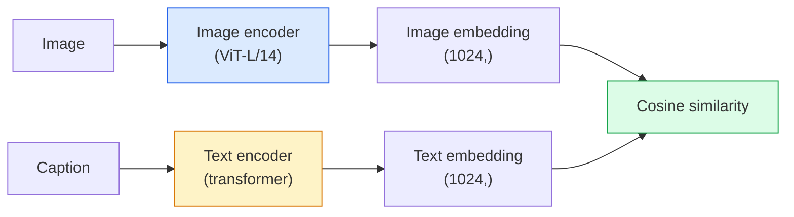

# Tầm nhìn từ ngữ mở  CLIP

> Để một mã hóa hình ảnh và một mã hóa văn bản một bắt đầu tập luyện, để phù hợp (phần, tiêu đề) với một điểm trong không gian chia sẻ. Đó là toàn bộ kỹ thuật.

**Type:** Build + Use
**Languages:** Python
**Prerequisites:** Phase 4 Lesson 14 (ViT), Phase 4 Lesson 17 (Self-Supervised)
**Time:** ~45 分钟

## Học mục tiêu

- 解释 CLIP của kiến trúc hai tháp và đối lập mục tiêu đào tạo
- Sử dụng CLIP được đào tạo trước (hoặc SigLIP) để thực hiện phân loại không bắn, không cần bất kỳ đào tạo cụ thể về nhiệm vụ
- Từ zero thực hiện phân loại chụp không: code class prompts 計算 cosine similarity 取 argmax
- 区分 CLIP、SigLIP、OpenCLIP và LLaVA/LLaMA-vision mô hình chúng được sử dụng vào năm 2026

## 问题

传统分类器是闭词库:一个1000级ImageNet模型只能预测1000个标签──每个新类都需要标签数据 和重新训练的头──

CLIP(Radford et al., OpenAI 2021) cho thấy, trong 400M cặp (hình ảnh, tiêu đề) được đào tạo trên web, có thể có được một mô hình, nó có thể suy luận 时分类到任何类集合中,而这些类只需使用自然语言描述―― Bạn qua viết một câu để đưa cho nó một lớp mới.

Đây là một hệ thống truyền hình hiện đại, từ CLIP-family checkpoint 开始的原因──Detection(Grounding DINO、OWL-ViT) Segmentation(CLIPSeg、SAM)  Retrieval、content moderation、VLMs 和 text-to-image generation đều được xây dựng trên các nhúng cốt chung kiểu CLIP 之之上──

## 概念

### Hai tháp



Hai bộ mã hóa cuối cùng sẽ được chiếu qua đường thẳng 投影到相同的嵌入维度 ((CLIP-B/32 为 512,CLIP-L/14 为 1024)  tiến hành L2- bình thường hóa 并计算 cosine tương tự。

### 目标

给定一个包含 N 个 (图像, caption) cặp của lô, cấu trúc một matrix tương đồng NxN。训练两个编码,使 diagonal(tích đôi) có sự tương đồng cao, còn ngoài hình dạng hình dạng(không phù hợp) có sự tương đồng thấp。

```
sim_matrix = image_embeddings @ text_embeddings.T / tau

loss_i2t = cross_entropy(sim_matrix,       targets=arange(N))
loss_t2i = cross_entropy(sim_matrix.T,     targets=arange(N))
loss = (loss_i2t + loss_t2i) / 2
```

Đó là đối xứng, vì hình ảnh-đối với văn bản và văn bản-đối với hình ảnh lấy lại đều nên có thể sử dụng.`tau`(giảm nhiệt độ) thường là một tham số thang học, khởi nghiệp là 0.07。

### SigLIP: Better Loss

SigLIP(Zhai et al., 2023) dùng sigmoid mỗi cặp 替换了 softmax:

```
loss = mean over pairs of log(1 + exp(-y_ij * sim_ij))
y_ij = +1 if matching, -1 otherwise
```

Per-pair Loss 移除 CLIP cần thiết chuẩn hóa cấp lô.

### Định dạng không bắn

Đặt một CLIP tập luyện tốt:

1. Đối với mỗi lớp,组合一个提示:"một bức ảnh của một {class}"
2. Uzz văn bản mã hóa mã hóa tất cả các class prompt -> `T`hình dạng (C, d)
3. Hình ảnh thử nghiệm mã hóa -> `I`hình (1, d) ⋅
4. Tương tự = `I @ T.T`hình dạng (1, C) ⋅
5. Argmax -> lớp dự đoán

Kỹ thuật nhanh  rất quan trọng. OpenAI 为 ImageNet 发布 80 mẫu nhanh :"một bức ảnh của một {}""",một bức ảnh mờ của một {}""",một bản phác thảo của một {}"、...)。 đối với tất cả các mẫu của mỗi lớp 取平均,可以额外提升 1-3% top-1 chính xác。

### 2026 năm sử dụng các mô hình CLIP

- **Zero-shot classification**直接使用。
- **Image retrieval** một lần性 mã hóa tất cả các hình ảnh, trong suy luận 时嵌入 query。
- **Text-conditioned detection**Grounding DINO、OWL-ViT sẽ CLIP text tower 包装在探测器 周围──
- **Text-conditioned segmentation**CLIPSeg;SAM  thông qua CLIP Sử dụng các đầu vào văn bản nhanh chóng。
- **VLMs**LLaVA、Qwen-VL、InternVL sẽ sử dụng mã hóa thị giác CLIP-family 接入 LLM。
- **Text-to-image gen**Stable Diffusion、DALL-E 3 以 CLIP text embedments 为条件──

Một khi bạn có không gian nhúng chung, mỗi nhiệm vụ tầm nhìn + ngôn ngữ sẽ trở thành cách tính toán.


```figure
clip-contrastive
```

##  xây dựng nó

### 步骤 1: một mô hình hai tháp rất nhỏ

CLIP thực sự là máy biến đổi ViT +. Trong bài học này, tháp được dựa trên các tính năng chuẩn bị sẵn có của các máy MLP nhỏ, do đó tín hiệu đào tạo trên CPU cũng có thể được nhìn thấy.

```python
import torch
import torch.nn as nn
import torch.nn.functional as F


class TwoTower(nn.Module):
    def __init__(self, img_in=128, txt_in=64, emb=64):
        super().__init__()
        self.image_proj = nn.Sequential(nn.Linear(img_in, 128), nn.ReLU(), nn.Linear(128, emb))
        self.text_proj = nn.Sequential(nn.Linear(txt_in, 128), nn.ReLU(), nn.Linear(128, emb))
        self.logit_scale = nn.Parameter(torch.ones([]) * 2.6592)  # ln(1/0.07)

    def forward(self, img_feats, txt_feats):
        i = F.normalize(self.image_proj(img_feats), dim=-1)
        t = F.normalize(self.text_proj(txt_feats), dim=-1)
        return i, t, self.logit_scale.exp()
```

2 dự đoán √ chia sẻ-dim đầu ra√ học nhiệt độ√ hình dạng với thực CLIP API tương tự

### 步骤 2:Khối biệt mất mát

```python
def clip_loss(image_emb, text_emb, logit_scale):
    N = image_emb.size(0)
    sim = logit_scale * image_emb @ text_emb.T
    targets = torch.arange(N, device=sim.device)
    l_i = F.cross_entropy(sim, targets)
    l_t = F.cross_entropy(sim.T, targets)
    return (l_i + l_t) / 2
```

Tương đối hơn, nhưng có rủi ro không ổn định hơn.

### 步骤 3: Cân loại không bắn

```python
@torch.no_grad()
def zero_shot_classify(model, image_feats, class_text_feats, class_names):
    """
    image_feats:      (N, img_in)
    class_text_feats: (C, txt_in)   one averaged embedding per class
    """
    i = F.normalize(model.image_proj(image_feats), dim=-1)
    t = F.normalize(model.text_proj(class_text_feats), dim=-1)
    sim = i @ t.T
    pred = sim.argmax(dim=-1)
    return [class_names[p] for p in pred.tolist()]
```

Mỗi bước một dòng. Đây là thủ tục chụp không chính xác được sử dụng tại các điểm kiểm soát CLIP sản xuất.

### Bước 4: Kiểm tra sức khỏe

```python
torch.manual_seed(0)
model = TwoTower()

img = torch.randn(8, 128)
txt = torch.randn(8, 64)
i, t, scale = model(img, txt)
loss = clip_loss(i, t, scale)
print(f"batch size: {i.size(0)}   loss: {loss.item():.3f}")
```

Đối với mô hình khởi nghiệp, Loss  nên gần`log(N) = log(8) = 2.08`Đây là mục tiêu giao hợp entropy của cấu trúc chưa được học.

## Sử dụng nó

OpenCLIP là lựa chọn nhận dạng của cộng đồng năm 2026:

```python
import open_clip
import torch
from PIL import Image

model, _, preprocess = open_clip.create_model_and_transforms("ViT-B-32", pretrained="laion2b_s34b_b79k")
tokenizer = open_clip.get_tokenizer("ViT-B-32")

image = preprocess(Image.open("dog.jpg")).unsqueeze(0)
text = tokenizer(["a photo of a dog", "a photo of a cat", "a photo of a car"])

with torch.no_grad():
    image_features = model.encode_image(image)
    text_features = model.encode_text(text)
    image_features = image_features / image_features.norm(dim=-1, keepdim=True)
    text_features = text_features / text_features.norm(dim=-1, keepdim=True)
    probs = (100.0 * image_features @ text_features.T).softmax(dim=-1)

print(probs)
```

SigLIP 更新, trong quy mô nhỏ đào tạo tốt hơn, và thích hợp hơn với công việc mới:`google/siglip-base-patch16-224`✿ ✿ ✿ ✿ ✿ ✿ ✿ ✿ ✿ ✿ ✿ ✿ ✿ ✿ ✿ ✿ ✿ ✿ ✿ ✿ ✿ ✿ ✿ ✿ ✿ ✿ ✿ ✿ ✿ ✿ ✿ ✿ ✿ ✿ ✿ ✿ ✿ ✿ ✿ ✿ ✿ ✿ ✿ ✿ ✿ ✿ ✿ ✿ ✿ ✿ ✿ ✿ ✿ ✿ ✿ ✿ ✿ ✿ ✿ ✿ ✿ ✿ ✿ ✿ ✿ ✿ ✿ ✿ ✿ ✿ ✿ ✿ ✿ ✿ ✿ ✿ ✿ ✿ ✿ ✿ ✿ ✿ ✿ ✿ ✿ ✿ ✿ ✿ ✿ ✿ ✿ ✿ ✿ ✿ ✿ ✿ ✿ ✿ ✿ ✿ ✿ ✿ ✿ ✿ ✿ ✿ ✿ ✿ ✿ ✿ ✿ ✿ ✿ ✿ ✿ ✿ ✿ ✿ ✿ ✿ ✿ ✿ ✿ ✿ ✿ ✿ ✿ ✿ ✿ ✿ ✿ ✿ Memo ✿ ✿ Memo ✿ ✿ ✿ ✿ ✿ M✿ M✿ ✿ M✿ M✿ M✿ M✿ M✿ M✿ M✿ M✿ M✿ M✿ M✿ M✿ M✿ M✿ M✿ M✿ M✿ M✿ M✿ M✿ M✿ M✿ M✿ M✿ M✿ M✿ M✿ M✿ M✿ M✿ M✿ M✿ M✿ M✿ M✿ M✿ M✿ M✿ M✿ M✿ M✿ M✿ M✿ M✿ M✿ M✿ M✿ M✿ M✿ M✿ M✿ M✿ M✿ M✿ M✿ M✿ M✿ M✿ M✿ M✿ M✿ M✿ M✿ M✿ M✿ M✿ M ✿ M✿ M✿ M ✿ M✿ M ✿ M ✿ M ✿ M ✿ M ✿ M ✿ M ✿ M ✿ M ✿ M ✿ M ✿ M ✿ M ✿ M ✿ M ✿ M ✿ M ✿ M ✿ M ✿ M ✿ M ✿ M ✿ M ✿ M ✿ M ✿ M ✿

## 交付 nó

本课会产出:

- `outputs/prompt-zero-shot-class-picker.md` Một lời nhắc, được sử dụng trong các lớp nhất định 列表和域 时, cho các mẫu CLIP 设计 lớp không bắn.
- `outputs/skill-image-text-retriever.md` một kỹ năng, sử dụng bất kỳ điểm kiểm tra CLIP  xây dựng chỉ số nhúng hình ảnh, hỗ trợ truy vấn theo văn bản 和 truy vấn theo hình ảnh。

## 练习

1. **（Easy）**Sử dụng OpenCLIP ViT-B/32 được đào tạo trước, và CIFAR-10 上 sử dụng 80 mẫu đơn đặt hàng thực hiện phân loại không bắn.
2. **（Medium）**Trong cùng một nhiệm vụ CIFAR-10 上比较单模板("một bức ảnh của {}") với 80 mẫu trung bình nhúngềnềnềnềnềnềnềnềnềnềnềnềnềnềnềnềnềnềnềnềnềnềnềnềnềnềnềnềnềnềnềnềnềnềnềnềnềnềnềnềnềnềnềnềnềnềnềnềnềnềnềnềnềnềnềnềnềnềnềnềnềnềnềnềnềnềnềnềnềnềnềnềnềnềnềnềnềnềnềnềnềnềnềnềnềnềnềnềnềnềnềnềnềnềnềnềnềnềnềnềnềnềnềnềnềnềnềnềnềnềnềnềnềnềnềnềnềnềnềnềnềnềnềnềnềnềnềnềnềnềnềnềnềnềnềnềnềnềnềnềnềnềnềnềnềnềnềnềnềnềnềnềnềnềnềnềnềnềnềnềnềnềnềnềnềnềnềnềnềnềnềnềnềnềnềnềnềnềnềnềnềnềnềnềnềnềnềnềnềnềnềnềnềnềnềnềnềnềnềnềnềnềnềnềnềnềnềnềnềnềnềnềnềnềnềnềnềnềnềnềnềnềnềnềnềnềnềnềnềnềnềnềnềnềnềnềnềnềnềnềnềnềnềnềnềnềnềnềnềnềnềnềnềnềnềnềnềnềnềnềnềnềnềnềnềnềnềnềnềnềnềnềnềnềnềnềnềnềnềnềnềnềnềnềnềnềnềnềnềnềnềnềnềnềnềnềnềnềnềnềnềnềnềnềnềnềnềnềnềnềnềnềnềnềnềnềnềnềnềnềnềnềnềnềnềnềnềnềnềnềnềnềnềnềnềnềnềnềnềnềnềnềnềnềnềnềnềnềnềnềnềnềnềnềnềnềnềnềnềnềnềnềnềnềnềnềnềnềnềnềnềnềnềnềnềnềnềnềnềnềnềnềnềnềnềnềnềnềnềnềnềnềnềnềnềnềnềnềnềnềnềnềnềnềnềnềnềnềnềnềnềnềnềnềnềnềnềnềnềnềnềnềnềnềnềnềnềnềnềnềnềnềnềnềnềnềnềnềnềnềnềnềnềnềnềnềnềnềnềnềnềnềnềnềnềnềnềnềnềnềnềnềnềnềnềnềnềnềnềnềnềnềnềnềnềnềnềnềnền
3. **（Hard）**构建一个零镜像检索索索引: sử dụng CLIP nhúng 1.000张 hình ảnh, xây dựng FAISS索引, sử dụng ngôn ngữ tự nhiên để mô tả để thực hiện truy vấn.

## 关键术语

| Term | 人们怎么说 | 它实际意味着什么 |
|------|----------------|----------------------|
| Two-tower | "Dual encoder" | 独立的 image 和 text encoders，末端是 shared-dim projection head |
| Zero-shot | "No task-specific training" | 在 inference 时分类到仅由文本描述的 classes；不接触 labels |
| Temperature / logit_scale | "tau" | 在 softmax 前缩放 similarity matrix 的 learned scalar |
| Prompt template | "A photo of a {}" | 包裹 class names 的自然语言包装器；平均多个 templates 会提升 zero-shot accuracy |
| CLIP | "Image+text model" | 2021 年的 OpenAI model；2026 年该领域的通用语汇 |
| SigLIP | "Sigmoid CLIP" | 将 softmax 替换为 per-pair sigmoid；在小 batch 下训练更好 |
| OpenCLIP | "Open reproduction" | 社区在 LAION 上训练的 CLIP variants；open-source pipelines 的 production default |
| VLM | "Vision-language model" | CLIP-family encoder 加上 LLM，训练用来回答关于 images 的问题 |

## 延伸阅读

- [CLIP：从自然语言监督中学习可迁移视觉模型（Radford et al., 2021）](https://arxiv.org/abs/2103.00020)
- [SigLIP：用于 Language-Image Pre-Training 的 Sigmoid Loss（Zhai et al., 2023）](https://arxiv.org/abs/2303.15343)
- [OpenCLIP](https://github.com/mlfoundations/open_clip) Khóa code cộng đồng
- [DINOv2 vs CLIP vs MAE：features comparison](https://huggingface.co/blog/dinov2)包含并排 sử dụng trường hợp của HF hướng dẫn
