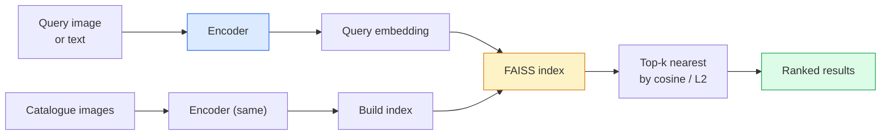

# Khám ảnh và học métrics

> Hệ thống khôi phục sẽ theo khoảng cách trong không gian nhúng đối với sự sắp xếp của các ứng cử viên. Học tập métric là một ngành học tạo ra không gian này, giúp khoảng cách thể hiện ý nghĩa bạn muốn.

**Type:** Build
**Languages:** Python
**Prerequisites:** Phase 4 Lesson 14 (ViT), Phase 4 Lesson 18 (CLIP)
**Time:** ~45 minutes

## Học mục tiêu
- 解释 triple, tương phản và mất mát học tập métric dựa trên proxy,并为给定数据集选择合适的方法
- 正确实现 L2 chuẩn hóa và tương đồng cosine,并审计 "những mục tương tự" và "thời gian thu hồi cùng lớp" khác biệt của
-  cấu trúc FAISS index, sử dụng văn bản và hình ảnh để truy vấn nó,并为持久查询集 报告 recall@K
- Để dùng DINOv2、CLIP 和 SigLIP để cài đặt xương sống, và biết cách chiến thắng.

## 问题
Khám phá trong hệ thống sản xuất hình ảnh không tồn tại: phát hiện trùng lặp, tìm kiếm hình ảnh ngược, tìm kiếm hình ảnh, tìm kiếm hình ảnh, tìm kiếm hình ảnh, tìm kiếm hình ảnh, tìm kiếm hình ảnh tương tự, tìm kiếm hình ảnh tương tự, tìm kiếm hình ảnh tương tự, tìm kiếm hình ảnh tương tự, tìm kiếm hình ảnh tương tự, tìm kiếm hình ảnh tương tự, tìm kiếm hình ảnh tương tự, tìm kiếm hình ảnh tương tự, tìm kiếm hình ảnh tương tự, tìm kiếm hình ảnh tương tự, tìm kiếm hình ảnh tương tự, tìm kiếm hình ảnh tương tự, tìm kiếm hình ảnh tương tự, tìm kiếm hình ảnh tương tự, tìm kiếm hình ảnh tương tự, tìm kiếm hình ảnh tương tự, tìm kiếm hình ảnh tương tự, tìm kiếm hình ảnh tương tự, tìm kiếm hình ảnh tương tự, tìm kiếm hình ảnh tương tự, tìm kiếm hình ảnh tương tự.

Hai quyết định thiết kế quyết định toàn bộ hệ thống. Đơn vị, cũng là bởi gì mô hình tạo ra Vector. Chỉ số, cũng là cách tìm thấy hàng xóm gần nhất trong bối cảnh quy mô. Đến năm 2026, cả hai đều đã được thương mại hóa.

Đây là một loại hình học học về métric.

## 概念
### Khám phá một cái nhìn



### Bốn gia đình mất mát

| Loss | Requires | Pros | Cons |
|------|----------|------|------|
| **Contrastive** | (anchor, positive) + negatives | 简单，可用于任何 pair label | 没有大量 negatives 时收敛较慢 |
| **Triplet** | (anchor, positive, negative) | 直观；可直接控制 margin | Hard-triplet mining 成本高 |
| **NT-Xent / InfoNCE** | Pairs + batch-mined negatives | 可扩展到大 batch | 需要大 batch 或 momentum queue |
| **Proxy-based (ProxyNCA)** | 仅 class labels | 快速、稳定、无需 mining | 在小数据集上可能 overfit 到 proxies |

Đối với hầu hết các trường hợp sản xuất, trước tiên từ xương sống đã được đào tạo  bắt đầu; chỉ khi Off-the-shelf Embeddings trong tập thể kiểm tra của bạn không có hiệu suất, thêm vào metric-làm bài học tinh tế 

### Thiệt hại gấp ba lần chính thức

```
L = max(0, ||f(a) - f(p)||^2 - ||f(a) - f(n)||^2 + margin)
```

Đưa neo`a`拉近 dương tính `p`, đưa nó ra từ tiêu cực `n`,并使用 `margin`确保间隔──三图结构 có thể được tổng hợp thành bất kỳ thứ tự tương tự nào──

Quá trình khai thác  rất quan trọng: dễ dàng ba con`n` đã rời `a`很远) 贡献零 Loss; chỉ có ba người cứng 才能教会模型── bán cứng khai thác(`n`比 `p`Hơn nữa nhưng vẫn còn ở biên giới trong) là chương trình của FaceNet năm 2016, và đến nay vẫn chiếm ưu thế.

### Sự tương đồng của cosine so với L2

两种计量,两套约定:

- **Cosine**:Vektor 之间的角── cần L2-được chuẩn hóa
- **L2**:Công cách Euclidean──có thể sử dụng nguyên liệu hoặc hợp lý hóa, nhưng thường là hợp lý với L2- hợp lý hóa + bình phương L2 搭配──

Đối với hầu hết các mạng hiện đại, hai loại là giá bằng:`||a|| = ||b|| = 1`时,`||a - b||^2 = 2 - 2 cos(a, b)`△选择与你的嵌入 训练一致的约定;混用会改变 "càng gần" 的含义──

### Recall@K

标准 lấy lại metric:

```
recall@K = fraction of queries where at least one correct match is in the top K results
```

Và xếp báo recall@1、@5、@10。若 recall@10 高于0.95 而 recall@1 低于0.5,说明 嵌入空间 结构正确,但排序有噪音; có thể thử更长的细节或重新排名步骤。

Đối với phát hiện trùng lặp, độ chính xác @K quan trọng hơn, vì mỗi âm tích sai đều là lỗi người dùng thấy. Đối với tìm kiếm trực quan, nhớ lại @K là tín hiệu sản phẩm.

### FAISS trong một đoạn

Facebook AI Tìm kiếm tương đồng──事实标准的近邻搜索 库──三种索引 选择:

- `IndexFlatIP`- `IndexFlatL2` lực thô 精确无需训练 可用到约1M vector──
- `IndexIVFFlat` 划分为K 个细胞, chỉ tìm kiếm một số ít tế bào gần đây 近似、快速、需要训练数据
- `IndexHNSW` dựa trên biểu đồ, đối với số lượng truy vấn nhanh nhất, kích thước chỉ số lớn hơn

Đối với 100k vector, bạn có thể nghĩ trong cosine tương tự 上使用 `IndexFlatIP`❖ Đối với 10M, sử dụng `IndexIVFFlat`❖ Đối với 100M+,结合产品量化`IndexIVFPQ`(■)

### lấy lại cấp độ ví dụ so với cấp độ danh mục

Hai vấn đề có tên giống nhau nhưng rất khác nhau:

- **Category-level** "在我的目录 中找猫──" Tương tự về các loại hình; Off-the-shelf CLIP / DINOv2 Embeddings 效果很好──
- **Instance-level** " Trong danh mục của tôi tìm * sản phẩm thực sự này *。 " 需要在同一类别内视觉相似对象之间做细粒度区分; Off-the-shelf Embeddings表现不足;使用指标学习细调 很重要。

Trước khi chọn mô hình, luôn luôn hỏi trước khi bạn giải quyết được cái gì.


```figure
metric-embedding
```

##  xây dựng nó
### 步骤 1: mất trí

```python
import torch
import torch.nn.functional as F

def triplet_loss(anchor, positive, negative, margin=0.2):
    d_ap = F.pairwise_distance(anchor, positive, p=2)
    d_an = F.pairwise_distance(anchor, negative, p=2)
    return F.relu(d_ap - d_an + margin).mean()
```

 行。 được áp dụng cho L2 chuẩn hóa hoặc nhúng nguyên liệu

### 步骤 2: khai thác bán cứng

给定一批嵌入和标签, cho mỗi neo 找到最难的半硬负面──

```python
def semi_hard_negatives(emb, labels, margin=0.2):
    dist = torch.cdist(emb, emb)
    same_class = labels[:, None] == labels[None, :]
    diff_class = ~same_class
    N = emb.size(0)

    positives = dist.clone()
    positives[~same_class] = float("-inf")
    positives.fill_diagonal_(float("-inf"))
    pos_idx = positives.argmax(dim=1)

    semi_hard = dist.clone()
    semi_hard[same_class] = float("inf")
    d_ap = dist[torch.arange(N), pos_idx].unsqueeze(1)
    semi_hard[dist <= d_ap] = float("inf")
    neg_idx = semi_hard.argmin(dim=1)

    fallback_mask = semi_hard[torch.arange(N), neg_idx] == float("inf")
    if fallback_mask.any():
        hardest = dist.clone()
        hardest[same_class] = float("inf")
        neg_idx = torch.where(fallback_mask, hardest.argmin(dim=1), neg_idx)
    return pos_idx, neg_idx
```

Mỗi neo sẽ nhận được tích cực khó nhất trong lớp, cũng như một phần âm tính khó hơn tích cực nhưng nằm trong biên giới.

### 步骤 3: Recall@K

```python
def recall_at_k(query_emb, gallery_emb, query_labels, gallery_labels, k=1):
    sim = query_emb @ gallery_emb.T
    _, top_k = sim.topk(k, dim=-1)
    matches = (gallery_labels[top_k] == query_labels[:, None]).any(dim=-1)
    return matches.float().mean().item()
```

Trong L2 chuẩn hóa Nhập vào trên theo sản phẩm bên trong 取 top-k, bằng với theo cosine 取 top-k.

### 步骤 4: Đặt nó lại

```python
import torch
import torch.nn as nn
from torch.optim import Adam

class Encoder(nn.Module):
    def __init__(self, in_dim=128, emb_dim=64):
        super().__init__()
        self.net = nn.Sequential(
            nn.Linear(in_dim, 128), nn.ReLU(),
            nn.Linear(128, emb_dim),
        )

    def forward(self, x):
        return F.normalize(self.net(x), dim=-1)

torch.manual_seed(0)
num_classes = 6
protos = F.normalize(torch.randn(num_classes, 128), dim=-1)

def sample_batch(bs=32):
    labels = torch.randint(0, num_classes, (bs,))
    x = protos[labels] + 0.15 * torch.randn(bs, 128)
    return x, labels

enc = Encoder()
opt = Adam(enc.parameters(), lr=3e-3)

for step in range(200):
    x, y = sample_batch(32)
    emb = enc(x)
    pos_idx, neg_idx = semi_hard_negatives(emb, y)
    loss = triplet_loss(emb, emb[pos_idx], emb[neg_idx])
    opt.zero_grad(); loss.backward(); opt.step()
```

Sau vài trăm bước, các cluster nhúng sẽ hình thành mỗi lớp một cluster.

## Sử dụng nó
2026 năm sản xuất:

- **DINOv2 + FAISS** 通用 truy xuất trực quan──可 off-the-shelf 使用──
- **CLIP + FAISS** Khi hỏi là văn bản 时.
- **Fine-tuned DINOv2 + FAISS** tìm kiếm cấp trường hợp  face re-ID  fashion  e-commerce
- **Milvus / Weaviate / Qdrant** 围绕 FAISS hoặc HNSW của quản lý các gói DB vector.

 Đối với SOTA instance retrieval,配方是:DINOv2 backbone,添加 Embedding head, trong instance-labelled pairs 上用 triplet 或 InfoNCE Loss fine-tune, và xây dựng index trong FAISS。

## 交付 nó
本课产 出:

- `outputs/prompt-retrieval-loss-picker.md` Một lời nhắc, được sử dụng cho việc lấy lại 问题选择 triplet / InfoNCE / ProxyNCA。
- `outputs/skill-recall-at-k-runner.md` Một kỹ năng, để viết lại 干净的回忆@K đánh giá vòng xoay, chứa tàu / val / phòng trưng bày chia và chính xác của dữ liệu契约。

## 练习
1. **(Easy)**运行 trên ví dụ đồ chơi. Sử dụng PCA vẽ tập luyện trước sau của Embeddings, quan sát sáu cụm 如何形成──
2. **(Medium)**添加 ProxyNCA Loss 实现: Mỗi lớp một học "proxy", trong tương đồng cosine 上做标准 chéo-entropy。
3. **(Hard)**取 1,000 张 ImageNet xác nhận hình ảnh, thông qua HuggingFace sử dụng DINOv2 生成 Embeddings, xây dựng FAISS Flat Index,并 báo cáo với cùng một nhóm hình ảnh cho các truy vấn 时的回忆@{1, 5, 10}(应为 1.0),以及以持久的分割 和 ImageNet 标签 作为 ground truth 时的结果──

## 关键术语
| Term | What people say | What it actually means |
|------|----------------|----------------------|
| Metric learning | "Shape the space" | 训练一个 encoder，使其输出空间中的距离反映目标相似度 |
| Triplet loss | "Pull and push" | L = max(0, d(a, p) - d(a, n) + margin)；经典的 metric-learning Loss |
| Semi-hard mining | "Useful negatives" | 比 positive 更远但仍在 margin 内的 negatives；经验上信息量最大 |
| Proxy-based loss | "Class prototypes" | 每个 class 一个 learned proxy；对 similarity-to-proxies 做 cross-entropy；无需 pair mining |
| Recall@K | "Top-K hit rate" | top K 中至少有一个正确结果的查询比例 |
| Instance retrieval | "Find this exact thing" | 细粒度匹配；off-the-shelf features 通常表现不足 |
| FAISS | "The NN library" | Facebook 的 nearest-neighbour 库；支持精确和近似 indexes |
| HNSW | "Graph index" | Hierarchical navigable small world；内存开销小的快速近似 NN |

## 延伸阅读
- [FaceNet: A Unified Embedding for Face Recognition (Schroff et al., 2015)](https://arxiv.org/abs/1503.03832) mất gấp ba phần / khai thác bán cứng 论文
- [In Defense of the Triplet Loss for Person Re-Identification (Hermans et al., 2017)](https://arxiv.org/abs/1703.07737) triệu chỉnh tinh tế 实践指南
- [FAISS documentation](https://github.com/facebookresearch/faiss/wiki) Mỗi chỉ số, mỗi trade-off
- [SMoT: Metric Learning Taxonomy (Kim et al., 2021)](https://arxiv.org/abs/2010.06927) 现代 mất mát  và liên quan của nó
