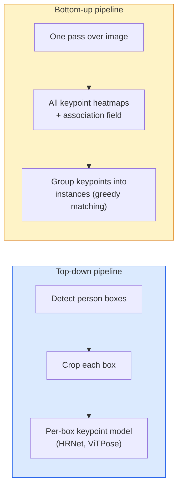

# Khám phá điểm chính và ước tính vị trí

> Một hình ảnh là một nhóm các điểm khóa có thứ tự. Một bộ phát hiện điểm khóa là một bộ trục bộ đồ họa nhiệt.

**Type:** Build
**Languages:** Python
**Prerequisites:** Phase 4 Lesson 06 (Detection), Phase 4 Lesson 07 (U-Net)
**Time:** ~45 分钟

## Học mục tiêu
- 区分 từ trên xuống và từ dưới lên ước tính tư thế,并说明 từng sử dụng
- Sử dụng Gaussian-per-keypoint mục tiêu cho K 个 điểm khóa Khóa nhiệt giảm, và suy luận 时提取 điểm khóa phối hợp
- 解释 Phần Các trường liên kết (PAF), cũng như đường ống dẫn từ dưới lên  làm thế nào để đưa các điểm chính 关联成
- Sử dụng MediaPipe Pose hoặc MMPose để làm ước tính điểm chính cấp sản xuất, và hiểu các định dạng sản xuất của chúng

## 问题
Các nhiệm vụ quan trọng có nhiều tên gọi: tư thế con người ((17 khớp cơ thể) 、đường điểm đối mặt ((68 hoặc 478 个点) 、tấm bàn ((21 个点) 、 tư thế động vật、 tư thế vật robot、 dấu hiệu quan trọng về giải phẫu y tế。 chúng đều chia sẻ cùng một cấu trúc: trên một vật thể 上检测 K 个离散点,并输出它们的 (x, y) phối hợp。

Tầm nhìn định hình là hình ảnh chuyển động, ứng dụng thể dục, phân tích thể thao, kiểm soát cử chỉ, hoạt hình, thử nghiệm AR và nắm bắt robot.

工程问题在于尺度──单图、单人 Pose 是一个20ms 问题──人群中的多人 Pose 需要在30fps 下运行,则是一个结构完全不同的问题──

## 概念
### Từ trên xuống xuống xuống



- **Top-down** Đầu tiên kiểm tra người, tái đối với mỗi cây trồng 运行 mỗi người mô hình điểm chính 
- **Bottom-up** Một lần đi trước 预测 tất cả các điểm chính cộng với một trường liên kết; tái phân nhóm chúng.

Top-down (HRNet, ViTPose) là chính xác tỷ lệ dẫn đầu; bottom-up (OpenPose, HigherHRNet) là những cảnh đông đúc giữa các giải trí dẫn đầu.

### Khung trở lại bản đồ nhiệt

Đừng quay lại trực tiếp`(x, y)`, nhưng cho mỗi điểm chính 预测 một `H x W`Bản đồ nhiệt, trong đó có một khối lượng Gaussian ở trung tâm vị trí thực tế.

```
target[k, y, x] = exp(-((x - cx_k)^2 + (y - cy_k)^2) / (2 sigma^2))
```

Trong suy luận, argmax của mỗi heatmap là vị trí điểm chính của dự đoán.

Tại sao các heatmap hơn sự lùi trực tiếp là tốt hơn: cấu trúc không gian của mạng (conv feature map) tự nhiên đối với không gian dung lượng.

### Định vị vị của các subpixel

Argmax  đưa ra số trọn trọn ⋅ Để đạt được độ chính xác của các pixel, bạn có thể đối với argmax  và các vùng lân cận phù hợp với các hình thái, hoặc sử dụng các phương pháp bù đắp thường xuyên `(dx, dy) = 0.25 * (heatmap[y, x+1] - heatmap[y, x-1], ...)`方向:

### Các lĩnh vực liên quan phần (PAF)

OpenPose sử dụng các kỹ thuật liên kết từ dưới lên. Đối với mỗi cặp kết nối các điểm chính (ví dụ: vai trái đến gót tay trái), dự đoán một lĩnh vực 2 kênh, mã hóa từ một điểm chỉ đến một điểm khác.

```
For each connection (limb):
  PAF channels: 2 (unit vector x, y)
  Line integral: sum over sample points of (PAF . line_direction)
  Higher integral = stronger match
```

Phương pháp này rất đẹp, và không cần cây trồng mỗi người để mở rộng đến kích thước đám đông tùy ý.

### Các điểm khóa COCO

标准的 body-pose dataset: mỗi người 17 个关键点, sử dụng PCK (%)  % of Correct Keypoints) và OKS ( % of Correct Keypoints) như là metrics.

### 2D vs 3D

- **2D pose** phối hợp hình ảnh; đã đạt được sản xuất质量(MediaPipe, HRNet, ViTPose)
- **3D pose** địa điểm phối hợp thế giới / máy ảnh; vẫn là hướng nghiên cứu hoạt động.
  - Sử dụng một MLP nhỏ sẽ nâng dự đoán 2D lên 3D
  - 直接从图像做3D regression ((PyMAF, MHFormer) ⋅
  - Các thiết lập đa quan sát (CMU Panoptic) được sử dụng cho sự thật trên mặt đất.


```figure
cv3-pose-heatmap
```

##  xây dựng nó
### 步骤 1: mục tiêu bản đồ nhiệt Gaussian

```python
import numpy as np
import torch

def gaussian_heatmap(size, cx, cy, sigma=2.0):
    yy, xx = np.meshgrid(np.arange(size), np.arange(size), indexing="ij")
    return np.exp(-((xx - cx) ** 2 + (yy - cy) ** 2) / (2 * sigma ** 2)).astype(np.float32)

hm = gaussian_heatmap(64, 32, 32, sigma=2.0)
print(f"peak: {hm.max():.3f} at ({hm.argmax() % 64}, {hm.argmax() // 64})")
```

Dọc theo trục kênh  lắp ráp các bản đồ nhiệt mỗi điểm khóa, bạn có được tensor mục tiêu hoàn chỉnh.

### 步骤 2: Đầu phím nhỏ

Một mô hình kiểu U-Net,输出 K 个热地图 道.

```python
import torch.nn as nn
import torch.nn.functional as F

class TinyKeypointNet(nn.Module):
    def __init__(self, num_keypoints=4, base=16):
        super().__init__()
        self.down1 = nn.Sequential(nn.Conv2d(3, base, 3, 2, 1), nn.ReLU(inplace=True))
        self.down2 = nn.Sequential(nn.Conv2d(base, base * 2, 3, 2, 1), nn.ReLU(inplace=True))
        self.mid = nn.Sequential(nn.Conv2d(base * 2, base * 2, 3, 1, 1), nn.ReLU(inplace=True))
        self.up1 = nn.ConvTranspose2d(base * 2, base, 2, 2)
        self.up2 = nn.ConvTranspose2d(base, num_keypoints, 2, 2)

    def forward(self, x):
        h1 = self.down1(x)
        h2 = self.down2(h1)
        h3 = self.mid(h2)
        u1 = self.up1(h3)
        return self.up2(u1)
```

输入 `(N, 3, H, W)`, Xuất khẩu`(N, K, H, W)`Loss là đối với mục tiêu Gaussian của MSE mỗi pixel.

### 步骤 3: Thuyết định  trích dẫn các phối hợp điểm khóa

```python
def heatmap_to_coords(heatmaps):
    """
    heatmaps: (N, K, H, W)
    returns:  (N, K, 2) float coordinates in image pixels
    """
    N, K, H, W = heatmaps.shape
    hm = heatmaps.reshape(N, K, -1)
    idx = hm.argmax(dim=-1)
    ys = (idx // W).float()
    xs = (idx % W).float()
    return torch.stack([xs, ys], dim=-1)

coords = heatmap_to_coords(torch.randn(2, 4, 32, 32))
print(f"coords: {coords.shape}")  # (2, 4, 2)
```

Inference 时只需一行── đối với tinh chỉnh sub-pixel, trong argmax 周围插值──

### 步骤 4: Bộ dữ liệu điểm khóa tổng hợp

很简单: trên tấm vải màu trắng 上画四个点,并学习预测它们──

```python
def make_synthetic_sample(size=64):
    img = np.ones((3, size, size), dtype=np.float32)
    rng = np.random.default_rng()
    kps = rng.integers(8, size - 8, size=(4, 2))
    for cx, cy in kps:
        img[:, cy - 2:cy + 2, cx - 2:cx + 2] = 0.0
    hms = np.stack([gaussian_heatmap(size, cx, cy) for cx, cy in kps])
    return img, hms, kps
```

Nhiệm vụ này đủ đơn giản, mô hình nhỏ, chỉ trong 1 phút thôi.

### Bước 5: Căn luyện

```python
model = TinyKeypointNet(num_keypoints=4)
opt = torch.optim.Adam(model.parameters(), lr=3e-3)

for step in range(200):
    batch = [make_synthetic_sample() for _ in range(16)]
    imgs = torch.from_numpy(np.stack([b[0] for b in batch]))
    hms = torch.from_numpy(np.stack([b[1] for b in batch]))
    pred = model(imgs)
    # Upsample pred to full resolution
    pred = F.interpolate(pred, size=hms.shape[-2:], mode="bilinear", align_corners=False)
    loss = F.mse_loss(pred, hms)
    opt.zero_grad(); loss.backward(); opt.step()
```

## Sử dụng nó
- **MediaPipe Pose** Google's sản xuất cấp độ định vị; cung cấp WebGL + thời gian chạy di động, chậm hơn 10ms.
- **MMPose**(OpenMMLab)  全面的研究代码库;包含每种SOTA架构 及预训重量──
- **YOLOv8-pose** 最快的实时多人姿势, sử dụng đơn次前进通行――
- **transformers HumanDPT / PoseAnything** Sử dụng tư thế từ vựng mở (quan định đối tượng, cụm từ khóa) so với các phương pháp tiếp cận ngôn ngữ tầm nhìn mới.

## 交付 nó
本课产 出:

- `outputs/prompt-pose-stack-picker.md` Một lời nhắc, có thể tùy thuộc vào độ trễ, quy mô đám đông, cũng như 2D vs 3D 需求选择 MediaPipe / YOLOv8-pose / HRNet / ViTPose。
- `outputs/skill-heatmap-to-coords.md` Một kỹ năng, để viết mỗi mô hình tư thế sản xuất sẽ được sử dụng cho các bản đồ nhiệt độ phụ-phục để phối hợp thói quen.

## 练习
1. **(Easy)**Trong tập dữ liệu tổng hợp 4 điểm 上训练 nhỏ mô hình điểm khóa. 报告 200 bước 后 dự đoán với các điểm khóa thực  giữa trung bình L2 lỗi.
2. **(Medium)**添加子像素精炼:给定 argmax vị trí,沿 x 和 y 方向使用邻近像素 拟合1D抛物线――报告对整数 argmax的精度增──
3. **(Hard)**Xây dựng một bộ dữ liệu tổng hợp 2 người, trong đó mỗi hình ảnh  hiển thị hai trường hợp mô hình 4 điểm chìa khóa.

## 关键术语
| Term | 人们怎么说 | 它实际是什么意思 |
|------|----------------|----------------------|
| Keypoint | "一个 landmark" | object 上的一个特定有序点（joint、corner、feature） |
| Pose | "skeleton" | 属于一个 instance 的一组有序 keypoints |
| Top-down | "先 detect，再 pose" | Two-stage pipeline：person detector + per-crop keypoint model；准确率最高 |
| Bottom-up | "先 pose，后 group" | Single-pass all-keypoint prediction + grouping；在 crowd size 上耗时恒定 |
| Heatmap | "Gaussian target" | 每个 keypoint 一个 H x W tensor，峰值位于真实位置；首选的 Regression target |
| PAF | "Part Affinity Field" | 编码 limb directions 的 2-channel unit vector field；用于把 keypoints 分组为 instances |
| OKS | "Keypoint IoU" | Object Keypoint Similarity；COCO 的 pose metric |
| HRNet | "High-Resolution Net" | 主流 top-down keypoint architecture；全程保留 high-res features |

## 延伸阅读
- [OpenPose (Cao et al., 2017)](https://arxiv.org/abs/1812.08008)Sử dụng PAFs từ dưới lên; vẫn là phương pháp tốt nhất mô tả vật liệu
- [HRNet (Sun et al., 2019)](https://arxiv.org/abs/1902.09212) từ trên xuống 参考架构
- [ViTPose (Xu et al., 2022)](https://arxiv.org/abs/2204.12484) Sử dụng ViT đơn giản  như xương sống tư thế; trong nhiều điểm tham khảo 上是当前 SOTA
- [MediaPipe Pose](https://developers.google.com/mediapipe/solutions/vision/pose_landmarker) 生产级实时姿势;2026 年部署最快的堆
