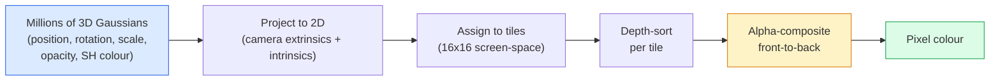

# Từ zero thực hiện 3D Gaussian Splatting

> Một cảnh tượng là một nhóm gồm hàng triệu Gaussian 3D. Mỗi Gaussian có vị trí, định hướng, quy mô, không rõ ràng, cũng như một màu dựa trên hướng xem.

**类型：**构建
**语言：**Python
**先修要求：**Giai đoạn 4 Bài học 13 (3D Vision & NeRF)  Giai đoạn 1 Bài học 12 (Tensor Operations)  Giai đoạn 4 Bài học 10 (Difusion basics optional)
**时间：**约90分钟

## Học mục tiêu

- 解释 tại sao đến năm 2026 , 3D Gaussian Splating đã thay thế NeRF, trở thành một quy trình sản xuất tiêu chuẩn của tái thiết 3D quang học
- Nói ra mỗi Gaussian của sáu loại参数 (( vị trí, quay quaternion, quy mô, không gian, màu sắc, tính năng tùy chọn của các đồng hồ hình cầu), cũng như mỗi loại đóng góp bao nhiêu float
- Từ零实现一个使用`alpha`composing của 2D Gaussian splating rasterizer, sau đó mô tả 3D  tình huống như thế nào để chiếu đến cùng một vòng
- Sử dụng `nerfstudio``gsplat`Hoặc`SuperSplat`Từ 20-50 张照片 tái tạo một cảnh,并导出为 `KHR_gaussian_splatting`GLOF mở rộng hoặc OpenUSD 26.03 `UsdVolParticleField3DGaussianSplat`schema

## 问题

NeRF sẽ lưu trữ cảnh tượng thành một khối lượng MLP. Mỗi pixel được chiếu đều cần phải đi dọc theo một tia. Cần thực hiện hàng trăm lần truy vấn MLP.

3D Gaussian Splating(Kerbl、Kopanas、Leimkühler、Drettakis,SIGGRAPH 2023) đã thay thế tất cả mọi thứ này. Một cảnh tượng là một tập hợp 3D Gaussian  hiển nhiên. 染 được thực hiện trên GPU với tốc độ 100+ fps. 染 chỉ cần vài phút.  tập tin là trực tiếp:平移部分Gaussian,你就移动椅子.

Mô hình tâm trí rất đơn giản, nhưng toán học có đủ nhiều phần hoạt động, đến nỗi hầu hết các giới thiệu sẽ bắt đầu từ rasterisation, sau đó nhảy qua chiếu và âm thanh hình cầu.

## 核心概念

### Một Gaussian  mang theo cái gì

Một Gaussian 3D là một khối lượng nhỏ trong không gian, với các thuộc tính sau:

```
position         mu         (3,)    centre in world coordinates
rotation         q          (4,)    unit quaternion encoding orientation
scale            s          (3,)    log-scales per axis (exponentiated at render time)
opacity          alpha      (1,)    post-sigmoid opacity [0, 1]
SH coefficients  c_lm       (3 * (L+1)^2,)   view-dependent colour
```

Rotation + scale 会 cấu trúc một 3x3 tính toán:`Sigma = R S S^T R^T` Đó là hình dạng của Gaussian trong 3D.  Các hợp âm hình cầu 让颜色 能随着视觉方向 改变: đặc điểm nổi bật,细微闪, ánh sáng phụ thuộc vào hình ảnh, không cần lưu trữ các kết cấu mỗi hình ảnh.

Một cảnh thường có 1-5 triệu 个 Gaussian── mỗi khoảng lưu trữ 60 个 float(3 + 4 + 3 + 1 + 48 + mc)── một cảnh của Gaussian năm triệu khoảng 240 MB, còn nhỏ hơn so với với đám mây điểm tương đương với kết cấu mỗi điểm, cũng so sánh với trọng lượng NeRF MLP tái tạo độ phân giải cao.

### Đó là sự phân tán, không phải là hành quân tia.



五个步骤,全都对 GPU 友好――没有每个像素的 MLP truy vấn――一张RTX 3080 Ti có thể chiếu 600.000 chỗ với 147 fps――

### dự án 步骤

位于 thế giới vị trí `mu`、 có sự tương tác 3D `Sigma`của Gaussian 3D, sẽ chiếu cho vị trí màn hình `mu'`、 có sự tương tác 2D `Sigma'`của 2D Gaussian:

```
mu' = project(mu)
Sigma' = J W Sigma W^T J^T          (2 x 2)

W = viewing transform (rotation + translation of camera)
J = Jacobian of the perspective projection at mu'
```

Biểu tượng Gaussian 2D là một hình elip, có một trục`Sigma'`Các vector riêng của hả hả hả hả hả hả hả hả hả hả hả hả hả hả hả hả hả hả hả hả hả hả hả hả hả hả hả hả hả hả hả hả hả hả hả hả hả hả hả hả hả hả hả hả hả hả hả hả hả hả hả hả hả hả hả hả hả hả hả hả hả hả hả hả hả hả hả hả hả hả hả hả hả hả hả hả hả hả hả hả hả hả hả hả hả hả hả hả hả hả hả hả hả hả hả hả hả hả hả hả hả hả hả hả hả hả hả hả hả hả hả hả hả hả hả hả hả hả hả hả hả hả hả hả hả hả hả hả hả hả hả hả hả hả hả hả hả hả hả hả hả hả hả hả hả hả hả hả hả hả hả hả hả hả hả hả hả hả hả hả hả hả hả hả hả hả hả hả h h h h h h h h h h h h h h h h h h h h h h h h h h h h h h h h h h h h h h h h h h h h h h h h h h h h h h h h h h h h h h h h h h h h h h h h h h h h h h h h h h h h h h h h h h h h h h h h h h h h h h h h h h h h h h h h h h h h h h h h h h h h h h h h h h h h h h h h h h h h h h h h h h h h h h h h h h h h h h h h h h h h h h h h h`exp(-0.5 * (p - mu')^T Sigma'^-1 (p - mu'))`

### Alpha-composing 规则

Đối với một pixel, bao gồm các Gaussians sẽ theo back-to-front 排序((hoặc等价地, sử dụng ngược向公式 theo front-to-back 排序)  Màu sử dụng từ những năm 1980 tất cả các rasteriser bán minh bạch đều được sử dụng trong cùng một phương pháp để soạn:

```
C_pixel = sum_i alpha_i * T_i * c_i

T_i = prod_{j < i} (1 - alpha_j)       transmittance up to i
alpha_i = opacity_i * exp(-0.5 * d^T Sigma'^-1 d)   local contribution
c_i = eval_SH(SH_i, view_direction)    view-dependent colour
```

Đây là**NeRF 的 volumetric render 是同一个方程**, chỉ có thể ở đây là một sự xuất hiện của các Gaussian hiếm 集合 计算, chứ không phải là trên các mẫu dày đặc trên tia 计算.

### Tại sao nó là khác biệt của

Mỗi bước: chiếu, phân bổ mô hình, phân tích alpha compositing, đánh giá SH,都相对于Gaussian 参数是可分化的──给定一张地面真相图像,计算 rendered pixel Loss,通过 rasteriser 进行后向,使用 Gradient Descent 更新所有`(mu, q, s, alpha, c_lm)`❖ Qua khoảng 30.000 lần lặp lại, Gaussians sẽ tìm thấy đúng vị trí, kích thước và màu sắc.

### Thiết kế và cắt

Số lượng cố định Gaussians không thể bao gồm các trường hợp phức tạp.

- **Clone**Khi một Gaussian có độ lớn rất cao nhưng quy mô rất nhỏ, trong vị trí hiện tại của nó, nó sẽ được xây dựng lại.
- **Split**Khi một số Gaussian lớn Gradient 很高时, sẽ tách nó thành hai Gaussian nhỏ hơn.
- **Prune**: xóa độ mơ hồ 低于值的Gaussians──它们没有贡献──

Thiết lập Mỗi lần lặp lại chạy một lần. Một trường hợp thường từ khoảng 100k đầu tiên Gaussians (được bắt đầu bởi điểm SfM) tăng lên đến 1-5M khi kết thúc tập luyện.

### 用一段话 hiểu các âm thanh âm thanh hình cầu

Màu phụ thuộc vào xem là hàm trên mặt cầu đơn vị`c(direction)`◊ Harmonics hình cầu là trên mặt cầu cơ sở Fourier。 cắt đến độ `L`, mỗi kênh sẽ có được`(L+1)^2`个 cơ sở chức năng. 个 cơ sở chức năng. 个 cơ sở chức năng. 个新视角评估颜色,就是将学到的SH系数与在观看方向上求值的基础做点产品. 个 个 个 个 个 个 个 个 个 个 个 个 个 个 个 个 个 个 个 个 个 个 个 个 个 个 个 个 个 个 个 个 个 个 个 个 个 个 个 个 个 个 个 个 个 个 个 个 个 个 个 个 个 个 个 个 个 个 个 个 个 个 个 个 个 个 个 个 个 个 个 个 个 个 个 个 个 个 个 个 个 个 个 个 个 个 个 个 个 个 个 个 个 个 个 个 个 个 个 个 个 个 个 个 个 个 个 个 个 个 个 个 个 个 个 个 个 个 个 个 个 个 个 个 个 个 个 个 个 个 个 个 个 个 个 个 个 个 个 个 个 个 个 个 个 个 个 个 个 个 个 个 个 个 个 个 个 个 个 个 个 个 个 个 个 个 个 个 个 个 个 个 个 个 个 个 个 个 个 个 个 个 个 个 个 个 个 个 个 个 个 个 个 个 个 个 个 个 个 个 个 个 个 个 个 个 个 个 个 个 个 个 个 个 个 个 个 个 个 个 个 个 个 个 个 个 个 个 

### 2026 năm sản xuất công nghệ

```
1. Capture         smartphone / DJI drone / handheld scanner
2. SfM / MVS       COLMAP or GLOMAP derives camera poses + sparse points
3. Train 3DGS      nerfstudio / gsplat / inria official / PostShot (~10-30 min on RTX 4090)
4. Edit            SuperSplat / SplatForge (clean floaters, segment)
5. Export          .ply -> glTF KHR_gaussian_splatting or .usd (OpenUSD 26.03)
6. View            Cesium / Unreal / Babylon.js / Three.js / Vision Pro
```

### 4D với tạo 变体

- **4D Gaussian Splatting**Gaussians là hàm thời gian; được sử dụng trong video khối lượng của Superman 2026, A$AP Rocky của "Helicopter")
- **Generative splats**:: các mô hình văn bản-được phơi bày, có thể ảo giác xuất hiện hoàn toàn cảnh.
- **3D Gaussian Unscented Transform**NVIDIA NuRec được sử dụng cho mô phỏng lái xe tự động.


```figure
cv3-gaussian-splat
```

##  xây dựng nó

### 步骤 1: một Gaussian 2D

Chúng tôi xây dựng một máy raster 2D.

```python
import torch
import torch.nn as nn
import torch.nn.functional as F


def eval_2d_gaussian(means, covs, points):
    """
    means:  (G, 2)      centres
    covs:   (G, 2, 2)   covariance matrices
    points: (H, W, 2)   pixel coordinates
    returns: (G, H, W)  density at every pixel for every Gaussian
    """
    G = means.size(0)
    H, W, _ = points.shape
    flat = points.view(-1, 2)
    inv = torch.linalg.inv(covs)
    diff = flat[None, :, :] - means[:, None, :]
    d = torch.einsum("gpi,gij,gpj->gp", diff, inv, diff)
    density = torch.exp(-0.5 * d)
    return density.view(G, H, W)
```

`einsum`会对每个 (Gaussian, pixel) cặp 计算 hình thức vuông `diff^T Sigma^-1 diff`

### 步骤 2:2D splating rasteriser

Phép chữ trước trở lại. Trong độ sâu 2D không có ý nghĩa gì, vì vậy chúng tôi sử dụng một đường đo được theo phương pháp Gaussian để biểu thị thứ tự.

```python
def rasterise_2d(means, covs, colours, opacities, depths, image_size):
    """
    means:     (G, 2)
    covs:      (G, 2, 2)
    colours:   (G, 3)
    opacities: (G,)     in [0, 1]
    depths:    (G,)     per-Gaussian scalar used for ordering
    image_size: (H, W)
    returns:   (H, W, 3) rendered image
    """
    H, W = image_size
    yy, xx = torch.meshgrid(
        torch.arange(H, dtype=torch.float32, device=means.device),
        torch.arange(W, dtype=torch.float32, device=means.device),
        indexing="ij",
    )
    points = torch.stack([xx, yy], dim=-1)

    densities = eval_2d_gaussian(means, covs, points)
    alphas = opacities[:, None, None] * densities
    alphas = alphas.clamp(0.0, 0.99)

    order = torch.argsort(depths)
    alphas = alphas[order]
    colours_sorted = colours[order]

    T = torch.ones(H, W, device=means.device)
    out = torch.zeros(H, W, 3, device=means.device)
    for i in range(means.size(0)):
        a = alphas[i]
        out += (T * a)[..., None] * colours_sorted[i][None, None, :]
        T = T * (1.0 - a)
    return out
```

Nó không nhanh chóng, thực sự thực hiện sẽ sử dụng hạt nhân CUDA dựa trên tấm, nhưng toán học hoàn toàn chính xác, và hoàn toàn khác biệt.

### Bước 3: Một cảnh 2D có thể luyện tập

```python
class Splats2D(nn.Module):
    def __init__(self, num_splats=128, image_size=64, seed=0):
        super().__init__()
        g = torch.Generator().manual_seed(seed)
        H, W = image_size, image_size
        self.means = nn.Parameter(torch.rand(num_splats, 2, generator=g) * torch.tensor([W, H]))
        self.log_scale = nn.Parameter(torch.ones(num_splats, 2) * math.log(2.0))
        self.rot = nn.Parameter(torch.zeros(num_splats))  # single angle in 2D
        self.colour_logits = nn.Parameter(torch.randn(num_splats, 3, generator=g) * 0.5)
        self.opacity_logit = nn.Parameter(torch.zeros(num_splats))
        self.depth = nn.Parameter(torch.rand(num_splats, generator=g))

    def covs(self):
        s = torch.exp(self.log_scale)
        c, si = torch.cos(self.rot), torch.sin(self.rot)
        R = torch.stack([
            torch.stack([c, -si], dim=-1),
            torch.stack([si, c], dim=-1),
        ], dim=-2)
        S = torch.diag_embed(s ** 2)
        return R @ S @ R.transpose(-1, -2)

    def forward(self, image_size):
        covs = self.covs()
        colours = torch.sigmoid(self.colour_logits)
        opacities = torch.sigmoid(self.opacity_logit)
        return rasterise_2d(self.means, covs, colours, opacities, self.depth, image_size)
```

`log_scale``opacity_logit`和 `colour_logits`Đó là các tham số không bị hạn chế, trong thời gian render  thông qua kích hoạt thích hợp 映射.

### Bước 4: sẽ 2D Gaussians 拟合到目标图像

```python
import math
import numpy as np

def make_target(size=64):
    yy, xx = np.meshgrid(np.arange(size), np.arange(size), indexing="ij")
    img = np.zeros((size, size, 3), dtype=np.float32)
    # Red circle
    mask = (xx - 20) ** 2 + (yy - 20) ** 2 < 10 ** 2
    img[mask] = [1.0, 0.2, 0.2]
    # Blue square
    mask = (np.abs(xx - 45) < 8) & (np.abs(yy - 40) < 8)
    img[mask] = [0.2, 0.3, 1.0]
    return torch.from_numpy(img)


target = make_target(64)
model = Splats2D(num_splats=64, image_size=64)
opt = torch.optim.Adam(model.parameters(), lr=0.05)

for step in range(200):
    pred = model((64, 64))
    loss = F.mse_loss(pred, target)
    opt.zero_grad(); loss.backward(); opt.step()
    if step % 40 == 0:
        print(f"step {step:3d}  mse {loss.item():.4f}")
```

经过200步,64 个 Gaussians 会收到这两个形状中――这就是整个思路: 在显式几何原始上做渐进的下降――

### Bước 5: Từ 2D đến 3D

3D  mở rộng giữ lại cùng một vòng.

1. Mỗi quay của Gaussian là quaternion, chứ không phải một góc riêng lẻ.
2. Sự đồng tính là `R S S^T R^T`, trong số đó `R`bởi Quaternion 构建,`S = diag(exp(log_scale))`
3. Dự án `(mu, Sigma) -> (mu', Sigma')`Sử dụng camera bên ngoài, cũng như trong `mu`处的视角投影 Jacobian。
4. Màu sắc biến thành sự mở rộng âm thanh hình cầu; trong hướng nhìn 上评估 nó.
5. Độ sâu-định dạng từ thực tế camera-không gian z, thay vì học được scalar。

Mỗi sản xuất thực hiện`gsplat``inria/gaussian-splatting``nerfstudio`Tất cả làm được điều này trên GPU bằng các hạt nhân CUDA dựa trên tấm.

### 步骤 6:Học tích xung quanh

Tối cao đến mức 3 của SH cơ sở Mỗi kênh có 16 mục.

```python
def eval_sh_degree_3(sh_coeffs, dirs):
    """
    sh_coeffs: (..., 16, 3)   last dim is RGB channels
    dirs:      (..., 3)       unit vectors
    returns:   (..., 3)
    """
    C0 = 0.282094791773878
    C1 = 0.488602511902920
    C2 = [1.092548430592079, 1.092548430592079,
          0.315391565252520, 1.092548430592079,
          0.546274215296039]
    x, y, z = dirs[..., 0], dirs[..., 1], dirs[..., 2]
    x2, y2, z2 = x * x, y * y, z * z
    xy, yz, xz = x * y, y * z, x * z

    result = C0 * sh_coeffs[..., 0, :]
    result = result - C1 * y[..., None] * sh_coeffs[..., 1, :]
    result = result + C1 * z[..., None] * sh_coeffs[..., 2, :]
    result = result - C1 * x[..., None] * sh_coeffs[..., 3, :]

    result = result + C2[0] * xy[..., None] * sh_coeffs[..., 4, :]
    result = result + C2[1] * yz[..., None] * sh_coeffs[..., 5, :]
    result = result + C2[2] * (2.0 * z2 - x2 - y2)[..., None] * sh_coeffs[..., 6, :]
    result = result + C2[3] * xz[..., None] * sh_coeffs[..., 7, :]
    result = result + C2[4] * (x2 - y2)[..., None] * sh_coeffs[..., 8, :]

    # degree 3 terms omitted here for brevity; full 16-coefficient version in the code file
    return result
```

Học đến của `sh_coeffs`存储该Gaussian 在每个方向上的颜色──在 render时间,将其与当前视图方向求值,就得到一个3向量 RGB──

## Sử dụng nó

Thực tế 3DGS 工作请使用 `gsplat`(Meta) hoặc `nerfstudio`- Có thể là:

```bash
pip install nerfstudio gsplat
ns-download-data example
ns-train splatfacto --data path/to/data
```

`splatfacto`Đó là một huấn luyện viên 3DGS của một nhà nghiên cứu thần kinh. Đối với một trường hợp điển hình, lần đầu tiên chạy trên RTX 4090 cần 10-30 phút.

2026 năm đáng quan tâm:

- `.ply`:原始 Gaussian cloud(可移植,文件最大)
- `.splat`:PlayCanvas / SuperSplat định lượng 格式。
- glTF `KHR_gaussian_splatting`:Khronos 标准,可在观众 间移植(2026 年 2 月 RC)
- OpenUSD `UsdVolParticleField3DGaussianSplat`:USD-native, được sử dụng cho các đường ống NVIDIA Omniverse và Vision Pro。

Đối với cảnh 4D / động,`4DGS`和 `Deformable-3DGS`Sử dụng các phương tiện khác nhau theo thời gian với độ không sáng  mở rộng cùng một bộ cơ chế.

## 交付 nó

本课会产出:

- `outputs/prompt-3dgs-capture-planner.md`: một lời nhắc, được sử dụng cho một phiên chụp hình ảnh định hình (Photo Number, Camera Path, Lighting)
- `outputs/skill-3dgs-export-router.md`: một kỹ năng, được sử dụng theo theo xem máy hoặc máy  chọn phù hợp với định dạng xuất khẩu`.ply`- `.splat`/ glTF / USD)

## 练习

1. **（简单）**Trong hình ảnh tổng hợp khác trên trên trên là một bộ huấn luyện viên 2D.`num_splats`Trong `[16, 64, 256]`Trong biến đổi,并 vẽ mỗi trường hợp MSE vs bước của đường cong.
2. **（中等）**扩展 2D rasteriser, giúp nó hỗ trợ các màu RGB của Gaussian, những màu này 通过2 độ hòa hợp phụ thuộc vào một mô hình view angle──在一组目标图像对上训练,并验证模型能重建二者──
3. **（困难）**Tác giả`nerfstudio`, sử dụng 20张 ảnh của bạn chụp các cảnh tùy ý của bạn bài tập`splatfacto`❖ Di chuyển đến glTF `KHR_gaussian_splatting`, và người xem ((Three.js `GaussianSplats3D`、SuperSplat、Babylon.js V9) 中打开──報告訓練時間、Gaussians 数量和染色fps──

## 关键术语

| Term | 人们通常怎么说 | 它实际意味着什么 |
|------|----------------|----------------------|
| 3DGS | "Gaussian splats" | 将场景显式表示为数百万个 3D Gaussians，每个 Gaussian 带有 position、rotation、scale、opacity、SH colour |
| Covariance | "Shape of the Gaussian" | `Sigma = R S S^T R^T`；一个 Gaussian 的 orientation 与 anisotropic scale |
| Alpha compositing | "Back-to-front blend" | 与 NeRF 的 volumetric render 相同的方程，但现在作用在显式稀疏集合上 |
| Densification | "Clone and split" | 在 reconstruction under-fit 的位置自适应添加新 Gaussians |
| Pruning | "Delete low-opacity" | 移除训练过程中 opacity 已塌缩到接近零的 Gaussians |
| Spherical harmonics | "View-dependent colour" | 球面上的 Fourier basis；将 colour 存储为 viewing direction 的函数 |
| Splatfacto | "nerfstudio's 3DGS" | 2026 年训练 3DGS 最简单的路径 |
| `KHR_gaussian_splatting` | "glTF standard" | Khronos 2026 extension，使 3DGS 能在 viewers 和 engines 之间移植 |

## 延伸阅读

- [3D Gaussian Splatting for Real-Time Radiance Field Rendering (Kerbl et al., SIGGRAPH 2023)](https://repo-sam.inria.fr/fungraph/3d-gaussian-splatting/) 原始论文
- [gsplat (Meta/nerfstudio)](https://github.com/nerfstudio-project/gsplat) sinh sản cấp CUDA rasteriser
- [nerfstudio Splatfacto](https://docs.nerf.studio/nerfology/methods/splat.html) 参考训练方案
- [Khronos KHR_gaussian_splatting extension](https://github.com/KhronosGroup/glTF/blob/main/extensions/2.0/Khronos/KHR_gaussian_splatting/README.md) 2026 năm hình thức có thể cấy ghép
- [OpenUSD 26.03 release notes](https://openusd.org/release/) `UsdVolParticleField3DGaussianSplat`schema
- [THE FUTURE 3D State of Gaussian Splatting 2026](https://www.thefuture3d.com/blog-0/2026/4/4/state-of-gaussian-splatting-2026) 行业概览
