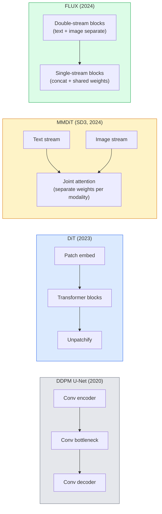

# Các biến đổi pha trộn và dòng chảy được sửa chữa

> U-Net không phải là bí mật của sự phát tán. Đổi nó thành Transformer, thay đổi lịch trình tiếng ồn thành dòng chảy đường thẳng, bạn đột nhiên có SD3 ̊ FLUX, cũng như mỗi mô hình văn bản-được hình ảnh năm 2026 ̊.

**类型：**Học tập + xây dựng
**语言：**Python
**前置要求：**Giai đoạn 4 Bài học 10 (DDPM phân tán), Giai đoạn 4 Bài học 14 (ViT), Giai đoạn 7 Bài học 02 (Tự chú ý)
**时间：**约75分钟

## Học mục tiêu

- 追踪 từ U-Net DDPM(Dạy 10) đến Diffusion Transformer (DiT) 、MMDiT (SD3), cũng như phát triển của single+double-stream DiT (FLUX)
- Giải thích dòng chảy sửa chữa: Tại sao tiếng ồn và dữ liệu  đường thẳng có thể làm cho mô hình sử dụng 20 bước thay vì 1000 bước hoàn thành采样
- Thực hiện một khối DiT nhỏ và một vòng đào tạo dòng chảy chỉnh, cả hai đều được kiểm soát trong vòng 100 行
- 按架构、参数数和许可 区分模型变体(SD3、FLUX.1-dev、FLUX.1-schnell、Z-Image、Qwen-Image)

## 问题

Bài học 10 Sử dụng U-Net denoiser  xây dựng một DDPM ⋅ phương pháp này chủ đạo 2020-2023: U-Net + lịch trình beta + mất dự đoán tiếng ồn ⋅ nó tạo ra Stable Diffusion 1.5、2.1 和 DALL-E 2。

Mỗi mô hình văn bản-được hình ảnh tiên tiến nhất năm 2026 đã vượt qua nó. Sản phẩm phân tán ổn định 3、FLUX、SD4、Z-Image、Qwen-Image、Hunyuan-Image không sử dụng U-Net. Chúng sử dụng Diffusion Transformers (DiT) ・SD3 和 FLUX cũng chuyển chương trình âm thanh DDPM thành dòng chảy được chỉnh sửa, điều này sẽ đưa từ âm thanh đến đường dẫn dữ liệu trực tiếp, và thông qua sự nhất quán hoặc biến thể chưng cất  hỗ trợ 1-4 bước suy luận.

Sự thay đổi này rất quan trọng, bởi vì nó đang là việc tạo hình ảnh dựa trên phân tán  trở nên dễ kiểm soát ập tức chính xác SD3/SD4  đã giải quyết văn bản 染) và đủ nhanh để đưa vào sản xuất .

## 核心概念

### Từ U-Net đến Transformer



- **DiT**(Peebles & Xie, 2023)  Sử dụng một biến thể tương tự như ViT  thay thế U-Net, trên các bản vá ẩn 上运行。 thông qua tiêu chuẩn lớp thích ứng (AdaLN)  tiến hành điều kiện。
- **MMDiT**(SD3, Esser et al., 2024) 为文字代币和图像代币 使用两个拥有独立权重的流,并共享一个共同关注――
- **FLUX**(Black Forest Labs, 2024) 前 N 个块 像 SD3 一样采用双流,后续块将代币连锁并共享重量(单流),以提高更深层结构的效率──
- **Z-Image**(2025)  một DiT đơn dòng hiệu quả cao của các tham số 6B, thách thức  bất cứ điều gì chi phí mở rộng quy mô  của tư tưởng.

### 用一段话解释 Chuyển chuyển được sửa đổi

DDPM sẽ tiến hành quy trình  định nghĩa là một SDE ồn ào, trong đó `x_t`Được phá hủy từng bước. Học đến ngược lại là SDE thứ hai, cần sử dụng 1000 bước nhỏ để tìm giải pháp.

Phòng chảy sửa đổi  định nghĩa giữa dữ liệu sạch và tiếng ồn sạch**直线**插值:

```
x_t = (1 - t) * x_0 + t * epsilon,     t in [0, 1]
```

训练一个网络来预测速度 `v_theta(x_t, t) = epsilon - x_0`也就是沿着从清洁数据到噪音的直线路径的前进方向(`dx_t/dt`()                                                                                                                                                                                                                                                              

SD3 sẽ được gọi là**Rectified Flow Matching** FLUX、Z-Image 和大多数 2026 年 model 使用相同的目标──典型推断:20-30 个 Euler steps(deterministic),相比旧 DDPM 体系中的 50+ DDIM steps──Distilled / turbo / schnell / LCM biến thể có thể hạ xuống 1-4 步──

### Điều kiện AdaLN

DT  thông qua **adaptive layer norm**Trong bước thời gian 和 lớp học/ văn bản 上做 điều kiện: từ điều kiện Vector 中预测 `scale`和 `shift`, và LayerNorm                                                                                                                                                                                                                                                                                                                                                                                                                                                                                                                        

```
cond -> MLP -> (scale, shift, gate)
norm(x) * (1 + scale) + shift, then residual add * gate
```

### Các mã hóa văn bản trong SD3 và FLUX

- **SD3**Sử dụng ba mã hóa văn bản: hai mô hình CLIP + T5-XXL。 Nhập vào được kết nối 后作为文本调节 送入图像流。
- **FLUX**Sử dụng một CLIP-L + T5-XXL
- **Qwen-Image / Z-Image**Các biến thể sử dụng LLM cơ bản của nó đối với các mã hóa văn bản tự phát triển.

Mã hóa văn bản là SD3/FLUX vì vậy hơn SD1.5 hơn có thể hiểu các yêu cầu.

### Các hướng dẫn không có phân loại  vẫn成立

Phong trào sửa đổi thay đổi là mẫu thay vì điều kiện. hướng dẫn không phân loại.

### Sự phù hợp, Turbo, Schnell, LCM

Từ: "đánh thành một mô hình từ một bước nhanh, mô hình từ một bước nhanh".

- **LCM (Latent Consistency Model)** đào tạo một học sinh, làm cho nó có thể từ bất kỳ trung gian `x_t`Một步预测 cuối cùng `x_0`
- **SDXL Turbo / FLUX schnell** sử dụng các mô hình phân tán đối kháng 训练 1-4 步的
- **SD Turbo**将 OpenAI-style Model Sự phù hợp 适配到隐藏传播──

任何新型号的生产服务通常都会同时发布一个完整质量检查点和一个turbo /快变化──Schnell((((((快,Black Forest Labs的命名惯例) 在 1-4 步内运行,并适应实时管道──

### Mô hình phong cảnh năm 2026

| Model | Size | Architecture | License |
|-------|------|--------------|---------|
| Stable Diffusion 3 Medium | 2B | MMDiT | SAI Community |
| Stable Diffusion 3.5 Large | 8B | MMDiT | SAI Community |
| FLUX.1-dev | 12B | Double + Single Stream DiT | non-commercial |
| FLUX.1-schnell | 12B | same, distilled | Apache 2.0 |
| FLUX.2 | — | iterated FLUX.1 | mixed |
| Z-Image | 6B | S3-DiT (Scalable Single-Stream) | permissive |
| Qwen-Image | ~20B | DiT + Qwen text tower | Apache 2.0 |
| Hunyuan-Image-3.0 | ~80B | DiT | research |
| SD4 Turbo | 3B | DiT + distillation | SAI Commercial |

FLUX.1-schnell là mô hình mã nguồn mở năm 2026 默认选择──Z-Image là nhà lãnh đạo hiệu quả──FLUX.2 和 SD4 là mô hình chất lượng đáng tin cậy nhất hiện tại──

### Tại sao sự chuyển đổi giai đoạn này là quan trọng

DDPM + U-Net 能工作──DiT + lưu lượng sửa chữa 工作得**更好、更快，并且扩展得更干净**Sự chuyển đổi này giống như NLP trong chuyển đổi từ RNN đến biến thể: hai kiến trúc  giải quyết cùng một vấn đề, nhưng biến thể còn có thể mở rộng, và hiện đang chiếm ưu thế.


```figure
cv3-rectified-flow
```

##  xây dựng nó

### 步骤 1:带 AdaLN của DiT khối

```python
import torch
import torch.nn as nn


class AdaLNZero(nn.Module):
    """
    Adaptive LayerNorm with a gate. Predicts (scale, shift, gate) from the conditioning.
    Init such that the whole block starts as identity ("zero init").
    """

    def __init__(self, dim, cond_dim):
        super().__init__()
        self.norm = nn.LayerNorm(dim, elementwise_affine=False)
        self.mlp = nn.Linear(cond_dim, dim * 3)
        nn.init.zeros_(self.mlp.weight)
        nn.init.zeros_(self.mlp.bias)

    def forward(self, x, cond):
        scale, shift, gate = self.mlp(cond).chunk(3, dim=-1)
        h = self.norm(x) * (1 + scale.unsqueeze(1)) + shift.unsqueeze(1)
        return h, gate.unsqueeze(1)


class DiTBlock(nn.Module):
    def __init__(self, dim=192, heads=3, mlp_ratio=4, cond_dim=192):
        super().__init__()
        self.adaln1 = AdaLNZero(dim, cond_dim)
        self.attn = nn.MultiheadAttention(dim, heads, batch_first=True)
        self.adaln2 = AdaLNZero(dim, cond_dim)
        self.mlp = nn.Sequential(
            nn.Linear(dim, dim * mlp_ratio),
            nn.GELU(),
            nn.Linear(dim * mlp_ratio, dim),
        )

    def forward(self, x, cond):
        h, gate1 = self.adaln1(x, cond)
        a, _ = self.attn(h, h, h, need_weights=False)
        x = x + gate1 * a
        h, gate2 = self.adaln2(x, cond)
        x = x + gate2 * self.mlp(h)
        return x
```

`AdaLNZero`Một bắt đầu là bản đồ danh tính, vì trọng lượng MLP của nó được khởi tạo thành 0.

### Bước 2: Một cái nhỏ

```python
def timestep_embedding(t, dim):
    import math
    half = dim // 2
    freqs = torch.exp(-math.log(10000) * torch.arange(half, device=t.device) / half)
    args = t[:, None].float() * freqs[None]
    return torch.cat([args.sin(), args.cos()], dim=-1)


class TinyDiT(nn.Module):
    def __init__(self, image_size=16, patch_size=2, in_channels=3, dim=96, depth=4, heads=3):
        super().__init__()
        self.patch_size = patch_size
        self.num_patches = (image_size // patch_size) ** 2
        self.patch = nn.Conv2d(in_channels, dim, kernel_size=patch_size, stride=patch_size)
        self.pos = nn.Parameter(torch.zeros(1, self.num_patches, dim))
        self.time_mlp = nn.Sequential(
            nn.Linear(dim, dim * 2),
            nn.SiLU(),
            nn.Linear(dim * 2, dim),
        )
        self.blocks = nn.ModuleList([DiTBlock(dim, heads, cond_dim=dim) for _ in range(depth)])
        self.norm_out = nn.LayerNorm(dim, elementwise_affine=False)
        self.head = nn.Linear(dim, patch_size * patch_size * in_channels)

    def forward(self, x, t):
        n = x.size(0)
        x = self.patch(x)
        x = x.flatten(2).transpose(1, 2) + self.pos
        t_emb = self.time_mlp(timestep_embedding(t, self.pos.size(-1)))
        for blk in self.blocks:
            x = blk(x, t_emb)
        x = self.norm_out(x)
        x = self.head(x)
        return self._unpatchify(x, n)

    def _unpatchify(self, x, n):
        p = self.patch_size
        h = w = int(self.num_patches ** 0.5)
        x = x.view(n, h, w, p, p, -1).permute(0, 5, 1, 3, 2, 4).reshape(n, -1, h * p, w * p)
        return x
```

### 步骤 3: Tập luyện dòng chảy được sửa chữa

```python
import torch.nn.functional as F

def rectified_flow_train_step(model, x0, optimizer, device):
    model.train()
    x0 = x0.to(device)
    n = x0.size(0)
    t = torch.rand(n, device=device)
    epsilon = torch.randn_like(x0)
    x_t = (1 - t[:, None, None, None]) * x0 + t[:, None, None, None] * epsilon

    target_velocity = epsilon - x0
    pred_velocity = model(x_t, t)

    loss = F.mse_loss(pred_velocity, target_velocity)
    optimizer.zero_grad()
    loss.backward()
    optimizer.step()
    return loss.item()
```

Với DDPM của âm thanh dự đoán mất ((Dạy 10)相比: cấu trúc giống nhau, mục tiêu khác nhau.`epsilon`,而是预测 **velocity** `epsilon - x_0`, nó đi theo hướng trực tiếp từ dữ liệu hướng đến tiếng ồn.

### 步骤 4:Euler mẫu

Phong trào sửa đổi là một ODE. Phương pháp của Euler là phương pháp đơn giản nhất, và đối với một mô hình lưu lượng sửa đổi tốt, trong 20+ bước 时几乎与高级解决器一样准确.

```python
@torch.no_grad()
def rectified_flow_sample(model, shape, steps=20, device="cpu"):
    model.eval()
    x = torch.randn(shape, device=device)
    dt = 1.0 / steps
    t = torch.ones(shape[0], device=device)
    for _ in range(steps):
        v = model(x, t)
        x = x - dt * v
        t = t - dt
    return x
```

20 bước. Trong một mô hình được đào tạo tốt, nó sẽ tạo ra có thể so sánh với 1000 bước DDPM mẫu.

### Bước 5: kiểm tra khói từ đầu đến cuối

```python
import numpy as np

def synthetic_blobs(num=200, size=16, seed=0):
    rng = np.random.default_rng(seed)
    out = np.zeros((num, 3, size, size), dtype=np.float32)
    yy, xx = np.meshgrid(np.arange(size), np.arange(size), indexing="ij")
    for i in range(num):
        cx, cy = rng.uniform(4, size - 4, size=2)
        r = rng.uniform(2, 4)
        mask = (xx - cx) ** 2 + (yy - cy) ** 2 < r ** 2
        colour = rng.uniform(-1, 1, size=3)
        for c in range(3):
            out[i, c][mask] = colour[c]
    return torch.from_numpy(out)
```

Sử dụng dòng chảy chỉnh sửa trong tập dữ liệu này tập luyện một `TinyDiT`❖ 500 bước ❖ sau đó, các kết quả lấy mẫu ❖ nên trông giống như những vết bẩn màu trắng ❖

## Sử dụng nó

对于使用 FLUX / SD3 / Z-Image 的真实图像生成,`diffusers`Đối với mỗi mô hình  cung cấp API thống nhất:

```python
from diffusers import FluxPipeline, StableDiffusion3Pipeline
import torch

pipe = FluxPipeline.from_pretrained(
    "black-forest-labs/FLUX.1-schnell",
    torch_dtype=torch.bfloat16,
).to("cuda")

out = pipe(
    prompt="a golden retriever surfing a tsunami, hyperrealistic, studio lighting",
    guidance_scale=0.0,           # schnell was trained without CFG
    num_inference_steps=4,
    max_sequence_length=256,
).images[0]
out.save("surf.png")
```

3 đường`FLUX.1-schnell`4 bước hoàn thành:`black-forest-labs/FLUX.1-dev`, có thể được nâng cao hơn trong 20-30 bước của CFG

 Đối với SD3:

```python
pipe = StableDiffusion3Pipeline.from_pretrained(
    "stabilityai/stable-diffusion-3.5-large",
    torch_dtype=torch.bfloat16,
).to("cuda")
out = pipe(prompt, guidance_scale=3.5, num_inference_steps=28).images[0]
```

## 交付 nó

本课会产出:

- `outputs/prompt-dit-model-picker.md`在给定质量、延迟和许可 约束时,在 SD3、FLUX.1-dev、FLUX.1-schnell、Z-Image、SD4 Turbo 之间做选择──
- `outputs/skill-rectified-flow-trainer.md` biên tập một vòng đào tạo dòng chảy chỉnh sửa hoàn chỉnh, bao gồm lấy mẫu AdaLN DiT và Euler

## 练习

1. **（简单）**Trong tập dữ liệu blob tổng hợp trên bài tập trên TinyDiT 500 bước。 So sánh sử dụng 10、20 和 50 bước của Euler  tạo ra các mẫu。
2. **（中等）**通过把一个学会的类嵌入拼接到时间嵌入上,加入文本调节(按颜色划分的10个斑块 类) ⋅分别用类0、5 和 9 采样,并验证颜色匹配──
3. **（困难）**计算在同样大小的网络、同样数据、同样训练步数下,Corrected-flow与DDPM 版本生成样品 之间的 Fréchet distance(FID proxy) ⋅报告哪一个收更快──

## 关键术语

| Term | 人们常说 | 实际含义 |
|------|----------------|----------------------|
| DiT | “Diffusion transformer” | 替代 U-Net 作为 diffusion denoiser 的 Transformer；在 patchified latents 上运行 |
| AdaLN | “Adaptive layer norm” | 通过学习到的 scale、shift、gate 进行 timestep/text conditioning，并在 LayerNorm 之后应用；每个现代 DiT 的标准做法 |
| MMDiT | “Multi-modal DiT (SD3)” | 为 text tokens 和 image tokens 使用独立 weight streams，并共享一个 joint self-attention |
| Single-stream / double-stream | “FLUX trick” | 前 N 个 blocks 为 double-stream（每种 modality 使用独立 weights），后续 blocks 为 single-stream（concat + shared weights），以提升效率 |
| Rectified flow | “Straight-line noise-to-data” | data 与 noise 之间的线性插值；网络预测 velocity；inference 所需 ODE steps 更少 |
| Velocity target | “epsilon - x_0” | rectified flow 中的 Regression target；从 clean data 指向 noise |
| CFG guidance | “classifier-free guidance” | 混合 conditional 与 unconditional predictions；rectified-flow models 中仍然使用 |
| Schnell / turbo / LCM | “1-4 step distillation” | 从 full-quality models distill 得到的小步数 variants；用于生产实时场景 |

## 延伸阅读

- [Scalable Diffusion Models with Transformers (Peebles & Xie, 2023)](https://arxiv.org/abs/2212.09748)DiT 论文
- [Scaling Rectified Flow Transformers (Esser et al., SD3 paper)](https://arxiv.org/abs/2403.03206) MMDiT và dòng chảy chỉnh
- [FLUX.1 model card and technical report (Black Forest Labs)](https://huggingface.co/black-forest-labs/FLUX.1-dev)tần đôi + dòng đơn 细节
- [Z-Image: Efficient Image Generation Foundation Model (2025)](https://arxiv.org/html/2511.22699v1)6B DiT dòng đơn
- [Elucidating the Design Space of Diffusion (Karras et al., 2022)](https://arxiv.org/abs/2206.00364) Mỗi sự phân tán  thiết kế trade-off
- [Latent Consistency Models (Luo et al., 2023)](https://arxiv.org/abs/2310.04378)LCM-LoRA  làm thế nào để thực hiện kết luận 4 bước
