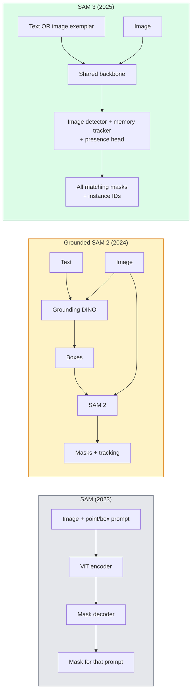

# SAM 3 và phân đoạn từ vựng mở

> 给模型一个文本提示和一张图像,即可获得每个匹配对象的面具──SAM 3 让它变成一个单独的前进通行──

**类型：**使用 + 构建
**语言：**Python
**先修要求：**Giai đoạn 4 Bài học 07 (U-Net), Giai đoạn 4 Bài học 08 (Mask R-CNN), Giai đoạn 4 Bài học 18 (CLIP)
**时间：**~ 60 phút

## Học mục tiêu

- 区分 SAM( chỉ hiển thị) 、Grounded SAM / SAM 2(detector + SAM) và SAM 3(thông qua Promptable Concept Segmentation 原生支持文本提示)
- 解释 SAM 3 架构: shared backbone + image detector + memory based video tracker + presence head + decoupled detector-tracker design
- Sử dụng khuôn mặt ôm `transformers`SAM 3 tập hợp để thực hiện phát hiện văn bản-phục vụ, phân đoạn và theo dõi video
- 根据延迟,概念复杂性和部署目标,在 SAM 3 Grounded SAM 2 YOLO-World 和 SAM-MI 之间做做选择

## 问题

SAM năm 2023 là một mô hình chỉ hỗ trợ các lệnh trực quan: bạn nhấp vào một điểm hoặc vẽ một khung, nó trở lại một mặt nạ. Đối với việc tìm ra tất cả mọi thứ trong bức ảnh này, bạn cần một bộ dò (Grounding DINO) để làm hộp, sau đó sử dụng SAM cho mỗi hộp để phân đoạn.

SAM 3(Meta,2025 年 11 月,ICLR 2026) đã nén lại lớp này. Nó chấp nhận một short名词短语或一个图像示范 作为提示, và một lần đi về phía trước, nó quay lại tất cả các mặt nạ phù hợp và ID ví dụ.**Promptable Concept Segmentation (PCS)**△结合 2026 年 3 月的 Object Multiplex 更新(SAM 3.1), nó có thể高效地 theo dõi nhiều trường hợp của cùng một khái niệm trong video。

Bài học này tập trung vào sự thay đổi cấu trúc mà nó đại diện cho. 2D segmentation, detection, text-image grounding đã được kết hợp với một mô hình.

## 概念

### 三代模型



### 可 Prompt của khái niệm phân đoạn

concept prompt 是一个简短的名词短语(`"yellow school bus"``"striped red umbrella"``"hand holding a mug"`(đặc là một ví dụ hình ảnh, mô hình sẽ trả lại ID ví dụ duy nhất cho mỗi phần kết hợp.

Đây là một cái gì đó khác với SAM trực quan cổ điển.

1. Không cần từng ví dụ 提供 prompt: một lời nhắn văn bản  trả lại tất cả các kết hợp.
2. Từ khóa mở: khái niệm có thể là bất cứ nội dung nào có thể sử dụng ngôn ngữ tự nhiên để mô tả.
3. Một lần quay lại nhiều trường hợp, thay vì mỗi lần nhắc lại một mặt nạ.

### 关键架构组件

- **Shared backbone**Một ViT  xử lý hình ảnh, đầu cảm biến và bộ nhớ theo dõi đều từ trung tâm đọc thông tin.
- **Presence head**: dự đoán khái niệm liệu có tồn tại trong hình ảnh không?将在这里有没有?和它在哪里?解──减少概念 不存在时的虚假积极──
- **Decoupled detector-tracker**:phát hiện hình ảnh và theo dõi video sử dụng đầu độc lập, tránh lẫn nhau
- **Memory bank**:跨框架 存储 từng phiên bản các tính năng, được sử dụng để theo dõi video((((((((((((((((((((((((((((((((((((((((((((((((((((((((((((((((((((((((((((((((((((((((((((((((((((((((((((((((((((((((((((((((((((((((((((((((((((((((((((((((((((((((((((((((((((((((((((((((((((((((((((((((((((((((((((((((((((((((((((((((((((((((((((((((((((((((((((((((((((((((((((((((((((((((((((((((((((((((((((((((((((((((((((((((((((((((((((((((((((((((((((((((((((((((((((((((((((((((((((((((((((((((((((((((((((((((((((((((((((((((((((((((((((((((((((((((((((((((((((((((((((((((((

### Tập luyện lớn

SAM 3 trong **400 万个 unique concepts**上训练, những khái niệm này được phát triển bởi một công cụ dữ liệu, công cụ đó thông qua AI + nhân tạo kiểm tra 代标注并修改.**SA-CO benchmark**chứa 270K khái niệm độc đáo, so với các tiêu chuẩn trước đây lớn 50 lần. SAM 3 đạt 75-80% của biểu hiện của con người trên SA-CO, và hình ảnh + video PCS trên nâng cao biểu hiện của các hệ thống hiện có lên hai lần.

### SAM 3.1 Object Multiplex

2026 年 3 月更新:**Object Multiplex**引入一种共享记忆机制, được sử dụng đồng thời cùng theo dõi nhiều trường hợp của cùng một khái niệm. 此前, theo dõi N 个 trường hợp có nghĩa là cần N 个独立记忆库. Multiplex sẽ nén thành một bộ nhớ chung,并 sử dụng các truy vấn mỗi trường hợp. Kết quả là không hy sinh sự chính xác, tăng tốc đáng kể theo dõi đa đối tượng.

### 2026 năm SAM đất đai vẫn là một hiện trường quan trọng

- Khi bạn cần thay thế một bộ phát hiện từ ngữ mở cụ thể
- Khi SAM 3 giấy phép (HF 上门) trở thành trở ngại
- Khi bạn cần kiểm soát ngưỡng phát hiện hơn SAM 3 ở các tham số
- Sử dụng cho nghiên cứu / việc trừu tượng của bộ phận cảm biến.

Các đường ống mô-đun vẫn có giá trị. Đối với hầu hết các công việc sản xuất, SAM 3 là câu trả lời đơn giản hơn.

### YOLO-World vs SAM 3

- **YOLO-World**: Chỉ có máy phát hiện từ vựng mở không có mặt nạ (không có mặt nạ) ―― Thời gian thực――当你需要高fps box 时最合适――
- **SAM 3**: toàn bộ phân đoạn + theo dõi.

生产场景划分:YOLO-World 适合快速检测-only pipelines(robotics navigation、fast dashboards),SAM 3 适合任何需要面具或跟踪的场景──

### SAM-MI 效率

SAM-MI(2025-2026) giải quyết nút thắt của máy giải mã SAM──关键思想:

- **Sparse point prompting**: sử dụng ít lượng điểm chọn, thay vì các lời nhắc dày đặc; sẽ gọi decoder giảm 96%。
- **Shallow mask aggregation**:将粗略面具预测 合并成一个更清晰的面具──
- **Decoupled mask injection**:decoder 接收预计算的面具功能, thay vì tái运行──

Kết quả: Trong các tiêu chuẩn từ vựng mở trên so với Grounded-SAM có khoảng 1,6x tốc độ.

### 3 mô hình mô hình xuất khẩu

Chúng đều trở lại cùng một cấu trúc chung (trám + nhãn + điểm số + mặt nạ + ID), điều này rất hữu ích: đường ống của bạn không cần phải dựa trên mô hình nào đang hoạt động để phân chia.


```figure
cv3-open-vocab
```

## 构建

### 步骤 1:Tạo lập tức

构建一个辅助,将用户句转换为 SAM 3 concept prompt 列表──这是用户输入的内容和模型消费的内容之间的边界──

```python
def split_concepts(sentence):
    """
    Heuristic splitter for multi-concept prompts.
    Returns list of short noun phrases.
    """
    for sep in [",", ";", "and", "or", "&"]:
        if sep in sentence:
            parts = [p.strip() for p in sentence.replace("and ", ",").split(",")]
            return [p for p in parts if p]
    return [sentence.strip()]

print(split_concepts("cats, dogs and balloons"))
```

SAM 3 Mỗi lần chuyển tiếp  chấp nhận một khái niệm; đối với các truy vấn đa khái niệm, vòng hoặc xử lý chúng trong loạt.

### 步骤 2: Các trợ lý xử lý sau

Để chuyển đổi các sản phẩm thô của SAM 3 thành danh sách phát hiện sạch, để phù hợp với hợp đồng đường ống của giai đoạn 4 Bài học 16.

```python
from dataclasses import dataclass
from typing import List

@dataclass
class ConceptDetection:
    concept: str
    instance_id: int
    box: tuple          # (x1, y1, x2, y2)
    score: float
    mask_rle: str       # run-length encoded


def rle_encode(binary_mask):
    flat = binary_mask.flatten().astype("uint8")
    runs = []
    prev, count = flat[0], 0
    for v in flat:
        if v == prev:
            count += 1
        else:
            runs.append((int(prev), count))
            prev, count = v, 1
    runs.append((int(prev), count))
    return ";".join(f"{v}x{c}" for v, c in runs)
```

Ngay cả khi có nhiều mặt nạ độ phân giải cao, RLE cũng có thể giúp đáp ứng tải trọng 保持较小.

### 步骤 3:统一的 mở từ ngữ phân đoạn giao diện

Để bạn có bất kỳ backend nào ((SAM 3 √Grounded SAM 2 √YOLO-World + SAM 2) √封装在一个统一方法之后──当后端 改变时,下游代码不需要改变──

```python
from abc import ABC, abstractmethod
import numpy as np

class OpenVocabSeg(ABC):
    @abstractmethod
    def detect(self, image: np.ndarray, concept: str) -> List[ConceptDetection]:
        ...


class StubOpenVocabSeg(OpenVocabSeg):
    """
    Deterministic stub used for pipeline testing when real models are not loaded.
    """
    def detect(self, image, concept):
        h, w = image.shape[:2]
        return [
            ConceptDetection(
                concept=concept,
                instance_id=0,
                box=(w * 0.2, h * 0.3, w * 0.5, h * 0.8),
                score=0.89,
                mask_rle="0x100;1x50;0x200",
            ),
            ConceptDetection(
                concept=concept,
                instance_id=1,
                box=(w * 0.55, h * 0.25, w * 0.85, h * 0.75),
                score=0.74,
                mask_rle="0x80;1x40;0x220",
            ),
        ]
```

Thực sự `SAM3OpenVocabSeg`phân loại 会封装 `transformers.Sam3Model`和 `Sam3Processor`

### 步骤 4: Nhấp mặt SAM 3 用法(参考)

 thực tế模型 của `transformers`集成:

```python
from transformers import Sam3Processor, Sam3Model
import torch

processor = Sam3Processor.from_pretrained("facebook/sam3")
model = Sam3Model.from_pretrained("facebook/sam3").eval()

inputs = processor(images=pil_image, return_tensors="pt")
inputs = processor.set_text_prompt(inputs, "yellow school bus")

with torch.no_grad():
    outputs = model(**inputs)

masks = processor.post_process_masks(
    outputs.masks, inputs.original_sizes, inputs.reshaped_input_sizes
)
boxes = outputs.boxes
scores = outputs.scores
```

Một lời nhắc, một lần调用 quay lại tất cả các ứng dụng.

### Bước 5: đo lường SAM 2  miễn phí cung cấp gì

Một điểm chuẩn trung thực: Trong đường ống thực tế trong SAM 3 thay thế SAM 2 sẽ xảy ra gì?

- Trễ:SAM 3 省掉一次前传 (không có bộ dò độc lập), nhưng mô hình tự nó nặng hơn; thường总体持平或略有速度up。
- Độ chính xác:SAM 3 trong các khái niệm hiếm hoặc cấu trúc như`"striped red umbrella"`(văn) trên rõ ràng tốt hơn.
- Độ linh hoạt: SAM 2 được đặt trên mặt đất 允许您替换探测器 ((DINO-X、Florence-2、DINO 1.5); SAM 3 là đơn vị.

Kết luận:SAM 3 là lựa chọn mặc định của bộ phận ngôn ngữ mở năm 2026  Khi bạn cần linh hoạt máy dò hoặc các điều khoản giấy phép khác nhau 时,Grounded SAM 2 仍然是正确答案──

## 使用

生产部署模式:

- **Real-time annotation**:SAM 3 + CVAT của nhãn-as-text-prompt tính năng。标注员选择一个标签名称;SAM 3 预标注每个匹配的例──再进行审核和修订──
- **Video analytics**:SAM 3.1 Object Multiplex dùng để theo dõi nhiều đối tượng;将 frame 输入 bộ nhớ dựa theo tracker。
- **Robotics**:SAM 3 dùng để thao tác từ ngữ mở ((tôi lên cái cốc đỏ); như kế hoạch sơ bộ 运行。
- **Medical imaging**Trong các khái niệm y tế 上 tinh chỉnh SAM 3; cần phải có quyền truy cập trên HF

Ultralytics trong gói Python của nó trong gói SAM 3:

```python
from ultralytics import SAM

model = SAM("sam3.pt")
results = model(image_path, prompts="yellow school bus")
```

Với YOLO 和 SAM 2 sử dụng tương tự giao diện.

## 交付

本课会产出:

- `outputs/prompt-open-vocab-stack-picker.md`Một dựa trên độ trễ, khái niệm phức tạp và cấp phép  chọn SAM 3 / SAM 2 / YOLO-World / SAM-MI của prompt。
- `outputs/skill-concept-prompt-designer.md`Một người dùng sẽ dùng các mô hình của SAM 3 tốt hơn để tạo ra các mô hình khác nhau.

## 练习

1. **（Easy）**Trong 10 张 hình ảnh 上运行 SAM 3,并使用你自己选择的概念提示──与同一批图片 上的 SAM 2 + Grounding DINO 1.5 对比──报告每个模型错过了哪些概念──
2. **（Medium）**Trong SAM 3 之之上构建一个 点击-to-include / click-to-exclude UI:text prompt 返回候选实例; user点击保留哪些算作 positive──将最终概念集合 输出为 JSON──
3. **（Hard）**Trong bộ tự định nghĩa khái niệm (ví dụ: 5 bộ phận điện tử) trên các bộ máy SAM 3 được chỉnh sửa tốt, mỗi bộ máy có 20 张 hình ảnh được dán nhãn.

## 关键术语

| Term | 人们通常怎么说 | 实际含义 |
|------|----------------|----------------------|
| Open-vocabulary segmentation | “Segment by text” | 为自然语言描述的 objects 生成 masks，而不是使用固定 label set |
| PCS | “Promptable Concept Segmentation” | SAM 3 的核心任务：给定一个 noun-phrase 或 image exemplar，segment 所有匹配 instances |
| Concept prompt | “The text input” | 简短名词短语或 image exemplar；不是完整句子 |
| Presence head | “Is it here?” | SAM 3 中的模块，用于在 localisation 之前判断 concept 是否存在于 image 中 |
| SA-CO | “SAM 3 benchmark” | 包含 270K concepts 的 open-vocabulary segmentation benchmark；比以往 open-vocab benchmarks 大 50 倍 |
| Object Multiplex | “SAM 3.1 update” | Shared-memory multi-object tracking；快速联合跟踪多个 instances |
| Grounded SAM 2 | “Modular pipeline” | Detector + SAM 2 级联；当 detector 替换很重要时仍然相关 |
| SAM-MI | “Efficient SAM variant” | Mask Injection，相比 Grounded-SAM 实现 1.6x speedup |

## 延伸阅读

- [SAM 3: Segment Anything with Concepts (arXiv 2511.16719)](https://arxiv.org/abs/2511.16719)
- [SAM 3.1 Object Multiplex (Meta AI, March 2026)](https://ai.meta.com/blog/segment-anything-model-3/)
- [SAM 3 model page on Hugging Face](https://huggingface.co/facebook/sam3)
- [Grounded SAM 2 tutorial (PyImageSearch)](https://pyimagesearch.com/2026/01/19/grounded-sam-2-from-open-set-detection-to-segmentation-and-tracking/)
- [Ultralytics SAM 3 docs](https://docs.ultralytics.com/models/sam-3/)
- [SAM3-I: Instruction-aware SAM (arXiv 2512.04585)](https://arxiv.org/abs/2512.04585)
