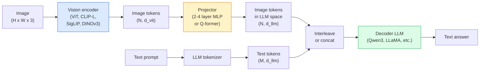

# Mô hình ngôn ngữ thị giác  ViT-MLP-LLM 模式

> Vision encoder sẽ chuyển hình ảnh thành token. MLP projector sẽ chiếu các token này vào không gian nhúng của LLM.

**类型：**学习 + 使用
**语言：**Python
**前置要求：**Giai đoạn 4 Bài học 14 (ViT), Giai đoạn 4 Bài học 18 (CLIP), Giai đoạn 7 Bài học 02 (Tự chú ý)
**时间：**~ 75 phút

## Học mục tiêu

- Nói rõ ViT-MLP-LLM 架构,并解释三个组件各自贡献什么
- Từ các parameter, chiều dài ngữ cảnh và hiệu suất chuẩn  góc độ so sánh Qwen3-VL,InternVL3.5 LLaVA-Next và GLM-4.6V
-  Giải thích DeepStack: Tại sao nhiều tính năng ViT cấp độ hơn một tính năng cấp độ cuối cùng hơn là khả năng sắp xếp ngôn ngữ thị giác chặt chẽ hơn
- Trong môi trường sản xuất sử dụng tỷ lệ lỗi đa phương thức (CMER) để đo lường ảo giác VLM, và dựa trên tín hiệu này để hành động

## 问题

CLIP (Phase 4 Bài học 18) vì hình ảnh và văn bản cung cấp không gian nhúng chung, điều này đủ để hỗ trợ phân loại và lấy lại không ảnh. Nó không thể trả lời  张图里有多少车红车? Vì CLIP không tạo văn bản, nó chỉ cho sự tương đồng.

Các mô hình ngôn ngữ tầm nhìn (VLMs)  Qwen3-VL、InternVL3.5、LLaVA-Next、GLM-4.6V  sẽ sử dụng mã hóa hình ảnh CLIP-chủ thể để đạt được mô hình ngôn ngữ hoàn chỉnh 上。模型看一张图像加一个问题,然后生成答案── đến năm 2026, các mô hình VLM nguồn mở trong các tiêu chuẩn đa phương thức (MMMU, MMBench, DocVQA, ChartQA, MathVista, OSWorld) trên đã có thể vượt qua thậm chí còn hơn GPT-5 和 Gemini-2.5-Pro──

Đây là một trong những cấu trúc tiêu chuẩn của mô hình. Sự khác biệt giữa mô hình là sử dụng mô hình ViT, mô hình chiếu, mô hình đào tạo và công thức sắp xếp. Một khi hiểu được mô hình này, thay thế bất kỳ bộ phận nào là một công việc cơ khí.

## 概念

### ViT-MLP-LLM 架构



1. **Vision encoder** 预训练 ViT(CLIP-L/14、SigLIP、DINOv3, hoặc biến thể được điều chỉnh tốt)
2. **Projector**Một mô hình nhỏ (~2 层 MLP, hoặc Q-former), sẽ hiển thị các mã thông báo thị giác vào chiều sâu nhúng của LLM.
3. **LLM** mô hình ngôn ngữ chỉ dùng giải mã (Qwen3、Llama、Mistral、GLM、InternLM) ――按序读取视觉 + text tokens,并生成文本。

Trong thực tế, vision encoder và LLM, hầu hết giữ được đóng băng, chỉ có bộ chiếu tập, do đó có thể chịu đựng được các tín hiệu tỷ số quy mô với chi phí thấp.

### DeepStack

Dự án thông thường chỉ sử dụng lớp ViT cuối cùng. DeepStack (Qwen3-VL) sẽ được sử dụng từ nhiều tính năng lấy sâu ViT và xếp chúng lên.

### 三个训练阶段

现代 VLMs 分阶段训练:

1. **Alignment** đóng băng ViT 和 LLM── chỉ trong cặp hình ảnh-chủ đề 上训练投影仪──教会投影仪 将视觉空间映射到语言空间──
2. **Pre-training** 解所有部分──大规模交错图像文本数据(500M+ cặp) 上训练──构建模型的视觉知识──
3. **Instruction tuning** 在精选的(图像,问题,答案) 三元组上细调──教会对话行为 和任务格式──这一步把视觉意识的LM变成可用助手──

Phần lớn LoRA sẽ sử dụng bộ dữ liệu nhỏ để đánh dấu đối với giai đoạn 3.

### 模型家族比较(2026 年初)

| Model | Params | Vision encoder | LLM | Context | Strengths |
|-------|--------|----------------|-----|---------|-----------|
| Qwen3-VL-235B-A22B (MoE) | 235B (22B active) | custom ViT + DeepStack | Qwen3 | 256K | 综合 SOTA，GUI agent |
| Qwen3-VL-30B-A3B (MoE) | 30B (3B active) | custom ViT + DeepStack | Qwen3 | 256K | 更小的 MoE 替代方案 |
| Qwen3-VL-8B (dense) | 8B | custom ViT | Qwen3 | 128K | 生产环境 dense 默认选择 |
| InternVL3.5-38B | 38B | InternViT-6B | Qwen3 + GPT-OSS | 128K | MMBench / MMVet 表现强 |
| InternVL3.5-241B-A28B | 241B (28B active) | InternViT-6B | Qwen3 | 128K | 可与 GPT-4o 竞争 |
| LLaVA-Next 72B | 72B | SigLIP | Llama-3 | 32K | 开放，易于 fine-tune |
| GLM-4.6V | ~70B | custom | GLM | 64K | Open-source，OCR 强 |
| MiniCPM-V-2.6 | 8B | SigLIP | MiniCPM | 32K | 适合边缘部署 |

### Các tác nhân hình ảnh

Qwen3-VL-235B trên OSWorld đạt được hiệu suất hàng đầu toàn cầu, OSWorld đang hướng tới**visual agents**Các mô hình xem ảnh màn hình, hiểu UI,并输出 hành động click type 滚)  结合工具 后, nó có thể đóng kết hoàn thành các nhiệm vụ bàn thường xuyên 

### Agentic 能力 + RoPE 变体

VLMs cần biết một cái gì đó trong video đang xảy ra**什么时候**△Qwen3-VL từ T-RoPE (T-RoPE)**基于文本的时间 alignment**,也就是将显式时刻标语文代码与视频框架交错――模型看`<timestamp 00:32>`Quá trình, nhanh chóng, có thể đưa ra quan hệ thời gian.

### Sự sắp xếp 问题

12% các cặp hình ảnh-tXT trong tập dữ liệu 爬取包含并未完全由图像支的描述── dùng các mô hình này để tạo ra ảo giác, đó là tạo vật, đọc sai số, tạo ra ảo giác.

Skywork.ai  đã giới thiệu **Cross-Modal Error Rate (CMER)**Để theo dõi nó:

```
CMER = fraction of outputs where the text confidence is high but the image-text similarity (via a CLIP-family checker) is low
```

CMER cao có nghĩa là mô hình đang tự tin nói rằng không có nội dung được hình ảnh hỗ trợ. Giám sát CMER, và coi nó như KPI sản xuất, trong triển khai của họ sẽ giảm tỷ lệ ảo giác khoảng 35%.

### Sử dụng LoRA / QLoRA  thực hiện điều chỉnh tinh tế

Đối với 70B VLM thực hiện điều chỉnh hoàn chỉnh  vượt ra ngoài phạm vi khả năng của hầu hết đội hình.$100-$5,000  tính toán chi phí, 2-10 小时训练时间──

### Lý luận không gian vẫn yếu

当前 VLMs trong các điểm chuẩn lý luận không gian ((nâng-nằm, trái-người, đếm, khoảng cách) trên điểm số là 50-60%。 Nếu trường hợp sử dụng của bạn phụ thuộc vào vật thể nào ở trên vật thể khác, cần nhiều chứng minh, hiệu suất VLM chung  thấp hơn con người。 Đối với nhiệm vụ không gian thuần túy, thay thế tốt hơn VLM bao gồm: điểm khóa chuyên dụng / ước tính tư thế、 mô hình độ sâu, hoặc mô hình phát hiện 加 hình học hộp 后处理。


```figure
v4-vlm-projector
```

##  xây dựng nó

### 步骤 1: Động cơ

Đây là phần tập luyện thường xuyên nhất của bạn.

```python
import torch
import torch.nn as nn


class Projector(nn.Module):
    def __init__(self, vit_dim=768, llm_dim=4096, hidden=4096):
        super().__init__()
        self.net = nn.Sequential(
            nn.Linear(vit_dim, hidden),
            nn.GELU(),
            nn.Linear(hidden, llm_dim),
        )

    def forward(self, x):
        return self.net(x)
```

输入 là một `(N_patches, d_vit)`Tăng suất biểu tượng.`(N_patches, d_llm)`LLM sẽ đưa mỗi dòng xuất đều như một token khác

### 步骤 2: 端到端组装 ViT-MLP-LLM

Dưới đây là VLM tối thiểu của chuyển tiếp phía trước 骨架──真实代码会使用 `transformers`; đây là biểu hiện của khái niệm

```python
class MinimalVLM(nn.Module):
    def __init__(self, vit, projector, llm, image_token_id):
        super().__init__()
        self.vit = vit
        self.projector = projector
        self.llm = llm
        self.image_token_id = image_token_id  # placeholder token in text prompt

    def forward(self, image, input_ids, attention_mask):
        # 1. vision features
        vision_tokens = self.vit(image)                     # (B, N_patches, d_vit)
        vision_embeds = self.projector(vision_tokens)       # (B, N_patches, d_llm)

        # 2. text embeddings
        text_embeds = self.llm.get_input_embeddings()(input_ids)  # (B, M, d_llm)

        # 3. replace image placeholder tokens with vision embeds
        merged = self._merge(text_embeds, vision_embeds, input_ids)

        # 4. run LLM
        return self.llm(inputs_embeds=merged, attention_mask=attention_mask)

    def _merge(self, text_embeds, vision_embeds, input_ids):
        out = text_embeds.clone()
        expected = vision_embeds.size(1)
        for b in range(input_ids.size(0)):
            positions = (input_ids[b] == self.image_token_id).nonzero(as_tuple=True)[0]
            if len(positions) != expected:
                raise ValueError(
                    f"batch item {b} has {len(positions)} image tokens but vision_embeds has {expected} patches."
                    " Every sample in the batch must be pre-padded to the same number of image placeholder tokens.")
            out[b, positions] = vision_embeds[b]
        return out
```

文本中 `<image>`Các mã thông báo giữ vị trí sẽ được thay thế thành hình ảnh thực sự, LLaVA、Qwen-VL 和 InternVL sử dụng đều giống nhau.

### 步骤 3: CMER 计算

Một số lượng nhẹ vận hành

```python
import torch.nn.functional as F


def cross_modal_error_rate(image_emb, text_emb, text_confidence, sim_threshold=0.25, conf_threshold=0.8):
    """
    image_emb, text_emb: embeddings of image and generated text (normalised internally)
    text_confidence:     mean per-token probability in [0, 1]
    Returns:             fraction of high-confidence outputs with low image-text alignment
    """
    image_emb = F.normalize(image_emb, dim=-1)
    text_emb = F.normalize(text_emb, dim=-1)
    sim = (image_emb * text_emb).sum(dim=-1)        # cosine similarity
    high_conf_low_sim = (text_confidence > conf_threshold) & (sim < sim_threshold)
    return high_conf_low_sim.float().mean().item()
```

Để sử dụng CMER như KPI sản xuất. Theo các điểm cuối.

### 步骤 4: Định dạng VLM đồ chơi (VLM)

演示投影机 是可以训练的──伪造的ViT features输入; một token kiểu LLM nhỏ 预测类别──

```python
class ToyVLM(nn.Module):
    def __init__(self, vit_dim=32, llm_dim=64, num_classes=5):
        super().__init__()
        self.projector = Projector(vit_dim, llm_dim, hidden=64)
        self.head = nn.Linear(llm_dim, num_classes)

    def forward(self, vision_tokens):
        projected = self.projector(vision_tokens)
        pooled = projected.mean(dim=1)
        return self.head(pooled)
```

Bạn có thể sử dụng trên không đến 200 bước để phù hợp với nó, điều này đủ để chỉ ra mô hình máy chiếu là hiệu quả.

## Sử dụng nó

Năm 2026 sản xuất đội sử dụng VLMs

- **Hosted API** OpenAI Vision、Anthropic Claude Vision、Google Gemini Vision──零 cơ sở hạ tầng, có nguy cơ của nhà cung cấp──
- **Open-source self-host** 通过 `transformers`和 `vllm`Sử dụng Qwen3-VL hoặc InternVL3.5── hoàn toàn kiểm soát,前期投入更高──
- **在领域数据上 fine-tune** 加载 Qwen2.5-VL-7B hoặc LLaVA-1.6-7B, trong 5k-50k tự xác định mô hình trên làm LoRA, dùng `vllm`Hoặc`TGI`服務──

```python
from transformers import AutoProcessor, AutoModelForVision2Seq
import torch
from PIL import Image

model_id = "Qwen/Qwen3-VL-8B-Instruct"
processor = AutoProcessor.from_pretrained(model_id)
model = AutoModelForVision2Seq.from_pretrained(model_id, torch_dtype=torch.bfloat16, device_map="auto")

messages = [{
    "role": "user",
    "content": [
        {"type": "image", "image": Image.open("plot.png")},
        {"type": "text", "text": "What does this chart show?"},
    ],
}]
inputs = processor.apply_chat_template(messages, add_generation_prompt=True, tokenize=True, return_dict=True, return_tensors="pt").to("cuda")
generated = model.generate(**inputs, max_new_tokens=256)
answer = processor.decode(generated[0][inputs["input_ids"].shape[1]:], skip_special_tokens=True)
```

`apply_chat_template`                                                                                                                                                                                                                                                              `<image>`Đánh dấu vị trí;模型会在内部处理 merge──

## 交付 nó

本课会产出:

- `outputs/prompt-vlm-selector.md` Trong trường hợp xác định độ chính xác, độ trễ, chiều dài ngữ cảnh và ngân sách, chọn Qwen3-VL / InternVL3.5 / LLaVA-Next / API。
- `outputs/skill-cmer-monitor.md` 生成代码, sử dụng tỷ lệ lỗi đa phương thức cho sản xuất điểm cuối VLM cấp độ cộng với các bảng điều khiển của các thiết bị ∞ theo điểm cuối, cũng như ngưỡng cảnh báo ∞

## 练习

1. **（简单）**Trong 5张图像上, sử dụng bất kỳ mở VLM 跑三个提示(what is this?、count the objects、describe the scene)
2. **（中等）**Trong lĩnh vực mục tiêu 500 张带 tiêu đề 图像上, sử dụng LoRA(ranking 16) tinh chỉnh Qwen2.5-VL-3B hoặc LLaVA-1.6-7B── so sánh độ chính xác kiểu MMBench không bắn và tinh chỉnh──
3. **（困难）**Để sử dụng mã hóa hình ảnh của VLM từ định dạng SigLIP/CLIP  thay thế cho DINOv3── chỉ tái tập luyện máy chiếu (结LLM +结DINOv3)── đo các nhiệm vụ dự đoán mật độ (计量, định nghĩa không gian)

## 关键术语

| Term | 人们常说 | 实际含义 |
|------|----------------|----------------------|
| ViT-MLP-LLM | “VLM pattern” | Vision encoder + projector + language model；每个 2026 年 VLM 都如此 |
| Projector | “桥梁” | 2-4 层 MLP（或 Q-former），将 vision tokens 映射到 LLM embedding space |
| DeepStack | “Qwen3-VL feature trick” | stack 多层级 ViT features，而不是只使用最后一层 |
| Image token | “<image> placeholder” | text stream 中的 special token，会被 projected vision embeddings 替换 |
| CMER | “Hallucination KPI” | Cross-Modal Error Rate；当 text confidence 高但 image-text similarity 低时，该值较高 |
| Visual agent | “会点击的 VLM” | 通过 tool calls 操作 GUI（OSWorld、mobile、web）的 VLM |
| Q-former | “固定数量的 token bridge” | BLIP-2 风格的 projector，产出固定数量的 visual query tokens |
| Alignment / pre-training / instruction tuning | “三个阶段” | 标准 VLM 训练 pipeline |

## 延伸阅读

- [Qwen3-VL Technical Report (arXiv 2511.21631)](https://arxiv.org/abs/2511.21631)
- [InternVL3.5 Advancing Open-Source Multimodal Models (arXiv 2508.18265)](https://arxiv.org/html/2508.18265v1)
- [LLaVA-Next series](https://llava-vl.github.io/blog/2024-05-10-llava-next-stronger-llms/)
- [BentoML: Best Open-Source VLMs 2026](https://www.bentoml.com/blog/multimodal-ai-a-guide-to-open-source-vision-language-models)
- [MMMU: Multi-discipline Multimodal Understanding benchmark](https://mmmu-benchmark.github.io/)
- [VLMs in manufacturing (Robotics Tomorrow, March 2026)](https://www.roboticstomorrow.com/story/2026/03/when-machines-learn-to-see-like-experts-the-rise-of-vision-language-models-in-manufacturing/26335/)
