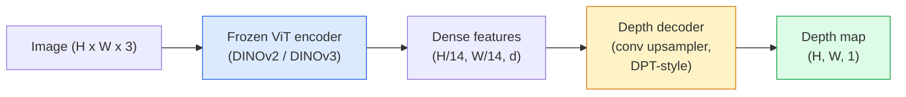

# Độ sâu đơn phương và ước tính hình học

> Bản đồ độ sâu là một bức ảnh đơn đường, trong đó mỗi pixel biểu thị khoảng cách của máy ảnh. Trong quá khứ, nếu không có stereo hoặc LiDAR, chỉ từ một RGB  dự đoán nó được coi là không thể.

**类型：**构建 + 使用
**语言：**Python
**前置要求：**Giai đoạn 4 Bài học 14 (ViT), Giai đoạn 4 Bài học 17 (Tự giám sát tầm nhìn), Giai đoạn 4 Bài học 07 (U-Net)
**时间：**约60分钟

## Học mục tiêu

- 区分 tương đối sâu và chiều sâu métric,并说明 mỗi mô hình cấp sản xuất ((MiDaS, Marigold, Depth Anything V3, ZoeDepth) giải quyết là loại nào
- Sử dụng Độ sâu bất cứ điều gì V3(DINOv2 xương sống) trong trường hợp không cần thiết hiệu chuẩn, cho bất kỳ đơn张图像预测 độ sâu
- 解释 tại sao độ sâu đơn phương có thể được hình thành từ chỉ đơn张图像中成立 (đối cảnh tín hiệu, độ nét văn hóa, tiền lệ học), cũng như nó không thể phục hồi được gì (sự quy mô tuyệt đối, hình học bị loại trừ)
- Sử dụng bản đồ độ sâu và nội tại của camera pinhole sẽ phát hiện 2D  nâng lên điểm 3D

## 问题

Độ sâu là một trong những yếu tố thiếu hụt trong tầm nhìn máy tính 2D. Với RGB, bạn biết vị trí của vật thể trong tầm hình ảnh; nhưng bạn không biết chúng có bao nhiêu.

Đánh giá độ sâu đơn phương, tức từ khung RGB đơn张  dự đoán độ sâu,过去常常产生模糊且不可靠的输出──到2026年, các bộ mã hóa được đào tạo trước lớn 改变了这一点: Độ sâu bất cứ điều gì V3 使用结的 DINOv2脊椎,并生成能够泛化到室内、户外、医学和卫星域的深度地图──Marigold sẽ 重新表述为条件扩散问题──ZoeDepth 回归真实的米ट्रिक距离──

Độ sâu cũng là cầu nối giữa phát hiện 2D và hiểu biết 3D: sẽ được phát hiện các pixel của hộp nhân chiều sâu, bạn có thể nâng cao đối tượng 2D thành đám mây điểm 3D. Đây là mỗi hệ thống che giấu AR, mỗi đường ống tránh trở ngại, cũng như lõi của mỗi robot cầm cốc.

## 概念

### Tâm độ tương đối đối với độ sâu métric

- **Relative depth** 没有真实世界单位的序列 `z`Giá trị A gần hơn so với B, nhưng tỷ lệ khoảng cách không xác định đến mét.
- **Metric depth** Từ máy ảnh xuất phát ∼ ∼ m 计 tuyệt đối khoảng cách ∼ yêu cầu mô hình học hỏi các tín hiệu hình ảnh với sự quan hệ thống giữa khoảng cách thực ∼

MiDaS 和 Depth Bất cứ điều gì V3 生成 tương đối sâu──Marigold 生成 tương đối sâu──ZoeDepth、UniDepth 和 Metric3D 生成 métric depth──Metric models đối với nội tại máy ảnh 敏感;relative models 则不敏感──

### Mã mã hóa-bản mã hóa 模式



Độ sâu bất cứ điều gì V3 结 mã hóa, chỉ tập luyện DPT kiểu mã hóa.

### Tại sao một bức ảnh đơn cũng có thể tạo ra độ sâu

Một张 2D 图像 chứa nhiều tín hiệu đơn hình liên quan đến độ sâu:

- **Perspective** 3D Trung tâm                                                                                                                                                                                                                                                            
- **Texture gradient**  bề mặt ở xa có kết cấu nhỏ hơn, dày đặc hơn.
- **Occlusion order** Các vật gần hơn sẽ che đậy những vật xa hơn.
- **Size constancy** 已知物体 (tác phẩm)  xe hơi (tự động) 提供近似尺度──
- **Atmospheric perspective**Trong những cảnh ngoài trời, những vật thể xa trông trông hơn 、偏蓝 hơn.

Trong hàng tỷ hình ảnh được đào tạo, ViT sẽ kết hợp các tín hiệu này. Chỉ cần có đủ dữ liệu, xương sống đủ mạnh, độ sâu đơn phương, ngay cả khi không có bất kỳ giám sát 3D rõ ràng nào, cũng có thể đạt được độ chính xác hợp lý.

### Độ sâu đơn phương Không thể làm gì

- Không có nội tại hoặc hiện tượng được biết đến trong trường hợp, không thể đạt được**absolute metric scale** mạng có thể dự đoán khoảng cách của tách là hai lần của một cái thìa, nhưng không biết tách là 1 m hay là 10 m xa.
- **Occluded geometry**                                                                                                                                                                                                                                                              
- **真正无 texture / reflective surfaces** gương, kính, tường đồng nhất.

### 2026 năm Đâu sâu bất cứ điều gì V3

- 使用原生 DINOv2 ViT-L/14 作为编码器(结)。
- DPT decoder
- Trong các cặp hình ảnh được chụp từ nhiều nguồn khác nhau, ngoài sự nhất quán quang học, không cần giám sát độ sâu rõ ràng)
- 能够从 **任意数量的 visual inputs 中预测空间一致的 geometry，无论是否已知 camera poses**
- Trong độ sâu đơn hình, hình học bất kỳ quan điểm nào, hình ảnh hiển thị, định hình của máy ảnh lên đến SOTA.

Đây là mô hình giảm giá cần thiết vào năm 2026

### Marigold  dùng để phân tán độ sâu

Marigold(Ke et al., CVPR 2024) sẽ ước tính độ sâu 重新表述为条件图像-to-image diffusion──Conditioning:RGB──Target:depth map──使用预训练的稳定扩散2 U-Net 作为骨干──输出深度图 在对象边界处格外清晰──权衡:inference比进料模型 更慢(10-50个 个 个 个 否定步骤)──

### Hình ảnh nội tại và pinhole camera

Sẽ có độ sâu `d`của pixel `(u, v)`提升为摄像头坐标 中的3D点 `(X, Y, Z)`- Có thể là:

```
fx, fy, cx, cy = camera intrinsics
X = (u - cx) * d / fx
Y = (v - cy) * d / fy
Z = d
```

Intrinsics từ EXIF metadata、calibration pattern, hoặc estimator intrinsics monocular ((Perspective Fields、UniDepth) ⋅ không có intrinsics ⋅, bạn vẫn có thể thông qua giả định 60-70 ° FOV 和中等分辨率 chính điểm từ 染 điểm đám mây, điều này phù hợp với hình ảnh hóa, nhưng không phù hợp với đo ⋅

### Đánh giá

Hai tiêu chuẩn:

- **AbsRel**(sự sai lầm tương đối tuyệt đối):`mean(|d_pred - d_gt| / d_gt)`❖越低越好── mô hình cấp sản xuất thường là 0.05-0.1──
- **delta < 1.25**(sự chính xác ngưỡng):满足 `max(d_pred/d_gt, d_gt/d_pred) < 1.25`Các pixel chiếm tỷ lệ.

Đối với độ sâu tương đối ((Đường độ bất cứ điều gì V3、MiDaS), đánh giá sử dụng hai métrics này của quy mô và chuyển động không biến 版本。


```figure
depth-sweep
```

## 构建

### 步骤 1: Métric độ sâu

```python
import torch

def abs_rel_error(pred, target, mask=None):
    if mask is not None:
        pred = pred[mask]
        target = target[mask]
    return (torch.abs(pred - target) / target.clamp(min=1e-6)).mean().item()


def delta_accuracy(pred, target, threshold=1.25, mask=None):
    if mask is not None:
        pred = pred[mask]
        target = target[mask]
    ratio = torch.maximum(pred / target.clamp(min=1e-6), target / pred.clamp(min=1e-6))
    return (ratio < threshold).float().mean().item()
```

Trong đánh giá 前,始终面膜 无效的深度像素 ((零、NaN、飽和) ⋅

### 步骤 2:Sự sắp xếp quy mô và chuyển động

Đối với các mô hình tương đối sâu, trong các phép tính trước tiên tiên tiên đoán đối với sự thật thực tế.`a * pred + b = target`Làm các hình vuông nhỏ nhất phù hợp:

```python
def align_scale_shift(pred, target, mask=None):
    if mask is not None:
        p = pred[mask]
        t = target[mask]
    else:
        p = pred.flatten()
        t = target.flatten()
    A = torch.stack([p, torch.ones_like(p)], dim=1)
    coeffs, *_ = torch.linalg.lstsq(A, t.unsqueeze(-1))
    a, b = coeffs[:2, 0]
    return a * pred + b
```

Trong đánh giá MiDaS / Độ sâu bất cứ điều gì,先运行 `align_scale_shift`,再运行 `abs_rel_error`

### Bước 3: Tăng độ thành đám mây điểm

```python
import numpy as np

def depth_to_point_cloud(depth, intrinsics):
    H, W = depth.shape
    fx, fy, cx, cy = intrinsics
    v, u = np.meshgrid(np.arange(H), np.arange(W), indexing="ij")
    z = depth
    x = (u - cx) * z / fx
    y = (v - cy) * z / fy
    return np.stack([x, y, z], axis=-1)


depth = np.random.uniform(0.5, 4.0, (240, 320))
intr = (320.0, 320.0, 160.0, 120.0)
pc = depth_to_point_cloud(depth, intr)
print(f"point cloud shape: {pc.shape}  (H, W, 3)")
```

Một hàm, áp dụng cho tất cả các ứng dụng nâng 3D.`.ply`, và mở trong MeshLab hoặc CloudCompare.

### Bước 4: Sử dụng cảnh độ sâu tổng hợp thực hiện thử thuốc lá

```python
def synthetic_depth(size=96):
    yy, xx = np.meshgrid(np.arange(size), np.arange(size), indexing="ij")
    # Floor: linear gradient from near (top) to far (bottom)
    depth = 1.0 + (yy / size) * 4.0
    # Box in the middle: closer
    mask = (np.abs(xx - size / 2) < size / 6) & (np.abs(yy - size * 0.6) < size / 6)
    depth[mask] = 2.0
    return depth.astype(np.float32)


gt = torch.from_numpy(synthetic_depth(96))
pred = gt + 0.3 * torch.randn_like(gt)  # simulated prediction
aligned = align_scale_shift(pred, gt)
print(f"before align  absRel = {abs_rel_error(pred, gt):.3f}")
print(f"after align   absRel = {abs_rel_error(aligned, gt):.3f}")
```

### 步骤 5: Độ sâu bất cứ điều gì V3 使用方式(số tham chiếu)

```python
import torch
from transformers import pipeline
from PIL import Image

pipe = pipeline(task="depth-estimation", model="LiheYoung/depth-anything-v2-large")

image = Image.open("street.jpg").convert("RGB")
out = pipe(image)
depth_np = np.array(out["depth"])
```

3 đường`out["depth"]`là PIL grayscale; chuyển đổi thành numpy 后用于 toán học toán học。 đối với Depth Anything V3, phát hành sau thay thế mô hình id 即可;API 保持不变。

## 使用

- **Depth Anything V3**(Meta AI / ByteDance, 2024-2026)  độ sâu tương đối của các lựa chọn tiêu chuẩn.
- **Marigold**(ETH, 2024)  chất lượng hình ảnh cao nhất, độ suy nghĩ 慢。
- **UniDepth**(ETH, 2024) độ sâu métric,并带 camera intrinsics estimation──
- **ZoeDepth**(Intel, 2023)  độ sâu métric; hơn cũ, nhưng vẫn đáng tin cậy.
- **MiDaS v3.1** di sản nhưng ổn định;适合作为比较基线──

Mô hình tích hợp điển hình:

1. RGB frame đến.
2. Mô hình độ sâu 生成 depth map
3. Đám tử sinh ra hộp.
4. Thông qua độ sâu sẽ nâng cao các hộp centroid lên 3D; nếu có đám mây điểm, thì với hợp并.
5. 下游:Tập tắt AR, lập kế hoạch đường, ước tính kích thước vật thể, thay thế stereo.

对于实时使用,Deepth Anything V2 Small ((INT8 lượng hóa) trên GPU tiêu dùng lên đến 518x518 có thể đạt khoảng 30 fps.

## 交付

本课会生成:

- `outputs/prompt-depth-model-picker.md`                                                                                                                                                                                                                                                              
- `outputs/skill-depth-to-pointcloud.md`Một bản đồ từ độ sâu  kỹ năng xây dựng đám mây điểm, xử lý chính xác nội tại và dẫn đến `.ply`

## 练习

1. **（Easy）**Trong bảng của bạn bất kỳ 10 张图像 trên chạy Độ sâu bất cứ điều gì V2── sẽ độ sâu  lưu trữ cho PNGs thang xám 并 kiểm tra── tìm ra một độ sâu dự đoán nhìn thấy sai đối tượng,并 giải thích tại sao các tín hiệu đơn phương  thất bại──
2. **（Medium）**给定 Depth Anything V2 của RGB + độ sâu, sẽ được nâng lên điểm đám mây không sử dụng `open3d`染──比较两个场景(室内/室外),并记录哪个看起来更可信──
3. **（Hard）**拍摄五对图像, mỗi对只改变一个已知物体的位置 (例如瓶向近处移动 30 cm) ⋅ sử dụng UniDepth 在两张图像上预测米特深度──报告预测距离与真实30 cm的差异──

## 关键术语

| Term | 人们常说 | 实际含义 |
|------|----------------|----------------------|
| Monocular depth | "Single-image depth" | 从一帧 RGB 进行 depth estimation，不使用 stereo 或 LiDAR |
| Relative depth | "Ordered depth" | 没有真实世界单位的有序 z-values |
| Metric depth | "Absolute distance" | 以 metres 表示的 depth；需要 calibration 或使用 metric supervision 训练的 model |
| AbsRel | "Absolute relative error" | |d_pred - d_gt| / d_gt 的平均值；标准 depth metric |
| Delta accuracy | "delta < 1.25" | prediction 位于 ground truth 25% 以内的 pixels 占比 |
| Pinhole camera | "fx, fy, cx, cy" | 用于将 (u, v, d) 提升到 (X, Y, Z) 的 camera model |
| DPT | "Dense Prediction Transformer" | 位于冻结 ViT encoders 之上的 conv-based decoder，用于 depth |
| DINOv2 backbone | "The reason it works" | 无需 depth labels 即可跨 domains 泛化的 self-supervised features |

## 延伸阅读

- [Depth Anything V3 paper page](https://depth-anything.github.io/) Sử dụng mã hóa DINOv2 của SOTA độ sâu đơn hình
- [Marigold (Ke et al., CVPR 2024)](https://marigoldmonodepth.github.io/)  Đánh giá độ sâu dựa trên sự pha trộn
- [UniDepth (Piccinelli et al., 2024)](https://arxiv.org/abs/2403.18913)Độ sâu métric của nội tại
- [MiDaS v3.1 (Intel ISL)](https://github.com/isl-org/MiDaS) Hình ảnh cơ sở tương đối sâu
- [DINOv3 blog post (Meta)](https://ai.meta.com/blog/dinov3-self-supervised-vision-model/) 提升 độ sâu chính xác của gia đình mã hóa
