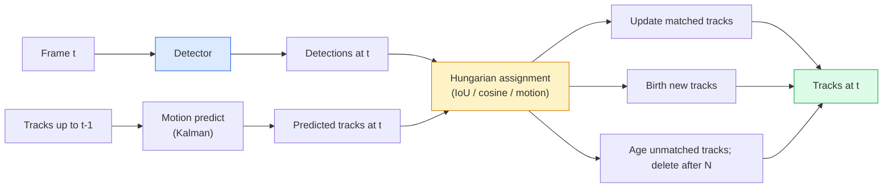

# Theo dõi nhiều đối tượng và bộ nhớ video

> Theo dõi là phát hiện 加 liên kết;;检测每一;; theo ID sẽ được phát hiện hiện hiện tại 匹配 đến các dấu vết trên ;;

**Type:** Build
**Languages:** Python
**Prerequisites:** Phase 4 Lesson 06 (YOLO Detection), Phase 4 Lesson 08 (Mask R-CNN), Phase 4 Lesson 24 (SAM 3)
**Time:** ~60 分钟

## Học mục tiêu

- 区分 theo dõi theo dò 与 truy vấn dựa theo theo dõi,并说出算法家族名称(SORT, DeepSORT, ByteTrack, BoT-SORT, SAM 2 bộ nhớ theo dõi, SAM 3.1 Object Multiplex)
- Từ零 thực hiện IoU + Hungarian assignment, dùng cho theo dõi theo dò
- Giải thích ngân hàng bộ nhớ SAM 2, và tại sao nó có thể xử lý sự bịt kín hơn so với IoU
- 读懂三种跟踪 métrics(MOTA, IDF1, HOTA),并为给定用例 选择最重要的一项

## 问题

Chẩn đoán sẽ cho bạn biết các vật trong đơn vị ở đâu.`t`Phân tích và khung hình`t-1`Một phát hiện ở giữa là cùng một vật thể. Không có điểm này, bạn không thể tính toán số lần các vật thể xuyên qua một đường, không thể theo dõi một quả bóng trong quá trình bịt kín, cũng không thể biết xe #4 đã dừng lại trong đường xe 8 giây.

Theo dõi đối với mỗi mặt video của các sản phẩm là rất quan trọng: phân tích thể thao, giám sát, lái xe tự trị, phân tích video y tế, giám sát động vật hoang dã, đếm dấu từ.

Năm 2026 mang lại hai mô hình mới:**SAM 2 memory-based tracking**(用 tính năng-thưởng thức 替代 motion-model association) và **SAM 3.1 Object Multiplex**(为同一概念的多种例共享记忆) 本课先讲经典,再讲基于记忆的方法

## 核心概念

### Theo dõi bằng phát hiện



Mỗi bộ theo dõi bạn sẽ gặp vào năm 2026 đều là một biến thể của vòng này.

- **SORT**(2016): Kalman filter + IoU Hungarian。简单、快速, không có mô hình ngoại hình。
- **DeepSORT**(2017): SORT + Mỗi bài hát Một tính năng xuất hiện dựa trên CNN (ReID Embedding)
- **ByteTrack**(2021): 将低信任度检测 作为第二阶段进行协会; không cần các tính năng xuất hiện, nhưng trên MOT17
- **BoT-SORT**(2022): Byte + camera motion compensation + ReID。
- **StrongSORT / OC-SORT** Phương pháp sau của ByteTrack, có chuyển động và ngoại hình tốt hơn.

### 一段话 hiểu Kalman filter

Kalman filter cho mỗi bài hát  duy trì một trạng thái có sự biến đổi `(x, y, w, h, dx, dy, dw, dh)`Trong mỗi lần, nó sử dụng mô hình tốc độ liên tục**predict** trạng thái, sau đó sử dụng để phát hiện **update** Khi dự đoán sự không chắc chắn 较高时,update 会更信任检测;;

Mỗi bộ theo dõi cổ điển đều có bước dự đoán chuyển động sử dụng bộ lọc Kalman.

### Algoritm Hungary

Đưa một`M x N`Matrix chi phí(các đường dẫn x phát hiện), tìm kiếm để tạo tổng chi phí 最小一对一任务──Cost thường là `1 - IoU(track_bbox, detection_bbox)`, hoặc các tính năng ngoại hình của sự tương đồng cosine ⋅ Tiếng chạy là O(((M+N) ^3);当 M、N 最高约为 1000 时,通过 `scipy.optimize.linear_sum_assignment`Trong Python là đủ nhanh.

### ByteTrack's quan trọng

标准 tracker 会丢弃低置信度 phát hiện(< 0.5)。ByteTrack 会 giữ chúng như **second-stage candidates**: Đầu tiên sẽ phù hợp với các phát hiện độ cao, sau đó để các phát hiện không phù hợp sử dụng ngưỡng IoU nhẹ nhàng 尝试匹配低信度检测―― như vậy có thể khôi phục lại các sự ẩn náu ngắn hạn,并 giảm số chuyển đổi ID gần người dân.

### SAM 2 theo dõi dựa trên bộ nhớ

SAM 2  thông qua bảo trì các tính năng không gian-thời gian mỗi trường hợp **memory bank**Để xử lý video. Đưa ra một cái gì đó trên một cái gì đó. Sau đó, nó sẽ mã hóa ví dụ đó vào bộ nhớ. Trong phần tiếp theo, bộ nhớ sẽ gặp gỡ các tính năng mới.

Không có bộ lọc Kalman, cũng không có bài tập tiếng Hungary.

优点:
- Đối với các khu vực rộng lớn 鲁棒(memory 会跨多携带实例身份)
- Với SAM 3 của các lời nhắc văn bản 结合时支持开口语库──
- Không cần mô hình chuyển động độc lập.

缺点:
- Để theo dõi nhiều đối tượng nói hơn là ByteTrack hơn.
- Ngân hàng bộ nhớ 会增长; cửa sổ ngữ cảnh 受限──

### SAM 3.1 Object Multiplex

Từ trước SAM 2 / SAM 3 theo dõi sẽ dành cho mỗi trường hợp  Bảo tồn ngân hàng bộ nhớ độc lập  50 vật  50 ngân hàng bộ nhớ  Object Multiplex  2026 年 3 月) sẽ nén chúng thành một带有 **per-instance query tokens**Ưu điểm của bộ nhớ chia sẻ:

Multiplex là 2026 năm theo dõi đám đông của một lựa chọn mới: đám đông hòa nhạc, lao động kho, giao thông giao thông.

### 需要掌握三种指标

- **MOTA (Multi-Object Tracking Accuracy)** 1 - (FN + FP + ID chuyển đổi) / GT。 theo loại lỗi 加权; đây là một sẽ phát hiện và kết hợp thất bại 混合在一起的单一 метрик。
- **IDF1 (ID F1)** ID chính xác và trung bình hài hòa của việc nhớ lại.                                                                                                                                                                                                                                                        
- **HOTA (Higher Order Tracking Accuracy)** 分解为检测精度 (DetA) và liên kết精度 (AssA) ⋅ kể từ năm 2020 ⋅社区标准;最全面──

对于监视(who is who):报告 IDF1。对于体育分析(counting passes):HOTA。对于一般学术比较:HOTA。


```figure
cv3-track-assoc
```

##  xây dựng nó

### Bước 1: dựa trên các giá trị của IoU

```python
import numpy as np


def bbox_iou(a, b):
    """
    a, b: [x1, y1, x2, y2] 的 (N, 4) arrays。
    返回 (N_a, N_b) IoU matrix。
    """
    ax1, ay1, ax2, ay2 = a[:, 0], a[:, 1], a[:, 2], a[:, 3]
    bx1, by1, bx2, by2 = b[:, 0], b[:, 1], b[:, 2], b[:, 3]
    inter_x1 = np.maximum(ax1[:, None], bx1[None, :])
    inter_y1 = np.maximum(ay1[:, None], by1[None, :])
    inter_x2 = np.minimum(ax2[:, None], bx2[None, :])
    inter_y2 = np.minimum(ay2[:, None], by2[None, :])
    inter = np.clip(inter_x2 - inter_x1, 0, None) * np.clip(inter_y2 - inter_y1, 0, None)
    area_a = (ax2 - ax1) * (ay2 - ay1)
    area_b = (bx2 - bx1) * (by2 - by1)
    union = area_a[:, None] + area_b[None, :] - inter
    return inter / np.clip(union, 1e-8, None)
```

### 步骤 2: 最小 SORT 风格 theo dõi

Để đơn giản thấy,省略 cố định tốc độ không đổi Kalman; ở đây sử dụng đơn giản của IoU liên kết; trong môi trường sản xuất, Kalman dự đoán là không thể thiếu.`sort`Phạm vi Python 提供完整版本──

```python
from scipy.optimize import linear_sum_assignment


class Track:
    def __init__(self, tid, bbox, frame):
        self.id = tid
        self.bbox = bbox
        self.last_frame = frame
        self.hits = 1

    def update(self, bbox, frame):
        self.bbox = bbox
        self.last_frame = frame
        self.hits += 1


class SimpleTracker:
    def __init__(self, iou_threshold=0.3, max_age=5):
        self.tracks = []
        self.next_id = 1
        self.iou_threshold = iou_threshold
        self.max_age = max_age

    def step(self, detections, frame):
        if not self.tracks:
            for d in detections:
                self.tracks.append(Track(self.next_id, d, frame))
                self.next_id += 1
            return [(t.id, t.bbox) for t in self.tracks]

        track_boxes = np.array([t.bbox for t in self.tracks])
        det_boxes = np.array(detections) if len(detections) else np.empty((0, 4))

        iou = bbox_iou(track_boxes, det_boxes) if len(det_boxes) else np.zeros((len(track_boxes), 0))
        cost = 1 - iou
        cost[iou < self.iou_threshold] = 1e6

        matched_track = set()
        matched_det = set()
        if cost.size > 0:
            row, col = linear_sum_assignment(cost)
            for r, c in zip(row, col):
                if cost[r, c] < 1.0:
                    self.tracks[r].update(det_boxes[c], frame)
                    matched_track.add(r); matched_det.add(c)

        for i, d in enumerate(det_boxes):
            if i not in matched_det:
                self.tracks.append(Track(self.next_id, d, frame))
                self.next_id += 1

        self.tracks = [t for t in self.tracks if frame - t.last_frame <= self.max_age]
        return [(t.id, t.bbox) for t in self.tracks]
```

60 行──接收 per-frame detections, return per-frame track ID──真实系统也会加入Kalman predict、ByteTrack's second-stage re-match,以及外观功能──

### 步骤 3: Kiểm tra đường mòn tổng hợp

```python
def synthetic_frames(num_frames=20, num_objects=3, H=240, W=320, seed=0):
    rng = np.random.default_rng(seed)
    starts = rng.uniform(20, 200, size=(num_objects, 2))
    velocities = rng.uniform(-5, 5, size=(num_objects, 2))
    frames = []
    for f in range(num_frames):
        dets = []
        for i in range(num_objects):
            cx, cy = starts[i] + f * velocities[i]
            dets.append([cx - 10, cy - 10, cx + 10, cy + 10])
        frames.append(dets)
    return frames


tracker = SimpleTracker()
for f, dets in enumerate(synthetic_frames()):
    tracks = tracker.step(dets, f)
```

Ba vật thể nằm trong chuyển động thẳng  nên có thể giữ được nhận dạng của riêng mình trong tất cả 20 

### 步骤 4: Metric chuyển đổi ID

```python
def count_id_switches(tracks_per_frame, gt_per_frame):
    """
    tracks_per_frame:  list of list of (track_id, bbox)
    gt_per_frame:      list of list of (gt_id, bbox)
    返回 ID switches 的数量。
    """
    prev_assignment = {}
    switches = 0
    for tracks, gts in zip(tracks_per_frame, gt_per_frame):
        if not tracks or not gts:
            continue
        t_boxes = np.array([b for _, b in tracks])
        g_boxes = np.array([b for _, b in gts])
        iou = bbox_iou(g_boxes, t_boxes)
        for g_idx, (gt_id, _) in enumerate(gts):
            j = iou[g_idx].argmax()
            if iou[g_idx, j] > 0.5:
                t_id = tracks[j][0]
                if gt_id in prev_assignment and prev_assignment[gt_id] != t_id:
                    switches += 1
                prev_assignment[gt_id] = t_id
    return switches
```

Đây là một phương pháp đơn giản hóa gần IDF1: thống kê một đối tượng thực tại cơ bản thay đổi số lần được gán ID theo dõi dự đoán.`py-motmetrics`和 `TrackEval`Ở giữa.

## Sử dụng nó

Các máy theo dõi cấp sản xuất năm 2026:

- `ultralytics` YOLOv8 + 内置 ByteTrack / BoT-SORT。`results = model.track(source, tracker="bytetrack.yaml")`❖ 默认选择──
- `supervision`(Roboflow)  Bọc ByteTrack cộng với tiện ích ghi chú.
- SAM 2 / SAM 3.1  通过 `processor.track()` thực hiện theo dõi dựa trên bộ nhớ.
- Dòng tùy chỉnh: máy dò (YOLOv8 / RT-DETR) + `sort-tracker`- `OC-SORT`- `StrongSORT`

选择方式:

- 30+ fps 下的行人 / xe hơi / hộp:**ByteTrack with ultralytics**
- Một số trường hợp lớn trong nhóm người:**SAM 3.1 Object Multiplex**
- 带有可识别外观的沉重:**DeepSORT / StrongSORT**(Công tính ReID)
- Các hoạt động thể thao / tương tác phức tạp:**BoT-SORT**Hoặc các máy theo dõi học tập (MOTRv3).

## 交付 nó

本课会产出:

- `outputs/prompt-tracker-picker.md`  根据场景类型、封闭模式 和延迟预算 选择 SORT / ByteTrack / BoT-SORT / SAM 2 / SAM 3.1。
- `outputs/skill-mot-evaluator.md` 编写 một vòng đánh giá hoàn chỉnh, được sử dụng để đánh giá các đường mòn thực tại trên mặt đất  đánh giá MOTA / IDF1 / HOTA。

## 练习

1. **(Easy)**Sử dụng bộ theo dõi tổng hợp trên phân biệt vận hành 3、10 và 30 đối tượng ⋅ báo cáo số lượng chuyển đổi ID trong từng trường hợp ⋅ tìm ra một liên kết đơn giản chỉ với IoU từ đâu bắt đầu không hiệu quả ⋅
2. **(Medium)**Trong khi đó, các công cụ này đã được sử dụng để tạo ra các kết quả của các công cụ này.
3. **(Hard)**集成 SAM 2 của bộ nhớ dựa trên theo dõi( thông qua `transformers`(Bài viết: "Trong một đoạn 30 giây, các bộ phim được phát hành bởi các nhà phát triển và các nhà phát triển khác nhau, các bộ phim được phát hành bởi các nhà phát triển khác nhau, các bộ phim được phát hành bởi các nhà phát triển khác nhau, các bộ phim được phát hành bởi các nhà phát triển khác nhau, các bộ phim được phát hành bởi các nhà phát triển khác nhau, các bộ phim được phát hành bởi các nhà phát triển khác nhau, các bộ phim được phát hành bởi các nhà phát triển khác nhau, các bộ phim được phát hành bởi các nhà phát triển khác nhau, các bộ phim được phát hành bởi các nhà phát triển khác nhau, các bộ phim được phát hành bởi các nhà phát triển khác nhau, các bộ phim được phát hành bởi các nhà phát triển khác nhau, các bộ phim được phát hành bởi các nhà phát triển khác, các bộ phim được phát hành bởi các nhà phát triển khác, các bộ phim được phát hành bởi các nhà phát triển và các nhà phát triển khác.

## 关键术语

| Term | 常见说法 | 实际含义 |
|------|----------------|----------------------|
| Tracking-by-detection | “先 detect 再 associate” | Per-frame detector + 基于 IoU / appearance 的 Hungarian assignment |
| Kalman filter | “Motion predict” | Linear dynamics + covariance，用于平滑 track predictions 和处理 occlusion |
| Hungarian algorithm | “Optimal assignment” | 求解 minimum-cost bipartite matching 问题；`scipy.optimize.linear_sum_assignment` |
| ByteTrack | “低置信度 second pass” | 将未匹配 tracks 重新匹配到低置信度 detections，以恢复短暂 occlusions |
| DeepSORT | “SORT + appearance” | 添加 ReID feature 用于跨帧匹配；更利于保持 ID |
| Memory bank | “SAM 2 trick” | 跨帧存储的 per-instance spatio-temporal features；cross-attention 替代显式 association |
| Object Multiplex | “SAM 3.1 shared memory” | 使用带 per-instance queries 的单一 shared memory，实现快速 many-object tracking |
| HOTA | “现代 tracking metric” | 分解为 detection 和 association accuracy；社区标准 |

## 延伸阅读

- [SORT (Bewley et al., 2016)](https://arxiv.org/abs/1602.00763) 最小 theo dõi-by-detection 论文
- [DeepSORT (Wojke et al., 2017)](https://arxiv.org/abs/1703.07402) 添加 tính năng xuất hiện
- [ByteTrack (Zhang et al., 2022)](https://arxiv.org/abs/2110.06864) 低置信度 lần thứ hai đi qua
- [BoT-SORT (Aharon et al., 2022)](https://arxiv.org/abs/2206.14651) Khấu trừ chuyển động của máy ảnh
- [HOTA (Luiten et al., 2020)](https://arxiv.org/abs/2009.07736) 分解式 theo dõi métrics
- [SAM 2 video segmentation (Meta, 2024)](https://ai.meta.com/sam2/) bộ theo dõi dựa trên bộ nhớ
- [SAM 3.1 Object Multiplex (Meta, March 2026)](https://ai.meta.com/blog/segment-anything-model-3/)
