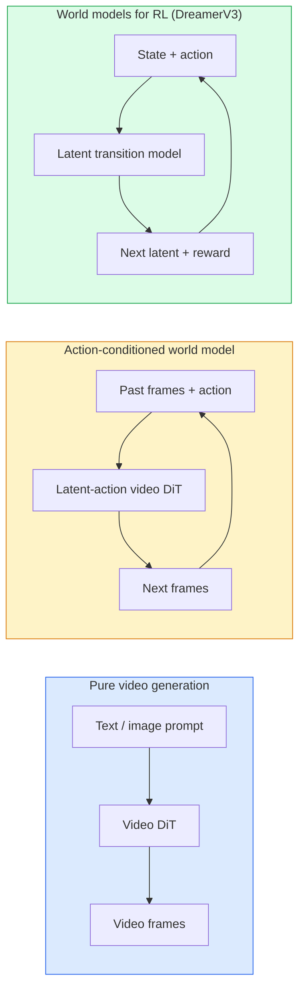

# Mô hình thế giới và Video

> Một mô hình video có thể dự đoán một cảnh trong vài giây tới, là một máy mô phỏng thế giới.

**Type:** Learn + Build
**Languages:** Python
**Prerequisites:** Phase 4 Lesson 10 (Diffusion), Phase 4 Lesson 12 (Video Understanding), Phase 4 Lesson 23 (DiT + Rectified Flow)
**Time:** ~75 分钟

## Học mục tiêu
- 解释纯视频生成模型(Sora 2) và mô hình thế giới có điều kiện hành động(Genie 3, DreamerV3)
-  mô tả video DiT: space-temporal patches  3D position coding 跨 `(T, H, W)`token của sự chú ý chung
- 追踪 World Model 如何接入机器人:VLM 规划 → mô hình video 模拟 → động lực ngược 输出动作
- 针对给定用例 ((creative video、interactive sim、autonomous-driving synthesis) 在 Sora 2、Genie 3、Runway GWM-1 Worlds、Wan-Video 和 HunyuanVideo 之间做选择

## 问题
视频生成和世界模型在2026年走向融合──一个能够生成连贯一分钟视频的模型,在某种意义上已经学会了世界如何运动:物体永久性,重力,因果性,风格── nếu bạn đặt điều kiện dự đoán này trong động tác ((向左走、打开门), mô hình video sẽ trở thành một mô hình mô hình có thể học được, có thể thay thế động cơ trò chơi, mô hình lái xe hoặc môi trường robot──

Ảnh hưởng rất cụ thể. Genie 3 có thể được tạo ra từ một hình ảnh đơn lẻ tạo ra môi trường có thể chơi. Giao thông GWM-1 Worlds 合成无限可探索的场景. Sora 2 生成带有同步音频和建模物理效果一分钟视频. NVIDIA Cosmos-Drive、Wayve Gaia-2 和 Tesla DrivingWorld 为自动驾驶车训练数据 生成真实驾驶视频.

Đây là một khóa học của giai đoạn 4 của chương trình. Nó kết nối việc tạo hình ảnh, hiểu biết video và lý luận đại lý với các mô hình kiến trúc đang chuyển hướng trong nghiên cứu chính.

## 概念
### Ba hệ thống mô hình thế giới



- **Sora 2**Không có động tác giao tiếp, bạn không thể điều khiển nó trong quá trình triển khai.
- **Genie 3****GWM-1 Worlds****Mirage / Magica**là những mô hình thế giới có điều kiện hành động. Chúng được đưa ra từ các video quan sát để xác định các hành động tiềm ẩn, sau đó đưa tương lai lên các động tác.
- **DreamerV3**和经典 RL World Model 家族 thực hiện dự đoán trong không gian ẩn,并带有显式 hành động điều kiện, dựa trên tín hiệu phần thưởng 训练。视觉性较弱; nhưng đối với mẫu hiệu quả RL hơn hữu ích。

### Video DiT kiến trúc

```
Video latent:          (C, T, H, W)
Patchify (spatial):    grid of P_h x P_w patches per frame
Patchify (temporal):   group P_t frames into a temporal patch
Resulting tokens:      (T / P_t) * (H / P_h) * (W / P_w) tokens
```

Mã hóa vị trí là 3D của: đối với mỗi `(t, h, w)`坐标使用 xoay hoặc học tập nhúng.

- **Full joint** Tất cả các token tham dự đến tất cả các token.
- **Divided** 交替执行 temporal attention( cùng vị trí không gian、跨时间:`(H*W) * T^2`(với sự chú ý không gian) cùng thời gian bước 跨空间:`T * (H*W)^2`TimeSformer và hầu hết các video DiT đều sử dụng phương pháp này.
- **Window** 在 `(t, h, w)`中使用局部窗──Video Swin 使用方式──

Mỗi năm 2026 Video Diffusion 模型都将使用这三种模式之一,再加 AdaLN điều kiện ((Lớp 23) và dòng chảy sửa chữa)).

### 基于动作的Conditioning:latent action models

Genie 通过判别式地预测一对连续之间的动作,为每一学习一个 **latent action** sau đó mô hình của decoder 条件化在推断出的潜伏动作上,而不是显式键盘按键上.

Sora  hoàn toàn nhảy qua động tác giao tiếp. Bộ giải mã của nó từ các token thời gian không gian quá khứ.

### Tự tin về thể chất

Sora 2 năm 2026 đã được công bố rõ ràng.**physical plausibility**: trọng lượng, cân bằng, sự tồn tại của vật thể, nguyên nhân và kết quả. Nhóm thông qua đánh giá nhân tạo đo điểm khả thi; so với Sora 1, mô hình này đã cải thiện rõ ràng trong các tình huống như rơi vật thể, gặp gỡ vai trò và cố tình thất bại (một lần không nhảy thành công).

Thiếu khả năng vẫn là một phương thức thất bại chính. Năm 2024-2025 người ta ăn món ngọt hoặc uống nước bằng ly video đã tiết lộ các vấn đề về mô hình thiếu thể hiện đối tượng lâu dài. Năm 2026 mô hình (Sora 2 ⁄ Runway Gen-5 ⁄ Hunyuan Video) đã giảm các vấn đề này, nhưng không loại bỏ.

### Mô hình thế giới tự lái

Các mô hình thế giới lái xe sẽ được tạo ra dựa trên quỹ đạo, hộp kết nối hoặc bản đồ điều hướng  tình hình đường thực tế được điều kiện hóa:

- **Cosmos-Drive-Dreams**(NVIDIA)  Để đào tạo RL 生成数分钟驾驶视频。
- **Gaia-2**(Wayve)  Sử dụng để tổng hợp cảnh có điều kiện quỹ đạo của đánh giá chính sách.
- **DrivingWorld**(Tesla)  模拟多样气候, thời gian trong ngày và điều kiện giao thông.
- **Vista**(ByteDance)  响应式驾驶场景合成──

Chúng thay thế thu thập dữ liệu thực tế đắt tiền, được sử dụng để phủ nhận các trường hợp góc, chẳng hạn như những người đi bộ đêm xuyên đường, băng thông đường băng, loại xe hiếm gặp; nếu không những tình huống này sẽ cần hàng triệu miles lái xe để thu thập.

### 机器人技术:VLM + mô hình video + động lực ngược

Có 3 bộ phận robot đang xuất hiện:

1. **VLM**解析目标 ((拿起红色杯子), lập kế hoạch theo trình diễn hành động cấp cao。
2. **Video generation model**模拟执行每个动作会是什么样子,预测未来 N quan sát
3. **Inverse dynamics model**提取会产生这些观察的具体动机命令──

Đây là một ví dụ: Genie Envisioner là một ví dụ; nhiều nhóm nghiên cứu đang nhận được cấu trúc này.

### Đánh giá

- **Visual quality** FVD (Fréchet Video Distance) 、 người dùng nghiên cứu。
- **Prompt alignment** Mỗi CLIPScore、VQA-style đánh giá。
- **Physical plausibility** Trong bộ đánh giá chuẩn 上人工评分(Sora 2 的内部 benchmark、VBench)
- **Controllability**(đối với các mô hình thế giới tương tác)  hành động → sự nhất quán quan sát; bạn có thể trở lại trạng thái trước đây?

### 2026 năm

| Model | Use | Parameters | Output | License |
|-------|-----|------------|--------|---------|
| Sora 2 | text-to-video, audio | — | 1-min 1080p + audio | API only |
| Runway Gen-5 | text/image-to-video | — | 10s clips | API |
| Runway GWM-1 Worlds | interactive world | — | infinite 3D rollout | API |
| Genie 3 | interactive world from image | 11B+ | playable frames | research preview |
| Wan-Video 2.1 | open text-to-video | 14B | high-quality clips | non-commercial |
| HunyuanVideo | open text-to-video | 13B | 10s clips | permissive |
| Cosmos / Cosmos-Drive | autonomous driving sim | 7-14B | driving scenes | NVIDIA open |
| Magica / Mirage 2 | AI-native game engine | — | modifiable worlds | product |


```figure
v4-world-rollout
```

##  xây dựng nó
### 步骤 1: video của 3D patchify

```python
import torch
import torch.nn as nn


class VideoPatch3D(nn.Module):
    def __init__(self, in_channels=4, dim=64, patch_t=2, patch_h=2, patch_w=2):
        super().__init__()
        self.proj = nn.Conv3d(
            in_channels, dim,
            kernel_size=(patch_t, patch_h, patch_w),
            stride=(patch_t, patch_h, patch_w),
        )
        self.patch_t = patch_t
        self.patch_h = patch_h
        self.patch_w = patch_w

    def forward(self, x):
        # x: (N, C, T, H, W)
        x = self.proj(x)
        n, c, t, h, w = x.shape
        tokens = x.reshape(n, c, t * h * w).transpose(1, 2)
        return tokens, (t, h, w)
```

Một bước giống như 3D conv của hạt nhân sẽ được tải như một patchifier không gian-thời gian.`(T, H, W) -> (T/2, H/2, W/2)`của token 网格。

### 步骤 2: 3D mã hóa vị trí xoay

Rotary Position Embeddings (RoPE) 分别沿 `t``h``w`轴应用:

```python
def rope_3d(tokens, t_dim, h_dim, w_dim, grid):
    """
    tokens: (N, T*H*W, D)
    grid: (T, H, W) sizes
    t_dim + h_dim + w_dim == D
    """
    T, H, W = grid
    n, seq, d = tokens.shape
    if t_dim + h_dim + w_dim != d:
        raise ValueError(f"t_dim+h_dim+w_dim ({t_dim}+{h_dim}+{w_dim}) must equal D={d}")
    assert seq == T * H * W
    t_idx = torch.arange(T, device=tokens.device).repeat_interleave(H * W)
    h_idx = torch.arange(H, device=tokens.device).repeat_interleave(W).repeat(T)
    w_idx = torch.arange(W, device=tokens.device).repeat(T * H)
    # Simplified: just scale channels by frequencies. Real RoPE rotates pairs.
    freqs_t = torch.exp(-torch.log(torch.tensor(10000.0)) * torch.arange(t_dim // 2, device=tokens.device) / (t_dim // 2))
    freqs_h = torch.exp(-torch.log(torch.tensor(10000.0)) * torch.arange(h_dim // 2, device=tokens.device) / (h_dim // 2))
    freqs_w = torch.exp(-torch.log(torch.tensor(10000.0)) * torch.arange(w_dim // 2, device=tokens.device) / (w_dim // 2))
    emb_t = torch.cat([torch.sin(t_idx[:, None] * freqs_t), torch.cos(t_idx[:, None] * freqs_t)], dim=-1)
    emb_h = torch.cat([torch.sin(h_idx[:, None] * freqs_h), torch.cos(h_idx[:, None] * freqs_h)], dim=-1)
    emb_w = torch.cat([torch.sin(w_idx[:, None] * freqs_w), torch.cos(w_idx[:, None] * freqs_w)], dim=-1)
    return tokens + torch.cat([emb_t, emb_h, emb_w], dim=-1)
```

Đây là hình thức phụ gia đơn giản hóa. Thực tế RoPE sẽ quay theo tần số chuyển sang các kênh.

### 步骤 3: Blok chú ý chia

```python
class DividedAttentionBlock(nn.Module):
    def __init__(self, dim=64, heads=2):
        super().__init__()
        self.time_attn = nn.MultiheadAttention(dim, heads, batch_first=True)
        self.space_attn = nn.MultiheadAttention(dim, heads, batch_first=True)
        self.ln1 = nn.LayerNorm(dim)
        self.ln2 = nn.LayerNorm(dim)
        self.ln3 = nn.LayerNorm(dim)
        self.mlp = nn.Sequential(nn.Linear(dim, 4 * dim), nn.GELU(), nn.Linear(4 * dim, dim))

    def forward(self, x, grid):
        T, H, W = grid
        n, seq, d = x.shape
        # time attention: same (h, w), across t
        xt = x.view(n, T, H * W, d).permute(0, 2, 1, 3).reshape(n * H * W, T, d)
        a, _ = self.time_attn(self.ln1(xt), self.ln1(xt), self.ln1(xt), need_weights=False)
        xt = (xt + a).reshape(n, H * W, T, d).permute(0, 2, 1, 3).reshape(n, seq, d)
        # space attention: same t, across (h, w)
        xs = xt.view(n, T, H * W, d).reshape(n * T, H * W, d)
        a, _ = self.space_attn(self.ln2(xs), self.ln2(xs), self.ln2(xs), need_weights=False)
        xs = (xs + a).reshape(n, T, H * W, d).reshape(n, seq, d)
        xs = xs + self.mlp(self.ln3(xs))
        return xs
```

Time attention 在每个空间位置内跨时间 attend;space attention 在每一内跨位置 attend──用两个 O(T^2 + (HW) ^2) 操作,替换一个 O((THW) ^2) 操作──这是TimeSformer 和每个现代视频 DiT的核心──

### 步骤 4: 组合一个小视频 DiT

```python
class TinyVideoDiT(nn.Module):
    def __init__(self, in_channels=4, dim=64, depth=2, heads=2):
        super().__init__()
        self.patch = VideoPatch3D(in_channels=in_channels, dim=dim, patch_t=2, patch_h=2, patch_w=2)
        self.blocks = nn.ModuleList([DividedAttentionBlock(dim, heads) for _ in range(depth)])
        self.out = nn.Linear(dim, in_channels * 2 * 2 * 2)

    def forward(self, x):
        tokens, grid = self.patch(x)
        for blk in self.blocks:
            tokens = blk(tokens, grid)
        return self.out(tokens), grid
```

Đây không phải là một máy phát điện video có thể làm việc; nó là một mô hình cấu trúc, chứng minh hình dạng của mỗi phần đều chính xác.

### 步骤 5: 检查 hình dạng

```python
vid = torch.randn(1, 4, 8, 16, 16)  # (N, C, T, H, W)
model = TinyVideoDiT()
out, grid = model(vid)
print(f"input  {tuple(vid.shape)}")
print(f"tokens grid {grid}")
print(f"output {tuple(out.shape)}")
```

patching 后预期 `grid = (4, 8, 8)`且 `out = (1, 256, 32)`; đầu sau đó chiếu đến mỗi token đối với các patch không gian-thời gian, chuẩn bị un-patchify 回视频。

## Sử dụng nó
Mô hình sản xuất năm 2026:

- **Sora 2 API**(OpenAI)  text-to-video 同步音频──Premium pricing──
- **Runway Gen-5 / GWM-1**(Runway)  hình ảnh-video  thế giới tương tác
- **Wan-Video 2.1 / HunyuanVideo**                          
- **Cosmos / Cosmos-Drive**(NVIDIA)  mô phỏng lái xe mở trọng lượng
- **Genie 3** nghiên cứu xem trước, cần phải nộp đơn truy cập

构建互动世界模型演示:从 Wan-Video 开始以获得质量,再叠加一个隐形动作适配器来实现交互性── đối với mô phỏng lái xe tự động:Cosmos-Drive là tham chiếu mở năm 2026──

现实中的 robot stack:

1. Mục tiêu ngôn ngữ -> VLM (Qwen3-VL) -> kế hoạch cấp cao。
2. Kế hoạch -> mô hình video hành động ẩn -> triển khai tưởng tượng。
3. Rollout -> mô hình động lực ngược -> hành động cấp thấp。
4. 执行 Actions -> quan sát được đưa lại vào bước 1。

## 交付 nó
本课产 出:

- `outputs/prompt-video-model-picker.md` 根据任务、许可和延迟,在 Sora 2 / Runway / Wan / HunyuanVideo / Cosmos 之间做选择──
- `outputs/skill-physical-plausibility-checks.md`Một kỹ năng kiểm tra tự động định nghĩa của vật thể vĩnh viễn, trọng lực, liên tục, được sử dụng trong giao hàng trước khi kiểm tra bất kỳ video nào được tạo.

## 练习
1. **(Easy)**计算一个 5 秒 360p 视频在补丁 t=2、补丁 h=8、补丁 w=8 时的代币数量――推理这个规模下关注内存需求――
2. **(Medium)**Hãy đặt khối chú ý phân chia trên  thay thế thành khối chú ý chung đầy đủ,并测量 hình dạng và số parameter.
3. **(Hard)**构建一个最小潜伏视频模型:使用 `(frame_t, action_t, frame_{t+1})`Triple 数据集(任意简单 2D game), tập luyện một tập video nhỏ dựa trên các cài đặt hành động  điều kiện hóa DiT,并展示不同动作会产生不同的下一──

## 关键术语
| Term | What people say | What it actually means |
|------|----------------|----------------------|
| World model | “Learned simulator” | 一个在给定 state 和 action 时预测未来 observations 的模型 |
| Video DiT | “Spacetime transformer” | 使用 3D patchification 和 divided attention 的 Diffusion transformer |
| Latent action | “Inferred control” | 从帧对中推断出的离散或连续 action latent；用于条件化 next-frame generation |
| Divided attention | “Time then space” | 每个 block 中的两个 attention 操作：先跨时间，再跨空间，用来让 O(N^2) 保持可控 |
| Object permanence | “Things stay real” | video models 必须学会的场景属性；在食物、玻璃器皿上的经典失败模式 |
| FVD | “Fréchet Video Distance” | FID 的视频等价物；主要 visual quality metric |
| Inverse dynamics model | “Observations to actions” | 给定 `(state, next state)`，输出连接二者的 action；闭合 robotics loop |
| Cosmos-Drive | “NVIDIA driving sim” | 用于 RL 和 evaluation 的 open-weights autonomous-driving world model |

## 延伸阅读
- [Sora technical report (OpenAI)](https://openai.com/index/video-generation-models-as-world-simulators/)
- [Genie: Generative Interactive Environments (Bruce et al., 2024)](https://arxiv.org/abs/2402.15391) mô hình thế giới hành động ẩn
- [TimeSformer (Bertasius et al., 2021)](https://arxiv.org/abs/2102.05095) Sử dụng các biến thể video để phân chia sự chú ý
- [DreamerV3 (Hafner et al., 2023)](https://arxiv.org/abs/2301.04104) Sử dụng các mô hình thế giới của RL
- [Cosmos-Drive-Dreams (NVIDIA, 2025)](https://research.nvidia.com/labs/toronto-ai/cosmos-drive-dreams/) mô hình lái xe thế giới
- [Top 10 Video Generation Models 2026 (DataCamp)](https://www.datacamp.com/blog/top-video-generation-models)
- [From Video Generation to World Model — survey repo](https://github.com/ziqihuangg/Awesome-From-Video-Generation-to-World-Model/)
