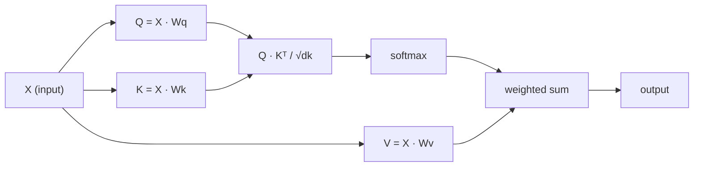

# Từ zero thực hiện sự chú ý

> Sự chú ý là một bảng câu hỏi, trong đó mỗi từ đều hỏi:

**类型：**构建
**语言：**Python
**先修要求：**Giai đoạn 3 (Thấu trúc học sâu), Giai đoạn 5 Bài học 10 (Tuyên theo trình tự)
**时间：**~ 90 phút

## Học mục tiêu

- 仅使用 NumPy 从零实现 quy mô điểm sản phẩm tự chú ý, bao gồm truy vấn/key/value 投影和 softmax 加权求和
- 构建多头注意层,用于拆分头、计算并行注意,并拼接结果
-  theo dõi sự chú ý của các mã thông báo 如何捕捉 Token 关系,并解释为什么除以 sqrt(d_k) có thể ngăn chặn softmax 和
-  áp dụng sự che giấu nguyên nhân, sẽ hướng tập trung 2 hướng 转换为 autoregressive(decoder-style)

## 问题

RNN một lần xử lý một token. Khi bạn đạt đến 50 token, thông tin của token thứ 1 đã bị nén 50 lần.

Bài luận Bahdanau năm 2014 về sự chú ý  thấu hiểu: Hãy để người giải mã quay lại xem từng vị trí của mỗi người giải mã, và quyết định vị trí nào đối với các bước hiện tại là quan trọng. Nhưng nó vẫn còn được thêm vào RNN trên. Bài luận "Cơ quan là tất cả những gì bạn cần" năm 2017 đưa ra một câu hỏi cấp bách hơn: Nếu sự chú ý là cơ chế duy nhất của nó? không có sự lặp lại. Không có sự xoay quanh. Chỉ có sự chú ý.

Sự chú ý tự trọng  để mỗi vị trí trong chuỗi đều có thể tham gia vào từng bước liên tục khác  Đó là lý do biến đổi 快速,可扩展且占主导地位

## 概念

### Các loại truy vấn cơ sở dữ liệu

Hãy tưởng tượng sự chú ý như một câu hỏi cơ sở dữ liệu mềm:

```
Traditional database:
  Query: "capital of France"  -->  exact match  -->  "Paris"

Attention:
  Query: "capital of France"  -->  similarity to ALL keys  -->  weighted blend of ALL values
```

Mỗi token sẽ tạo ra ba vector:
- **Query (Q)**Tôi đang tìm kiếm cái gì?
- **Key (K)**Tôi có chứa gì?
- **Value (V)**Nếu được chọn, tôi sẽ cung cấp thông tin gì?

Một truy vấn với tất cả các khóa của các sản phẩm điểm sẽ tạo ra điểm chú ý.

### Q、K、V 计算

Mỗi token được nhúng sẽ được thực hiện thông qua ba hình tử trọng lượng được học:

```
Input embeddings (sequence of n tokens, each d-dimensional):

  X = [x1, x2, x3, ..., xn]       shape: (n, d)

Three weight matrices:

  Wq  shape: (d, dk)
  Wk  shape: (d, dk)
  Wv  shape: (d, dv)

Projections:

  Q = X @ Wq    shape: (n, dk)      each token's query
  K = X @ Wk    shape: (n, dk)      each token's key
  V = X @ Wv    shape: (n, dv)      each token's value
```

Từ hình ảnh trên, đối với một Token:

```
             Wq
  x_i ------[*]------> q_i    "What am I looking for?"
       |
       |     Wk
       +----[*]------> k_i    "What do I contain?"
       |
       |     Wv
       +----[*]------> v_i    "What do I offer?"
```

### Matrix chú ý

Một khi bạn có được tất cả các token của Q,K,V, điểm chú ý sẽ hình thành một Matrix:

```
Scores = Q @ K^T    shape: (n, n)

              k1    k2    k3    k4    k5
        +-----+-----+-----+-----+-----+
   q1   | 2.1 | 0.3 | 0.1 | 0.8 | 0.2 |   <- how much q1 attends to each key
        +-----+-----+-----+-----+-----+
   q2   | 0.4 | 1.9 | 0.7 | 0.1 | 0.3 |
        +-----+-----+-----+-----+-----+
   q3   | 0.2 | 0.6 | 2.3 | 0.5 | 0.1 |
        +-----+-----+-----+-----+-----+
   q4   | 0.9 | 0.1 | 0.4 | 1.7 | 0.6 |
        +-----+-----+-----+-----+-----+
   q5   | 0.1 | 0.3 | 0.2 | 0.5 | 2.0 |
        +-----+-----+-----+-----+-----+

Each row: one token's attention over the entire sequence
```

Một lần xem một truy vấn  làm thế nào để quét tất cả các khóa: mỗi dòng đều sẽ cho mỗi token 打分,softmax Đưa điểm  chuyển thành trọng lượng, trong khi các vector ngữ cảnh là giá trị của gia tăng quyền hỗn hợp。

```figure
attention-matrix
```

### Sao lại phải cạn kiệt?

Các sản phẩm điểm sẽ tăng theo chiều kích dk  tăng lớn. Nếu dk = 64, các sản phẩm điểm có thể đạt đến vài xài, đưa softmax  đưa vào khu vực biến mất của Gradient.

```
Scaled scores = (Q @ K^T) / sqrt(dk)
```

Điều này sẽ giữ giá trị số trong phạm vi của các Gradients hữu ích có thể tạo ra tối đa mềm.

### Softmax sẽ chuyển điểm thành trọng lượng

Softmax 会将原始分数 转换为每行概率分布:

```
Raw scores for q1:   [2.1, 0.3, 0.1, 0.8, 0.2]
                            |
                         softmax
                            |
Attention weights:   [0.52, 0.09, 0.07, 0.14, 0.08]   (sums to ~1.0)
```

Bây giờ, mỗi token có một nhóm trọng lượng, cho thấy nó nên ở mức độ lớn đến mỗi token khác.

### Giá trị của quyền gia tăng và

Mỗi token cuối cùng là đầu ra của tất cả các vector giá trị của quyền tăng lên:

```
output_i = sum( attention_weight[i][j] * v_j  for all j )

For token 1:
  output_1 = 0.52 * v1 + 0.09 * v2 + 0.07 * v3 + 0.14 * v4 + 0.08 * v5
```

### 完整流程



Một行公式:

```
Attention(Q, K, V) = softmax( Q @ K^T / sqrt(dk) ) @ V
```

```figure
softmax-attention-scaling
```

##  xây dựng nó

### 步骤 1: Từ không thực hiện Softmax

Softmax 会将原始logits 转换为概率―为了数值稳定性,先减最大值―

```python
import numpy as np

def softmax(x):
    shifted = x - np.max(x, axis=-1, keepdims=True)
    exp_x = np.exp(shifted)
    return exp_x / np.sum(exp_x, axis=-1, keepdims=True)

logits = np.array([2.0, 1.0, 0.1])
print(f"logits:  {logits}")
print(f"softmax: {softmax(logits)}")
print(f"sum:     {softmax(logits).sum():.4f}")
```

### 步骤 2:Scaled dot-product attention

核心函数──接收 Q、K、V matrices,并返回注意输出 和重矩阵──

```python
def scaled_dot_product_attention(Q, K, V):
    dk = Q.shape[-1]
    scores = Q @ K.T / np.sqrt(dk)
    weights = softmax(scores)
    output = weights @ V
    return output, weights
```

### 步骤 3:带学习投影的 Tập thể tập trung vào bản thân

Một mô-đun tự quan tâm hoàn chỉnh, bao gồm sử dụng các matrix trọng lượng Wq、Wk、Wv có kích thước giống Xavier

```python
class SelfAttention:
    def __init__(self, d_model, dk, dv, seed=42):
        rng = np.random.default_rng(seed)
        scale = np.sqrt(2.0 / (d_model + dk))
        self.Wq = rng.normal(0, scale, (d_model, dk))
        self.Wk = rng.normal(0, scale, (d_model, dk))
        scale_v = np.sqrt(2.0 / (d_model + dv))
        self.Wv = rng.normal(0, scale_v, (d_model, dv))
        self.dk = dk

    def forward(self, X):
        Q = X @ self.Wq
        K = X @ self.Wk
        V = X @ self.Wv
        output, weights = scaled_dot_product_attention(Q, K, V)
        return output, weights
```

### 步骤 4: trong một câu trên hành trình

Để tạo ra một câu đậm nắp giả,并 quan sát trọng lượng chú ý.

```python
sentence = ["The", "cat", "sat", "on", "the", "mat"]
n_tokens = len(sentence)
d_model = 8
dk = 4
dv = 4

rng = np.random.default_rng(42)
X = rng.normal(0, 1, (n_tokens, d_model))

attn = SelfAttention(d_model, dk, dv, seed=42)
output, weights = attn.forward(X)

print("Attention weights (each row: where that token looks):\n")
print(f"{'':>6}", end="")
for token in sentence:
    print(f"{token:>6}", end="")
print()

for i, token in enumerate(sentence):
    print(f"{token:>6}", end="")
    for j in range(n_tokens):
        w = weights[i][j]
        print(f"{w:6.3f}", end="")
    print()
```

### 步骤 5: sử dụng heatmap ASCII 可视化 chú ý

Để tập trung vào trọng lượng của bạn, bạn sẽ có thể nhanh chóng nhận được kết quả.

```python
def ascii_heatmap(weights, tokens, chars=" ░▒▓█"):
    n = len(tokens)
    print(f"\n{'':>6}", end="")
    for t in tokens:
        print(f"{t:>6}", end="")
    print()

    for i in range(n):
        print(f"{tokens[i]:>6}", end="")
        for j in range(n):
            level = int(weights[i][j] * (len(chars) - 1) / weights.max())
            level = min(level, len(chars) - 1)
            print(f"{'  ' + chars[level] + '   '}", end="")
        print()

ascii_heatmap(weights, sentence)
```

## Sử dụng nó

PyTorch của `nn.MultiheadAttention`Làm đúng là những gì chúng tôi vừa xây dựng, ngoài ra bao gồm phân chia đa đầu và dự đoán đầu ra:

```python
import torch
import torch.nn as nn

d_model = 8
n_heads = 2
seq_len = 6

mha = nn.MultiheadAttention(embed_dim=d_model, num_heads=n_heads, batch_first=True)

X_torch = torch.randn(1, seq_len, d_model)

output, attn_weights = mha(X_torch, X_torch, X_torch)

print(f"Input shape:            {X_torch.shape}")
print(f"Output shape:           {output.shape}")
print(f"Attention weight shape: {attn_weights.shape}")
print(f"\nAttn weights (averaged over heads):")
print(attn_weights[0].detach().numpy().round(3))
```

关键区别: chú ý đa đầu 会并行运行多个注意功能, mỗi người có dự đoán Q、K、V của riêng mình,大小为 dk = d_model / n_head,然后拼接结果──这让模型能够同时参加不同类型的关系──

## 交付 nó

本课会产出:
- `outputs/prompt-attention-explainer.md`- Một thông qua các câu hỏi cơ sở dữ liệu để giải thích chú ý của prompt

## 练习

1. 修改 `scaled_dot_product_attention`, để nó chấp nhận một matrix mặt nạ có thể chọn, trước khi softmax sẽ đặt một số vị trí cho负无穷 (đó là cách làm việc của causal / decoder masking)
2. Từ zero để đạt được sự chú ý đa đầu:将 Q、K、V 拆分为`n_heads`个块, trên mỗi khối vận hành chú ý,拼接,并通过最终重矩阵 Wo 投影
3.  lấy hai câu khác nhau cùng chiều dài, nhập chúng vào cùng một bản mẫu SelfAttention, và so sánh các mô hình chú ý của chúng──What changed? what keep unchanged?

## 关键术语

| Term | 人们常说 | 实际含义 |
|------|----------------|----------------------|
| Query (Q) | “问题 Vector” | 输入的一个学习投影，表示这个 Token 正在寻找什么信息 |
| Key (K) | “标签 Vector” | 一个学习投影，表示这个 Token 包含什么信息，并会与 queries 进行匹配 |
| Value (V) | “内容 Vector” | 一个学习投影，携带会基于 attention scores 被聚合的实际信息 |
| Scaled dot-product attention | “Attention 公式” | softmax(QK^T / sqrt(dk)) @ V - 缩放可以防止高维中的 softmax 饱和 |
| Self-attention | “Token 看自己和其他 Token” | Q、K、V 都来自同一序列的 Attention，让每个位置都能 attend 到其他每个位置 |
| Attention weights | “关注程度” | 位置上的概率分布，由 scaled dot products 上的 softmax 产生 |
| Multi-head attention | “并行 Attention” | 使用不同 projections 运行多个 attention functions，然后拼接结果，以获得更丰富的 representations |

## 延伸阅读

- [Attention Is All You Need (Vaswani et al., 2017)](https://arxiv.org/abs/1706.03762)- 原始 biến đổi 论文
- [The Illustrated Transformer (Jay Alammar)](https://jalammar.github.io/illustrated-transformer/)- Giải thích hình ảnh tốt nhất cho toàn bộ cấu trúc
- [The Annotated Transformer (Harvard NLP)](https://nlp.seas.harvard.edu/annotated-transformer/)- 带解释的逐行 PyTorch 实现
