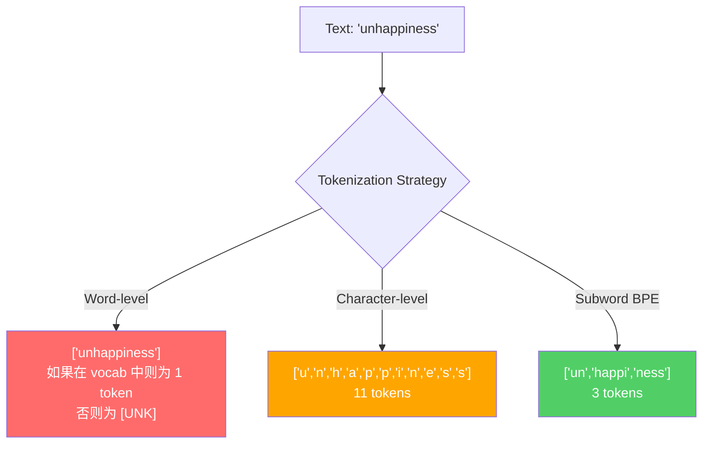
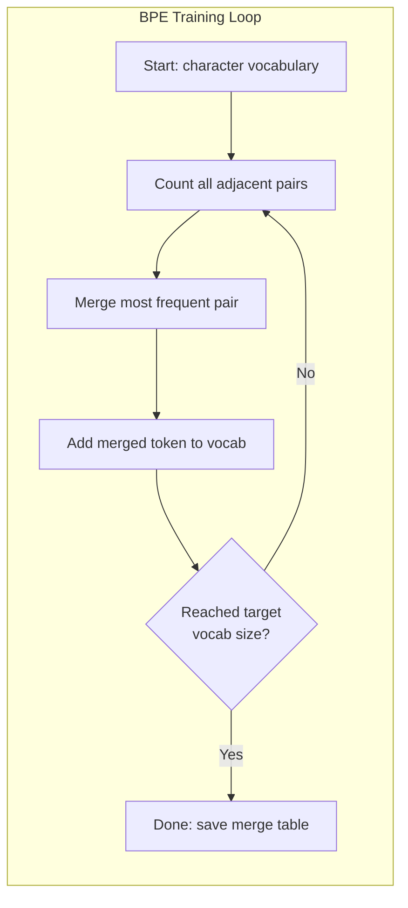
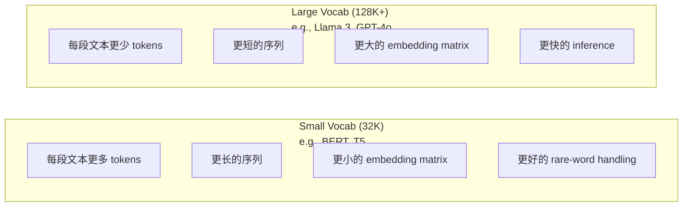

# Các token: BPE, WordPiece, SentencePiece

> Bạn của LLM không đọc tiếng Anh. Nó đọc toàn số. Tokenizer quyết định số nguyên số này mang theo ý nghĩa hay lãng phí.

**Type:** Build
**Languages:** Python
**Prerequisites:** Phase 05 (NLP Foundations)
**Time:** ~90 minutes

## Học mục tiêu
- Từ việc thực hiện BPE、WordPiece và Unigram tokenization algorithms, và so sánh các chiến lược sáp nhập của chúng
- 解释 quy mô từ vựng  làm thế nào ảnh hưởng đến hiệu quả mô hình: 过小会产生长序列, 过大会浪费嵌入参数
- 分析不同语言和代码中的代码化文物,识别特定代码化者 在哪里失效
- Sử dụng tiktoken và thư viện phrasespiece để token hóa văn bản, và kiểm tra ID token được tạo

## 问题
Bạn của LLM không đọc bằng tiếng Anh. Nó không đọc bằng bất kỳ ngôn ngữ nào. Nó đọc số.

Từ "Hello, world!" đến [15496, 11, 995, 0] khoảng cách là Tokenizer. Mỗi từ, mỗi trống, mỗi dấu chấm, đều phải được chuyển thành số nguyên, mô hình để xử lý nó.

Nếu làm sai, mô hình sẽ lãng phí dung lượng, sử dụng nhiều token để mã hóa từ ngữ thường thấy. "Thật không may" sẽ trở thành bốn token, chứ không phải một. Đối với văn bản dày đặc nhiều âm tiết từ ngữ, cửa sổ ngữ cảnh 128K của bạn thực sự đã giảm 75%. Nếu làm đúng, cùng một cửa sổ ngữ cảnh có thể mang lại ý nghĩa gấp đôi.

Bạn sẽ gọi GPT-4 hoặc Claude mỗi lần API, đều theo Token 定价―― mô hình tạo ra mỗi Token sẽ tiêu thụ tính toán―― cho thấy một đầu ra cần thiết Token 越少,端到端推断 就越快――Tokenization không phải là xử lý trước―― nó là kiến trúc――

## 概念
### 三种失败的方法 (một cách thất bại)

Để chuyển đổi văn bản thành số, có ba cách rõ ràng:

**Word-level tokenization**按空格和标点切分──"Căn khốn ngồi" 会变成 ["The", "cat", "sat"]──很简单──但"tokenization" 怎么办?"GPT-4o" 呢?或像"Geschwindigkeitsbegrenzung" 这样德语复合词呢?`[UNK]`token -- đó là mô hình trong nói我完全不知道这是什么── chỉ trong tiếng Anh có hơn một triệu loại hình từ──再加代码,URLs,科学计数法以及另外100种语言,你需要一个无限大的词汇──

**Character-level tokenization**走向另一个方向──"hello"会变成 ["h", "e", "l", "l", "o"]──词汇 很小(几百字符)──永远不会 có các biểu tượng không rõ ràng──但序列会变得极长──一个本来是10 字级 biểu tượng的句子,会变成50 字符级 biểu tượng──模型必须学会"t",、"h",、"e" 放在一起表示"the" -- 把注意力消耗在一个人类三岁就能学会的东西上──

**Subword tokenization**找到了平衡点──常见词保持完整:"the" 是一个代币──罕见词会分解成有意义的片段:"不快乐" 变成 ["un", "happy", "ness"]──词汇保持可控(30K到128K代币)──序列保持较短──未知代币 基本消失,因为任何词都可以由子词组成出来──

Mỗi LLM hiện đại đều sử dụng các chữ ký dưới dạng mã hóa. GPT-2、GPT-4、BERT、Llama 3、Claude -- 全都是── vấn đề nằm ở việc sử dụng các thuật toán nào.



### BPE: Mã hóa cặp byte

BPE là một thuật toán nén tham, sau đó được sử dụng lại để mã hóa.

Từ đơn ký tự bắt đầu. Từ mỗi cặp chữ cái có tần suất cao nhất của các ký tự có tần số cao nhất của các ký tự có tần số cao nhất của các ký tự có tần số cao nhất của các ký tự có tần số cao nhất của các ký tự có tần số cao nhất của các ký tự có tần số cao nhất của các ký tự có tần số cao nhất của các ký tự có tần số cao nhất của các ký tự có tần số cao nhất của các ký tự có tần số cao nhất của các ký tự có tần số cao nhất của các ký tự có tần số cao nhất của các ký tự có tần số cao nhất của các ký tự.

Dưới đây là một tập hợp rất nhỏ trên hoạt động BPE, trong đó bao gồm "hết""",hết" và "hết mới nhất":

```
Corpus（带 word frequencies）:
  "lower"  x5
  "lowest" x2
  "newest" x6

Step 0 -- 从字符开始:
  l o w e r       (x5)
  l o w e s t     (x2)
  n e w e s t     (x6)

Step 1 -- 统计相邻 pairs:
  (e,s): 8    (s,t): 8    (l,o): 7    (o,w): 7
  (w,e): 13   (e,r): 5    (n,e): 6    ...

Step 2 -- Merge 最高频 pair (w,e) -> "we":
  l o we r        (x5)
  l o we s t      (x2)
  n e we s t      (x6)

Step 3 -- 重新统计并 merge (e,s) -> "es":
  l o we r        (x5)
  l o we s t      (x2)    <- 'es' 只由 'e'+'s' 形成，不是 'we'+'s'
  n e we s t      (x6)    <- 等等，'we' 前面有 'e'，'we' 后面有 's'

实际精确跟踪如下:
  在 "we" merge 之后，剩余 pairs:
  (l,o): 7   (o,we): 7   (we,r): 5   (we,s): 8
  (s,t): 8   (n,e): 6    (e,we): 6

Step 3 -- Merge (we,s) -> "wes" 或 (s,t) -> "st"（同为 8，选第一个）:
  Merge (we,s) -> "wes":
  l o we r        (x5)
  l o wes t       (x2)
  n e wes t       (x6)

Step 4 -- Merge (wes,t) -> "west":
  l o we r        (x5)
  l o west        (x2)
  n e west        (x6)

...继续，直到达到目标 vocab size。
```

Bảng hợp nhất là Tokenizer. Nó sẽ mã hóa các mô hình mới, dựa trên các quy trình ứng dụng hợp nhất.



### BPE cấp bằng byte (GPT-2, GPT-3, GPT-4)

BPE chuẩn trên các ký tự Unicode 上运行──BPE cấpbyte 在原始字节(0-255) 上运行──This will give you a good 256 cơ bản từ vựng, có thể xử lý bất kỳ ngôn ngữ hoặc mã hóa, và sẽ không bao giờ tạo ra token không rõ──

GPT-2 đã đưa ra phương pháp này. Từ vựng cơ bản  phủ đầy mọi loại byte có thể. BPE hợp nhất được xây dựng trên đó.

- GPT-2: 50,257 token
- GPT-3.5/GPT-4: ~100,256 token (cl100k_base encoding)
- GPT-4o: 200,019 token (o200k_base encoding)

### WordPiece (BERT)

WordPiece trông giống như BPE, nhưng chọn cách hợp nhất khác nhau. Nó không sử dụng tần suất ban đầu, mà là tối đa hóa khả năng tập dữ liệu:

```
BPE merge criterion:      count(A, B)
WordPiece merge criterion: count(AB) / (count(A) * count(B))
```

BPE  hỏi: Phụ nữ nào xuất hiện thường xuyên nhất? WordPiece  hỏi: Phụ nữ nào xuất hiện thường xuyên hơn dự kiến? Sự khác biệt nhỏ này sẽ tạo ra các từ vựng khác nhau.

WordPiece còn sử dụng "##" để biểu thị các từ phụ tiếp tục:

```
"unhappiness" -> ["un", "##happi", "##ness"]
"embedding"   -> ["em", "##bed", "##ding"]
```

"##" tiền tố 告诉你这个片 延续前一个 Token──BERT 使用 WordPiece, từ vựng 为 30,522 token──每个 BERT biến thể -- DistilBERT,RoBERTa 的代号符号符号符号符号符号符号符号符号符号符号符号符号实际上是BPE,但BERT本身是 WordPiece──

### Câu (Llama, T5)

SentencePiece 把输入视为原始 Unicode characters 流, trong đó bao gồm空白符──没有预代码化步骤──没有关于词边界的语言特定规则──这使它真正做到语言无知--它适用于中文、日文、泰文以及其他不使用空格分隔词的语言──

SentencePiece 支持两种算法:
- **BPE mode**: tương tự như chuẩn BPE logic hợp nhất, được sử dụng cho các chuỗi chữ nguyên thủy
- **Unigram mode**Từ một từ vựng lớn  bắt đầu, sau đó 代 chuyển đối với toàn bộ khả năng  ảnh hưởng tối thiểu của Tokens── đó là quá trình ngược chiều của BPE - không là hợp nhất, mà là cắt.

Llama 2 sử dụng SentencePiece BPE, từ vựng là 32.000 token。T5 sử dụng SentencePiece Unigram, từ vựng là 32.000 token。 chú ý: Llama 3 切换到了基于TikToken的字节级 BPE Tokenizer,包含128.256 token。

### Số lượng từ vựng

Đây là một quyết định kỹ thuật thực sự, và có hậu quả có thể đo lường.



Đối với một từ vựng 128K và 4.096 维 nhúng, chỉ nhúng trật tự là 128.000 x 4.096 = 5.24 tỷ tham số. Đối với từ vựng 32K, thì là 1.31 tỷ tham số. Chỉ vì Tokenizer  chọn khác nhau, sẽ tạo ra 400M các tham số khác nhau.

Nhưng các từ vựng lớn hơn sẽ tăng cường hơn để nén văn bản. Với từ vựng 32K có thể cần 100 token, với từ vựng 128K có thể chỉ cần 70 token. Điều này có nghĩa là quá trình chuyển tiếp trong thời gian thế hệ sẽ giảm 30%. Đối với mô hình hàng triệu yêu cầu dịch vụ, điều này sẽ giảm trực tiếp chi phí tính toán.

趋势很明确: quy mô từ vựng 正在增长──GPT-2 使用 50,257──GPT-4 使用 ~100K──Llama 3 使用 128K──GPT-4o 使用 200K──

| Model | Vocab Size | Tokenizer Type | Avg Tokens per English Word |
|-------|-----------|----------------|---------------------------|
| BERT | 30,522 | WordPiece | ~1.4 |
| GPT-2 | 50,257 | Byte-level BPE | ~1.3 |
| Llama 2 | 32,000 | SentencePiece BPE | ~1.4 |
| GPT-4 | ~100,256 | Byte-level BPE | ~1.2 |
| Llama 3 | 128,256 | Byte-level BPE (tiktoken) | ~1.1 |
| GPT-4o | 200,019 | Byte-level BPE | ~1.0 |

### Thuế đa ngôn ngữ

Trong GPT-2 có một số token, mỗi từ trung bình cần 2-3 token. Trong Trung Quốc có thể có nhiều hơn. Điều này có nghĩa là chỉ có một nửa người dùng tiếng Anh trả cùng một giá, nhưng có được mật độ thông tin thấp hơn.

Đó là lý do tại sao Llama 3 sẽ mở rộng từ 32K lên 128K. Việc phân phối các mã thông báo không phải là chữ tiếng Anh càng nhiều, sự nén giữa các ngôn ngữ càng công bằng.


```figure
tokenizer-bpe
```

```figure
tokenizer-tradeoff
```

##  xây dựng nó
### 步骤 1: Character-Level Tokenizer

Từ nền bắt đầu. Tokenizer cấp tính sẽ hiển thị mỗi ký tự đến điểm mã Unicode của nó. Không cần đào tạo. Không có mã thông báo.

```python
class CharTokenizer:
    def encode(self, text):
        return [ord(c) for c in text]

    def decode(self, tokens):
        return "".join(chr(t) for t in tokens)
```

"Hello" sẽ biến thành [104, 101, 108, 108, 111]. Mỗi chữ cái đều là biểu tượng của riêng mình.

### 步骤 2: BPE Tokenizer từ đầu

Thực tế thực hiện. Chúng tôi đang tập trung vào các byte nguyên thủy.

```python
from collections import Counter

class BPETokenizer:
    def __init__(self):
        self.merges = {}
        self.vocab = {}

    def _get_pairs(self, tokens):
        pairs = Counter()
        for i in range(len(tokens) - 1):
            pairs[(tokens[i], tokens[i + 1])] += 1
        return pairs

    def _merge_pair(self, tokens, pair, new_token):
        merged = []
        i = 0
        while i < len(tokens):
            if i < len(tokens) - 1 and tokens[i] == pair[0] and tokens[i + 1] == pair[1]:
                merged.append(new_token)
                i += 2
            else:
                merged.append(tokens[i])
                i += 1
        return merged

    def train(self, text, num_merges):
        tokens = list(text.encode("utf-8"))
        self.vocab = {i: bytes([i]) for i in range(256)}

        for i in range(num_merges):
            pairs = self._get_pairs(tokens)
            if not pairs:
                break
            best_pair = max(pairs, key=pairs.get)
            new_token = 256 + i
            tokens = self._merge_pair(tokens, best_pair, new_token)
            self.merges[best_pair] = new_token
            self.vocab[new_token] = self.vocab[best_pair[0]] + self.vocab[best_pair[1]]

        return self

    def encode(self, text):
        tokens = list(text.encode("utf-8"))
        for pair, new_token in self.merges.items():
            tokens = self._merge_pair(tokens, pair, new_token)
        return tokens

    def decode(self, tokens):
        byte_sequence = b"".join(self.vocab[t] for t in tokens)
        return byte_sequence.decode("utf-8", errors="replace")
```

Loop đào tạo là cốt lõi của BPE: thống kê cặp, hợp nhất cặp thắng,重复── mỗi lần hợp nhất sẽ giảm tổng số token──经过`num_merges`Sau đó, từ vựng từ 256 ((base byte) tăng lên 256 + số_mối hợp.

Việc mã hóa sẽ theo học tập của sự sắp xếp chính xác của ứng dụng hợp nhất. Điều này rất quan trọng. Nếu hợp nhất 1 tạo ra "th", hợp nhất 5 tạo ra "the", thì việc mã hóa phải được áp dụng trước khi hợp nhất 1, để "the" được kết hợp 5 từ "th" + "e" hình thành.

Việc giải mã là một quá trình ngược: trong từ vựng 中查找每个 token ID,连接字节, sau đó giải mã cho UTF-8。

### 步骤 3: Mã hóa và giải mã Roundtrip

```python
corpus = (
    "The cat sat on the mat. The cat ate the rat. "
    "The dog sat on the log. The dog ate the frog. "
    "Natural language processing is the study of how computers "
    "understand and generate human language. "
    "Tokenization is the first step in any NLP pipeline."
)

tokenizer = BPETokenizer()
tokenizer.train(corpus, num_merges=40)

test_sentences = [
    "The cat sat on the mat.",
    "Natural language processing",
    "tokenization pipeline",
    "unhappiness",
]

for sentence in test_sentences:
    encoded = tokenizer.encode(sentence)
    decoded = tokenizer.decode(encoded)
    raw_bytes = len(sentence.encode("utf-8"))
    ratio = len(encoded) / raw_bytes
    print(f"'{sentence}'")
    print(f"  Tokens: {len(encoded)} (from {raw_bytes} bytes) -- ratio: {ratio:.2f}")
    print(f"  Roundtrip: {'PASS' if decoded == sentence else 'FAIL'}")
```

Tỷ lệ nén  nói với bạn Tokenizer có nhiều hiệu quả. tỷ lệ là 0,50 cho thấy Tokenizer sẽ nén văn bản thành các byte nguyên thủy một nửa số lượng Tokens.

### 步骤 4: So sánh với tiktoken

```python
import tiktoken

enc = tiktoken.get_encoding("cl100k_base")

texts = [
    "The cat sat on the mat.",
    "unhappiness",
    "Hello, world!",
    "def fibonacci(n): return n if n < 2 else fibonacci(n-1) + fibonacci(n-2)",
    "Geschwindigkeitsbegrenzung",
]

for text in texts:
    our_tokens = tokenizer.encode(text)
    tiktoken_tokens = enc.encode(text)
    tiktoken_pieces = [enc.decode([t]) for t in tiktoken_tokens]
    print(f"'{text}'")
    print(f"  Our BPE:   {len(our_tokens)} tokens")
    print(f"  tiktoken:  {len(tiktoken_tokens)} tokens -> {tiktoken_pieces}")
```

tiktoken sử dụng thuật toán hoàn toàn giống nhau, nhưng nó được đào tạo trên 100 GB 文本,并包含 100,000 合并.

### 步骤 5: Phân tích từ vựng

```python
def analyze_vocabulary(tokenizer, test_texts):
    total_tokens = 0
    total_chars = 0
    token_usage = Counter()

    for text in test_texts:
        encoded = tokenizer.encode(text)
        total_tokens += len(encoded)
        total_chars += len(text)
        for t in encoded:
            token_usage[t] += 1

    print(f"Vocabulary size: {len(tokenizer.vocab)}")
    print(f"Total tokens across all texts: {total_tokens}")
    print(f"Total characters: {total_chars}")
    print(f"Avg tokens per character: {total_tokens / total_chars:.2f}")

    print(f"\nMost used tokens:")
    for token_id, count in token_usage.most_common(10):
        token_bytes = tokenizer.vocab[token_id]
        display = token_bytes.decode("utf-8", errors="replace")
        print(f"  Token {token_id:4d}: '{display}' (used {count} times)")

    unused = [t for t in tokenizer.vocab if t not in token_usage]
    print(f"\nUnused tokens: {len(unused)} out of {len(tokenizer.vocab)}")
```

Đây sẽ tiết lộ phân phối Zipf trong từ vựng của bạn. Một số ít token chiếm chủ quyền.

## Sử dụng nó
BPE của bạn có thể làm việc. Bây giờ hãy xem công cụ sản xuất là gì.

### tiktoken (OpenAI)

```python
import tiktoken

enc = tiktoken.get_encoding("cl100k_base")

text = "Tokenizers convert text to integers"
tokens = enc.encode(text)
print(f"Tokens: {tokens}")
print(f"Pieces: {[enc.decode([t]) for t in tokens]}")
print(f"Roundtrip: {enc.decode(tokens)}")
```

tiktoken dùng Rust 编写,并提供 Python bindings── nó mỗi giây có thể mã hóa hàng triệu token── tương tự như BPE thuật toán, thực hiện cấp công nghiệp──

### Nhấp mặt tokeners

```python
from tokenizers import Tokenizer
from tokenizers.models import BPE
from tokenizers.trainers import BpeTrainer
from tokenizers.pre_tokenizers import ByteLevel

tokenizer = Tokenizer(BPE())
tokenizer.pre_tokenizer = ByteLevel()

trainer = BpeTrainer(vocab_size=1000, special_tokens=["<pad>", "<eos>", "<unk>"])
tokenizer.train(["corpus.txt"], trainer)

output = tokenizer.encode("The cat sat on the mat.")
print(f"Tokens: {output.tokens}")
print(f"IDs: {output.ids}")
```

Hugging Face Tokenizers Library  tầng dưới cùng là Rust── nó có thể được thực hiện trong vài giây dựa trên GB 级 corpora  huấn luyện BPE── đây là công cụ bạn sẽ sử dụng khi luyện tập mô hình của mình──

### Lắp đặt Tokenizer của Llama

```python
from transformers import AutoTokenizer

tokenizer = AutoTokenizer.from_pretrained("meta-llama/Llama-3.1-8B")

text = "Tokenizers are the unsung heroes of LLMs"
tokens = tokenizer.encode(text)
print(f"Token IDs: {tokens}")
print(f"Tokens: {tokenizer.convert_ids_to_tokens(tokens)}")
print(f"Vocab size: {tokenizer.vocab_size}")

multilingual = ["Hello world", "Hola mundo", "Bonjour le monde"]
for text in multilingual:
    ids = tokenizer.encode(text)
    print(f"'{text}' -> {len(ids)} tokens")
```

Thuật ngữ 128K của Llama 3 đối với sự nén của văn bản không tiếng Anh rõ ràng tốt hơn từ 50K của GPT-2. Bạn có thể tự chứng minh điều này - sử dụng nhiều ngôn ngữ mã hóa cùng một câu, sau đó thống kê Tokens.

## 交付 nó
本课会产出 `outputs/prompt-tokenizer-analyzer.md`- Một lời nhắc có thể lặp lại, được sử dụng để phân tích hiệu quả đánh dấu của bất kỳ văn bản và mô hình tập hợp.

## 练习
1. 修改 BPE Tokenizer,让它在每个 merge step 打印词汇――观察 "t" + "h" 如何变成 "th",然后 "th" + "e" 如何变成 "the"――跟踪常见英文词如何一步组装出来──

2. 向 BPE Tokenizer 添加 đặc biệt token(`<pad>``<eos>``<unk>`(■■■■■■■■■■■■■■■■■■■■■■■■■■■■■■■■■■■■■■■■■■■■■■■■■■■■■■■■■■■■■■■■■■■■■■■■■■■■■■■■■■■■■■■■■■■■■■■■■■■■■■■■■■■■■■■■■■■■■■■■■■■■■■■■■■■■■■■■■■■■■■■■■■■■■■■■■■■■■■■■■■■■■■■■■■■■■■■■■■■■■■■■■■■■■■■■■■■■■■■■■■■■■■■■■■■■■■■■■■■■■■■■■■■■■■■■■■■■■■■■■■■■■■■■■■■■■■■■■■■■■■■■■■■■■■■■■■■■■■■■■■■■■■■■■■■■■■■■■■■■■■■■■■■■■■■■■■■■■■■■■■■■■■■■■■■■■■■■■■■■■■■■■■■■■■■■■■■■■■■■■■■■■■■■■■■■■■■■■■■■■■■■■■■■■■■■■■■■■■■■■■■■■■■■■■■■■■■■■■■■■■■■■■■■■■■■■■■■■■■■■■■■■■■■■■■■■■■■■■■■■■■■■■■■■■■■■■■■■■■■■■■■■■■■■■■■■■■■■■■■■■■■■■■■■

3. 实现 WordPiece merge criterion ()                                                                                                                                                                                                                                                         

4. Xây dựng một tiêu chuẩn hiệu quả Tokenizer đa ngôn ngữ. Chọn 10 câu. Sử dụng tiktoken (cl100k_base) để token hóa mỗi câu, và đo trung bình mỗi chữ cái.

5. Trong một tập hợp lớn hơn, bạn sẽ được tập trung vào các mã thông báo BPE của mình.

## 关键术语
| Term | What people say | What it actually means |
|------|----------------|----------------------|
| Token | “一个词” | 模型 vocabulary 中的一个单元 -- 可以是字符、subword、word，或 multi-word chunk |
| BPE | “某种压缩东西” | Byte Pair Encoding -- 迭代 merge 出现最频繁的相邻 token pair，直到达到目标 vocabulary size |
| WordPiece | “BERT 的 Tokenizer” | 类似 BPE，但 merges 最大化 likelihood ratio count(AB)/(count(A)*count(B))，而不是原始 frequency |
| SentencePiece | “一个 Tokenizer library” | 一种 language-agnostic Tokenizer，在没有 pre-tokenization 的情况下直接处理原始 Unicode，并支持 BPE 和 Unigram algorithms |
| Vocabulary size | “它知道多少词” | 唯一 Tokens 的总数：GPT-2 有 50,257，BERT 有 30,522，Llama 3 有 128,256 |
| Fertility | “不是 Tokenizer 术语” | 每个词的平均 Tokens 数 -- 衡量 Tokenizer 在不同语言上的效率（1.0 是理想值，3.0 表示模型要多工作三倍） |
| Byte-level BPE | “GPT 的 Tokenizer” | 在原始 bytes（0-255）而不是 Unicode characters 上运行的 BPE，保证任何输入都不会产生 unknown tokens |
| Merge table | “Tokenizer 文件” | 训练期间学习到的有序 pair merges 列表 -- 这就是 Tokenizer 本身，而且顺序很重要 |
| Pre-tokenization | “按空格切分” | 在 subword tokenization 之前应用的规则：whitespace splitting、digit separation、punctuation handling |
| Compression ratio | “Tokenizer 有多高效” | 生成的 Tokens 数除以输入 bytes 数 -- 越低表示压缩越好，inference 越快 |

## 延伸阅读
- [Sennrich et al., 2016 -- "Neural Machine Translation of Rare Words with Subword Units"](https://arxiv.org/abs/1508.07909)Bài báo này sẽ giới thiệu BPE vào NLP, đưa một thuật toán nén năm 1994 trở thành nền tảng của token hóa hiện đại.
- [Kudo & Richardson, 2018 -- "SentencePiece: A simple and language independent subword tokenizer"](https://arxiv.org/abs/1808.06226)-- Tokenization ngôn ngữ-agnostic, làm cho các mô hình đa ngôn ngữ 变得实用
- [OpenAI tiktoken repository](https://github.com/openai/tiktoken)-- 用 Rust 编写并带有Python liên kết 实现 BPE cấp sản xuất, bởi GPT-3.5/4/4o 使用
- [Hugging Face Tokenizers documentation](https://huggingface.co/docs/tokenizers)-- 具備Rust 性能的生产级Tokenizer đào tạo
