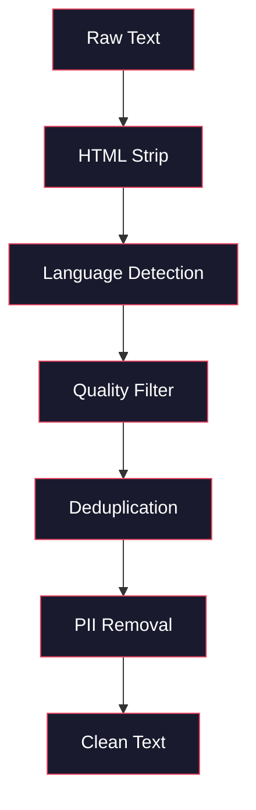
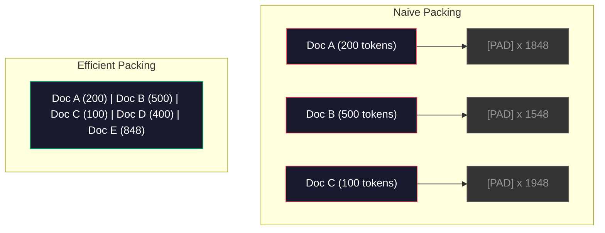

# Các đường ống dữ liệu trước đào tạo

> Mô hình là một tấm gương. Nó sẽ phản ánh bất kỳ dữ liệu nào bạn cung cấp cho nó. Nó sẽ phản ánh chất rác một cách hoàn hảo.

**Type:** Build
**Languages:** Python
**Prerequisites:** Phase 10, Lessons 01-02 (Tokenizers, Building a Tokenizer)
**Time:** ~90 minutes

## Học mục tiêu

- Xây dựng một đường ống dữ liệu trực tuyến, trong trường hợp không tải tất cả dữ liệu vào bộ nhớ, thực hiện Tokenization, chia khối, nhộn và batch đối với TB 级 văn bản
- 实现真实预训管线 中使用的数据质量过器(duplication、语言检测、内容过器)
- 创建固长度训练序列,并正确处理注意力面具 和文档边界
- Tạo thông qua đường ống hồ sơ, đảm bảo tải dữ liệu có thể theo dõi GPU đào tạo tốc độ

## 问题

Anh đã có một Tokenizer. Bây giờ anh cần dữ liệu.

Không phải là một tập dữ liệu, không phải là một CSV 文件, mà là TB 级文本:经过清洗,减倍,质量过,Tokenization thành một chuỗi độ dài cố định,并以足够快的速度作为随机批量提供, đảm bảo tập hợp 8GPU của bạn sẽ không bao giờ chờ đợi cho lô tiếp theo.

大多数人认为训练一个LLM的核心是模型架构――并不是――Llama 3 sử dụng 15.6 nghìn tỷ Token――GPT-3 sử dụng 300 nghìn tỷ――DeepSeek-V2 sử dụng 8.1 nghìn tỷ――这三者的架构大体相同:堆叠的变压器块,包含注意和前层――输出质量差异压倒性地来自数据――

Bài báo của DeepMind của Chinchilla đã chỉ ra điều này một cách chính xác. Đối với ngân sách tính toán, mô hình số lượng và số lượng token đào tạo nhất định, có tỷ lệ tốt nhất. Chinchilla cho thấy, phần lớn các mô hình năm 2022 bị thiếu đào tạo nghiêm trọng: so với số lượng dữ liệu mà chúng thấy, số lượng của chúng quá nhiều. Một mô hình số 70B được đào tạo trên 1,4 nghìn tỷ token (Chinchilla-optimal) tốt hơn một mô hình 280B được đào tạo trên 300 tỷ token (Gopher) [2].

Đường dẫn dữ liệu của bạn quyết định mô hình của bạn học được là ngôn ngữ hay tiếng ồn.

## 核心概念

### Số liệu từ đâu

Mỗi mô hình ngôn ngữ lớn được đào tạo trên các nguồn dữ liệu hỗn hợp khác nhau. Đối với hầu hết các phòng thí nghiệm, thành phần dữ liệu chính xác là bí mật nghiêm ngặt, nhưng chúng ta đã biết đủ nhiều để có thể hiểu các loại này.

| Source | Size | Quality | Used By |
|--------|------|---------|---------|
| Common Crawl | ~250 TB raw | 低（需要大量过滤） | GPT-3, Llama, most open models |
| Wikipedia | ~20 GB | 高 | Every major LLM |
| GitHub code | ~1 TB+ | 中等（大量重复、废弃代码） | StarCoder, CodeLlama, DeepSeek-Coder |
| Books (BookCorpus, Pile) | ~100 GB | 高 | GPT-2, GPT-3, early models |
| Academic papers (arXiv, S2ORC) | ~100 GB | STEM 领域质量高 | Llama, Galactica |
| StackOverflow, Reddit | ~100 GB | 中等 | Llama, Falcon |
| Curated web (C4, RefinedWeb) | ~5 TB | 中高（已预过滤） | T5, Falcon |

Llama 3 tiết lộ tỷ lệ data hỗn hợp của nó: khoảng 50% dữ liệu web, 25% mã, 13% sách và bài học, 8% dữ liệu toán học, cũng như 4% dữ liệu web đa ngôn ngữ.

Ví dụ và tổng số cũng quan trọng. Dữ liệu web quá nhiều, mô hình sẽ trở thành Reddit. Mã quá ít, nó không thể lập trình.

### Số liệu làm sạch

Dữ liệu web nguyên thủy 很脏── một loại dump Common Crawl 包含:

- Tags HTML và JavaScript
- 模板化 tiêu đề, chân, menu di chuyển
- 重复页面(完全重复和近似重复)
- 机器生成的垃圾邮件
- Thông tin nhận dạng cá nhân (PII)
- 低质量文本(关键词列表、SEO spam)
- 以文本形式编码的非文本内容

清洗不是选项――它 quyết định mô hình là tạo ra đoạn liên tục, hoặc xuất ra các thẻ HTML hỗn hợp trong danh sách sản phẩm――



Mỗi bước sẽ loại bỏ một loại tiếng ồn:

**HTML stripping:**移除所有标记──只保留可见文本内容──像 `trafilatura`Hoặc`readability`Như vậy thư viện sẽ lấy nội dung bài viết, đồng thời bỏ đi hướng dẫn, quảng cáo và mô hình hóa nội dung.

**Language detection:**Sử dụng mô hình nhận dạng ngôn ngữ FastText (được dùng để phân loại các tài liệu trong các phiên bản khác) nếu một tài liệu được phân loại cho tiếng Anh, nhưng độ tin cậy thấp hơn 0,8, nó có thể không phải là tiếng Anh sạch.

**Quality filtering:**Đây bắt đầu trở nên thú vị. (RefinedWeb:Falcon:Background) sử dụng các bộ lọc dựa trên sự phức tạp: trước tiên trên Wikipedia đào tạo một mô hình ngôn ngữ nhỏ, sau đó cho mỗi tài liệu đánh phân.

**Deduplication:**单个最有影响力的清洗步骤――Common Crawl 包含海量重复页面:法律免责声明、cookie notifications、服务条款―― 在重复数据上训练会浪费计算,并可能导致模型记忆并逐字吐出特定段落――

**PII removal:**姓名、电子邮件地址、电话号码、社会安全号码── đối với cấu trúc PII sử dụng kiểm tra dựa trên regex, đối với các mô hình NER sử dụng姓名在上下文中的检测──

### Sử dụng MinHash làm giảm trùng lặp

精确分复 很容易: làm hash,移除重复项对每个文档. Nhưng vấn đề thực sự là gần似重复.

MinHash + Hashing nhạy cảm với địa điểm (LSH) có thể cao hiệu quả giải quyết vấn đề này.


Ý tưởng như:

1. **Shingling:**将每个文档转换为 n-gram 集合(例如词或字符的5gram) ――"cũng rỗng nâu" 使用3 từ sẽ biến thành {"cũng nâu", "rỗng nâu nhanh"}。

2. **MinHash:**Đối với mỗi tập hợp vỏ bọc của tài liệu, tính toán k 个 hash 值── mỗi hash 值 là hàm hash khác nhau dưới cùng hash tối thiểu của tất cả vỏ bọc── như vậy sẽ tạo ra một chữ ký  quy mô cố định, được sử dụng để ước tính gần gũi sự tương đồng Jaccard giữa hai tài liệu nào đó──

3. **LSH:**Theo ban nhạc ký kết của MinHash, hãy phân nhóm các tài liệu thành các vỏ trong.

4. **Verify:**Đối với mỗi cặp ứng cử viên, tính toán sự tương đồng của Jaccard chính xác. Nếu sự tương đồng vượt quá giá trị, thường là 0,8, bạn sẽ di chuyển một副本.

Llama 团队 báo cáo rằng, họ đã di chuyển khoảng 38% dữ liệu web thông qua sao chép. Đây không phải là một con số nhỏ.

### Sắp xếp theo trình tự

Mô hình của bạn mong đợi định kỳ bước nhập của chuỗi. Dường hồ sơ của bạn là thay đổi. Có một số là 50 Token. Có một số là 50,000 Token.

简单做法:把每个文档pad到最大序列长度──这将在学习无贡献的填充标记上浪费大量计算──

Cách tốt hơn: Đặt nhiều tài liệu gói vào một chuỗi, không sử dụng cuối chuỗi token chia rẽ. Một 2048-Token của chuỗi có thể chứa ba tài liệu ngắn, giữa sử dụng [EOS] token 拼接。



Mặt nạ chú ý 必须正确设置──同一个包装序列 中,Document A 的 Token 不应关注 Document B 的 Token──这需要一个块角的注意面罩──

长文档会在序列边界处被切断或拆分成碎片──拆分点很重要:在句子中分会迫使模型看到不完整的思路──有些管道会尽可能把拆分对齐到段落或句子边界──

### Luật quy mô Chinchilla

Đối với ngân sách tính toán cố định C(以 FLOPs 衡量), mô hình tốt nhất là:

```
N_opt ~ C^0.5
D_opt ~ C^0.5
```

Trong thực tế, điều này có nghĩa là bạn nên lớn tương đương tỷ lệ mở rộng mô hình lớn và tập dữ liệu lớn. Một mô hình có nhiều số lượng hơn 10x, cần khoảng 10x mã thông báo để đạt được cùng một Loss.

| Model | Parameters | Training Tokens | Chinchilla-Optimal? |
|-------|-----------|----------------|-------------------|
| GPT-3 | 175B | 300B | 否（undertrained 3-4x） |
| Chinchilla | 70B | 1.4T | 是（按设计） |
| Llama 2 | 70B | 2T | Overtrained（有意为之） |
| Llama 3 | 70B | 15T | 严重 overtrained |

Llama 3 cố ý vi phạm luật Chinchilla. Meta phát hiện ra, trên nhiều dữ liệu quá trình đào tạo, tỷ lệ tối ưu tính toán vượt quá, sẽ tạo ra mô hình phù hợp hơn với suy luận.


```figure
l5-data-pipeline
```

##  xây dựng nó

### 步骤 1: Làm sạch văn bản

剥离 HTML、规范化白空间、移除文本内容──我们将使用公共领域文本(Project Gutenberg) như một tập hợp nhỏ──

```python
import re

def clean_text(text):
    text = re.sub(r"<[^>]+>", "", text)
    text = re.sub(r"http\S+", "", text)
    text = re.sub(r"[^\x20-\x7E\n]", "", text)
    text = re.sub(r"\n{3,}", "\n\n", text)
    text = re.sub(r" {2,}", " ", text)
    return text.strip()

def quality_filter(text, min_words=50, max_ratio_caps=0.3, max_ratio_special=0.1):
    words = text.split()
    if len(words) < min_words:
        return False
    caps_ratio = sum(1 for w in words if w.isupper()) / len(words)
    if caps_ratio > max_ratio_caps:
        return False
    special_chars = sum(1 for c in text if not c.isalnum() and not c.isspace())
    if special_chars / max(len(text), 1) > max_ratio_special:
        return False
    return True
```

Bộ lọc chất lượng này sẽ bắt được spam SEO (tất cả các CAPS) ✓ máy tạo tiếng ồn (tỷ lệ chữ đặc biệt cao) và các trang stub (từ ngắn) ✓ Chỉ có ba kiểm tra này, bạn có thể di chuyển một số lượng rác đáng kinh ngạc trong các quét web ✓

### 步骤 2: MinHash Deduplication

Từ零实现 MinHash── không cần thư viện bên ngoài, chỉ cần `hashlib`

```python
import hashlib
from collections import defaultdict

def get_shingles(text, k=5):
    words = text.lower().split()
    if len(words) < k:
        return set()
    return {" ".join(words[i:i+k]) for i in range(len(words) - k + 1)}

def minhash_signature(shingles, num_hashes=128):
    signature = []
    for i in range(num_hashes):
        min_hash = float("inf")
        for shingle in shingles:
            h = int(hashlib.sha256(f"{i}:{shingle}".encode()).hexdigest(), 16)
            min_hash = min(min_hash, h)
        signature.append(min_hash)
    return signature

def lsh_buckets(signature, bands=16):
    rows_per_band = len(signature) // bands
    buckets = []
    for b in range(bands):
        start = b * rows_per_band
        band_data = tuple(signature[start:start + rows_per_band])
        bucket_hash = hashlib.md5(str(band_data).encode()).hexdigest()
        buckets.append((b, bucket_hash))
    return buckets

def deduplicate(documents, threshold=0.8, num_hashes=128, bands=16):
    signatures = []
    shingle_sets = []
    for doc in documents:
        shingles = get_shingles(doc)
        shingle_sets.append(shingles)
        signatures.append(minhash_signature(shingles, num_hashes))

    bucket_map = defaultdict(list)
    for doc_idx, sig in enumerate(signatures):
        for band_id, bucket_hash in lsh_buckets(sig, bands):
            bucket_map[(band_id, bucket_hash)].append(doc_idx)

    duplicate_pairs = set()
    for bucket_docs in bucket_map.values():
        if len(bucket_docs) < 2:
            continue
        for i in range(len(bucket_docs)):
            for j in range(i + 1, len(bucket_docs)):
                duplicate_pairs.add((bucket_docs[i], bucket_docs[j]))

    removed = set()
    for i, j in duplicate_pairs:
        if i in removed or j in removed:
            continue
        s1, s2 = shingle_sets[i], shingle_sets[j]
        if not s1 or not s2:
            continue
        jaccard = len(s1 & s2) / len(s1 | s2)
        if jaccard >= threshold:
            removed.add(j)

    return [doc for idx, doc in enumerate(documents) if idx not in removed], len(removed)
```

`num_hashes=128`和 `bands=16`参数控制精度回忆 tradeoff──更多哈希将给出更准确的相似性──估计──更多频段将提高回忆──捕捉更多重复项),代价是更多的虚假积极──这些值对典型的网页文本 效果很好──

### 步骤 3: Đánh dấu và đóng gói chuỗi

Nhận được văn bản được làm sạch và sao chép, thực hiện việc đánh dấu nó, và đóng gói thành các chuỗi độ dài cố định của đào tạo.

```python
def tokenize_corpus(documents, tokenizer):
    all_tokens = []
    for doc in documents:
        tokens = tokenizer.encode(doc)
        all_tokens.extend(tokens)
        all_tokens.append(tokenizer.eos_id)
    return all_tokens

def pack_sequences(token_ids, seq_length, pad_id=0):
    sequences = []
    attention_masks = []
    for i in range(0, len(token_ids), seq_length):
        seq = token_ids[i:i + seq_length]
        mask = [1] * len(seq)
        if len(seq) < seq_length:
            pad_count = seq_length - len(seq)
            seq = seq + [pad_id] * pad_count
            mask = mask + [0] * pad_count
        sequences.append(seq)
        attention_masks.append(mask)
    return sequences, attention_masks
```

### Bước 4: Sử dụng DataLoader được đào tạo

产出包装序列的随机批量──这就是训练循环 消费的内容──

```python
import random

class PreTrainingDataLoader:
    def __init__(self, sequences, attention_masks, batch_size, shuffle=True):
        self.sequences = sequences
        self.attention_masks = attention_masks
        self.batch_size = batch_size
        self.shuffle = shuffle

    def __len__(self):
        return (len(self.sequences) + self.batch_size - 1) // self.batch_size

    def __iter__(self):
        indices = list(range(len(self.sequences)))
        if self.shuffle:
            random.shuffle(indices)
        for start in range(0, len(indices), self.batch_size):
            batch_idx = indices[start:start + self.batch_size]
            batch_seqs = [self.sequences[i] for i in batch_idx]
            batch_masks = [self.attention_masks[i] for i in batch_idx]
            yield batch_seqs, batch_masks
```

### 步骤 5: Đồ sơ thống kê

计算重要数字:总 Token 数、唯一 Token 数、压缩比例、文档长度分布──

```python
from collections import Counter

def compute_statistics(documents, token_ids, sequences, tokenizer_vocab_size):
    total_chars = sum(len(d) for d in documents)
    total_tokens = len(token_ids)
    unique_tokens = len(set(token_ids))
    compression_ratio = total_chars / total_tokens

    doc_lengths = [len(d.split()) for d in documents]
    avg_doc_length = sum(doc_lengths) / max(len(doc_lengths), 1)
    max_doc_length = max(doc_lengths) if doc_lengths else 0
    min_doc_length = min(doc_lengths) if doc_lengths else 0

    token_counts = Counter(token_ids)
    top_tokens = token_counts.most_common(10)

    non_pad_tokens = sum(sum(1 for t in seq if t != 0) for seq in sequences)
    total_positions = sum(len(seq) for seq in sequences)
    utilization = non_pad_tokens / max(total_positions, 1)

    stats = {
        "total_documents": len(documents),
        "total_characters": total_chars,
        "total_tokens": total_tokens,
        "unique_tokens": unique_tokens,
        "vocab_utilization": unique_tokens / tokenizer_vocab_size,
        "compression_ratio": compression_ratio,
        "avg_doc_length_words": avg_doc_length,
        "max_doc_length_words": max_doc_length,
        "min_doc_length_words": min_doc_length,
        "num_sequences": len(sequences),
        "sequence_utilization": utilization,
        "top_10_tokens": top_tokens,
    }
    return stats
```

Tỷ lệ nén  nói cho bạn Tokenizer trên corpus này có nhiều hiệu quả hơn. English text thường nén đến mỗi token khoảng 3-4 ký tự. Nếu bạn thấy mỗi token 1,5 ký tự, hãy cho biết Tokenizer của bạn đã quá mạnh mẽ. Nếu bạn thấy 8+, hãy cho rằng nó đã học được sự hợp nhất trong một lĩnh vực rất cụ thể.

Sử dụng chuỗi  cho bạn biết có nhiều dữ liệu thực trong chuỗi đóng gói, chứ không phải là đệm.

## Sử dụng nó

### Khối với HuggingFace Datasets

通过 HuggingFace's datasets library 加载同一个体,并比较管道速度

```python
from datasets import load_dataset
from transformers import AutoTokenizer

ds = load_dataset("wikitext", "wikitext-2-raw-v1", split="train")
tokenizer = AutoTokenizer.from_pretrained("meta-llama/Meta-Llama-3-8B")

import time

start = time.time()
tokenized = ds.map(
    lambda x: tokenizer(x["text"], truncation=True, max_length=2048),
    batched=True,
    num_proc=4,
)
hf_time = time.time() - start
total_tokens = sum(len(t) for t in tokenized["input_ids"])
print(f"HuggingFace: {total_tokens:,} tokens in {hf_time:.2f}s ({total_tokens/hf_time:,.0f} tokens/sec)")
```

HuggingFace pipeline ở tầng dưới sử dụng Rust tokenizers, và 4 个核心上进行并行处理.

## 交付 nó

本课会产出一个快速,用于验证和调试 LLM 训练管道 中的数据质量──见`outputs/prompt-data-quality-checker.md`

## 练习

1. **Easy:**Sử dụng một phương pháp đơn giản để khởi động ({{lang-en}}) để làm sạch ống dẫn 添加语言检测── chỉ giữ English文档,并测量有多少文档被移除──
2. **Medium:**Ngoài việc giảm trùng lặp gần MinHash, sử dụng sục sục SHA-256 để thực hiện giảm trùng lặp chính xác.
3. **Hard:**构建一个基于复杂性的质量过器──在Wikipedia 文本上训练一个小型大法语模型,根据复杂性给每个文档打分,并移除底部20%──比较在过和未过数据上训练时的模型输出质量──

## 关键术语

| Term | 人们通常怎么说 | 它真正的含义 |
|------|----------------|----------------------|
| Common Crawl | “互联网” | 一个每月抓取 web 的非营利组织：约 250TB 原始数据，是大多数 LLM 训练数据的起点 |
| MinHash | “某种 hashing trick” | 一种使用固定大小 signature 来估计集合间 Jaccard similarity 的技术：支持大规模 near-duplicate detection |
| LSH | “Locality-Sensitive Hashing” | 一种把相似项分到同一 bucket 的方法：将 pairwise comparisons 从 O(n^2) 降到接近线性 |
| Sequence packing | “拼接文档” | 用正确的 attention masks 把多个文档放入固定长度序列：消除 padding 浪费 |
| Chinchilla scaling | “在更多数据上训练” | 对于固定计算预算，最优性能要求模型大小和训练 Token 数大致等比例扩展 |
| Fertility | “Tokens per word” | 每个词平均对应的 Token 数：GPT-4 中英文约为 1.3，非拉丁文字系统更高 |
| Data mixing | “选择训练数据” | code、text、math、multilingual data 之间的比例：没有公式，需要实验 |
| Perplexity filter | “质量打分” | 使用小型语言模型给文档打分：高 perplexity 意味着文本不像干净的 reference data |
| Deduplication | “移除副本” | 消除完全重复和近似重复文档：通常会移除 30-40% 的原始 web data |
| Attention mask | “要看哪些 Token” | 一种 binary mask，用于阻止 packed sequences 中跨文档边界的 Attention |

## 延伸阅读

- [Hoffmann et al., 2022 -- Training Compute-Optimal Large Language Models (Chinchilla)](https://arxiv.org/abs/2203.15556)--  thay đổi cách chúng ta hiểu quy mô dữ liệu
- [Penedo et al., 2023 -- The RefinedWeb Dataset for Falcon LLM](https://arxiv.org/abs/2306.01116)-- 如何将普通爬虫 过成高质量数据
- [Touvron et al., 2023 -- Llama 2: Open Foundation and Fine-Tuned Chat Models](https://arxiv.org/abs/2307.09288)-- Llama 2 của hệ thống dữ liệu 细节
- [Lee et al., 2022 -- Deduplicating Training Data Makes Language Models Better](https://arxiv.org/abs/2107.06499)- Tại sao sao việc sao chép lại lại lại quan trọng hơn bạn nghĩ
- [Broder, 1997 -- On the Resemblance and Containment of Documents](https://ieeexplore.ieee.org/document/666900)- giấy MinHash ban đầu
- [Meta, 2024 -- Llama 3 Technical Report](https://arxiv.org/abs/2407.21783)-- 15.6T Token DATA mixing ratios  filtration pipeline
