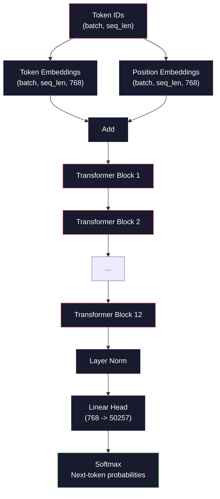
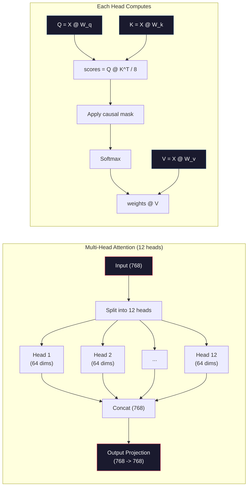
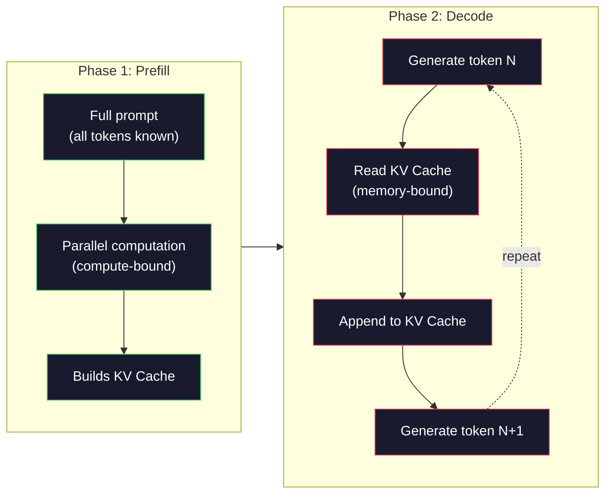

# Từ零 Pre-Training một Mini GPT ((124M 参数)

> GPT-2 Small có 1.24 tỷ tham số. Đó là 12 lớp Transformer, 12 đầu chú ý, cũng như 768 维 Embedding. Bạn có thể tập luyện nó từ 0 giờ trên một khối GPU. Hầu hết mọi người không bao giờ làm như vậy. Họ sử dụng điểm kiểm tra được đào tạo trước. Nhưng nếu bạn không thực sự đào tạo một cái, bạn thực sự không hiểu những gì đang xảy ra bên trong mô hình mà bạn đang xây dựng sản phẩm dựa trên.

**类型：**Xây dựng
**语言：**Python (với numpy)
**前置要求：**Giai đoạn 10,Dạy 01-03 ((Tokenizer, xây dựng một Tokenizer, đường ống dữ liệu)
**时间：**~ 120 phút

## Học mục tiêu
- Từ zero thực hiện hoàn chỉnh GPT-2 架构(124M 参数):Token Embeddings、position embeddings、Transformer blocks, cũng như đầu mô hình ngôn ngữ
- Sử dụng dự đoán mã thông báo tiếp theo và mất tích entropy chéo, trong văn bản ngữ料 trên đào tạo mô hình GPT
- 实现带 nhiệt độ lấy mẫu với top-k/top-p lọc của tự rút 文本生成
- 监控 training loss curves,并验证模型学到了连贯的语言模式

## 问题
Bạn biết Transformer là gì. Bạn đã xem những bức tranh đó. Bạn có thể rút ra sự chú ý là tất cả những gì bạn cần.

Tất cả điều này không có nghĩa là bạn hiểu được những gì đã xảy ra khi mô hình tạo văn bản.

GPT-2 Small (với liên kết trọng lượng) có 124,438,272 个参数. Mỗi参数 đều được thiết lập thông qua vòng đào tạo vận hành: đi trước, tính toán mất, đi ngược, cập nhật trọng lượng. 12 khối Transformer. Mỗi khối 12 đầu chú ý. Một không gian nhúng 768 维. Một chứa 50,257 个 nhận mã thông báo. Mỗi khi mô hình tạo ra một mã thông báo, tất cả 1.24 tỷ các参数 đều tham gia vào một chuỗi nhân đúc tử liệu: nó tiếp theo một chuỗi ID mã thông báo, và xuất ra một chuỗi phân bố tỷ lệ của mã thông báo.

Nếu bạn chưa từng tự xây dựng tất cả những thứ này, bạn đang sử dụng một hộp đen. Bạn có thể sử dụng API. Bạn có thể điều chỉnh tốt. Nhưng khi có vấn đề, bạn bị ảo giác khi mô hình lặp lại bản thân bạn không tuân theo hướng dẫn. Bạn không biết về mô hình tâm lý của mình.

Bài học này sẽ được thực hiện từ zero cấu trúc GPT-2 Small── không sử dụng PyTorch── sử dụng numpy── mỗi lần nhân số Matrix đều có thể nhìn thấy── mỗi Gradient đều được tính bởi mã của bạn── bạn sẽ chính xác thấy 1.24 tỷ số làm thế nào để cùng tác động để dự đoán một từ tiếp theo──

## 概念
### Kiến trúc GPT

GPT là một mô hình ngôn ngữ tự động. Autoregressive 的意思是它一次生成一个代币,每个代币都基于前面所有代币.

Dưới đây là biểu đồ tính toán hoàn chỉnh từ ID token đến xác suất token tiếp theo:

1. ID mã 输入。Shape: (batch_size, seq_len)。
2. Địa chỉ Nhập tìm kiếm。 mỗi ID 映射到一个 768 维 矢量。 hình dạng: (batch_size, seq_len, 768)。
3. Định vị Đáp nhập tìm kiếm── mỗi vị trí(0, 1, 2, ...)映射到一个768 维 矢量──形相同──
4. 将 Đơn vị nhập + vị trí nhập 相加。
5. 通過 12 个 biến thể khối.
6. Lớp cuối cùng là bình thường hóa.
7. Dự án tuyến tính đến kích thước từ vựng.
8. Softmax  nhận được tỷ lệ ⋅

Đây là toàn bộ mô hình. Không có sự xoay quanh. Không có sự tái diễn. Chỉ có các nhúng, chú ý, truyền hình và các quy tắc lớp.



### Phép biến đổi

12 个区间中的每个都遵循同样的模式──Pre-norm 架构(GPT-2 使用 pre-norm, thay vì biến đổi gốc 那样的 post-norm):

1. LayerNorm
2. Sự chú ý nhiều người
3. Kết nối còn lại ((把输入加回来)
4. LayerNorm
5. Mạng lưới chuyển tiếp (MLP)
6. Kết nối còn lại ((把输入加回来)

Các kết nối dư thừa 至关重要──没有它们, trong quá trình Backpropagation 过程,Gradient đến block 1 时会 biến mất── có chúng,Gradient có thể qua đường skip từ Loss 直接流向任意层──这就是为什么你可以堆叠12、32,甚至96块(GPT-4 传闻使用120个)──

### Lưu ý: 核心机制

Sự chú ý tự nhiên 让每个代币 查看前面所有代币,并决定应该关注每个代币 多少── 下面是数学形式──

Đối với mỗi vị trí Token, từ đầu vào 计算三个 vekt:
- **Query (Q)**Tôi đang tìm kiếm cái gì?
- **Key (K)**Tôi có gì trong đó?
- **Value (V)**Tôi mang theo thông tin gì?

```
Q = input @ W_q    (768 -> 768)
K = input @ W_k    (768 -> 768)
V = input @ W_v    (768 -> 768)

attention_scores = Q @ K^T / sqrt(d_k)
attention_scores = mask(attention_scores)   # causal mask: -inf for future positions
attention_weights = softmax(attention_scores)
output = attention_weights @ V
```

Mặt nạ nguyên nhân là để GPT  có cơ chế đặc tính tự động.

**Multi-head attention**Để phân chia 768 维空间 thành 12 đầu, mỗi đầu là 64 维── mỗi đầu học một kiểu khác nhau của sự chú ý. Một đầu có thể theo dõi câu法关系 (→ đề tài-tên kết hợp)── một đầu khác có thể theo dõi ngữ义相似性 (→ đồng nghĩa)── còn có một cái có thể theo dõi vị trí gần gũi (→ từ gần)── từ tất cả 12 đầu của các cuộc gặp gỡ được kết nối,并重新项目回 768 维──



Ngoài vào mảng ((d_k) sqrt(64) = 8 là quy mô. Không có nó, sản phẩm điểm của High维 Vector sẽ trở nên rất lớn, đưa Softmax 推到 Gradient 几乎为零的区域──这是原始 注意是你需要的纸 中的关键洞见之一──

### KV Cache: 推理为什么快

训练时, bạn sẽ xử lý toàn bộ chuỗi một lần.  推理时, bạn sẽ tạo một Token. Nếu không có tối ưu hóa, tạo Token N 需要为前面所有N-1 个 Token 重新计算 注意.

KV Cache  đã giải quyết vấn đề này. Để mỗi token  tính toán K 和 V 后, hãy lưu chúng lên. Khi tạo token N + 1 时, bạn chỉ cần để mới token  tính Q,并 tìm tất cả các token trước đó của k 和 V  tính toán phí token từ O(N) giảm xuống O(1) ―― tính toán điểm chú ý vẫn là O(N, vì bạn đang tham gia vào vị trí trước đó, nhưng bạn tránh được các đầu vào  thực hiện quá nhiều lần tử liệu .

Đối với bao gồm 12 lớp và 12 đầu của GPT-2, KV cache 会为每个代币 存储 2(K + V) x 12 lớp x 12 đầu x 64 dims = 18,432 个值。 đối với chuỗi 1024-Token, trong FP32 下大约是 75MB。 đối với có 128 lớp của Llama 3 405B, một chuỗi KV cache có thể vượt quá 10GB。 đó là lý do tại sao suy luận trong ngữ cảnh dài được nhận 约束ơơơơơơơơơơơơơơơơơơơơơơơơơơơơơơơơơơơơơơơơơơơơơơơơơơơơơơơơơơơơơơơơơơơơơơơơơơơơơơơơơơơơơơơơơơơơơơơơơơơơơơơơơơơơơơơơơơơơơơơơơơơơơơơơơơơơơơơơơơơơơơơơơơơơơơơơơơơơơơơơơơơơơơơơơơơơơơơơơơơơơơơơơơơơơơơơơơơơơơơơơơơơơơơơơơơơơơơơơơơơơơơơơơơơơơơơơơơơơơơơơơơơơơơơơơơơơơơơơơơơơơơơơơơơơơơơơơơơơơơơơơơơơơơơơơơơơơơơơơơơơơơơơơơơơơơơơơơơơơơơơơơơơơơơơơơơơơơơơơơơơơơơơơơơơơơơơơơơơơơơơơơơơơơơơơơơơơơơơơơơơơơơơơơơơơơơơơơơơơơơ

### Prefill vs Decode: 推理的两个阶段

Khi bạn gửi thư nhanh cho LLM, hội nghị sẽ được chia thành hai giai đoạn khác nhau.

**Prefill**会并行处理整个提示. Tất cả các mã thông báo đều được biết đến, vì vậy mô hình có thể tính toán cùng lúc tất cả các vị trí.

**Decode**Mỗi token mới đều phụ thuộc vào tất cả các token trước đây. Đây là giai đoạn khớp khớp khớp khớp khớp khớp khớp khớp khớp khớp khớp khớp khớp khớp khớp khớp khớp khớp khớp khớp khớp khớp khớp khớp khớp khớp khớp khớp khớp khớp khớp khớp khớp khớp khớp khớp khớp khớp khớp khớp khớp khớp khớp khớp khớp khớp khớp khớp khớp khớp khớp khớp khớp khớp khớp khớp khớp khớp khớp khớp khớp khớp khớp khớp khớp khớp khớp khớp khớp khớp khớp khớp khớp khớp khớp khớp khớp khớp khớp khớp khớp khớp khớp khớp khớp khớp khớp khớp khớp khớp khớp khớp khớp khớp khớp khớp khớp khớp khớp khớp khớp khớp khớp khớp khớp khớp khớp khớp khớp khớp khớp khớp khớp khớp khớp khớp khớp khớp khớp khớp khớp khớp khớp khớp khớp khớp khớp khớp khớp khớp khớp khớp khớp khớp khớp khớp khớp khớp khớp khớp khớp khớp khớp khớp khớp khớp khớp khớp khớp khớp khớp khớp khớp khớp khớp khớp khớp khớp khớp khớp khớp khớp khớp khớp khớp khớp khớp khớp khớp khớp khớp khớp khớp khớp khớp khớp khớp khớp khớp khớp khớp khớp khớp khớp khớp khớp khớp khớp khớp khớp khớp khớp khớp khớp khớp khớp khớp khớp khớp khớp khớp khớp khớp khớp khớp khớp khớp khớp khớp khớp khớp khớp khớp khớp khớp khớp khớp khớp khít khớp khớp khít khít khít khít khít khít khít khít khít khít khít khít khít khít khít khít khít khít khít khít khít khít khít khít khít

Sự khác biệt này đối với hệ thống sản xuất rất quan trọng. Phân tích tích dự trữ trước 随 GPU tính toán  mở rộng.



### Lòng huấn luyện

训练 LLM 就是 dự đoán token tiếp theo――给定 Token [0, 1, 2, ..., N-1],预测 Token [1, 2, 3, ..., N]――Loss Function 是模型预测概率分布与真实 next Token 之间的交叉︎

Một bước huấn luyện:

1. **Forward pass**:让批 通过全部 12 个块──得到每个位置的logits(pre-softmax scores)──
2. **Compute loss**:logits và token mục tiêu (input 向后平移一位) giữa các logits và token mục tiêu
3. **Backward pass**: sử dụng Phân bố ngược 为全部 124M 参数计算 Gradient。
4. **Optimizer step**GPT-2 使用带 học tập tốc độ nóng lên và sự suy giảm của cosine Adam。

Thời gian học tập hơn bạn tưởng tượng là quan trọng hơn. GPT-2 trong 2.000 bước trước từ 0 nóng lên đến tốc độ học tập đỉnh, sau đó theo đường cong cosine giảm. Từ rất cao tốc độ học tập bắt đầu dẫn đến mô hình khác nhau.

### GPT-2 Small: Số

| Component | Shape | Parameters |
|-----------|-------|------------|
| Token embeddings | (50257, 768) | 38,597,376 |
| Position embeddings | (1024, 768) | 786,432 |
| Per-block attention (W_q, W_k, W_v, W_out) | 4 x (768, 768) | 2,359,296 |
| Per-block FFN (up + down) | (768, 3072) + (3072, 768) | 4,718,592 |
| Per-block LayerNorms (2x) | 2 x 768 x 2 | 3,072 |
| Final LayerNorm | 768 x 2 | 1,536 |
| **Total per block** | | **7,080,960** |
| **Total (12 blocks)** | | **85,054,464 + 39,383,808 = 124,438,272** |

Dự án đầu ra (logits head) với Matrix Embedding Token 共享权重──这叫重量绑定它减少38M参数,并提升性能,因为它迫使模型对输入和输出使用同一个表示空间──


```figure
sampling-decoder
```

##  xây dựng nó
### 步骤 1: Nhập Layer

Các token được nhúng sẽ 50,257 个可能 Trong mỗi token được hiển thị vào một 768 维 vector.

```python
import numpy as np

class Embedding:
    def __init__(self, vocab_size, embed_dim, max_seq_len):
        self.token_embed = np.random.randn(vocab_size, embed_dim) * 0.02
        self.pos_embed = np.random.randn(max_seq_len, embed_dim) * 0.02

    def forward(self, token_ids):
        seq_len = token_ids.shape[-1]
        tok_emb = self.token_embed[token_ids]
        pos_emb = self.pos_embed[:seq_len]
        return tok_emb + pos_emb
```

Sự khởi đầu sử dụng lệch chuẩn 0.02 , xuất phát từ giấy GPT-2, quá lớn, quá lớn, quá lớn vượt qua trước sẽ tạo ra giá trị cực cùng, phá hủy tập luyện ổn định, quá nhỏ, đầu ra đầu ra đối với tất cả các đầu vào 几乎相同,让早期 Gradient signal 失去作用.

### Bước 2: 带 mặt nạ nguyên nhân của tự chú ý

Trước tiên đạt được sự chú ý một đầu. Mặt nạ nguyên nhân 会在软max 之前把未来位置 设置为负无限, đảm bảo mỗi vị trí chỉ có thể chú ý đến vị trí của chính mình và sớm hơn.

```python
def attention(Q, K, V, mask=None):
    d_k = Q.shape[-1]
    scores = Q @ K.transpose(0, -1, -2 if Q.ndim == 4 else 1) / np.sqrt(d_k)
    if mask is not None:
        scores = scores + mask
    weights = np.exp(scores - scores.max(axis=-1, keepdims=True))
    weights = weights / weights.sum(axis=-1, keepdims=True)
    return weights @ V
```

softmax 实现会在指数化前减去最大值──否则,exp(large_number) 会溢出成无限──这是一个数值稳定性技巧,并不会改变输出,因为 đối với bất kỳ常数 c,softmax(x - c) = softmax(x)──

### 步骤 3: Cảnh sát đa đầu

Để phân chia 768 维 input thành 12 đầu, mỗi đầu là 64 维── mỗi đầu là 独立计算 注意──将结果连连,并项目 回 768 维──

```python
class MultiHeadAttention:
    def __init__(self, embed_dim, num_heads):
        self.num_heads = num_heads
        self.head_dim = embed_dim // num_heads
        self.W_q = np.random.randn(embed_dim, embed_dim) * 0.02
        self.W_k = np.random.randn(embed_dim, embed_dim) * 0.02
        self.W_v = np.random.randn(embed_dim, embed_dim) * 0.02
        self.W_out = np.random.randn(embed_dim, embed_dim) * 0.02

    def forward(self, x, mask=None):
        batch, seq_len, d = x.shape
        Q = (x @ self.W_q).reshape(batch, seq_len, self.num_heads, self.head_dim).transpose(0, 2, 1, 3)
        K = (x @ self.W_k).reshape(batch, seq_len, self.num_heads, self.head_dim).transpose(0, 2, 1, 3)
        V = (x @ self.W_v).reshape(batch, seq_len, self.num_heads, self.head_dim).transpose(0, 2, 1, 3)

        scores = Q @ K.transpose(0, 1, 3, 2) / np.sqrt(self.head_dim)
        if mask is not None:
            scores = scores + mask
        weights = np.exp(scores - scores.max(axis=-1, keepdims=True))
        weights = weights / weights.sum(axis=-1, keepdims=True)
        attn_out = weights @ V

        attn_out = attn_out.transpose(0, 2, 1, 3).reshape(batch, seq_len, d)
        return attn_out @ self.W_out
```

reform-transpose-reshape 这套操作是多头目关注 中最容易让人困惑的部分──发生的是:形状为 (batch, seq_len, 768) 的变 (batch, seq_len, 12, 64),再变成 (batch, 12, seq_len, 64)──现在12个头中的每个人都有自己的 (seq_len, 64) 矩阵 来运行 Attention──注意 结束后,我们反向执行这个过程:((batch, 12, seq_len, 64) 变成 (batch, seq_len, 12, 64),再变成 (batch, seq_len, 768)──

### 步骤 4: Phòng biến áp

Một khối biến thể hoàn chỉnh: LayerNorm 带 dư thừa của nhiều đầu chú ý  LayerNorm 带 dư thừa của feedforward 👍

```python
class LayerNorm:
    def __init__(self, dim, eps=1e-5):
        self.gamma = np.ones(dim)
        self.beta = np.zeros(dim)
        self.eps = eps

    def forward(self, x):
        mean = x.mean(axis=-1, keepdims=True)
        var = x.var(axis=-1, keepdims=True)
        return self.gamma * (x - mean) / np.sqrt(var + self.eps) + self.beta


class FeedForward:
    def __init__(self, embed_dim, ff_dim):
        self.W1 = np.random.randn(embed_dim, ff_dim) * 0.02
        self.b1 = np.zeros(ff_dim)
        self.W2 = np.random.randn(ff_dim, embed_dim) * 0.02
        self.b2 = np.zeros(embed_dim)

    def forward(self, x):
        h = x @ self.W1 + self.b1
        h = np.maximum(0, h)  # GELU approximation: ReLU for simplicity
        return h @ self.W2 + self.b2


class TransformerBlock:
    def __init__(self, embed_dim, num_heads, ff_dim):
        self.ln1 = LayerNorm(embed_dim)
        self.attn = MultiHeadAttention(embed_dim, num_heads)
        self.ln2 = LayerNorm(embed_dim)
        self.ffn = FeedForward(embed_dim, ff_dim)

    def forward(self, x, mask=None):
        x = x + self.attn.forward(self.ln1.forward(x), mask)
        x = x + self.ffn.forward(self.ln2.forward(x))
        return x
```

Mạng feedforward sẽ 768 维 input  mở rộng đến 3,072 维(4x), áp dụng một tính không tuyến tính, sau đó dự án quay lại 768 维。 mô hình mở rộng-sự thu nhỏ này 让模型在每个位置上都有一个更宽的内部表示可使用。GPT-2 sử dụng kích hoạt GELU, nhưng ở đây để đơn giản sử dụng ReLU đối với kiến trúc để hiểu sự khác biệt không lớn。

### 步骤 5: Mô hình GPT đầy đủ

堆叠 12 个 Transformer blocks──在前面加入嵌入层,在后面加入输出投影──

```python
class MiniGPT:
    def __init__(self, vocab_size=50257, embed_dim=768, num_heads=12,
                 num_layers=12, max_seq_len=1024, ff_dim=3072):
        self.embedding = Embedding(vocab_size, embed_dim, max_seq_len)
        self.blocks = [
            TransformerBlock(embed_dim, num_heads, ff_dim)
            for _ in range(num_layers)
        ]
        self.ln_f = LayerNorm(embed_dim)
        self.vocab_size = vocab_size
        self.embed_dim = embed_dim

    def forward(self, token_ids):
        seq_len = token_ids.shape[-1]
        mask = np.triu(np.full((seq_len, seq_len), -1e9), k=1)

        x = self.embedding.forward(token_ids)
        for block in self.blocks:
            x = block.forward(x, mask)
        x = self.ln_f.forward(x)

        logits = x @ self.embedding.token_embed.T
        return logits

    def count_parameters(self):
        total = 0
        total += self.embedding.token_embed.size
        total += self.embedding.pos_embed.size
        for block in self.blocks:
            total += block.attn.W_q.size + block.attn.W_k.size
            total += block.attn.W_v.size + block.attn.W_out.size
            total += block.ffn.W1.size + block.ffn.b1.size
            total += block.ffn.W2.size + block.ffn.b2.size
            total += block.ln1.gamma.size + block.ln1.beta.size
            total += block.ln2.gamma.size + block.ln2.beta.size
        total += self.ln_f.gamma.size + self.ln_f.beta.size
        return total
```

chú ý liên kết trọng lượng:`logits = x @ self.embedding.token_embed.T`△output projection 复用 Token Embedding Matrix(转置) ・・・This is not just a节省参数的技巧──它意味着模型用同一个矢量空间来理解 Token(embedding) 和预测 Token(output) ・・・

### Bước 6: Loop đào tạo

Đối với thực tế 124M 参数 đào tạo, bạn cần GPU và PyTorch. Chuyện đào tạo này trong một cơ chế thể hiện mô hình nhỏ có thể chạy được với numpy tinh khiết. Chúng tôi sử dụng một mô hình nhỏ ((4 lớp, 4 đầu, 128 thạch) để làm cho nó hoạt động.

```python
def cross_entropy_loss(logits, targets):
    batch, seq_len, vocab_size = logits.shape
    logits_flat = logits.reshape(-1, vocab_size)
    targets_flat = targets.reshape(-1)

    max_logits = logits_flat.max(axis=-1, keepdims=True)
    log_softmax = logits_flat - max_logits - np.log(
        np.exp(logits_flat - max_logits).sum(axis=-1, keepdims=True)
    )

    loss = -log_softmax[np.arange(len(targets_flat)), targets_flat].mean()
    return loss


def train_mini_gpt(text, vocab_size=256, embed_dim=128, num_heads=4,
                   num_layers=4, seq_len=64, num_steps=200, lr=3e-4):
    tokens = np.array(list(text.encode("utf-8")[:2048]))
    model = MiniGPT(
        vocab_size=vocab_size, embed_dim=embed_dim, num_heads=num_heads,
        num_layers=num_layers, max_seq_len=seq_len, ff_dim=embed_dim * 4
    )

    print(f"Model parameters: {model.count_parameters():,}")
    print(f"Training tokens: {len(tokens):,}")
    print(f"Config: {num_layers} layers, {num_heads} heads, {embed_dim} dims")
    print()

    for step in range(num_steps):
        start_idx = np.random.randint(0, max(1, len(tokens) - seq_len - 1))
        batch_tokens = tokens[start_idx:start_idx + seq_len + 1]

        input_ids = batch_tokens[:-1].reshape(1, -1)
        target_ids = batch_tokens[1:].reshape(1, -1)

        logits = model.forward(input_ids)
        loss = cross_entropy_loss(logits, target_ids)

        if step % 20 == 0:
            print(f"Step {step:4d} | Loss: {loss:.4f}")

    return model
```

Loss 一开始接近 ln(vocab_size)  đối với từ vựng cấp bay của 256-Token,也就是 ln(256) = 5.55。随机模型会给每个 token 分配相等概率──随着训练推进, Loss 会下降,因为模型学会预测常见模式:如 t 后面的 th、句号后的空格,等等──

Trong sản xuất, bạn sẽ sử dụng Adam Optimizer, cộng với sự tích lũy Gradient, tăng tốc độ học tập và cắt giảm Gradient.

### 步骤 7: Tạo văn bản

Generation 使用训练好的模型一次预测一个代币――每次预测都从输出分布中样本(或贪取 argmax)――

```python
def generate(model, prompt_tokens, max_new_tokens=100, temperature=0.8):
    tokens = list(prompt_tokens)
    seq_len = model.embedding.pos_embed.shape[0]

    for _ in range(max_new_tokens):
        context = np.array(tokens[-seq_len:]).reshape(1, -1)
        logits = model.forward(context)
        next_logits = logits[0, -1, :]

        next_logits = next_logits / temperature
        probs = np.exp(next_logits - next_logits.max())
        probs = probs / probs.sum()

        next_token = np.random.choice(len(probs), p=probs)
        tokens.append(next_token)

    return tokens
```

Nhiệt độ  kiểm soát随机性── Nhiệt độ 1.0 使用原始分布── Nhiệt độ 0.5 会让分布更尖(更确定模型更经常选择顶级选择)── Nhiệt độ 1.5 会让分布更平坦(更随机低概率代币 获得更大的机会)── Nhiệt độ 0.0 là giải mã tham lam(总是选择最高概率代币)──

`tokens[-seq_len:]`Chiếc cửa sổ này là cần thiết, bởi vì mô hình có chiều dài ngữ cảnh lớn nhất (GPT-2 là 1024)  Một khi vượt qua nó, chúng ta phải bỏ đi các mã thông báo cũ nhất  Đó là cửa sổ ngữ cảnh của tất cả mọi người trong cuộc thảo luận 

## Sử dụng nó
### 完整训练与生成 Demo

```python
corpus = """The transformer architecture has revolutionized natural language processing.
Attention mechanisms allow the model to focus on relevant parts of the input.
Self-attention computes relationships between all pairs of positions in a sequence.
Multi-head attention splits the representation into multiple subspaces.
Each attention head can learn different types of relationships.
The feedforward network provides nonlinear transformations at each position.
Residual connections enable gradient flow through deep networks.
Layer normalization stabilizes training by normalizing activations.
Position embeddings give the model information about token ordering.
The causal mask ensures autoregressive generation during training.
Pre-training on large text corpora teaches the model general language understanding.
Fine-tuning adapts the pre-trained model to specific downstream tasks."""

model = train_mini_gpt(corpus, num_steps=200)

prompt = list("The transformer".encode("utf-8"))
output_tokens = generate(model, prompt, max_new_tokens=100, temperature=0.8)
generated_text = bytes(output_tokens).decode("utf-8", errors="replace")
print(f"\nGenerated: {generated_text}")
```

Trong các mô hình nhỏ và nhỏ, tạo văn bản có thể tính toán chỉ một nửa liên tục. Nó sẽ học từ bài tập văn bản Trung học đến một số mô hình cấp oct, nhưng không thể như GPT-2 như vậy nhờ sử dụng 40GB  đào tạo dữ liệu và cấu trúc tham số 124M hoàn chỉnh để tổng quát.

## 交付 nó
本课会产出 `outputs/prompt-gpt-architecture-analyzer.md` Một mô hình theo kiểu GPT được sử dụng để phân tích bất kỳ mô hình nào 架构选择的提示──把模型卡或技术报告 交给它, nó sẽ giải quyết phân bổ tham số、Attention design 和规模决策──

## 练习
1. Để thay đổi mô hình để sử dụng 24 lớp và 16 đầu, thay vì 12/12── thống kê:

2. 实现 GELU hoạt động hàm(GELU(x) = x * 0.5 * (1 + erf(x / sqrt(2)))),并替换 feedforward mạng 中的 ReLU。分别使用两种激活 训练 500 bước,并比较最终 Loss。

3. 给生成函数 添加 KV cache──在第一次前传后,存储每个层的 K 和 V tensors,并在后续代币中复用它们──测量速度:分别在有缓存和没有缓存的情况下生成200个代币,并比较墙钟时间──

4. 实现 top-k sampling(只考虑概率最高的 k 个 token) 和 top-p sampling(nucleus sampling:考虑累计概率超过 p 的最小的 token 集合) ⋅ ở nhiệt độ 0.8 下比较 top-k=50 与 top-p=0.95 的输出质量──

5. 构建一个训练损失曲线图案设计者──训练模型 1000 bước,并绘制损失 vs. step──识别三个阶段:快速初始下降(学习常见字节)、较慢的中间阶段(学习字节模式) 以及平板(在小语料上过)──无论你训练的是128-dimen model 还是GPT-4,这条曲线的形状都是一样的──

## 关键术语
| Term | What people say | What it actually means |
|------|----------------|----------------------|
| Autoregressive | “它一次生成一个词” | 每个输出 Token 都基于所有之前的 Token——模型预测 P(token_n \| token_0, ..., token_{n-1}) |
| Causal mask | “它看不到未来” | 一个由 -infinity 值组成的 upper-triangular Matrix，用于在训练期间阻止 Attention 指向未来 position |
| Multi-head attention | “多种 Attention pattern” | 将 Q、K、V 拆成并行 heads（例如 GPT-2 中 12 个 head，每个 64 dims），让每个 head 学习不同的关系类型 |
| KV Cache | “用于提速的缓存” | 存储来自之前 Token 的已计算 Key 和 Value tensors，以避免 autoregressive generation 期间的冗余计算 |
| Prefill | “处理 prompt” | 第一个 inference 阶段，所有 prompt Token 并行处理——在 GPU FLOPS 上 compute-bound |
| Decode | “生成 Token” | 第二个 inference 阶段，Token 一次生成一个——在 GPU bandwidth 上 memory-bound |
| Weight tying | “共享 embeddings” | 对 input Token embeddings 和 output projection head 使用同一个 Matrix——在 GPT-2 中节省 38M 参数 |
| Residual connection | “Skip connection” | 将 input 直接加到 sublayer 的 output 上（x + sublayer(x)）——支持 deep networks 中的 Gradient flow |
| Layer normalization | “规范化 activations” | 沿 feature dimension 规范化到 mean 0 和 variance 1，并带有可学习的 scale 与 bias 参数 |
| Cross-entropy loss | “预测错得有多离谱” | -log(分配给正确 next Token 的概率)，在所有 position 上取平均——标准 LLM 训练目标 |

## 延伸阅读
- [Radford et al., 2019 -- "Language Models are Unsupervised Multitask Learners" (GPT-2)](https://cdn.openai.com/better-language-models/language_models_are_unsupervised_multitask_learners.pdf)-- 介绍 GPT-2 giấy 124M đến 1.5B 参数家族
- [Vaswani et al., 2017 -- "Attention Is All You Need"](https://arxiv.org/abs/1706.03762)--  đề xuất quy mô điểm sản phẩm chú ý và nhiều đầu chú ý của giấy biến đổi ban đầu
- [Llama 3 Technical Report](https://arxiv.org/abs/2407.21783)-- Meta  làm thế nào để sử dụng 16K GPU sẽ xây dựng kiến trúc GPT  mở rộng đến 405B 参数
- [Pope et al., 2022 -- "Efficiently Scaling Transformer Inference"](https://arxiv.org/abs/2211.05102)-- sẽ prefill vs decode với KV cache phân tích  hình thức hóa giấy
