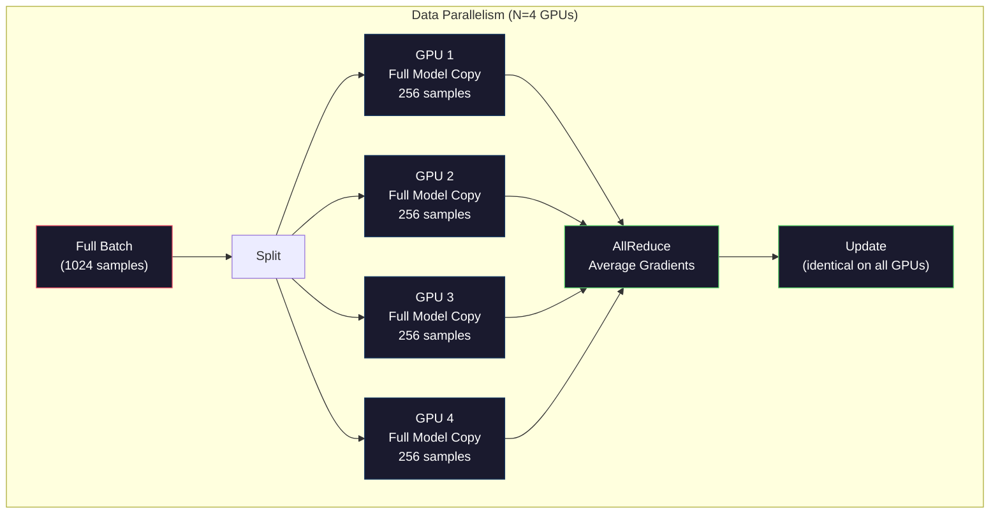
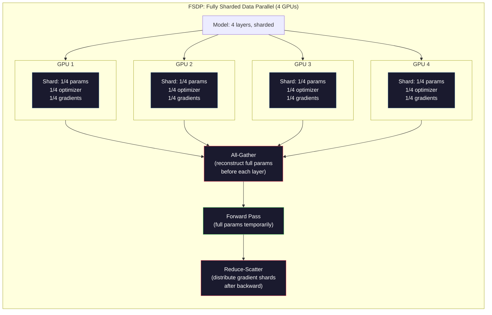
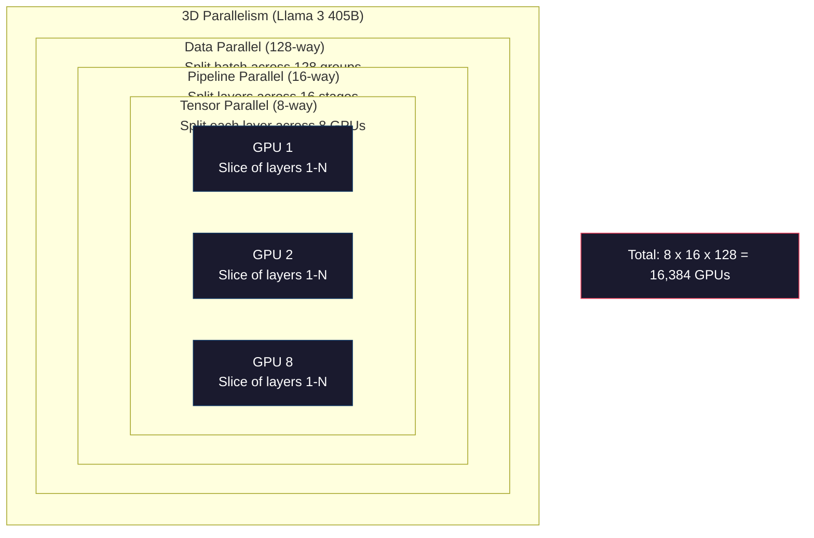

# Scaling:Giải hành đào tạo, FSDP, DeepSpeed

> Mô hình 124M của bạn đã được đào tạo trên một khối GPU hoàn thành. Hiện nay thử nghiệm 70 tỷ số参数. Mô hình không được lưu trữ.

**Type:** Build
**Languages:** Python
**Prerequisites:** Phase 10, Lesson 04 (Pre-Training a Mini GPT)
**Time:** ~120 minutes

## Học mục tiêu
- 解释三种平行性 (Data、Tensor、Pipeline), cũng như dựa trên quy mô mô mô mô và quy mô tập đoàn để đánh giá khi nào cần sử dụng chúng
- Sử dụng PyTorch DDP 实现 Data Parallel training, và đồng bộ giữa nhiều khối GPU  Gradient
- 计算给定模型规模的显存预算( trọng lượng + trạng thái tối ưu hóa + gradients + kích hoạt), để xác định nhu cầu phần cứng tối thiểu
- Thiết lập FSDP hoặc DeepSpeed ZeRO giai đoạn, sẽ phân chia trạng thái mô hình thành nhiều khối GPU, do đó chứa hơn một mô hình hiển thị

## 问题
Một mô hình số 7B sử dụng FP16 时, chỉ cần cân lượng cần 14GB──Adam Optimizer sẽ dành cho mỗi số số số lượng thêm lưu trữ hai副本──đây cũng cần 28GB──Phần phát triển 期间 Gradients tăng thêm 14GB──Tại còn không lưu trữ bất kỳ kích hoạt nào, bạn đã sử dụng 56GB──

Một bộ NVIDIA A100 có 80GB lưu trữ.

80GB đã tiêu thụ 56GB. Chỉ còn 24GB  cho kích hoạt, đó là giá trị trung bình được tính toán trong thời gian chuyển tiếp, chúng phải được giữ lại cho đến Backpropagation.

现在试试 70B 参数――仅重:FP16 下 140GB──单块 GPU 放不下──你至少需要2块A100(2 x 80GB = 160GB)才能只放下重──加上优化状态和梯度,需要的 GPU 远不止这些:最低3+块,实际通常取决于碎片化策略,需要8-16块──

Llama 3 405B sử dụng 16,384 khối NVIDIA H100 GPUs  đào tạo。 bài tập này hoạt động ước tính chi phí khoảng 1 tỷ USD tính toán 成本。DeepSeek V3  thông qua kiến trúc thông minh hơn(Mích hợp các chuyên gia có nghĩa là mỗi token chỉ kích hoạt một phần nhỏ tham số) và hiệu quả đào tạo, với khoảng 560 triệu USD đào tạo một mô hình tương đương。

本课介绍 để làm cho việc đào tạo quy mô lớn trở thành có thể có bốn chiến lược: Data Parallelism、Tensor Parallelism、Pipeline Parallelism 和 Fully Sharded Data Parallelism── bạn sẽ trước tiên sử dụng Python 模拟 từng chiến lược, hiểu cơ chế của nó, sau đó tiếp xúc lại với khuôn khổ đào tạo phân tán──

## 概念
### Tại sao cần phân tán

Dưới đây là tính toán tồn tại của mô hình thực tế. Mỗi số được tính toán, không phải là ước tính.

| Model | Params | Weights (FP16) | Adam States | Gradients (FP16) | Total (no activations) |
|-------|--------|----------------|-------------|------------------|----------------------|
| GPT-2 Small | 124M | 248 MB | 992 MB | 248 MB | 1.5 GB |
| Llama 3 8B | 8B | 16 GB | 64 GB | 16 GB | 96 GB |
| Llama 3 70B | 70B | 140 GB | 560 GB | 140 GB | 840 GB |
| Llama 3 405B | 405B | 810 GB | 3,240 GB | 810 GB | 4,860 GB |

Adam States 这一列才是真正的显存杀手──Adam 会为每个参数存储运行平均 (m) 和运行变量 (v),两者都是FP32──对于70B 模型,这就是70B x 4 bytes x 2 = 560GB──只有优化器就需要七块A100──

单块 H100 có 80GB──Llama 3 405B 至少需要61块 H100才能容纳权重、优化和梯度──加上激活,数量也将继续增加──Meta使用 16,384块 GPU không phải vì họ nghĩ như vậy, mà vì họ phải làm như vậy──

### Sự song song dữ liệu

Chiến lược phân phối đơn giản nhất. Hãy sao chép mô hình hoàn chỉnh thành N khối GPU. Hãy chia mỗi tập hợp đào tạo thành N 个相等部分. Mỗi khối GPU trên phân tích dữ liệu của riêng mình lên chạy về phía trước và ngược đi. Sau đó, trong tất cả các GPU, các gradient trung bình.

**优点：**Thông qua gần giống như đường bộ mở rộng. N 块 GPU Mỗi bước xử lý dữ liệu N 倍.

**缺点：**Mỗi khối GPU đều có mô hình hoàn chỉnh, trạng thái tối ưu hóa và độ lệch. Đối với mô hình 70B, mỗi khối GPU đều cần 840GB.

**计算：**Kích thước đợt hiệu quả = per_gpu_batch_size x N。 đối với N=64 khối GPU 且 per-GPU batch 为 16, đợt hiệu quả 为 1,024。 Llama 3 使用的有效批量是每步 1600万代币。



### Tăng quan song song

Đặt một lớp đơn  phân chia thành nhiều khối GPU 上。 một lần nhân tử được phân chia thành nhiều khối GPU, mỗi khối GPU  phân chia thành phần kết quả tính toán。

考虑 feedforward layer 中一个形 为 (8192, 8192) 的权力矩阵――使用四向索平行式时, mỗi块 GPU 拥有一个 (8192, 2048) 碎片――每个块 GPU 用输入乘以自己的碎片,产生一个部分结果――部分结果会被组合――通过全部减或全部集合)生成完整输出――

**优点：**Giảm trọng lượng của mỗi khối GPU trên 显存占用。 một mô hình 70B bị phân chia thành 8 khối GPU trên, có nghĩa là mỗi khối GPU có trọng lượng kích thước phụ kiện khoảng 8.75B。

**缺点：**Mỗi tầng sau đều cần GPU tốc độ cao 间通信。 mỗi matmul 后的全减会增加延迟。 điều này ở NVLink(((((((((((((((((((((((((((((((((((((((((((((((((((((((((((((((((((((((((((((((((((((((((((((((((((((((((((((((((((((((((((((((((((((((((((((((((((((((((((((((((((((((((((((((((((((((((((((((((((((((((((((((((((((((((((((((((((((((((((((((((((((((((((((((((((((((((((((((((((((((((((((((((((((((((((((((((((((((((((((((((((((((((((((((((((((((((((((((((((((((((((((((((((((((((((((((((((((((((((((((((((((((((((((((((((((((((((((((((((((((((((((((((((((((((((((((((((((((((((((((

**真实用法：**Megatron-LM đã tạo ra sự song song tensor. Llama 3 405B trong mỗi node sử dụng sự song song tensor 8-way.

### Phòng song đường ống

按层 拆分模型──GPU 1 运行层 1-8──GPU 2 运行层 9-16──GPU 3 运行层 17-24──GPU 4 运行层 25-32──数据流经管道:GPU 1 计算自己的层并把激活 发送给 GPU 2,GPU 2 计算自己的层 后发送给 GPU 3,依此类推──

**优点：**GPU 间通信极少, chỉ truyền lớp 边界处的激活;相比梯度或重量,这些数据很小.

**缺点：**Các bong bóng đường ống. Trong khi GPU 4 đang tính toán các micro-batch 1 đi trước, GPU 1、2、3 đều ở trạng thái空.

**GPipe and PipeDream**通過把批子 拆成微批 来解決泡泡 问题──GPU 1 一完成微批子 1 的前进,就开始处理微批子 2──这让不同的管道阶段的计算发生重叠──使用M 个微批 和 N 个阶段时,泡分数 降为 (N-1) /M──N=4阶段──M=16 micro批子时,泡为 3/16 = 18.75% thời gian lỡ ⋅

### FSDP: Dữ liệu hoàn toàn phân mảnh song song

FSDP kết hợp khả năng mở rộng và hiệu quả lưu trữ của sự song song dữ liệu. Mỗi khối GPU không còn có bản sao mô hình hoàn chỉnh, mà chỉ có các tham số 1/N, gradient và trạng thái tối ưu hóa.

Trong một lớp nào đó của chuyển tiếp  trước, FSDP sẽ chạy **all-gather**,把所有 GPU 上的完整参数 收集到每个块 GPU 的显存中――前传 之后,每个块 GPU 丢弃非本地参数――后传 期间,all-gathered 再次运行,以重建用于梯度计算的参数――后传 之后,**reduce-scatter**Chia các mảnh gradient, để mỗi khối GPU chỉ lưu trữ gradient 1/N.

**70B 模型在 8 块 GPU 上的计算：**

| Component | Without FSDP | With FSDP |
|-----------|-------------|-----------|
| Weights (FP16) | 140 GB per GPU | 17.5 GB per GPU |
| Adam States (FP32) | 560 GB per GPU | 70 GB per GPU |
| Gradients (FP16) | 140 GB per GPU | 17.5 GB per GPU |
| **Total** | **840 GB per GPU** | **105 GB per GPU** |

Không có FSDP, bạn không thể đưa 70B  mô hình vào một khối GPU 80GB. Sau khi sử dụng 8 khối GPU của FSDP, mỗi khối GPU sử dụng 105GB, vv, điều này vẫn không giảm xuống. Bạn cần ít nhất 16 khối GPU để làm cho mỗi khối GPU thấp hơn 80GB, hoặc kết hợp FSDP với điểm kiểm soát kích hoạt sử dụng lại các hoạt tính trong thời gian ngược, thay vì lưu trữ chúng)

Chi phí giao thông cao hơn sự song song dữ liệu vanila, vì mỗi tầng trước đều cần được tập hợp.



### DeepSpeed ZeRO

ZeRO của DeepSpeed (Zero Redundancy Optimizer) trong khái niệm tương tự như FSDP, nhưng được phát triển bởi Microsoft độc lập. Nó xác định ba giai đoạn, từng giai đoạn được chia cắt và tăng cường:

| Stage | Shards | Memory Savings | Communication |
|-------|--------|---------------|---------------|
| ZeRO-1 | 仅 Optimizer states | ~4x reduction | 与 data parallel 相同 |
| ZeRO-2 | + Gradients | ~8x reduction | 略多 |
| ZeRO-3 | + Parameters | ~Nx reduction (N GPUs) | 每层 All-gather |

ZeRO-3 等价于 FSDP──命名不同,机制相同──DeepSpeed 证明这个概念后,PyTorch 添加了FSDP 作为原生实现──

DeepSpeed cũng giới thiệu ZeRO-Offload (tạm dịch: "tải tải lên CPU RAM, CPU RAM rẻ hơn và có dung lượng lớn hơn") và ZeRO-Infinity (tải tải lên NVMe SSD) (tạm dịch: "tải tải lên GPU")

### Việc đào tạo chính xác hỗn hợp

现代训练会同时 sử dụng nhiều định dạng điểm nổi:

- **Forward pass**:FP16 hoặc BF16(16 bit)。 hiển存 là một nửa của FP32──Matmuls trong lõi tensor 上运行速度快 2倍──
- **Master weights**:FP32(32 bit) ―― bởi tối ưu hóa 维护, được sử dụng trong các bản cập nhật trọng lượng 期间 giữ số giá trị chính xác。
- **Loss scaling**Trong quá trình ngược trước sẽ mất một số thường lớn, để ngăn chặn các gradient FP16

BF16(Brain Float 16) có phạm vi biểu tượng tương tự như FP32 ((8 bit biểu tượng), nhưng độ chính xác thấp hơn ((7 bit mantissa, còn FP32 là 23)。 nó rất ít cần quy mô mất mát, vì nó có thể biểu thị cùng một phạm vi số lượng。FP16 có 5 bit biểu tượng và 10 bit mantissa, có thể biểu thị hơn tỉ lệ nhỏ, nhưng ở cấp độ cực đoan sẽ tràn/từ dòng chảy。

Google đã sử dụng các TPU nguyên thủy của BF16──NVIDIA A100 和 H100 đồng thời hỗ trợ FP16 和 BF16── ngành công nghiệp đã chuyển sang BF16, vì nó đã loại bỏ các rắc rối gây ra bởi việc mở rộng tổn thất.

**7B 模型的显存对比：**

| Precision | Weights | Optimizer | Gradients | Total |
|-----------|---------|-----------|-----------|-------|
| FP32 everywhere | 28 GB | 56 GB | 28 GB | 112 GB |
| Mixed (BF16 + FP32 master) | 14 GB | 56 GB | 14 GB | 84 GB |

Trong mô hình này, độ chính xác hỗn hợp tiết kiệm 28GB.

### Megatron-LM với 3D Parallelism

Thực sự tập luyện lớn sẽ kết hợp tất cả ba sự song song:

- **Data parallelism**跨节点组(扩展 kích thước lô)
- **Tensor parallelism**Trong phần này, bạn sẽ phân loại các lớp thành 8 khối GPU.
- **Pipeline parallelism**跨节点(把 lớp nhóm 拆到多台机器)

Llama 3 405B 在 16,384 块 H100 上:
- Mỗi节点内 8-way tensor tương đồng (mỗi节点 8 khối GPU)
- 跨节点 16 đường ống dẫn tương đồng ((16 giai đoạn đường ống dẫn)
- 剩余维度上 128 đường tương đồng dữ liệu(16,384 / 8 / 16 = 128)

Đây là cách phân hủy 3D này ((8 x 16 x 128 = 16,384) là cách mở rộng thành hàng ngàn khối GPU. Mỗi khối GPU nhìn thấy các phân mảnh dữ liệu khác nhau ((đối diện dữ liệu), có một mảnh mỗi tầng ((đối diện cảm biến),并计算不同的一组层 ((đối diện ống dẫn) ").

DeepSeek V3 đã sử dụng các phương pháp khác nhau. Các kiến trúc chuyên gia hỗn hợp của chúng chỉ kích hoạt 671B trong mỗi token.




```figure
paged-kv-cache
```

##  xây dựng nó
### 步骤 1: Mô phỏng sự song song dữ liệu

Đặt một lô 拆 thành GPU模拟 上。 mỗi khối GPU trong phân mảnh của riêng mình 上计算 前进传递──平均gradients((((((((((((((((((((((((((((((((((((((((((((((((((((((((((((((((((((((((((((((((((((((((((((((((((((((((((((((((((((((((((((((((((((((((((((((((((((((((((((((((((((((((((((((((((((((((((((((((((((((((((((((((((((((((((((((((((((((((((((((((((((((((((((((((((((((((((((((((((((((((((((((((((((((((((((((((((((((((((((((((((((((((((((((((((((((((((((((((((((((((((((((((((((((((((((((((((((((((((((((((((((((((((((((((((((((((((((((((((((((((((((((((((((((((((((((((((((((((((((

```python
import numpy as np

def simulate_data_parallelism(data, num_gpus, model_fn):
    batch_size = len(data)
    shard_size = batch_size // num_gpus
    remainder = batch_size % num_gpus

    gpu_losses = []
    gpu_gradients = []

    offset = 0
    for gpu_id in range(num_gpus):
        extra = 1 if gpu_id < remainder else 0
        shard = data[offset:offset + shard_size + extra]
        offset += shard_size + extra

        loss, grad = model_fn(shard)
        gpu_losses.append(loss)
        gpu_gradients.append(grad)

    avg_loss = np.mean(gpu_losses)
    avg_gradient = np.mean(gpu_gradients, axis=0)

    return avg_loss, avg_gradient
```

hoạt động giảm tất cả các gradient) là giao tiếp duy nhất trong sự song song dữ liệu. Trong thực tế, NVIDIA GPU 上会 sử dụng thư viện NCCL, nó đã thực hiện vòng giảm tất cả: mỗi khối GPU Đặt 1/N của mình gradient đến GPU lân cận, từ bên kia lân cận GPU nhận 1/N, qua N-1 步后, mỗi khối GPU đều có trung bình hoàn chỉnh.

### 步骤 2: Mô phỏng sự song song của Tensor

Đặt khối lượng tử liệu phân chia thành nhiều khối GPU 上。 mỗi khối GPU 计算部分 Matrix nhânền。组合结果。

```python
def simulate_tensor_parallelism(input_data, weight_matrix, num_gpus):
    d_in, d_out = weight_matrix.shape
    assert d_out % num_gpus == 0, f"d_out {d_out} not divisible by num_gpus {num_gpus}"
    shard_size = d_out // num_gpus

    partial_results = []
    for gpu_id in range(num_gpus):
        start = gpu_id * shard_size
        end = start + shard_size
        weight_shard = weight_matrix[:, start:end]

        partial = input_data @ weight_shard
        partial_results.append(partial)

    full_output = np.concatenate(partial_results, axis=-1)

    direct_output = input_data @ weight_matrix
    error = np.abs(full_output - direct_output).max()

    return full_output, error
```

lỗi 应该严格为零(或机器epsilon) ――Tensor paralelism 在数学上是精确的,它产生的结果与在一块 GPU 上计算完整的 matmul 相同──切分沿输出维度 进行,因此每个块 GPU 生成不同的列块,concatenation 会重建完整的结果──

Đối với các lớp tuyến tính song song cột (các chiều kích đầu ra), bạn thực hiện kết nối. Đối với các lớp song cột (các chiều kích đầu ra), bạn thực hiện tổng hợp. Trong máy biến đổi FFN, thứ nhất đường thẳng (các chiều dài) sử dụng các lớp song cột (các chiều dài giao dịch) sử dụng các lớp song cột (các chiều kích đầu ra).

### 步骤 3: Mô phỏng sự song song đường đường ống

Hãy đưa các lớp mô hình 拆 thành GPU ảo 上。 hiển thị vấn đề bong bóng: giai đoạn đầu 会在后续阶段 计算时处于空。

```python
def simulate_pipeline_parallelism(num_layers, num_stages, num_microbatches):
    layers_per_stage = num_layers // num_stages

    timeline = {}
    clock = 0

    for mb in range(num_microbatches):
        for stage in range(num_stages):
            start_time = max(
                timeline.get((stage, mb - 1, "fwd"), (0, 0))[1] if mb > 0 else 0,
                timeline.get((stage - 1, mb, "fwd"), (0, 0))[1] if stage > 0 else 0,
            )
            end_time = start_time + layers_per_stage
            timeline[(stage, mb, "fwd")] = (start_time, end_time)

    last_fwd_end = max(v[1] for v in timeline.values())

    for mb in range(num_microbatches - 1, -1, -1):
        for stage in range(num_stages - 1, -1, -1):
            deps = [last_fwd_end]
            if mb < num_microbatches - 1 and (stage, mb + 1, "bwd") in timeline:
                deps.append(timeline[(stage, mb + 1, "bwd")][1])
            if stage < num_stages - 1 and (stage + 1, mb, "bwd") in timeline:
                deps.append(timeline[(stage + 1, mb, "bwd")][1])
            start_time = max(deps)
            end_time = start_time + layers_per_stage
            timeline[(stage, mb, "bwd")] = (start_time, end_time)

    total_time = max(v[1] for v in timeline.values())
    compute_time = num_microbatches * num_stages * layers_per_stage * 2
    bubble_fraction = 1.0 - compute_time / (total_time * num_stages)

    return timeline, total_time, bubble_fraction
```

Sử dụng 4 giai đoạn và 1 micro-batch, phần nhỏ bong bóng là 75%, đó là bất cứ lúc nào có ba khối trống trong GPU bốn khối. Sử dụng 16 micro-batch, nó sẽ giảm xuống khoảng 19%.

### 步骤 4: Máy tính bộ nhớ

计算任意模型规模训练时的精确显存需求──

```python
def memory_calculator(
    params_billions,
    precision_bytes=2,
    optimizer="adam",
    num_gpus=1,
    sharding="none",
    sequence_length=2048,
    batch_size_per_gpu=1,
    hidden_dim=None,
    num_layers=None,
):
    params = params_billions * 1e9

    weight_memory = params * precision_bytes

    if optimizer == "adam":
        optimizer_memory = params * 4 * 2
    elif optimizer == "sgd":
        optimizer_memory = params * 4
    else:
        optimizer_memory = 0

    gradient_memory = params * precision_bytes

    total_no_activation = weight_memory + optimizer_memory + gradient_memory

    if hidden_dim and num_layers:
        activation_per_layer = (
            sequence_length * batch_size_per_gpu * hidden_dim * precision_bytes * 4
        )
        activation_memory = activation_per_layer * num_layers
    else:
        activation_memory = params * precision_bytes * 0.5

    if sharding == "fsdp" or sharding == "zero3":
        weight_memory /= num_gpus
        optimizer_memory /= num_gpus
        gradient_memory /= num_gpus
    elif sharding == "zero2":
        optimizer_memory /= num_gpus
        gradient_memory /= num_gpus
    elif sharding == "zero1":
        optimizer_memory /= num_gpus

    per_gpu_total = weight_memory + optimizer_memory + gradient_memory + activation_memory

    return {
        "params_billions": params_billions,
        "weights_gb": weight_memory / 1e9,
        "optimizer_gb": optimizer_memory / 1e9,
        "gradients_gb": gradient_memory / 1e9,
        "activations_gb": activation_memory / 1e9,
        "per_gpu_total_gb": per_gpu_total / 1e9,
        "total_across_gpus_gb": per_gpu_total * num_gpus / 1e9,
        "fits_on_80gb": per_gpu_total / 1e9 <= 80,
        "num_gpus": num_gpus,
        "sharding": sharding,
    }
```

Máy tính này đã trả lời câu hỏi của mỗi kỹ sư ML:I need how many blocks GPU?输入 model size, check check whether you put it down.

### 步骤 5: Tái mô chính xác hỗn hợp

So sánh FP32、FP16 và việc sử dụng hiển nhiên của đào tạo chính xác hỗn hợp

```python
def mixed_precision_comparison(params_billions):
    params = params_billions * 1e9

    fp32_weights = params * 4
    fp32_optimizer = params * 4 * 2
    fp32_gradients = params * 4
    fp32_total = fp32_weights + fp32_optimizer + fp32_gradients

    fp16_weights = params * 2
    fp16_master = params * 4
    fp16_optimizer = params * 4 * 2
    fp16_gradients = params * 2
    fp16_total = fp16_weights + fp16_master + fp16_optimizer + fp16_gradients

    mixed_weights = params * 2
    mixed_optimizer = params * 4 * 2
    mixed_gradients = params * 2
    mixed_total = mixed_weights + mixed_optimizer + mixed_gradients

    return {
        "fp32_total_gb": fp32_total / 1e9,
        "fp16_with_master_gb": fp16_total / 1e9,
        "mixed_bf16_gb": mixed_total / 1e9,
        "savings_vs_fp32": 1 - mixed_total / fp32_total,
    }
```

Đối với hầu hết mọi người, sự bất ngờ lớn nhất là: độ chính xác hỗn hợp sẽ không làm giảm một nửa lượng lưu trữ.

## Sử dụng nó
### Tiêu chuẩn tất cả các mô phỏng

```python
def run_all_demos():
    print("=" * 70)
    print("DATA PARALLELISM SIMULATION")
    print("=" * 70)

    np.random.seed(42)
    data = np.random.randn(64, 32)
    weight = np.random.randn(32, 16)

    def model_fn(batch):
        output = batch @ weight
        loss = np.mean(output ** 2)
        grad = 2 * batch.T @ (batch @ weight) / len(batch)
        return loss, grad

    for n_gpus in [1, 2, 4, 8]:
        loss, grad = simulate_data_parallelism(data, n_gpus, model_fn)
        print(f"  {n_gpus} GPUs: loss={loss:.4f}, grad_norm={np.linalg.norm(grad):.4f}")

    print()
    print("=" * 70)
    print("TENSOR PARALLELISM SIMULATION")
    print("=" * 70)

    x = np.random.randn(4, 8192)
    W = np.random.randn(8192, 8192)

    for n_gpus in [1, 2, 4, 8]:
        output, error = simulate_tensor_parallelism(x, W, n_gpus)
        print(f"  {n_gpus} GPUs: output_shape={output.shape}, max_error={error:.2e}")

    print()
    print("=" * 70)
    print("PIPELINE PARALLELISM SIMULATION")
    print("=" * 70)

    for n_mb in [1, 4, 8, 16, 32]:
        _, total_t, bubble = simulate_pipeline_parallelism(32, 4, n_mb)
        print(f"  {n_mb:2d} micro-batches: total_time={total_t:4d}, bubble={bubble:.1%}")

    print()
    print("=" * 70)
    print("MEMORY CALCULATOR")
    print("=" * 70)

    configs = [
        (7, "none", 1),
        (7, "fsdp", 8),
        (70, "none", 1),
        (70, "fsdp", 8),
        (70, "fsdp", 16),
        (405, "fsdp", 64),
        (405, "fsdp", 128),
    ]

    print(f"  {'Model':>8} {'Sharding':>8} {'GPUs':>5} {'Per-GPU':>10} {'Fits 80GB':>10}")
    print("  " + "-" * 50)
    for params, shard, gpus in configs:
        result = memory_calculator(params, num_gpus=gpus, sharding=shard)
        fits = "Yes" if result["fits_on_80gb"] else "No"
        print(f"  {params:>6}B {shard:>8} {gpus:>5} {result['per_gpu_total_gb']:>8.1f}GB {fits:>10}")

    print()
    print("=" * 70)
    print("MIXED PRECISION COMPARISON")
    print("=" * 70)

    for params_b in [7, 13, 70, 405]:
        result = mixed_precision_comparison(params_b)
        print(f"  {params_b}B: FP32={result['fp32_total_gb']:.0f}GB, "
              f"Mixed BF16={result['mixed_bf16_gb']:.0f}GB, "
              f"Savings={result['savings_vs_fp32']:.0%}")
```

## 交付 nó
本课会产出 `outputs/prompt-distributed-training-planner.md`Một lập tức, nó nhận kích thước mô hình và phần cứng có sẵn, sau đó tạo ra kế hoạch đào tạo phân tán hoàn chỉnh: chiến lược song song, ngân sách bộ nhớ, chi phí giao tiếp và thông qua dự kiến.

## 练习
1.  sửa đổi máy tính tính nhớ, gia nhập kiểm tra hoạt động. 时 sử dụng kiểm tra hoạt động chỉ trong mỗi lần kích hoạt lưu trữ K 层 时, chỉ trong mỗi lần kích hoạt lưu trữ K 层 时, chỉ trong mỗi lần kiểm tra K = 1, chỉ ra toàn bộ tính toán.

2. 扩展管道平行模拟,实现 PipeDream 使用的 1F1B(một tiến, một trở lại) lịch trình。 đối với 4 giai đoạn 和 8 micro-batch, so sánh nó với phần nhỏ bong bóng của lịch trình ngây thơ。 1F1B lịch trình 应该具有更低的峰值内存,因为它更早开始向后传。

3. 实现一个梯度积累模拟器──不要在每个微批后都全部降低,而是在本地积累K 步梯度,然后再降低――展示这如何把通信减少K 倍,同时产生完全相同的最终梯度(因此训练也完全相同)

4. Construct a cost estimator── given determined model size、target token count、GPU type(A100 at $2/hr，H100 at $3.50/h) và chiến lược song song, ước tính tổng chi phí đào tạo (USD) ⋅ bằng chứng chi phí đã biết: Llama 3 405B 据称成本约$100M，DeepSeek V3 成本约 $5,6M.

5. Trong máy tính nhớ, hãy tham gia ZeRO-Offload. giả định mỗi node có 512GB CPU RAM và 2TB NVMe.

## 关键术语
| Term | What people say | What it actually means |
|------|----------------|----------------------|
| Data parallelism | “把模型复制到每块 GPU” | 每块 GPU 处理不同的 data shard；每一步之后通过 all-reduce 平均 gradients |
| Tensor parallelism | “把一层拆到多块 GPU 上” | 切分 weight matrices，让每块 GPU 计算 matmul 的一部分；需要高速 NVLink interconnect |
| Pipeline parallelism | “把 layers 拆到多块 GPU 上” | 每块 GPU 运行不同的一组 layers；数据通过 pipeline 流动，并使用 micro-batches 减少 bubbles |
| FSDP | “Shard everything” | Fully Sharded Data Parallel：每块 GPU 持有 1/N 的 weights、gradients 和 optimizer states；计算前执行 all-gather |
| ZeRO | “DeepSpeed 版本的 FSDP” | Zero Redundancy Optimizer，包含 3 个 stages：shard optimizer（Stage 1）、+ gradients（Stage 2）、+ parameters（Stage 3） |
| All-reduce | “在 GPU 之间求平均” | collective operation，让每块 GPU 最终都拥有所有 GPU 输入的 sum（或 average），通常实现为 ring all-reduce |
| All-gather | “从所有 GPU 收集” | collective operation，让每块 GPU 最终都拥有所有 GPU 数据的 concatenation；FSDP 中用于重建完整 parameters |
| Reduce-scatter | “求和并分发” | collective operation，对数据进行 reduce（sum）并把不同 chunks scatter 到不同 GPU；FSDP 中用于 gradient sharding |
| Mixed precision | “用 half precision 训练” | forward/backward 使用 FP16/BF16，optimizer states 使用 FP32；节省约 25% 显存，而不是 50%，因为 optimizer 占主导 |
| Pipeline bubble | “pipeline 中的 idle time” | GPU 等待上一 stage 数据时处于空闲的时间比例；可通过使用更多 micro-batches 降低 |

## 延伸阅读
- [Rajbhandari et al., 2020 -- "ZeRO: Memory Optimizations Toward Training Trillion Parameter Models"](https://arxiv.org/abs/1910.02054)-- 定义三个 giai đoạn phân mảnh của DeepSpeed ZeRO giấy
- [Shoeybi et al., 2020 -- "Megatron-LM: Training Multi-Billion Parameter Language Models Using Model Parallelism"](https://arxiv.org/abs/1909.08053)-- NVIDIA 面向变压器 的 tensor parallelism
- [Narayanan et al., 2021 -- "Efficient Large-Scale Language Model Training on GPU Clusters Using Megatron-LM"](https://arxiv.org/abs/2104.04473)-- 结合数据、tensor 和管道的3D平行性
- [Zhao et al., 2023 -- "PyTorch FSDP: Experiences on Scaling Fully Sharded Data Parallel"](https://arxiv.org/abs/2304.11277)-- PyTorch's nguyên sinh FSDP 实现
- [Llama 3 Technical Report](https://arxiv.org/abs/2407.21783)-- 16,384 GPU đào tạo của sự song song 3D 细节
- [DeepSeek-V3 Technical Report](https://arxiv.org/abs/2412.19437)-- Kiến trúc MoE  làm thế nào sẽ giảm chi phí đào tạo một số lượng cấp
