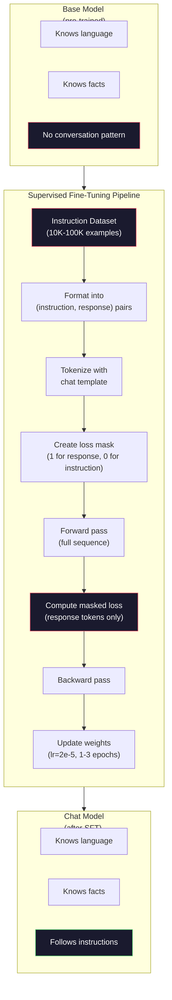

# Định hướng điều chỉnh (SFT)

> Mô hình cơ bản 会预测下一个 Token──仅此而已── nó sẽ không tuân theo chỉ thị, trả lời câu hỏi, cũng sẽ không từ chối yêu cầu có hại──SFT là một giao diện giữa Token 预测器 và trợ lý hữu ích── mỗi mô hình mà bạn đã từng trò chuyện - Claude、GPT、Llama Chat -- 都经历过这个步骤──

**类型：**Xây dựng
**语言：**Python (với numpy)
**前置要求：**Giai đoạn 10, Bài học 04 (Tập huấn trước một GPT Mini)
**时间：**~ 90 phút

## Học mục tiêu

- 实现 giám sát tinh chỉnh (SFT),将 cơ bản ngôn ngữ mô hình 转换为遵循指令的助手
- Sử dụng chứa hệ thống, người dùng và trợ lý 角色的聊天模板 格式化训练数据,并对非助手代币 屏蔽 Loss
- 解释 tại sao SFT là cần thiết: các mô hình cơ bản sẽ tiếp tục văn bản, thay vì trả lời các câu hỏi
- Thông qua bộ hướng dẫn trong lưu giữ trên so sánh mô hình cơ bản với mô hình tinh chỉnh của hồi đáp, đánh giá chất lượng SFT

## 问题

Bạn đã đào tạo một mô hình trong Bài học 04 ⋅ cho một chuỗi, nó có thể dự đoán một token tiếp theo ⋅ vào nó nhập "The Transformer Architecture", nó có thể tiếp tục xuất "đã cách mạng hóa xử lý ngôn ngữ tự nhiên". đối với một dự đoán token tiếp theo, đó là rất mạnh.

现在试试这个:向它输入 "Quả là thủ đô của Pháp?" mô hình cơ bản sẽ không trả lời "Paris". Nó sẽ tiếp tục mô hình này。 Nó có thể tạo ra "Quả là thủ đô của Đức?

Đây là sự khác biệt giữa GPT-3 (chuẩn độ cơ bản, tháng 6 năm 2020) và ChatGPT (chuẩn độ hướng dẫn, tháng 11 năm 2022): cùng một kiến trúc.

Stanford Alpaca  chứng minh bạn không cần hàng triệu ví dụ. Tháng 3 năm 2023, họ chỉ sử dụng GPT-3.5 sinh ra 52,000 hướng dẫn-đáp ứng đối với Llama 7B  tiến hành điều chỉnh tốt. Tổng chi phí: 600 USD. Kết quả là một người có thể theo hướng dẫn, trả lời câu hỏi và tiến hành trò chuyện. Nó không giống như ChatGPT, nhưng với 600 USD và vài giờ tập luyện, đã gần như là đáng kinh ngạc.

Meta của Llama 2 Chat trong giai đoạn đầu của SFT chỉ sử dụng khoảng 27.000 ví dụ chất lượng cao.

## 概念

### SFT thực sự đã làm gì

Supervised Fine-Tuning 延续 cùng một vòng tập luyện trong quá trình trước đào tạo - vượt qua tiến bộ, mất tính toán, vượt qua trở lại, nâng cấp trọng lượng - nhưng sử dụng một loại dữ liệu khác.

```json
{
  "system": "You are a helpful assistant.",
  "user": "What is the capital of France?",
  "assistant": "The capital of France is Paris."
}
```

mô hình 已知道巴黎是法国的首都──它在维基百科、教材和网页上预训 中学到了这一点──SFT không dạy mô hình 新事实──它 dạy mô hình một loại mới* hành vi*: khi bạn nhìn thấy vấn đề, tạo câu trả lời── khi bạn nhìn thấy chỉ thị, tạo bổ sung── khi bạn nhìn thấy yêu cầu có hại, tạo từ chối──

Có thể hiểu như thế.

### hình thức dữ liệu

Trong ngành có ba hình thức chính: Mỗi hình thức đều mã hóa cùng một thông tin - ai nói gì - chỉ sử dụng các phân vùng khác nhau.

**Alpaca Format**(Stanford, tháng 3 năm 2023):

```json
{
  "instruction": "Summarize the following article in 3 sentences.",
  "input": "The European Central Bank raised interest rates...",
  "output": "The ECB increased rates by 25 basis points..."
}
```

 đơn giản và được sử dụng rộng rãi.`input`字段是可选的-- 许多指令不需要额外上下文──Stanford 发布了52,000 ví dụ về kiểu này, được tạo ra bởi GPT-3.5 以 600 美元成本──这开启了开源指示调节运动──

**ShareGPT Format**(Thị hội, 2023):

```json
{
  "conversations": [
    {"from": "system", "value": "You are a helpful assistant."},
    {"from": "human", "value": "What causes tides?"},
    {"from": "gpt", "value": "Tides are caused by the gravitational pull of the Moon..."},
    {"from": "human", "value": "How often do they occur?"},
    {"from": "gpt", "value": "Most coastal areas experience two high tides and two low tides per day..."}
  ]
}
```

支持多轮对话──按照惯例,"from"字段使用"human" 和"gpt",不管实际模型是什么──Vicuna 使用从用户共享的ChatGPT抄录中抓取的70,000条 ShareGPT对话进行训练──

**ChatML Format**(OpenAI, được sử dụng bởi nhiều mô hình nguồn mở):

```
<|im_start|>system
You are a helpful assistant.<|im_end|>
<|im_start|>user
What is the capital of France?<|im_end|>
<|im_start|>assistant
The capital of France is Paris.<|im_end|>
```

使用特殊 Token(`<|im_start|>``<|im_end|>`(của người dùng) để phân biệt vai trò.

三种格式都实现了同样的事情: chúng nói với mô hình 这是指令,这是答案,学习这个模式

### Tại sao nó hiệu quả

mô hình đã được học từ trước khi học tập. Nó đã thấy hàng tỷ câu hỏi sau câu trả lời, chỉ dẫn sau hoàn chỉnh, cũng như các ví dụ về cuộc đối thoại giữa con người.

SFT sẽ tập trung vào khả năng tiềm năng này. mô hình không cần phải từ trên xuống văn bản tự quyết định mình nên trả lời câu hỏi hay tiếp tục văn bản. SFT sẽ rõ ràng luyện tập nó trên mô hình đối thoại.

Đó là lý do tại sao 27.000 ví dụ là đủ. Bạn không đang dạy mô hình tiếng Anh. Bạn không đang dạy nó về những thực tế về thế giới. Bạn đang dạy nó một hành vi đơn giản: đáp ứng chỉ thị.

### Sự mất mát ẩn mác

Đây là chi tiết kỹ thuật quan trọng nhất trong SFT, và hầu hết các bài học đều bỏ qua nó.

Trong thời gian trước đào tạo, bạn sẽ đối mặt với mỗi token  tính toán Loss. Trong thời gian SFT, bạn chỉ đối mặt với* phản ứng* token  tính toán Loss.

Tại sao? vì bạn không muốn mô hình Học tập* tạo ra* chỉ thị. Bạn muốn nó học tập* đáp ứng* chỉ thị. Nếu bạn đối mặt với chỉ thị.

Trong thực tế, bạn sẽ tạo một mặt nạ mất mát: phản ứng Địa chỉ 为 1, hướng dẫn Địa chỉ 为 0── 在取平均之前,将每个 Địa chỉ của Loss 乘以这个 mặt nạ──

```
Tokens:    [SYS] You are helpful [USER] What is the capital? [ASST] Paris is the capital [EOS]
Loss mask:   0    0    0     0      0     0   0  0     0       1     1    1   1     1      1
```

Chỉ có`[ASST]`后后的Token 会贡献 Loss──model 在前进传递期间将会看到完整对话(它需要指令才能产生正确反应),但只根据它的预测反应的效果来更新重量──

### 训练 Các siêu tham số

Các siêu tham số sử dụng SFT khác hẳn với trước khi đào tạo. Bạn không phải là người đào tạo. Bạn đang điều chỉnh một mô hình đã có thể làm việc.

| Parameter | Pre-Training (Llama 2 7B) | SFT (Llama 2 Chat) |
|-----------|---------------------------|---------------------|
| Learning rate | 3e-4 (peak) | 2e-5 |
| Epochs | 1（单次遍历数据） | 2 |
| Batch size | 4M tokens | 64 examples |
| Warmup steps | 2,000 | 0-100 |
| Weight decay | 0.1 | 0.0-0.1 |
| Data size | 2T tokens | 27,000 examples |

Tỷ lệ học tập của SFT thấp 15 lần. Đây là một điểm rất quan trọng. Tỷ lệ học tập quá cao trong thời gian điều chỉnh kỹ lưỡng sẽ phá hủy kiến thức được đào tạo trước.

两个时代意味着模型会看到每个训练示例两次―― 在小数据集上超过3时代会导致记忆化 -模型开始逐字复现训练示例,而不是泛化――

### Sự quên lãng thảm khốc

Việc điều chỉnh tốt có thể phá vỡ khả năng chung. Trong quá lâu khi tập dữ liệu theo hướng dẫn, mô hình có thể mất khả năng viết mã, làm toán học hoặc tạo văn bản sáng tạo. Nó sẽ rất giỏi trong việc tập các định dạng cụ thể trong dữ liệu, nhưng trong các khía cạnh khác hoạt động rất kém.

三种缓解方式:

1. **低 learning rate。**1e-5 đến 5e-5──Nhiều cập nhật nhỏ hơn có nghĩa là ít thiệt hại hơn đối với các tính năng được đào tạo trước.

2. **短训练。**1-3 epochs──在模型过之前停止──

3. **混入 pre-training 数据。**Llama 2 Chat 将一小部分(2-5%) nguyên thủy trước khi đào tạo 数据混入 SFT dataset──这样可以在学习新指示后 行为时,提醒模型 保持通用能力──

### Số thực

Trong 10.000 cặp hướng dẫn chất lượng cao, lên một mô hình 7B, sử dụng một GPU NVIDIA A100 80GB, khoảng 1 giờ.

- 10.000 ví dụ x 平均 512 token = 5,12M token
- 2 thời đại =  tổng số 10,24M token
- A100 đối với mô hình 7B chỉnh sửa tinh tế: ~ 3.000 token/ giây
- 10,24M / 3,000 = ~ 3,400 giây = ~ 57 phút

Đối với mini GPT của chúng tôi ((4 lớp, 128 dims), tập luyện gần như là ngay lập tức.




```figure
loss-masking
```

## 构建

### 步骤 1: Bộ dữ liệu hướng dẫn

Tạo một bộ dữ liệu hướng dẫn tổng hợp. Trong môi trường sản xuất, Scale AI và Anthropic như các công ty sẽ thuê nhân viên đánh dấu để biên soạn dữ liệu này. Chúng tôi sẽ sử dụng cách lập trình để tạo chúng, để mô hình trình bày.

```python
import numpy as np

INSTRUCTION_DATA = [
    {
        "instruction": "What is the capital of France?",
        "response": "The capital of France is Paris."
    },
    {
        "instruction": "Explain gravity in one sentence.",
        "response": "Gravity is the force that attracts objects with mass toward each other."
    },
    {
        "instruction": "Write a haiku about the ocean.",
        "response": "Waves crash on the shore, salt and foam beneath the sun, endless blue expanse."
    },
    {
        "instruction": "What is 15 multiplied by 7?",
        "response": "15 multiplied by 7 is 105."
    },
    {
        "instruction": "Name three programming languages.",
        "response": "Three programming languages are Python, Rust, and TypeScript."
    },
    {
        "instruction": "Summarize photosynthesis.",
        "response": "Photosynthesis converts sunlight, water, and carbon dioxide into glucose and oxygen."
    },
    {
        "instruction": "What year did World War II end?",
        "response": "World War II ended in 1945."
    },
    {
        "instruction": "Define machine learning.",
        "response": "Machine learning is a field where algorithms learn patterns from data to make predictions."
    },
]
```

8 ví dụ rất ít. Stanford Alpaca đã sử dụng 52,000 ví dụ. Nhưng dù bạn có 8 ví dụ hay 52,000 ví dụ, cơ chế đều giống nhau:

### 步骤 2: Sử dụng mẫu trò chuyện  thực hiện token

Để chuyển các cặp lệnh-đáp ứng thành các dấu hiệu đặc biệt của các dấu hiệu.

```python
SPECIAL_TOKENS = {
    "INST_START": 253,
    "INST_END": 254,
    "RESP_START": 255,
}


def tokenize_instruction_pair(instruction, response, vocab_size=256):
    inst_tokens = list(instruction.encode("utf-8"))
    resp_tokens = list(response.encode("utf-8"))

    inst_tokens = [min(t, vocab_size - 4) for t in inst_tokens]
    resp_tokens = [min(t, vocab_size - 4) for t in resp_tokens]

    tokens = (
        [SPECIAL_TOKENS["INST_START"]]
        + inst_tokens
        + [SPECIAL_TOKENS["INST_END"]]
        + [SPECIAL_TOKENS["RESP_START"]]
        + resp_tokens
    )

    return tokens


def create_loss_mask(tokens):
    mask = np.zeros(len(tokens), dtype=np.float32)
    in_response = False

    for i, token in enumerate(tokens):
        if token == SPECIAL_TOKENS["RESP_START"]:
            in_response = True
            continue
        if in_response:
            mask[i] = 1.0

    return mask
```

Mặt nạ mất cho chỉ dẫn Token 全部为零, đối với đáp ứng Token 全部为一。`RESP_START`Đơn hiệu mặt nạ thực sự là 0, vì nó là phân vùng, không phải là một phần của nội dung phản ứng.

### 步骤 3: Khung mất đi sự tham gia chéo

标准 cross-entropy, nhưng乘以损失面具──只有响应代币 会贡献 Gradient──

```python
def masked_cross_entropy_loss(logits, targets, loss_mask):
    batch, seq_len, vocab_size = logits.shape
    logits_flat = logits.reshape(-1, vocab_size)
    targets_flat = targets.reshape(-1)
    mask_flat = loss_mask.reshape(-1)

    max_logits = logits_flat.max(axis=-1, keepdims=True)
    log_softmax = logits_flat - max_logits - np.log(
        np.exp(logits_flat - max_logits).sum(axis=-1, keepdims=True)
    )

    per_token_loss = -log_softmax[np.arange(len(targets_flat)), targets_flat]

    masked_loss = per_token_loss * mask_flat
    num_response_tokens = mask_flat.sum()
    if num_response_tokens == 0:
        return 0.0
    loss = masked_loss.sum() / num_response_tokens

    return loss
```

分母是`num_response_tokens`, không `seq_len`Nếu tách ra với tổng chuỗi dài, các hướng dẫn dài sẽ ít phát hành Tốc hiệu cấp độ.

### 步骤 4: SFT 训练循环

复用 Lesson 04 中的 MiniGPT──训练循环看起来几乎与预训相似,只是加入了指令格式和掩盖损失──

```python
import sys
import os
sys.path.insert(0, os.path.join(os.path.dirname(__file__), "..", "..", "04-pre-training-mini-gpt", "code"))
from main import MiniGPT, LayerNorm, FeedForward, MultiHeadAttention, TransformerBlock, Embedding


def sft_train(model, dataset, num_epochs=2, lr=2e-5, seq_len=64):
    formatted_data = []
    for example in dataset:
        tokens = tokenize_instruction_pair(example["instruction"], example["response"])
        mask = create_loss_mask(tokens)
        formatted_data.append((tokens, mask))

    print(f"SFT Training: {len(formatted_data)} examples, {num_epochs} epochs, lr={lr}")
    print(f"Total tokens: {sum(len(t) for t, _ in formatted_data):,}")
    print()

    losses = []

    for epoch in range(num_epochs):
        epoch_loss = 0.0
        num_batches = 0

        indices = np.random.permutation(len(formatted_data))

        for idx in indices:
            tokens, mask = formatted_data[idx]

            if len(tokens) < 3:
                continue
            if len(tokens) > seq_len:
                tokens = tokens[:seq_len]
                mask = mask[:seq_len]

            input_ids = np.array(tokens[:-1]).reshape(1, -1)
            target_ids = np.array(tokens[1:]).reshape(1, -1)
            loss_mask = np.array(mask[1:]).reshape(1, -1)

            logits = model.forward(input_ids)
            loss = masked_cross_entropy_loss(logits, target_ids, loss_mask)

            batch_size, s_len, v_size = logits.shape
            probs = np.exp(logits - logits.max(axis=-1, keepdims=True))
            probs = probs / probs.sum(axis=-1, keepdims=True)
            dlogits = probs.copy()
            dlogits[np.arange(batch_size)[:, None], np.arange(s_len), target_ids] -= 1.0

            mask_expanded = loss_mask[:, :, np.newaxis]
            num_resp = loss_mask.sum()
            if num_resp > 0:
                dlogits = dlogits * mask_expanded / num_resp

            for block in model.blocks:
                block.ffn.W1 -= lr * np.random.randn(*block.ffn.W1.shape) * 0.01
                block.ffn.W2 -= lr * np.random.randn(*block.ffn.W2.shape) * 0.01
                block.ffn.b1 -= lr * np.random.randn(*block.ffn.b1.shape) * 0.01
                block.ffn.b2 -= lr * np.random.randn(*block.ffn.b2.shape) * 0.01

            epoch_loss += loss
            num_batches += 1
            losses.append(loss)

        avg_loss = epoch_loss / max(num_batches, 1)
        print(f"Epoch {epoch + 1}/{num_epochs} | Avg Loss: {avg_loss:.4f}")

    return model, losses
```

Tỷ lệ học là 2e-5, với Llama 2 Chat 匹配──将它与预训中使用的 3e-4 对比 -- 小 15 倍──Gradient 被面具:指示令子 产生零 Gradient──只有响应令子 推动重量──

### Bước 5: So sánh cơ sở với mô hình SFT

Tất cả ý nghĩa của SFT nằm trong sự thay đổi hành vi. Chúng tôi qua mô hình kiểm tra cách phản ứng với các đầu vào định dạng hướng dẫn với các tiếp tục văn bản thô để đo lường điều này.

```python
def generate_response(model, prompt_tokens, max_new_tokens=50, temperature=0.8):
    tokens = list(prompt_tokens)
    seq_len = model.embedding.pos_embed.shape[0]

    for _ in range(max_new_tokens):
        context = np.array(tokens[-seq_len:]).reshape(1, -1)
        logits = model.forward(context)
        next_logits = logits[0, -1, :]

        next_logits = next_logits / max(temperature, 1e-8)
        probs = np.exp(next_logits - next_logits.max())
        probs = probs / probs.sum()
        probs = np.clip(probs, 1e-10, 1.0)
        probs = probs / probs.sum()

        next_token = np.random.choice(len(probs), p=probs)
        tokens.append(int(next_token))

    return tokens


def evaluate_instruction_following(model, instructions):
    print("Evaluating instruction following:")
    print("-" * 50)

    for instruction in instructions:
        tokens = (
            [SPECIAL_TOKENS["INST_START"]]
            + [min(t, 252) for t in list(instruction.encode("utf-8"))]
            + [SPECIAL_TOKENS["INST_END"]]
            + [SPECIAL_TOKENS["RESP_START"]]
        )

        output = generate_response(model, tokens, max_new_tokens=30, temperature=0.6)
        response_start = len(tokens)
        response_tokens = output[response_start:]
        response_bytes = bytes([t for t in response_tokens if t < 128])
        response_text = response_bytes.decode("utf-8", errors="replace")

        print(f"  Q: {instruction}")
        print(f"  A: {response_text[:80]}")
        print()
```

Trong chỉ có 8 ví dụ nhỏ trên mô hình, lặp lại sẽ không có ý nghĩa thực tế. Đây là dự kiến. Điều quan trọng là: mô hình học tập sẽ tạo ra kết quả sau khi đánh dấu phản ứng, thay vì tiếp tục tạo ra các hướng dẫn hơn.

### 步骤 6: 衡 Catastrophic Forgetting

So sánh khả năng dự đoán mã thông báo tiếp theo của SFT trước sau ⋅ nếu SFT ⋅ làm hỏng khả năng sử dụng chung, lỗ trên của văn bản nguyên liệu sẽ tăng ⋅

```python
def measure_forgetting(model, test_text, seq_len=64):
    tokens = np.array(list(test_text.encode("utf-8")[:512]))

    total_loss = 0.0
    num_windows = 0

    for start in range(0, len(tokens) - seq_len - 1, seq_len):
        input_ids = tokens[start:start + seq_len].reshape(1, -1)
        target_ids = tokens[start + 1:start + seq_len + 1].reshape(1, -1)

        logits = model.forward(input_ids)

        batch, s_len, vocab_size = logits.shape
        logits_flat = logits.reshape(-1, vocab_size)
        targets_flat = target_ids.reshape(-1)

        max_logits = logits_flat.max(axis=-1, keepdims=True)
        log_softmax = logits_flat - max_logits - np.log(
            np.exp(logits_flat - max_logits).sum(axis=-1, keepdims=True)
        )

        loss = -log_softmax[np.arange(len(targets_flat)), targets_flat].mean()
        total_loss += loss
        num_windows += 1

    return total_loss / max(num_windows, 1)
```

Trong thực tế tinh chỉnh, bạn sẽ theo dõi các métric này trong suốt quá trình đào tạo. Nếu các tác phẩm thô bị mất tăng hơn 10-15%, cho thấy SFT của bạn quá tăng lên.

## 使用

### 完整 SFT Pipeline Demo

```python
if __name__ == "__main__":
    np.random.seed(42)

    test_text = """The transformer architecture processes sequences through self-attention.
Each layer applies multi-head attention followed by a feedforward network.
Residual connections and layer normalization stabilize deep networks.
The model learns to predict the next token given all previous tokens."""

    print("=" * 70)
    print("INSTRUCTION TUNING (SFT) DEMO")
    print("=" * 70)
    print()

    model = MiniGPT(
        vocab_size=256, embed_dim=128, num_heads=4,
        num_layers=4, max_seq_len=128, ff_dim=512
    )
    print(f"Model: {model.count_parameters():,} parameters")
    print(f"Config: 4 layers, 4 heads, 128 dims (mini GPT from Lesson 04)")
    print()

    print("PRE-SFT: Measuring base model loss on raw text")
    base_loss = measure_forgetting(model, test_text)
    print(f"  Base model loss: {base_loss:.4f}")
    print()

    print("=" * 70)
    print("SFT TRAINING")
    print("=" * 70)

    model, losses = sft_train(
        model, INSTRUCTION_DATA, num_epochs=3, lr=2e-5, seq_len=128
    )

    print()
    print("POST-SFT: Measuring fine-tuned model loss on raw text")
    sft_loss = measure_forgetting(model, test_text)
    print(f"  SFT model loss: {sft_loss:.4f}")
    print(f"  Change: {((sft_loss - base_loss) / base_loss * 100):+.1f}%")
    if abs(sft_loss - base_loss) / base_loss < 0.15:
        print("  Minimal forgetting (< 15% change)")
    else:
        print("  Significant forgetting detected")
    print()

    print("=" * 70)
    print("INSTRUCTION FOLLOWING EVALUATION")
    print("=" * 70)
    print()

    test_instructions = [
        "What is the capital of France?",
        "Name a programming language.",
        "Define gravity.",
    ]
    evaluate_instruction_following(model, test_instructions)

    print("=" * 70)
    print("DATA FORMAT EXAMPLES")
    print("=" * 70)
    print()

    for i, example in enumerate(INSTRUCTION_DATA[:3]):
        tokens = tokenize_instruction_pair(example["instruction"], example["response"])
        mask = create_loss_mask(tokens)
        resp_count = int(mask.sum())
        total_count = len(tokens)
        print(f"  Example {i + 1}: {total_count} tokens, {resp_count} response tokens ({resp_count/total_count:.0%} of sequence)")
        print(f"    Instruction: {example['instruction']}")
        print(f"    Response: {example['response']}")
        print()

    print("=" * 70)
    print("TRAINING LOSS CURVE")
    print("=" * 70)
    print()

    if losses:
        window = max(1, len(losses) // 5)
        for i in range(0, len(losses), window):
            chunk = losses[i:i + window]
            avg = sum(chunk) / len(chunk)
            print(f"  Steps {i:3d}-{i + len(chunk) - 1:3d}: avg loss = {avg:.4f}")
```

## 交付

本课会产出 `outputs/prompt-sft-data-curator.md`-- Một lời nhắc, giúp bạn thiết kế và lập trình tập dữ liệu hướng dẫn SFT.

## 练习

1. 添加 hệ thống prompt 支持──修改 `tokenize_instruction_pair`,使其接受系统信息,并将其放置指示 之前──创建 5 个带有不同的系统提示("Bạn là một nhà thơ"",Bạn là một giáo viên toán") ví dụ,并验证模型 在训练期间会看到不同的系统提示──

2. 实现 data mixing── tạo một hàm, nhận một tập dữ liệu SFT 和 một tập tin văn bản thô, sau đó tạo ra các tập hợp đào tạo, trong đó 5% ví dụ là văn bản thô (((không che giấu), 95% là cặp hướng dẫn (((checked)──运行 3 thời đại,并将 quên các métrics với đào tạo SFT tinh khiết 进行比较──

3. 构建数据质量评分器──对每个命令-响应对,计算:(a) dài hạn đáp ứng trong mã thông báo,(b) tỷ lệ lệnh-đáp ứng,(c) đa dạng từ vựng(đặc biệt mã thông báo / tổng mã thông báo)──过掉响应长度 < 10 mã thông báo hoặc đa dạng < 0.3 个例──展示过如何影响最终损失──

4. 实现多轮对话训练――扩展代码化,使其处理3轮对话(user-assistant-user-assistant-user-assistant) ――làm việc mất mặt nạ 应覆盖全部三个助手转――通过打印一个示例的代码-面具配线 来验证面具 是否正确――

5. So sánh tỷ lệ học hỏi。 dùng lr=1e-4、lr=2e-5 和 lr=1e-6 分别训练同一个模型 三次。 vẽ đường cong mất mát。1e-4 của运行应显示快速初始下降但最终 Loss 更高(overfitting)。1e-6 của运行应几乎没有变化。2e-5 của运行应是最佳点。

## 关键术语

| Term | 常见说法 | 实际含义 |
|------|----------------|----------------------|
| SFT | “在对话上 fine-tuning” | Supervised Fine-Tuning：在 (instruction, response) pairs 上继续训练，并且只对 response Token 计算 Loss |
| Instruction tuning | “教 model 遵循指令” | 在显式 instruction-response pairs 上训练，使 base model 学会对话模式，而不是新知识 |
| Loss masking | “忽略 prompt” | 将 instruction Token 的 Loss 设为零，使 Gradient 只来自 response Token 预测 |
| ChatML | “Chat Markup Language” | 一种 Token 格式，使用 `<\|im_start\|>` 和 `<\|im_end\|>` 分隔符标记 conversation data 中的说话者角色 |
| Alpaca format | “Stanford 的格式” | 一种包含 instruction/input/output 字段的 JSON 格式，用于 52K 个由 GPT-3.5 生成、成本为 600 美元的示例 |
| Catastrophic forgetting | “model 变笨了” | Fine-tuning 会破坏 pre-trained capabilities，因为 Gradient 更新会用 task-specific patterns 覆盖 general knowledge |
| Weight tying | “共享 Embeddings” | 对 input Token Embeddings 和 output prediction head 使用同一个 Matrix，从而节省参数并提升一致性 |
| Chat template | “prompt 的格式化方式” | 用于为 model 结构化对话的特定 Token 序列（role markers、delimiters） |

## 延伸阅读

- [Ouyang et al., 2022 -- "Training language models to follow instructions with human feedback" (InstructGPT)](https://arxiv.org/abs/2203.02155)-- 在 OpenAI 引入指示调音 + RLHF 的论文
- [Taori et al., 2023 -- "Stanford Alpaca: An Instruction-following LLaMA Model"](https://github.com/tatsu-lab/stanford_alpaca)-- dựa trên 600 $ tạo ra 52K ví dụ hướng dẫn, chứng minh SFT trong tập dữ liệu nhỏ cũng hiệu quả
- [Touvron et al., 2023 -- "Llama 2: Open Foundation and Fine-Tuned Chat Models"](https://arxiv.org/abs/2307.09288)-- Meta sử dụng 27K High Quality ví dụ của SFT + RLHF ống dẫn
- [Chiang et al., 2023 -- "Vicuna: An Open-Source Chatbot Impressing GPT-4"](https://lmsys.org/blog/2023-03-30-vicuna/)-- trong 70K chia sẻGPT cuộc trò chuyện trên thực hiện đào tạo
- [Zhou et al., 2023 -- "LIMA: Less Is More for Alignment"](https://arxiv.org/abs/2305.11206)--  chứng minh 1.000 ví dụ về kế hoạch kỹ lưỡng có thể phù hợp với SFT trên tập dữ liệu lớn hơn
