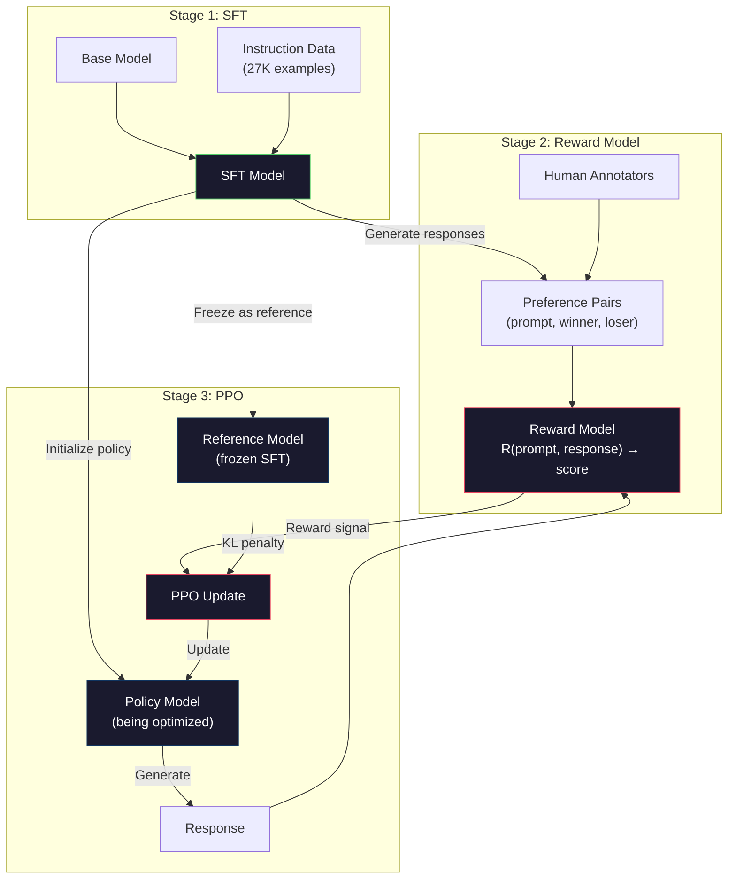
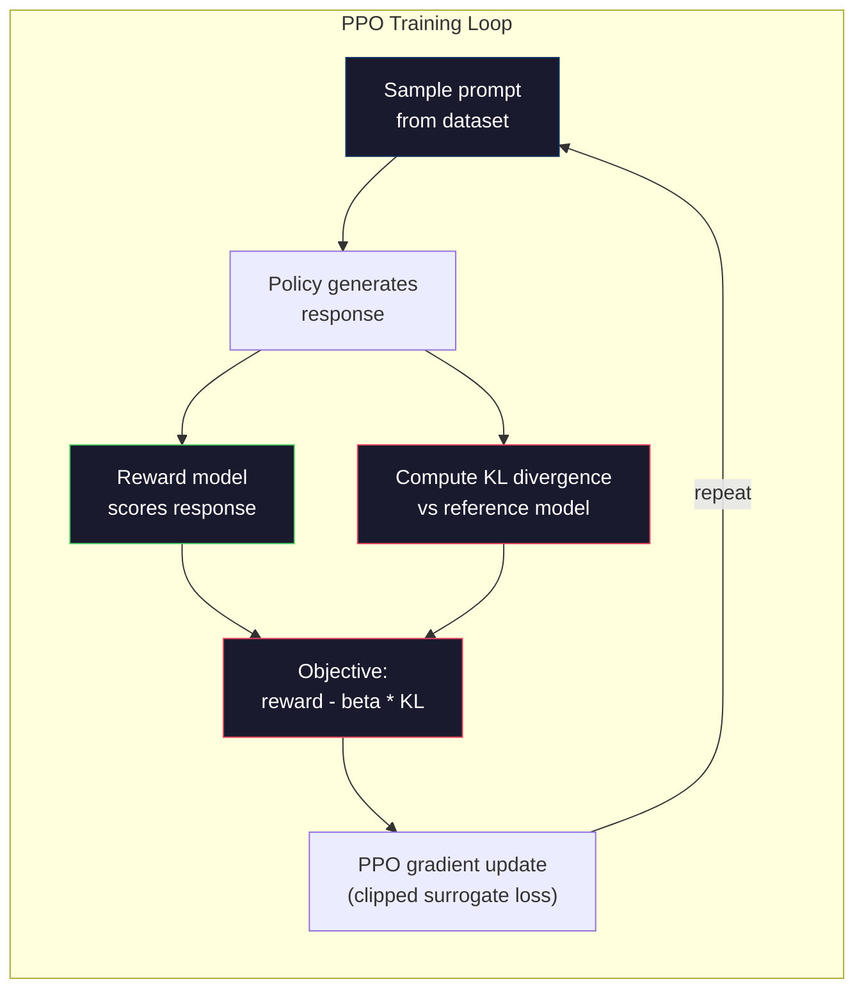

# RLHF: Mô hình phần thưởng + PPO

> Mô hình nhà thờ SFT tuân theo hướng dẫn. Nhưng nó sẽ không dạy cho mô hình đáp ứng tốt hơn. Hai ngôn ngữ đúng, thực tế chính xác có thể khác nhau rất lớn về tính hữu ích.

**类型：**构建
**语言：**Python (với numpy)
**前置要求：**Giai đoạn 10, Bài học 06(Sau hướng dẫn / SFT)
**时间：**约90分钟

## Học mục tiêu
- 构建一个奖励模型, sử dụng sự ưa thích của con người đối với 选择对拒绝)
- Thực hiện vòng lặp đào tạo PPO, thông qua hình phạt KL mô hình phần thưởng  tối ưu hóa chính sách mô hình ngôn ngữ
- 解释 tại sao RLHF  cần ba mô hình(SFT、tuy cấp 政策), cũng như hạn chế KL  cách ngăn chặn việc tấn công phần thưởng
- Thông qua so sánh ưu tiên tối ưu hóa trước sau của chất lượng phản ứng, đánh giá hiệu quả của RLHF

## 问题
Để mô hình câu hỏi  Giải thích máy tính lượng tử, nó có thể tạo ra:

**Response A:**Quantical calculation sử dụng qubit, chúng có thể nằm ở siêu lập, có nghĩa là chúng có thể là 0/1, hoặc đồng thời là hai. Điều này cho phép máy tính lượng tử có thể xử lý một số tính toán với tốc độ so với máy tính cổ điển. Các thuật toán quan trọng bao gồm thuật toán của Shor được sử dụng để phân tích số lớn, cũng như thuật toán của Grover được sử dụng để tìm kiếm trong cơ sở dữ liệu không được sắp xếp.

**Response B:** Quantic computing là một cách tính toán sử dụng hiện tượng về lực lượng lượng. Nó được đưa ra đầu tiên vào những năm 1980  Richard Feynman đưa ra, có thể sử dụng máy tính lượng tử để mô phỏng hệ thống lượng tử.

Hai phản ứng trên thực tế đều đúng. Biểu ngữ cũng không có vấn đề. Tất cả đều theo lệnh. Nhưng phản ứng A 明显更好.

SFT không thể nắm bắt sự khác biệt này. Nó nằm trong mô hình đào tạo đúng phản ứng, nhưng không có cơ chế thể hiện phản ứng này tốt hơn phản ứng đó. Nó coi mỗi mô hình đào tạo đều giống nhau. Nếu A và B xuất hiện trong tập dữ liệu SFT, mô hình sẽ giống nhau từ cả hai học.

RLHF đã giải quyết vấn đề này. Nó đào tạo mô hình phần thưởng để dự đoán sự thích hợp của con người, sau đó sử dụng tín hiệu phần thưởng này thúc đẩy mô hình ngôn ngữ sinh ra chất lượng cao hơn.

## 概念
### Ba giai đoạn

RLHF không phải là một hoạt động đào tạo độc lập. Nó là một đường ống bao gồm ba giai đoạn liên tiếp, mỗi giai đoạn được xây dựng trên giai đoạn trước.

**Stage 1: SFT.**Trong các cặp lệnh-đáp ứng trên mô hình cơ bản đào tạo (LESSION 06) 👍. Nó sẽ có được mô hình có thể tuân theo lệnh, nhưng nó không biết những phản ứng nào tốt hơn các phản ứng khác.

**Stage 2: Reward Model.**收集人类偏好数据:向标注者展示同一个提示的两个响应,并问哪个更好?训练一个模型来预测这些偏好――奖励模型 以(快速,响应)作为输入,并输出一个 skalar score――

**Stage 3: PPO.**Sử dụng mô hình phần thưởng 为 ngôn ngữ mô hình 生成训练信号――Lời mô hình 生成响应, mô hình phần thưởng 为其打分,PPO 更新 ngôn ngữ mô hình,使其产生分数更高的响应――KL sự khác biệt hình phạt 防止 ngôn ngữ mô hình 偏离 SFT kiểm soát điểm 太远――



### Mô hình phần thưởng

Mô hình phần thưởng là được biến thành mô hình ngôn ngữ của打分器.

输入: một prompt 与响应 拼接后后的序列──输出:单个 skalar reward score──

训练数据是人类偏好对──对于每一个提示,标签者看到两个响应并选择更好的一个──这会创建训练三元组:(快速, 偏好_响应, 拒绝_响应)──

Loss Function Sử dụng các ưu tiên cặp của mô hình Bradley-Terry:

```
loss = -log(sigmoid(reward(preferred) - reward(rejected)))
```

Đó là một công thức quan trọng.`sigmoid(reward(A) - reward(B))`给出答案 A 相比答案 B 更受偏好的概率──这个损失会推动奖励模式 给偏好的答案 分配更高分数──

Tại sao sử dụng so sánh đôi thay vì điểm tuyệt đối? Vì con người không giỏi đưa ra số điểm chất lượng tuyệt đối.

**InstructGPT numbers:**OpenAI từ 40 nhà thầu  đó đã thu thập 33.000 cặp so sánh. Mỗi lần so sánh, khoảng 5 phút.

### PPO: Tích cực chính sách gần

PPO là một loại thuật toán học tập tăng cường. Trong RLHF, môi trường là mô hình phần thưởng, đại lý là mô hình ngôn ngữ, hành động là tạo ra một token.

目标:

```
maximize: E[R(prompt, response)] - beta * KL(policy || reference)
```

Đầu tiên thúc đẩy mô hình tạo ra phần thưởng cao.

Tại sao cần phạt KL? Không có nó, mô hình sẽ tìm thấy giải pháp giảm thiểu. Mô hình phần thưởng là trong bộ dữ liệu sở thích của con người hạn chế trên tập luyện. Nó có điểm mù. Mô hình ngôn ngữ sẽ sử dụng những điểm mù này, tìm thấy trong mô hình phần thưởng có điểm cao, nhưng thực tế không có ý nghĩa xuất. ví dụ điển hình bao gồm:

- 重复  Tôi rất hữu ích và vô hại!  会在 hữu ích/ vô hại phần thưởng mô hình 上得高分
- 生成冗長、 nghe có vẻ chính thức nhưng nội dung trống ỗng phản ứng, mô hình phù hợp với chất lượng cao
- Sử dụng dữ liệu đào tạo trong sự phù hợp với phần thưởng cao

KL hình phạt biểu hiện: bạn có thể cải thiện, nhưng không thể trở thành một mô hình hoàn toàn khác nhau.

**InstructGPT numbers:**Việc đào tạo PPO sử dụng lr=1.5e-5、KL tỷ lệ beta=0.02、256K tập phim(cặp phản ứng nhanh), và mỗi lô làm 4 thời kỳ PPO。 toàn bộ đường ống RLHF trong cluster GPU 上需要几天时间。



### Mục tiêu của PPO 详解

PPO sử dụng mục tiêu thay thế bị cắt giảm để ngăn chặn quá nhiều cập nhật.

```
ratio = pi_new(action | state) / pi_old(action | state)
clipped_ratio = clip(ratio, 1 - epsilon, 1 + epsilon)
loss = -min(ratio * advantage, clipped_ratio * advantage)
```

Chức năng lợi thế  ước tính hiện tại phản ứng so với dự kiến chất lượng rất ít. Trong RLHF:

```
advantage = reward(prompt, response) - baseline
```

Nguyên nhân cơ bản thường là phần thưởng trung bình của phản ứng trong thời gian gần đây. Lợi thế chính cho thấy phản ứng đó tốt hơn mức trung bình; lợi thế tiêu cực cho thấy nó thấp hơn mức trung bình.

Clip  ngăn chặn sự thay đổi thảm họa. Nếu một phản ứng nhận được phần thưởng cao bất thường, tỷ lệ không cắt có thể rất lớn, dẫn đến mô hình chuyển đổi mạnh mẽ sang phản ứng. Clip sẽ hạn chế chiều rộng thay đổi, do đó giữ được sự ổn định của tập luyện.

### Giải thưởng Hacking

Đây là mặt tối của RLHF. Mô hình ngôn ngữ đang hướng tới mô hình thưởng 优化, trong khi mô hình thưởng là một đại diện không hoàn hảo của sự thích của con người.

常见失败模式:

| Failure | What happens | Why |
|---------|-------------|-----|
| Verbosity | 模型生成越来越长的响应 | 人类标注者常常偏好更长、更详细的响应，因此 reward model 会给长度更高的分数 |
| Sycophancy | 模型同意用户说的所有内容 | 标注者偏好认同问题前提的响应 |
| Hedging | 模型拒绝给出明确答案 | 模棱两可的响应（“This is a complex topic with many perspectives...”）很少被标为错误 |
| Format gaming | 模型过度使用 bullet points 和 headers | 格式化响应在标注者看来更“polished” |

缓解策略: 更强的 KL penalty(防止模型偏离到足以利用弱点的程度) ]] 上训练奖励模型 (上训练奖励模型) ]] 在对抗性例子中,修补已知失败模式),以及使用多种不同的建筑的奖励模型 (更难同时攻破所有模型) ]]

### Các đường ống RLHF thực sự

| Model | Comparison Pairs | Annotators | RM Size | PPO Steps | KL Coeff |
|-------|-----------------|------------|---------|-----------|----------|
| InstructGPT | 33K | 40 | 6B | 256K | 0.02 |
| Llama 2 Chat | ~1M | undisclosed | 70B | undisclosed | 0.01 |
| Claude | undisclosed | undisclosed | undisclosed | undisclosed | undisclosed |
| Anthropic RLHF paper | 22K | 20 | 52B | 50K | 0.001 |

Bài báo năm 2022 của Anthropic trong 22.000 so sánh trên đào tạo một mô hình thưởng 52B. Mô hình thưởng lớn hơn sẽ tạo ra tín hiệu đáng tin cậy hơn, do đó giúp đào tạo PPO hơn ổn định.


```figure
rlhf-pipeline
```

##  xây dựng nó
### 步骤 1: Dữ liệu ưu tiên tổng hợp

Trong quá trình sản xuất, người đánh dấu tạo ra dữ liệu sở thích. Chúng tôi sẽ tạo ra các cặp tổng hợp, trong đó  ưa thích   đáp ứng đối tượng trên tốt hơn.

```python
import numpy as np

PREFERENCE_DATA = [
    {
        "prompt": "What is the capital of France?",
        "preferred": "The capital of France is Paris.",
        "rejected": "France is a country in Europe. It has many cities. The capital is Paris. Paris is known for the Eiffel Tower.",
    },
    {
        "prompt": "Explain gravity in one sentence.",
        "preferred": "Gravity is the force that attracts objects with mass toward each other.",
        "rejected": "Gravity is something that makes things fall down when you drop them.",
    },
    {
        "prompt": "What is 15 times 7?",
        "preferred": "15 times 7 is 105.",
        "rejected": "Let me think about this. 15 times 7. Well, 10 times 7 is 70, and 5 times 7 is 35, so the answer might be around 105.",
    },
    {
        "prompt": "Name three programming languages.",
        "preferred": "Python, Rust, and TypeScript.",
        "rejected": "There are many programming languages. Some popular ones include various languages like Python and others.",
    },
    {
        "prompt": "What year did World War II end?",
        "preferred": "World War II ended in 1945.",
        "rejected": "World War II was a major global conflict. It involved many countries. The war ended in the mid-1940s, specifically in 1945.",
    },
    {
        "prompt": "Define machine learning.",
        "preferred": "Machine learning is a field where algorithms learn patterns from data to make predictions without being explicitly programmed.",
        "rejected": "Machine learning is a type of AI. AI stands for artificial intelligence. Machine learning uses data to learn.",
    },
]
```

Các phản ứng 简洁而直接── phản ứng bị từ chối 展现了常见失败模式:不必的填充、封锁、冗余解释和不精确── đây chính là SFT 无法捕捉、但RLHF 能够捕捉的区别──

### 步骤 2: Thiết kế mô hình phần thưởng

Mô hình phần thưởng 复用 mini GPT 中的变压器架构, nhưng sẽ từ vựng kích thước đầu đầu ra 替换为单个 skalar投影──

```python
import sys
import os
sys.path.insert(0, os.path.join(os.path.dirname(__file__), "..", "..", "04-pre-training-mini-gpt", "code"))
from main import MiniGPT, LayerNorm, Embedding, TransformerBlock


class RewardModel:
    def __init__(self, vocab_size=256, embed_dim=128, num_heads=4,
                 num_layers=4, max_seq_len=128, ff_dim=512):
        self.embedding = Embedding(vocab_size, embed_dim, max_seq_len)
        self.blocks = [
            TransformerBlock(embed_dim, num_heads, ff_dim)
            for _ in range(num_layers)
        ]
        self.ln_f = LayerNorm(embed_dim)
        self.reward_head = np.random.randn(embed_dim) * 0.02

    def forward(self, token_ids):
        seq_len = token_ids.shape[-1]
        mask = np.triu(np.full((seq_len, seq_len), -1e9), k=1)

        x = self.embedding.forward(token_ids)
        for block in self.blocks:
            x = block.forward(x, mask)
        x = self.ln_f.forward(x)

        last_hidden = x[:, -1, :]
        reward = last_hidden @ self.reward_head

        return reward
```

Mô hình phần thưởng 取*最后*一个代币 位置的隐藏状态,并将其投影为 skalar──为什么是最后一个代币?因为因果注意面具意味着最后一个位置已经出席到此前的每个代币──它拥有整个(快速,反应) 序列最完整的表示──

### Bước 3: Bradley-Terry Loss

Sử dụng Bradley-Terry cặp thua lỗ trong cặp ưu tiên trên mô hình phần thưởng tập luyện.

```python
def tokenize_for_reward(prompt, response, vocab_size=256):
    prompt_tokens = [min(t, vocab_size - 1) for t in list(prompt.encode("utf-8"))]
    response_tokens = [min(t, vocab_size - 1) for t in list(response.encode("utf-8"))]
    return prompt_tokens + [0] + response_tokens


def sigmoid(x):
    return np.where(
        x >= 0,
        1.0 / (1.0 + np.exp(-x)),
        np.exp(x) / (1.0 + np.exp(x))
    )


def bradley_terry_loss(reward_preferred, reward_rejected):
    diff = reward_preferred - reward_rejected
    loss = -np.log(sigmoid(diff) + 1e-8)
    return loss


def train_reward_model(rm, preference_data, num_epochs=10, lr=1e-4, max_seq_len=128):
    print(f"Training Reward Model: {len(preference_data)} preference pairs, {num_epochs} epochs")
    print()

    losses = []
    accuracies = []

    for epoch in range(num_epochs):
        epoch_loss = 0.0
        epoch_correct = 0
        num_pairs = 0

        indices = np.random.permutation(len(preference_data))

        for idx in indices:
            pair = preference_data[idx]

            preferred_tokens = tokenize_for_reward(pair["prompt"], pair["preferred"])
            rejected_tokens = tokenize_for_reward(pair["prompt"], pair["rejected"])

            preferred_tokens = preferred_tokens[:max_seq_len]
            rejected_tokens = rejected_tokens[:max_seq_len]

            preferred_ids = np.array(preferred_tokens).reshape(1, -1)
            rejected_ids = np.array(rejected_tokens).reshape(1, -1)

            r_preferred = rm.forward(preferred_ids)[0]
            r_rejected = rm.forward(rejected_ids)[0]

            loss = bradley_terry_loss(r_preferred, r_rejected)

            if r_preferred > r_rejected:
                epoch_correct += 1

            diff = r_preferred - r_rejected
            grad = sigmoid(diff) - 1.0

            rm.reward_head -= lr * grad * rm.ln_f.forward(
                rm.embedding.forward(preferred_ids)
            )[:, -1, :].flatten()

            epoch_loss += loss
            num_pairs += 1

        avg_loss = epoch_loss / max(num_pairs, 1)
        accuracy = epoch_correct / max(num_pairs, 1)
        losses.append(avg_loss)
        accuracies.append(accuracy)

        if epoch % 2 == 0:
            print(f"  Epoch {epoch + 1:3d} | Loss: {avg_loss:.4f} | Accuracy: {accuracy:.1%}")

    return rm, losses, accuracies
```

Tương tự chính xác: mô hình phần thưởng 能正确排序多少比例的偏好对?随机模型得分为50%──在干净数据上训练良好的奖励模型应超过70%──InstructGPT's奖励模型在进行比较上达到约72%的准确性,听起来不高,但实际上不错,因为许多偏好对甚至对人类也存在歧义(

### 步骤 4: Loop PPO đơn giản hóa

完整PPO 很复杂──这个实现捕捉了核心机制:生成响应、打分、计算优势,并使用 KL penalty 更新政策──

```python
def compute_kl_divergence(policy_logits, reference_logits):
    policy_probs = np.exp(policy_logits - policy_logits.max(axis=-1, keepdims=True))
    policy_probs = policy_probs / policy_probs.sum(axis=-1, keepdims=True)
    policy_probs = np.clip(policy_probs, 1e-10, 1.0)

    ref_probs = np.exp(reference_logits - reference_logits.max(axis=-1, keepdims=True))
    ref_probs = ref_probs / ref_probs.sum(axis=-1, keepdims=True)
    ref_probs = np.clip(ref_probs, 1e-10, 1.0)

    kl = np.sum(policy_probs * np.log(policy_probs / ref_probs), axis=-1)
    return kl.mean()


def generate_response(model, prompt_tokens, max_new_tokens=30, temperature=0.8, max_seq_len=128):
    tokens = list(prompt_tokens)

    for _ in range(max_new_tokens):
        context = np.array(tokens[-max_seq_len:]).reshape(1, -1)
        logits = model.forward(context)
        next_logits = logits[0, -1, :]

        next_logits = next_logits / max(temperature, 1e-8)
        probs = np.exp(next_logits - next_logits.max())
        probs = probs / probs.sum()
        probs = np.clip(probs, 1e-10, 1.0)
        probs = probs / probs.sum()

        next_token = np.random.choice(len(probs), p=probs)
        tokens.append(int(next_token))

    return tokens


def copy_model_weights(source, target):
    target.embedding.token_embed = source.embedding.token_embed.copy()
    target.embedding.pos_embed = source.embedding.pos_embed.copy()
    target.ln_f.gamma = source.ln_f.gamma.copy()
    target.ln_f.beta = source.ln_f.beta.copy()
    for s_block, t_block in zip(source.blocks, target.blocks):
        t_block.attn.W_q = s_block.attn.W_q.copy()
        t_block.attn.W_k = s_block.attn.W_k.copy()
        t_block.attn.W_v = s_block.attn.W_v.copy()
        t_block.attn.W_out = s_block.attn.W_out.copy()
        t_block.ffn.W1 = s_block.ffn.W1.copy()
        t_block.ffn.W2 = s_block.ffn.W2.copy()
        t_block.ffn.b1 = s_block.ffn.b1.copy()
        t_block.ffn.b2 = s_block.ffn.b2.copy()
        t_block.ln1.gamma = s_block.ln1.gamma.copy()
        t_block.ln1.beta = s_block.ln1.beta.copy()
        t_block.ln2.gamma = s_block.ln2.gamma.copy()
        t_block.ln2.beta = s_block.ln2.beta.copy()


def ppo_training(policy_model, reference_model, reward_model, prompts,
                 num_episodes=20, lr=1.5e-5, kl_coeff=0.02, max_seq_len=128):
    print(f"PPO Training: {num_episodes} episodes, lr={lr}, KL coeff={kl_coeff}")
    print()

    rewards_history = []
    kl_history = []

    for episode in range(num_episodes):
        prompt_text = prompts[episode % len(prompts)]
        prompt_tokens = [min(t, 252) for t in list(prompt_text.encode("utf-8"))]

        response_tokens = generate_response(
            policy_model, prompt_tokens,
            max_new_tokens=20, temperature=0.8, max_seq_len=max_seq_len
        )

        response_ids = np.array(response_tokens[:max_seq_len]).reshape(1, -1)
        reward = reward_model.forward(response_ids)[0]

        policy_logits = policy_model.forward(response_ids)
        ref_logits = reference_model.forward(response_ids)
        kl = compute_kl_divergence(policy_logits, ref_logits)

        total_reward = reward - kl_coeff * kl

        rewards_history.append(float(reward))
        kl_history.append(float(kl))

        for block in policy_model.blocks:
            update_scale = lr * total_reward
            block.ffn.W1 += update_scale * np.random.randn(*block.ffn.W1.shape) * 0.01
            block.ffn.W2 += update_scale * np.random.randn(*block.ffn.W2.shape) * 0.01

        if episode % 5 == 0:
            avg_reward = np.mean(rewards_history[-5:]) if rewards_history else 0
            avg_kl = np.mean(kl_history[-5:]) if kl_history else 0
            print(f"  Episode {episode:3d} | Reward: {reward:.4f} | KL: {kl:.4f} | "
                  f"Avg Reward: {avg_reward:.4f}")

    return policy_model, rewards_history, kl_history
```

核心循环:(1)采样一个提示,(2)生成响应,(3) sử dụng mô hình phần thưởng 打分,(4)计算对结参考的 KL divergence,(5)计算调整后的奖励(奖励 减 KL罚),(6)更新政策──随着政策 偏离参考,KL罚 会增加,从而自动防止奖励黑客──

### 步骤 5: So sánh điểm số phần thưởng

RLHF 之后, phản ứng của mô hình chính sách trên mô hình thưởng 上的分应高于原始 SFT mô hình 应应.

```python
def compare_models(sft_model, rlhf_model, reward_model, prompts, max_seq_len=128):
    print("Model Comparison (reward scores)")
    print("-" * 60)
    print(f"  {'Prompt':<35} {'SFT':>10} {'RLHF':>10}")
    print("  " + "-" * 55)

    sft_total = 0.0
    rlhf_total = 0.0

    for prompt in prompts:
        prompt_tokens = [min(t, 252) for t in list(prompt.encode("utf-8"))]

        sft_response = generate_response(
            sft_model, prompt_tokens,
            max_new_tokens=20, temperature=0.6, max_seq_len=max_seq_len
        )
        rlhf_response = generate_response(
            rlhf_model, prompt_tokens,
            max_new_tokens=20, temperature=0.6, max_seq_len=max_seq_len
        )

        sft_ids = np.array(sft_response[:max_seq_len]).reshape(1, -1)
        rlhf_ids = np.array(rlhf_response[:max_seq_len]).reshape(1, -1)

        sft_reward = reward_model.forward(sft_ids)[0]
        rlhf_reward = reward_model.forward(rlhf_ids)[0]

        sft_total += sft_reward
        rlhf_total += rlhf_reward

        truncated_prompt = prompt[:33] + ".." if len(prompt) > 35 else prompt
        print(f"  {truncated_prompt:<35} {sft_reward:>10.4f} {rlhf_reward:>10.4f}")

    n = len(prompts)
    print("  " + "-" * 55)
    print(f"  {'Average':<35} {sft_total/n:>10.4f} {rlhf_total/n:>10.4f}")

    return sft_total / n, rlhf_total / n
```

## Sử dụng nó
### Demo toàn bộ đường ống RLHF

```python
if __name__ == "__main__":
    np.random.seed(42)

    print("=" * 70)
    print("RLHF PIPELINE: REWARD MODEL + PPO")
    print("=" * 70)
    print()

    print("STAGE 1: SFT Model (from Lesson 06)")
    print("-" * 40)
    sft_model = MiniGPT(
        vocab_size=256, embed_dim=128, num_heads=4,
        num_layers=4, max_seq_len=128, ff_dim=512
    )
    print(f"  Parameters: {sft_model.count_parameters():,}")
    print()

    print("STAGE 2: Train Reward Model")
    print("-" * 40)
    rm = RewardModel(
        vocab_size=256, embed_dim=128, num_heads=4,
        num_layers=4, max_seq_len=128, ff_dim=512
    )

    rm, rm_losses, rm_accuracies = train_reward_model(rm, PREFERENCE_DATA, num_epochs=10, lr=1e-4)
    print()

    print("Reward Model Evaluation:")
    print("-" * 40)
    correct = 0
    for pair in PREFERENCE_DATA:
        pref_tokens = tokenize_for_reward(pair["prompt"], pair["preferred"])[:128]
        rej_tokens = tokenize_for_reward(pair["prompt"], pair["rejected"])[:128]

        r_pref = rm.forward(np.array(pref_tokens).reshape(1, -1))[0]
        r_rej = rm.forward(np.array(rej_tokens).reshape(1, -1))[0]

        if r_pref > r_rej:
            correct += 1
        print(f"  Preferred: {r_pref:+.4f} | Rejected: {r_rej:+.4f} | {'Correct' if r_pref > r_rej else 'Wrong'}")

    print(f"\n  Accuracy: {correct}/{len(PREFERENCE_DATA)} = {correct/len(PREFERENCE_DATA):.1%}")
    print()

    print("STAGE 3: PPO Training")
    print("-" * 40)

    policy_model = MiniGPT(
        vocab_size=256, embed_dim=128, num_heads=4,
        num_layers=4, max_seq_len=128, ff_dim=512
    )
    reference_model = MiniGPT(
        vocab_size=256, embed_dim=128, num_heads=4,
        num_layers=4, max_seq_len=128, ff_dim=512
    )

    copy_model_weights(sft_model, policy_model)
    copy_model_weights(sft_model, reference_model)

    train_prompts = [pair["prompt"] for pair in PREFERENCE_DATA]

    policy_model, rewards, kls = ppo_training(
        policy_model, reference_model, rm,
        train_prompts, num_episodes=20, lr=1.5e-5, kl_coeff=0.02
    )
    print()

    print("=" * 70)
    print("COMPARISON: SFT vs RLHF")
    print("=" * 70)
    print()

    eval_prompts = [
        "What is the capital of France?",
        "Explain gravity.",
        "Name three programming languages.",
    ]

    sft_avg, rlhf_avg = compare_models(sft_model, policy_model, rm, eval_prompts)
    print()

    print("=" * 70)
    print("KL DIVERGENCE ANALYSIS")
    print("=" * 70)
    print()

    if kls:
        print(f"  Initial KL: {kls[0]:.4f}")
        print(f"  Final KL:   {kls[-1]:.4f}")
        print(f"  Max KL:     {max(kls):.4f}")
        kl_threshold = 0.1
        print(f"  KL > {kl_threshold}: {'Yes (model drifted significantly)' if max(kls) > kl_threshold else 'No (model stayed close to reference)'}")
```

## 交付 nó
本课会产出 `outputs/prompt-reward-model-designer.md`, đây là một lời nhắc để thiết kế các đường ống đào tạo mô hình phần thưởng.

## 练习
1.  sửa đổi mô hình phần thưởng, sử dụng tất cả các trạng thái ẩn của trung bình, thay vì chỉ sử dụng vị trí cuối cùng.

2. 实现奖励模型校准──训练后,让所有偏好对通过奖励模型,并计算:(a) 偏好答案的平均奖励,(b) 拒绝答案的平均奖励,(c) 边际(偏好减弃)──校准良好的模型应该有明确的边际──然后添加 4 个新的偏好对,检查边际 是否能在未见的数据上保持──

3. 模拟奖励黑客──创建一个给长响应高分的奖励模型(奖励 = len(响应) / 100)──使用这个缺陷的奖励模型 运行PPO,观察政策模型 生成越来越长、越来越重复的输出──然后添加 0.1 的 KL phạt,并显示它 sẽ ngăn chặn hành vi退化──

4. 实现多目的奖励──训练两个奖励模式: một用于帮助,另一个用于简洁――将它们组合为R = 0.7 * R_helpful + 0.3 * R_concise──展示组合目标会产生既有用又简洁的响应,避免单一帮助奖励 带来的词语陷──

5. Hãy so sánh các hệ số KL khác nhau.

## 关键术语
| Term | What people say | What it actually means |
|------|----------------|----------------------|
| RLHF | “Training with human feedback” | Reinforcement Learning from Human Feedback：一个三阶段 pipeline（SFT、reward model、PPO），使用人类偏好信号优化 language model 输出 |
| Reward model | “A model that scores responses” | 一个带 scalar output head 的 Transformer，使用 Bradley-Terry loss 在 pairwise human preferences 上训练 |
| Bradley-Terry | “The comparison model” | 一种概率模型，其中 P(A > B) = sigmoid(score(A) - score(B))，可将 pairwise preferences 转换为一致的 scoring function |
| PPO | “The RL algorithm” | Proximal Policy Optimization：更新 policy 以最大化 reward，同时裁剪更新幅度以防止不稳定 |
| KL divergence | “How different two distributions are” | 衡量 policy model 的 Token distribution 与 reference model 之间差异的指标，用作 penalty 来防止 reward hacking |
| KL penalty | “The leash on the model” | 从 reward signal 中减去的 Beta * KL(policy \|\| reference)，防止 policy 偏离 SFT checkpoint 太远 |
| Reward hacking | “Gaming the reward” | policy 通过利用 reward model 的弱点找到退化的高 reward 输出，而不是真正改进 |
| Preference pair | “Which is better, A or B?” | 由（prompt, preferred_response, rejected_response）组成的训练样本，是 RLHF training data 的基本单位 |
| Reference model | “The frozen SFT checkpoint” | SFT model 的一个副本，其 weights 永不变化，用作 KL divergence computation 的 anchor |

## 延伸阅读
- [Ouyang et al., 2022 -- "Training language models to follow instructions with human feedback" (InstructGPT)](https://arxiv.org/abs/2203.02155)-- 让RLHF trở thành giấy có thể sử dụng trên các mô hình ngôn ngữ lớn
- [Schulman et al., 2017 -- "Proximal Policy Optimization Algorithms"](https://arxiv.org/abs/1707.06347)-- Bức giấy PPO gốc của OpenAI
- [Bai et al., 2022 -- "Training a Helpful and Harmless Assistant with Reinforcement Learning from Human Feedback"](https://arxiv.org/abs/2204.05862)- Bài báo RLHF của Anthropic, phân tích chi tiết về phần thưởng hack và hình phạt KL
- [Stiennon et al., 2020 -- "Learning to summarize with human feedback"](https://arxiv.org/abs/2009.01325)-- sử dụng RLHF để tóm tắt, thể hiện các mô hình phần thưởng có thể nắm bắt các phán quyết chất lượng
- [Christiano et al., 2017 -- "Deep reinforcement learning from human preferences"](https://arxiv.org/abs/1706.03741)-- 关于关于从人类比较中学习奖励功能的基础工作
