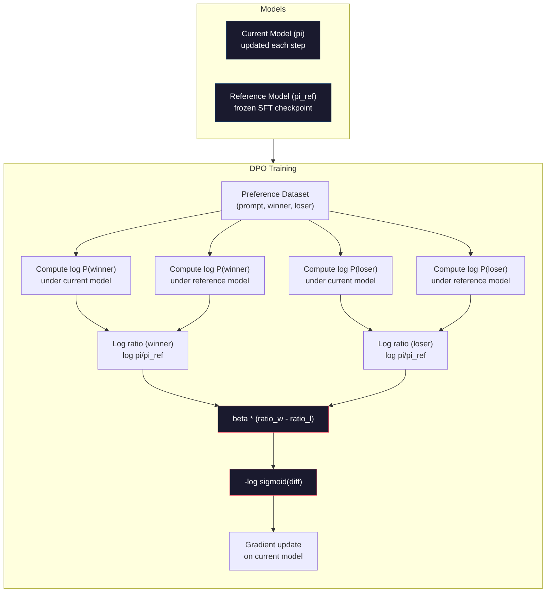

# DPO: Tích ứng ưu tiên trực tiếp

> RLHF có hiệu quả. Nhưng nó cũng cần phải đào tạo ba mô hình (SFT, reward model, policy), quản lý sự không ổn định của PPO,并调节 KL penalty, DPO sẽ hỏi: nếu bạn có thể nhảy qua tất cả những điều này?

**Type:** Build
**Languages:** Python (with numpy)
**Prerequisites:** Phase 10, Lesson 07 (RLHF)
**Time:** ~90 分钟

## Học mục tiêu
- Thực hiện đào tạo DPO, trực tiếp trên các cặp ưu tiên 上优化语言模型, không sử dụng mô hình phần thưởng độc lập
- 推导 DPO Loss Function,并 giải thích nó thông qua chính sách của log xác suất 隐式表示奖励模型
- Từ góc độ đào tạo ổn định, chi phí tính toán và số lượng mô hình cần thiết so sánh DPO với RLHF
- 调节 beta 参数, kiểm soát các hoạt động sau khi tập luyện chính sách 偏离参考模型的程度

## 问题
Bạn xây dựng một đường ống RLHF trong Bài học 07 ⋅ ba giai đoạn ⋅ ba mô hình ⋅ mô hình SFT ⋅ phần thưởng, cũng như mô hình chính sách tối ưu hóa PPO ⋅ mô hình phần thưởng ⋅ chỉ cần hàng ngàn cặp ưu tiên cá nhân và một vòng đào tạo riêng biệt ⋅ PPO ⋅ cần仔细调节 hệ số KL ⋅ tỷ lệ học tập ⋅ tỷ lệ clip và thời đại số lượng ⋅

Trong thực tế, đào tạo của nhân quyền được gọi là không ổn định. Một số biến đổi rất nhỏ có thể dẫn đến việc đào tạo lan rộng. Mô hình phần thưởng là một đại diện không hoàn hảo của sự ưu tiên của con người, trong khi chính sách sẽ tìm cách tận dụng những điểm yếu của nó.

Sự phức tạp này giải thích tại sao trong nhiều năm sau khi InstructGPT được phát hành, hầu hết các mô hình nguồn mở đều khó sử dụng RLHF.

Năm 2023 tháng 5 tháng 5, Rafael Rafailov, Archit Sharma của Stanford và các đồng nghiệp đã xuất bản Direct Preference Optimization: Your Language Model Is Secretly a Reward Model──核心洞见是:你不需要单独的奖励模型──最优奖励功能 在数学上由语言模型自身的代号概率决定──你可以完全跳过奖励模型,直接在偏好对上优化语言模型──

DPO sẽ đơn giản hóa RLHF thành một bước học tập giám sát 步骤――一个模型――一个损失函数――一个训练循环――没有强化学学习――Zephyr-7B là một trong những mô hình DPO sử dụng lớn nhất, trong nhiều tiêu chuẩn trên追平或超过了使用完整的 RLHF 训练模型――Meta đã sử dụng DPO――Anthropic cũng trong nghiên cứu sắp xếp của mình đề cập đến các phương pháp DPO 风格――

## 概念
### Sự hiểu biết quan trọng

RLHF 优化这个目标:

```
maximize: E[R(x, y)] - beta * KL(pi || pi_ref)
```

Trong đó, R là mô hình phần thưởng, pi là chính sách, pi_ref là mô hình tham chiếu, beta là hệ số KL。

Báo cáo DPO  chứng minh, mục tiêu này là kết thúc tốt nhất. Đối với bất kỳ chức năng thưởng R, chính sách tốt nhất là:

```
pi*(y | x) = pi_ref(y | x) * exp(R(x, y) / beta) / Z(x)
```

Trong đó, Z(x) là một số thường được phân loại lại:

```
R(x, y) = beta * log(pi*(y | x) / pi_ref(y | x)) + beta * log Z(x)
```

Đây là điểm đột phá. Phần thưởng được thể hiện hoàn toàn bằng cách sử dụng mô hình chính sách xác suất và mô hình tham chiếu xác suất. Bạn không cần phải đào tạo mô hình phần thưởng riêng biệt.

Thay vào mô hình ưu tiên Bradley-Terry:

```
P(y_w > y_l | x) = sigmoid(R(x, y_w) - R(x, y_l))
                  = sigmoid(beta * (log pi(y_w|x)/pi_ref(y_w|x) - log pi(y_l|x)/pi_ref(y_l|x)))
```

Z(x) 项会抵消, vì hai phản ứng đều có cùng một prompt x 为条件―― còn lại chỉ là mô hình chính sách và mô hình tham chiếu trong các phản ứng ưa thích và từ chối trên các hàm log-chỉ có thể 

### Sự mất mát của DPO

```
L_DPO = -log(sigmoid(beta * (log pi(y_w|x)/pi_ref(y_w|x) - log pi(y_l|x)/pi_ref(y_l|x))))
```

Chúng tôi giải quyết từng phần:

- **y_w**= ưa thích (được) trả lời
- **y_l**= phản ứng bị từ chối
- **x**= nhanh chóng
- **pi**= 当前模型(正在训练)
- **pi_ref**= mô hình tham chiếu (số kiểm soát SFT)
- **beta**= 控制偏离 度度温度 参数(thường là 0,1 đến 0,5)

比 giá trị`log pi(y|x) / pi_ref(y|x)`là tỷ lệ xác suất log-quả thuận. Khi tỷ lệ này là đúng thời gian, tỷ lệ xác suất của mô hình hiện tại cho phép phản ứng y cao hơn so với tham chiếu.

DPO Loss sẽ thúc đẩy mô hình nâng cao tỷ lệ xác suất log của các phản ứng ưa thích,并 giảm tỷ lệ xác suất log của các phản ứng bị từ chối.



### Tại sao DPO đơn giản hơn

| Aspect | RLHF (PPO) | DPO |
|--------|-----------|-----|
| 需要训练的模型 | 3（SFT + reward + policy） | 1（仅 policy） |
| Training loops | 3（SFT、RM training、PPO） | 2（SFT、DPO） |
| Hyperparameters | lr、KL coeff、clip ratio、RM lr、epochs x3 | lr、beta、epochs |
| Reward model | 必需（单独训练） | 隐式存在于模型概率中 |
| RL algorithm | PPO（复杂、不稳定） | Supervised learning（稳定） |
| GPU memory | PPO 期间内存中有 3-4 个模型 | 2 个模型（current + reference） |
| 训练稳定性 | 对 hyperparameters 敏感 | 稳健，类似 SFT |

DPO  đào tạo cần phải đặt trong bộ nhớ hai mô hình: mô hình hiện tại và kết luận của tham chiếu. RLHF  cần ba hoặc bốn mô hình: chính sách  tham chiếu  thưởng, cũng như các tùy chọn giá trị chức năng cơ sở. Đối với mô hình 70B, mỗi副本 trong FP16 下 cần 140GB.

### Khi DPO đánh bại RLHF

**小数据集。**Trong quy mô 5.000-20.000 cặp ưu tiên, DPO thường có thể theo đuổi hoặc vượt quá RLHF.

**计算资源有限。**DPO chỉ cần một khối lượng RLHF hoàn chỉnh.

**快速迭代。**想尝试 10 bộ dữ liệu sở thích khác nhau, xem có mô hình nào có thể tạo ra tốt nhất?DPO 让你能在几个小时内完成每次实验.

### Khi RLHF đánh bại DPO

**大规模训练。**Trên quy mô GPT-4 hoặc Claude, mô hình phần thưởng độc lập của RLHF có thể nắm bắt các tín hiệu ưu tiên chi tiết hơn. mô hình phần thưởng được sử dụng như một chức năng mất mát học tập, có thể phù hợp với các tiêu chuẩn chất lượng phức tạp.

**复杂 reward signals。**Khi    liên quan đến nhiều chiều ((làm hữu ích, vô hại, trung thực) thì mô hình phần thưởng có thể học được phương pháp cân bằng nhiều mục tiêu này.

**迭代式 alignment。**Các đường ống RLHF có thể sử dụng chính sách hiện tại để tạo ra các phản ứng mới, để tạo ra đánh giá cho con người, sau đó trong vòng lặp trực tuyến tái tập luyện mô hình phần thưởng.

### DPO  ngoài: KTO, ORPO, SimPO

DPO bắt đầu một loạt các phương pháp sắp xếp đơn giản hóa.

**KTO (Kahneman-Tversky Optimization, 2024)：**Bạn thậm chí không cần phải thành lập đối với dữ liệu. KTO sử dụng không được đối phó với phản: chỉ cần đánh dấu mỗi phản ứng được đánh dấu là  tốt hoặc  xấu, và không cần so sánh nó với một thay thế khác. Điều này đơn giản hóa đáng kể việc thu thập dữ liệu. Không phải cho người đánh dấu hiển thị hai phản ứng và hỏi  tốt hơn?, mà cho phép hiển thị một phản ứng và hỏi  tốt hơn? Loss Function  áp dụng lỗ hổng trong lý thuyết tiền cảnh: phản ứng xấu bị trừng phạt lớn hơn phản ứng tốt  nhận được phần thưởng

**ORPO (Odds Ratio Preference Optimization, 2024)：**Để phân tích SFT và sự sắp xếp 合并到一个训练步骤中.ORPO không phải là làm trước SFT và làm lại DPO, mà thay vào đó sửa đổi SFT Loss, làm cho nó chứa tín hiệu ưu tiên.

**SimPO (Simple Preference Optimization, 2024)：**完全消除参考模型──SIMPO 不再针对结的参考 计算日志概率比例,而是使用响应的平均日志概率──按长度归结) 作为隐式回报──这省内存──不需要参考模型──并简化训练──长度归结防止模型偏好更短的响应──

| Method | Year | Models in Memory | Needs Pairs? | Needs Reference? | Training Loops |
|--------|------|-----------------|-------------|-----------------|----------------|
| RLHF | 2022 | 3-4 | Yes（用于 RM） | Yes | 3 |
| DPO | 2023 | 2 | Yes | Yes | 2 |
| KTO | 2024 | 2 | No（未配对） | Yes | 2 |
| ORPO | 2024 | 1 | Yes | No | 1 |
| SimPO | 2024 | 1 | Yes | No | 1 |

趋势 rất rõ ràng: mỗi phương pháp đều loại bỏ một phần phức tạp. RLHF 需要奖励模型和 PPO.DPO 消除二者.KTO 消除成对数据.ORPO 消除单独的SFT 阶段.

### Việc triển khai DPO thực sự

**Zephyr-7B (HuggingFace, October 2023)：**Với cơ sở Mistral 7B, làm SFT trên UltraChat (trước 200K ví dụ) và sau đó làm DPO trên UltraFeedback (trước 60K các cặp ưu tiên) trên MT-Bench trên điểm số 6.47, là điểm số cao nhất của mô hình 7B.

**Llama 3 (Meta, April 2024)：**Trong giai đoạn đầu của RLHF sau đó sử dụng DPO.

**Neural Magic / nm-chat (2024)：**DPO được áp dụng cho nhiều mô hình nguồn mở, và ổn định hiển thị tăng trưởng so với chỉ SFT cơ sở trong các điểm chuẩn sắp xếp trên 5-15%


```figure
dpo-loss
```

##  xây dựng nó
### 步骤 1: Preference Dataset

Với RLHF 使用相同格式:(quan, ưa thích, từ chối) 三元组──DPO 直接消费这些数据,不需要中间的奖励模型──

```python
import numpy as np
import sys
import os
sys.path.insert(0, os.path.join(os.path.dirname(__file__), "..", "..", "04-pre-training-mini-gpt", "code"))
from main import MiniGPT, LayerNorm, Embedding, TransformerBlock

PREFERENCE_DATA = [
    {
        "prompt": "What is the capital of France?",
        "preferred": "The capital of France is Paris.",
        "rejected": "France is a country in Europe. It has many cities. The capital is Paris. Paris is known for the Eiffel Tower.",
    },
    {
        "prompt": "Explain gravity in one sentence.",
        "preferred": "Gravity is the force that attracts objects with mass toward each other.",
        "rejected": "Gravity is something that makes things fall down when you drop them.",
    },
    {
        "prompt": "What is 15 times 7?",
        "preferred": "15 times 7 is 105.",
        "rejected": "Let me think about this. 15 times 7. Well, 10 times 7 is 70, and 5 times 7 is 35, so the answer might be around 105.",
    },
    {
        "prompt": "Name three programming languages.",
        "preferred": "Python, Rust, and TypeScript.",
        "rejected": "There are many programming languages. Some popular ones include various languages like Python and others.",
    },
    {
        "prompt": "What year did World War II end?",
        "preferred": "World War II ended in 1945.",
        "rejected": "World War II was a major global conflict. It involved many countries. The war ended in the mid-1940s, specifically in 1945.",
    },
    {
        "prompt": "Define machine learning.",
        "preferred": "Machine learning is a field where algorithms learn patterns from data to make predictions without being explicitly programmed.",
        "rejected": "Machine learning is a type of AI. AI stands for artificial intelligence. Machine learning uses data to learn.",
    },
]
```

### 步骤 2: Log-Probability của chuỗi

DPO Loss 需要计算给定提示时某个响应的总日记概率──这意味着要在完整的(快速+响应)序列上运行模型,并对每个响应代币的日记概率求和──

```python
def tokenize_sequence(text, vocab_size=256):
    return [min(t, vocab_size - 1) for t in list(text.encode("utf-8"))]


def compute_sequence_log_prob(model, prompt_tokens, response_tokens, max_seq_len=128):
    full_sequence = prompt_tokens + response_tokens
    if len(full_sequence) > max_seq_len:
        full_sequence = full_sequence[:max_seq_len]

    if len(full_sequence) < 2:
        return 0.0

    input_ids = np.array(full_sequence[:-1]).reshape(1, -1)
    target_ids = np.array(full_sequence[1:])

    logits = model.forward(input_ids)
    logits = logits[0]

    max_logits = logits.max(axis=-1, keepdims=True)
    log_probs = logits - max_logits - np.log(
        np.exp(logits - max_logits).sum(axis=-1, keepdims=True)
    )

    prompt_len = len(prompt_tokens)
    response_start = max(0, prompt_len - 1)
    response_end = len(target_ids)

    if response_start >= response_end:
        return 0.0

    response_log_probs = log_probs[response_start:response_end, :]
    response_targets = target_ids[response_start:response_end]

    total_log_prob = 0.0
    for i, target in enumerate(response_targets):
        total_log_prob += response_log_probs[i, target]

    return total_log_prob
```

Đây là công cụ cốt lõi của DPO. Đối với mỗi cặp ưu tiên, nó sẽ chạy bốn lần: mô hình 计算 ưu tiên phản ứng, mô hình 计算 từ chối phản ứng, tham chiếu 计算 ưu tiên phản ứng, tham chiếu 计算 từ chối phản ứng.

### 步骤 3: Sự mất mát của DPO

论文核心用代码表示──一个函数──一个 Loss──不需要奖励模型──

```python
def sigmoid(x):
    return np.where(
        x >= 0,
        1.0 / (1.0 + np.exp(-x)),
        np.exp(x) / (1.0 + np.exp(x))
    )


def dpo_loss(policy_logprob_preferred, policy_logprob_rejected,
             ref_logprob_preferred, ref_logprob_rejected, beta=0.1):
    preferred_ratio = policy_logprob_preferred - ref_logprob_preferred
    rejected_ratio = policy_logprob_rejected - ref_logprob_rejected

    logit = beta * (preferred_ratio - rejected_ratio)

    loss = -np.log(sigmoid(logit) + 1e-8)

    preferred_reward = beta * preferred_ratio
    rejected_reward = beta * rejected_ratio

    return loss, {
        "preferred_ratio": float(preferred_ratio),
        "rejected_ratio": float(rejected_ratio),
        "logit": float(logit),
        "implicit_preferred_reward": float(preferred_reward),
        "implicit_rejected_reward": float(rejected_reward),
        "reward_margin": float(preferred_reward - rejected_reward),
    }
```

`preferred_ratio`和 `rejected_ratio`là tỷ lệ xác suất log trong DPO 推导──当前模型 (trên mô hình hiện tại) đối với tham chiếu) cho phản ứng ưa thích 分配更高概率,并 cho phản ứng bị từ chối 分配更低概率时, logic 为正,Loss 较低──训练信号正是把模型推向这个方向──

`implicit_preferred_reward`和 `implicit_rejected_reward`Đó là những phần thưởng được phân phối trong hình thức DPO Loss. Bạn có thể lấy chúng để kiểm tra liệu huấn luyện có hiệu quả hay không: tỷ lệ giữa các phần thưởng được ưu tiên và bị từ chối nên tăng trong quá trình huấn luyện.

### Bước 4: Lòng đào tạo DPO

Một vòng đào tạo được giám sát tiêu chuẩn. Không có PPO. Không có mô hình thưởng. Chỉ có vượt qua và cập nhật gradient.

```python
def copy_model_weights(source, target):
    target.embedding.token_embed = source.embedding.token_embed.copy()
    target.embedding.pos_embed = source.embedding.pos_embed.copy()
    target.ln_f.gamma = source.ln_f.gamma.copy()
    target.ln_f.beta = source.ln_f.beta.copy()
    for s_block, t_block in zip(source.blocks, target.blocks):
        t_block.attn.W_q = s_block.attn.W_q.copy()
        t_block.attn.W_k = s_block.attn.W_k.copy()
        t_block.attn.W_v = s_block.attn.W_v.copy()
        t_block.attn.W_out = s_block.attn.W_out.copy()
        t_block.ffn.W1 = s_block.ffn.W1.copy()
        t_block.ffn.W2 = s_block.ffn.W2.copy()
        t_block.ffn.b1 = s_block.ffn.b1.copy()
        t_block.ffn.b2 = s_block.ffn.b2.copy()
        t_block.ln1.gamma = s_block.ln1.gamma.copy()
        t_block.ln1.beta = s_block.ln1.beta.copy()
        t_block.ln2.gamma = s_block.ln2.gamma.copy()
        t_block.ln2.beta = s_block.ln2.beta.copy()


def dpo_train(policy_model, reference_model, preference_data,
              num_epochs=5, lr=5e-6, beta=0.1, max_seq_len=128):
    print(f"DPO Training: {len(preference_data)} pairs, {num_epochs} epochs, "
          f"lr={lr}, beta={beta}")
    print()

    losses = []
    margins = []

    for epoch in range(num_epochs):
        epoch_loss = 0.0
        epoch_margin = 0.0
        num_examples = 0

        indices = np.random.permutation(len(preference_data))

        for idx in indices:
            pair = preference_data[idx]

            prompt_tokens = tokenize_sequence(pair["prompt"])
            preferred_tokens = tokenize_sequence(pair["preferred"])
            rejected_tokens = tokenize_sequence(pair["rejected"])

            pi_logprob_w = compute_sequence_log_prob(
                policy_model, prompt_tokens, preferred_tokens, max_seq_len
            )
            pi_logprob_l = compute_sequence_log_prob(
                policy_model, prompt_tokens, rejected_tokens, max_seq_len
            )
            ref_logprob_w = compute_sequence_log_prob(
                reference_model, prompt_tokens, preferred_tokens, max_seq_len
            )
            ref_logprob_l = compute_sequence_log_prob(
                reference_model, prompt_tokens, rejected_tokens, max_seq_len
            )

            loss, metrics = dpo_loss(
                pi_logprob_w, pi_logprob_l,
                ref_logprob_w, ref_logprob_l, beta
            )

            update_direction = 1.0 if metrics["logit"] < 0 else -0.1
            for block in policy_model.blocks:
                block.ffn.W1 += lr * update_direction * np.random.randn(*block.ffn.W1.shape) * 0.01
                block.ffn.W2 += lr * update_direction * np.random.randn(*block.ffn.W2.shape) * 0.01

            epoch_loss += loss
            epoch_margin += metrics["reward_margin"]
            num_examples += 1
            losses.append(float(loss))
            margins.append(metrics["reward_margin"])

        avg_loss = epoch_loss / max(num_examples, 1)
        avg_margin = epoch_margin / max(num_examples, 1)

        print(f"  Epoch {epoch + 1}/{num_epochs} | Loss: {avg_loss:.4f} | "
              f"Avg Margin: {avg_margin:.4f}")

    return policy_model, losses, margins
```

So với RLHF 相比, vòng đào tạo này 简洁得令人耳目一新── đối với mỗi cặp ưu tiên:计算四个日志-概率──两个模型──两个答案), sẽ đưa chúng vào DPO Loss,计算 Gradient,更新政策──没有生成步骤──没有奖励模型推断──没有优势估计──没有剪辑──

### 步骤 5: So sánh DPO vs RLHF

测量隐式奖励率和日志概率变化,将 DPO với mô hình RLHF trong Bài 07 进行比较──

```python
def evaluate_preference_accuracy(model, reference_model, preference_data, beta=0.1, max_seq_len=128):
    correct = 0
    total = 0

    for pair in preference_data:
        prompt_tokens = tokenize_sequence(pair["prompt"])
        preferred_tokens = tokenize_sequence(pair["preferred"])
        rejected_tokens = tokenize_sequence(pair["rejected"])

        pi_w = compute_sequence_log_prob(model, prompt_tokens, preferred_tokens, max_seq_len)
        pi_l = compute_sequence_log_prob(model, prompt_tokens, rejected_tokens, max_seq_len)
        ref_w = compute_sequence_log_prob(reference_model, prompt_tokens, preferred_tokens, max_seq_len)
        ref_l = compute_sequence_log_prob(reference_model, prompt_tokens, rejected_tokens, max_seq_len)

        preferred_reward = beta * (pi_w - ref_w)
        rejected_reward = beta * (pi_l - ref_l)

        if preferred_reward > rejected_reward:
            correct += 1
        total += 1

    return correct / max(total, 1)


def analyze_implicit_rewards(model, reference_model, preference_data, beta=0.1, max_seq_len=128):
    print("Implicit Reward Analysis:")
    print("-" * 65)
    print(f"  {'Prompt':<30} {'Pref Reward':>12} {'Rej Reward':>12} {'Margin':>10}")
    print("  " + "-" * 60)

    for pair in preference_data:
        prompt_tokens = tokenize_sequence(pair["prompt"])
        preferred_tokens = tokenize_sequence(pair["preferred"])
        rejected_tokens = tokenize_sequence(pair["rejected"])

        pi_w = compute_sequence_log_prob(model, prompt_tokens, preferred_tokens, max_seq_len)
        pi_l = compute_sequence_log_prob(model, prompt_tokens, rejected_tokens, max_seq_len)
        ref_w = compute_sequence_log_prob(reference_model, prompt_tokens, preferred_tokens, max_seq_len)
        ref_l = compute_sequence_log_prob(reference_model, prompt_tokens, rejected_tokens, max_seq_len)

        pref_reward = beta * (pi_w - ref_w)
        rej_reward = beta * (pi_l - ref_l)
        margin = pref_reward - rej_reward

        truncated = pair["prompt"][:28] + ".." if len(pair["prompt"]) > 30 else pair["prompt"]
        print(f"  {truncated:<30} {pref_reward:>12.4f} {rej_reward:>12.4f} {margin:>10.4f}")

    print()
```

### 步骤 6: Phân tích nhạy cảm beta

Beta là một số phần tử của hệ số RLHF trong DPO. Nó có thể điều khiển mô hình có thể di chuyển từ mức độ tham chiếu.

```python
def beta_sensitivity_analysis(sft_model, preference_data, betas, max_seq_len=128):
    print("Beta Sensitivity Analysis")
    print("-" * 60)
    print(f"  {'Beta':>8} {'Final Loss':>12} {'Final Margin':>14} {'Accuracy':>10}")
    print("  " + "-" * 55)

    results = []

    for beta in betas:
        policy = MiniGPT(
            vocab_size=256, embed_dim=128, num_heads=4,
            num_layers=4, max_seq_len=max_seq_len, ff_dim=512
        )
        reference = MiniGPT(
            vocab_size=256, embed_dim=128, num_heads=4,
            num_layers=4, max_seq_len=max_seq_len, ff_dim=512
        )
        copy_model_weights(sft_model, policy)
        copy_model_weights(sft_model, reference)

        policy, losses, margins_list = dpo_train(
            policy, reference, preference_data,
            num_epochs=3, lr=5e-6, beta=beta, max_seq_len=max_seq_len
        )

        accuracy = evaluate_preference_accuracy(
            policy, reference, preference_data, beta, max_seq_len
        )

        final_loss = losses[-1] if losses else 0
        final_margin = margins_list[-1] if margins_list else 0

        print(f"  {beta:>8.3f} {final_loss:>12.4f} {final_margin:>14.4f} {accuracy:>10.1%}")
        results.append({
            "beta": beta,
            "final_loss": final_loss,
            "final_margin": final_margin,
            "accuracy": accuracy,
        })

        print()

    return results
```

较小的beta(0.01) cho phép mô hình tự do phân định tham chiếu: học nhanh, nhưng có sự phân giải风险.

## Sử dụng nó
### DPO toàn bộ đường ống Demo

```python
if __name__ == "__main__":
    np.random.seed(42)

    print("=" * 70)
    print("DPO: DIRECT PREFERENCE OPTIMIZATION")
    print("=" * 70)
    print()

    print("STEP 1: Initialize SFT Model (from Lesson 06)")
    print("-" * 50)
    sft_model = MiniGPT(
        vocab_size=256, embed_dim=128, num_heads=4,
        num_layers=4, max_seq_len=128, ff_dim=512
    )
    print(f"  Parameters: {sft_model.count_parameters():,}")
    print()

    print("STEP 2: DPO Training")
    print("-" * 50)

    policy_model = MiniGPT(
        vocab_size=256, embed_dim=128, num_heads=4,
        num_layers=4, max_seq_len=128, ff_dim=512
    )
    reference_model = MiniGPT(
        vocab_size=256, embed_dim=128, num_heads=4,
        num_layers=4, max_seq_len=128, ff_dim=512
    )
    copy_model_weights(sft_model, policy_model)
    copy_model_weights(sft_model, reference_model)

    policy_model, losses, margins = dpo_train(
        policy_model, reference_model, PREFERENCE_DATA,
        num_epochs=5, lr=5e-6, beta=0.1
    )
    print()

    print("=" * 70)
    print("STEP 3: Evaluate")
    print("=" * 70)
    print()

    pre_accuracy = evaluate_preference_accuracy(
        sft_model, reference_model, PREFERENCE_DATA, beta=0.1
    )
    post_accuracy = evaluate_preference_accuracy(
        policy_model, reference_model, PREFERENCE_DATA, beta=0.1
    )

    print(f"  Preference accuracy (pre-DPO):  {pre_accuracy:.1%}")
    print(f"  Preference accuracy (post-DPO): {post_accuracy:.1%}")
    print()

    analyze_implicit_rewards(policy_model, reference_model, PREFERENCE_DATA, beta=0.1)

    print("=" * 70)
    print("STEP 4: Training Dynamics")
    print("=" * 70)
    print()

    if losses:
        print("  Loss curve:")
        window = max(1, len(losses) // 5)
        for i in range(0, len(losses), window):
            chunk = losses[i:i + window]
            avg = sum(chunk) / len(chunk)
            print(f"    Steps {i:3d}-{i + len(chunk) - 1:3d}: loss = {avg:.4f}")
        print()

    if margins:
        print("  Reward margin curve:")
        window = max(1, len(margins) // 5)
        for i in range(0, len(margins), window):
            chunk = margins[i:i + window]
            avg = sum(chunk) / len(chunk)
            print(f"    Steps {i:3d}-{i + len(chunk) - 1:3d}: margin = {avg:.4f}")
        print()

    print("=" * 70)
    print("STEP 5: Beta Sensitivity")
    print("=" * 70)
    print()

    beta_results = beta_sensitivity_analysis(
        sft_model, PREFERENCE_DATA, betas=[0.01, 0.1, 0.3, 1.0]
    )

    print("=" * 70)
    print("DPO vs RLHF COMPARISON")
    print("=" * 70)
    print()
    print("  DPO advantages:")
    print("    - 1 training loop (vs 3 for RLHF)")
    print("    - 2 models in memory (vs 3-4 for RLHF)")
    print("    - Supervised learning (vs RL, more stable)")
    print("    - No reward model to train or maintain")
    print()
    print("  RLHF advantages:")
    print("    - Separate reward model captures complex preferences")
    print("    - Online learning: generate, rate, retrain")
    print("    - Better for multi-objective alignment")
    print("    - Proven at largest scales (GPT-4, Claude)")
    print()
    print("  Practical guidance:")
    print("    - Start with DPO. It's simpler and often sufficient.")
    print("    - Switch to RLHF if DPO plateaus on your eval metrics.")
    print("    - Many production systems use both: RLHF first, DPO to refine.")
```

## 交付 nó
本课会产出 `outputs/prompt-alignment-method-selector.md`Một giúp bạn để sử dụng cho việc chọn đúng sự sắp xếp  phương pháp  SFT、RLHF、DPO、KTO、ORPO、SimPO)  cho định sẵn dữ liệu của bạn  Kế hoạch và mục tiêu 

## 练习
1. 实现 KTO (Kahneman-Tversky Optimization) ・ KTO không cần phải thành lập đối với dữ liệu, chỉ cần để mỗi phản ứng 标记为好或坏──Lát suất của phản ứng tốt là `-log(sigmoid(beta * log_ratio))`, phản ứng xấu của mất là `-log(1 - sigmoid(beta * log_ratio))`,并 đối với phản ứng xấu Loss Sử dụng lỗ 厌恶乘数(thường là 1.5x)。 Trong cùng một phần dữ liệu training(分别将优先 当作好、拒绝 当作坏),并与 DPO比较精度──

2. 实现 DPO-normalized length―― không sử dụng xác suất log nguyên thủy, mà là số lượng mã phản ứng:`normalized_logprob = total_logprob / num_tokens` Điều này có thể ngăn chặn các phản ứng của mô hình có ưu tiên ngắn hơn (có tổng log-prob cao hơn) 

3. 构建一个ORPO 风格的组合损失──向DPO Loss 中添加首选响应 上的标准下一个代码预测损失:`L = L_sft(preferred) + alpha * L_dpo` thử 0.1、0.5 và 1.0 của alpha 值── kết hợp lỗ 应产生一个既能遵循指令的模型 (đối với các SFT 项) 并且偏好更好的反应 (đối với các DPO 项) ,从而消除对单独 SFT 阶段的需求──

4. Thực hiện DPO lặp lại, chạy DPO 3 thời đại, sau đó từ mô hình sau khi tập tạo ra các phản ứng mới, sẽ kết hợp chúng với các phản ứng ưa thích ban đầu, phối hợp cho các cặp ưu tiên mới, một lần nữa chạy DPO, thực hiện hai vòng này  tự chơi 流程.

5. Hãy thử: a) mô hình cơ sở (pre-SFT), b) mô hình kiểm soát thời đại (DPO), c) trung bình di chuyển thoáng của mô hình chính sách (rapport哪个参考) tạo ra độ chính xác ưa thích cao nhất và đường cong đào tạo ổn định nhất.

## 关键术语
| Term | What people say | What it actually means |
|------|----------------|----------------------|
| DPO | “没有 RL 的 RLHF” | Direct Preference Optimization：一种 supervised learning algorithm，直接在 preference pairs 上优化语言模型，绕过 reward model 和 PPO |
| Implicit reward | “reward 在模型里” | reward function 由 policy 与 reference models 之间的 log-probability ratio 决定，不需要单独的 reward model |
| Beta (DPO) | “temperature” | 控制 policy 可以偏离 reference model 的程度：小 beta 允许大偏离，大 beta 让模型保持接近 |
| Log-probability ratio | “模型变化了多少” | log pi(y\|x) - log pi_ref(y\|x)：正值表示当前模型分配的概率高于 reference |
| Reference model | “冻结的 checkpoint” | SFT model 的一个副本，其 weights 永不改变，用作计算概率比的锚点 |
| KTO | “没有成对数据的 DPO” | Kahneman-Tversky Optimization：使用未配对的“good”或“bad”labels，而不是要求 preference pairs |
| ORPO | “一步 alignment” | Odds Ratio Preference Optimization：通过向 SFT Loss 添加 preference term，将 SFT 和 alignment 合并到单个 training loop |
| SimPO | “不需要 reference” | Simple Preference Optimization：通过使用长度归一化的平均 log-probability 作为隐式 reward，消除 reference model |
| Alignment tax | “让模型安全的成本” | 从 base model 到 aligned model 所需的额外计算、数据和复杂性；DPO 显著降低了这一成本 |

## 延伸阅读
- [Rafailov et al., 2023 -- "Direct Preference Optimization: Your Language Model is Secretly a Reward Model"](https://arxiv.org/abs/2305.18290)-- sẽ sắp xếp từ RLHF  đơn giản hóa cho học tập giám sát của giấy tờ DPO
- [Tunstall et al., 2023 -- "Zephyr: Direct Distillation of LM Alignment"](https://arxiv.org/abs/2310.16944)- Zephyr-7B, cho thấy DPO của UltraFeedback trên các điểm chuẩn trên theo dõi RLHF
- [Ethayarajh et al., 2024 -- "KTO: Model Alignment as Prospect Theoretic Optimization"](https://arxiv.org/abs/2402.01306)-- 消除 nhu cầu đối với các ưu tiên
- [Hong et al., 2024 -- "ORPO: Monolithic Preference Optimization without Reference Model"](https://arxiv.org/abs/2403.07691)-- 将 SFT và sự sắp xếp 合并为一步
- [Meng et al., 2024 -- "SimPO: Simple Preference Optimization with a Reference-Free Reward"](https://arxiv.org/abs/2405.14734)--  hoàn toàn loại bỏ mô hình tham chiếu
- [Llama 3 Technical Report](https://arxiv.org/abs/2407.21783)-- Meta 结合 RLHF với DPO
