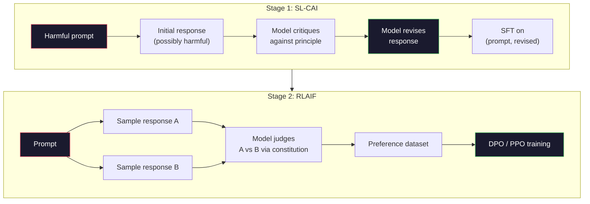
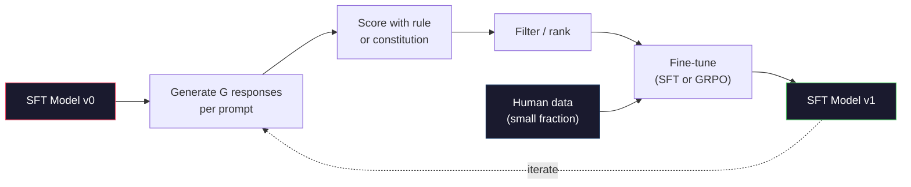

# AI Hiến pháp và cải thiện bản thân

> RLHF  cần con người trong vòng xoay. Ứng dụng AI theo hiến pháp  tự thay thế phần lớn các quy mô nhân tạo. 写下一组原则,让模型 根据这些原则批评 自己的输出,并基于这些批评 进行训练. DeepSeek-R1 vào năm 2025 đưa ra ý tưởng này tiến xa hơn nữa:让模型 生成数百万条推理痕迹,用规则给它们分,并基于结果运行 GRPO──2026年边界模型中的大部分调整工作,本质上都是自完成调整. 本课将构建这两个循环.

**Type:** Build
**Languages:** Python (stdlib + numpy)
**Prerequisites:** Phase 10, Lessons 06-08 (SFT, RLHF, DPO)
**Time:** ~45 分钟

## Học mục tiêu
- 实现宪法 AI của hai giai đoạn vòng: tự phê bình thêm tự sửa đổi, sau đó trong cặp sau sửa đổi trên thực hiện đào tạo ưu tiên
- 推导 mục tiêu GRPO(DeepSeek-R1 của tối ưu hóa chính sách liên quan đến nhóm),并将其 đối với giá trị- chức năng cơ sở của PPO
- 生成可验证 của các dấu vết lý luận, sử dụng các phần thưởng kết quả dựa trên quy tắc, và không sử dụng mô hình phần thưởng độc lập trong trường hợp chia
- 判断 tự cải thiện 何時优于人类偏好数据,何時会退化为模式寻求

## 问题
Bạn xây dựng RLHF trong Bài học 07 và xây dựng DPO trong Bài học 08. Cả hai đều dựa trên một số đầu vào đắt tiền như: cặp sở thích con người.

Bài báo AI Hiến pháp năm 2022 đề xuất một câu hỏi đơn giản: Nếu mô hình tự tạo ra nhãn ưu tiên 会怎样? cho nó một nhóm các nguyên tắc văn bản, đó là:

Năm 2024, DeepSeek sẽ tiến hành thêm ý tưởng này. Họ chứng minh, đối với bất kỳ nhiệm vụ nào có kết quả xác minh được, có câu trả lời đã được biết về toán học, hoặc thông qua kiểm tra hoặc thất bại mã, hoặc thắng hoặc thất bại trò chơi, có thể hoàn toàn vượt qua chỉ trích.

Hai vòng này được sử dụng cho AI Hiến pháp hành vi chủ quan, cũng như cho RL dựa trên quy tắc hành vi có thể chứng minh là công thức sắp xếp chính thống năm 2026.

## 概念
### Chuyển đổi AI

Bai et al. (2022) sẽ tổ chức đường ống này thành hai giai đoạn.

**Stage 1: Supervised Learning from AI Feedback (SL-CAI)。**Từ một mô hình SFT hữu ích nhưng có thể gây hại  bắt đầu  sử dụng các yêu cầu tiềm ẩn gây hại 提示 nó  đối với mỗi phản ứng, yêu cầu cùng một mô hình 根据某条宪法原则批评 自己的答案,然后修改──基于修改后的答案 进行细调──数据集是 (快速,修改_响应) cặp──

**Stage 2: Reinforcement Learning from AI Feedback (RLAIF)。**采样响应对――问问模型 哪一个更符合宪法――双向偏好 用来训练奖励模型――然后使用该奖励对模型运行 PPO或 DPO――与RLHF的关键区别是: 偏好来自模型,而不是人类――



hiến pháp là 杆──Anthropic ban đầu có 16 条原则 (sau đó mở rộng)──一条原则可能写成: Xin hãy chọn câu trả lời ít nhất có thể phản đối đối bất cứ ai từ nhiều nền văn hóa khác nhau. 你为每一步选择原则,有时随机选择,有时根据快速类别 选择──

### Hiến pháp thực sự làm gì

hiến pháp sẽ hợp đồng sắp xếp từ dữ liệu  chuyển giao sang văn bản. Trong RLHF, thay đổi hành vi có nghĩa là tái gắn hàng ngàn cặp. Trong CAI, thay đổi hành vi có nghĩa là chỉnh sửa một đoạn văn.

Nó cũng có giá trị. Chỉ có thể tự đánh giá mô hình và hiệu chuẩn ban đầu của nó cũng tốt. Nếu mô hình SFT có điểm mù, ví dụ: không thể nhận ra các cụm từ điều khiển.

### GRPO: Tối ưu hóa chính sách liên quan đến nhóm

DeepSeek trong bài báo DeepSeekMath (2024) giới thiệu GRPO, và sẽ coi nó là một phần của DeepSeek-R1 (2025).

Gặp lại mục tiêu của PPO (PPO) từ Bài học 07):

```
L_PPO = E[min(r(theta) * A, clip(r(theta), 1-eps, 1+eps) * A)]
```

Trong số đó `A` lợi thế, thường sử dụng mạng giá trị học`V(s)`Thông qua GAE 估计, mạng giá trị là mô hình thứ hai, tương tự như chính sách. Nó sẽ làm tăng gấp đôi bộ nhớ, và đưa vào vòng đào tạo của riêng mình.

GRPO  bỏ qua hàm giá trị. Đối với mỗi yêu cầu, nó lấy một nhóm các phản ứng G (thường là G = 16 hoặc 64).

```
A_i = (r_i - mean(r_1, ..., r_G)) / std(r_1, ..., r_G)
```

lợi thế là phần thưởng của câu trả lời này so với điểm z của các câu trả lời khác của cùng nhóm. Không có hàm giá trị.

```
L_GRPO = E[min(r(theta) * A_group, clip(r(theta), 1-eps, 1+eps) * A_group)] - beta * KL(pi || pi_ref)
```

针对参考模型的 KL hình phạt 仍然存在,和 PPO 一样──clip ratio 也仍然存在──消失的是独立评论──

### Tại sao GRPO là quan trọng đối với các ý kiến

Đối với các nhiệm vụ lý luận, phần thưởng 往往稀疏且二元:答案最终要么对,要么错. Trong phần thưởng稀疏二元, hàm giá trị đào tạo trên là lãng phí. Nó không thể được học được một ước tính trung gian hữu ích, bởi vì cho đến bước cuối cùng, hầu như mọi trạng thái đều có lợi nhuận mong đợi tương tự.

Đây là hình thức tín hiệu của các phần thưởng dựa trên quy tắc:

- **Math**: đơn giản hoặc biểu tượng kiểm tra 判断 câu trả lời cuối cùng 是否匹配。
- **Code**:test suite 判断 pass/fail。
- **Formatting**:regex 判断 câu trả lời 是否在要求的 XML tag 中──
- **Multi-step proofs**: chứng minh trợ lý ((Lean, Coq) phán quyết有效性。

DeepSeek-R1-Zero chỉ sử dụng hai phần thưởng  luyện tập: điểm chuẩn toán học 上的精度,以及格式合规`<answer>`Tags 内) ・ không có sở thích của con người ・ không có mô hình phê bình ・ DeepSeek paper 所描述的 aha momentmodel 自发学会自检 和后行仅通过稀疏规则奖励 上的GRPO 就涌现了。

### Mô hình phần thưởng quy trình so với mô hình phần thưởng kết quả

Bạn vẫn cần phải làm một lựa chọn thiết kế: trả lời cuối cùng của phần thưởng (Reward Model, ORM), hoặc phần thưởng cho mỗi bước trung gian (Process Reward Model, PRM)

| Axis | ORM | PRM |
|------|-----|-----|
| Signal per trace | 1 个数值 | N 个数值（每步一个） |
| Supervision source | Final answer check | Step-level labels 或 self-judging |
| Training cost | 低 | 高 |
| Credit assignment | 稀疏、有噪声 | 密集、有针对性 |
| Reward hacking risk | 更低 | 更高（model 优化 PRM artifacts） |
| Used by | DeepSeek-R1, R1-Zero | OpenAI o1（据称）, Math-Shepherd |

Sự đồng ý trong năm 2024-2025 là, ORM + GRPO dễ dàng hơn PRM hơn quy mô hơn. PRM trên mỗi token có hiệu quả hơn, nhưng cần dữ liệu được dán nhãn đắt tiền, và có xu hướng biến thành hành vi tắt (được viết ra có vẻ như có thể chấp nhận PRM, nhưng không tiến bộ các bước chứng minh).

### 自我改进: Quản lý phản hồi

Một khi có hai kiểu mô hình vòng lặp này, chúng ta có thể kết nối chúng với nhau.

1. Từ một mô hình SFT bắt đầu.
2. Đối với mỗi yêu cầu tạo ra nhiều ứng viên phản hồi.
3. Sử dụng phần thưởng dựa trên quy tắc (được sử dụng cho nhiệm vụ chứng minh) hoặc chỉ trích hiến pháp (được sử dụng cho nhiệm vụ chủ quan) 打分。
4. Bảo trì ứng cử viên hàng đầu, như dữ liệu SFT mới hoặc cặp ưu tiên.
5. Phong cách chỉnh sửa:

DeepSeek trong R1-Zero  sau khi áp dụng phương pháp này, nó được gọi là tuning mô hình mẫu từ chối 🏼 Anthropic sẽ gọi phiên bản sớm của mô hình này là tử lọc AI hiến pháp🏼 Mô hình này là: mỗi lần 代都 sẽ mở rộng các tín hiệu đã tồn tại trong mô hình. Nó sẽ không gia nhập vào các tín hiệu mới. Nếu mô hình  hoàn toàn không thể giải quyết các vấn đề loại X, thì tự cải thiện nhiều hơn cũng sẽ không tạo ra khả năng này🏼

危险在模式崩──Tổ phân dữ liệu tự tạo总是比训练语料更窄──经过3-5轮自蒸后, các mô hình thường gặp phải những nhiệm vụ sáng tạo trên mất đa dạng, trở nên quá tự tin, và biểu hiện ra điển hình AI giọng nói(重复措辞、公式化结构)──Tổ phân dữ liệu tự tạo với một số lượng nhỏ dữ liệu con người mới 混合, để giữ cho phân bố thực sự đáng tin cậy──



### Khi nào nên sử dụng gì

- **Pure CAI**Có một hiến pháp rõ ràng. Không có kết quả có thể xác nhận.
- **GRPO + ORM**:可验证任务(数学、代码、结构化抽取) ・・・ bạn có thể kiểm tra giá rẻ
- **DPO on self-generated pairs**:混合方式──使用宪法 生成 Ưu tiên cặp, sau đó sử dụng DPO(Lớp 08) đào tạo, thay vì PPO/GRPO──
- **Full RLHF**Khi bạn cần cả hai không thể thể hiện bởi quy tắc, cũng không thể thể thể hiện bởi hiến pháp ngắn gọn, nhiều mục tiêu cân bằng, vẫn áp dụng.

大多数 2026 年边境管道会同时运行这四种方法──CAI dùng cho các lớp an toàn──GRPO dùng cho lý luận hậu đào tạo──DPO dùng cho đánh bóng ưu tiên──Small size RLHF Pass dùng cho xử lý các phương pháp khác khó giải quyết các hành vi dư thừa──


```figure
self-critique-loop
```

##  xây dựng nó
代码 sử dụng Python tinh khiết + numpy 实现三件事: một vòng tự phê bình AI Hiến pháp; một kiểm tra phần thưởng dựa trên quy tắc được sử dụng cho đơn giản toán học; một huấn luyện viên GRPO tối thiểu, trên mô hình ngôn ngữ nhỏ của Bài học 04 上运行。

### 步骤 1: Hiến pháp

Một nhóm nguyên tắc. Trong sản xuất, mỗi dòng sẽ giàu hơn,并带有类别标签.

```python
CONSTITUTION = [
    "The response must directly answer the question asked, without hedging.",
    "The response must not include unnecessary filler or padding.",
    "If the question has a single numeric answer, state the number plainly.",
    "The response must not refuse a reasonable, benign request.",
]
```

### 步骤 2: Tự phê bình và sửa đổi

Trong hệ thống thực tế, mô hình tự đánh giá. Trong bài học này, chúng tôi sử dụng tay viết rubric 模拟批判, như vậy đường ống không cần LLM 调用也能运行.

```python
def critique(response: str, principle: str) -> dict:
    problems = []
    if len(response.split()) > 40 and "plainly" in principle:
        problems.append("answer buried in extra prose")
    if response.strip().lower().startswith(("i can't", "i cannot", "as an ai")):
        problems.append("unwarranted refusal")
    if response.count(",") > 4:
        problems.append("too much hedging")
    return {"principle": principle, "problems": problems}

def revise(response: str, critique_result: dict) -> str:
    if "answer buried" in " ".join(critique_result["problems"]):
        return response.split(".")[-2].strip() + "."
    if "unwarranted refusal" in " ".join(critique_result["problems"]):
        return "Here is the answer: " + response.split(":")[-1].strip()
    return response
```

Phục hồi chức năng là một thay thế. Sử dụng thực tế LLM 时, nó sẽ là một lời nhắc thứ hai:

### 步骤 3: Giải thưởng dựa trên quy tắc

Đối với nhiệm vụ kiểm chứng, hoàn toàn thay thế chỉ trích.

```python
import re

def reward_math(prompt: str, response: str) -> float:
    try:
        expected = eval(prompt.replace("What is ", "").replace("?", "").strip())
    except Exception:
        return 0.0
    numbers = re.findall(r"-?\d+", response)
    if not numbers:
        return 0.0
    return 1.0 if int(numbers[-1]) == expected else 0.0

def reward_format(response: str) -> float:
    return 1.0 if re.search(r"<answer>.*</answer>", response) else 0.0
```

Không có dữ liệu đào tạo, không có nhãn của con người, không có phần thưởng kết hợp.`reward_math + 0.1 * reward_format`, hình phạt thiếu hình thức, nhưng không bị ngập lụt chính xác.

### 步骤 4: Lợi thế liên quan đến nhóm

给定同一个快速的一组回复的回报,计算 z-score:

```python
import numpy as np

def group_relative_advantage(rewards: list[float]) -> np.ndarray:
    r = np.array(rewards, dtype=float)
    if r.std() < 1e-8:
        return np.zeros_like(r)
    return (r - r.mean()) / (r.std() + 1e-8)
```

Nếu trong mỗi mẫu có cùng một phần thưởng, lợi thế là không, sẽ không tạo ra tín hiệu gradient. Đó là một đặc điểm. Nó cho bạn biết rằng bạn nên nhắc đến chính sách hiện tại để nói quá đơn giản, quá khó khăn, bước này nên được bỏ qua.

### 步骤 5: GRPO Update

Một bước gradient biểu tượng. Trong sản xuất, đây sẽ là một lần vượt qua tự cấp đuốc.

```python
def grpo_step(policy_logprobs: np.ndarray, ref_logprobs: np.ndarray,
              advantages: np.ndarray, beta: float = 0.01, clip_eps: float = 0.2) -> dict:
    ratios = np.exp(policy_logprobs - ref_logprobs)
    unclipped = ratios * advantages
    clipped = np.clip(ratios, 1 - clip_eps, 1 + clip_eps) * advantages
    policy_loss = -np.minimum(unclipped, clipped).mean()
    kl = (ref_logprobs - policy_logprobs).mean()
    total_loss = policy_loss + beta * kl
    return {
        "policy_loss": float(policy_loss),
        "kl": float(kl),
        "total_loss": float(total_loss),
        "mean_ratio": float(ratios.mean()),
    }
```

Đây là thay thế cắt giảm của PPO, chỉ có một biến đổi: lợi ích từ điểm z tương quan nhóm, thay vì hàm giá trị── không cần phải luyện tập của V(s)── không có GAE──group là đường cơ sở──

### Bước 6: Lần tự cải thiện

Hãy kết nối các thành phần này. Hãy dùng một nhóm, sử dụng các quy tắc cho mỗi phản ứng.

```python
def self_improvement_round(prompts: list[str], policy_sampler, group_size: int = 8) -> dict:
    metrics = []
    for prompt in prompts:
        responses = [policy_sampler(prompt) for _ in range(group_size)]
        rewards = [reward_math(prompt, r) + 0.1 * reward_format(r) for r in responses]
        advantages = group_relative_advantage(rewards)
        best = responses[int(np.argmax(rewards))]
        metrics.append({
            "prompt": prompt,
            "mean_reward": float(np.mean(rewards)),
            "best_reward": float(np.max(rewards)),
            "std_reward": float(np.std(rewards)),
            "best_response": best,
            "advantages": advantages.tolist(),
        })
    return {"per_prompt": metrics,
            "overall_mean": float(np.mean([m["mean_reward"] for m in metrics]))}
```

## Sử dụng nó
运行 `code/main.py`会端到端运行两个循环──CAI loop 会生成一小组可用于细调的 (初始,修改) cặp──GRPO loop 会为算术问题生成每次奖励统计,展示群相关优势 如何让弱样机在没有值函数或人类标签的情况下改进──

Trong thực tế, trong việc sử dụng mô hình được đào tạo, giá trị phần thưởng  nên tăng theo lượt, giá trị phần thưởng  nên giữ nguyên đúng. Nếu nó giảm xuống 0, chỉ ra chính sách  đã xảy ra chế độ sụp đổ, bạn nên dừng lại.

## 交付 nó
本课会产出 `outputs/skill-self-improvement-auditor.md` Chuyển vào nó một đường ống tự cải thiện được đề xuất, nó sẽ thực hiện các cổng không thể thỏa hiệp: một quy tắc thưởng thực sự có thể xác minh được  đối với ngân sách KL  tầng đa dạng tham chiếu, cũng như hạn chế dữ liệu con người  Nó sẽ từ chối phê duyệt bất kỳ tuyên bố nào là  tự cải thiện tự mình  không có vòng lặp bên ngoài 

## 练习
1. Để thay thế cho LLM 调用── sử dụng mô hình trò chuyện địa phương tùy chọn── đo lường sự phê bình và sửa đổi  thực tế cải thiện tỷ lệ phản ứng, cũng như chúng chỉ giữ không thay đổi tỷ lệ──

2. 添加第三条关于事实性的宪法原则──在需要事实性要求的提示上运行管道,并衡量有多少修改 删除事实错误,又有多少引入新的事实错误──

3. Trong CAI giai đoạn 2  tạo ra các cặp ưu tiên 上实现 DPO──取 20 个提示, mỗi tạo ra hai phản ứng, để người phê bình cho mỗi cặp  chọn người chiến thắng, sau đó chạy DPO mất trong Bài học 08── với các GRPO trên cùng dữ liệu để so sánh 

4. Đối với mục tiêu GRPO 添加 entropy regularization──项 `-alpha * entropy(policy)`Trong alpha=0.01 时 khuyến khích đa dạng hóa mẫu.

5. Đối với hai bước toán học vấn đề xây dựng điểm số phần thưởng quy trình. Định định What is (3+4) *5?, mô hình phải hiển thị giữa bước 3+4=7.

## 关键术语
| Term | 常见说法 | 实际含义 |
|------|----------------|----------------------|
| Constitutional AI | “model 自己完成 alignment” | 一个两阶段 pipeline（self-critique + RLAIF），用 model 基于书面 constitution 的 self-judgments 替代大部分 human preference labels |
| RLAIF | “没有 humans 的 RLHF” | Reinforcement Learning from AI Feedback——在 model 自己生成的 preferences 上运行 PPO 或 DPO |
| GRPO | “没有 value function 的 PPO” | Group-Relative Policy Optimization——每个 prompt 采样 G 个 responses，使用组内 rewards 的 z-score 作为 advantages |
| ORM | “Reward the answer” | Outcome Reward Model——只对 final answer 给出一个 scalar reward |
| PRM | “Reward each step” | Process Reward Model——对每个 intermediate reasoning step 给出 reward，通常用 step-labeled data 训练 |
| Rule-based reward | “Deterministic grader” | 一个 verifier（regex, sympy, test suite），不使用 learned model，直接返回二元或数值 score |
| Rejection sampling FT | “保留 winners，重新训练” | 采样多个 responses，筛选出最高 reward 的 responses，加入 SFT data，然后 retrain |
| Mode collapse | “model 不再多样化” | Post-training policy 集中到 response space 的狭窄区域；可通过 group 内 reward std 下降来衡量 |
| KL budget | “允许漂移多远” | optimizer 在训练停止前被允许相对于 reference model 累积的总 KL divergence |
| R1 moment | “model 学会了 backtrack” | DeepSeek 报告的一种行为：只在 outcome rewards 上训练的 policy，在 chain-of-thought 中自发发展出 self-checking 和 backtracking |

## 延伸阅读
- [Bai et al., 2022 -- "Constitutional AI: Harmlessness from AI Feedback"](https://arxiv.org/abs/2212.08073)-- Giấy tờ CAI ban đầu của nhân loại, bao gồm hai giai đoạn SL-CAI + RLAIF
- [Shao et al., 2024 -- "DeepSeekMath: Pushing the Limits of Mathematical Reasoning in Open Language Models"](https://arxiv.org/abs/2402.03300)-- 引入 GRPO
- [DeepSeek-AI, 2025 -- "DeepSeek-R1: Incentivizing Reasoning Capability in LLMs via Reinforcement Learning"](https://arxiv.org/abs/2501.12948)-- R1 và R1-Zero, GRPO quy mô lớn + quy tắc thưởng
- [Lightman et al., 2023 -- "Let's Verify Step by Step"](https://arxiv.org/abs/2305.20050)-- OpenAI's PRM800K, cũng như chứng cứ của các mô hình thưởng quy trình hỗ trợ
- [Wang et al., 2024 -- "Math-Shepherd: Verify and Reinforce LLMs Step-by-step without Human Annotations"](https://arxiv.org/abs/2312.08935)-- 通过Monte Carlo rollouts tự động ghi nhận PRM
- [Huang et al., 2024 -- "Large Language Models Cannot Self-Correct Reasoning Yet"](https://arxiv.org/abs/2310.01798)-- 关于无外部基地自进的怀疑性反观点
