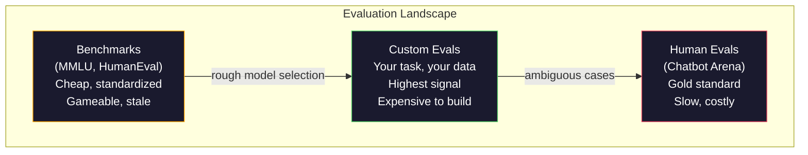
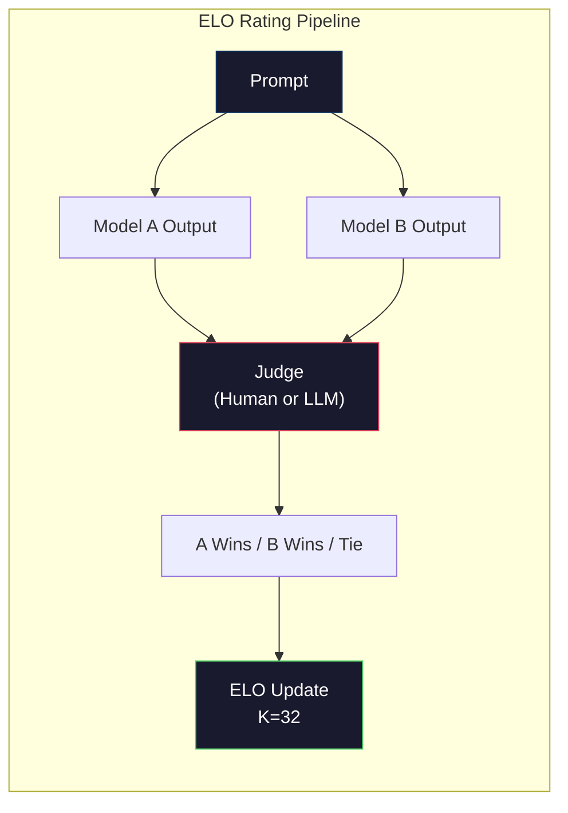

# Đánh giá:Thêm điểm,Tỷ lệ, LM

> Luật Goodhart: Khi một chỉ số trở thành mục tiêu, nó đã không còn là một chỉ số tốt hơn. Mỗi phòng thí nghiệm biên giới sẽ nhắm vào các chỉ số chuẩn làm tối ưu hóa.

**Type:** Build
**Languages:** Python
**前置要求:**Giai đoạn 10,课程 01-05 (LLM từ đầu)
**Time:** ~90 minutes

## Học mục tiêu
- Construct a self-defined evaluation harness, dùng để nhắm vào mô hình ngôn ngữ 运行 nhiều lựa chọn và các tiêu chuẩn mở
- 解释为什么标准基准(MMLU、HumanEval) 会和,并且无法区分边界模型
- Sử dụng các số liệu phù hợp  thực hiện các đánh giá cụ thể về nhiệm vụ: phù hợp chính xác 、F1、BLEU 和 LLM-as-judge scoring
- 设计面向您特定使用案例的自定义评估套件, chứ không chỉ dựa vào bảng xếp hạng công khai

## 问题
MMLU được phát hành vào năm 2020, bao gồm 57 个学科的 15,908 道题──三年内, biên giới mô hình 就让它和了──GPT-4 得分 86.4%──Claude 3 Opus 得分 86.8%──Llama 3 405B 得分 88.6%──leaderboard bị nén xuống 3 分范围内, trong đó sự khác biệt chỉ là tiếng ồn thống kê, chứ không phải là khoảng cách khả năng thực sự──

Đồng thời, các mô hình này sẽ thất bại trong nhiệm vụ mà một đứa trẻ 10 tuổi không cần suy nghĩ về việc có thể hoàn thành. Claude 3.5 Sonnet trên MMLU đạt điểm 88.7%, ban đầu không thể đếm số chữ cái trong "dâu tây".

Sự khác biệt giữa hiệu suất chuẩn và độ tin cậy của thế giới thực, là vấn đề cốt lõi của đánh giá LLM. Các chuẩn chỉ có thể cho bạn biết mô hình trên chuẩn chỉ có thể hoạt động như thế nào. Chúng hầu như không thể cho bạn biết mô hình này sẽ hoạt động như thế nào trong nhiệm vụ cụ thể của bạn.

Bạn cần đánh giá tùy chỉnh không phải vì các tiêu chuẩn không được sử dụng, các tiêu chuẩn cho các mô hình sơ khai được lựa chọn rất hữu ích, nhưng vì đánh giá cuối cùng phải xác định phù hợp với điều kiện triển khai của bạn.

## 概念
### Vị cảnh của Eval

Đánh giá được chia thành ba loại, mỗi loại chi phí và chất lượng tín hiệu đều khác nhau.

**Benchmarks**Các mô hình được sử dụng để phân tích và phân tích các điểm chuẩn. Các mô hình và dữ liệu đào tạo sẽ dễ dàng bị ô nhiễm các điểm chuẩn. Các phòng thí nghiệm sẽ có các bài tập về dữ liệu có chứa các điểm chuẩn.

**Custom evals**Bạn định nghĩa đầu vào, kết quả dự kiến và chức năng ghi điểm, tổng hợp tài liệu pháp lý cần phải được đánh giá trên tài liệu pháp lý, máy phát điện SQL cần phải được đánh giá trên cơ sở dữ liệu của bạn, các đánh giá này có giá cao, nhưng chúng là đánh giá duy nhất có thể dự đoán hiệu suất sản xuất.

**Human evals**Sử dụng các nhà ghi chú trả phí, dựa trên sự hữu ích, tính chính xác, tính tự do và an toàn等标准评判模型输出。 Đối với việc ghi điểm tự động 失效 của các nhiệm vụ mở, đây là tiêu chuẩn vàng。 Chatbot Arena đã thu thập hơn 200 triệu phiếu bầu ưu tiên cá nhân từ 100+ mô hình。缺点是:成本( mỗi lần đánh giá$0.10-$2,00) và tốc độ (((vài giờ đến vài ngày)



### Tại sao các điểm chuẩn bị bị phá vỡ

三种机制会导致 điểm chuẩn phân số không còn phản ánh khả năng thực tế nữa.

**Data contamination。**训练语料会抓取互联网――Bênchmark 问题也在互联网――模型在训练期间看到了答案―― Đây không phải là một trò lừa đảo theo nghĩa truyền thống, phòng thí nghiệm không có ý định chứa dữ liệu chuẩn ̇ nhưng việc phích dữ liệu trên quy mô web làm cho việc loại bỏ chúng hầu như không thể──

**Teaching to the test。**Các phòng thí nghiệm sẽ hướng tới hiệu suất chuẩn  tối ưu hóa tập luyện dữ liệu hỗn hợp. Nếu 5% trong số dữ liệu hỗn hợp tập luyện là lựa chọn đa dạng kiểu MMLU, mô hình sẽ có một định dạng và phân bố các câu trả lời như vậy.

**Saturation。**Khi mỗi mô hình biên giới đạt 85-90% trên một tiêu chuẩn, tiêu chuẩn này đã dừng khả năng phân biệt. Các vấn đề còn lại 10-15% có thể là mơ hồ, ghi sai, hoặc cần kiến thức về miền lạnh. MMLU tăng từ 87% lên 89%, có thể có nghĩa là mô hình đã nhớ lại hai tiêu đề lạnh, thay vì trở nên thông minh hơn.

### Sự bối rối: 快速健康检查

Sự bối rối mô hình đo lường đối với một chuỗi các token có nhiều sự bất ngờ.

```
PPL = exp(-1/N * sum(log P(token_i | context)))
```

Sự bối rối vì 10 biểu hiện mô hình trong nghĩa trung bình,就像在每个代币位置从10个选项中均选择一样不确定──越低越好──GPT-2 在 WikiText-103 上的困惑为30──GPT-3 约为20──Llama 3 8B 约为7──

Sự bối rối  Đối với một tập hợp thử nghiệm trên mô hình so sánh rất hữu ích, nhưng nó có điểm mù. mô hình có thể thông qua khả năng dự đoán mô hình thường thấy và đạt được sự bối rối thấp, đồng thời nhưng rất không giỏi trong mô hình hiếm nhưng quan trọng. Nó cũng không thể giải thích hướng dẫn theo lý luận hoặc tính chính xác thực tế.

### LLM-as-Judge

Sử dụng mô hình mạnh để đánh giá 弱模型的输出──想法很简单:让GPT-4o hoặc Claude Sonnet 根据 1-5 分评价响应的正确度,有用性和安全──使用GPT-4o-mini 时,每次判断耗费约0.01美元,与人类判断相关性出人意意地高,大多数任务约有80%同意──

Đánh điểm nhanh hơn mô hình chính nó hơn là quan trọng hơn. Đánh dấu nhanh hơn mô hình chính nó. Đánh giá nhanh hơn mô hình chính nó. Đánh giá nhanh hơn mô hình chính nó. Đánh giá nhanh hơn mô hình chính nó. Đánh giá nhanh hơn mô hình chính nó. Đánh giá nhanh hơn mô hình chính nó. Đánh giá nhanh hơn mô hình chính nó. Đánh giá nhanh hơn mô hình chính nó. Đánh giá nhanh hơn mô hình chính nó. Đánh giá nhanh hơn mô hình chính nó. Đánh giá nhanh hơn mô hình chính nó. Đánh giá nhanh hơn mô hình chính nó. Đánh giá nhanh hơn mô hình chính nó. Đánh giá nhanh hơn mô hình chính nó. Đánh giá nhanh hơn mô hình chính nó. Đánh giá nhanh hơn mô hình chính nó. Đánh giá nhanh hơn mô hình chính nó. Đánh giá nhanh hơn mô hình chính nó. Đánh giá nhanh hơn mô hình chính xác và có thể được xác.

Các chế độ thất bại: các mô hình thẩm phán sẽ biểu hiện sự thiên vị về vị trí trong so sánh đôi (in pairs) 中偏好第一反应)  Verbosity bias (偏好第一反应) 偏好更长的反应) 和自我偏好 (自偏)  GPT-4 đối với các sản phẩm GPT-4 评分高于等价的Claude output) 缓解方法:随机化顺序、按长度归归归化、使用不同于被评价 模型的评审者──

### 基于成对比的ELO Ratings

Đây là phương pháp của Chatbot Arena. Để cùng một yêu cầu  hiển thị hai phản ứng từ các mô hình khác nhau.

ưu điểm của ELO: xếp hạng tương đối so với điểm số tuyệt đối đáng tin cậy hơn, có thể xử lý tốt hơn các mối quan hệ, và so với độc lập cho mỗi đầu ra打分需要更少比较就能收──截至2026年初,Chatbot Arena 排名显示GPT-4o、Claude 3.5 Sonnet 和 Gemini 1.5 Pro 在榜首相差不到20 ELO điểm──



### Các khung Eval

**lm-evaluation-harness**(EleutherAI): chuẩn của mã nguồn mở khung đánh giá  hỗ trợ 200+ điểm chuẩn  dùng một条 lệnh即可让任意 Hugging Face 模型跑 MMLU、HellaSwag、ARC 等──Open LLM Leaderboard sử dụng nó。

**RAGAS**: đặc biệt được sử dụng cho các khung đánh giá của đường ống RAG.

**promptfoo**: dùng cho các thử nghiệm dựa trên cấu hình của công nghệ nhanh chóng. Trong YAML, xác định các trường hợp thử nghiệm, nhắm vào nhiều mô hình chạy, nhận được báo cáo vượt qua / thất bại.

### Xây dựng các hình dạng Eval tùy chỉnh

Đây là đánh giá quan trọng duy nhất cho sản xuất:

1. **Define the task。**模型到底应该做什么?要精确──"Câu hỏi trả lời" 太模糊──"Vì email khiếu nại của khách hàng, lấy tên sản phẩm, danh mục vấn đề và cảm xúc" 才是一个可以评估的任务──

2. **Create test cases。**Mô hình thử nghiệm đánh giá ít nhất 50 个, sản xuất ít nhất 200 个. Mỗi trường hợp thử nghiệm là một (input, expected_output) đối với.

3. **Define scoring。**Kết quả cấu trúc Sử dụng sự phù hợp chính xác。文本相似度 Sử dụng BLEU/ROUGE。 chất lượng mở-đối kết Sử dụng LLM-as-judge。 Nhiệm vụ khai thác Sử dụng F1。用权重组合多个指标。

4. **Automate。**Mỗi đánh giá đều có thể chạy bằng một lệnh. Không có bước động.

5. **Track over time。**单独一个评分 没有意义――你需要趋势线――最后一次提示变化 后分数是否提升?换模型后是否回归?把评与提示 一起版本――

| Eval Type | 每次 judgment 成本 | 与人类的一致性 | 最适合 |
|-----------|------------------|----------------------|----------|
| Exact match | ~$0 | 100%（适用时） | Structured output、classification |
| BLEU/ROUGE | ~$0 | ~60% | Translation、summarization |
| LLM-as-judge | ~$0.01 | ~80% | Open-ended generation |
| Human eval | $0.10-$2.00 | N/A（即 ground truth） | Ambiguous、high-stakes tasks |


```figure
perplexity-loss
```

##  xây dựng nó
### 步骤 1: tối thiểu Eval 框架

定义核心抽象──一个 eval case 有输入、预期输出 和可选的元数据 dict──一个得分者 接收预测 和参考,并返回 0 到 1 之间的分数──

```python
import json
from collections import Counter

class EvalCase:
    def __init__(self, input_text, expected, metadata=None):
        self.input_text = input_text
        self.expected = expected
        self.metadata = metadata or {}

class EvalSuite:
    def __init__(self, name, cases, scorers):
        self.name = name
        self.cases = cases
        self.scorers = scorers

    def run(self, model_fn):
        results = []
        for case in self.cases:
            prediction = model_fn(case.input_text)
            scores = {}
            for scorer_name, scorer_fn in self.scorers.items():
                scores[scorer_name] = scorer_fn(prediction, case.expected)
            results.append({
                "input": case.input_text,
                "expected": case.expected,
                "prediction": prediction,
                "scores": scores,
            })
        return results
```

### 步骤 2: Đánh điểm chức năng

构建 chính xác phù hợp F1 và một mô hình LLM như thẩm phán ghi bàn 

```python
def exact_match(prediction, expected):
    return 1.0 if prediction.strip().lower() == expected.strip().lower() else 0.0

def token_f1(prediction, expected):
    pred_tokens = set(prediction.lower().split())
    exp_tokens = set(expected.lower().split())
    if not pred_tokens or not exp_tokens:
        return 0.0
    common = pred_tokens & exp_tokens
    precision = len(common) / len(pred_tokens)
    recall = len(common) / len(exp_tokens)
    if precision + recall == 0:
        return 0.0
    return 2 * (precision * recall) / (precision + recall)

def llm_judge_simulated(prediction, expected):
    pred_words = set(prediction.lower().split())
    exp_words = set(expected.lower().split())
    if not exp_words:
        return 0.0
    overlap = len(pred_words & exp_words) / len(exp_words)
    length_penalty = min(1.0, len(prediction) / max(len(expected), 1))
    return round(overlap * 0.7 + length_penalty * 0.3, 3)
```

### 步骤 3: Hệ thống xếp hạng ELO

Sử dụng các bản cập nhật ELO  thực hiện so sánh đôi. Đây chính là Chatbot Arena được sử dụng để đối phó với hệ thống xếp hạng mô hình.

```python
class ELOTracker:
    def __init__(self, k=32, initial_rating=1500):
        self.ratings = {}
        self.k = k
        self.initial_rating = initial_rating
        self.history = []

    def _ensure_player(self, name):
        if name not in self.ratings:
            self.ratings[name] = self.initial_rating

    def expected_score(self, rating_a, rating_b):
        return 1 / (1 + 10 ** ((rating_b - rating_a) / 400))

    def record_match(self, player_a, player_b, outcome):
        self._ensure_player(player_a)
        self._ensure_player(player_b)

        ea = self.expected_score(self.ratings[player_a], self.ratings[player_b])
        eb = 1 - ea

        if outcome == "a":
            sa, sb = 1.0, 0.0
        elif outcome == "b":
            sa, sb = 0.0, 1.0
        else:
            sa, sb = 0.5, 0.5

        self.ratings[player_a] += self.k * (sa - ea)
        self.ratings[player_b] += self.k * (sb - eb)

        self.history.append({
            "a": player_a, "b": player_b,
            "outcome": outcome,
            "rating_a": round(self.ratings[player_a], 1),
            "rating_b": round(self.ratings[player_b], 1),
        })

    def leaderboard(self):
        return sorted(self.ratings.items(), key=lambda x: -x[1])
```

### 步骤 4: tính toán phức tạp

Sử dụng xác suất biểu tượng  tính toán phức tạp. Trong thực tế, bạn sẽ nhận được những giá trị này từ các logic mô hình.

```python
import numpy as np

def perplexity(log_probs):
    if not log_probs:
        return float("inf")
    avg_neg_log_prob = -np.mean(log_probs)
    return float(np.exp(avg_neg_log_prob))

def token_log_probs_simulated(text, model_quality=0.8):
    np.random.seed(hash(text) % 2**31)
    tokens = text.split()
    log_probs = []
    for i, token in enumerate(tokens):
        base_prob = model_quality
        if len(token) > 8:
            base_prob *= 0.6
        if i == 0:
            base_prob *= 0.7
        prob = np.clip(base_prob + np.random.normal(0, 0.1), 0.01, 0.99)
        log_probs.append(float(np.log(prob)))
    return log_probs
```

### 步骤 5: Kết quả tổng hợp

计算一次 eval run: trung bình, trung bình, ngưỡng, tỷ lệ vượt qua, cũng như phân chia theo métrics

```python
def summarize_results(results, threshold=0.8):
    all_scores = {}
    for r in results:
        for metric, score in r["scores"].items():
            all_scores.setdefault(metric, []).append(score)

    summary = {}
    for metric, scores in all_scores.items():
        arr = np.array(scores)
        summary[metric] = {
            "mean": round(float(np.mean(arr)), 3),
            "median": round(float(np.median(arr)), 3),
            "std": round(float(np.std(arr)), 3),
            "min": round(float(np.min(arr)), 3),
            "max": round(float(np.max(arr)), 3),
            "pass_rate": round(float(np.mean(arr >= threshold)), 3),
            "n": len(scores),
        }
    return summary

def print_summary(summary, suite_name="Eval"):
    print(f"\n{'=' * 60}")
    print(f"  {suite_name} Summary")
    print(f"{'=' * 60}")
    for metric, stats in summary.items():
        print(f"\n  {metric}:")
        print(f"    Mean:      {stats['mean']:.3f}")
        print(f"    Median:    {stats['median']:.3f}")
        print(f"    Std:       {stats['std']:.3f}")
        print(f"    Range:     [{stats['min']:.3f}, {stats['max']:.3f}]")
        print(f"    Pass rate: {stats['pass_rate']:.1%} (threshold >= 0.8)")
        print(f"    N:         {stats['n']}")
```

### 步骤 6: Đi đường ống đầy đủ

Để tất cả nội dung kết nối lên. Định nghĩa một nhiệm vụ, tạo các trường hợp thử nghiệm, mô hình hai mô hình, chạy các đánh giá, so sánh từ cặp 计算 ELO,并打印 bảng xếp hạng.

```python
def demo_model_good(prompt):
    responses = {
        "What is the capital of France?": "Paris",
        "What is 2 + 2?": "4",
        "Who wrote Hamlet?": "William Shakespeare",
        "What language is PyTorch written in?": "Python and C++",
        "What is the boiling point of water?": "100 degrees Celsius",
    }
    return responses.get(prompt, "I don't know")

def demo_model_bad(prompt):
    responses = {
        "What is the capital of France?": "Paris is the capital city of France",
        "What is 2 + 2?": "The answer is four",
        "Who wrote Hamlet?": "Shakespeare",
        "What language is PyTorch written in?": "Python",
        "What is the boiling point of water?": "212 Fahrenheit",
    }
    return responses.get(prompt, "Unknown")

cases = [
    EvalCase("What is the capital of France?", "Paris"),
    EvalCase("What is 2 + 2?", "4"),
    EvalCase("Who wrote Hamlet?", "William Shakespeare"),
    EvalCase("What language is PyTorch written in?", "Python and C++"),
    EvalCase("What is the boiling point of water?", "100 degrees Celsius"),
]

suite = EvalSuite(
    name="General Knowledge",
    cases=cases,
    scorers={
        "exact_match": exact_match,
        "token_f1": token_f1,
        "llm_judge": llm_judge_simulated,
    },
)

results_good = suite.run(demo_model_good)
results_bad = suite.run(demo_model_bad)

print_summary(summarize_results(results_good), "Model A (concise)")
print_summary(summarize_results(results_bad), "Model B (verbose)")
```

Mô hình "tốt" 模型给出精确答案──"坏" 模型给出冗长的表情──Tương đương chính xác 会严重惩罚冗长模型──Token F1 和 LLM-as-judge 更宽容──这说明为什么测量选择 很重要:同一个模型看起来很强还是很差,取决于你如何得分──

### 步骤 7: Giải đấu ELO

Trong nhiều vòng, các mô hình giữa các mô hình được so sánh đôi.

```python
elo = ELOTracker(k=32)

for case in cases:
    pred_a = demo_model_good(case.input_text)
    pred_b = demo_model_bad(case.input_text)

    score_a = token_f1(pred_a, case.expected)
    score_b = token_f1(pred_b, case.expected)

    if score_a > score_b:
        outcome = "a"
    elif score_b > score_a:
        outcome = "b"
    else:
        outcome = "tie"

    elo.record_match("model_a_concise", "model_b_verbose", outcome)

print("\nELO Leaderboard:")
for name, rating in elo.leaderboard():
    print(f"  {name}: {rating:.0f}")
```

### 步骤 8: Sự phức tạp so sánh

Sự phức tạp của mô hình so với mức độ chất lượng khác nhau.

```python
test_text = "The quick brown fox jumps over the lazy dog in the garden"

for quality, label in [(0.9, "Strong model"), (0.7, "Medium model"), (0.4, "Weak model")]:
    log_probs = token_log_probs_simulated(test_text, model_quality=quality)
    ppl = perplexity(log_probs)
    print(f"  {label} (quality={quality}): perplexity = {ppl:.2f}")
```

## Sử dụng nó
### Lâm đánh giá (EleutherAI)

Trong mô hình tùy chọn vận hành các điểm chuẩn.

```python
# pip install lm-eval
# Command line:
# lm_eval --model hf --model_args pretrained=meta-llama/Llama-3.1-8B --tasks mmlu --batch_size 8

# Python API:
# import lm_eval
# results = lm_eval.simple_evaluate(
#     model="hf",
#     model_args="pretrained=meta-llama/Llama-3.1-8B",
#     tasks=["mmlu", "hellaswag", "arc_easy"],
#     batch_size=8,
# )
# print(results["results"])
```

### promptfoo

Sử dụng các thử nghiệm được định nghĩa trong YAML, và nhắm vào nhiều nhà cung cấp 运行.

```yaml
# promptfoo.yaml
providers:
  - openai:gpt-4o-mini
  - anthropic:claude-3-haiku

prompts:
  - "Answer in one word: {{question}}"

tests:
  - vars:
      question: "What is the capital of France?"
    assert:
      - type: contains
        value: "Paris"
  - vars:
      question: "What is 2 + 2?"
    assert:
      - type: equals
        value: "4"
```

### RAGAS cho việc đánh giá RAG

```python
# pip install ragas
# from ragas import evaluate
# from ragas.metrics import faithfulness, answer_relevancy, context_precision
#
# result = evaluate(
#     dataset,
#     metrics=[faithfulness, answer_relevancy, context_precision],
# )
# print(result)
```

RAGAS  đo lường các đánh giá chung 会遗漏的内容: liệu mô hình trả lời có dựa trên bối cảnh được lấy lại không, không chỉ là trong nghĩa trừu tượng liệu nó có đúng hay không.

## 交付 nó
本课会产出 `outputs/prompt-eval-designer.md`, đây là một lời nhắc có thể sử dụng lặp lại, được sử dụng cho bất kỳ nhiệm vụ nào thiết kế các bộ đánh giá tùy chỉnh. Hãy cho nó một mô tả nhiệm vụ, nó sẽ tạo ra các trường hợp thử nghiệm, các chức năng ghi điểm và ngưỡng vượt qua / thất bại.

Nó sẽ xuất hiện.`outputs/skill-llm-evaluation.md`, Đây là một khung quyết định, được sử dụng dựa trên loại nhiệm vụ của bạn, ngân sách và yêu cầu thời gian trễ  chọn chiến lược đánh giá phù hợp.

## 练习
1. Thêm một điểm số "sự nhất quán": sử dụng cùng đầu vào 让模型运行 5 lần,并衡量输出 匹配的频率――Deterministic inputs 上的不一致答案会暴露于脆弱的提示或过高的温度设置――

2. 扩展 ELO tracker,使其支持多个法官功能 (tương đương chính xác, F1、LLM-as-judge)并为它们加权──比较当你大幅提高精确匹配权重与大幅提高F1权重时,领导板会如何变化──

3. Để một nhiệm vụ cụ thể xây dựng bộ đánh giá: đưa phân loại email đến 5 loại.

4. 实现污染检测:给定一组评估问题和一个培训组,检查有多少比例的评估问题 (或接近的句子) xuất hiện trong dữ liệu đào tạo.

5. Xây dựng một công cụ "model diff" ⋅ cho thấy kết quả đánh giá của hai phiên bản mô hình, highlight những trường hợp thử nghiệm cụ thể 升级, những trường hợp quay trở lại, những trường hợp không thay đổi ⋅ đây là mã đánh giá  phiên bản khác biệt, đối với việc hiểu một sự thay đổi là hữu ích hay có hại rất quan trọng.

## 关键术语
| Term | 人们的说法 | 它实际上的含义 |
|------|----------------|----------------------|
| MMLU | "The benchmark" | Massive Multitask Language Understanding，包含 57 个学科的 15,908 道 multiple choice questions，到 2025 年已在 88% 以上饱和 |
| HumanEval | "Code eval" | OpenAI 的 164 个 Python function-completion problems，只测试 isolated function generation |
| SWE-bench | "Real coding eval" | 来自 12 个 Python repos 的 2,294 个 GitHub issues，衡量包括 test generation 在内的 end-to-end bug fixing |
| Perplexity | "How confused the model is" | exp(-avg(log P(token_i given context)))，越低表示模型给实际 tokens 分配的概率越高 |
| ELO rating | "Chess ranking for models" | 根据 pairwise win/loss records 计算的 relative skill rating，Chatbot Arena 用它对 100+ models 排名 |
| LLM-as-judge | "Using AI to grade AI" | 强模型按照 rubric 评价弱模型 outputs，与人类 judges 约 80% agreement，成本约 $0.01/judgment |
| Data contamination | "The model saw the test" | Training data 包含 benchmark questions，在不提升真实 capability 的情况下抬高分数 |
| Eval suite | "A bunch of tests" | 一个 versioned collection，由 (input, expected_output, scorer) triples 组成，用于衡量特定 capability |
| Pass rate | "What percentage it gets right" | Eval cases 中得分超过阈值的比例，比 mean score 更可操作，因为它衡量 reliability |
| Chatbot Arena | "Model ranking website" | LMSYS 平台，拥有 2M+ human preference votes，并通过 ELO ratings 生成最可信的 LLM leaderboard |

## 延伸阅读
- [Hendrycks et al., 2021 -- "Measuring Massive Multitask Language Understanding"](https://arxiv.org/abs/2009.03300)- Mẫu bài báo của MMLU, mặc dù đã được 和, vẫn được trích dẫn nhiều nhất LLM điểm chuẩn
- [Chen et al., 2021 -- "Evaluating Large Language Models Trained on Code"](https://arxiv.org/abs/2107.03374)- OpenAI's HumanEval paper, đã thiết lập phương pháp đánh giá sản xuất mã
- [Zheng et al., 2023 -- "Judging LLM-as-a-Judge"](https://arxiv.org/abs/2306.05685)-- đối với việc sử dụng LLM đánh giá LLM của phân tích hệ thống, bao gồm vị trí thiên vị và sự thiên vị về từ ngữ
- [LMSYS Chatbot Arena](https://chat.lmsys.org/)-- nền tảng so sánh mô hình được crowdsourced, có 2M + phiếu bầu, là xếp hạng LLM thực tế thế giới đáng tin cậy nhất
