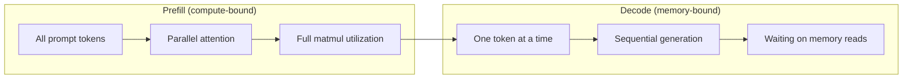
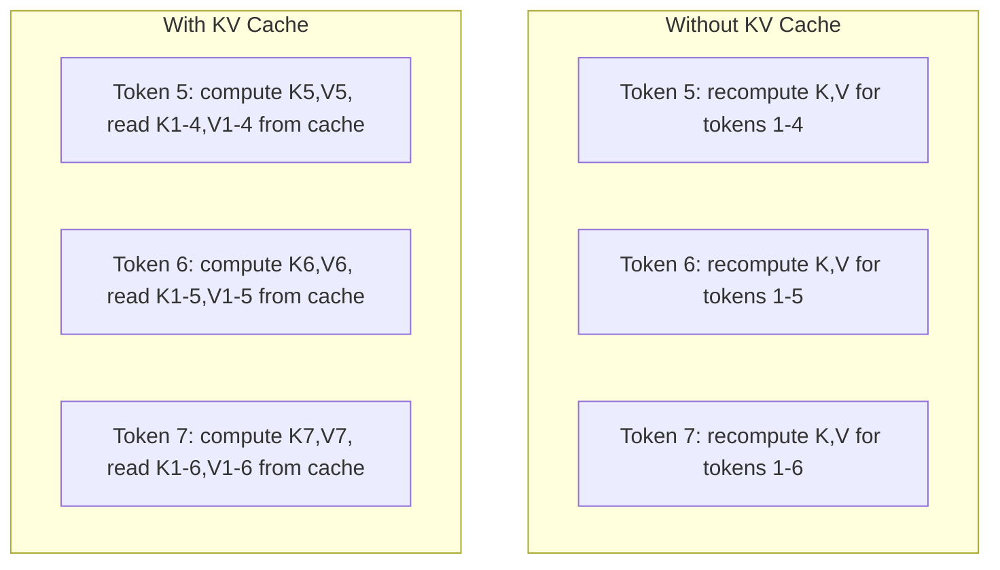
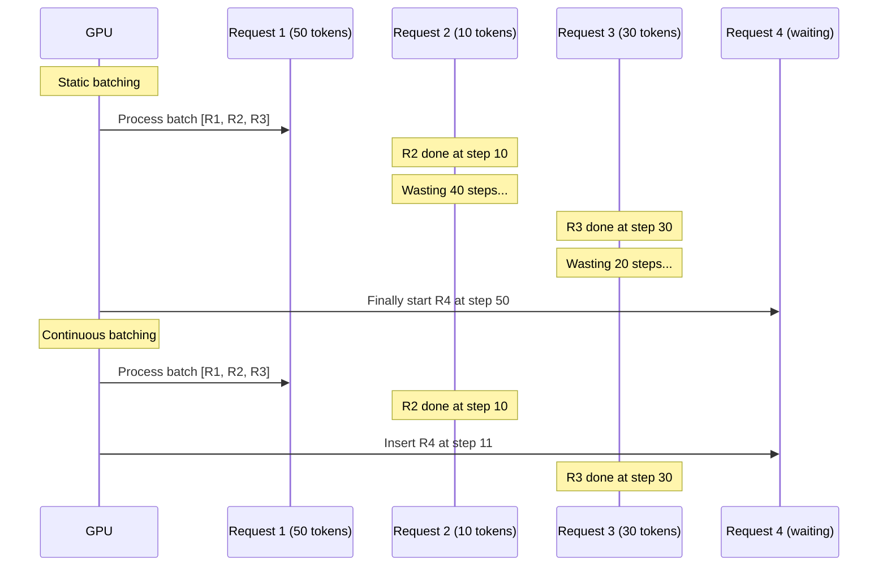
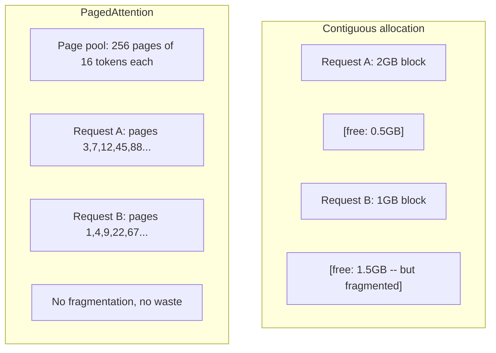
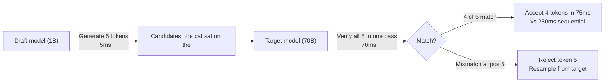

# Inference 优化

> 2 giai đoạn xác định kết luận LLM. Prefil và xử lý yêu cầu của bạn - tính toán-bound. Decode một lần tạo một token - nhớ-bound.

**Type:** Build
**Languages:** Python
**Prerequisites:** Phase 10, Lessons 01-08 (Transformer architecture, attention)
**Time:** ~120 分钟

## Học mục tiêu

- 实现 KV-cache, để loại bỏ các token tự rút sinh sản trong quá trình tính toán dư thừa
- 解释 LLM suy luận của prefill và decode 阶段, cũng như tại sao hai trong số đó có những khác nhau (computing-bound vs memory-bound)
- 实现 liên tục batching 和 PagedAttention 概念, để tối đa hóa tỷ lệ sử dụng GPU dưới yêu cầu
- 比较推断 优化技术(KV-cache, giải mã dự đoán, chú ý flash) và thông qua / trễ 取舍

## 问题

Bạn đang sử dụng 4xA100 GPU trên Llama 3 70B── một người dùng có thể nhận được khoảng 50 token mỗi giây── cảm giác rất nhanh── sau đó 100 người dùng cùng truy cập vào điểm cuối── thông qua đầu ra giảm xuống còn 3 token/giây/người dùng── bạn có thể trả lời GPU tính toán 25.000 USD mỗi tháng, cung cấp tốc độ phản ứng nhưng lại chậm hơn người dùng.

Mô hình tự nó không thay đổi giữa 1 người dùng và 100 người dùng. Nó thay đổi giữa cùng một trọng lượng, cùng một kiến trúc, cùng một toán học. Nó thay đổi cách bạn điều chỉnh công việc.

Đây không phải là vấn đề quy mô. Đây là vấn đề lập lịch. Trong bài học này, các kỹ thuật - KV cache, liên tục lưu trữ hàng loạt, PagedAttention, dự đoán giải mã, dự trữ tiền đề - chính là sẽ mỗi tháng 25k USD suy luận, tính toán và mỗi tháng 5k USD, dịch vụ cùng dòng chảy.

vLLM trong 4xA100-80GB trên phục vụ Llama 3 70B 时, trong low并发下 đạt khoảng 50 token/ giây/user,并 thông qua batching liên tục 和 PagedAttention trong 100 个并发请求维持 15-25 TPS/user──没有这些优化,同样硬件在该并发下只能提供 5 TPS/user──同样的GPU──同样的模型,吞吐量提升4倍──

## 概念

### Prefill vs Decode

Mỗi kết luận LLM yêu cầu có hai giai đoạn khác nhau.

**Prefill**处理整个输入快速――所有代币都已知,因此注意可以在完整序列上并行计算――这是一个大型矩阵乘法-- GPU cores会保持忙碌――瓶是计算:你的硬件每秒能提供多少FLOPS──A100可达到312 TFLOPS (BF16)──在单张 A100 上,70B 模型对 4,096-代币快速做做预填 约需要400ms──

**Decode**Một lần tạo ra một mã thông báo xuất khẩu. Mỗi mã thông báo mới tham gia vào tất cả các mã thông báo trước đây, nhưng mỗi lần chuyển tiếp chỉ tạo ra một mã thông báo. Kích thước của các mã thông số trọng lượng tương tự như trong quá trình lấp đầy. Nhưng bạn sử dụng một vector đơn thay vì một mã thông số để đi ngang chúng. Các lõi GPU được hoàn thành ở cấp nhỏ, sau đó chờ đợi một loạt trọng lượng tiếp theo từ bộ nhớ đến.



**ops:byte ratio**(từ đó còn gọi là cường độ toán học) đã vẽ kiểu này. Nó đo mỗi từ bộ nhớ, tải một byte, bạn thực hiện bao nhiêu hoạt động.

```
ops:byte ratio = FLOPs per token / bytes read from memory
```

Trong một loạt 4.096 token làm prefill, mỗi tải một trọng, bạn sẽ thực hiện khoảng 4.096 lần nhân tích hóa các hoạt động.

核心洞察:*decode là bộ nhớ bị ràng buộc, vì bạn đọc toàn bộ mô hình chỉ để tạo ra một token*。

### KV Cache

Trong sự chú ý, mỗi token của truy vấn sẽ tham gia vào mỗi token trước đó của khóa và giá trị vector. Không lưu trữ 时, tạo token N 需要重新计算前面 N-1 个 token的钥匙和价值预测.

KV cache  lưu trữ các dự đoán giá trị và khóa của tất cả các token trước đây  tạo token N 时, bạn chỉ tính toán giá trị và khóa của token N, sau đó kết nối chúng với token 1 đến N-1 拼音 K/V 拼音起来──



**KV cache 的 memory 公式：**

```
KV cache size = 2 * num_layers * num_kv_heads * head_dim * seq_len * bytes_per_param
```

Đối với Llama 3 70B ((80 lớp、8 đầu KV với GQA、head_dim=128、BF16):

```
per token: 2 * 80 * 8 * 128 * 2 bytes = 327,680 bytes = 320 KB
at 4,096 tokens: 320 KB * 4,096 = 1.28 GB
at 128K tokens: 320 KB * 131,072 = 40 GB
```

Một cuộc trò chuyện 128K của Llama 3 70B sẽ tiêu thụ 40 GB bộ nhớ cache KV -- 半张 A100 bộ nhớ── 100 个并发用户、 mỗi người 4K token 时, chỉ cần bộ nhớ cache KV là 128 GB── đó là lý do tại sao quản lý bộ nhớ cache KV là thách thức cốt lõi của suy luận 优化──

### Lượng hàng liên tục

Phân tích tĩnh sẽ chờ một loạt các yêu cầu đến, xử lý chúng cùng nhau,并等到*全部* hoàn thành mới chấp nhận yêu cầu mới. Nếu một yêu cầu cần 500 token, một yêu cầu khác cần 10,短 yêu cầu hoàn thành sau đó cũng cần đặt 490 bước giải mã.

Lập liên tục (từ còn gọi là lật cấp lặp) sẽ được thực hiện ngay sau khi yêu cầu được hoàn thành.



Tăng suất 提升 phụ thuộc vào mức độ thay đổi của bước ra ngoài                                                                                                                                                                                                                                                       

### PageedTrong ý

Mỗi yêu cầu KV cache là một khối bộ nhớ liền kề. Với yêu cầu đến và rời, bộ nhớ sẽ bị phân mảnh - như là phân mảnh RAM trong hệ điều hành. Một yêu cầu có mã 4K cần 1.28 GB liền kề.

PagedAttention(từ vLLM) sẽ sử dụng bộ nhớ ảo kiểu OS Ứng dụng cho bộ nhớ cache KV。 nó không dành cho mỗi yêu cầu phân bổ một khối liền kề, mà phân phối cố định "trang" (thường là mỗi trang 16 mã thông báo)。Các trang có thể nằm ở bất kỳ vị trí nào trong bộ nhớ GPU vật lý。Bảng bảng sẽ phân phối các vị trí chuỗi logic của mỗi yêu cầu 映射到物理页面位置。



PagedAttention còn hỗ trợ các prefix chia sẻ của **copy-on-write**Nếu 50 yêu cầu chia sẻ cùng một hệ thống nhắc, các trang cache KV của hệ thống nhắc chỉ được lưu trữ một lần, và được 50 yêu cầu cùng trích dẫn. Chỉ khi một yêu cầu chia sẻ các tin nhắn khác nhau, nó sẽ chỉ nhận được các trang của mình. Điều này sẽ làm giảm đáng kể sử dụng bộ nhớ của ứng dụng với các yêu cầu chia sẻ hệ thống.

vLLM  báo cáo rằng, thông qua PagedAttention có thể đạt được gần như không có lãng phí bộ nhớ ((khoảng 4%, trong khi phân bổ ngây thơ là khoảng 60-80%) 👇

### Việc giải mã giả định

Thử mã chậm bởi vì nó là theo trình tự - bạn tạo ra một token, đưa nó ngược lại, tái tạo thành một tiếp theo. Nhưng nếu bạn có thể đoán giá rẻ 5 token tiếp theo, sau đó kiểm tra chúng một lần?

Việc giải mã giả định sử dụng một cái nhỏ và nhanh **draft model**生成 K 个 ứng cử viên token.**target model**Sau đó trong một lần đi trước, bạn sẽ xử lý tất cả các ứng cử viên K trong một lần đi trước. Nếu nó ở vị trí j không đồng ý, bạn sẽ chấp nhận các token 1 đến j-1, và bỏ qua phần còn lại.



Tốc độ lên 取决于**acceptance rate**-- dự đoán mô hình dự thảo với tần suất phù hợp với mục tiêu  sử dụng Llama 3 8B để Llama 3 70B để làm bản thảo , tỷ lệ chấp nhận điển hình trên ngôn ngữ tự nhiên là 70-85%  Điều này sẽ chuyển thành 2-3 lần tốc độ giải mã 

Các phương pháp giải mã đầu cơ của ba phương pháp:

| Method | Draft source | Acceptance rate | Overhead |
|--------|-------------|-----------------|----------|
| Draft-target (Leviathan et al.) | 独立小模型 | 70-85% | Draft model memory |
| EAGLE (Li et al.) | Target 上的轻量 head | 75-90% | ~1% extra parameters |
| N-gram lookup | Token n-gram table | 40-60% | 可忽略 |

**EAGLE**Trong các trạng thái ẩn của mô hình mục tiêu 之上训练一个小型 autoregressive head──它 sử dụng các tính năng của mô hình mục tiêu 倒数第二层 để dự đoán việc nhúng vào một token tiếp theo── vì nó hoạt động là mô hình mục tiêu 自身的表示(而不是独立模型的), vì vậy có thể có được rất ít bộ nhớ bổ sung 获得更高的接受率──EAGLE-2 增加了动态草案树,可根据背景调整候选人数量──

**N-gram speculative decoding**维护来自当前背景或预构建 corpus的 n-gram tiếp tục bảng. Nếu dự thảo phù hợp với nội dung xuất hiện trong cuộc trò chuyện trước đây, nó sẽ có giá trị trên mạng Neural 触发 触发 触发 ⋅ tỷ lệ chấp nhận trung bình thấp hơn, nhưng chi phí của mỗi lần suy đoán là cơ bản là 0.

Việc giải mã giả định là * toán học xác định * - 输出分布与目标模型的分布完全相同──它不是近似── 验证步骤 确保每个接受的代币都具有目标模型原本会分配的确定的概率──

### Prefix Caching

许多请求共享相同前──Chatbot system prompt──RAG context block──Few-shot example set──没有前缓存时,每个请求都会从头重新计算这些共享代币的KV缓存──

Prefix caching  lưu trữ cache KV của các prefix phổ biến, và trong yêu cầu giữa lặp lại.

Đối với tất cả các yêu cầu chia sẻ 2.000 token hệ thống nhanh chóng, dự trữ trước sẽ loại bỏ mỗi yêu cầu khoảng 400ms của dự trữ trước. Trong 100 yêu cầu / giây, này mỗi giây tiết kiệm 40 giây tính toán GPU - hơn một GPU của công suất.

SGLang của RadixAttention sử dụng cây radix(trie) thực hiện cache tiền tố, theo nội dung token 索引 tiền tố。 bất kỳ ứng dụng nào được lưu trữ của yêu cầu đều sẽ miễn phí nhận được cache KV của nó。 cây này  hỗ trợ các trận đấu tiền tố một phần -- Nếu bạn chia sẻ với một mục được lưu trữ trong cache 共享 2.000 个 tiền tố token trong số 1.500 个, hãy sử dụng lại 1.500 个, chỉ tính lại 500 个。

### Máy động cơ trục xuất

三个 động cơ 主导 sản xuất LLM phục vụ:

| Engine | Key innovation | Best for |
|--------|---------------|----------|
| vLLM | PagedAttention、continuous batching | 通用 serving、最高兼容性 |
| SGLang | RadixAttention（prefix caching）、structured generation | Multi-turn chatbots、constrained decoding |
| TensorRT-LLM | NVIDIA kernel fusion、FP8 quantization | NVIDIA hardware 上的最大 single-GPU throughput |

**vLLM**Nó hỗ trợ mô hình rộng rãi nhất, có thể hoạt động trên bất kỳ nhà cung cấp GPU nào (NVIDIA、AMD、Intel), và thông qua PagedAttention + batching liên tục 实现强吞吐量。OpenAI-compatible API có nghĩa là bạn có thể sử dụng nó như một thay thế cho bất kỳ cuộc gọi API OpenAI trực tiếp tiếp tiếp tiếp─

**SGLang**建立在与vLLM相似的基础之上,但增加了用于预写缓存的RadixAttention,以及用于结构化的LLM程序的域特定语言──如果你的工作负载包含多转对话、工具使用或限制解码(JSON输出、regex-guided generation),SGLang 往往能通过预写重复比vLLM 快 2-5倍──

**TensorRT-LLM**将模型编译成优化NVIDIA GPU kernels──它融合运作(注意+线性+激活在一个内核),在H100 GPU上使用FP8,并与NVIDIA Triton Inference Server集成进行生产部署──它实现最高单GPU吞吐量在NVIDIA硬件上,但设置更多,并且只适用于NVIDIA GPUs──

Llama 3 70B 的真实世界数字(4xA100-80GB,BF16):

| Metric | vLLM | SGLang | TensorRT-LLM |
|--------|------|--------|---------------|
| Throughput（1 user） | ~50 TPS | ~55 TPS | ~65 TPS |
| Throughput（100 users） | ~2,500 total TPS | ~3,200 total TPS | ~3,000 total TPS |
| Time to first token | ~400ms | ~300ms（prefix hit） | ~350ms |
| Max context | 128K | 128K | 128K |

### Ops:Byte 框架

Bạn không thể tự tối ưu hóa mình mà không có một số lượng. Phụ thể: tỷ lệ byte sẽ cho bạn biết tải công việc là bị ràng buộc bởi tính toán hoặc là bị ràng buộc bởi bộ nhớ, và điều này quyết định những gì tối ưu hóa thực sự quan trọng.

```
Compute roof: peak FLOPS of the GPU
Memory roof:  peak bandwidth * ops:byte ratio
```

Khi ops:byte 较低时 ((decode、小批), bạn sẽ chạm đến mốc băng thông bộ nhớ.

Khi ops:byte 较高时(prefill、大批), bạn sẽ chạm đến mái máy tính。Tối ưu hóa băng thông bộ nhớ không giúp gì。 bạn cần GPU nhanh hơn、tủy hợp hoặc độ chính xác giảm để ra thêm FLOPS。

| Scenario | ops:byte | Bound | Optimize with |
|----------|----------|-------|---------------|
| Prefill, batch=1 | ~4,096 | Compute | Kernel fusion, FP8 |
| Decode, batch=1 | ~1 | Memory | Quantization, KV compression |
| Decode, batch=32 | ~32 | Memory | Larger batch, continuous batching |
| Decode, batch=256 | ~256 | Transitioning | 两者都重要 |
| Decode, batch=1024 | ~1,024 | Compute | Kernel fusion, tensor parallelism |

A100 上的交叉点 大约是 ops:byte = 156(312 TFLOPS / 2 TB/s) ⋅低于 156 时,你是内存绑定的.高于 156 时,你是计算绑定的.


```figure
context-window-slide
```

##  xây dựng nó

### 步骤 1: Từ zero thực hiện KV Cache

Chúng tôi xây dựng một bộ nhớ cache KV đa đầu, nó theo lớp, đầu kho và dự đoán giá trị, và hiển thị bộ nhớ tăng trưởng.

```python
import numpy as np

class KVCache:
    def __init__(self, num_layers, num_heads, head_dim, max_seq_len, dtype=np.float16):
        self.num_layers = num_layers
        self.num_heads = num_heads
        self.head_dim = head_dim
        self.max_seq_len = max_seq_len
        self.dtype = dtype

        self.k_cache = np.zeros(
            (num_layers, num_heads, max_seq_len, head_dim), dtype=dtype
        )
        self.v_cache = np.zeros(
            (num_layers, num_heads, max_seq_len, head_dim), dtype=dtype
        )
        self.seq_len = 0

    def update(self, layer_idx, new_keys, new_values):
        num_new = new_keys.shape[1]
        end = self.seq_len + num_new
        self.k_cache[layer_idx, :, self.seq_len:end, :] = new_keys
        self.v_cache[layer_idx, :, self.seq_len:end, :] = new_values
        return (
            self.k_cache[layer_idx, :, :end, :],
            self.v_cache[layer_idx, :, :end, :]
        )

    def advance(self, num_tokens):
        self.seq_len += num_tokens

    def memory_bytes(self):
        return self.k_cache.nbytes + self.v_cache.nbytes

    def used_bytes(self):
        per_token = 2 * self.num_layers * self.num_heads * self.head_dim * np.dtype(self.dtype).itemsize
        return per_token * self.seq_len
```

### 步骤 2: Sử dụng KV Cache

Một sự chú ý đa đầu đơn giản hóa, trong các bước giải mã sử dụng cache KV.

```python
def scaled_dot_product_attention(query, keys, values):
    head_dim = query.shape[-1]
    scores = np.matmul(query, keys.transpose(0, 1, 3, 2)) / np.sqrt(head_dim)
    seq_len_q = scores.shape[-2]
    seq_len_k = scores.shape[-1]
    if seq_len_q > 1:
        mask = np.triu(np.ones((seq_len_q, seq_len_k), dtype=np.float32), k=seq_len_k - seq_len_q + 1)
        scores = scores + mask * (-1e9)
    max_scores = np.max(scores, axis=-1, keepdims=True)
    exp_scores = np.exp(scores - max_scores)
    attn_weights = exp_scores / np.sum(exp_scores, axis=-1, keepdims=True)
    return np.matmul(attn_weights, values)


class MultiHeadAttention:
    def __init__(self, d_model, num_heads):
        self.num_heads = num_heads
        self.head_dim = d_model // num_heads
        scale = np.sqrt(2.0 / d_model)
        self.W_q = np.random.randn(d_model, d_model).astype(np.float32) * scale
        self.W_k = np.random.randn(d_model, d_model).astype(np.float32) * scale
        self.W_v = np.random.randn(d_model, d_model).astype(np.float32) * scale
        self.W_o = np.random.randn(d_model, d_model).astype(np.float32) * scale

    def forward(self, x, kv_cache=None, layer_idx=0):
        batch, seq_len, d_model = x.shape
        Q = np.matmul(x, self.W_q).reshape(batch, seq_len, self.num_heads, self.head_dim).transpose(0, 2, 1, 3)
        K = np.matmul(x, self.W_k).reshape(batch, seq_len, self.num_heads, self.head_dim).transpose(0, 2, 1, 3)
        V = np.matmul(x, self.W_v).reshape(batch, seq_len, self.num_heads, self.head_dim).transpose(0, 2, 1, 3)

        if kv_cache is not None:
            K_full, V_full = kv_cache.update(layer_idx, K[0], V[0])
            K = K_full[np.newaxis, :, :, :]
            V = V_full[np.newaxis, :, :, :]
            if seq_len == 1:
                kv_cache.advance(1)

        attn_out = scaled_dot_product_attention(Q, K, V)
        attn_out = attn_out.transpose(0, 2, 1, 3).reshape(batch, -1, d_model)
        return np.matmul(attn_out, self.W_o)
```

### 步骤 3: Lưu tập liên tục 模拟器

Nó giống như sự khác biệt giữa việc đợt đợt đợt và đợt đợt liên tục.

```python
import heapq

class Request:
    def __init__(self, request_id, prompt_tokens, output_tokens, arrival_step):
        self.request_id = request_id
        self.prompt_tokens = prompt_tokens
        self.output_tokens = output_tokens
        self.arrival_step = arrival_step
        self.tokens_generated = 0
        self.start_step = None
        self.end_step = None

    def is_done(self):
        return self.tokens_generated >= self.output_tokens


def simulate_static_batching(requests, batch_size):
    step = 0
    completed = []
    queue = list(requests)
    queue.sort(key=lambda r: r.arrival_step)

    while queue:
        batch = []
        while queue and len(batch) < batch_size:
            r = queue.pop(0)
            r.start_step = max(step, r.arrival_step)
            batch.append(r)

        if batch:
            step = max(step, max(r.start_step for r in batch))
            max_output = max(r.output_tokens for r in batch)
            for r in batch:
                r.tokens_generated = r.output_tokens
                r.end_step = step + max_output
            step += max_output
            completed.extend(batch)

    return completed


def simulate_continuous_batching(requests, batch_size):
    step = 0
    completed = []
    queue = sorted(requests, key=lambda r: r.arrival_step)
    queue_idx = 0
    active = []
    waiting = []

    while queue_idx < len(queue) or active or waiting:
        while queue_idx < len(queue) and queue[queue_idx].arrival_step <= step:
            waiting.append(queue[queue_idx])
            queue_idx += 1

        while waiting and len(active) < batch_size:
            r = waiting.pop(0)
            r.start_step = step
            active.append(r)

        if not active:
            if waiting:
                step += 1
                continue
            elif queue_idx < len(queue):
                step = queue[queue_idx].arrival_step
                continue
            else:
                break

        for r in active:
            r.tokens_generated += 1

        done = [r for r in active if r.is_done()]
        for r in done:
            r.end_step = step + 1
            completed.append(r)
        active = [r for r in active if not r.is_done()]

        step += 1

    return completed


def batching_stats(completed):
    latencies = [r.end_step - r.arrival_step for r in completed]
    total_time = max(r.end_step for r in completed) - min(r.arrival_step for r in completed)
    total_tokens = sum(r.output_tokens for r in completed)
    return {
        "avg_latency": np.mean(latencies),
        "p50_latency": np.median(latencies),
        "p99_latency": np.percentile(latencies, 99),
        "total_time": total_time,
        "throughput": total_tokens / total_time if total_time > 0 else 0,
    }
```

### 步骤 4: Prefix Cache

Một bộ nhớ cache tiền đề dựa trên trie, được sử dụng để lưu trữ các mục KV của các tiền đề được chia sẻ.

```python
class TrieNode:
    def __init__(self):
        self.children = {}
        self.kv_data = None
        self.hit_count = 0


class PrefixCache:
    def __init__(self, max_entries=1000):
        self.root = TrieNode()
        self.max_entries = max_entries
        self.total_entries = 0
        self.hits = 0
        self.misses = 0

    def _walk(self, token_ids):
        node = self.root
        depth = 0
        for tid in token_ids:
            if tid not in node.children:
                break
            node = node.children[tid]
            depth += 1
        return node, depth

    def lookup(self, token_ids):
        node, depth = self._walk(token_ids)
        if depth > 0:
            self.hits += 1
            current = self.root
            for tid in token_ids[:depth]:
                current = current.children[tid]
                current.hit_count += 1
            kv_entries = []
            current = self.root
            for tid in token_ids[:depth]:
                current = current.children[tid]
                if current.kv_data is not None:
                    kv_entries.append(current.kv_data)
            return depth, kv_entries
        self.misses += 1
        return 0, []

    def insert(self, token_ids, kv_per_token):
        node = self.root
        for i, tid in enumerate(token_ids):
            if tid not in node.children:
                if self.total_entries >= self.max_entries:
                    return i
                node.children[tid] = TrieNode()
                self.total_entries += 1
            node = node.children[tid]
            if i < len(kv_per_token):
                node.kv_data = kv_per_token[i]
        return len(token_ids)

    def hit_rate(self):
        total = self.hits + self.misses
        return self.hits / total if total > 0 else 0.0
```

### 步骤 5: Tự đoán decoding 模拟器

Chúng tôi sử dụng tỷ lệ chấp nhận có thể được cấu hình 模拟 dự thảo- mục tiêu giải mã đầu cơ.

```python
class DraftModel:
    def __init__(self, vocab_size, acceptance_rate=0.8):
        self.vocab_size = vocab_size
        self.acceptance_rate = acceptance_rate

    def generate(self, context, num_tokens):
        tokens = np.random.randint(0, self.vocab_size, size=num_tokens)
        return tokens

    def get_probs(self, context, token):
        probs = np.random.dirichlet(np.ones(self.vocab_size))
        return probs


class TargetModel:
    def __init__(self, vocab_size):
        self.vocab_size = vocab_size

    def get_probs(self, context, tokens=None):
        if tokens is not None:
            return [np.random.dirichlet(np.ones(self.vocab_size)) for _ in tokens]
        return np.random.dirichlet(np.ones(self.vocab_size))


def speculative_decode(draft_model, target_model, context, num_speculative=5,
                       draft_cost=1.0, target_cost=10.0, verify_cost=12.0):
    total_tokens = 0
    total_cost = 0.0
    accepted_counts = []
    context = list(context)

    max_tokens = 100

    while total_tokens < max_tokens:
        draft_tokens = draft_model.generate(context, num_speculative)
        total_cost += draft_cost * num_speculative

        target_probs = target_model.get_probs(context, draft_tokens)
        total_cost += verify_cost

        accepted = 0
        for i, token in enumerate(draft_tokens):
            draft_p = draft_model.get_probs(context + list(draft_tokens[:i]), token)
            target_p = target_probs[i]

            r = np.random.random()
            acceptance_prob = min(1.0, target_p[token] / (draft_p[token] + 1e-10))

            if r < draft_model.acceptance_rate:
                accepted += 1
                context.append(token)
                total_tokens += 1
            else:
                new_token = np.random.choice(draft_model.vocab_size, p=target_p)
                context.append(new_token)
                total_tokens += 1
                break

        accepted_counts.append(accepted)

        if accepted == num_speculative:
            bonus_probs = target_model.get_probs(context)
            bonus_token = np.random.choice(draft_model.vocab_size, p=bonus_probs)
            context.append(bonus_token)
            total_tokens += 1

    sequential_cost = total_tokens * target_cost
    return {
        "total_tokens": total_tokens,
        "speculative_cost": total_cost,
        "sequential_cost": sequential_cost,
        "speedup": sequential_cost / total_cost if total_cost > 0 else 1.0,
        "avg_accepted": np.mean(accepted_counts),
        "acceptance_rate": np.mean(accepted_counts) / num_speculative,
    }


def compare_speculation_strategies(vocab_size=1000, num_trials=20):
    results = {}

    for name, acceptance_rate, spec_tokens in [
        ("Draft-target (8B->70B)", 0.78, 5),
        ("EAGLE", 0.85, 6),
        ("N-gram", 0.50, 4),
        ("No speculation", 0.0, 0),
    ]:
        if spec_tokens == 0:
            results[name] = {
                "speedup": 1.0,
                "acceptance_rate": 0.0,
                "avg_accepted": 0.0,
            }
            continue

        trial_results = []
        for _ in range(num_trials):
            draft = DraftModel(vocab_size, acceptance_rate=acceptance_rate)
            target = TargetModel(vocab_size)
            context = list(np.random.randint(0, vocab_size, size=10))
            result = speculative_decode(draft, target, context, num_speculative=spec_tokens)
            trial_results.append(result)

        results[name] = {
            "speedup": np.mean([r["speedup"] for r in trial_results]),
            "acceptance_rate": np.mean([r["acceptance_rate"] for r in trial_results]),
            "avg_accepted": np.mean([r["avg_accepted"] for r in trial_results]),
        }

    return results
```

### 步骤 6: KV Cache Memory Profiiler

计算真实模型配置的 KV cache memory requirements──

```python
MODEL_CONFIGS = {
    "Llama-3-8B": {
        "num_layers": 32, "num_kv_heads": 8, "head_dim": 128,
        "model_params_b": 8, "gqa": True,
    },
    "Llama-3-70B": {
        "num_layers": 80, "num_kv_heads": 8, "head_dim": 128,
        "model_params_b": 70, "gqa": True,
    },
    "Llama-3-405B": {
        "num_layers": 126, "num_kv_heads": 8, "head_dim": 128,
        "model_params_b": 405, "gqa": True,
    },
    "Mistral-7B": {
        "num_layers": 32, "num_kv_heads": 8, "head_dim": 128,
        "model_params_b": 7, "gqa": True,
    },
    "GPT-4-est": {
        "num_layers": 120, "num_kv_heads": 96, "head_dim": 128,
        "model_params_b": 1800, "gqa": False,
    },
}


def kv_cache_memory(config, seq_len, dtype_bytes=2):
    per_token = 2 * config["num_layers"] * config["num_kv_heads"] * config["head_dim"] * dtype_bytes
    total = per_token * seq_len
    return {
        "per_token_bytes": per_token,
        "per_token_kb": per_token / 1024,
        "total_bytes": total,
        "total_mb": total / (1024 ** 2),
        "total_gb": total / (1024 ** 3),
    }


def memory_budget(config, gpu_memory_gb, model_dtype_bytes=2, kv_dtype_bytes=2):
    model_memory_gb = config["model_params_b"] * 1e9 * model_dtype_bytes / (1024 ** 3)
    overhead_gb = gpu_memory_gb * 0.1
    available_for_kv = gpu_memory_gb - model_memory_gb - overhead_gb

    if available_for_kv <= 0:
        return {"error": "Model does not fit in GPU memory", "model_memory_gb": model_memory_gb}

    per_token = 2 * config["num_layers"] * config["num_kv_heads"] * config["head_dim"] * kv_dtype_bytes
    max_tokens = int(available_for_kv * (1024 ** 3) / per_token)

    return {
        "gpu_memory_gb": gpu_memory_gb,
        "model_memory_gb": round(model_memory_gb, 1),
        "overhead_gb": round(overhead_gb, 1),
        "available_for_kv_gb": round(available_for_kv, 1),
        "max_total_tokens": max_tokens,
        "max_users_at_2k": max_tokens // 2048,
        "max_users_at_4k": max_tokens // 4096,
        "max_users_at_32k": max_tokens // 32768,
    }
```

## Sử dụng nó

Sử dụng vLLM:

```python
from vllm import LLM, SamplingParams

llm = LLM(
    model="meta-llama/Llama-3-70B-Instruct",
    tensor_parallel_size=4,
    enable_prefix_caching=True,
    max_model_len=8192,
    gpu_memory_utilization=0.9,
)

params = SamplingParams(temperature=0.7, max_tokens=256)
outputs = llm.generate(["Explain inference optimization in one paragraph."], params)
```

Sử dụng SGLang làm tiền tố cache + đầu ra cấu trúc:

```python
import sglang as sgl

@sgl.function
def classify(s, text):
    s += sgl.system("You are a classifier. Output JSON only.")
    s += sgl.user(f"Classify this text: {text}")
    s += sgl.assistant(sgl.gen("result", regex=r'\{"label": "(positive|negative|neutral)"\}'))

runtime = sgl.Runtime(model_path="meta-llama/Llama-3-70B-Instruct", tp_size=4)
sgl.set_default_backend(runtime)

results = classify.run_batch([
    {"text": "This product is amazing!"},
    {"text": "Terrible experience."},
    {"text": "It was okay I guess."},
])
```

Sử dụng TensorRT-LLM:

```python
import tensorrt_llm
from tensorrt_llm.runtime import ModelRunner

runner = ModelRunner.from_dir("./llama-70b-trt-engine/", rank=0)

outputs = runner.generate(
    batch_input_ids=[tokenizer.encode("Explain KV caching.")],
    max_new_tokens=256,
    temperature=0.7,
)
```

## 交付 nó

本课产 出:
- `outputs/skill-inference-optimization.md`-- một kỹ năng được sử dụng để chẩn đoán và tối ưu hóa LLM suy luận phục vụ

## 练习

1.  sửa đổi KV cache profile, so sánh FP16 vs FP8 vs INT4 KV cache quantization。 đối với 4K context 下的Llama 3 70B,计算每种设置在 4xA100-80GB 上的最大并发用户数──KV quantization 到 INT4 应该大约让用户容量增加4倍──

2. 扩展 liên tục sử dụng hàng 模拟器,以跟踪 GPU sử dụng(每步被填满的批发插槽比如) ・对静态和连续批发 分别绘制利用时间,其中 50 个请求的输出长度服从Pareto分布(形=1.5,规模=20) ――Continuous batching 应保持>80%利用量──

3. 实现 một tập hợp-query attention(GQA) phiên bản của KV cache, trong đó `num_kv_heads < num_query_heads`❖ Llama 3 70B sử dụng 64 đầu truy vấn, nhưng chỉ có 8 đầu KV。 tính toán so với tiết kiệm bộ nhớ của sự chú ý đa đầu hoàn chỉnh(KV cache kích thước giảm 8 lần)。

4. 构建一个使用 LRU驱逐的预写缓存──将 max_entries 设置为500,并生成1,000 个请求, trong đó 60% 共享 5 个常见预写之一──测量击率 并与无限缓存比较──使用良好的驱逐时,击率应保持在 55%以上──

5. 扩展投机解码 模拟器,实现树基投机(EAGLE-2 风格) ―― không đơn条 K个草案代币的链,而是生成候选人树(例如每3层各 2个分支=8个叶候选人) ――比较每次验证轮 接受的全部代币与线性投机的差异──

## 关键术语

| Term | 人们怎么说 | 它实际意味着什么 |
|------|----------------|----------------------|
| Prefill | "Processing the prompt" | 在所有输入 tokens 上并行计算 attention -- compute-bound，因为完整 matrix multiplication 会让 GPU cores 保持忙碌 |
| Decode | "Generating tokens" | 每次 forward pass 产生一个 token，每次都读取完整 model weights -- memory-bound，因为 compute 会在下一批 weights 到达前完成 |
| KV cache | "Caching attention states" | 存储所有 previous tokens 的 key 和 value projections，使它们不会在每个 decode step 被重新计算 -- 用 memory 换 compute |
| Continuous batching | "Dynamic batching" | 在任何请求完成后立即将新请求插入 running batch，每个 decode iteration 都进行评估，而不是等待整个 batch |
| PagedAttention | "Virtual memory for KV cache" | 用固定大小 pages 而不是 contiguous blocks 分配 KV cache，消除 memory fragmentation，并为 shared prefixes 启用 copy-on-write |
| Speculative decoding | "Draft and verify" | 使用快速 draft model 提出多个 tokens，然后在一次 target model forward pass 中全部验证 -- 数学上精确，2-3 倍 speedup |
| EAGLE | "Self-speculative decoding" | 一种 speculative decoding 变体，在 target model 自身的 hidden states 上训练 lightweight head，相比独立 draft model 获得更高 acceptance rates |
| Prefix caching | "Reusing system prompt KV" | 为 common prefixes（system prompts、few-shot examples）存储已计算的 KV cache entries，并跨请求复用它们以跳过冗余 prefill |
| Ops:byte ratio | "Arithmetic intensity" | Compute operations 与读取的 memory bytes 之比 -- 决定 workload 是 compute-bound（高 ratio）还是 memory-bound（低 ratio） |
| Time to first token | "TTFT" | 从接收请求到产生第一个输出 token 的延迟 -- 对于长 prompts，主要由 prefill time 主导 |

## 延伸阅读

- Kwon et al., "Sản lý bộ nhớ hiệu quả cho mô hình ngôn ngữ lớn phục vụ với PagedAttention" (2023) -- 介绍 paged KV cache management 的 vLLM 论文,如今它已成为推断服务的行业标准
- Leviathan et al., "Quả định nhanh từ Transformers thông qua giải mã suy đoán" (2023) -- bài báo cơ bản, chứng minh dự thảo-thầy minh suy đoán trong việc thực hiện 2-3 lần tăng tốc đồng thời, sẽ tạo ra phân phối mô hình mục tiêu chính xác
- Li et al., "EAGLE: Speculative Sampling Requires Rethinking Feature Uncertainty" (2024) -- 通过在目标模型 自身特征 上训练头,而不是使用独立草案模型,获得更高接受率
- Zheng et al., "SGLang: Thực hiện hiệu quả của các chương trình mô hình ngôn ngữ có cấu trúc" (2024) -- 介绍 được sử dụng để lưu trữ tiền tố RadixAttention, cũng như được sử dụng cho các chương trình LLM nhiều cuộc gọi
- Williams et al., "Roofline: Một mô hình hiệu suất trực quan thông minh cho các kiến trúc đa lõi" (2009) -- giấy mái nguyên bản, được hình thành để sử dụng để đưa ra các nút thắt máy tính so với bộ nhớ
