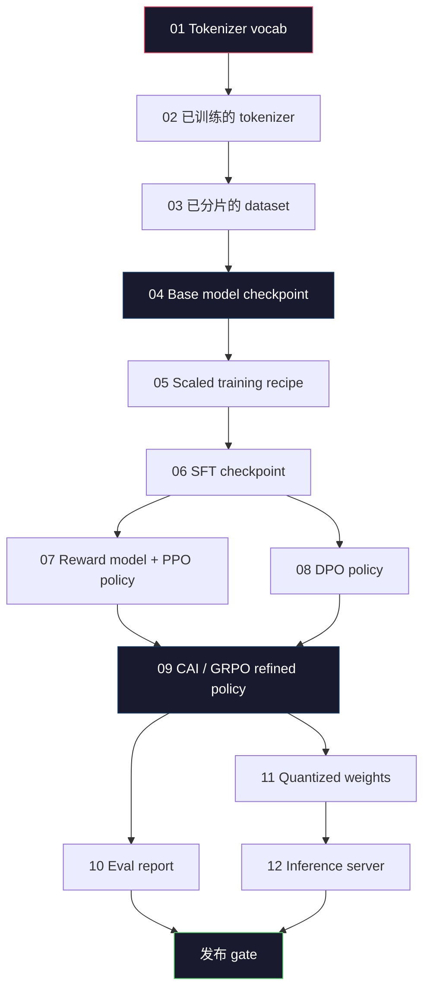
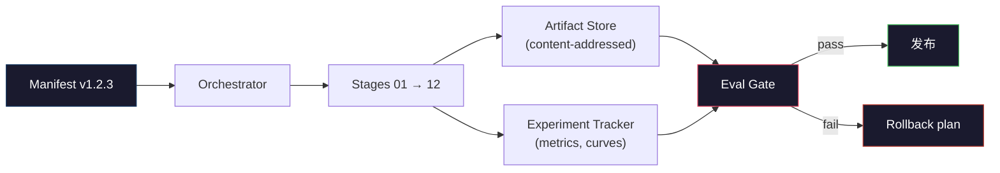

# Construction of a complete LLM Pipeline

> Tất cả các nội dung của bài học 01 đến 12 đều là một giai đoạn của cùng một đường ống. Bài học này là chuyển các giai đoạn này thành một khung kịch bản hoạt động từ cuối đến cuối:tokenize,pre-train,scale,SFT,align,evaluate,quantize,serve. Bạn sẽ không được đào tạo trên máy tính xách tay một mô hình 70B. Bạn sẽ phát triển lớp dàn xếp,manifest,eval gate và rollback plan, đó là 2026 năm đội biên giới sử dụng để quyết định những gì có thể phát hành cơ chế đó. Đây là cột mốc của giai đoạn này.

**Type:** Build
**Languages:** Python (stdlib)
**Prerequisites:** All Phase 10 lessons 01-12
**Time:** ~120 minutes

## Học mục tiêu
- 将前十一课(tokenizer、data、pre-training、scaling、SFT、RLHF、DPO、CAI、eval、quantization、inference) 组合成一个可复现的管道规范
- 定义 các giai đoạn giữa hợp đồng tạo vật: mỗi giai đoạn tiêu thụ gì, sản xuất gì, và giai đoạn tiếp theo làm thế nào để xác nhận nhập khẩu
- Xây dựng một trình diễn viên, để theo dõi các thí nghiệm, đối với các hiện vật, thực hiện hash, và dựa trên ngưỡng đánh giá quyết định liệu thông qua cổng phát hành
-  thiết kế kế kế lật ngược: những đồ tạo vật nào có giá thấp để vận hành lại, những gì có giá cao, cũng như một điểm kiểm soát bị hư hỏng sẽ mang lại chi phí gì

## 问题
Trước đây: Các khóa học mỗi lớp đều có thể làm việc độc lập. Tokenizer đã được đào tạo hoàn thành. GPT nhỏ đã được đào tạo trước. SFT tập dữ liệu đã được kết hợp.

Lâm 3 405B n sử dụng khoảng 30 triệu giờ H100, kéo dài khoảng 54 天。 DeepSeek-V3 sử dụng khoảng 2,8 triệu giờ H800。 Trong thời gian này, một điểm kiểm soát bị hỏng、 một lần ô nhiễm dữ liệu、 một lần hồi quy đánh giá,都可能让团队 mất một tuần tường-luồng và một tháng GPU 预算。

Đây là đá cuối. Bạn sẽ không chạy toàn bộ đường ống trên máy tính xách tay. Bạn sẽ viết một bản phối hợp cho các giai đoạn của các giai đoạn.

Mô hình này từ các tham số 100M đến 1T đều không thay đổi. 4 bộ phận tương tự - manifesto,orchestrator,portal, cửa hàng đồ tạo vật - cũng có thể chạy Llama 3, cũng có thể chạy các GPT còn sót lại của bạn. Sự khác biệt nằm ở kích thước số trong mỗi giai đoạn cấu hình, chứ không phải hình dạng của đường ống.

## 概念
### Hai giai đoạn

Mỗi phần giai đoạn 10  khóa học là một giai đoạn.



阶段 07 和 08 có thể并行运行── tất cả các giai đoạn khác đều phụ thuộc cứng──阶段 02(tokenizer) của sự thay đổi sẽ làm cho tất cả các tác phẩm dưới đây thất bại──阶段 10(eval) của sự thay đổi sẽ chỉ làm cho việc phát hành quyết định thất bại──

### Sự Khải huyền

manifest là một tài liệu đơn lẻ, nó phải hoàn chỉnh để mô tả một lần chạy đủ để lặp lại. Bất kỳ nội dung nào được tạo ra trong đường ống, đều không nên phụ thuộc vào trạng thái bên ngoài manifest.

```
pipeline_version: 1.2.3
seed: 42
git_commit: a1b2c3d4
stages:
  01_tokenizer:
    recipe: bpe_32k
    input_hash: sha256:...
    output_hash: sha256:...
    wall_clock_sec: 3600
    cost_usd: 12
```

阶段 N của output hash là giai đoạn N+1 của input hash. Nếu có bất kỳ sự phân biệt nào, đường ống sẽ dừng lại. Đây là cách bạn sớm phát hiện ra sự tham nhũng dữ liệu.

Trong thực tế, đội sẽ sử dụng một kế hoạch YAML nhỏ, cộng với một kiểm tra biểu hiện, để sử dụng và lần đầu tiên thành công hoạt động để làm khác biệt. Bất cứ điều gì xuất hiện hiện trong dự kiến (giờ chi phí, đồng hồ tường) bên ngoài delta đều là cờ đỏ.

### Định dạng tạo vật

Mỗi giai đoạn của các sản phẩm là các tác phẩm được đánh dấu không phải là một mục mục, không phải là mác, mà là một loại tên của một kế hoạch được biết đến.

| Stage | Artifact Type | Key Fields |
|-------|--------------|-----------|
| 01-02 | Tokenizer | vocab.json, merges.txt, config.json, hash |
| 03 | Dataset | shards[], row count, token count, dedup stats |
| 04-05 | Checkpoint | weights.safetensors, config.json, optimizer state, step count |
| 06 | SFT Model | checkpoint + SFT recipe + data mix |
| 07 | Reward Model | RM checkpoint + preference data hash |
| 08-09 | Policy | checkpoint + reference hash + beta + KL budget consumed |
| 10 | Eval Report | benchmark scores + regression diffs + eval data hash |
| 11 | Quantized Model | quantized weights + calibration data + accuracy delta vs FP16 |
| 12 | Server Spec | endpoint + model hash + config + observability hooks |

Đếm 能 ngăn chặn chế độ thất bại phổ biến nhất:把阶段 08 的输出当成阶段 06 的输入,通过SFT 路径发布一个DPO 训练过的模型――Typed artefacts和 typed stage signatures 会让这些错误变成编译时失败,而不是第五天才发现的失败――

### Cổng Eval

发布不是培训完成──发布是培训完成和评估门通过──门 在运行开始前就定义好──

```
gates:
  mmlu:      >= baseline + 0.5   # 无 regression
  humaneval: >= baseline + 1.0
  truthfulqa: >= baseline         # 无下降
  safety_refusal_rate: <= 0.05
  kl_from_reference: <= 25.0
  cost_total_usd: <= 50000
```

Mỗi cổng đều là ngưỡng số. Không có cổng nào có vẻ tốt. Không có dấu hiệu chủ quan. Nếu tất cả cổng đều qua, đồ tạo vật sẽ được đánh dấu là có thể vận chuyển. Nếu bất kỳ cổng nào thất bại, việc vận hành này sẽ bị giữ, chờ sự đảo ngược rõ ràng của nhà phê bình, và đảo ngược.

两个门 能抓住大多数灾难――*Regression* gate(新模型在核心基准上必须至少和之前一样好)能抓住培训 bugs――*KL ngân sách* gate(sự chính sách 偏离参考程度不能超过X)能抓住对齐 过度加工――每个生产管道都同时拥有这两者――

### Người dàn nhạc

Đây là một đoạn mã, đọc các biểu hiện, các giai đoạn phát hành, theo dõi các hiện vật, và bất kỳ vi phạm hợp đồng nào lên dừng lại. Đây không phải là Airflow. Đây không phải là Kubeflow.

Nhiệm vụ của nhạc sĩ rất hạn chế:

1. Từ biểu hiện 解析 DAG。
2. Đối với mỗi giai đoạn, kiểm tra dự đoán xuất phát liệu có đã có đúng hash  tồn tại không (Nếu có thì nhảy qua)
3. 运行该阶段, bắt đầu / stdout / stderr, đo lường đồng hồ tường và chi phí
4. 根据下游阶段预期的输入哈希 验证输出哈希──
5. 失败时,写入包含精确失败阶段的部分表单,并以非零状态退出──

Đó là khoảng 200 đường Python. Nó sẽ trông giống như trong bài học này.`code/main.py`文件──底层真实管道 会使用 `torchrun`Hoặc`ray`Trong các cụm trên thực hiện từng giai đoạn, nhưng nhạc công thực sự hoạt động trên đơn台机器.

### Tiếp theo thí nghiệm và lưu trữ đồ tạo vật

Hai hệ thống bên ngoài:

**Experiment tracker (wandb, neptune, mlflow).**按阶段记录损失曲线,eval metrics,system telemetry,当你三周后需要比较运行 A 和运行 B,时,tracker就是你查看的地方,团队几乎总是使用主机追踪器 - 自己写会浪费本应用于训练的时间,

**Artifact store (S3, R2, GCS).**Sử dụng điểm kiểm tra, tập hợp dữ liệu, tokenizers, dự trữ đối tượng không thể thay đổi của các báo cáo.`latest.pt`Tên tập tin này là foot-gun;`ckpt-7b-step-20000-sha256:abc123.safetensors`Chỉ là hợp đồng thôi.

Nhà dàn nhạc 会同时写入二者──Tracker 面向看图片──的人── đồ vật cửa hàng 面向需要查找输入的下一个阶段──

### Chi phí

Các biên giới chạy được gắn với một số đô la.

**Pre-run estimate.**Từ biểu hiện  tính toán dự kiến FLOPs ((pre-training:6 x params x token) 、 dự kiến giờ GPU (((FLOPs / cao điểm thông qua / sử dụng), cũng như theo tỷ lệ thuê 计算的美元成本── nếu ước tính 超过预算门, ống sẽ từ chối khởi động──

**In-run tracking.**阶段的墙钟和成本会记录到表. Sau mỗi giai đoạn,都会检查剩余预算. Nếu một giai đoạn nào đó vượt quá, cửa của giai đoạn tiếp theo sẽ sử dụng ngân sách mới còn lại để đánh giá. Bạn sẽ không đợi VC gọi điện thoại khi phát hiện ra tiền đã được sử dụng.

Llama 3  chi phí báo cáo là $61M。DeepSeek-V3 报告 main pre-training run 为 $5.6M. tỷ lệ này chủ yếu xuất phát từ hiệu quả phần cứng cộng với sự pha trộn các chuyên gia - nhưng chi phí cụ thể là vì hai đội đều theo dõi theo giai đoạn, chứ không chỉ theo toàn bộ lần chạy theo dõi.

### Tái sinh vs quyết định

Hai người khác nhau. *Tái tạo* có nghĩa là cùng một biểu hiện, cùng một mã, cùng một cơ sở hạ tầng, sẽ tạo ra một điểm kiểm soát trên các métrics dòng chảy dưới cùng giá.

现代 LLM training là tái tạo, nhưng không xác định.  Việc phân phối đào tạo của giảm-sự sắp xếp, không xác định hạt nhân GPU (cuBLAS, flash-attn) và vòng tròn chính xác hỗn hợp sẽ cùng tạo ra các hoạt động giữa các float 1e-5 量级 khác nhau.  Đối với các chỉ số cuối cùng để nói rằng đây không phải là vấn đề, bởi vì chúng sẽ không di chuyển.



### Kế hoạch quay trở lại

Trong vận hành bắt đầu, viết xuống mỗi giai đoạn thất bại sẽ xảy ra gì.

- **重新运行成本低**(hours):tokenizer、eval、quantization、inference server──直接重新运行──
- **中等成本**(ngày):SFT、DPO、CAI。 giữ nguyên mô hình cơ bản; chỉ tái运行 giai đoạn sắp xếp lại。
- **成本高**(tuần và hàng triệu USD): dự kiến đào tạo trước đây. Kế hoạch quay trở lại đây không phải là chạy lại.

Vì sự phụ thuộc giai đoạn được đánh dấu và được hashed, nhạc công có thể tự động tính toán bộ trục ngược:使失败阶段及其所有后代 失效.阶段 06(SFT)失败会使 06、07、08、09、10、11、12 失效.阶段 11(quantisation)失败只会使 11 和 12 失效.

### 2026 năm quan sát thấy sản xuất Công thức

Hầu hết các đội biên giới đều có cùng bộ xương.

- Tokenizer:128k BPE với byte fallback── dựa trên小型、平衡的多语言片 training──
- Pre-training:10-20T token, chủ yếu bởi web 加 mã 加合成 组成──Muon hoặc AdamW tối ưu hóa──FSDP2 hoặc DeepSpeed ZeRO-3──Gradient checkpointing──BF16 trọng lượng,FP32 master──
- SFT:500k-2M cặp hướng dẫn,混合 con người và tổng hợp,并严格对评估组做 dedup──
- Định hướng: DPO hoặc CAI + GRPO. Chỉ trong tín hiệu ưu tiên đối với DPO để đo quá nhiều thời gian sử dụng RLHF.
- Eval:MMLU-Pro、MATH、HumanEval+、GPQA、SWE-Bench Verified、LiveBench, cộng với một bộ tập trung tư nhân được giữ mãi mãi
- Quantization:serving 使用 4-bit GPTQ hoặc AWQ;accuracy deltas  quan trọng các đánh giá an toàn 使用 8-bit。
- Dịch vụ: vLLM、TensorRT-LLM 或 nội bộ── liên tục phân phối.── Kích mã dự đoán.── KV cache sơ tán.──

Số lượng mỗi 6 tháng đều thay đổi.


```figure
beam-search
```

##  xây dựng nó
本课代码是管弦符 和 manifest checker,而不是十二个训练脚本──每个阶段都用位控模拟,生成具有正确形状和哈希的输出文物──端到端运行管弦符 可以在您烧 GPU 预算跑真实阶段之前,证明管道的管道正常──

完整实现见 `code/main.py`❖ Phần quan trọng:

- `Manifest`Dataclass:pipeline version、seed、git commit、stages、gates。
- `Stage`Dataclass:name、type、input(hashes)、output(hash)、wall clock、cost。
- `Orchestrator.run()`:解析 DAG、đưa các giai đoạn、验证 hashes、更新 manifest。
- `EvalGate.check()`:读取 ngưỡng ≠ với báo cáo đánh giá mới nhất 比较、返回通过/失败──
- `ArtifactStore`(in-memory stub):按 hash put/get,模拟 S3。
- `CostTracker`: từng giai đoạn và chi phí tích lũy, vượt quá giới hạn 时停止──

`main.py`Phòng ống trung gian sẽ chạy 12 giai đoạn giữ chỗ, tạo ra một biểu hiện, và trình bày một cổng đánh giá thất bại, để hiển thị hình thức chạy được.

## Sử dụng nó
Phòng công việc theo quy luật có ba lệnh:

```
python code/main.py plan    # 验证 manifest，计算 cost estimate，打印 DAG
python code/main.py run     # 执行 stages，写入 manifest.out.yaml
python code/main.py gate    # 读取 manifest.out.yaml，应用 eval gates，ship-or-hold
```

Mỗi lần đều chạy`plan`◊ Hầu hết các lỗi đường ống 会在计划时间 出现 -- 缺失门门、固态 hashes、预算过剩──运行`plan`Là miễn phí.`run`Rất đắt tiền. Đi qua một bên dễ dàng bắt được những con bọ để tiết kiệm tiền.

`gate`của xuất khẩu `SHIP`, phải là `HOLD: <reason>`❖ Hỗn không là thất bại; nó là một điểm quyết định.

## 交付 nó
本课会产出 `outputs/skill-llm-pipeline-reviewer.md` Đưa một bản biểu lộ đường ống được đề xuất  cho nó, nó sẽ kiểm tra tất cả các hợp đồng: phím đánh dấu giai đoạn, chuỗi hash, cửa, kế hoạch quay lại, ước tính chi phí.

## 练习
1. 扩展管弦乐器,让它支持阶段 07 和 08 的并行执行──使用 stdlib `concurrent.futures`Module: xác nhận biểu hiện cuối cùng ghi lại các đầu ra của hai giai đoạn, và hash đầu vào của giai đoạn 09 là sự kết hợp xác định của hai người.

2. 添加一个污染检查门──给定 eval数据集 hash 和训练数据集碎片,计算重叠(lớp nối chuỗi chính xác hoặc 13 gram)── Nếu chồng chéo 超过0.1%,gate 失败──进入一个被污染的训练集,并确认门将保持这一次运行──

3. Từ các nguyên tắc đầu tiên  thực hiện một ước tính chi phí. Đối với giai đoạn 04 ((pre-training), sẽ có FLOPs  ước tính là 6 x param x token, giả định H100 trên BF16 là 989 TFLOPs, MFU (mô hình sử dụng FLOPs) là 40%, giá là $2.50/GPU-hour.

4. 构建部分滚倒――模拟阶段 09(CAI) thất bại, sau đó trong trường hợp giữ 01-08 được lưu trữ trong cache, tái运行阶段 09 đến 12──Orchestrator 应该通过哈希检查 检查缓存的文物并跳过它们──测量与完整重新运行相比省的墙-钟──

5. 添加可观看性──为每阶段发发 OpenTelemetry span,属性包括参数、代码见、损失 和成本──将 span 管道传到本地收藏器──重点不是仪表板;重点是每个阶段的健康 都能通过单个追踪ID 追踪──

## 关键术语
| Term | What people say | What it actually means |
|------|----------------|----------------------|
| Manifest | “recipe file” | 描述 pipeline version、seed、per-stage config 和 gate thresholds 的 YAML 或 JSON，足以 replay 一次 run |
| Content-addressed | “按 hash 而不是 name” | Artifacts 按其内容的 SHA-256 存储，因此你永远不会把 version A 和 version B 混淆 |
| Eval gate | “发布标准” | Benchmark metrics 和 safety scores 上的 numeric thresholds，必须通过后 artifact 才会被标记为 shippable |
| KL budget | “alignment drifted 有多远” | 对 alignment stages 上累计 KL(policy || reference) 的 cap，并作为 gate 强制执行 |
| MFU | “你用了多少 GPU” | Model FLOPs Utilization，即 achieved FLOPs 除以 theoretical peak。70B scale 典型值为 40%，7B 为 55% |
| Rollback plan | “出问题时我们做什么” | 每个阶段失败时预先写好的 actions：re-run、fall back、使用修订后的 inputs retrain |
| Orchestrator | “conductor” | 读取 manifest、dispatch stages、验证 hashes，并在任何 contract violation 时停止的 process |
| Artifact store | “用于 weights 的 versioned S3” | Immutable content-addressed object store，是 checkpoints、datasets、eval reports 的 single source of truth |
| Reproducible | “Replay 时 metrics 相同” | Bit-level weights 不同但 downstream metrics 等价，这是 distributed LLM training 的现实目标 |
| Cost gate | “不能超过 X” | Pre-run cost estimate 加 in-run tracker；如果 estimate 超过 budget，pipeline 会拒绝启动 |

## 延伸阅读
- [Dubey et al., 2024 -- "The Llama 3 Herd of Models"](https://arxiv.org/abs/2407.21783)- về đường ống biên giới, mô tả công khai chi tiết nhất, bao gồm dữ liệu, đào tạo, sắp xếp,
- [DeepSeek-AI, 2024 -- "DeepSeek-V3 Technical Report"](https://arxiv.org/abs/2412.19437)-- Phương pháp đào tạo hiệu quả ưu tiên, chi phí khoảng 1/10 của đào tạo lớp Llama 3
- [Kaplan et al., 2020 -- "Scaling Laws for Neural Language Models"](https://arxiv.org/abs/2001.08361)-- ban đầu tính toán-dữ liệu-params quy mô quan hệ
- [Hoffmann et al., 2022 -- "Training Compute-Optimal Large Language Models (Chinchilla)"](https://arxiv.org/abs/2203.15556)-- đối với sửa đổi Kaplan, tái lập lập ngân sách dữ liệu hiện đại
- [PyTorch FSDP2 documentation](https://pytorch.org/docs/stable/fsdp.html)-- Trong PyTorch 2.4+ 中替代 FSDP1 của phân phối đào tạo nguyên thủy
- [Weights & Biases LLM Reports](https://wandb.ai/site/llms)-- Open-source LLM chạy của thực tế biểu hiện và các kết quả theo dõi thí nghiệm, có thể được lấy làm mẫu
