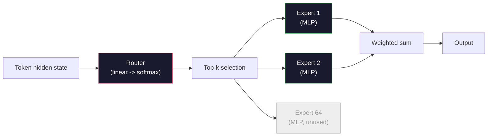

# Mô hình mở: 架构讲解

> Bạn đang ở trong thứ 04 课从零构建一个GPT-2 Small──2026 年前沿开放模型 属于同一家族,只是有五六项具体变化──使用RMSNorm 取代 LayerNorm──使用SwiGLU 取代 GELU──使用RoPE 取代学习的位置──使用GQA或MLA 取代完整MHA──使用大规模混合专家──你已经掌握了数学覆盖了其中95%──本会并排阅读Llama 3、DeepSeek-V3、Mixtral、Qwen 和 Gemma,并指出每个架构发生分歧的确切位置──

**Type:** Learn
**Languages:** Python (stdlib)
**Prerequisites:** Phase 10, Lessons 04, 05, 12 (Pre-training, Scaling, Inference)
**Time:** ~45 minutes

## Học mục tiêu
- 阅读 Llama 3、Mistral、Mixtral、Gemma 2、Qwen 2.5 和 DeepSeek-V3 của config.json,并解释每一段
- Nói ra mỗi mô hình đối với GPT-2 Small thực hiện thay đổi cấu trúc cụ thể,并 từ nguyên tắc đầu tiên
- Chỉ dựa trên cấu hình  tính toán bất kỳ mô hình mở của các tham số  KV cache
- Trong thời gian trễ ở ở ở ở ở ở ở ở ở ở ở ở ở ở ở ở ở ở ở ở ở ở ở ở ở ở ở ở ở ở ở ở ở ở ở ở ở ở ở ở ở ở ở ở ở ở ở ở ở ở ở ở ở ở ở ở ở ở ở ở ở ở ở ở ở ở ở ở ở ở ở ở ở ở ở ở ở ở ở ở ở ở ở ơ

## 问题
Trong bài học thứ 4, bạn đã viết 350 numpy, nhận được một mô hình hình GPT-2 ⋅ Llama 3 405B có một báo cáo kỹ thuật 200 trang⋅ Nhận thức của bạn có thể cho rằng chúng là các loài khác nhau⋅ Thực tế không phải⋅ đó là 200 trang mô tả cùng một đối tượng, chỉ có năm sáu động cơ rõ ràng sửa đổi, thêm vào rất nhiều chi tiết về việc thực hiện quy mô── cấu trúc không thay đổi: nhúngúng、 chuyển đổi khối chú ý、 MLP、 tiêu chuẩn、

Đây là một bài học khác biệt. Đối với mỗi mô hình mở chính gia đình, chúng tôi sẽ xác định nó so với GPT-2 改了什么,为什么改,代价是什么. Sau khi hoàn thành, bạn có thể đọc một thẻ mô hình mới, và trong tâm trí bạn sẽ dịch nó trở lại GPT-2 cơ sở.

Ưu điểm thực tế là: khi Meta  phát hành Llama 5, hoặc DeepSeek  phát hành V4, bạn không cần mô hình tâm trí mới. Bạn sẽ xem cấu hình, thấy những cái gì trong các mô hình thông minh đã được điều chỉnh, sau đó biết tác động của nó là gì.

## 概念
### Nguyên tắc không thay đổi

Tất cả các mô hình mở tự do đã chia sẻ:

- Token Embedding Matrix ((vocab_size x hidden_dim) 』
- N个 decoder blocks 的堆叠:norm、自注意、残留、norm、MLP、残留──
- Cuối cùng và đưa vào các đầu tuyến tính của vocab_size (thường gắn với trọng lượng của các bản nhúng)
- Mặt nạ nguyên nhân, dấu hiệu chéo entropy tiếp theo Loss.

Đó là hình dạng.

### 6 nút hoạt động thực sự

Trong tất cả các mô hình mở phía trước của 2024-2026, cũng có sáu lựa chọn thiết kế lặp lại xuất hiện:

1. **Normalization.**LayerNorm -> RMSNorm。
2. **Positional encoding.**Học được tuyệt đối -> RoPE(加上变体:YaRN、NTK)
3. **Activation.**GELU -> SwiGLU(或 GeGLU)。
4. **Attention head sharing.**MHA -> GQA -> MQA -> MLA。
5. **Dense vs sparse MLP.**Thiết bị dày đặc -> hỗn hợp các chuyên gia
6. **Pre-norm placement.**保持 Pre-norm──Post-norm 已消失──

Tất cả mọi thứ (tỷ lệ học tập, quy trình kết hợp dữ liệu, kích thước lô, chiều dài ngữ cảnh) đều thuộc về cấu hình đào tạo, chứ không phải cấu trúc.

### nút 1: RMSNorm

LayerNorm sẽ giảm giá trị trung bình, trừ với std, giảm và chuyển tiếp.

```
RMSNorm(x) = x / sqrt(mean(x^2) + eps) * gamma
```

Không có giá trị trung bình loại bỏ, không có thiên vị, mỗi token ít hơn một lần, Zhang và Sennrich (2019) cho rằng nó được dịch bằng máy, có thể phù hợp với LayerNorm, đồng thời nhanh hơn 10%.

代价:没有──收益:小幅吞吐量 提升,代码更简单──

### Vòng 2: RoPE

Các vị trí được học tập được tích hợp trong GPT-2 là một 1024 槽位的查找表.

Rotary Position Embedding (RoPE, Su et al. 2021) thông qua trong sản phẩm điểm chú ý, sẽ mỗi qu và K vector 按成对维度旋转来注入位置.

```
q_rotated = rotate(q, angle(pos))
k_rotated = rotate(k, angle(pos))
score = q_rotated . k_rotated
```

Mỗi Llama、Mistral、Qwen、DeepSeek 和 Gemma 都使用 RoPE──Gemma 2 使用混合方式( Hầu hết các lớp sử dụng RoPE, các lớp khác sử dụng cảnh sát cửa sổ trượt địa phương)──

### nút 3: SwiGLU

MLP của GPT-2 là`x -> gelu(xW1 + b1) -> (...)W2 + b2`▽SwiGLU(Shazeer 2020) dùng sản phẩm bị khóa 替换 kích hoạt:

```
SwiGLU(x) = (xW1) * sigmoid(xW1) * xV
```

两个并行投影, thay vì một, được thực hiện bởi kích hoạt của Swish. Thực tế, nó được sử dụng trong sự phức tạp của mỗi tham số.`ff_dim = 4 * hidden`,SwiGLU 使用 `ff_dim = (2/3) * 4 * hidden = 8/3 * hidden`

### nút 4: chia sẻ đầu chú ý

GPT-2 使用 **Multi-Head Attention (MHA)**Mỗi đầu đều có dự án Q K V của riêng mình.

**Multi-Query Attention (MQA, Shazeer 2019)**Trong tất cả các đầu  chia sẻ một K và một V.  sẽ KV cache 按 num_heads 缩减, trên mô hình điển hình là 12x đến 32x của giảm.

**Grouped-Query Attention (GQA, Ainslie et al. 2023)**Đây là phương pháp trung gian: G 组 Q đầu chia sẻ một K và một V。Llama 3 8B sử dụng GQA, chứa 32 đầu Q và 8 đầu KV(G=8), vì vậy相相较完整MHA,KV cache 缩小4x。

**Multi-Head Latent Attention (MLA, DeepSeek 2024)**Để giảm K và V đá vào chia sẻ ở cấp thấp trong trạm ẩn, nhấn lại đầu 投影回去── nó làm giảm thêm cache KV, đồng thời giữ lại khả năng biểu hiện của mỗi đầu──DeepSeek-V2 và V3 phụ thuộc vào nó để đạt được hiệu suất trong ngữ cảnh dài──

| Scheme | KV Heads | KV Cache | Accuracy |
|--------|----------|----------|----------|
| MHA    | num_heads | full | 最好 |
| GQA    | num_groups (G < num_heads) | num_heads / G 缩减 | 接近 MHA |
| MQA    | 1 | num_heads 缩减 | 小幅损失 |
| MLA    | latent, per-head decompression | 小于 MQA | 接近 MHA |

Đối với bất kỳ mô hình nào vượt quá khoảng 13B, GQA hoặc MLA thực sự là cần thiết.

### Vòng 5: Sự kết hợp của các chuyên gia

MLP dày đặc sẽ được kích hoạt cho mỗi token. MLP dày đặc sẽ được kích hoạt cho tất cả các tham số. MLP dày đặc sẽ được kích hoạt cho mỗi token.

```
router_logits = xW_r
indices, weights = top_k(router_logits, k=2)
output = sum_i weights[i] * expert[indices[i]](x)
```

吸引力在于: bạn có thể có 64 个各自 7B 个大小的专家(所以总参数巨大), nhưng mỗi token chỉ运行其中 2 个(所以每 token计算匹配密集 7B 模型)  Mixtral 8x7B 总参数为 47B,但每个 token只激活 13B──DeepSeek-V3 总参数为 671B,但每个 token只激活 37B──



优点: cùng tính toán 更多参数 更多强容量──缺点: bộ nhớ chuyên gia 仍然必须放在某处((所以服务 需要比密等价模型更多的VRAM) √路由器的负载平衡很难,而且在调整期间调整路由器 本身就是一个研究领域──

### nút 6: Pre-normal ở lại

Trình biến nguyên thủy 后应用层规范. Từ GPT-2 đến nay, mỗi mô hình mở đều đặt nó vào mỗi tầng.

### Mô hình theo mô hình khác nhau

Dưới đây là bảng xếp hạng cụ thể hóa tất cả nội dung.

| Model | Year | Total Params | Active Params | Norm | Activation | Position | Attention | MoE | Context |
|-------|------|-------------|---------------|------|-----------|----------|-----------|-----|---------|
| GPT-2 Small | 2019 | 124M | 124M | LayerNorm | GELU | Learned | MHA (12 heads) | no | 1k |
| Llama 3 8B | 2024 | 8B | 8B | RMSNorm | SwiGLU | RoPE | GQA (32/8) | no | 128k |
| Llama 3 70B | 2024 | 70B | 70B | RMSNorm | SwiGLU | RoPE | GQA (64/8) | no | 128k |
| Llama 3 405B | 2024 | 405B | 405B | RMSNorm | SwiGLU | RoPE | GQA (128/16) | no | 128k |
| Mistral 7B | 2023 | 7.2B | 7.2B | RMSNorm | SwiGLU | RoPE | GQA | no | 32k |
| Mixtral 8x7B | 2023 | 47B | 13B | RMSNorm | SwiGLU | RoPE | GQA | yes (8 experts, top-2) | 32k |
| Gemma 2 9B | 2024 | 9B | 9B | RMSNorm (pre+post) | GeGLU | RoPE + sliding | GQA | no | 8k |
| Qwen 2.5 72B | 2024 | 72B | 72B | RMSNorm | SwiGLU | RoPE (YaRN) | GQA (64/8) | no | 128k |
| DeepSeek V2 236B | 2024 | 236B | 21B | RMSNorm | SwiGLU | RoPE | MLA | yes (160 experts, top-6) | 128k |
| DeepSeek V3 | 2024 | 671B | 37B | RMSNorm | SwiGLU | RoPE | MLA | yes (256 experts, top-8) | 128k |

扫描这些列列──RMSNorm là phổ biến──SwiGLU hoặc GeGLU của nó gần gần là phổ biến──RoPE là phổ biến──7B以上 GQA là phổ biến, trừ khi được thay thế bởi MLA──MoE là điểm khác biệt của mô hình cuối cùng──

### Đọc config.json

Llama 3 8B cấu hình:

```
{
  "hidden_size": 4096,
  "intermediate_size": 14336,
  "num_hidden_layers": 32,
  "num_attention_heads": 32,
  "num_key_value_heads": 8,
  "max_position_embeddings": 131072,
  "rope_theta": 500000.0,
  "rms_norm_eps": 1e-5,
  "vocab_size": 128256
}
```

Mỗi đoạn đều có nghĩa là bạn đã đạt được điều gì đó.

- `hidden_size`: kích thước nhúng
- `intermediate_size`: MLP ẩn kích thước(3.5x ẩn -- SwiGLU 数学) 』
- `num_hidden_layers`: độ sâu đống.
- `num_attention_heads`: Q đầu
- `num_key_value_heads`: KV đầu ((GQA)。
- `max_position_embeddings`: chiều dài của bối cảnh đào tạo
- `rope_theta`: Tần số cơ sở RoPE. Meta sẽ đưa nó từ quy mô 10k mặc định đến 500k, được sử dụng để so sánh trong bối cảnh dài.
- `rms_norm_eps`: ổn định số lượng。
- `vocab_size`: token

Chỉ cần những điều này, bạn có thể tính toán tổng số参数, cache KV và bộ nhớ kích hoạt đỉnh.`code/main.py`

### Ngân sách bộ nhớ kích hoạt

Trong hơn vài tỷ parameter, hoạt động sẽ dẫn dắt bộ nhớ đào tạo.

```
activation_mem ~ batch_size * seq_len * hidden_size * num_layers * bytes_per_element
```

Đối với Llama 3 8B, trong lô 1 、seq 8192、BF16、32 lớp、 ẩn 4096 时: chỉ kích hoạt 就约需要8GB(使用检查点),不使用则约40GB──这就是闪光注意和环环注意 重要原因:它们重写注意计算,让 kích hoạt 能够放下──

### Ngân sách KV Cache

对于最大的背景下的推断:

```
kv_cache = 2 * num_layers * num_kv_heads * head_dim * max_seq_len * bytes_per_element
```

Llama 3 8B trong bối cảnh 128k ЅF16 Ѕhead_dim = ẩn / num_heads = 128 时:
`2 * 32 * 8 * 128 * 131072 * 2 = 17.2 GB`Mỗi chuỗi.

Đường độ 8B trong BF16 là 16 GB── đơn vị 128k chuỗi cache KV hơn trọng lượng còn lớn── đây là thúc đẩy GQA、MLA 和 KV cache định lượng nghiên cứu áp suất bộ nhớ──

### Khi mỗi người mẫu thắng

- **单张 80GB GPU，无 MoE**Llama 3 8B、Mistral 7B、Gemma 2 9B。 dễ phục vụ, dụng cụ 广泛。
- **单节点（8x80GB），大 capacity**Llama 3 70B、Qwen 2.5 72B── khả năng mở dày đặc nhất──
- **最大的 open capability，可接受 MoE 复杂度**: DeepSeek V3、Mixtral 8x22B── mỗi khả năng hoạt động của FLOP 最佳──
- **Long-context 需求**Llama 3 (via RoPE) đạt 128k)
- **Low-latency serving**:Gemma 2 9B(trường trượt 降低 tính toán ngữ cảnh dài)


```figure
rmsnorm-vs-layernorm
```

##  xây dựng nó
Mã của 本课是一个计算器. Được định định tùy ý config.json, nó sẽ in theo các cấu trúc phân chia các参数, max context, KV cache, SwiftLU MLP ratio, cũng như một phán xét ngắn về cấu trúc.

```python
config = {
    "hidden_size": 4096, "intermediate_size": 14336,
    "num_hidden_layers": 32, "num_attention_heads": 32,
    "num_key_value_heads": 8, "vocab_size": 128256,
    "max_position_embeddings": 131072,
}
```

脚本会逐字段遍历架构,计算嵌入、注意(带 GQA giảm)、MLP(带 SwiGLU mở rộng)、层规范和头的参数量──然后它会按给定文本长度计算 KV缓存,并打印总结──

实现见 `code/main.py`

## Sử dụng nó
运行计算器, sử dụng trong kịch bản捆绑 Llama 3 8B、Mistral 7B、Mixtral 8x7B 和 DeepSeek V3 config。比较参数分解。 chú ý tổng参数 của các mô hình MoE là quá dày đặc, nhưng số param hoạt động 往往更小。 chú ý DeepSeek V3 KV cache 虽然总参数更多,却小于 Llama 3 405B 的 KV cache ―这就是 MLA 的效果──

Sau đó, hãy cài đặt cấu hình của bất kỳ mô hình nào của bạn, đọc bản tóm tắt, và quyết định liệu nó có phù hợp với GPU của bạn hay không.

## 交付 nó
本课会生成 `outputs/skill-open-model-picker.md` Đặt một mục tiêu triển khai (GPU type,VRAM,context length,latency budget) và một nhiệm vụ hình ảnh (chat,code,reasoning,long-context), nó sẽ đề xuất một mô hình mở, quy trình định lượng trong lớp 11, cũng như một đống suy luận trong lớp 12, và rõ ràng mô tả sáu cấu trúc xoay quanh các ý tưởng liên quan.

## 练习
1. Từ HuggingFace 阅读 Qwen 2.5 72B config── từ零计算总参数──与HF 报告的值比较,并识别任何三角形的来源(头圆化、KV chia sẻ yếu tố等)──

2. DeepSeek V3 sử dụng 256 chuyên gia,并采用 top-8 routing,并计算激活专家与总专家比例,并与 Mixtral 8x7B 8 trong số top-2进行比较,并从稀少25%转向密集稀少3%) đối với mỗi FLOP dung lượng có nghĩa là gì?

3. 计算 Llama 3 405B trong bối cảnh 128k 下使用 FP8 和 BF16 时的 KV cache──FP8 là một nửa số giá trị BF16──在单个8xH100节点上(每张 80GB = 总计 640GB,减重内存), bạn có thể phục vụ nhiều chuỗi song song?

4. Gemma 2 交替使用全注意 和滑窗-注意层──当一半层 使用4096-token滑窗而不是全文 context 时,写出 KV cache 的数学公式──在 8k tổng ngữ cảnh 下能节省多少内存?

5. Tìm một mô hình mở trong giai đoạn gần đây được phát hành sau khi bài viết này kết thúc. Chọn ra nó đã chọn nào trong sáu vòng quay, và liệu nó có đưa ra vòng quay thứ bảy hay không.

## 关键术语
| Term | What people say | What it actually means |
|------|----------------|----------------------|
| RMSNorm | “没有均值的 LayerNorm” | 只按 root mean square 进行 normalize，并使用 learned scale -- 更便宜且可与 LayerNorm 相比 |
| RoPE | “Rotary positions” | 将每个 Q 和 K Vector 按 2D pairs 旋转，角度取决于 position -- 结合 scaling 技巧可外推到训练长度之外 |
| SwiGLU | “新的 MLP activation” | 带 Swish 的 gated linear unit：`(xW1) * sigmoid(xW1) * xV` -- 是每个 2024+ open model 的标准配置 |
| GQA | “中间路线 attention” | Grouped-Query Attention：G 组 Q heads 共享一个 K 和一个 V head -- 在避免 MQA accuracy 损失的同时缩小 KV cache |
| MLA | “DeepSeek 的 attention” | Multi-Head Latent Attention：将 K/V 压缩到共享 low-rank latent，再按 head 解压 -- 大模型中最小的 KV cache |
| MoE | “Sparse experts” | Mixture of Experts：每个 block 有 N 个 MLPs，router 为每个 Token 选择 top-k -- 巨大的 total params，较小的 active params |
| Top-k routing | “每个 Token 选择 k 个 experts” | Router 为每个 expert 计算分数，并激活最高的 k 个 -- 典型 k 从 2（Mixtral）到 8（DeepSeek） |
| YaRN | “拉伸 RoPE” | Yet another RoPE extension -- 通过插值 rotary angles，在 inference 时将 context 从 8k 扩展到 128k+ |
| Sliding-window attention | “不要 attend to everything” | 每个 Token 只 attend 到最近 W 个 Tokens -- 将 attention cost 限制为每 Token O(W)，用于 Gemma 2 和早期 Mistral |
| Active params | “每个 Token 实际运行的部分” | 对于 MoE models，指每个 Token 会经历 forward pass 的参数量（远小于 total params）-- 决定 per-token FLOPs |

## 延伸阅读
- [Dubey et al., 2024 -- "The Llama 3 Herd of Models"](https://arxiv.org/abs/2407.21783)-- mật độ Llama 3 cấu trúc và huấn luyện của gia đình
- [DeepSeek-AI, 2024 -- "DeepSeek-V3 Technical Report"](https://arxiv.org/abs/2412.19437)-- MLA 加 phụ trợ không mất cân bằng tải 加 671B MoE
- [Jiang et al., 2024 -- "Mixtral of Experts"](https://arxiv.org/abs/2401.04088)-- 经典 MoE mở mô hình 论文
- [Su et al., 2021 -- "RoFormer: Enhanced Transformer with Rotary Position Embedding"](https://arxiv.org/abs/2104.09864)-- RoPE 论文
- [Shazeer, 2020 -- "GLU Variants Improve Transformer"](https://arxiv.org/abs/2002.05202)-- SwiGLU、GeGLU 及相关方法
- [Ainslie et al., 2023 -- "GQA: Training Generalized Multi-Query Transformer Models"](https://arxiv.org/abs/2305.13245)-- GQA 论文
- [Gemma 2 Team, 2024 -- "Gemma 2: Improving Open Language Models at a Practical Size"](https://arxiv.org/abs/2408.00118)-- Hybrid full+sliding attention、pre+post-norm
- [Qwen Team, 2024 -- "Qwen 2.5 Technical Report"](https://arxiv.org/abs/2412.15115)-- YaRN mở rộng ngữ cảnh và các công thức đào tạo trong ngữ cảnh dài
