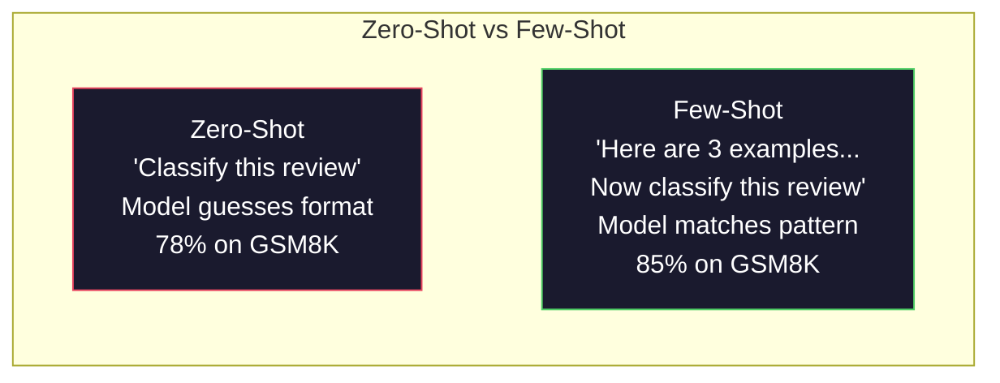
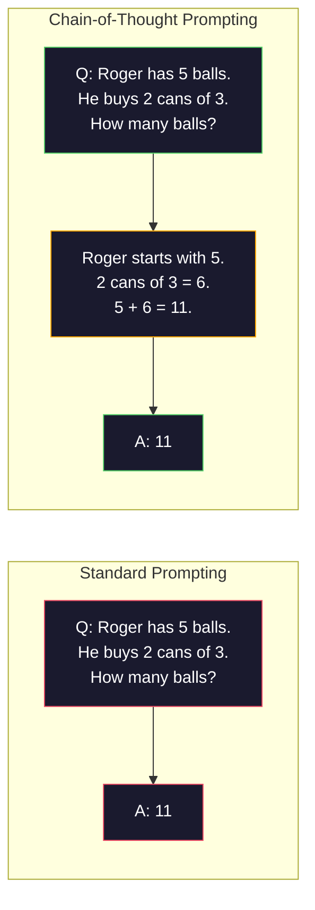
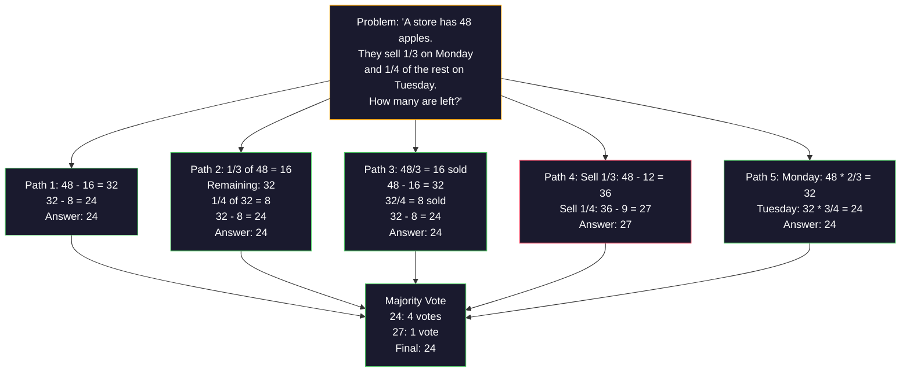
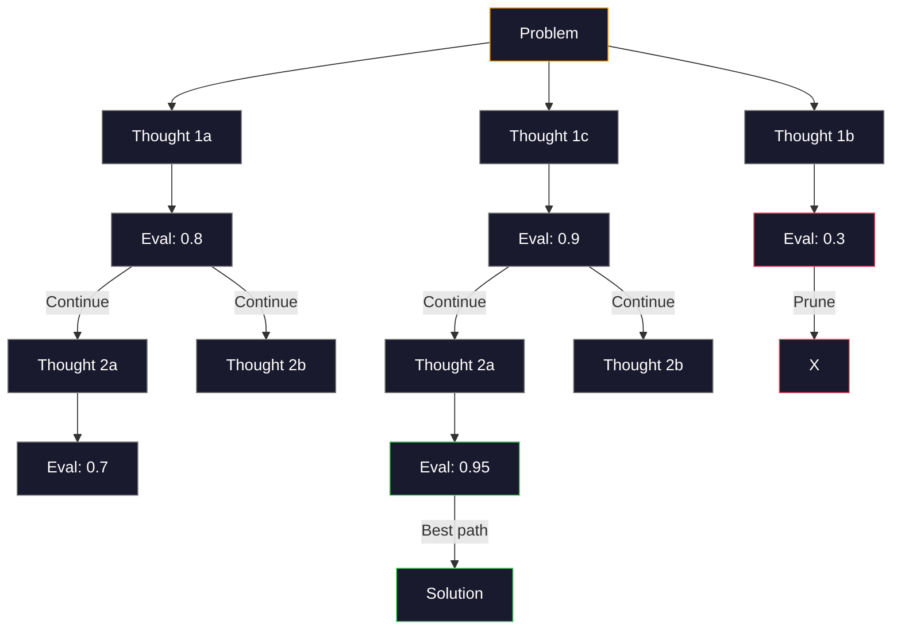

# Một vài cú cúi, chuỗi suy nghĩ, cây suy nghĩ

> Hãy cho mô hình biết phải làm gì là thúc đẩy. Hãy cho nó thấy cách suy nghĩ là kỹ thuật. Một mô hình giống nhau, một nhiệm vụ giống nhau, một dữ liệu giống nhau, khoảng cách từ 78% đến 91% tỷ lệ chính xác, không phải là mô hình tốt hơn, mà là một chiến lược suy luận tốt hơn.

**类型：**构建
**语言：**Python
**先修要求：**Bài 11.01 (Kỹ thuật nhanh chóng)
**时间：**45 phút

## Học mục tiêu

- Thông qua lựa chọn và mô hình hóa ví dụ để thực hiện các cú cú đánh ngắn, do đó tối đa hóa tỷ lệ xác thực nhiệm vụ
-  ứng dụng chuỗi suy nghĩ (CoT)  đề xuất, nâng cao các vấn đề ứng dụng toán học và nhiều bước
- 构建 tree-of-thought prompt,探索多条推理路径并选择最佳路径
- Trong tiêu chuẩn chuẩn, tăng tỷ lệ xác thực từ 0-shot, ít-shot và CoT

## 问题

Bạn đang xây dựng một ứng dụng hướng dẫn toán học. Bạn sẽ viết:  Giải quyết vấn đề từ này. Trong GSM8K, GPT-5 có 94% thời gian có thể trả lời đối với. Bạn nghĩ đã đạt đến đỉnh.

加上五个词 Hãy nghĩ về bước bước准确率 nhảy lên 91%── thêm vài ví dụ về cách giải thích hoàn chỉnh, chúng ta có thể đạt đến 95%──同一个模型──同一个温度──同一个API 成本──唯一的区别是你给了模型草稿纸──

Đây không phải là hack. Đó là cách làm việc của suy luận. Con người sẽ không một lần suy nghĩ để giải quyết nhiều bước.

Nhưng think step by step 只是开始,不是终点. Nếu bạn chọn 5 条推理路径,然后进行多数投票会怎么样? Nếu bạn cho phép mô hình khám phá một cây khả năng, đánh giá并剪分支会怎么样? Nếu bạn kết nối các lý luận và các công cụ sử dụng?

## 核心概念

### Zero-Shot vs Few-Shot: ví dụ何时胜过指令

Chỉ cho mô hình một nhiệm vụ, ngoài ra không có gì khác.

Wei et al. (2022) trong 8 điểm chuẩn đã đo lường điều này. Đối với các nhiệm vụ đơn giản như cảm xúc, 0-shot và ít-shot, sự khác biệt trong hiệu suất là 2% trong vòng. Đối với các nhiệm vụ phức tạp như toán học nhiều bước và tính toán và tính toán, ít-shot sẽ tăng tỷ lệ xác thực 10-25%.

直觉是: ví dụ là lệnh sau khi nén. Với mô tả của nó về kiểu sản xuất, không giống như mô tả trực tiếp. Với quá trình giải thích của nó về suy luận, không giống như mô tả trực tiếp.



**few-shot 适合的场景：**Các thuật ngữ chuyên dụng trong lĩnh vực các nhiệm vụ nhạy cảm với hình thức, phân loại, chiết xuất cấu trúc, cũng như bất kỳ nhiệm vụ nào cần mô hình phù hợp với mô hình cụ thể.

**zero-shot 适合的场景：** đơn giản thực tế vấn đề  ví dụ tập giới hạn nhiệm vụ sáng tạo của khả năng sáng tạo, cũng như tìm thấy những ví dụ tốt hơn để viết những chỉ thị khó hơn 

### 示例选择:相似胜过随机

Không giống như tất cả các ví dụ. Ví dụ tương tự như chọn mục tiêu nhập, trong phân loại nhiệm vụ, chọn tự chọn cao hơn 5-15% (Liu et al., 2022):

1. **语义相似性**:选择 空间中最接近输入的示例
2. **标签多样性**: ví dụ phải bao gồm tất cả các loại xuất
3. **难度匹配**: phù hợp với mục tiêu vấn đề mức độ phức tạp

Đối với hầu hết các nhiệm vụ, số lượng ví dụ tốt nhất là 3-5 ⋅ ít hơn 3 ⋅, mô hình không đủ mô hình rút tín hiệu ⋅ nhiều hơn 5 ⋅, thu nhập giảm, và lãng phí khung cảnh cửa sổ Token⋅ đối với nhiều nhãn phân loại, mỗi nhãn sử dụng một ví dụ⋅

### Mạng tư tưởng:给模型草稿纸

Chain-of-Thought (CoT) được đưa ra bởi Google Brain của Wei et al. (2022) 👍



Từ cơ chế, tại sao nó có hiệu quả?Trong khi có CoT, mô hình sẽ chuyển đổi tính toán giữa thành token. Trong khi không có CoT, mô hình sẽ kéo dài tính toán sâu hơn.

**GSM8K benchmark（小学数学，8.5K 道题）：**

| Model | Zero-Shot | Zero-Shot CoT | Few-Shot CoT |
|-------|-----------|---------------|--------------|
| GPT-4o | 78% | 91% | 95% |
| GPT-5 | 94% | 97% | 98% |
| o4-mini (reasoning) | 97% | — | — |
| Claude Opus 4.7 | 93% | 97% | 98% |
| Gemini 3 Pro | 92% | 96% | 98% |
| Llama 4 70B | 80% | 89% | 94% |
| DeepSeek-V3.1 | 89% | 94% | 96% |

**关于 reasoning models 的说明。**OpenAI của o-series ((o3、o4-mini) và DeepSeek-R1 等 mô hình sẽ được sử dụng trong chuỗi suy nghĩ trong đầu tư.

Có hai hình thức:

**Zero-shot CoT**Trong một bài viết ngắn, chúng ta sẽ xem xét từng bước:

**Few-shot CoT**: cung cấp các ví dụ về các bước suy luận. Nó hiệu quả hơn so với CoT chụp không, bởi vì mô hình có thể nhìn thấy các mô hình suy luận chính xác bạn mong đợi.

**CoT 会伤害表现的场景**:简单事实回忆(Quả là thủ đô của Pháp?) 、单步分类、速度比准确率更重要任务──CoT Mỗi lần truy vấn sẽ tăng 50-200 个推理 Token 的开销──对于高吞吐、低复杂度任务,这是浪费成本──

### Thống nhất: nhiều lần, một lần bỏ phiếu

Wang et al. (2023)  đề xuất tính nhất quán. 核心洞察是:单条 CoT 路径可能包含推理错误.



Trong thí nghiệm PaLM 540B ban đầu, độ nhất quán sẽ tăng tỷ lệ xác thực GSM8K từ 56,5% (năm chỉ số 1 CoT) lên 74,4% trong N=40 时. Trong GPT-5 tăng rất nhỏ (năm chỉ số 97% đến 98%), vì tỷ lệ xác thực cơ bản đã gần 和.

权衡是:N 个样本意味着N 倍 API 成本和延迟――实践中,N=5 能获得大部分收益――N=3 là giá trị tối thiểu của bỏ phiếu có ý nghĩa―― đối với hầu hết các nhiệm vụ,N > 10 收益递减――

### Cây tư tưởng:分支式探索

Yao et al. (2023)  đề xuất Tree-of-Thought (ToT) ・CoT 沿一条线性推理路径前进, trong khi ToT 会探索多个分支, và tiếp tục đánh giá trước đó những分支 có triển vọng nhất。



ToT có ba thành phần:

1. **Thought generation**: tạo nhiều ứng cử viên bước tiếp theo
2. **State evaluation**:为每个候选打分(có thể sử dụng LLM 自身作为评估器)
3. **Search algorithm**Thông qua BFS hoặc DFS  xuyên suốt cây,并剪枝低分分支

Trong game of 24 任务中 ([[Use of 24 个数字组合 4 个数字得到 24), sử dụng tiêu chuẩn nhắc GPT-4 解题率为7.3%──使用 CoT为4.0%──CoT ở đây thực sự gây hại, vì không gian tìm kiếm rất rộng)──使用 ToT 则达到74%.──

ToT rất đắt tiền. Mỗi node trong cây đều cần một lần LLM 调用.

### ReAct:Thinking + Doing

Yao et al. (2022) sẽ chuyển đổi giữa các phương tiện nghiên cứu và nghiên cứu.

```mermaid
graph LR
    Q["Question:\nWhat is the\npopulation of the\ncountry where\nthe Eiffel Tower\nis located?"]
    T1["Thought: I need to\nfind which country\nhas the Eiffel Tower"]
    A1["Action: search\n'Eiffel Tower location'"]
    O1["Observation:\nParis, France"]
    T2["Thought: Now I need\nFrance's population"]
    A2["Action: search\n'France population 2024'"]
    O2["Observation:\n68.4 million"]
    T3["Thought: I have\nthe answer"]
    F["Answer:\n68.4 million"]

    Q --> T1 --> A1 --> O1 --> T2 --> A2 --> O2 --> T3 --> F

    style Q fill:#1a1a2e,stroke:#ffa500,color:#fff
    style T1 fill:#1a1a2e,stroke:#51cf66,color:#fff
    style A1 fill:#1a1a2e,stroke:#e94560,color:#fff
    style O1 fill:#1a1a2e,stroke:#808080,color:#fff
    style T2 fill:#1a1a2e,stroke:#51cf66,color:#fff
    style A2 fill:#1a1a2e,stroke:#e94560,color:#fff
    style O2 fill:#1a1a2e,stroke:#808080,color:#fff
    style T3 fill:#1a1a2e,stroke:#51cf66,color:#fff
    style F fill:#1a1a2e,stroke:#51cf66,color:#fff
```



ReAct trên nhiệm vụ chuyên sâu kiến thức tốt hơn so với CoT khi nó có thể đưa ra suy luận được xác định trong dữ liệu thực. Trên HotpotQA, sử dụng ReAct của GPT-4 đạt được 35,1% phù hợp chính xác, trong khi đơn vị CoT là 29,4%.

ReAct là nền tảng của các đại lý AI hiện đại. Mỗi cơ sở đại lý (LangChain, CrewAI, AutoGen) sẽ thực hiện một loại chuyển đổi vòng lặp suy nghĩ-sự hành động-sự quan sát.

### Structured Prompting:XML Tags、Delimiter、Headers

随着提示变复杂,结构能防止模型混不同部分──三种方法:

**XML tags**(Trách hợp nhất với Claude, ở mọi nơi đều ổn định):
```
<context>
You are reviewing a pull request.
The codebase uses TypeScript and React.
</context>

<task>
Review the following diff for bugs, security issues, and style violations.
</task>

<diff>
{diff_content}
</diff>

<output_format>
List each issue with: file, line, severity (critical/warning/info), description.
</output_format>
```

**Markdown headers**(từ tiếng Anh):
```
## Role
Senior security engineer at a fintech company.

## Task
Analyze this API endpoint for vulnerabilities.

## Input
{api_code}

## Rules
- Focus on OWASP Top 10
- Rate each finding: critical, high, medium, low
- Include remediation steps
```

**Delimiters**(极简但有效):
```
---INPUT---
{user_text}
---END INPUT---

---INSTRUCTIONS---
Summarize the above in 3 bullet points.
---END INSTRUCTIONS---
```

### Thêm: 顺序分解

Một số nhiệm vụ đối với một đơn giản chỉ đơn giản là quá phức tạp.


Sợi dây 优于单 prompt có ba lý do:

1. **每一步更简单**Mô hình xử lý một nhiệm vụ tập trung, thay vì cùng lúc và luôn luôn làm mọi thứ
2. **中间输出可检查**Bạn có thể kiểm tra và sửa chữa giữa các bước
3. **不同步骤可以使用不同模型**: dùng mô hình rẻ để rút ra, dùng mô hình đắt tiền để đưa ra ý kiến

###  hiệu suất đối với

| Technique | Best For | GSM8K Accuracy (GPT-5) | API Calls | Token Overhead | Complexity |
|-----------|----------|------------------------|-----------|----------------|------------|
| Zero-Shot | 简单任务 | 94% | 1 | 无 | 极低 |
| Few-Shot | 格式匹配 | 96% | 1 | 200-500 tokens | 低 |
| Zero-Shot CoT | 快速推理提升 | 97% | 1 | 50-200 tokens | 极低 |
| Few-Shot CoT | 最高单次调用准确率 | 98% | 1 | 300-600 tokens | 低 |
| Self-Consistency (N=5) | 高风险推理 | 98.5% | 5 | 5x token cost | 中 |
| Reasoning model (o4-mini) | CoT 的直接替代 | 97% | 1 | hidden (2-10x internal) | 极低 |
| Tree-of-Thought | 搜索/规划问题 | N/A (74% on Game of 24) | 10-40+ | 10-40x token cost | 高 |
| ReAct | 基于知识的推理 | N/A (35.1% on HotpotQA) | 3-10+ | 可变 | 高 |
| Prompt Chaining | 复杂多步骤任务 | 96% (pipeline) | 2-5 | 2-5x token cost | 中 |

Công nghệ chính xác phụ thuộc vào ba yếu tố: yêu cầu tỷ lệ chính xác, ngân sách chậm và dung nạp chi phí. Đối với hầu hết các hệ thống sản xuất, CoT ít bắn cộng với 3 mẫu tự nhất quán giảm có thể phủ 90% trường hợp sử dụng.


```figure
few-shot-curve
```

##  xây dựng nó

Chúng ta sẽ xây dựng một hệ thống tìm kiếm giải pháp vấn đề toán học, đưa ra một vài cú cú thôi thúc, chuỗi suy nghĩ, suy nghĩ và tự nhất quán bỏ phiếu, tạo ra một đường ống dẫn, rồi cho các vấn đề tham gia vào cây suy nghĩ.

完整实现在 `code/advanced_prompting.py`Trung ⋅ 下面是关键组件

### 步骤 1: Ví dụ:

Thứ nhất, bộ phận quản lý vài ví dụ,并为给定问题选择最相关的例子──

```python
GSM8K_EXAMPLES = [
    {
        "question": "Janet's ducks lay 16 eggs per day. She eats three for breakfast every morning and bakes muffins for her friends every day with four. She sells every egg at the farmers' market for $2. How much does she make every day at the farmers' market?",
        "reasoning": "Janet's ducks lay 16 eggs per day. She eats 3 and bakes 4, using 3 + 4 = 7 eggs. So she has 16 - 7 = 9 eggs left. She sells each for $2, so she makes 9 * 2 = $18 per day.",
        "answer": "18"
    },
    ...
]
```

Mỗi ví dụ có 3 phần: vấn đề, chuỗi và câu trả lời cuối cùng.

### 步骤 2: Cây dựng các tính năng của tư tưởng

prompt builder sẽ đưa tin nhắn hệ thống 带推理链 vài ví dụ, cũng như mục tiêu vấn đề được cấu tạo thành một prompt.

```python
def build_cot_prompt(question, examples, num_examples=3):
    system = (
        "You are a math problem solver. "
        "For each problem, show your step-by-step reasoning, "
        "then give the final numerical answer on the last line "
        "in the format: 'The answer is [number]'."
    )

    example_text = ""
    for ex in examples[:num_examples]:
        example_text += f"Q: {ex['question']}\n"
        example_text += f"A: {ex['reasoning']} The answer is {ex['answer']}.\n\n"

    user = f"{example_text}Q: {question}\nA:"
    return system, user
```

格式约束( Câu trả lời là [nombre])至关重要──没有它,自连性 就无法跨样本抽取并比较答案──

### 步骤 3: Đánh phiếu tự nhất quán

采样 N 条推理路径,并取多数答案──

```python
def self_consistency_solve(question, examples, client, model, n_samples=5):
    system, user = build_cot_prompt(question, examples)

    answers = []
    reasonings = []
    for _ in range(n_samples):
        response = client.chat.completions.create(
            model=model,
            messages=[
                {"role": "system", "content": system},
                {"role": "user", "content": user}
            ],
            temperature=0.7
        )
        text = response.choices[0].message.content
        reasonings.append(text)
        answer = extract_answer(text)
        if answer is not None:
            answers.append(answer)

    vote_counts = Counter(answers)
    best_answer = vote_counts.most_common(1)[0][0] if vote_counts else None
    confidence = vote_counts[best_answer] / len(answers) if best_answer else 0

    return best_answer, confidence, reasonings, vote_counts
```

Nhiệt độ 0,7  rất quan trọng. Khi nhiệt độ 0,0, tất cả các mẫu đều giống nhau, do đó mất ý nghĩa. Bạn cần đủ sự tự nhiên để tạo ra nhiều cách suy luận, nhưng không thể tự nhiên để cho mô hình ra ra.

### 步骤 4: Tree-of-Thought Solver

Đối với vấn đề thất bại trong tư duy tuyến tính, bạn sẽ khám phá nhiều phương pháp, và đánh giá hướng nào có triển vọng tốt nhất.

```python
def tree_of_thought_solve(question, client, model, breadth=3, depth=3):
    thoughts = generate_initial_thoughts(question, client, model, breadth)
    scored = [(t, evaluate_thought(t, question, client, model)) for t in thoughts]
    scored.sort(key=lambda x: x[1], reverse=True)

    for current_depth in range(1, depth):
        next_thoughts = []
        for thought, score in scored[:2]:
            extensions = extend_thought(thought, question, client, model, breadth)
            for ext in extensions:
                ext_score = evaluate_thought(ext, question, client, model)
                next_thoughts.append((ext, ext_score))
        scored = sorted(next_thoughts, key=lambda x: x[1], reverse=True)

    best_thought = scored[0][0] if scored else ""
    return extract_answer(best_thought), best_thought
```

评估器本身也是一次LLM 调用──你问模型: Trên thang điểm từ 0.0 đến 1.0, con đường suy luận này hứa hẹn như thế nào để giải quyết vấn đề?

### 步骤 5: toàn bộ đường ống

đường ống thông thông qua nâng cấp chiến lược组合所有技术――

```python
def solve_with_escalation(question, examples, client, model):
    system, user = build_cot_prompt(question, examples)
    single_response = call_llm(client, model, system, user, temperature=0.0)
    single_answer = extract_answer(single_response)

    sc_answer, confidence, _, _ = self_consistency_solve(
        question, examples, client, model, n_samples=5
    )

    if confidence >= 0.8:
        return sc_answer, "self_consistency", confidence

    tot_answer, _ = tree_of_thought_solve(question, client, model)
    return tot_answer, "tree_of_thought", None
```

升级逻辑:先尝试便宜方案(单次 CoT) ・・・ Nếu sự tự tin nhất quán 低于0.8(5 样本中低于4 个一致), thì nâng cấp đến ToT──这样能平衡成本和准确率大多数问题便宜地解决,难题获得更多计算──

## Sử dụng nó

### Với LangChain

LangChain vì các mẫu nhanh và phân tích đầu ra  cung cấp hỗ trợ nội dung,能简化 vài lần chụp và các mô hình CoT:

```python
from langchain_core.prompts import FewShotPromptTemplate, PromptTemplate
from langchain_openai import ChatOpenAI

example_prompt = PromptTemplate(
    input_variables=["question", "reasoning", "answer"],
    template="Q: {question}\nA: {reasoning} The answer is {answer}."
)

few_shot_prompt = FewShotPromptTemplate(
    examples=examples,
    example_prompt=example_prompt,
    suffix="Q: {input}\nA: Let's think step by step.",
    input_variables=["input"]
)

llm = ChatOpenAI(model="gpt-4o", temperature=0.7)
chain = few_shot_prompt | llm
result = chain.invoke({"input": "If a train travels 120 km in 2 hours..."})
```

LangChain còn được sử dụng để chọn ngữ nghĩa tương tự.`ExampleSelector`Các lớp:

```python
from langchain_core.example_selectors import SemanticSimilarityExampleSelector
from langchain_openai import OpenAIEmbeddings

selector = SemanticSimilarityExampleSelector.from_examples(
    examples,
    OpenAIEmbeddings(),
    k=3
)
```

### Với DSPy

DSPy sẽ thúc đẩy các chiến lược 视为可优化模块──你无需手写 CoT yêu cầu, thay vào đó xác định một chữ ký, sau đó để DSPy 优化 yêu cầu:

```python
import dspy

dspy.configure(lm=dspy.LM("openai/gpt-4o", temperature=0.7))

class MathSolver(dspy.Module):
    def __init__(self):
        self.solve = dspy.ChainOfThought("question -> answer")

    def forward(self, question):
        return self.solve(question=question)

solver = MathSolver()
result = solver(question="Janet's ducks lay 16 eggs per day...")
```

DSPy của `ChainOfThought`会自动添加推理轨迹.`dspy.majority`实现 sự nhất quán:

```python
result = dspy.majority(
    [solver(question=q) for _ in range(5)],
    field="answer"
)
```

### Đối với: Từ Xếp nhặt vs Quát hình

| Feature | From-Scratch (this lesson) | LangChain | DSPy |
|---------|--------------------------|-----------|------|
| 对 prompt format 的控制 | 完全控制 | 基于 template | 自动 |
| Self-consistency | 手动投票 | 手动 | 内置（`dspy.majority`） |
| Example selection | 自定义逻辑 | `ExampleSelector` | `dspy.BootstrapFewShot` |
| Tree-of-Thought | 自定义 tree search | Community chains | 未内置 |
| Prompt optimization | 手动迭代 | 手动 | 自动编译 |
| 最适合 | 学习、自定义 pipelines | 标准 workflows | 研究、优化 |

## 交付 nó

本课会产出两个文物――

**1. Reasoning Chain Prompt**(`outputs/prompt-reasoning-chain.md`): Một mẫu đơn giản sẵn sàng cho sản xuất, được sử dụng để mang lại sự nhất quán của một vài cú bắn CoT──接入你的示例和问题领域即可使用──

**2. CoT Pattern Selection Skill**(`outputs/skill-cot-patterns.md`): Một khung quyết định, được sử dụng dựa trên các loại nhiệm vụ, yêu cầu tỷ lệ xác thực và chi phí để lựa chọn kỹ thuật đưa ra các biện pháp thích hợp.

## 练习

1. **衡量差距**: lấy 10 đường GSM8K 题──分别使用零射,少射,零射 CoT 和少射 CoT 解每一个题──记录每种方法的准确率──哪种技术带来最大提升?

2. **示例选择实验**Đối với cùng 10 câu hỏi, so sánh chọn mẫu tự động với chọn tay tự động tương tự như mẫu.

3. **Self-consistency 成本曲线**Trong 20 đường GSM8K, sử dụng N=1、3、5、7、10 运行自一致性──绘制准确率 vs 成本(总代币)── đối với mô hình của bạn, góc độ của đường cong ở đâu?

4. **构建 ReAct loop**: dùng công cụ máy tính  mở rộng đường ống.`eval()`(in sandbox) thực hiện nó,并把结果反回去──衡工具定理是否优于纯 COT──

5. **ToT 用于创意任务**:将 Tree-of-Thought solver 改造用于创意写作任务:Thiết một câu chuyện 6 từ vừa buồn cười vừa buồn. Sử dụng LLM 作为评估器──分支式探索是否比单弹代产生更好的创意输出?

## 关键术语

| Term | 人们通常说 | 实际含义 |
|------|----------------|----------------------|
| Few-shot prompting | “给它一些示例” | 在 prompt 中包含 input-output demonstrations，用于锚定模型的输出格式和行为 |
| Chain-of-Thought | “让它一步步思考” | 引出中间推理 Token，在生成最终答案前延长模型的有效计算 |
| Self-Consistency | “多运行几次” | 在 temperature > 0 下采样 N 条多样推理路径，并通过多数投票选择最常见的最终答案 |
| Tree-of-Thought | “让它探索选项” | 对推理分支进行结构化搜索，每个部分解法都会被评估，只有有前景的路径会被扩展 |
| ReAct | “思考 + 工具使用” | 在 Thought-Action-Observation loop 中交织推理轨迹与外部动作（搜索、计算、API calls） |
| Prompt chaining | “拆成步骤” | 将复杂任务分解为顺序 prompts，每一步输出都会馈入下一步输入 |
| Zero-shot CoT | “只加上 ‘think step by step’” | 不提供任何示例，只在 prompt 后追加推理触发短语，依赖模型的潜在推理能力 |

## 延伸阅读

- [Chain-of-Thought Prompting Elicits Reasoning in Large Language Models](https://arxiv.org/abs/2201.11903)-- Wei et al. 2022── Google Brain's original CoT 论文──阅读第 2-3节了解核心结果──
- [Self-Consistency Improves Chain of Thought Reasoning in Language Models](https://arxiv.org/abs/2203.11171)- Wang et al. 2023― tự nhất quán 论文―表 1 Có tất cả số bạn cần―
- [Tree of Thoughts: Deliberate Problem Solving with Large Language Models](https://arxiv.org/abs/2305.10601)-- Yao et al. 2023──ToT 论文──第 4 节的24 结果是亮点──
- [ReAct: Synergizing Reasoning and Acting in Language Models](https://arxiv.org/abs/2210.03629)-- Yao et al. 2022。 nền tảng của các đại lý AI hiện đại。第 3 节 giải thích vòng lặp suy nghĩ-phản ứng-phản tra。
- [Large Language Models are Zero-Shot Reasoners](https://arxiv.org/abs/2205.11916)-- Kojima et al. 2022― Hãy suy nghĩ từng bước 论文―以如此简单的方式取得出人意料的效果―
- [DSPy: Compiling Declarative Language Model Calls into Self-Improving Pipelines](https://arxiv.org/abs/2310.03714)-- Khattab et al. 2023──将促使视为编译问题──如果你想超越手动快速工程,值得阅读──
- [OpenAI — Reasoning models guide](https://platform.openai.com/docs/guides/reasoning)-- 关于何时链思路会从快速级技巧 转变为内部 根据代币计价的 理性模式的供应商指导――
- [Lightman et al., "Let's Verify Step by Step" (2023)](https://arxiv.org/abs/2305.20050)-- các mô hình phần thưởng quy trình (PRM), được sử dụng cho mỗi bước trong chuỗi; đó là phần thưởng kết quả duy nhất hơn hơn thành công của các quy trình giám sát tín hiệu.
- [Snell et al., "Scaling LLM Test-Time Compute Optimally" (2024)](https://arxiv.org/abs/2408.03314)-- đối với CoT 长度、自一致性采样和 MCTS 系统研究; khi xác định tỷ lệ hơn trì hoãn quan trọng hơn, hãy suy nghĩ từng bước  会走向何处──
