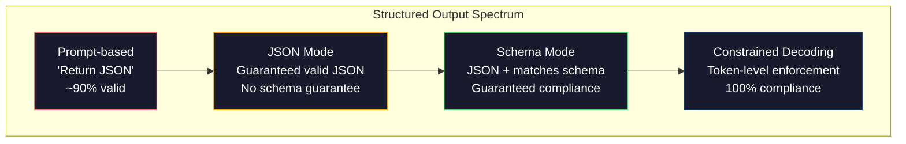
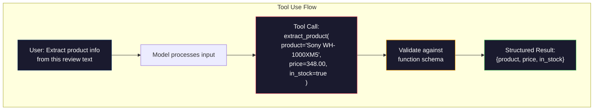

# 结构化输出:JSON、Schema Validation、Constrained Decoding

> Các LLM của bạn  trả lại là字符串. Các ứng dụng của bạn cần là JSON. Đây là sự sụt giảm dẫn đến hệ thống sản xuất sụp đổ, hơn bất kỳ mô hình nào.

**类型：**Xây dựng
**语言：**Python
**先修要求：**Giai đoạn 10, Bài học 01-05 (LLM từ đầu)
**时间：**约90分钟
**相关内容：**Giai đoạn 5 · 20 (Structured Outputs & Constrained Decoding) 涵盖 decoder 层面的理论(FSM/CFG logit processors、Outlines、XGrammar)`response_format`、Anthropic tool use、Instructor)  Nếu bạn muốn hiểu những gì đã xảy ra dưới API, xin hãy đọc trước giai đoạn 5 · 20。

## Học mục tiêu

- Sử dụng OpenAI và Anthropic API 参数 thực hiện JSON-mode và schema-các kết quả
- Xây dựng một lớp xác nhận Pydantic, để từ chối các kết quả LLM sai lầm, và thông qua sai lầm phản  để thực hiện thử nghiệm lại
- 解释 mã hóa hạn chế  làm thế nào ở cấp độ token 强制生成有效 JSON,而无需后处理
- 设计稳健的抽取提示, sẽ được chuyển đổi văn bản không cấu trúc thành cấu trúc dữ liệu được phân loại

## 问题

Bạn hỏi LLM: từ đoạn văn này中抽取产品名称、价格和库存状态──它 trả lời:

```
The product is the Sony WH-1000XM5 headphones, which cost $348.00 and are currently in stock.
```

Đó là câu trả lời hoàn toàn đúng. Đối với ứng dụng của bạn, nó cũng hoàn toàn không sử dụng.`{"product": "Sony WH-1000XM5", "price": 348.00, "in_stock": true}`△ bạn cần một đối tượng JSON có khóa cụ thể, loại cụ thể và định giá cụ thể.

朴素解法: 在快速里加上响应在 JSON──这在90%的情况下有效──另外10%的情况下,模型将 JSON 包在标记代码围内,或者加上类似

Đây không phải là vấn đề kỹ thuật nhanh 问题. Đây là vấn đề. Đây là giải mã 问题. mô hình từ trái đến phải tạo ra token. Ở mỗi vị trí, nó sẽ chọn trong từ vựng hơn 100.000 lựa chọn có thể tiếp theo của Token.`{"price":`, 下一个Token 必须是数字、引号(用于字符串)`null``true``false`Hoặc có một số lượng. Bất cứ nội dung nào khác đều sẽ tạo ra không hiệu quả JSON. Không bị ràng buộc, mô hình có thể chọn một từ tiếng Anh trông hoàn toàn hợp lý, nhưng trong ngữ pháp là một sai lầm thảm khốc.

## 概念

###  cấu trúc xuất khẩu

 Kiểm soát sản xuất cấu trúc có bốn cấp độ, mỗi cấp độ đều đáng tin cậy hơn so với cấp độ trước.



**基于 Prompt**(Thi đáp trong JSON ): không có quy tắc bắt buộc. Mô hình thường tuân thủ, nhưng đôi khi sẽ không.

**JSON mode**:API bảo đảm输出 là hợp lệ JSON。OpenAI của `response_format: { type: "json_object" }`Sẽ kích hoạt mô hình này. Khả năng phát ra có thể không có lỗi phân tích. Nhưng nó không nhất thiết phù hợp với kế hoạch bạn mong đợi. Có thể có thêm khóa, loại lỗi, thiếu phần.

**Schema mode**:API 接收一个JSON Schema,并保证输出与匹配――到2026年, tất cả các nhà cung cấp chính đều ủng hộ việc này:OpenAI `response_format: { type: "json_schema", json_schema: {...} }`(còn có thể qua `tool_choice="required"`)、Anthropic sử dụng công cụ 配合 `input_schema`, và cả hai cặp song sinh .`response_schema`+ `response_mime_type: "application/json"`◊输遇包含你指定的精确键,类型和约束──

**Constrained decoding**Trong quá trình tạo, mỗi Token sẽ bị chặn bởi Decoder sẽ dẫn đến hiệu quả không có hiệu quả của Token. Nếu schema yêu cầu một số, và mô hình sẽ xuất ra một chữ cái, tỷ lệ của Token sẽ được đặt là 0.

### JSON Schema:契约语言

JSON Schema là cách bạn sử dụng để nói với mô hình (hoặc lớp xác thực) đầu ra phải có hình dạng gì. Tất cả các hệ thống đầu ra cấu trúc chính đều sử dụng nó.

```json
{
  "type": "object",
  "properties": {
    "product": { "type": "string" },
    "price": { "type": "number", "minimum": 0 },
    "in_stock": { "type": "boolean" },
    "categories": {
      "type": "array",
      "items": { "type": "string" }
    }
  },
  "required": ["product", "price", "in_stock"]
}
```

这个 schema biểu hiện:输出 phải là một đối tượng, chứa chuỗi 类型 `product`Số không âm 类型 `price`、boolean 类型 `in_stock`, và một chuỗi có thể chọn số `categories`Bất kỳ sản phẩm nào không phù hợp đều bị từ chối.

Các schemas có thể xử lý các tình huống khó khăn:嵌套 đối tượng, chứa các thứ tự kiểu hóa của các mảng, các enums, sẽ string 约束 đến một định giá, mô hình phù hợp với các chuỗi, sử dụng regex, và các kết hợp được sử dụng để nhiều态输出 oneOf,allOf.

### Pydantic 模式

Trong Python, bạn sẽ không viết JSON Schema. Bạn định nghĩa một mô hình Pydantic, nó sẽ tạo ra cho bạn một schema.

```python
from pydantic import BaseModel

class Product(BaseModel):
    product: str
    price: float
    in_stock: bool
    categories: list[str] = []
```

Nó sẽ tạo ra cùng một JSON Schema trên. Thư viện hướng dẫn (và SDK của OpenAI) có thể trực tiếp chấp nhận mô hình Pydantic: truyền vào lớp mô hình, quay lại một ví dụ của quá trình thử nghiệm. Nếu kết quả LLM không phù hợp, hướng dẫn viên sẽ tự động thử lại.

### Chọi chức năng / Sử dụng công cụ

Đây là một cách khác của cùng một vấn đề. Bạn không để cho mô hình trực tiếp tạo ra JSON, mà xác định với các loại hình hóa các parameter.



Khi mô hình cần chọn lựa tùy chọn nào, không chỉ là điền vào các tham số, sử dụng công cụ hơn phù hợp hơn. Nếu bạn có 10 loại sơ đồ rút ra khác nhau, và mô hình phải dựa trên các loại đầu vào chọn đúng, sử dụng công cụ sẽ đồng thời cung cấp cho bạn lựa chọn sơ đồ và sản xuất có cấu trúc.

### 常见失败模式

Ngay cả khi có việc thực thi kế hoạch, cấu trúc xuất vẫn có thể thất bại theo cách nhỏ bé.

**幻觉值**: Output matching schema, but contains the data of the build. Trong văn bản viết là $348, mô hình không được tạo ra.`{"price": 299.99}` Chứng minh Schema 捕捉不到这一点类型正确,但值错误──

**Enum 混淆**: 你把字段约束为 `["in_stock", "out_of_stock", "preorder"]` mô hình xuất khẩu`"available"`语义正确, nhưng không được phép trong tập hợp.

**嵌套 object 深度**Các hệ thống sâu tầng sẽ tạo ra nhiều lỗi hơn. Mỗi tầng của các hệ thống đều là mô hình có thể quên vị trí của cấu trúc.

**Array 长度**Mô hình có thể tạo ra quá nhiều hoặc quá ít mục trong mảng.`minItems`和 `maxItems`Nhưng không phải tất cả các nhà cung cấp đều sẽ bắt buộc phải thực hiện chúng ở cấp độ giải mã.

**可选字段省略**Mô hình sẽ bỏ qua những kỹ thuật có thể chọn, nhưng đối với ví dụ sử dụng của bạn là những đoạn quan trọng về ngữ nghĩa.`null`


```figure
mx-schema-funnel
```

##  xây dựng nó

### 步骤 1: JSON Schema Validator

Từ零 xây dựng một validator, được sử dụng để kiểm tra đối tượng Python có phù hợp với JSON Schema không.

```python
import json

def validate_schema(data, schema):
    errors = []
    _validate(data, schema, "", errors)
    return errors

def _validate(data, schema, path, errors):
    schema_type = schema.get("type")

    if schema_type == "object":
        if not isinstance(data, dict):
            errors.append(f"{path}: expected object, got {type(data).__name__}")
            return
        for key in schema.get("required", []):
            if key not in data:
                errors.append(f"{path}.{key}: required field missing")
        properties = schema.get("properties", {})
        for key, value in data.items():
            if key in properties:
                _validate(value, properties[key], f"{path}.{key}", errors)

    elif schema_type == "array":
        if not isinstance(data, list):
            errors.append(f"{path}: expected array, got {type(data).__name__}")
            return
        min_items = schema.get("minItems", 0)
        max_items = schema.get("maxItems", float("inf"))
        if len(data) < min_items:
            errors.append(f"{path}: array has {len(data)} items, minimum is {min_items}")
        if len(data) > max_items:
            errors.append(f"{path}: array has {len(data)} items, maximum is {max_items}")
        items_schema = schema.get("items", {})
        for i, item in enumerate(data):
            _validate(item, items_schema, f"{path}[{i}]", errors)

    elif schema_type == "string":
        if not isinstance(data, str):
            errors.append(f"{path}: expected string, got {type(data).__name__}")
            return
        enum_values = schema.get("enum")
        if enum_values and data not in enum_values:
            errors.append(f"{path}: '{data}' not in allowed values {enum_values}")

    elif schema_type == "number":
        if not isinstance(data, (int, float)):
            errors.append(f"{path}: expected number, got {type(data).__name__}")
            return
        minimum = schema.get("minimum")
        maximum = schema.get("maximum")
        if minimum is not None and data < minimum:
            errors.append(f"{path}: {data} is less than minimum {minimum}")
        if maximum is not None and data > maximum:
            errors.append(f"{path}: {data} is greater than maximum {maximum}")

    elif schema_type == "boolean":
        if not isinstance(data, bool):
            errors.append(f"{path}: expected boolean, got {type(data).__name__}")

    elif schema_type == "integer":
        if not isinstance(data, int) or isinstance(data, bool):
            errors.append(f"{path}: expected integer, got {type(data).__name__}")
```

### 步骤 2:Pydantic 风格 Mô hình đến Schema

构建一个最小的类到方案转换器――定义一个Python类,并自动生成它的JSON Schema――

```python
class SchemaField:
    def __init__(self, field_type, required=True, default=None, enum=None, minimum=None, maximum=None):
        self.field_type = field_type
        self.required = required
        self.default = default
        self.enum = enum
        self.minimum = minimum
        self.maximum = maximum

def python_type_to_schema(field):
    type_map = {
        str: "string",
        int: "integer",
        float: "number",
        bool: "boolean",
    }

    schema = {}

    if field.field_type in type_map:
        schema["type"] = type_map[field.field_type]
    elif field.field_type == list:
        schema["type"] = "array"
        schema["items"] = {"type": "string"}
    elif isinstance(field.field_type, dict):
        schema = field.field_type

    if field.enum:
        schema["enum"] = field.enum
    if field.minimum is not None:
        schema["minimum"] = field.minimum
    if field.maximum is not None:
        schema["maximum"] = field.maximum

    return schema

def model_to_schema(name, fields):
    properties = {}
    required = []

    for field_name, field in fields.items():
        properties[field_name] = python_type_to_schema(field)
        if field.required:
            required.append(field_name)

    return {
        "type": "object",
        "properties": properties,
        "required": required,
    }
```

### 步骤 3: Bộ lọc mã thông báo bị hạn chế

模拟限制解码──给定一个部分 JSON string 和一个 schema,判断当前位点哪些代码 类别是有效的──

```python
def next_valid_tokens(partial_json, schema):
    stripped = partial_json.strip()

    if not stripped:
        return ["{"]

    try:
        json.loads(stripped)
        return ["<EOS>"]
    except json.JSONDecodeError:
        pass

    last_char = stripped[-1] if stripped else ""

    if last_char == "{":
        return ['"', "}"]
    elif last_char == '"':
        if stripped.endswith('":'):
            return ['"', "0-9", "true", "false", "null", "[", "{"]
        return ["a-z", '"']
    elif last_char == ":":
        return [" ", '"', "0-9", "true", "false", "null", "[", "{"]
    elif last_char == ",":
        return [" ", '"', "{", "["]
    elif last_char in "0123456789":
        return ["0-9", ".", ",", "}", "]"]
    elif last_char == "}":
        return [",", "}", "]", "<EOS>"]
    elif last_char == "]":
        return [",", "}", "<EOS>"]
    elif last_char == "[":
        return ['"', "0-9", "true", "false", "null", "{", "[", "]"]
    else:
        return ["any"]

def demonstrate_constrained_decoding():
    partial_states = [
        '',
        '{',
        '{"product"',
        '{"product":',
        '{"product": "Sony"',
        '{"product": "Sony",',
        '{"product": "Sony", "price":',
        '{"product": "Sony", "price": 348',
        '{"product": "Sony", "price": 348}',
    ]

    print(f"{'Partial JSON':<45} {'Valid Next Tokens'}")
    print("-" * 80)
    for state in partial_states:
        valid = next_valid_tokens(state, {})
        display = state if state else "(empty)"
        print(f"{display:<45} {valid}")
```

### Bước 4: rút đường ống

Để tổng hợp tất cả nội dung một đường ống rút: định nghĩa sơ đồ,模拟 LLM 生成 cấu trúc đầu ra,验证输出,并处理重试――

```python
def simulate_llm_extraction(text, schema, attempt=0):
    if "headphones" in text.lower() or "sony" in text.lower():
        if attempt == 0:
            return '{"product": "Sony WH-1000XM5", "price": 348.00, "in_stock": true, "categories": ["audio", "headphones"]}'
        return '{"product": "Sony WH-1000XM5", "price": 348.00, "in_stock": true}'

    if "laptop" in text.lower():
        return '{"product": "MacBook Pro 16", "price": 2499.00, "in_stock": false, "categories": ["computers"]}'

    return '{"product": "Unknown", "price": 0, "in_stock": false}'

def extract_with_retry(text, schema, max_retries=3):
    for attempt in range(max_retries):
        raw = simulate_llm_extraction(text, schema, attempt)

        try:
            data = json.loads(raw)
        except json.JSONDecodeError as e:
            print(f"  Attempt {attempt + 1}: JSON parse error -- {e}")
            continue

        errors = validate_schema(data, schema)
        if not errors:
            return data

        print(f"  Attempt {attempt + 1}: Schema validation errors -- {errors}")

    return None

product_schema = {
    "type": "object",
    "properties": {
        "product": {"type": "string"},
        "price": {"type": "number", "minimum": 0},
        "in_stock": {"type": "boolean"},
        "categories": {"type": "array", "items": {"type": "string"}},
    },
    "required": ["product", "price", "in_stock"],
}
```

### 步骤 5:运行完整管道

```python
def run_demo():
    print("=" * 60)
    print("  Structured Output Pipeline Demo")
    print("=" * 60)

    print("\n--- Schema Definition ---")
    product_fields = {
        "product": SchemaField(str),
        "price": SchemaField(float, minimum=0),
        "in_stock": SchemaField(bool),
        "categories": SchemaField(list, required=False),
    }
    generated_schema = model_to_schema("Product", product_fields)
    print(json.dumps(generated_schema, indent=2))

    print("\n--- Schema Validation ---")
    test_cases = [
        ({"product": "Test", "price": 10.0, "in_stock": True}, "Valid object"),
        ({"product": "Test", "price": -5.0, "in_stock": True}, "Negative price"),
        ({"product": "Test", "in_stock": True}, "Missing price"),
        ({"product": "Test", "price": "ten", "in_stock": True}, "String as price"),
        ("not an object", "String instead of object"),
    ]

    for data, label in test_cases:
        errors = validate_schema(data, product_schema)
        status = "PASS" if not errors else f"FAIL: {errors}"
        print(f"  {label}: {status}")

    print("\n--- Constrained Decoding Simulation ---")
    demonstrate_constrained_decoding()

    print("\n--- Extraction Pipeline ---")
    texts = [
        "The Sony WH-1000XM5 headphones are priced at $348 and currently available.",
        "The new MacBook Pro 16-inch laptop costs $2499 but is sold out.",
        "This is a random sentence with no product info.",
    ]

    for text in texts:
        print(f"\n  Input: {text[:60]}...")
        result = extract_with_retry(text, product_schema)
        if result:
            print(f"  Output: {json.dumps(result)}")
        else:
            print(f"  Output: FAILED after retries")
```

## Sử dụng nó

### Các sản phẩm được cấu trúc của OpenAI

```python
# from openai import OpenAI
# from pydantic import BaseModel
#
# client = OpenAI()
#
# class Product(BaseModel):
#     product: str
#     price: float
#     in_stock: bool
#
# response = client.beta.chat.completions.parse(
#     model="gpt-5-mini",
#     messages=[
#         {"role": "system", "content": "Extract product information."},
#         {"role": "user", "content": "Sony WH-1000XM5, $348, in stock"},
#     ],
#     response_format=Product,
# )
#
# product = response.choices[0].message.parsed
# print(product.product, product.price, product.in_stock)
```

Phiên bản đầu ra có cấu trúc của OpenAI trong nội bộ sử dụng mã hóa hạn chế. Mỗi mã thông báo được tạo được đảm bảo sẽ có kết quả xuất phát phù hợp với các mô hình Pydantic. Không cần thử nghiệm lại. Không cần xác thực.

### Sử dụng công cụ nhân loại

```python
# import anthropic
#
# client = anthropic.Anthropic()
#
# response = client.messages.create(
#     model="claude-opus-4-7",
#     max_tokens=1024,
#     tools=[{
#         "name": "extract_product",
#         "description": "Extract product information from text",
#         "input_schema": {
#             "type": "object",
#             "properties": {
#                 "product": {"type": "string"},
#                 "price": {"type": "number"},
#                 "in_stock": {"type": "boolean"},
#             },
#             "required": ["product", "price", "in_stock"],
#         },
#     }],
#     messages=[{"role": "user", "content": "Extract: Sony WH-1000XM5, $348, in stock"}],
# )
```

Antropic  thông qua công cụ sử dụng 实现结构 output──模型会发出一个工具调用, trong đó chứa các lập luận cấu trúc của匹配 input_schema── kết quả giống nhau, bề mặt API khác nhau──

### Thư viện hướng dẫn viên

```python
# pip install instructor
# import instructor
# from openai import OpenAI
# from pydantic import BaseModel
#
# client = instructor.from_openai(OpenAI())
#
# class Product(BaseModel):
#     product: str
#     price: float
#     in_stock: bool
#
# product = client.chat.completions.create(
#     model="gpt-5-mini",
#     response_model=Product,
#     messages=[{"role": "user", "content": "Sony WH-1000XM5, $348, in stock"}],
# )
```

Người hướng dẫn  gói bất kỳ khách hàng LLM nào,并加入带验证的自动复试. Nếu lần đầu tiên thử nghiệm xác nhận thất bại, nó sẽ đưa lỗi như một ngữ cảnh 发送回给模型,并要求模型修复输出.

## 交付 nó

本课会产出 `outputs/prompt-structured-extractor.md` Một mẫu đơn giản có thể lặp lại, được sử dụng theo định nghĩa schema từ bất kỳ văn bản nào để lấy dữ liệu cấu trúc.

Nó sẽ xuất hiện.`outputs/skill-structured-outputs.md`Một khung quyết định, được sử dụng dựa trên yêu cầu độ tin cậy và kế hoạch của nhà cung cấp của bạn  phức tạp chọn đúng chiến lược xuất khẩu cấu trúc.

## 练习

1. 扩展 schema validator,使其支持 `oneOf`(Data phải phù hợp với một trong nhiều schemes)  Điều này có thể xử lý nhiều kiểu sản xuất.`Product`vật thể, cũng có thể là hình dạng khác nhau `Service`đối tượng

2. Xây dựng một công cụ khác nhau về các quy trình, để so sánh hai quy trình,并识别 các thay đổi phá vỡ (trừ bỏ các trường yêu cầu, thay đổi các loại) với những thay đổi không phá vỡ (tăng các trường tùy chọn mới, mở rộng các hạn chế)

3. 实现一个更真实的限制解码模拟器――给定一个 JSON Schema 和一个包含100 个 Token的词汇――字母,数字, dấu chấm, từ khóa), từng bước qua thế hệ, ở mỗi vị trí屏蔽 không hiệu quả Token――衡量每一步词汇中有效 Token的比例――

4. 构建一个抽取评估套装――创建50条产品描述,并手工标签 JSON输出――在全部50条上运行您的抽取管道,并衡量精确匹配、场级精确和类型合规――找出哪些字段最难正确抽取──

5. Để tăng điểm tin cậy của bạn, hãy chọn các điểm tin cậy của bạn, hãy chọn các điểm tin cậy của bạn, hãy chọn các điểm tin cậy của bạn, hãy chọn các điểm tin cậy của bạn, hãy chọn các điểm tin cậy của bạn, hãy chọn các điểm tin cậy của bạn, hãy chọn các điểm tin cậy của bạn, hãy chọn các điểm tin cậy của bạn, hãy chọn các điểm tin cậy của bạn, hãy chọn các điểm tin cậy của bạn, hãy chọn các điểm tin cậy của bạn, hãy chọn các điểm tin cậy của bạn, hãy chọn các điểm tin cậy của bạn, hãy chọn các điểm tin cậy của bạn, hãy chọn các điểm tin cậy của bạn, hãy chọn các điểm tin cậy của bạn, hãy chọn các điểm tin cậy của bạn, hãy chọn các điểm tin cậy của bạn, hãy chọn các điểm tin cậy của bạn, hãy chọn các điểm tin cậy của bạn, hãy chọn các điểm tin cậy của bạn, hãy chọn các điểm tin cậy của bạn, hãy chọn các điểm tin cậy của bạn, hãy chọn các điểm tin cậy của bạn, hãy chọn các điểm tin tưởng của bạn, hãy chọn các điểm tin tưởng vào các điểm tin cậy của bạn.

## 关键术语

| Term | 人们通常怎么说 | 它实际意味着什么 |
|------|----------------|----------------------|
| JSON mode | “返回 JSON” | 一个 API flag，保证输出在语法上是有效 JSON，但不强制任何特定 schema |
| Structured output | “类型化 JSON” | 匹配特定 JSON Schema 的输出，具有正确的 key、type 和 constraint |
| Constrained decoding | “引导式生成” | 在每个 Token 位置屏蔽会产生无效输出的 Tokens——保证 100% schema compliance |
| JSON Schema | “一个 JSON template” | 用于描述 JSON 数据结构、type 和 constraint 的声明式语言（被 OpenAPI、JSON Forms 等使用） |
| Pydantic | “Python dataclasses+” | Python library，用于定义带有 type validation 的 data models，FastAPI 和 Instructor 使用它生成 JSON Schemas |
| Function calling | “Tool use” | LLM 输出结构化 function invocation（name + typed arguments），而不是 free text——OpenAI 和 Anthropic 都支持 |
| Instructor | “面向 LLMs 的 Pydantic” | Python library，用于包装 LLM clients 以返回经过验证的 Pydantic instances，并在 validation failure 时自动 retry |
| Token masking | “过滤 vocabulary” | 在 generation 期间将特定 Token probabilities 设为零，使模型无法生成它们 |
| Schema compliance | “匹配形状” | 输出包含每个 required field、正确 types、约束范围内的 values，并且没有额外的不允许字段 |
| Retry loop | “不断重试直到成功” | 将 validation errors 发回给模型，并要求它修复输出——Instructor 会自动执行这一点，最多重试到可配置上限 |

## 延伸阅读

- [OpenAI Structured Outputs Guide](https://platform.openai.com/docs/guides/structured-outputs)OpenAI API 中 dựa trên JSON Schema của hạn chế giải mã 官方文档
- [Willard & Louf, 2023——“Efficient Guided Generation for Large Language Models”](https://arxiv.org/abs/2307.09702)Dịch bản 论文, mô tả làm thế nào để định nghĩa các quy trình JSON 编译为有限状态机以实现代币级约束
- [Instructor documentation](https://python.useinstructor.com/) sử dụng Pydantic xác thực và thử nghiệm lại từ bất kỳ LLM  lấy cấu trúc hóa xuất khẩu
- [Anthropic Tool Use Guide](https://docs.anthropic.com/en/docs/tool-use)Claude  làm thế nào thông qua công cụ và JSON Schema input_schema  thực hiện kết quả có cấu trúc
- [JSON Schema specification](https://json-schema.org/) tất cả các sản xuất cấu trúc chính  hệ thống sử dụng ngôn ngữ kế hoạch 完整规范
- [Outlines library](https://github.com/outlines-dev/outlines) sử dụng regex 和编译为有限状态机的 JSON Schema 进行开源限制生成
- [Dong et al., “XGrammar: Flexible and Efficient Structured Generation Engine for Large Language Models” (MLSys 2025)](https://arxiv.org/abs/2411.15100) Hiện nay tiên tiến nhất động cơ ngữ pháp; Pushdown-automate compilation, có thể có tốc độ khoảng 100 ns / Token để ngăn chặn Token。
- [Beurer-Kellner et al., “Prompting Is Programming: A Query Language for Large Language Models” (LMQL)](https://arxiv.org/abs/2212.06094)LMQL 论文, sẽ bị hạn chế giải mã 表述为带有类型和值限制的查询语言。
- [Microsoft Guidance (framework docs)](https://github.com/guidance-ai/guidance)tái tạo hạn chế dựa trên mẫu;Outlines 和 XGrammar 的供应商-agnostic 补充──
