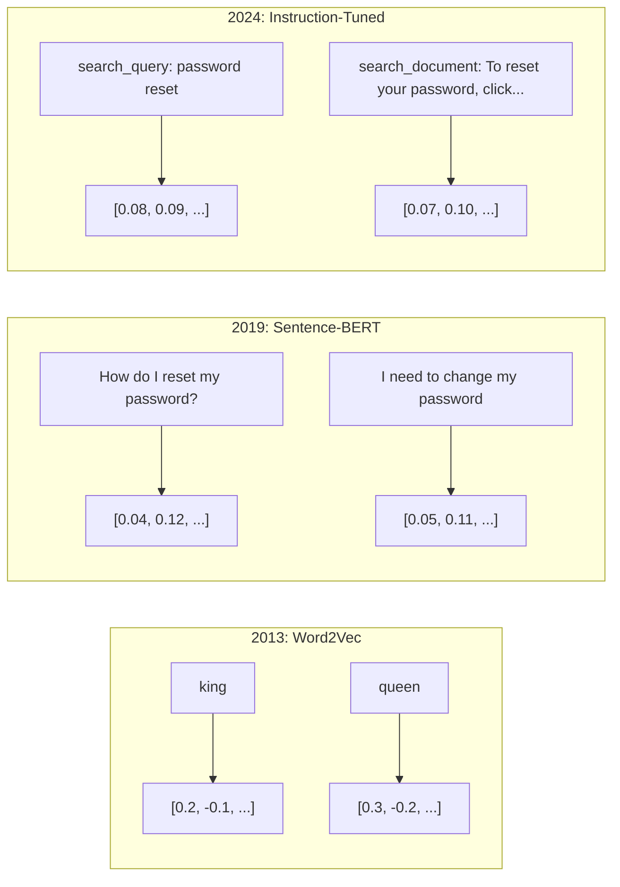
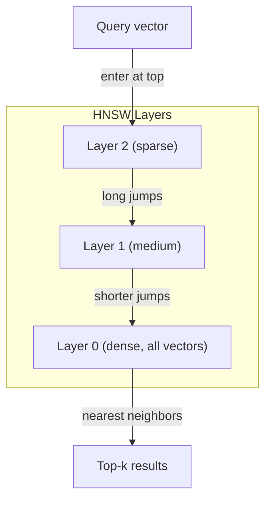

# Nhập vào và Vector biểu hiện

> 文本是离散的──数学是连续的── 每当你要求LLM 搜索相似文档、比较含义,或超越关键词进行搜索时,你都依赖于连接这两个世界的一个桥──这座桥就是嵌入──如果你不理解嵌入──你就不理解现代AI──你只是会使用它──

**Type:** Build
**Languages:** Python
**Prerequisites:** Phase 11, Lesson 01 (Prompt Engineering)
**Time:** ~75 minutes
**Related:**Giai đoạn 5 · 22 (Embedding Models Deep Dive) 涵盖 mật độ đối với hiếm và đa vector、Matryoshka 截断,以及按轴选择模型──本课聚焦生产管eline(vector DBs、HNSW、相似度数学)──在选择模型之前,请先阅读Giai đoạn 5 · 22──

## Học mục tiêu
- Sử dụng các nhà cung cấp API và mô hình mã nguồn mở 生成文本 Nhập vào,并计算 sự tương đồng giữa chúng
- 解释 tại sao Embeddings 能 giải quyết tìm kiếm từ khóa 无法处理的词汇不匹配问题
-  xây dựng một chỉ số tìm kiếm ngữ nghĩa, dựa trên ý nghĩa chứ không phải xác định keyword phù hợp để tìm kiếm tài liệu
- Sử dụng tiêu chuẩn lấy lại(precision@k、recall) đánh giá Trình tích 质量,并为你的任务选择合适的 Trình tích

## 问题
Bạn có 10.000 张支持工单――一位客户写道:我的支付没有通过. 你需要找到相似的历史工单―― Từ khóa tìm kiếm 会找到包含 支付 和 没有通过 的工单――它会漏掉 交易失败, 收费被拒绝, 和 结账错误. 这些工单用完全不同的词描述完全相同的问题──

Đó là vấn đề không phù hợp từ vựng. Trong ngôn ngữ con người có nhiều cách thể hiện cùng một điều. Tìm kiếm từ khóa.

Bạn cần một cách để làm cho sự tương đồng của bạn được quyết định bởi ý nghĩa, chứ không phải bởi chữ viết quyết định. Bạn cần một cách để trả tiền của bạn không được trả tiền và giao dịch đã bị từ chối để đặt vào một vị trí gần trong không gian toán học.

Đây là biểu hiện của việc nhúng vào.

## 概念
### Một sự nhúng nhúng là gì?

Nhúng là một vector dày đặc gồm các浮点, được sử dụng để thể hiện ý nghĩa của văn bản.

Căn nuôi ngồi trên thảm  会变成类似`[0.023, -0.041, 0.087, ..., 0.012]`Những thứ khác nhau theo mô hình, một danh sách chứa 768 đến 3072 số. Những số này mã hóa ý nghĩa. Bạn sẽ không kiểm tra chúng trực tiếp. Bạn sẽ so sánh chúng.

### Sự đột phá của Word2Vec

Năm 2013, Thomas Mikolov của Google và đồng nghiệp của ông đã xuất bản Word2Vec──核心洞见是: đào tạo một mạng thần kinh, theo một từ gần gũi, ẩn tầng trọng lượng sẽ trở thành một biểu hiện có ý nghĩa của một phương tiện truyền tải──

著名结果:

```
king - man + woman = queen
```

Đối với các chữ nhúng  tiến hành toán học vector có thể nắm bắt quan hệ ngữ nghĩa ⋅ từ man đến woman, về cơ bản tương đương với từ king đến queen ⋅ hướng ⋅ đây là thời điểm trong lĩnh vực nhận thức được những gì có thể được mã nghĩa ⋅

Word2Vec sinh ra 300 维 Vêctor── mỗi từ bất kể trên dưới văn bản như thế nào, đều chỉ có một Vêctor──Bank trong  Riverbank và Bank Account có cùng một Embedding── hạn chế này thúc đẩy nghiên cứu trong thập kỷ sau──

### Từ từ đến câu

Word Embedding biểu thị một Tokens đơn lẻ. Hệ thống sản xuất cần phải thực hiện việc Embedding cho toàn bộ câu, đoạn hoặc tài liệu.

**Averaging**:取句中所有词向量的平均值──成本低、有损,但对短文出奇地还不错──它完全丢失词序序狗咬人 和 人咬狗 会得到相同的嵌入──

**CLS token**:transformer models(BERT, 2018)输出一个特殊的 [CLS] token嵌入,表示整个输入──比平均更好,但[CLS] token là để dự đoán câu tiếp theo 训练的,不是为相似度训练的──

**Contrastive learning**:显式训练模型,把相似配对拉近,把不相似配对推远.Sentence-BERT(Reimers & Gurevych, 2019) sử dụng phương pháp này,并成为现代 Embedding models的基础.

**Instruction-tuned embeddings**:最新方法──E5 和 GTE 等模型接受任务前(search_query:、 search_document:), nói với mô hình để tạo ra bất kỳ Embedding nào──这让一个模型可以服务多个任务──



### Các mô hình nhúng hiện đại

thị trường đã nhận được một số ít các lựa chọn cấp sản xuất ]] cho đến điểm MTEB đầu năm 2026 ,MTEB v2):

| Model | Provider | Dimensions | MTEB | Context | Cost / 1M tokens |
|-------|----------|-----------|------|---------|------------------|
| Gemini Embedding 2 | Google | 3072 (Matryoshka) | 67.7 (retrieval) | 8192 | $0.15 |
| embed-v4 | Cohere | 1024 (Matryoshka) | 65.2 | 128K | $0.12 |
| voyage-4 | Voyage AI | 1024/2048 (Matryoshka) | 66.8 | 32K | $0.12 |
| text-embedding-3-large | OpenAI | 3072 (Matryoshka) | 64.6 | 8192 | $0.13 |
| text-embedding-3-small | OpenAI | 1536 (Matryoshka) | 62.3 | 8192 | $0.02 |
| BGE-M3 | BAAI | 1024 (dense+sparse+ColBERT) | 63.0 multilingual | 8192 | Open-weight |
| Qwen3-Embedding | Alibaba | 4096 (Matryoshka) | 66.9 | 32K | Open-weight |
| Nomic-embed-v2 | Nomic | 768 (Matryoshka) | 63.1 | 8192 | Open-weight |

MTEB(Massive Text Embedding Benchmark) v2 覆盖 100+ 个任务, bao gồm thu thập, phân loại, phân loại, xếp hạng lại và tổng kết.

### Métrics tương đồng

 Đưa ra hai vector nhúng, có ba cách đo chúng có nhiều điểm tương tự:

**Cosine similarity**: hai vector 之间角的余弦值──范围从 -1(相反) 到 1(方向相同)──忽略大小 Nếu một câu 10 词句和一个 500 词文档 chỉ định cùng một hướng, chúng có thể đạt được 1.0── đây là 90% của các trường hợp sử dụng tùy chọn──

```
cosine_sim(a, b) = dot(a, b) / (||a|| * ||b||)
```

**Dot product**: 2 vector: 2 vector: 2 vector: 2 vector: 2 vector: 2 vector: 2 vector: 2 vector: 2 vector: 2 vector: 2 vector: 2 vector: 2 vector: 2 vector: 2 vector: 2 vector: 2 vector: 2 vector: 2 vector: 2 vector: 2 vector: 2 vector: 2 vector: 2 vector: 2 vector: 2 vector: 2 vector: 2 vector: 2 vector: 2 vector: 2 vector: 2 vector: 2 vector: 2 vector: 2 vector: 2 vector: 2 vector: 2 vector: 2 vector: 2 vector: 2 vector: 2 vector: 2 vector: 2 vector: 2 vector: 2 vector: 2 vector: 2 vector: 2 vector: 2 vector: 2 vector: 2 vector: 2 vector: 2 vector: 2 vector: 2 vector: 2 vector: 2 vector: 2 = 1 = 1 = 1 = 1 = 1 = 1 = 1 = 1 = 1 = 1 = 1 = 1 = 1 = 1 = 1 = 1 = 1 = 1 = 1 = 1 = 1 = 1 = 1 = 1 = 1 = 1 = 1 = 1 = 1 = 1 = 1 = 1 = 1 = 1 = 1 = 1 = 1 = 1 = 1 = 1 = 1 = 1 = 1 = 1 = 1 = 1 = 1 = 1 = 1 = 1 = 1 = 1 = 1 = 1 = 1 = 1 = 1 = 1 = 1 = 1 = 1 = 1 = 1 = 1 = 1 = 1 = 1 = 1 = 1 = 1 = 1 = 1 = 1 = 1 = 1 = 1 = 1 = 1 = 1 = 1 = 1 = 1 = 1 = 1 = 1 = 1 = 1 = 1 = 1 = 1 = 1 = 1 = 1 = 1 = 1 = 1 = 1 = 1 = 1 = 1 = 1 = 1 = 1 = 1 = 1 = 1 = 1 = 1 = 1 = 1 = 1 = 1 = 1 = 1 = 1 = 1 = 1 = 1 = 1 = 1 = 1 = 1 = 1 = 1 = 1 = 1 = 1 = 1 = 1 = 1 = 1 = 1 = 1 = 1 = 1 = 1 = 1 = 1

```
dot(a, b) = sum(a_i * b_i)
```

**Euclidean (L2) distance**: Vêctor ơm đường thẳng trong không gian 越小 = 越相似── đối với sự khác biệt lớn nhỏ ⋅ vị trí tuyệt đối trong không gian quan trọng, không chỉ là hướng quan trọng khi sử dụng──

```
L2(a, b) = sqrt(sum((a_i - b_i)^2))
```

何時使用哪一种:

| Metric | Use when | Avoid when |
|--------|----------|------------|
| Cosine similarity | 比较长度不同的文本；大多数 retrieval 任务 | 大小携带信息 |
| Dot product | Embeddings 已经归一化；需要最高速度 | Vectors 大小不同 |
| Euclidean distance | Clustering；空间 nearest-neighbor 问题 | 比较长度差异巨大的文档 |

### Các cơ sở dữ liệu vector và HNSW

暴力相似度搜索将查询与每个已存储的矢量 逐一比较──当有100.000 维 矢量 时, mỗi lần truy vấn cần 15 tỷ lần nhân thêm 操作──太慢──

Các cơ sở dữ liệu vector dùng Approximate Nearest Neighbor (ANN)算法 giải quyết vấn đề này.

1.  cấu trúc một biểu đồ vector nhiều tầng
2. 顶层是稀疏的在远距离群群之间建立长距离连接
3. Dầu dưới là mật độ  giữa các vector lân cận  tạo ra kết nối nhỏ
4. Tìm kiếm từ tầng trên bắt đầu, tham lam giảm xuống và dần dần phân tích
5. 以 O(log n) 时间返回近似 top-k kết quả, thay vì O(n)

HNSW sử dụng rất ít tỷ lệ xác định mất (thường 95-99% nhớ lại) để thay đổi tốc độ tăng lên rất lớn.



生产选项:

| Database | Type | Best for | Max scale |
|----------|------|----------|-----------|
| Pinecone | Managed SaaS | 零运维生产环境 | Billions |
| Weaviate | Open source | 自托管、hybrid search | 100M+ |
| Qdrant | Open source | 高性能、过滤 | 100M+ |
| ChromaDB | Embedded | 原型开发、本地开发 | 1M |
| pgvector | Postgres extension | 已经使用 Postgres | 10M |
| FAISS | Library | 进程内、研究 | 1B+ |

### Các chiến lược làm cho các mảnh vỡ

文档太长,不能作为单个矢量 进行嵌入──一个50页 PDF 覆盖几十主题它的嵌入会变成所有内容的平均值,结果不像任何具体内容──你要把文档切成块,并对每块做嵌入──

**Fixed-size chunking**Mỗi N 个 token 切分一次,并带 M-token chồng chéo──简单且可预测──当文档没有清晰结构时效果很好──一个 512 token 带 50 token chồng chéo:chunk 1 là token 0-511,chunk 2 là token 462-973──

**Sentence-based chunking**Trong câu giới hạn cắt, sẽ phân nhóm câu cho đến khi đạt đến giới hạn token. Mỗi phần ít nhất là một câu hoàn chỉnh.

**Recursive chunking**: First try in最大边界处分割(headers section) ―― Nếu vẫn quá lớn, hãy thử lại giới hạn đoạn văn―― rồi là giới hạn câu――最后是字符 giới hạn――这就是LangChain的`RecursiveCharacterTextSplitter`, hiệu quả tốt cho các cơ thể dạng hỗn hợp.

**Semantic chunking**: Làm Nhập vào mỗi câu, rồi đưa Nhập vào tương tự như các chuỗi câu phân组。 Khi Nhập giống nhau 低于某个值时, bắt đầu một phần mới。 chi phí cao。 cần phải làm Nhập riêng cho mỗi câu, nhưng có thể tạo ra các phần liên tục nhất。

| Strategy | Complexity | Quality | Best for |
|----------|-----------|---------|----------|
| Fixed-size | Low | Decent | 非结构化文本、logs |
| Sentence-based | Low | Good | 文章、emails |
| Recursive | Medium | Good | Markdown、HTML、mixed docs |
| Semantic | High | Best | 对 retrieval 质量要求关键的场景 |

大多数系统的甜点区间: 256-512 token chunks, với 50 token chồng chéo

### Bi-Encoders và Cross-Encoders so với

Bi-encoder 会独立对查询 和文档做嵌入,然后比较向量――速度快你只需要对查询做一次嵌入,然后与预先计算好的文档嵌入比较――这是检索使用方式――

Cross-encoder sẽ xem truy vấn và một tài liệu như một nhập nhập đơn,并输出 điểm liên quan.

生产模式是: bi-encoder 检索 top-100 ứng cử viên, cross-encoder sẽ xếp hạng lại lên top-10...


Các mô hình xếp hạng:Cohere Renank 3.5(每1000次查询 $2)  BGE-renanker-v2(免费,open source)  Jina Renanker v2(免费,open source) 

### Matryoshka Embedded

传统嵌入式是全有或全无──一个1536维向量 使用1536 floats──你不能在不重新训练的情况下截断到 256维──

Matryoshka Representation Learning ((Kusupati et al., 2022) đã sửa chữa vấn đề này. Mô hình được đào tạo để tạo ra các thông tin quan trọng nhất, giống như một bộ máy của Nga.

OpenAI của văn bản-đã-năm-3-chúng 和 văn bản-đã-năm-3-lớn 通过`dimensions`参数支持 Matryoshka 截断──请求 256 维 thay vì 1536 维, lưu trữ giảm 6 lần, trên MTEB benchmarks 上准确率约损失 3-5%──

### Quantization Binary

Một 1536 维 nhúng vào E float32  lưu trữ cần 6.144 字节──乘以 1000.000 文档: chỉ cần vectors cần 61 GB──

Binary quantization Đặt mỗi float 转 thành một bit:正值变成1,负值变成0── lưu trữ từ 6,144 字节降至192 字节减少32 倍──相似度使用 Hamming distance(统计不同位数)计算, CPU có thể sử dụng đơn条命令完成──

Tỷ lệ xác thực của việc thu hồi được ảnh hưởng đến khoảng 5-10%. Mô hình phổ biến là: trước tiên sử dụng định lượng nhị phân trong hàng triệu vector để tìm kiếm vòng đầu tiên, sau đó sử dụng các vector chính xác đầy đủ cho top-1000 重新打分.


```figure
cosine-similarity
```

##  xây dựng nó
Chúng tôi bắt đầu xây dựng một công cụ tìm kiếm ngữ nghĩa không sử dụng cơ sở dữ liệu vector không sử dụng API bên ngoài nhúng chỉ sử dụng Python và numpy làm toán học

### 步骤 1: Text Chunking

```python
def chunk_text(text, chunk_size=200, overlap=50):
    words = text.split()
    chunks = []
    start = 0
    while start < len(words):
        end = start + chunk_size
        chunk = " ".join(words[start:end])
        chunks.append(chunk)
        start += chunk_size - overlap
    return chunks


def chunk_by_sentences(text, max_chunk_tokens=200):
    sentences = text.replace("\n", " ").split(".")
    sentences = [s.strip() + "." for s in sentences if s.strip()]
    chunks = []
    current_chunk = []
    current_length = 0
    for sentence in sentences:
        sentence_length = len(sentence.split())
        if current_length + sentence_length > max_chunk_tokens and current_chunk:
            chunks.append(" ".join(current_chunk))
            current_chunk = []
            current_length = 0
        current_chunk.append(sentence)
        current_length += sentence_length
    if current_chunk:
        chunks.append(" ".join(current_chunk))
    return chunks
```

### 步骤 2: Xây dựng Nhập từ đầu

Chúng tôi sử dụng TF-IDF và L2 bình thường hóa để thực hiện một sự nhúng dày đặc đơn giản. Đây không phải là nhúng thần kinh, nhưng nó theo cùng một hiệp ước: nhập text,输出 cố định kích thước của vector, tương tự text tạo ra tương tự vector.

```python
import math
import numpy as np
from collections import Counter

class SimpleEmbedder:
    def __init__(self):
        self.vocab = []
        self.idf = []
        self.word_to_idx = {}

    def fit(self, documents):
        vocab_set = set()
        for doc in documents:
            vocab_set.update(doc.lower().split())
        self.vocab = sorted(vocab_set)
        self.word_to_idx = {w: i for i, w in enumerate(self.vocab)}
        n = len(documents)
        self.idf = np.zeros(len(self.vocab))
        for i, word in enumerate(self.vocab):
            doc_count = sum(1 for doc in documents if word in doc.lower().split())
            self.idf[i] = math.log((n + 1) / (doc_count + 1)) + 1

    def embed(self, text):
        words = text.lower().split()
        count = Counter(words)
        total = len(words) if words else 1
        vec = np.zeros(len(self.vocab))
        for word, freq in count.items():
            if word in self.word_to_idx:
                tf = freq / total
                vec[self.word_to_idx[word]] = tf * self.idf[self.word_to_idx[word]]
        norm = np.linalg.norm(vec)
        if norm > 0:
            vec = vec / norm
        return vec
```

### 步骤 3: Các chức năng tương tự

```python
def cosine_similarity(a, b):
    dot = np.dot(a, b)
    norm_a = np.linalg.norm(a)
    norm_b = np.linalg.norm(b)
    if norm_a == 0 or norm_b == 0:
        return 0.0
    return float(dot / (norm_a * norm_b))


def dot_product(a, b):
    return float(np.dot(a, b))


def euclidean_distance(a, b):
    return float(np.linalg.norm(a - b))
```

### 步骤 4: Chỉ số vector với Brute-Force Search

```python
class VectorIndex:
    def __init__(self):
        self.vectors = []
        self.texts = []
        self.metadata = []

    def add(self, vector, text, meta=None):
        self.vectors.append(vector)
        self.texts.append(text)
        self.metadata.append(meta or {})

    def search(self, query_vector, top_k=5, metric="cosine"):
        scores = []
        for i, vec in enumerate(self.vectors):
            if metric == "cosine":
                score = cosine_similarity(query_vector, vec)
            elif metric == "dot":
                score = dot_product(query_vector, vec)
            elif metric == "euclidean":
                score = -euclidean_distance(query_vector, vec)
            else:
                raise ValueError(f"Unknown metric: {metric}")
            scores.append((i, score))
        scores.sort(key=lambda x: x[1], reverse=True)
        results = []
        for idx, score in scores[:top_k]:
            results.append({
                "text": self.texts[idx],
                "score": score,
                "metadata": self.metadata[idx],
                "index": idx
            })
        return results

    def size(self):
        return len(self.vectors)
```

### 步骤 5: Máy tìm kiếm ngữ nghĩa

```python
class SemanticSearchEngine:
    def __init__(self, chunk_size=200, overlap=50):
        self.embedder = SimpleEmbedder()
        self.index = VectorIndex()
        self.chunk_size = chunk_size
        self.overlap = overlap

    def index_documents(self, documents, source_names=None):
        all_chunks = []
        all_sources = []
        for i, doc in enumerate(documents):
            chunks = chunk_text(doc, self.chunk_size, self.overlap)
            all_chunks.extend(chunks)
            name = source_names[i] if source_names else f"doc_{i}"
            all_sources.extend([name] * len(chunks))
        self.embedder.fit(all_chunks)
        for chunk, source in zip(all_chunks, all_sources):
            vec = self.embedder.embed(chunk)
            self.index.add(vec, chunk, {"source": source})
        return len(all_chunks)

    def search(self, query, top_k=5, metric="cosine"):
        query_vec = self.embedder.embed(query)
        return self.index.search(query_vec, top_k, metric)

    def search_with_scores(self, query, top_k=5):
        results = self.search(query, top_k)
        return [
            {
                "text": r["text"][:200],
                "source": r["metadata"].get("source", "unknown"),
                "score": round(r["score"], 4)
            }
            for r in results
        ]
```

### 步骤 6: So sánh các métrics tương tự

```python
def compare_metrics(engine, query, top_k=3):
    results = {}
    for metric in ["cosine", "dot", "euclidean"]:
        hits = engine.search(query, top_k=top_k, metric=metric)
        results[metric] = [
            {"score": round(h["score"], 4), "preview": h["text"][:80]}
            for h in hits
        ]
    return results
```

## Sử dụng nó
Sử dụng sản xuất nhúng API 时,架构保持一致.

```python
from openai import OpenAI

client = OpenAI()

def openai_embed(texts, model="text-embedding-3-small", dimensions=None):
    kwargs = {"model": model, "input": texts}
    if dimensions:
        kwargs["dimensions"] = dimensions
    response = client.embeddings.create(**kwargs)
    return [item.embedding for item in response.data]
```

Sử dụng OpenAI của Matryoshka 截断 cùng một mô hình, hơn kích thước, lưu trữ thấp hơn:

```python
full = openai_embed(["semantic search query"], dimensions=1536)
compact = openai_embed(["semantic search query"], dimensions=256)
```

256-d Vector sử dụng lưu trữ giảm 6 lần. Đối với 1000.000 tài liệu, đó là 10 GB so với 61 GB.

Sử dụng Cohere  thực hiện xếp hạng lại:

```python
import cohere

co = cohere.ClientV2()

results = co.rerank(
    model="rerank-v3.5",
    query="What is the refund policy?",
    documents=["Full refund within 30 days...", "No refunds after 90 days..."],
    top_n=3
)
```

Sử dụng bản địa nhúng, không phụ thuộc vào API:

```python
from sentence_transformers import SentenceTransformer

model = SentenceTransformer("BAAI/bge-small-en-v1.5")
embeddings = model.encode(["semantic search query", "another document"])
```

Chúng tôi xây dựng lớp VectorIndex có thể kết hợp với các giải pháp tùy chọn này sử dụng, thay thế chức năng nhúng, giữ lại logic tìm kiếm.

## 交付 nó
本课产 出:
- `outputs/prompt-embedding-advisor.md` Một sử dụng cho các trường hợp cụ thể chọn Nhập các mô hình và các chiến lược
- `outputs/skill-embedding-patterns.md` một giáo sư đại lý  làm thế nào để sử dụng hiệu quả trong sản xuất Embeddings kỹ năng

## 练习
1. **Metric comparison**: sử dụng sự tương đồng cosine、 điểm sản phẩm 和 Euclidean khoảng cách, đối với các tài liệu mẫu 运行 cùng 5 个查询――记录每种方法的 top-3 kết quả―― những câu hỏi trên những số liệu này không phù hợp? Tại sao?

2. **Chunk size experiment**: sử dụng 50、100、200 和 500 từ kích thước phần 索引 mẫu tài liệu。 đối với mỗi thiết lập vận hành 5 truy vấn,并 ghi điểm tương đồng hàng đầu-1, vẽ kích thước phần 之间的关系── tìm thấy các phần lớn hơn  bắt đầu tạo ra tác động tiêu cực điểm。

3. **Matryoshka simulation**: xây dựng một đơn giảnEmbedder sẽ tạo ra 500-d Vectors ∞ cắt đến 50、100、200 和 500 维── đo mỗi loại cắt giảm ∞ nhớ lấy lại ∞ giảm ∞∞.

4. **Binary quantization**: lấy các nhúng trong công cụ tìm kiếm, sẽ chuyển chúng thành nhị phân(正数为1,负数为0),并实现 Hamming distance search──将 top-10 kết quả với sự tương đồng chính xác của cosine hoàn toàn比较──衡量重叠百分比──

5. **Sentence-based chunking**:用 `chunk_by_sentences`替代固体尺寸 chunking──运行相同查询并比较检索分──尊重句子边界是否改善结果?

## 关键术语
| Term | What people say | What it actually means |
|------|----------------|----------------------|
| Embedding | “文本到数字” | 一种 dense Vector，其中几何接近性编码语义相似性 |
| Word2Vec | “最早的经典 Embedding” | 2013 年通过预测上下文词学习 word vectors 的模型；证明 Vector arithmetic 可以编码含义 |
| Cosine similarity | “两个 Vectors 有多相似” | Vectors 夹角的余弦值；1 = 方向相同，0 = 正交，-1 = 相反 |
| HNSW | “快速 Vector search” | Hierarchical Navigable Small World graph——一种多层结构，可实现 O(log n) 的 approximate nearest neighbor search |
| Bi-encoder | “分开 Embedding，快速比较” | 将 query 和 document 独立编码为 Vectors；支持预计算和快速 retrieval |
| Cross-encoder | “慢但准确的 reranker” | 让 query-document pair 联合通过完整模型处理；准确率更高，但无法预计算 |
| Matryoshka embeddings | “可截断的 Vectors” | 经过训练的 Embeddings，使前 N 个维度捕捉最重要的信息，从而支持可变大小存储 |
| Binary quantization | “1-bit embeddings” | 将 float vectors 转换为 binary（仅保留 sign bit），通过 Hamming distance search 实现 32 倍存储减少 |
| Chunking | “为 Embedding 拆分文档” | 将文档拆成 256-512 token 片段，使每个片段都可以独立 Embedding 和检索 |
| Vector database | “Embeddings 的搜索引擎” | 为存储 Vectors 并在规模化场景下执行 approximate nearest neighbor search 而优化的数据存储 |
| Contrastive learning | “通过比较训练” | 一种训练方法，把相似配对的 Embeddings 拉近，把不相似配对的 Embeddings 推远 |
| MTEB | “Embedding benchmark” | Massive Text Embedding Benchmark——覆盖 8 类任务的 56 个数据集；用于比较 Embedding models 的标准 |

## 延伸阅读
- Mikolov et al., "Sự ước tính hiệu quả của biểu diễn từ trong không gian vector" (2013) Word2Vec 论文, thông qua vua-nữ hoàng 类比开启了嵌入 革命
- Reimers & Gurevych, "Sentence-BERT: Sentence Embeddings using Siamese BERT-Networks" (2019) how to train用于句子级相似度的双编码器,现代 Embedding models 的基础
- Kusupati et al., "Matryoshka Representation Learning" (2022) 可变维度 Embeddings 背后的技术,OpenAI trong văn bản-embedding-3 đã sử dụng nó
- Malkov & Yashunin, "Thông hiệu quả và mạnh mẽ Phương gần hàng xóm gần nhất sử dụng Hình đồ thế giới nhỏ di chuyển theo cấp bậc" (2018) HNSW 论文,多数生产 Vector search 背后的算法
- OpenAI Embeddings Guide (platform.openai.com/docs/guides/embeddings) text-embedding-3 mô hình 实用参考,包括Matryoshka 维度缩减
- MTEB Leaderboard (huggingface.co/spaces/mteb/leaderboard) 实时基准,用于比较所有嵌入式模型 在不同任务和语言上的表现
- [Muennighoff et al., "MTEB: Massive Text Embedding Benchmark" (EACL 2023)](https://arxiv.org/abs/2210.07316) định nghĩa 8 类任务(luật hạng, phân loại, phân loại cặp, xếp hạng lại, lấy lại, tổng kết, khai thác nội dung) của benchmark,leaderboard 会报告这些类别;
- [Sentence Transformers documentation](https://www.sbert.net/)bi-encoder vs cross-encoder, các chiến lược tập hợp, cũng như quyền lực của việc thực hiện đường ống dẫn RAG chứa-căn-chồng-khả-khả-khả-khả-khả-khả-khả-khả-khả-khả-khả-khả-khả-khả-khả-khả-khả-khả-khả-khả-khả-khả-khả-khả-khả-khả-khả-khả-khả-khả-khả-khả-khả-khả-khả-khả-khả-khả-khả-khả-khả-khả-khả-khả-khả-khả-khả-khả-khả-khả-khả-khả-khả-khả-khả-khả-khả-khả-khả-khả-khả-khả-khả-khả-khả-khả-khả-khả-khả-khả-khả-khả-khả-khả-khả-khả-khả-khả-khả-khả-khả-khả-khả-khả-khả-khả-khả-khả-khả-khả-khả-khả-khả-khả-khả-khả-khả-khả-khả-khả-khả-khả-khả-khả-khả-khả-khả-khả-khả-khả-khả-khả-khả-khả-khả-khả-khả-khả-khả-khả-khả-khả-khả-khả-khả-khả-khả-khả-khả-khả-khả-khả-khả-khả-khả-khả-khả-khả-khả-khả-khả-khả-khả-khả-khả-khả-khả-khả-khả-khả-khả-khả-khả-kh-kh-kh-kh-kh-kh-
