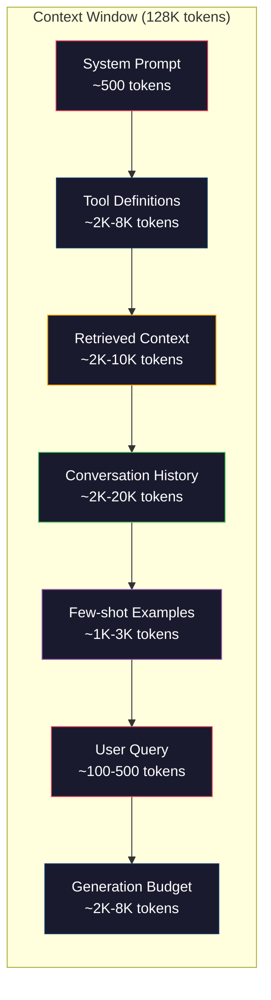
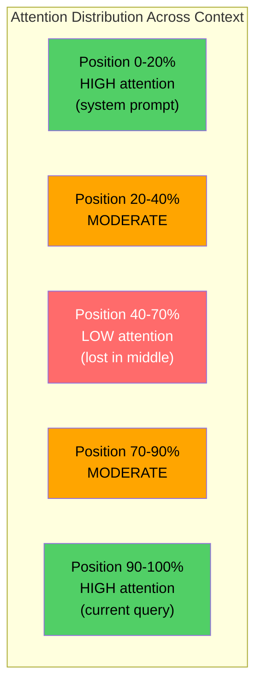
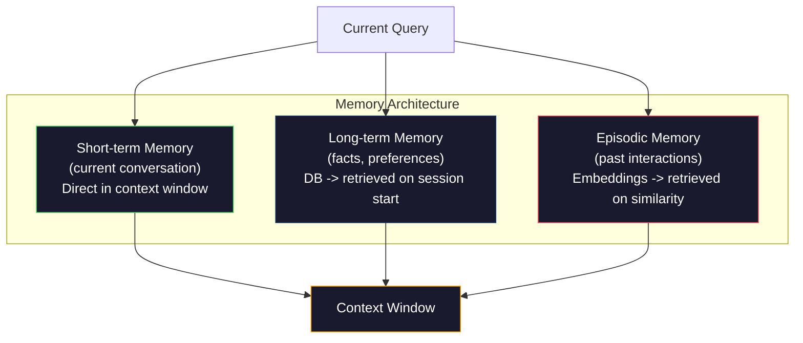

# Kỹ thuật ngữ cảnh: cửa sổ, ngân sách, bộ nhớ và tìm kiếm

> Kỹ thuật nhanh là một tập hợp. Kỹ thuật ngữ cảnh là toàn cảnh. Kỹ thuật ngữ nhanh là một phần của một chuỗi. Kỹ thuật ngữ nhanh là một phần của một cửa sổ mô hình. Kỹ thuật nhanh là tất cả nội dung của cửa sổ mô hình: hướng dẫn hệ thống, tài liệu được lấy lại, định nghĩa công cụ, lịch sử trò chuyện, vài ví dụ, cũng như bản thân nhanh. Kỹ thuật AI xuất sắc nhất năm 2026 là kỹ sư ngữ cảnh. Họ quyết định những gì để vào, những gì để bên ngoài, và theo thứ tự để vào.

**类型：**Xây dựng
**语言：**Python
**前置要求：**Giai đoạn 10 ((LLM từ đầu)  Giai đoạn 11 Bài học 01-02
**时间：**约90分钟
**相关：**Giai đoạn 11 · 15(Tầm cache nhanh)  Layout thân thiện với cache là kỹ thuật ngữ của延伸──Giai đoạn 5 · 28(Tầm kết dài đánh giá)讲解如何使用NIAH/RULER 衡量 lost-in-the-middle──

## Học mục tiêu

- 计算所有 ngữ cảnh cửa sổ 组件的 Token 预算( hệ thống prompt, công cụ, lịch sử, thu thập tài liệu, phòng đầu thế hệ)
- 实现 context window 管理策略:截断、摘要, cũng như dùng để trượt cửa sổ lịch sử cuộc trò chuyện
- Để phân loại và sắp xếp ưu tiên đối với các thành phần ngữ cảnh, để sự chú ý của mô hình tập trung tối đa vào thông tin liên quan nhất
- Construct a context assembler, according to query  type và có thể dùng cửa sổ không gian động thái phân phối token

## 问题

Claude Opus 4.7 có 200K Token  cửa sổ(beta trung bình là 1M) ――GPT-5 có 400K。Gemini 3 Pro có 2M。Llama 4 声称 có 10M。 Những con số này nghe có vẻ rất lớn, cho đến khi bạn thực sự thực hiện chúng.

下面是一个编码助手的真实拆分──System prompt:500 Token──50 个工具的工具的定义:8,000 Token──检索文件:4,000 Token──对话史(10轮):6,000 Token──当前用户查询:200 Token──生成预算(最大输出):4,000 Token──总计:22,700 Token──这只占 128K 窗口的18%──

Nhưng sự chú ý không phải là theo chiều dài ngữ cảnh 线性扩展―― có mô hình ngữ cảnh mã thông báo 128K phải trả giá 2 lần chú ý 成本(n^2), mặc dù hầu hết các mô hình sản xuất sử dụng hiệu quả cao (Cơ quan 变体)  Quan trọng hơn,Tăng tốc độ xác thực sẽ giảm đi――Nước trong một thử nghiệm Haystack cho thấy, mô hình rất khó tìm thấy được đặt trong ngữ cảnh dài.

实际教训是:可用200K Token并非意味着使用200K Token 就有效──精心选的10K Token context 往往胜过直接倾倒的100K Token context──文本工程是在文本窗口内最大化信号-噪音比的学科──

Bạn đặt vào mỗi token cửa sổ, bạn sẽ trọn ra một token khác có thể mang lại thông tin liên quan hơn. Mỗi định nghĩa công cụ không liên quan, mỗi vòng trò chuyện đã qua, mỗi đoạn không thể trả lời được câu hỏi, bạn sẽ làm cho mô hình hoạt động khác biệt trong nhiệm vụ.

## 概念

### Context Window là tài nguyên thiếu hụt

Hãy nghĩ về cửa sổ ngữ cảnh như RAM, chứ không phải đĩa đĩa. Nó rất nhanh, có thể truy cập trực tiếp, nhưng dung lượng hạn chế. Bạn không thể bỏ tất cả nội dung. Bạn phải chọn.



Mỗi bộ phận đều đang tranh giành không gian. Đưa thêm nhiều định nghĩa công cụ có nghĩa là không gian trong lịch sử trò chuyện thay đổi ít hơn. Đưa thêm nhiều bối cảnh được lấy lại có nghĩa là không gian thay đổi ít hơn.

### - Đúng rồi.

Đây là kinh nghiệm quan trọng nhất trong kỹ thuật ngữ cảnh tìm thấy. mô hình sẽ tập trung tốt hơn vào ngữ cảnh thông tin đầu và cuối. thông tin giữa nhận được sự chú ý ít hơn, cũng dễ bị bỏ qua hơn.

Liu et al. ((2023) đã tiến hành một thử nghiệm hệ thống. Họ đặt một tài liệu liên quan ở vị trí khác nhau giữa 20 tài liệu không liên quan, và đo lường tỷ lệ xác thực của câu trả lời.

Điều này sẽ ảnh hưởng trực tiếp đến thiết kế kỹ thuật:

- Đặt thông tin quan trọng nhất lên phía trước nhất.
- Đặt truy vấn hiện tại và ngữ cảnh liên quan nhất  đặt cuối cùng
- Đặt bối cảnh trung trong như là khu vực ưu tiên thấp nhất
- Nếu cần phải đặt thông tin ở giữa, thì hãy ở cuối cùng.



### Context 组件

**System prompt**: thiết lập persona、约束和行为规则── nó được đặt ở phía trước nhất, và trong nhiều vòng giữ nguyên không thay đổi──Claude Code của hệ thống nhanh chóng bao gồm các định nghĩa công cụ và hướng dẫn hành vi, sử dụng khoảng 6.000 Token── giữ紧──System prompt trong mỗi từ sẽ xuất hiện trong mỗi lần API 调用──

**Tool definitions**: mỗi công cụ sẽ tăng 50-200 Token (tên, mô tả, quy trình tham số) ⋅ 50 công cụ ⋅ mỗi 150 Token, trước khi có cuộc trò chuyện xảy ra là 7.500 Token ⋅ Sự lựa chọn công cụ động, chỉ chứa các công cụ liên quan đến truy vấn hiện tại, có thể giảm 60-80% ⋅

**Retrieved context**Từ dữ liệu dữ liệu Vector: từ tài liệu của cơ sở dữ liệu Vector, kết quả tìm kiếm, nội dung tệp.

**Conversation history**: Mỗi bài trước của người dùng và phản hồi trợ lý. Nó sẽ theo chiều dài cuộc trò chuyện.

**Few-shot examples**: hiển thị đầu vào/phản xuất hành vi mong đợi đối với hai đến ba ví dụ chọn lọc tinh tế, thường là hơn hàng ngàn lệnh của token 更能提升输出质量── nhưng chúng sẽ chiếm không gian──

**Generation budget**Nếu bạn đặt cửa sổ đầy,模型就没有空间回答――至少为代代 预留 2,000-4,000 Token──

### Context Compression 策略

**History summarization**:不再逐字保留所有前轮对话,而是定期总结对话――用100 Token表达 Chúng tôi đã thảo luận X, quyết định Y, và người dùng muốn Z, có thể thay thế chiếm lấy 2000 Token của 10 轮对话――当历史 超过值(例如 5,000 Token)时运行总结――

**Relevance filtering**Theo truy vấn hiện tại 给每一个检索的文件 打分,并丢弃低于值的文档── Nếu bạn đã thu thập 已 10 块, nhưng chỉ có 3 块 liên quan, bạn sẽ bỏ đi thêm 7 个──3 个高度相关的块 胜过 10 个平的块──

**Tool pruning**: 分类用户的查询意图,只包含与该意图相关的工具──代码问题不需要日历工具──排期问题不需要文件系统工具──这可以把工具定义从8,000 Token 降至1,000──

**Recursive summarization**Đối với tài liệu dài, phân đoạn trích đoạn. Trước hết, mỗi phần, lại trích đoạn. Một tài liệu dài 50 trang sẽ trở thành một bản ghi 500 token, đồng thời nắm bắt các điểm quan trọng.

### Hệ thống bộ nhớ

Kỹ thuật ngữ 跨越三个时间尺度──

**Short-term memory**:当前对话──直接存储在文本窗口 中──随着每轮对话增长──通过总结和缩写 管理──

**Long-term memory**:跨对话 持久存在的事实和偏好── Người dùng thích TypeScript.  Dự án sử dụng PostgreSQL. 存储在数据库, và bắt đầu phiên 时 lấy lại──Claude Code Đặt nó trong CLAUDE.md 文件中──ChatGPT Đặt nó trong tính năng bộ nhớ 中──

**Episodic memory**Có thể liên quan đến cụ thể quá khứ交互── Thứ Ba vừa qua, chúng tôi đã gỡ lỗi một vấn đề tương tự trong mô-đun tác giả. 作为 Embeddings 存储,并在当前对话匹配某个过去节目 时恢复──



### Phong trào kết nối động lực

关键洞察: khác nhau truy vấn 需要不同背景──静态系统提示 + 静态工具 + 静态历史 很浪费──最好的系统会为每个 truy vấn 动态组装背景──

1. 分类 ý định truy vấn
2. 选择相关工具(không phải tất cả các công cụ)
3. Khám phá  liên quan tài liệu(không phải tập hợp cố định)
4. 包含相关历史转(不是全部历史)
5. 添加与任务类型 匹配的几个镜头例
6. 按重要性排序所有内容:关键的放最前,重要放最后,可选的放中间

Đây chính là sự phân biệt giữa ứng dụng AI tốt đẹp và ứng dụng AI xuất sắc. Mô hình là giống nhau.


```figure
lost-in-the-middle
```

##  xây dựng nó

### 步骤 1: Đám số

Bạn không thể làm ngân sách cho những thứ không thể đo lường được.

```python
import json
import numpy as np
from collections import OrderedDict

def count_tokens(text):
    if not text:
        return 0
    return int(len(text.split()) * 1.3)

def count_tokens_json(obj):
    return count_tokens(json.dumps(obj))
```

### 步骤 2: Quản lý ngân sách ngữ cảnh

核心抽象──预算 quản lý 会 theo dõi từng bộ phận đã sử dụng bao nhiêu mã thông báo,并强制执行限制──

```python
class ContextBudget:
    def __init__(self, max_tokens=128000, generation_reserve=4000):
        self.max_tokens = max_tokens
        self.generation_reserve = generation_reserve
        self.available = max_tokens - generation_reserve
        self.allocations = OrderedDict()

    def allocate(self, component, content, max_tokens=None):
        tokens = count_tokens(content)
        if max_tokens and tokens > max_tokens:
            words = content.split()
            target_words = int(max_tokens / 1.3)
            content = " ".join(words[:target_words])
            tokens = count_tokens(content)

        used = sum(self.allocations.values())
        if used + tokens > self.available:
            allowed = self.available - used
            if allowed <= 0:
                return None, 0
            words = content.split()
            target_words = int(allowed / 1.3)
            content = " ".join(words[:target_words])
            tokens = count_tokens(content)

        self.allocations[component] = tokens
        return content, tokens

    def remaining(self):
        used = sum(self.allocations.values())
        return self.available - used

    def utilization(self):
        used = sum(self.allocations.values())
        return used / self.max_tokens

    def report(self):
        total_used = sum(self.allocations.values())
        lines = []
        lines.append(f"Context Budget Report ({self.max_tokens:,} token window)")
        lines.append("-" * 50)
        for component, tokens in self.allocations.items():
            pct = tokens / self.max_tokens * 100
            bar = "#" * int(pct / 2)
            lines.append(f"  {component:<25} {tokens:>6} tokens ({pct:>5.1f}%) {bar}")
        lines.append("-" * 50)
        lines.append(f"  {'Used':<25} {total_used:>6} tokens ({total_used/self.max_tokens*100:.1f}%)")
        lines.append(f"  {'Generation reserve':<25} {self.generation_reserve:>6} tokens")
        lines.append(f"  {'Remaining':<25} {self.remaining():>6} tokens")
        return "\n".join(lines)
```

### 步骤 3:Lost-in-the-Middle Reordering

实现重排策略: những điều quan trọng nhất  đặt trước nhất và cuối cùng, những điều không quan trọng nhất đặt giữa.

```python
def reorder_lost_in_middle(items, scores):
    paired = sorted(zip(scores, items), reverse=True)
    sorted_items = [item for _, item in paired]

    if len(sorted_items) <= 2:
        return sorted_items

    first_half = sorted_items[::2]
    second_half = sorted_items[1::2]
    second_half.reverse()

    return first_half + second_half

def score_relevance(query, documents):
    query_words = set(query.lower().split())
    scores = []
    for doc in documents:
        doc_words = set(doc.lower().split())
        if not query_words:
            scores.append(0.0)
            continue
        overlap = len(query_words & doc_words) / len(query_words)
        scores.append(round(overlap, 3))
    return scores
```

### 步骤 4:Conversation History Compressor

总结旧的对话转,以回收 Điểm 预算。

```python
class ConversationManager:
    def __init__(self, max_history_tokens=5000):
        self.turns = []
        self.summaries = []
        self.max_history_tokens = max_history_tokens

    def add_turn(self, role, content):
        self.turns.append({"role": role, "content": content})
        self._compress_if_needed()

    def _compress_if_needed(self):
        total = sum(count_tokens(t["content"]) for t in self.turns)
        if total <= self.max_history_tokens:
            return

        while total > self.max_history_tokens and len(self.turns) > 4:
            old_turns = self.turns[:2]
            summary = self._summarize_turns(old_turns)
            self.summaries.append(summary)
            self.turns = self.turns[2:]
            total = sum(count_tokens(t["content"]) for t in self.turns)

    def _summarize_turns(self, turns):
        parts = []
        for t in turns:
            content = t["content"]
            if len(content) > 100:
                content = content[:100] + "..."
            parts.append(f"{t['role']}: {content}")
        return "Previous: " + " | ".join(parts)

    def get_context(self):
        parts = []
        if self.summaries:
            parts.append("[Conversation Summary]")
            for s in self.summaries:
                parts.append(s)
        parts.append("[Recent Conversation]")
        for t in self.turns:
            parts.append(f"{t['role']}: {t['content']}")
        return "\n".join(parts)

    def token_count(self):
        return count_tokens(self.get_context())
```

### 步骤 5: Dòng chọn công cụ động lực

Chỉ chứa các công cụ liên quan đến truy vấn hiện tại.

```python
TOOL_REGISTRY = {
    "read_file": {
        "description": "Read contents of a file",
        "tokens": 120,
        "categories": ["code", "files"],
    },
    "write_file": {
        "description": "Write content to a file",
        "tokens": 150,
        "categories": ["code", "files"],
    },
    "search_code": {
        "description": "Search for patterns in codebase",
        "tokens": 130,
        "categories": ["code"],
    },
    "run_command": {
        "description": "Execute a shell command",
        "tokens": 140,
        "categories": ["code", "system"],
    },
    "create_calendar_event": {
        "description": "Create a new calendar event",
        "tokens": 180,
        "categories": ["calendar"],
    },
    "list_emails": {
        "description": "List recent emails",
        "tokens": 160,
        "categories": ["email"],
    },
    "send_email": {
        "description": "Send an email message",
        "tokens": 200,
        "categories": ["email"],
    },
    "web_search": {
        "description": "Search the web for information",
        "tokens": 140,
        "categories": ["research"],
    },
    "query_database": {
        "description": "Run a SQL query on the database",
        "tokens": 170,
        "categories": ["code", "data"],
    },
    "generate_chart": {
        "description": "Generate a chart from data",
        "tokens": 190,
        "categories": ["data", "visualization"],
    },
}

def classify_intent(query):
    query_lower = query.lower()

    intent_keywords = {
        "code": ["code", "function", "bug", "error", "file", "implement", "refactor", "debug", "test"],
        "calendar": ["meeting", "schedule", "calendar", "appointment", "event"],
        "email": ["email", "mail", "send", "inbox", "message"],
        "research": ["search", "find", "what is", "how does", "explain", "look up"],
        "data": ["data", "query", "database", "chart", "graph", "analytics", "sql"],
    }

    scores = {}
    for intent, keywords in intent_keywords.items():
        score = sum(1 for kw in keywords if kw in query_lower)
        if score > 0:
            scores[intent] = score

    if not scores:
        return ["code"]

    max_score = max(scores.values())
    return [intent for intent, score in scores.items() if score >= max_score * 0.5]

def select_tools(query, token_budget=2000):
    intents = classify_intent(query)
    relevant = {}
    total_tokens = 0

    for name, tool in TOOL_REGISTRY.items():
        if any(cat in intents for cat in tool["categories"]):
            if total_tokens + tool["tokens"] <= token_budget:
                relevant[name] = tool
                total_tokens += tool["tokens"]

    return relevant, total_tokens
```

### 步骤 6: hoàn chỉnh dòng ống máy tập hợp ngữ cảnh

Hãy kết nối tất cả các phần. Đặt ra một truy vấn, động thái, cấu trúc.

```python
class ContextEngine:
    def __init__(self, max_tokens=128000, generation_reserve=4000):
        self.budget = ContextBudget(max_tokens, generation_reserve)
        self.conversation = ConversationManager(max_history_tokens=5000)
        self.system_prompt = (
            "You are a helpful AI assistant. You have access to tools for "
            "code editing, file management, web search, and data analysis. "
            "Use the appropriate tools for each task. Be concise and accurate."
        )
        self.knowledge_base = [
            "Python 3.12 introduced type parameter syntax for generic classes using bracket notation.",
            "The project uses PostgreSQL 16 with pgvector for embedding storage.",
            "Authentication is handled by Supabase Auth with JWT tokens.",
            "The frontend is built with Next.js 15 using the App Router.",
            "API rate limits are set to 100 requests per minute per user.",
            "The deployment pipeline uses GitHub Actions with Docker multi-stage builds.",
            "Test coverage must be above 80% for all new modules.",
            "The codebase follows the repository pattern for data access.",
        ]

    def assemble(self, query):
        self.budget = ContextBudget(self.budget.max_tokens, self.budget.generation_reserve)

        system_content, _ = self.budget.allocate("system_prompt", self.system_prompt, max_tokens=1000)

        tools, tool_tokens = select_tools(query, token_budget=2000)
        tool_text = json.dumps(list(tools.keys()))
        tool_content, _ = self.budget.allocate("tools", tool_text, max_tokens=2000)

        relevance = score_relevance(query, self.knowledge_base)
        threshold = 0.1
        relevant_docs = [
            doc for doc, score in zip(self.knowledge_base, relevance)
            if score >= threshold
        ]

        if relevant_docs:
            doc_scores = [s for s in relevance if s >= threshold]
            reordered = reorder_lost_in_middle(relevant_docs, doc_scores)
            doc_text = "\n".join(reordered)
            doc_content, _ = self.budget.allocate("retrieved_context", doc_text, max_tokens=3000)

        history_text = self.conversation.get_context()
        if history_text.strip():
            history_content, _ = self.budget.allocate("conversation_history", history_text, max_tokens=5000)

        query_content, _ = self.budget.allocate("user_query", query, max_tokens=500)

        return self.budget

    def chat(self, query):
        self.conversation.add_turn("user", query)
        budget = self.assemble(query)
        response = f"[Response to: {query[:50]}...]"
        self.conversation.add_turn("assistant", response)
        return budget


def run_demo():
    print("=" * 60)
    print("  Context Engineering Pipeline Demo")
    print("=" * 60)

    engine = ContextEngine(max_tokens=128000, generation_reserve=4000)

    print("\n--- Query 1: Code task ---")
    budget = engine.chat("Fix the bug in the authentication module where JWT tokens expire too early")
    print(budget.report())

    print("\n--- Query 2: Research task ---")
    budget = engine.chat("What is the best approach for implementing vector search in PostgreSQL?")
    print(budget.report())

    print("\n--- Query 3: After conversation history builds up ---")
    for i in range(8):
        engine.conversation.add_turn("user", f"Follow-up question number {i+1} about the implementation details of the system")
        engine.conversation.add_turn("assistant", f"Here is the response to follow-up {i+1} with technical details about the architecture")

    budget = engine.chat("Now implement the changes we discussed")
    print(budget.report())

    print("\n--- Tool Selection Examples ---")
    test_queries = [
        "Fix the bug in auth.py",
        "Schedule a meeting with the team for Tuesday",
        "Show me the database query performance stats",
        "Search for best practices on error handling",
    ]

    for q in test_queries:
        tools, tokens = select_tools(q)
        intents = classify_intent(q)
        print(f"\n  Query: {q}")
        print(f"  Intents: {intents}")
        print(f"  Tools: {list(tools.keys())} ({tokens} tokens)")

    print("\n--- Lost-in-the-Middle Reordering ---")
    docs = ["Doc A (most relevant)", "Doc B (somewhat relevant)", "Doc C (least relevant)",
            "Doc D (relevant)", "Doc E (moderately relevant)"]
    scores = [0.95, 0.60, 0.20, 0.80, 0.50]
    reordered = reorder_lost_in_middle(docs, scores)
    print(f"  Original order: {docs}")
    print(f"  Scores:         {scores}")
    print(f"  Reordered:      {reordered}")
    print(f"  (Most relevant at start and end, least relevant in middle)")
```

## Sử dụng nó

### Claude Code của ngữ cảnh 策略

Claude Code sử dụng phân cấp phương pháp quản lý bối cảnh. Hệ thống prompt 包含行为规则和工具定义 (约6K Token)  Khi bạn mở tài liệu, nội dung tài liệu sẽ được sử dụng như bối cảnh 注入.

关键工程决策是:Claude Code sẽ không đưa toàn bộ codebase của bạn 倾倒 vào ngữ cảnh. Nó sẽ theo yêu cầu.

### Cursor's Dynamic Context Loading

Cursor sẽ đưa toàn bộ cơ sở mã của bạn vào mục nhập. Khi bạn nhập truy vấn, nó sẽ sử dụng Vector Similarity Retrieval.

模式就是这样:embed everything,按需检索, chỉ chứa nội dung quan trọng.

### Chú ý ChatGPT

ChatGPT sẽ lưu trữ sở thích và thực tế của người dùng cho trí nhớ dài hạn. Khi bắt đầu mỗi cuộc trò chuyện, các ký ức liên quan sẽ được lấy lại và được chứa trong hệ thống prompt. Người dùng thích Python chỉ tốn 5 token, nhưng có thể lặp lại các hướng dẫn trong nhiều cuộc trò chuyện.

### RAG 作为 ngữ cảnh kỹ thuật

RAG là kỹ thuật ngữ ngữ cảnh được hình thức hóa. Nó không phải là để đưa kiến thức vào mô hình quyền trọng lượng (tren) hoặc hệ thống nhanh chóng (static context), mà trong thời gian truy vấn Retrieval 相关文档,并将它们注入文本窗口.

## 交付 nó

本课会产出 `outputs/prompt-context-optimizer.md`, đây là một lời nhắc lặp lại, được sử dụng để kiểm toán kết cấu kết hợp 策略并推优化── đưa hệ thống của bạn lời nhắc 工具数量, lịch sử trung bình và chiến lược tìm kiếm 输入给它, nó sẽ nhận ra token 浪费并提出改进建议──

Nó sẽ xuất hiện.`outputs/skill-context-engineering.md`, Đây là một khung quyết định, được sử dụng dựa trên loại nhiệm vụ, kích thước cửa sổ ngữ cảnh và ngân sách thời gian trễ, thiết kế đường ống tập hợp ngữ cảnh.

## 练习

1. 给 ContextBudget class 添加一个token waste detector──它 nên được đánh dấu bằng cách sử dụng hơn 30% 预算 các thành phần, và đề xuất các chiến lược nén cụ thể cho mỗi loại thành phần (đánh sum lịch sử, cắt giảm công cụ, xếp hạng lại các tài liệu) ‖

2. Để lấy lại ngữ cảnh 实现语义分复数―― Nếu sự tương đồng của hai tài liệu được lấy lại vượt quá 80%( theo sự chồng chéo từ hoặc sự tương đồng cosine của Embeddings), chỉ giữ số分更高的那个――衡量这能回收多少

3. 构建一个语境重播工具──给定对话转录,通过 ContextEngine 重放,并可视化预算分配 如何逐轮变化──绘制每个组件随时间变化的Token usage──识别语境──开始被压缩的那一轮──

4. Thực hiện một lựa chọn công cụ dựa trên ưu tiên không sử dụng hai元 bao gồm/ loại trừ, mà cho mỗi công cụ phân chia điểm liên quan của nó đối với truy vấn hiện tại.

5. 构建一个多战略背景压缩机――实现三种压缩策略(truncation、summarization、key sentence extraction), và đánh giá 20 个文档集合上 它们──衡量压缩比例与信息保留之间的权衡(压缩版本是否仍然包含查询的答案?)。

## 关键术语

| Term | 人们通常怎么说 | 它实际意味着什么 |
|------|----------------|----------------------|
| Context window | “模型能读多少内容” | 模型在单次 forward pass 中处理的最大 Token 数（input + output）——GPT-5 为 400K，Claude Opus 4.7 为 200K（1M beta），Gemini 3 Pro 为 2M |
| Context engineering | “高级 prompt engineering” | 决定什么进入 context window、按什么顺序、以什么优先级进入的学科——涵盖 Retrieval、compression、tool selection 和 memory management |
| Lost-in-the-middle | “模型会忘记中间的东西” | 经验发现：LLMs 更关注 context 的开头和结尾，放在中间的信息会出现 10-20% 的准确率下降 |
| Token budget | “你还剩多少 Token” | 对 context window 容量在各组件之间的显式分配（system prompt、tools、history、retrieval、generation），并带有按组件设置的限制 |
| Dynamic context | “临时加载东西” | 根据 intent classification、relevant tool selection 和 retrieval results，为每个 query 以不同方式组装 context window |
| History summarization | “压缩对话” | 用简洁摘要替换逐字记录的旧 conversation turns，在保留关键信息的同时降低 Token 成本 |
| Tool pruning | “只包含相关 tools” | 分类 query intent，并只包含匹配的 tool definitions，将 tool Token 成本降低 60-80% |
| Long-term memory | “跨 sessions 记住内容” | 存储在数据库中并在 session start 时 retrieved 的事实和偏好——CLAUDE.md、ChatGPT Memory 及类似系统 |
| Episodic memory | “记住特定过去事件” | 作为 Embeddings 存储的过去交互，并在当前 query 与过去 conversation 相似时 retrieved |
| Generation budget | “给答案留空间” | 为模型输出预留的 Token——如果 context 完全填满窗口，模型就没有空间响应 |

## 延伸阅读

- [Liu et al., 2023 -- "Lost in the Middle: How Language Models Use Long Contexts"](https://arxiv.org/abs/2307.03172) 关于职位依赖注意的权威研究, cho thấy mô hình khó xử lý trong bối cảnh dài
- [Anthropic's Contextual Retrieval blog post](https://www.anthropic.com/news/contextual-retrieval) Antropic  làm thế nào để xử lý việc lấy lại các phần có ý thức về bối cảnh, sẽ thất bại trong việc lấy lại  giảm 49%
- [Simon Willison's "Context Engineering"](https://simonwillison.net/2025/Jun/27/context-engineering/) 命名学科并将其与快速工程区分开的博客帖子
- [LangChain documentation on RAG](https://python.langchain.com/docs/tutorials/rag/) Thực hiện thực tế RAG như một mô hình kỹ thuật ngữ
- [Greg Kamradt's Needle in a Haystack test](https://github.com/gkamradt/LLMTest_NeedleInAHaystack)  tiết lộ tất cả các mô hình chính trong các điểm chuẩn của thất bại tìm kiếm phụ thuộc vào vị trí
- [Pope et al., "Efficiently Scaling Transformer Inference" (2022)](https://arxiv.org/abs/2211.05102) Tại sao chiều dài ngữ cảnh 会驱动 bộ nhớ và độ trễ, cũng như bộ nhớ cache KV mQA、GQA 如何改变预算计算──
- [Agrawal et al., "SARATHI: Efficient LLM Inference by Piggybacking Decodes with Chunked Prefills" (2023)](https://arxiv.org/abs/2308.16369) 2 giai đoạn của suy luận, làm cho các yêu cầu dài trong TTFT 上昂贵, 在 TPOT 上便宜; đây là những thỏa hiệp đóng gói bối cảnh 背后 thực tế dựa trên.
- [Ainslie et al., "GQA: Training Generalized Multi-Query Transformer Models from Multi-Head Checkpoints" (EMNLP 2023)](https://arxiv.org/abs/2305.13245) tập hợp-query chú ý 论文, trong trường hợp không mất chất lượng, sẽ giải mã sản xuất trong bộ nhớ KV  giảm 8×。
