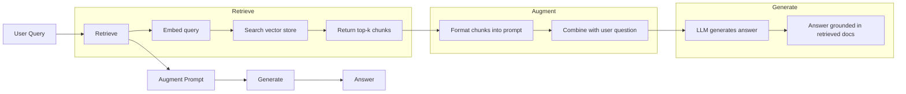
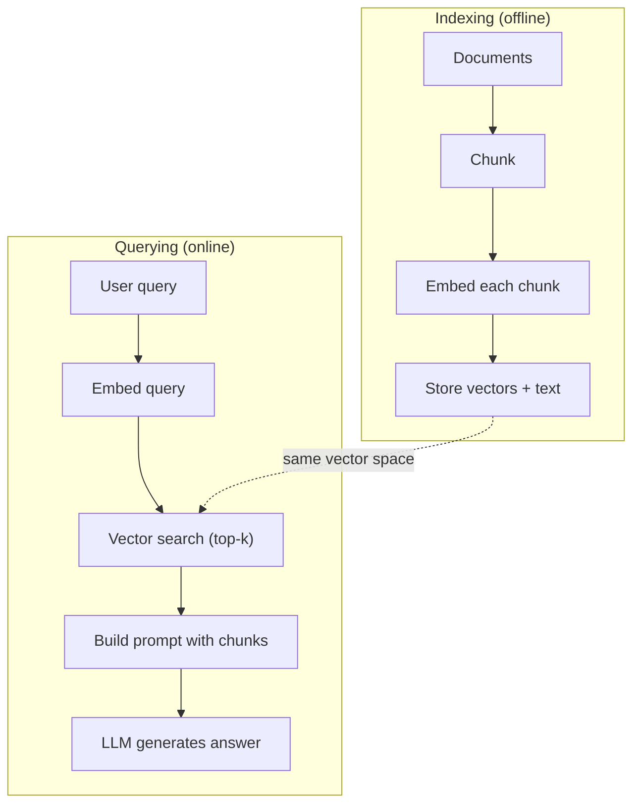

# RAG (Tổ sung phát triển)

> LLM của bạn hiểu mọi thứ trước khi thời gian đào tạo của mình hết hạn. Nó không hiểu tài liệu của công ty của bạn, thư viện mã của bạn, cũng không hiểu các hồ sơ họp tuần trước. RAG thông qua truy vấn các tài liệu liên quan và sẽ đưa chúng vào nhanh chóng để giải quyết vấn đề này. Nó là mô hình AI rộng rãi nhất được triển khai trong môi trường sản xuất. Nếu bạn chỉ xây dựng một cái gì đó từ khóa học này, bạn sẽ xây dựng một đường ống RAG.

**Type:** Build
**Languages:** Python
**Prerequisites:** Phase 10 (LLMs from Scratch), Phase 11 Lessons 01-05
**Time:** ~90 minutes
**Related:**Giai đoạn 5 · 23 (Chunking Strategies for RAG) 讲解六种 chunking 算法以及各自适用场景──Giai đoạn 5 · 22 (Embedding Models Deep Dive) 讲解如何选择嵌入器──Giai đoạn 11 · 07 (Advanced RAG) 讲解混合搜索、重排和查询转换──

## Học mục tiêu
- Construction of a complete RAG pipeline:loading documents·chunking·embedding·vector storage·recovery và generation
- Sử dụng cơ sở dữ liệu vector (ChromaDB、FAISS hoặc Pinecone)并配合合适的索引,实现语义搜索
- 解释 tại sao trong ứng dụng dựa trên kiến thức RAG 优于细调 (cost, freshness, attributability)
- Sử dụng các số liệu lấy lại (đúng chính xác, nhớ lại) và các số liệu tạo ra (đúng trung thành, liên quan) đánh giá RAG 质量

## 问题
Bạn xây dựng một chatbot cho công ty.  Khách hàng hỏi:  Chính sách hoàn trả của chương trình kinh doanh là gì?  LLM đã đưa ra một câu trả lời chung về chính sách hoàn trả SaaS điển hình.

Phân chỉnh là một giải pháp. Hãy lấy LLM này, sử dụng tài liệu nội bộ của bạn để đào tạo nó, sau đó triển khai các mô hình mới được cập nhật. Đây là khả thi, nhưng có vấn đề nghiêm trọng.

RAG là một giải pháp khác. Để giữ mô hình không thay đổi. Khi vấn đề đến, hãy tìm kiếm các đoạn văn liên quan trong cửa hàng tài liệu của bạn, dán chúng vào lệnh trước của vấn đề, để mô hình dựa trên những đoạn văn này như một bối cảnh để trả lời.

## 概念
### Mô hình RAG

Cả mô hình có thể được tổng hợp thành bốn bước:



Query -> Retrieve -> Augment prompt -> Generate。 Mỗi hệ thống RAG đều theo mô hình này。 Sự khác biệt giữa các hệ thống RAG cấp sản xuất hiện tại trong từng bước trong các chi tiết: làm thế nào để cục bộ"", làm thế nào để nhúng"", làm thế nào để tìm kiếm,以及 làm thế nào để xây dựng prompt。

### Tại sao RAG không thích nghi với việc điều chỉnh tốt

| Concern | Fine-tuning | RAG |
|---------|------------|-----|
| 成本 | 每次 training run 需要 $1,000-$100,000+ | 每次 query 约 $0.01-$0.10（embedding + LLM） |
| 新鲜度 | 重新训练前一直过时 | 通过重新 indexing docs，可在几分钟内更新 |
| 可审计性 | 无法追踪 answer 到 source | 可以展示准确检索到的 passages |
| Hallucination | 仍然会自由 hallucinate | 基于检索到的 documents |
| 数据隐私 | training data 被烘焙进 weights | documents 留在你的 vector store 中 |

Phân chỉnh sẽ thay đổi vĩnh viễn trọng lượng của mô hình. RAC sẽ thay đổi tạm thời bối cảnh của mô hình. Đối với hầu hết các ứng dụng, bối cảnh tạm thời là điều bạn muốn.

Khả năng duy nhất để đạt được sự thành công là bạn cần mô hình sử dụng một kiểu kiểu, ngữ cảnh hoặc mô hình suy luận cụ thể, nhưng những điều này không thể chỉ được thực hiện bằng cách thúc đẩy.

### Đưa vào mô hình

Mô hình nhúng 会把文本转换成密集向量──相似文本会在这个高维空间中产生彼此接近的向量── Làm thế nào để tôi đặt lại mật khẩu của mình? 和  Tôi cần phải thay đổi mật khẩu của mình 尽管共享的词很少,但却会产生几乎相同的向量── 猫坐在床则会产生非常不同的向量──

常见嵌入型号(2026 阵容  完整分析见阶段 5 · 22):

| Model | Dimensions | Provider | Notes |
|-------|-----------|----------|-------|
| text-embedding-3-small | 1536 (Matryoshka) | OpenAI | 适合大多数用例的最佳性价比 |
| text-embedding-3-large | 3072 (Matryoshka) | OpenAI | 更高准确率，可截断到 256/512/1024 |
| Gemini Embedding 2 | 3072 (Matryoshka) | Google | 顶级 MTEB retrieval；8K context |
| voyage-4 | 1024/2048 (Matryoshka) | Voyage AI | 领域变体（code、finance、law） |
| Cohere embed-v4 | 1024 (Matryoshka) | Cohere | 强 multilingual，128K context |
| BGE-M3 | 1024 (dense + sparse + ColBERT) | BAAI (open-weight) | 一个模型提供三种视图 |
| Qwen3-Embedding | 4096 (Matryoshka) | Alibaba (open-weight) | 顶级 open-weight retrieval score |
| all-MiniLM-L6-v2 | 384 | Open-weight (Sentence Transformers) | prototyping baseline |

Trong bài học này, chúng tôi sẽ sử dụng TF-IDF để xây dựng bản nhúng đơn giản của riêng mình không phải vì TF-IDF là một giải pháp được sử dụng trong hệ thống sản xuất, mà vì nó làm cho khái niệm trở nên cụ thể: văn bản nhập, vector 输出, tương tự văn bản tạo ra các vector tương tự.

### Sự tương đồng vector

 Đưa ra hai vector, làm thế nào để đo tương tự?

**Cosine similarity**: hai vector 之间角的余弦值──范围从 -1(相反) 到 1(完全相同)──忽略大小, chỉ chú ý đến hướng──这是RAG's默认选择──

```
cosine_sim(a, b) = dot(a, b) / (||a|| * ||b||)
```

**Dot product**: nguyên thủy sản phẩm bên trong. Các vector lớn hơn sẽ nhận được số lượng lớn hơn. Khi kích thước  mang thông tin có ích.

```
dot(a, b) = sum(a_i * b_i)
```

**L2 (Euclidean) distance**: không gian vector Trung tâm đường thẳng khoảng cách── khoảng cách越小 = 越相似── đối với độ lớn 差异敏感──

```
L2(a, b) = sqrt(sum((a_i - b_i)^2))
```

Sự tương đồng của cosine là tiêu chuẩn lựa chọn. Nó thông qua quy mô 归一化,能优雅 xử lý các tài liệu có độ dài khác nhau. Khi người ta nói  vector search, gần như luôn chỉ về sự tương đồng của cosine.

### Các chiến lược làm cho các mảnh vỡ

Tài liệu quá dài, không thể được nhúng như một vector đơn lẻ. Một PDF 50 trang có thể tạo ra nhúng rất tồi, vì nó chứa vài chục chủ đề.

**Fixed-size chunking**Mỗi N 个 token 拆分一次──简单且可预测── một phần 512 token 配合 50 token chồng chéo, nghĩa là phần 1 là token 0-511, phần 2 là token 462-973,以此类推──overlap 确保你不会在不走运的边界处切断句子──

**Semantic chunking**Trong bản chất, các phần được phân chia là các phần khác nhau, trong đó có các phần khác nhau.

**Recursive chunking**:先尝试在最大边界处拆分 (~) 章 tiêu) ⋅ Nếu một phần  vẫn quá lớn, hãy theo ranh giới đoạn 拆分.

Kích thước của mảnh nhỏ quan trọng hơn những gì mọi người tưởng tượng:

- 太小(64-128 token): Mỗi phần  thiếu ngữ cảnh。 Nó tăng 15% quý trước Nếu không biết it指什么,就没有意义──
- 太大(2048+ token): mỗi phần 覆盖多主题,稀释相关性── khi bạn tìm kiếm dữ liệu doanh thu, bạn nhận được một phần 10% 关于收入、90% 关于人数──
- 理想范围 ((256-512 token):context 足够自包含,同时足够聚焦以保持相关性──

大多数生产级 RAG 系统使用 256-512 token chunks,并配50 token chồng chéo──Anthropic's RAG 指南推这个范围──

### Các cơ sở dữ liệu vector

Một khi có các nhúng, bạn cần một nơi để lưu trữ và tìm kiếm chúng.

| Database | Type | Best for |
|----------|------|----------|
| FAISS | Library (in-process) | Prototyping，中小型 datasets |
| Chroma | Lightweight DB | 本地开发，小型部署 |
| Pinecone | Managed service | 无需运维负担的生产环境 |
| Weaviate | Open source DB | 自托管生产环境 |
| pgvector | Postgres extension | 已经在使用 Postgres |
| Qdrant | Open source DB | 高性能自托管 |

Trong bài học này, chúng tôi sẽ xây dựng một cửa hàng vector trong bộ nhớ đơn giản. Nó đưa vector vào danh sách tồn tại, và thực hiện tìm kiếm tương tự vũ trụ bằng lực thô.

### Lối ống dẫn đầy đủ



Indexing 阶段 đối với mỗi tài liệu 运行一次 (或在文件 更新时运行) ⋅querying 阶段在每次用户请求时运行──在生产环境中,indexing可能需要在几个小时内处理数百万文件──querying 必须在一秒内响应──

### Số thực

Hầu hết các hệ thống RAG cấp sản xuất sử dụng các tham số này:

- **k = 5 to 10**: mỗi lần truy vấn 检索的块 数量
- **Chunk size = 256 to 512 tokens**,并配 50 token chồng chéo
- **Context budget**: mỗi lần truy vấn sử dụng 2.500-5.000 token của nội dung lấy lại
- **Total prompt**: khoảng 8.000-16.000 token(System prompt + thu thập các đoạn + lịch sử cuộc trò chuyện + truy vấn người dùng)
- **Embedding dimension**:384-3072, tùy thuộc vào mô hình
- **Indexing throughput**: sử dụng API nhúng 时每秒 100-1,000 tài liệu
- **Query latency**:khám phá 50-200ms, thế hệ 500-3000ms


```figure
rag-chunking
```

##  xây dựng nó
### 步骤 1: Chunking tài liệu

```python
def chunk_text(text, chunk_size=200, overlap=50):
    words = text.split()
    chunks = []
    start = 0
    while start < len(words):
        end = start + chunk_size
        chunk = " ".join(words[start:end])
        chunks.append(chunk)
        start += chunk_size - overlap
    return chunks
```

### 步骤 2: Cụ thể TF-IDF

Chúng tôi xây dựng một chức năng nhúng đơn giản. TF-IDF (Term Frequency-Inverse Document Frequency) không phải là nhúng thần kinh, nhưng nó sẽ có thể nắm bắt sự quan trọng của từ ngữ bằng cách chuyển văn bản thành vector.

```python
import math
from collections import Counter

def build_vocabulary(documents):
    vocab = set()
    for doc in documents:
        vocab.update(doc.lower().split())
    return sorted(vocab)

def compute_tf(text, vocab):
    words = text.lower().split()
    count = Counter(words)
    total = len(words)
    return [count.get(word, 0) / total for word in vocab]

def compute_idf(documents, vocab):
    n = len(documents)
    idf = []
    for word in vocab:
        doc_count = sum(1 for doc in documents if word in doc.lower().split())
        idf.append(math.log((n + 1) / (doc_count + 1)) + 1)
    return idf

def tfidf_embed(text, vocab, idf):
    tf = compute_tf(text, vocab)
    return [t * i for t, i in zip(tf, idf)]
```

### 步骤 3: Tìm kiếm sự tương đồng Cosine

```python
def cosine_similarity(a, b):
    dot = sum(x * y for x, y in zip(a, b))
    norm_a = math.sqrt(sum(x * x for x in a))
    norm_b = math.sqrt(sum(x * x for x in b))
    if norm_a == 0 or norm_b == 0:
        return 0.0
    return dot / (norm_a * norm_b)

def search(query_embedding, stored_embeddings, top_k=5):
    scores = []
    for i, emb in enumerate(stored_embeddings):
        sim = cosine_similarity(query_embedding, emb)
        scores.append((i, sim))
    scores.sort(key=lambda x: x[1], reverse=True)
    return scores[:top_k]
```

### 步骤 4: Xây dựng nhanh chóng

Đó là nơi mà RAG tăng lên xảy ra.

```python
def build_rag_prompt(query, retrieved_chunks):
    context = "\n\n---\n\n".join(
        f"[Source {i+1}]\n{chunk}"
        for i, chunk in enumerate(retrieved_chunks)
    )
    return f"""Answer the question based ONLY on the following context.
If the context doesn't contain enough information, say "I don't have enough information to answer that."

Context:
{context}

Question: {query}

Answer:"""
```

### 步骤 5: Đường ống RAG hoàn chỉnh

```python
class RAGPipeline:
    def __init__(self):
        self.chunks = []
        self.embeddings = []
        self.vocab = []
        self.idf = []

    def index(self, documents):
        all_chunks = []
        for doc in documents:
            all_chunks.extend(chunk_text(doc))
        self.chunks = all_chunks
        self.vocab = build_vocabulary(all_chunks)
        self.idf = compute_idf(all_chunks, self.vocab)
        self.embeddings = [
            tfidf_embed(chunk, self.vocab, self.idf)
            for chunk in all_chunks
        ]

    def query(self, question, top_k=5):
        query_emb = tfidf_embed(question, self.vocab, self.idf)
        results = search(query_emb, self.embeddings, top_k)
        retrieved = [(self.chunks[i], score) for i, score in results]
        prompt = build_rag_prompt(
            question, [chunk for chunk, _ in retrieved]
        )
        return prompt, retrieved
```

### 步骤 6: Tạo (được mô phỏng)

Trong môi trường sản xuất, chúng tôi sẽ sử dụng LLM API. Trong bài học này, chúng tôi đã lấy các câu liên quan nhất từ ngữ cảnh của việc kiểm tra để tạo ra mô phỏng.

```python
def simple_generate(prompt, retrieved_chunks):
    query_words = set(prompt.lower().split("question:")[-1].split())
    best_sentence = ""
    best_score = 0
    for chunk in retrieved_chunks:
        for sentence in chunk.split("."):
            sentence = sentence.strip()
            if not sentence:
                continue
            words = set(sentence.lower().split())
            overlap = len(query_words & words)
            if overlap > best_score:
                best_score = overlap
                best_sentence = sentence
    return best_sentence if best_sentence else "I don't have enough information."
```

## Sử dụng nó
Sử dụng thực tế nhúng mô hình và LLM 时,代码 gần như không thay đổi:

```python
from openai import OpenAI

client = OpenAI()

def embed(text):
    response = client.embeddings.create(
        model="text-embedding-3-small",
        input=text
    )
    return response.data[0].embedding

def generate(prompt):
    response = client.chat.completions.create(
        model="gpt-4o-mini",
        messages=[{"role": "user", "content": prompt}],
        temperature=0
    )
    return response.choices[0].message.content
```

Hoặc sử dụng Anthropic:

```python
import anthropic

client = anthropic.Anthropic()

def generate(prompt):
    response = client.messages.create(
        model="claude-sonnet-4-20250514",
        max_tokens=1024,
        messages=[{"role": "user", "content": prompt}]
    )
    return response.content[0].text
```

đường ống là giống như vậy. Thay đổi chức năng nhúng. Thay đổi chức năng thế hệ.

Đối với lưu trữ vector quy mô lớn, sử dụng cơ sở dữ liệu vector thích hợp thay thế tìm kiếm lực lượng thô:

```python
import chromadb

client = chromadb.Client()
collection = client.create_collection("my_docs")

collection.add(
    documents=chunks,
    ids=[f"chunk_{i}" for i in range(len(chunks))]
)

results = collection.query(
    query_texts=["What is the refund policy?"],
    n_results=5
)
```

Chroma 会在内部处理嵌入式 (默认使用全-MiniLM-L6-v2),并把向量存储在本地数据库中.

## 交付 nó
本课会产出:
- `outputs/prompt-rag-architect.md` Một lời nhắc được sử dụng cho thiết kế RAG  hệ thống sử dụng cụ thể
- `outputs/skill-rag-pipeline.md` Một đại lý dạy kỹ năng xây dựng và điều chỉnh đường ống RAG

## 练习
1. 用简单的字包-of-word 方法替换TF-IDF嵌入式(二值:词存在则为 1,不存在则为 0) ⋅ trên mẫu tài liệu trên

2. 试验不同块大小: trên cùng bộ tài liệu 上尝试 50、100、200 和 500 từ。 đối với mỗi kích thước, chạy cùng 5 truy vấn,并统计 có bao nhiêu người có thể trả về phần liên quan trong top-3。 tìm chất lượng thu thập  đạt điểm ngọt của đỉnh điểm。

3. Để mỗi phần 添加元数据 (tên tài liệu nguồn, vị trí phần)  sửa đổi mẫu yêu cầu để bao gồm thuộc tính nguồn, để LLM 引用其来源.

4. Thực hiện một đánh giá đơn giản: Đặt 10 cặp câu hỏi-phản ứng, để mỗi câu hỏi qua đường ống RAG, và đo lường số lượng phần tử trong các khối tìm kiếm chứa câu trả lời.

5. 构建对话意识RAG管道:维护最近3轮交易所的历史,并将其与检索的块 一起包含在快速中──使用后续问题 测试,例如在询价问题 后再问   关于企业?──

## 关键术语
| Term | What people say | What it actually means |
|------|----------------|----------------------|
| RAG | “能阅读你文档的 AI” | 检索相关 documents，把它们粘贴到 prompt 中，并生成一个基于这些 documents 的 answer |
| Embedding | “把文本转换成数字” | 文本的 dense vector representation，其中相似含义会产生相似 vectors |
| Vector database | “面向 AI 的搜索引擎” | 为存储 vectors 并按 similarity 找到 nearest neighbors 而优化的数据存储 |
| Chunking | “把 docs 拆成片段” | 将 documents 拆成更小的 segments（通常 256-512 tokens），以便每个 segment 可以独立 embed 和 retrieve |
| Cosine similarity | “两个 vectors 有多相似” | 两个 vectors 之间夹角的余弦值；1 = 方向相同，0 = 正交，-1 = 相反 |
| Top-k retrieval | “取 k 个最佳匹配” | 从 vector store 中返回与 query 最相似的 k 个 chunks |
| Context window | “LLM 能看到多少文本” | LLM 在单次请求中可以处理的最大 tokens 数；retrieved chunks 必须放入这个范围内 |
| Augmented generation | “使用给定 context 回答” | 使用检索到的 documents 作为 context 来生成响应，而不是仅依赖训练得到的知识 |
| TF-IDF | “词语重要性评分” | Term Frequency 乘以 Inverse Document Frequency；根据词语在 corpus 中的区分度为其加权 |
| Indexing | “为搜索准备 docs” | 离线执行 chunking、embedding 和 storing documents 的过程，使它们能在 query time 被搜索 |

## 延伸阅读
- Lewis et al., Tổ xuất-Tổ xuất-Tổ xuất cho các nhiệm vụ NLP chuyên sâu kiến thức (2020)  Facebook AI Research 提出的原始 RAG 论文,形式化了回收-then-genera 模式
- Tài liệu RAG của Anthropic (docs.anthropic.com)  关于块大小、快速构建和评估的实践指南
- Trung tâm học tập Pinecone, What is RAG?  用清晰可视化解释 RAG pipeline,并包含生产环境考量
- Câu-BERT: Reimers & Gurevych (2019)  tất cả các mô hình nhúng MiniLM 背后的论文,展示如何为语义相似之 训练双编码器
- [Karpukhin et al., “Dense Passage Retrieval for Open-Domain Question Answering” (EMNLP 2020)](https://arxiv.org/abs/2004.04906) DPR 论文, chứng minh thu hồi bi-encoder dày đặc trong khu vực mở QA 上优于BM25,并建立了现代RAG thu hồi mô hình.
- [LlamaIndex High-Level Concepts](https://docs.llamaindex.ai/en/stable/getting_started/concepts.html)  xây dựng đường ống RAG 时需要了解的主要概念:data loader、node parser、index、retriever、response synthesizers──
- [LangChain RAG tutorial](https://python.langchain.com/docs/tutorials/rag/) 另一种风格的管弦乐器;以链运行物 视角理解同一个检索然后生成模式──
