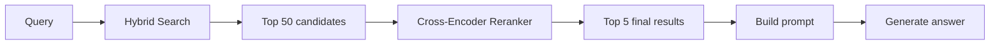
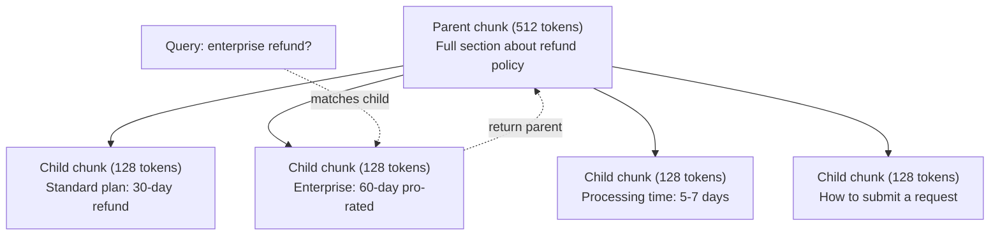
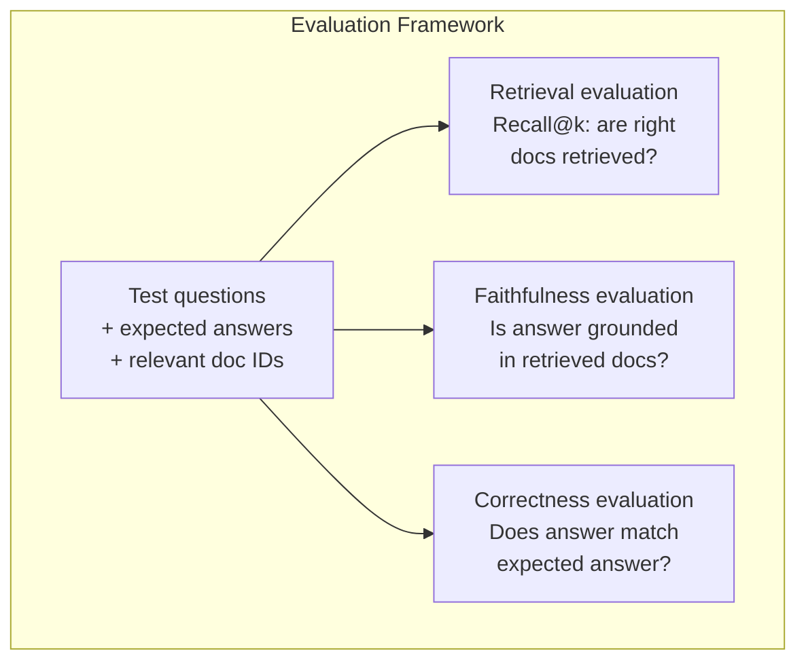

# RAG tiên tiến ((Chunking、Ranking、Hybrid Search)

> RAG cơ bản sẽ tìm kiếm phần top-k tương tự nhất. Điều này có hiệu quả đối với một vấn đề đơn giản. Nhưng đối với lý luận đa hop, câu hỏi mờ và corpus lớn sẽ không hiệu quả.

**类型：**构建
**语言：**Python
**前置要求：**Giai đoạn 11, Bài học 06 (RAG)
**时间：**~ 90 phút
**相关：**Giai đoạn 5 · 23 (Chunking Strategies for RAG) bao gồm tất cả sáu loại chunking 算法: tái phát, ngữ nghĩa, câu, tài liệu cha mẹ, chunking muộn, truy xuất ngữ cảnh,并包含 Vectara/Anthropic benchmark.

## Học mục tiêu

- 实现能够保留文档结构和上下文的先进分化策略 语义,复制性,父母-child)
- Xây dựng một đường ống tìm kiếm lai, sẽ kết hợp từ khóa BM25 với tìm kiếm vector ngữ nghĩa và mã hóa chéo
- 应用 truy vấn chuyển đổi 技术(HyDE、multi-query、step-back), cải thiện模糊或复杂问题的检索效果
- 诊断并修复常见 RAG 失败:检索到错误块、答案不在背景 中、多跳推理 崩

## 问题

Bạn trong Bài học 06 xây dựng một đường ống RAG cơ bản. Nó trong một tập hợp nhỏ trên trả lời trực tiếp câu hỏi.

**模糊 query**"Quý vị có thể nói rằng doanh thu trong quý trước là gì?" Tìm kiếm ngữ nghĩa về chiến lược doanh thu, dự báo doanh thu, cũng như CFO về tăng trưởng doanh thu nhìn thấy một phần.$47.2M in Q3 2025"，但使用的是 "earnings" 而不是 "revenue"。Embedding model 认为 "revenue strategy" 比 "Q3 earnings were $47,2M" hơn gần truy vấn

**Multi-hop question**:"Đội nào có điểm số hài lòng khách hàng cao nhất?" Điều này cần tìm điểm hài lòng của mỗi nhóm, so sánh, và xác định giá trị tối đa. Không có bất kỳ phần đơn lẻ nào chứa câu trả lời. Thông tin được phân tán trong các báo cáo của nhóm.

**大规模 corpus 问题**Bạn có 200 triệu phần. Đáp trả lời chính xác trong phần #1,847,293. Việc tìm kiếm top 5 của bạn đã lấy phần #14、#89,201、#1,200,000、#44 和 #901,333. Chúng gần nhau trong Embedding 空间, nhưng không có một phần nào chứa câu trả lời.

RAG cơ bản  thất bại là sự tương đồng vector không bằng sự liên quan. Một phần có thể trong ngữ nghĩa tương tự như truy vấn, nhưng không giúp đỡ cho câu hỏi. RAG tiên tiến sử dụng bốn kỹ thuật giải quyết vấn đề này: tìm kiếm lai (hybrid search)  xếp hạng lại (re-ranking)  hơn kỹ thuật cho ứng viên 打分)  biến đổi truy vấn (trong tìm kiếm trước sửa chữa truy vấn), cũng như chunking tốt hơn (để phù hợp với phân tích truy vấn) 

## 核心概念

### Tìm kiếm lai:Tầm nghĩa + Từ khóa

Tìm kiếm ngữ nghĩa(Vektor tương tự)擅长理解含义──"Tôi hủy đăng ký của mình như thế nào?" 即使与"Cách chấm dứt kế hoạch của bạn" 没有共享单词,也能匹配──但它会漏掉精确匹配──" Mã lỗi E-4021"可能无法匹配包含"E-4021"的部分,因为嵌入模型可能把它当作噪声──

Tìm kiếm từ khóa(BM25) là đúng cách. Nó giỏi trong việc xác định đúng cách. E-4021 có thể hoàn thành đúng cách. Nhưng nếu tài liệu viết là "dừng kế hoạch của bạn", "hoãn đăng ký của tôi" sẽ trả lại kết quả.

Tìm kiếm lai sẽ chạy cùng lúc, sau đó kết quả kết hợp.

**BM25**(Best Matching 25) là thuật toán tìm kiếm từ khóa tiêu chuẩn. Từ những năm 1990, nó luôn là cốt lõi của công cụ tìm kiếm.

```
BM25(q, d) = sum over terms t in q:
    IDF(t) * (tf(t,d) * (k1 + 1)) / (tf(t,d) + k1 * (1 - b + b * |d| / avgdl))
```

Trong số đó, tf(t,d) là thuật ngữ t trong tài liệu d 中的 thuật ngữ t,IDF(t) là tần suất tài liệu ngược, khi bạn có thể nói là chiều dài tài liệu,avgdl là chiều dài tài liệu trung bình,k1  kiểm soát thuật ngữ tần suất bão hòa(默认 1.2),b  kiểm soát chiều dài bình thường hóa(默认 0.75)。

Thông thường nói: Khi tài liệu chứa các thuật ngữ truy vấn (đặc biệt là các thuật ngữ hiếm hoi) thì BM25 sẽ cung cấp các tài liệu có tỷ lệ cao hơn, nhưng thu nhập của các tài liệu có tỷ lệ giảm đi.

### Phối hợp cấp độ tương đối ((RRF)

Bạn có hai danh sách xếp hạng: một từ Vector tìm kiếm, một từ BM25... làm thế nào để tập hợp chúng?

```
RRF_score(d) = sum over rankings R:
    1 / (k + rank_R(d))
```

Trong đó, k là một số thường (thường là 60), để ngăn chặn kết quả xếp hạng đầu tiên chiếm ưu thế quá lớn.

Một trong các tìm kiếm vector Trung排名 #1 ✓ BM25 Trung排名 #5 的文档得分为:1/(60+1) + 1/(60+5) = 0.0164 + 0.0154 = 0.0318

Một trong các tìm kiếm vector Trung排名 #3 ✓ BM25 Trung排名 #2 的文档得分为:1/(60+3) + 1/(60+2) = 0.0159 + 0.0161 = 0.0320

RRF sẽ cân bằng tự nhiên hai loại tín hiệu này. Một trong hai danh sách xếp hạng cao nhất sẽ đạt được điểm số tốt nhất. Một trong một danh sách xếp hạng #1 nhưng trong danh sách khác thiếu có được điểm số trung bình.

### Tái xếp hạng

Khám phá (cũng là Vector, từ khóa hay là hybrid) nhanh, nhưng không đủ chính xác. Nó sử dụng một mã hóa hai: query 和 mỗi tài liệu độc lập để thực hiện nhúng, sau đó so sánh.

Đánh giá sử dụng mã hóa chéo:query 和 ứng viên tài liệu 会一起输入模型,模型输出相关性分数――模型能同时看到两段文本,因此可以捕捉它们之间的细粒度交互――Cross-encoder 能理解"Quả là lợi nhuận Q3?"

权衡是:cross-encoder hơn bi-encoder 慢 hơn 100-1000 lần, vì nó cần phải xử lý cùng một cặp truy vấn-tài liệu. Bạn không thể tính toán trước một triệu tài liệu cross-encoder 分数.



常见 tái xếp hạng mô hình(2026 阵容):
- Cohere Rerank 3.5: quản lý API,多语言,在混合 corpus 上 thu hồi lợi nhuận tốt nhất
- Đơn vị thay đổi du lịch-2.5: quản lý API, thời gian trễ trong các lựa chọn quản lý tối thiểu
- Jina-Reranker-v2 Đa ngôn ngữ:nhanh mở,支持 100+ 语言
- bge-re-ranker-v2-m3: trọng lượng mở, điểm khởi điểm mạnh
- cross-encoder/ms-marco-MiniLM-L-6-v2: Open-weight, có thể trên CPU, phù hợp với việc tạo mẫu
- ColBERTv2 / Jina-ColBERT-v2: late-interaction multi-vector ranker, trong đánh giá là O(tokens) chứ không phải O(docs)

### Query Transformation

Có lúc vấn đề không phải là tìm kiếm, mà trong truy vấn thực sự. "Điều đó là gì về sự thay đổi chính sách mới?" là một truy vấn tìm kiếm rất tồi tệ. Nó không chứa bất kỳ thuật ngữ cụ thể nào.

**Query rewriting**:把用户 query 改写成更好的搜索查询――LLM có thể làm điều này:

```
User: "What was that thing about the new policy change?"
Rewritten: "Recent policy changes and updates"
```

**HyDE（Hypothetical Document Embeddings）**Không phải bằng câu hỏi, mà là một câu trả lời giả thuyết, hãy làm việc đó, rồi tìm kiếm các tài liệu thực sự tương tự.

```
Query: "What is the refund policy for enterprise?"
Hypothetical answer: "Enterprise customers are eligible for a full refund
within 60 days of purchase. Refunds are pro-rated based on the remaining
subscription period and processed within 5-7 business days."
```

Để trả lời giả thuyết làm Nhập,并 tìm kiếm với nó giống như các tài liệu thực tế.

HyDE sẽ được lấy lại trước khi tăng một lần LLM 调用. Điều này sẽ tăng thời gian trễ 500-2000ms.

### Bắt đầu với con

标准 chunking 迫使你做取舍: nhỏ chunk 用于精确检索, lớn chunk 用于提供足够的背景──父母-child chunking 消除了这个取舍──

索引小块(128 token) được sử dụng để lấy lại. 时检索到小块,把它的母块 ((512 token) trả lại cho prompt.



truy vấn "trái tiền doanh nghiệp?" 会精确匹配 child part C2──但提示 收到的是完整的父母部分 P,其中包含关于处理时间和提交流程的周边背景──

### Phân lọc metadata

Trong quá trình chạy tìm kiếm vector, trước đó, theo metadata 过 corpus:date、source、category、author、language。

"Điều gì đã thay đổi trong chính sách an ninh tháng trước?"  nên chỉ tìm kiếm gần đây 30 天, hạng mục an ninh 中的文档── Nếu không có lọc siêu dữ liệu, bạn sẽ tìm kiếm toàn bộ bộ bộ, có thể tìm kiếm một tài liệu an ninh 2 năm trước, chỉ vì nó có nghĩa là giống nhau──

Sản xuất RAG  hệ thống sẽ đưa metadata với mỗi phần một kho lưu trữ: tài liệu nguồn, ngày tạo, loại, tác giả, phiên bản.

### Đánh giá

Bạn đã xây dựng một hệ thống RAG. Làm thế nào để biết nó có hiệu quả không?

**Retrieval relevance（Recall@k）**Đối với một nhóm các câu hỏi kiểm tra có liên quan được biết đến, tỷ lệ các tài liệu liên quan xuất hiện trong kết quả top-k là bao nhiêu? Nếu câu hỏi nào đó được trả lời trong phần #47, phần #47 có xuất hiện trong top-5 không?

**Faithfulness**Nếu phần truy vấn được viết là "trung cửa sổ hoàn trả 60 ngày", và mô hình trả lời "trung cửa sổ hoàn trả 90 ngày", đó là sự trung thành 失败.

**Answer correctness**: generate answer có phù hợp với câu trả lời mong đợi không? Đây là chỉ số kết thúc đến kết thúc.

Một đơn giản của sự trung thành kiểm tra: lấy mỗi tuyên bố trong câu trả lời,并验证 nó có phải là trên thực chất) xuất hiện trong phần lấy lại. Nếu câu trả lời chứa bất kỳ phần lấy lại nào trong thực tế không có, nó rất có thể là ảo giác.




```figure
agentic-rag-loop
```

## 构建

### 步骤 1:BM25  thực hiện

```python
import math
from collections import Counter

class BM25:
    def __init__(self, k1=1.2, b=0.75):
        self.k1 = k1
        self.b = b
        self.docs = []
        self.doc_lengths = []
        self.avg_dl = 0
        self.doc_freqs = {}
        self.n_docs = 0

    def index(self, documents):
        self.docs = documents
        self.n_docs = len(documents)
        self.doc_lengths = []
        self.doc_freqs = {}

        for doc in documents:
            words = doc.lower().split()
            self.doc_lengths.append(len(words))
            unique_words = set(words)
            for word in unique_words:
                self.doc_freqs[word] = self.doc_freqs.get(word, 0) + 1

        self.avg_dl = sum(self.doc_lengths) / self.n_docs if self.n_docs else 1

    def score(self, query, doc_idx):
        query_words = query.lower().split()
        doc_words = self.docs[doc_idx].lower().split()
        doc_len = self.doc_lengths[doc_idx]
        word_counts = Counter(doc_words)
        score = 0.0

        for term in query_words:
            if term not in word_counts:
                continue
            tf = word_counts[term]
            df = self.doc_freqs.get(term, 0)
            idf = math.log((self.n_docs - df + 0.5) / (df + 0.5) + 1)
            numerator = tf * (self.k1 + 1)
            denominator = tf + self.k1 * (1 - self.b + self.b * doc_len / self.avg_dl)
            score += idf * numerator / denominator

        return score

    def search(self, query, top_k=10):
        scores = [(i, self.score(query, i)) for i in range(self.n_docs)]
        scores.sort(key=lambda x: x[1], reverse=True)
        return scores[:top_k]
```

### 步骤 2:Thiết hợp cấp độ tương ứng

```python
def reciprocal_rank_fusion(ranked_lists, k=60):
    scores = {}
    for ranked_list in ranked_lists:
        for rank, (doc_id, _) in enumerate(ranked_list):
            if doc_id not in scores:
                scores[doc_id] = 0.0
            scores[doc_id] += 1.0 / (k + rank + 1)
    fused = sorted(scores.items(), key=lambda x: x[1], reverse=True)
    return fused
```

### 步骤 3: Hãng đường ống tìm kiếm lai

```python
def hybrid_search(query, chunks, vector_embeddings, vocab, idf, bm25_index, top_k=5, fusion_k=60):
    query_emb = tfidf_embed(query, vocab, idf)
    vector_results = search(query_emb, vector_embeddings, top_k=top_k * 3)
    bm25_results = bm25_index.search(query, top_k=top_k * 3)
    fused = reciprocal_rank_fusion([vector_results, bm25_results], k=fusion_k)
    return fused[:top_k]
```

### 步骤 4: đơn giản Reranker

Trong sản xuất, bạn sẽ sử dụng mô hình mã hóa chéo. Ở đây chúng tôi xây dựng một trình xếp hạng lại, sử dụng sự chồng chéo từ ngữ quan trọng và phù hợp cụm từ cho liên quan đến tài liệu truy vấn.

```python
def rerank(query, candidates, chunks):
    query_words = set(query.lower().split())
    stop_words = {"the", "a", "an", "is", "are", "was", "were", "what", "how",
                  "why", "when", "where", "do", "does", "for", "of", "in", "to",
                  "and", "or", "on", "at", "by", "it", "its", "this", "that",
                  "with", "from", "be", "has", "have", "had", "not", "but"}
    query_terms = query_words - stop_words

    scored = []
    for doc_id, initial_score in candidates:
        chunk = chunks[doc_id].lower()
        chunk_words = set(chunk.split())

        term_overlap = len(query_terms & chunk_words)

        query_bigrams = set()
        q_list = [w for w in query.lower().split() if w not in stop_words]
        for i in range(len(q_list) - 1):
            query_bigrams.add(q_list[i] + " " + q_list[i + 1])
        bigram_matches = sum(1 for bg in query_bigrams if bg in chunk)

        position_boost = 0
        for term in query_terms:
            pos = chunk.find(term)
            if pos != -1 and pos < len(chunk) // 3:
                position_boost += 0.5

        rerank_score = (
            term_overlap * 1.0
            + bigram_matches * 2.0
            + position_boost
            + initial_score * 5.0
        )
        scored.append((doc_id, rerank_score))

    scored.sort(key=lambda x: x[1], reverse=True)
    return scored
```

### 步骤 5:HyDE(Hình thức ghi chép giả thuyết)

```python
def hyde_generate_hypothesis(query):
    templates = {
        "what": "The answer to '{query}' is as follows: Based on our documentation, {topic} involves specific policies and procedures that define how the process works.",
        "how": "To address '{query}': The process involves several steps. First, you need to initiate the request. Then, the system processes it according to the defined rules.",
        "default": "Regarding '{query}': Our records indicate specific details and policies related to this topic that provide a comprehensive answer."
    }
    query_lower = query.lower()
    if query_lower.startswith("what"):
        template = templates["what"]
    elif query_lower.startswith("how"):
        template = templates["how"]
    else:
        template = templates["default"]

    topic_words = [w for w in query.lower().split()
                   if w not in {"what", "is", "the", "how", "do", "does", "a", "an",
                                "for", "of", "to", "in", "on", "at", "by", "and", "or"}]
    topic = " ".join(topic_words) if topic_words else "this topic"

    return template.format(query=query, topic=topic)


def hyde_search(query, chunks, vector_embeddings, vocab, idf, top_k=5):
    hypothesis = hyde_generate_hypothesis(query)
    hypothesis_emb = tfidf_embed(hypothesis, vocab, idf)
    results = search(hypothesis_emb, vector_embeddings, top_k)
    return results, hypothesis
```

### 步骤 6: Cha mẹ-Con trai Chunking

```python
def create_parent_child_chunks(text, parent_size=200, child_size=50):
    words = text.split()
    parents = []
    children = []
    child_to_parent = {}

    parent_idx = 0
    start = 0
    while start < len(words):
        parent_end = min(start + parent_size, len(words))
        parent_text = " ".join(words[start:parent_end])
        parents.append(parent_text)

        child_start = start
        while child_start < parent_end:
            child_end = min(child_start + child_size, parent_end)
            child_text = " ".join(words[child_start:child_end])
            child_idx = len(children)
            children.append(child_text)
            child_to_parent[child_idx] = parent_idx
            child_start += child_size

        parent_idx += 1
        start += parent_size

    return parents, children, child_to_parent
```

### 步骤 7: Đánh giá trung thành

```python
def evaluate_faithfulness(answer, retrieved_chunks):
    answer_sentences = [s.strip() for s in answer.split(".") if len(s.strip()) > 10]
    if not answer_sentences:
        return 1.0, []

    grounded = 0
    ungrounded = []
    context = " ".join(retrieved_chunks).lower()

    for sentence in answer_sentences:
        words = set(sentence.lower().split())
        stop_words = {"the", "a", "an", "is", "are", "was", "were", "and", "or",
                      "to", "of", "in", "for", "on", "at", "by", "it", "this", "that"}
        content_words = words - stop_words
        if not content_words:
            grounded += 1
            continue

        matched = sum(1 for w in content_words if w in context)
        ratio = matched / len(content_words) if content_words else 0

        if ratio >= 0.5:
            grounded += 1
        else:
            ungrounded.append(sentence)

    score = grounded / len(answer_sentences) if answer_sentences else 1.0
    return score, ungrounded


def evaluate_retrieval_recall(queries_with_relevant, retrieval_fn, k=5):
    total_recall = 0.0
    results = []

    for query, relevant_indices in queries_with_relevant:
        retrieved = retrieval_fn(query, k)
        retrieved_indices = set(idx for idx, _ in retrieved)
        relevant_set = set(relevant_indices)
        hits = len(retrieved_indices & relevant_set)
        recall = hits / len(relevant_set) if relevant_set else 1.0
        total_recall += recall
        results.append({
            "query": query,
            "recall": recall,
            "hits": hits,
            "total_relevant": len(relevant_set)
        })

    avg_recall = total_recall / len(queries_with_relevant) if queries_with_relevant else 0
    return avg_recall, results
```

## 使用

Sử dụng thực tế mã hóa chéo  thực hiện xếp hạng lại:

```python
from sentence_transformers import CrossEncoder

reranker = CrossEncoder("cross-encoder/ms-marco-MiniLM-L-6-v2")

def rerank_with_cross_encoder(query, candidates, chunks, top_k=5):
    pairs = [(query, chunks[doc_id]) for doc_id, _ in candidates]
    scores = reranker.predict(pairs)
    scored = list(zip([doc_id for doc_id, _ in candidates], scores))
    scored.sort(key=lambda x: x[1], reverse=True)
    return scored[:top_k]
```

Sử dụng Cohere's quản lý reanker:

```python
import cohere

co = cohere.Client()

def rerank_with_cohere(query, candidates, chunks, top_k=5):
    docs = [chunks[doc_id] for doc_id, _ in candidates]
    response = co.rerank(
        model="rerank-english-v3.0",
        query=query,
        documents=docs,
        top_n=top_k
    )
    return [(candidates[r.index][0], r.relevance_score) for r in response.results]
```

使用真实 LLM 实现 HyDE:

```python
import anthropic

client = anthropic.Anthropic()

def hyde_with_llm(query):
    response = client.messages.create(
        model="claude-sonnet-4-20250514",
        max_tokens=256,
        messages=[{
            "role": "user",
            "content": f"Write a short paragraph that would be a good answer to this question. Do not say you don't know. Just write what the answer would look like.\n\nQuestion: {query}"
        }]
    )
    return response.content[0].text
```

Sử dụng Weaviate  thực hiện tìm kiếm lai sản xuất:

```python
import weaviate

client = weaviate.connect_to_local()

collection = client.collections.get("Documents")
response = collection.query.hybrid(
    query="enterprise refund policy",
    alpha=0.5,
    limit=10
)
```

alpha 参数控制平衡:0.0 = 纯键词(BM25),1.0 = 纯向量,0.5 = 等权重── hầu hết các hệ thống sản xuất sử dụng alpha giữa 0.3 đến 0.7 ──

## 交付

本课会产出:
- `outputs/prompt-advanced-rag-debugger.md`-- dùng để chẩn đoán và sửa chữa vấn đề chất lượng RAG
- `outputs/skill-advanced-rag.md`-- dùng để xây dựng kỹ năng RAG cấp sản xuất có tìm kiếm lai và xếp hạng lại

## 练习

1. Trong tài liệu mẫu trên so sánh BM25、 Tìm kiếm vector và tìm kiếm lai. Đối với mỗi 5 truy vấn thử nghiệm trong số đó, ghi lại những cách nào có thể trả lại phần liên quan nhất ở vị trí số 1.

2. 实现 metadata filter──为每个文件 添加一个"类别"字段(security、billing、api、product)──在运行 矢量搜索 前,只过出相关类别的部分──用"What encryption is used?" 测试,并验证它只搜索安全类别的部分──

3. Sử dụng Bài học 06 中的简单生成函数 构建完整HyDE pipeline──在全部 5 测试查询 上比较直接查询搜索与HyDE搜索的检索质量(top-3相关性)──HyDE 应能改善模糊查询的结果──

4. Trong tài liệu mẫu 上实现父母-child chunking 策略──使用 child_size=30 和 parent_size=100──使用儿童块 搜索,但在快速中返回父母块──将生成答案与子块_size=50 的标准块 进行比较──

5. 创建评估数据集:10 个问题,带已知答案部分──分别测量 (a) 仅 Vector search,(b) 仅 BM25,(c) 仅 Hybrid search,(d) Hybrid + tái xếp hạng của Recall@3、Recall@5 和 Recall@10──绘制结果,并识别重新排名 最有帮助的位置──

## 关键术语

| Term | 人们通常怎么说 | 实际含义 |
|------|----------------|----------------------|
| BM25 | "Keyword search" | 一种概率排序算法，根据 term frequency、inverse document frequency 和 document length normalization 给文档打分 |
| Hybrid search | "Best of both worlds" | 并行运行 semantic（Vector）search 和 keyword（BM25）search，然后用 rank fusion 合并结果 |
| Reciprocal Rank Fusion | "Merge ranked lists" | 对每个文档在所有列表中的 1/(k + rank) 求和，从而组合多个 ranked list |
| Reranking | "Second pass scoring" | 使用成本更高的 cross-encoder model，对 initial retrieval 得到的 candidate set 重新打分 |
| Cross-encoder | "Joint query-document model" | 将 query 和 document 作为单个输入并生成相关性分数的模型；比 bi-encoder 更准确，但对 full corpus search 来说太慢 |
| Bi-encoder | "Independent embedding model" | 独立对 query 和 document 做 Embedding 的模型；由于 Embedding 可预计算，因此速度快，但不如 cross-encoder 准确 |
| HyDE | "Search with a fake answer" | 为 query 生成 hypothetical answer，对其做 Embedding，并搜索与它相似的真实文档 |
| Parent-child chunking | "Small search, big context" | 为精确 retrieval 索引小 chunk，但返回更大的 parent chunk 以提供足够 context |
| Metadata filtering | "Narrow before searching" | 在运行 Vector search 前，根据属性（date、source、category）过滤文档以缩小搜索空间 |
| Faithfulness | "Did it stay grounded" | 生成答案是否由 retrieved document 支持，而不是来自模型训练数据的 hallucination |

## 延伸阅读

- Robertson & Zaragoza, "The Probabilistic Relevance Framework: BM25 and Beyond" (2009) -- BM25's authority reference, explain公式背后的概率基础
- Cormack et al., "Thiết hợp cấp độ tương ứng vượt trội hơn phương pháp học tập Condorcet và cấp độ cá nhân" (2009) -- RRF 原始论文,展示它优于更复杂的融合方法
- Gao et al., "Cũng xác nhận mật độ không chụp bằng không có nhãn liên quan" (2022) -- HyDE 论文, chứng minh tài liệu giả thuyết n có thể cải thiện việc lấy lại mà không có bất kỳ dữ liệu đào tạo nào
- Nogueira & Cho, "Passage Re-ranking with BERT" (2019) -- 展示在 BM25 之上进行跨编码重新排名能显著提升检索质量
- [Khattab et al., "DSPy: Compiling Declarative Language Model Calls into Self-Improving Pipelines" (2023)](https://arxiv.org/abs/2310.03714)-- sẽ xây dựng nhanh và lựa chọn trọng lượng 视为检索管道 上的优化问题; đọc bài viết này để hiểu "công trình LLM", thay vì "LLLC nhanh".
- [Edge et al., "From Local to Global: A Graph RAG Approach to Query-Focused Summarization" (Microsoft Research 2024)](https://arxiv.org/abs/2404.16130)-- GraphRAG 论文: khai thác mối quan hệ thực thể + phát hiện cộng đồng Leiden, được sử dụng để tổng kết tập trung vào truy vấn; cũng như phân biệt về việc lấy lại toàn cầu so với địa phương.
- [Asai et al., "Self-RAG: Learning to Retrieve, Generate, and Critique through Self-Reflection" (ICLR 2024)](https://arxiv.org/abs/2310.11511)-- 带 phản xạ token 的自评估 RAG;静态 lấy lại-sau-tạo 后后的代理前沿──
- [LangChain Query Construction blog](https://blog.langchain.dev/query-construction/)-- 如何将自然语言查询 转换为结构化数据库查询(Text-to-SQL、Cypher), như là bước mua phục hồi.
