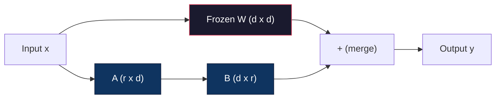
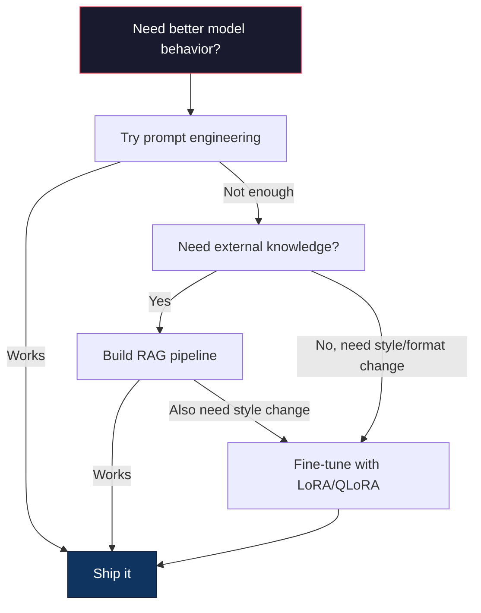

# Sử dụng LoRA & QLoRA  thực hiện Fine-Tuning

> Đối với một mô hình 7B làm việc chỉnh sửa hoàn chỉnh  cần 56GB VRAM── bạn không có nhiều như vậy── hầu hết các công ty cũng không có── LoRA  thông qua đào tạo không đến 1% tham số, để bạn có thể chỉnh sửa trong 6GB cùng một mô hình── đây không phải là thỏa hiệp - nó có thể đạt được chất lượng chỉnh sửa hoàn chỉnh trên hầu hết các nhiệm vụ── toàn bộ hệ thống chỉnh sửa mã nguồn mở đều dựa trên kỹ thuật này──

**Type:** Build
**Languages:** Python
**Prerequisites:** Phase 10, Lesson 06 (Instruction Tuning / SFT)
**Time:** ~75 minutes
**Related:**Giai đoạn 10 từ zero讲解 SFT/DPO loop. 本课会把这些连入2026 PEFT 工具链.

## Học mục tiêu
- Thông qua các matrix chuyển đổi sẽ thấp và B) Thêm vào các lớp chú ý của mô hình được đào tạo trước để thực hiện LoRA
- 计算 LoRA 相比 đầy đủ điều chỉnh của các tham số节省:rank r、d_model 维度时, tập luyện là 2*r*d 个参数, chứ không phải d^2
- Sử dụng QLoRA(4 bit quàn bộ hóa cơ sở + LoRA bộ chuyển đổi) tinh chỉnh một mô hình, làm cho nó thích hợp tiêu thụ cấp độ bộ nhớ GPU
- Để phân tích trọng lượng LoRA 合并回 cơ sở mô hình dùng để triển khai,并比较带适配器与不带适配器的推断速度

## 问题
Bạn có một mô hình cơ bản. Llama 3 8B. Bạn muốn nó sử dụng ngôn ngữ của công ty của bạn để trả lời khách hàng hỗ trợ công việc đơn giản.

Trong fp16 mỗi parameter chiếm 2 byte。 chỉ cần tải trọng trên 16GB。 trong thời gian tập luyện, bạn cũng cần gradient(16GB)、Adam của các trạng thái tối ưu hóa(momentum + biến thể 需要32GB)

A100 80GB 勉强能装下──两张 A100 trên các nhà cung cấp đám mây 上每小时花费 $3-4。用 50,000 个样本训练 3 个 epochs 需要 6-10 小时。每次实验就是 $30-40: Để sửa đổi các siêu số, chạy 10 lần thử nghiệm, trước khi triển khai bất cứ thứ gì, bạn đã chi 400 đô la.

Nếu mở rộng nó lên Llama 3 70B, số sẽ trở nên điên rồ. Chỉ cần có trọng lượng 140GB.

Có một vấn đề sâu hơn nữa. Việc chỉnh sửa hoàn chỉnh sẽ thay đổi từng trọng lượng trong mô hình. Nếu bạn chỉnh sửa dữ liệu hỗ trợ khách hàng, có thể làm hỏng khả năng sử dụng của mô hình.

Bạn cần một phương pháp: tập luyện ít hơn các tham số, sử dụng ít hơn bộ nhớ, và sẽ không phá hủy mô hình 已有知识.

## 概念
### LoRA: Chuẩn bị cấp thấp

Edward Hu và đồng nghiệp của Microsoft đã xuất bản LoRA vào tháng 6 năm 2021。 Insight on the paper is:fine-tuning 期间 weight updates 具有低内在排名──你不需要更新一个4096x4096 weight matrix 中全部1670万参数──update 中有用的信息可以从排名16或32 的矩阵中获取──

数学如下──一个标准线性层 计算:

```
y = Wx
```

Trong đó W là một d_out x d_in matrix. Đối với 4096x4096 dự đoán chú ý, đó là 16,777,216 个参数.

LoRA 结 W,并添加一个低排分解:

```
y = Wx + BAx
```

Trong đó B là (d_out x r), A là (r x d_in)。 xếp hạng r 远小于 d - thường là 8、16 hoặc 32。

Đối với lớp 4096x4096 trên của r=16:
- Các nguyên tố: 4996 x 4096 = 16,777,216
- LoRA 参数:(4096 x 16) + (16 x 4096) = 65,536 + 65,536 = 131,072
-  giảm tỷ lệ:131,072 / 16,777,216 = 0,78%

Bạn luyện tập 0,78% thành tích, nhưng đạt được chất lượng 95-100%



A 使用随机 Gaussian 初始化──B 初始化为零── nghĩa là đóng góp LoRA từ零开始 -- mô hình từ hành vi ban đầu bắt đầu tập luyện, rồi dần dần học cách thích nghi──

### Tỷ lệ quy mô: Alpha

LoRA  đưa ra một yếu tố quy mô alpha, để kiểm soát mức độ ảnh hưởng của việc cập nhật thấp:

```
y = Wx + (alpha / r) * BAx
```

Khi alpha = r 时, quy mô là 1x。当 alpha = 2r(常见默认值) Khi, quy mô là 2x。

实践建议:
- alpha = 2 * rank 是常见社区约定(原始论文 在多数实验中使用 alpha = rank)
- alpha = xếp hạng  cung cấp 1x quy mô, bảo trì nhưng ổn định
- Alpha cao hơn có nghĩa là mỗi bước có nhiều cập nhật hơn, có thể tăng tốc nhận, cũng có thể dẫn đến sự bất ổn

### Lần sử dụng LoRA

Một biến thể có nhiều lớp tuyến tính. Bạn không cần phải cho tất cả các lớp.

| Target Layers | Trainable Params (7B) | Quality |
|--------------|----------------------|---------|
| q_proj only | 4.7M | 好 |
| q_proj + v_proj | 9.4M | 更好 |
| q_proj + k_proj + v_proj + o_proj | 18.9M | 对 attention 最好 |
| All linear (attention + MLP) | 37.7M | 边际收益，参数量 2x |

Ưu điểm của hầu hết các nhiệm vụ: q_proj + v_proj。

### Chọn cấp độ

cấp độ r  kiểm soát khả năng biểu hiện thích ứng:

| Rank | Trainable Params (per layer) | Best For |
|------|---------------------------|----------|
| 4 | 32,768 | 简单 classification、sentiment |
| 8 | 65,536 | 单领域 Q&A、summarization |
| 16 | 131,072 | 多领域任务、instruction following |
| 32 | 262,144 | 复杂 reasoning、代码生成 |
| 64 | 524,288 | 大多数任务收益递减 |
| 128 | 1,048,576 | 很少值得使用 |

Hu et al. 表明, đối với các nhiệm vụ đơn giản, r=4 đã có thể nắm bắt được phần lớn các thích ứng. r=8 和 r=16 là lựa chọn phổ biến nhất trong thực tế.

### QLoRA: Quantization 4-bit + LoRA

Tim Dettmers và đồng nghiệp của Đại học Washington đã xuất bản QLoRA vào tháng 5 năm 2023.

Điều này sẽ thay đổi đáng kể trí nhớ:

| Method | Weight Memory (7B) | Training Memory (7B) | GPU Required |
|--------|-------------------|---------------------|-------------|
| Full fine-tune (fp16) | 14GB | ~56GB | 1x A100 80GB |
| LoRA (fp16 base) | 14GB | ~18GB | 1x A100 40GB |
| QLoRA (4-bit base) | 3.5GB | ~6GB | 1x RTX 3090 24GB |

QLoRA có ba công nghệ đóng góp:

**NF4 (Normal Float 4-bit)**Một loại dữ liệu đặc biệt dành cho trọng lượng mạng thần kinh  thiết kế mới loại dữ liệu  trọng lượng mạng thần kinh 大致 tuân theo phân phối bình thường NF4 đặt 16 mức định lượng hóa của nó vào các định lượng phân phối bình thường tiêu chuẩn trên  Đối với dữ liệu được phân phối bình thường, điều này trong ý nghĩa về thông tin là tốt nhất  So với định lượng 4-bit thống nhất INT4) hoặc tiêu chuẩn Float4, nó mất đi thông tin ít hơn 

**Double quantization**: định lượng định lượng thực tế thực tế thực tế thực tế thực tế thực tế thực tế thực tế thực tế thực tế thực tế thực tế thực tế thực tế thực tế thực tế thực tế thực tế thực tế thực tế thực tế thực tế thực tế thực tế thực tế thực tế thực tế thực tế thực tế thực tế thực tế thực tế thực tế thực tế thực tế thực tế thực tế thực tế thực tế thực tế thực tế thực tế thực tế thực tế thực tế thực tế thực tế thực tế thực tế thực tế thực tế thực tế thực tế thực tế thực tế thực tế thực tế thực tế thực tế thực tế thực tế thực tế thực tế thực tế thực tế thực tế thực tế thực tế thực tế thực tế thực tế thực tế thực tế thực tế thực tế thực tế thực tế thực tế thực tế thực tế thực tế thực tế thực tế thực tế thực tế thực tế thực tế thực tế thực tế thực tế thực tế thực tế thực tế thực tế thực tế thực tế thực tế thực tế thực tế thực tế thực tế thực tế thực tế thực tế thực tế thực tế thực tế thực tế thực tế thực tế thực tế thực tế thực tế thực tế thực tế thực tế thực tế thực tế thực tế thực tế thực tế thực tế thực tế thực tế thực tế thực tế thực tế thực tế thực tế thực tế thực tế

**Paged optimizers**Trong thời gian tập luyện, bộ tối ưu hóa trên dài chuỗi trạng thái (Adam's momentum 和 variance) có thể vượt quá bộ nhớ GPU.

### Câu hỏi về chất lượng

減参数或量化基因会损害质量吗?多篇论文的结果:

| Method | MMLU (5-shot) | MT-Bench | HumanEval |
|--------|--------------|----------|-----------|
| Full fine-tune (Llama 2 7B) | 48.3 | 6.72 | 14.6 |
| LoRA r=16 | 47.9 | 6.68 | 14.0 |
| QLoRA r=16 (NF4) | 47.5 | 6.61 | 13.4 |
| QLoRA r=64 (NF4) | 48.1 | 6.70 | 14.2 |

LoRA ở r=16 时,在大多数基准上与全细调相差不到1%──QLoRA ở r=16 时又损失零点几百分点──QLoRA ở r=64 时基本匹配全细调,同时使用90% bộ nhớ──

### Chi phí thực tế

Trong 50.000 个样本上细调 Llama 3 8B(3 thời đại):

| Method | GPU | Time | Cost |
|--------|-----|------|------|
| Full fine-tune | 2x A100 80GB | 8 hours | ~$32 |
| LoRA r=16 | 1x A100 40GB | 4 hours | ~$8 |
| QLoRA r=16 | 1x RTX 4090 24GB | 6 hours | ~$5 |
| QLoRA r=16 (Unsloth) | 1x RTX 4090 24GB | 2.5 hours | ~$2 |
| QLoRA r=16 | 1x T4 16GB | 12 hours | ~$4 |

Trong một GPU tiêu thụ cấp trên, chi phí vận hành QLoRA không lên đến một bữa trưa. Đó là lý do tại sao các cơ chế đào tạo mở cân được điều chỉnh trong cộng đồng vào năm 2023, cũng là lý do tại sao mỗi khuôn khổ đào tạo dưới đây sẽ được chấp thuận cung cấp QLoRA vào năm 2026.

### Bộ đống PEFT 2026

| Framework | What it is | Pick when |
|-----------|-----------|-----------|
| **Hugging Face PEFT** | 规范的 LoRA/QLoRA/DoRA/IA3 library | 你想要原始控制权，并且 training loop 已经基于 `transformers.Trainer` |
| **TRL** | HF 的 reinforcement-from-feedback trainers（SFT, DPO, GRPO, PPO, ORPO） | 你在 SFT 后需要 DPO/GRPO；构建在 PEFT 之上 |
| **Unsloth** | forward/backward pass 的 Triton-kernel 重写 | 你想要 2-5x 加速 + 一半 VRAM 且无 accuracy loss；Llama/Mistral/Qwen 系列 |
| **Axolotl** | PEFT + TRL + DeepSpeed + Unsloth 之上的 YAML-config wrapper | 你想要可复现、版本控制的 training runs |
| **LLaMA-Factory** | PEFT + TRL 之上的 GUI/CLI/API | 你想要 zero-code fine-tuning；支持 100+ model families |
| **torchtune** | Native PyTorch recipes，无 `transformers` 依赖 | 你想要最少依赖，且组织已经标准化使用 PyTorch |

经验法则: nghiên cứu sử dụng hoặc một lần thực nghiệm → PEFT──可重复的生产管线 → 启动 Unsloth kernels的 Axolotl──一次性原型 → LLaMA-Factory──

### Tích ứng hợp nhất

Sau khi tập luyện, bạn có hai thứ: mô hình cơ bản và một bộ chuyển đổi LoRA nhỏ ((thường là 10-100MB) ︎ Bạn có thể:

1. **保持分离**: tải mẫu cơ sở, trên đó tải bộ chuyển đổi.

2. **永久合并**:计算 W' = W + (alpha/r) * BA,并把结果保存为一个新的完整模型──合并模型与原始模型 大小相同──没有推断过费──没有适配器 需要管理──

Nếu dịch vụ nhiều nhiệm vụ (客户支持适配器,代码适配器,翻译适配器), giữ phân离. Nếu triển khai mô hình riêng lẻ, thì hợp并.

Sử dụng để hợp nhất nhiều bộ chuyển đổi 技术:

- **TIES-Merging**(Yadav et al. 2023): cắt cắt 参数, giải quyết xung đột dấu hiệu, rồi合并── giảm các bộ điều chỉnh 之间的干扰──
- **DARE**(Yu et al. 2023): Trong việc sáp nhập trước khi bỏ qua các tham số bộ chuyển đổi,并重新缩放剩余部分──组合能力时出人意料地有效──
- **Task arithmetic**Đơn giản là: tăng thêm giảm trọng lượng bộ chuyển đổi.

### Khi không nên chỉnh sửa

Định nghĩa là lựa chọn thứ ba, không phải là lựa chọn thứ nhất.

**第一：prompt engineering。**写一个更好的系统提示――加入几个镜头例子――使用链思维――这没有成本,只需几分钟――如果提示已经能达到80%,你可能不需要细调――

**第二：RAG。**Nếu mô hình cần hiểu dữ liệu cụ thể của bạn, tài liệu, cơ sở kiến thức, danh mục sản phẩm, tìm lại nó bằng cách đưa nó vào trọng lượng, dễ dàng hơn, dễ dàng hơn để bảo trì.

**第三：fine-tuning。**Khi bạn cần mô hình  áp dụng phong cách cụ thể, định dạng hoặc mô hình lý luận, và thúc đẩy  không thể thực hiện khi sử dụng nó. Khi bạn cần kết quả cấu trúc phù hợp. Khi bạn cần đưa một mô hình lớn hơn chưng cất cho mô hình nhỏ hơn. Khi độ trễ rất quan trọng, và bạn chịu trách nhiệm không phải chịu một vài cú thúc đẩy.




```figure
lora-params
```

##  xây dựng nó
Chúng tôi sử dụng PyTorch tinh khiết từ zero để thực hiện LoRA. Không có thư viện. Không có phép thuật. Bạn sẽ xây dựng lớp LoRA, đưa nó vào mô hình, đào tạo nó, và đặt trọng lượng.

### 步骤 1: Lớp LoRA

```python
import torch
import torch.nn as nn
import math

class LoRALayer(nn.Module):
    def __init__(self, in_features, out_features, rank=8, alpha=16):
        super().__init__()
        self.rank = rank
        self.alpha = alpha
        self.scaling = alpha / rank

        self.A = nn.Parameter(torch.randn(in_features, rank) * (1 / math.sqrt(rank)))
        self.B = nn.Parameter(torch.zeros(rank, out_features))

    def forward(self, x):
        return (x @ self.A @ self.B) * self.scaling
```

A sử dụng缩放后的随机值初始化──B初始化为零──乘积 BA从零开始,所以模型以原始行为开始──

### 步骤 2: Lớp tuyến tính được lắp LoRA

```python
class LinearWithLoRA(nn.Module):
    def __init__(self, linear, rank=8, alpha=16):
        super().__init__()
        self.linear = linear
        self.lora = LoRALayer(
            linear.in_features, linear.out_features, rank, alpha
        )

        for param in self.linear.parameters():
            param.requires_grad = False

    def forward(self, x):
        return self.linear(x) + self.lora(x)
```

Lớp tuyến tính nguyên thủy được kết thúc. Chỉ có LoRA 参数(A 和 B) là có thể huấn luyện.

### 步骤 3: Tiết LRA vào mô hình

```python
def inject_lora(model, target_modules, rank=8, alpha=16):
    for param in model.parameters():
        param.requires_grad = False

    lora_layers = {}
    for name, module in model.named_modules():
        if isinstance(module, nn.Linear):
            if any(t in name for t in target_modules):
                parent_name = ".".join(name.split(".")[:-1])
                child_name = name.split(".")[-1]
                parent = dict(model.named_modules())[parent_name]
                lora_linear = LinearWithLoRA(module, rank, alpha)
                setattr(parent, child_name, lora_linear)
                lora_layers[name] = lora_linear
    return lora_layers
```

Đầu tiên, hãy kết thúc mỗi số liệu trong mô hình. Sau đó đi qua cây mô hình, tìm các lớp tuyến tính phù hợp với tên mục tiêu của bạn, và thay thế chúng bằng phiên bản được gói LoRA.

### 步骤 4: Đếm các tham số

```python
def count_parameters(model):
    total = sum(p.numel() for p in model.parameters())
    trainable = sum(p.numel() for p in model.parameters() if p.requires_grad)
    frozen = total - trainable
    return {
        "total": total,
        "trainable": trainable,
        "frozen": frozen,
        "trainable_pct": 100 * trainable / total if total > 0 else 0
    }
```

### 步骤 5: Thêm trọng lượng trở lại

```python
def merge_lora_weights(model):
    for name, module in model.named_modules():
        if isinstance(module, LinearWithLoRA):
            with torch.no_grad():
                merged = (
                    module.lora.A @ module.lora.B
                ) * module.lora.scaling
                module.linear.weight.data += merged.T
            parent_name = ".".join(name.split(".")[:-1])
            child_name = name.split(".")[-1]
            if parent_name:
                parent = dict(model.named_modules())[parent_name]
            else:
                parent = model
            setattr(parent, child_name, module.linear)
```

合并后,LoRA lớp 消失──模型 与原始模型 大小相同,适应被进重量──没有推断的过费──

### 步骤 6: Kỹ thuật số hóa QLoRA

```python
def quantize_to_nf4(tensor, block_size=64):
    blocks = tensor.reshape(-1, block_size)
    scales = blocks.abs().max(dim=1, keepdim=True).values / 7.0
    scales = torch.clamp(scales, min=1e-8)
    quantized = torch.round(blocks / scales).clamp(-8, 7).to(torch.int8)
    return quantized, scales

def dequantize_from_nf4(quantized, scales, original_shape):
    dequantized = quantized.float() * scales
    return dequantized.reshape(original_shape)
```

Thông qua đó sẽ có trọng lượng được hiển thị lên 16 cấp độ phân tán trong mỗi khối 64 nguyên tố để mô phỏng định lượng 4 bit.

### Bước 7: Loop đào tạo

```python
def train_lora(model, data, epochs=5, lr=1e-3, batch_size=4):
    optimizer = torch.optim.AdamW(
        [p for p in model.parameters() if p.requires_grad], lr=lr
    )
    criterion = nn.MSELoss()

    losses = []
    for epoch in range(epochs):
        epoch_loss = 0.0
        n_batches = 0
        indices = torch.randperm(len(data["inputs"]))

        for i in range(0, len(indices), batch_size):
            batch_idx = indices[i:i + batch_size]
            x = data["inputs"][batch_idx]
            y = data["targets"][batch_idx]

            output = model(x)
            loss = criterion(output, y)

            optimizer.zero_grad()
            loss.backward()
            optimizer.step()

            epoch_loss += loss.item()
            n_batches += 1

        avg_loss = epoch_loss / n_batches
        losses.append(avg_loss)

    return losses
```

### 步骤 8: Demo đầy đủ

```python
def demo():
    torch.manual_seed(42)
    d_model = 256
    n_classes = 10

    model = nn.Sequential(
        nn.Linear(d_model, 512),
        nn.ReLU(),
        nn.Linear(512, 512),
        nn.ReLU(),
        nn.Linear(512, n_classes),
    )

    n_samples = 500
    x = torch.randn(n_samples, d_model)
    y = torch.randint(0, n_classes, (n_samples,))
    y_onehot = torch.zeros(n_samples, n_classes).scatter_(1, y.unsqueeze(1), 1.0)

    data = {"inputs": x, "targets": y_onehot}

    params_before = count_parameters(model)

    lora_layers = inject_lora(
        model, target_modules=["0", "2"], rank=8, alpha=16
    )

    params_after = count_parameters(model)

    losses = train_lora(model, data, epochs=20, lr=1e-3)

    merge_lora_weights(model)
    params_merged = count_parameters(model)

    return {
        "params_before": params_before,
        "params_after": params_after,
        "params_merged": params_merged,
        "losses": losses,
    }
```

Đây là một demo  tạo ra một mô hình nhỏ, sẽ LoRA vào hai lớp, đào tạo nó,并把 trọng lượng 合并回去──参数计 từ đầy đủ có thể đào tạo  giảm xuống LoRA đào tạo  khoảng 1% có thể đào tạo, sau đó trong hợp并 trở lại kiến trúc nguyên thủy──

## Sử dụng nó
Trong môi trường ôm khuôn mặt, đối với mô hình thực sử dụng LoRA chỉ cần khoảng 20 行:

```python
from transformers import AutoModelForCausalLM, AutoTokenizer
from peft import LoraConfig, get_peft_model, TaskType

model = AutoModelForCausalLM.from_pretrained("meta-llama/Llama-3.1-8B")
tokenizer = AutoTokenizer.from_pretrained("meta-llama/Llama-3.1-8B")

lora_config = LoraConfig(
    task_type=TaskType.CAUSAL_LM,
    r=16,
    lora_alpha=32,
    lora_dropout=0.05,
    target_modules=["q_proj", "v_proj"],
)

model = get_peft_model(model, lora_config)
model.print_trainable_parameters()
```

Đối với QLoRA, thêm số lượng bitandbytes:

```python
from transformers import BitsAndBytesConfig

bnb_config = BitsAndBytesConfig(
    load_in_4bit=True,
    bnb_4bit_quant_type="nf4",
    bnb_4bit_compute_dtype=torch.bfloat16,
    bnb_4bit_use_double_quant=True,
)

model = AutoModelForCausalLM.from_pretrained(
    "meta-llama/Llama-3.1-8B",
    quantization_config=bnb_config,
    device_map="auto",
)

model = get_peft_model(model, lora_config)
```

Như vậy. Cùng một vòng đào tạo. Cùng một đường ống dữ liệu. mô hình cơ sở hiện có với 4 bit.

Sử dụng Hugging Face Trainer 训练:

```python
from transformers import TrainingArguments, Trainer
from datasets import load_dataset

dataset = load_dataset("tatsu-lab/alpaca", split="train[:5000]")

training_args = TrainingArguments(
    output_dir="./lora-llama",
    num_train_epochs=3,
    per_device_train_batch_size=4,
    gradient_accumulation_steps=4,
    learning_rate=2e-4,
    fp16=True,
    logging_steps=10,
    save_strategy="epoch",
    optim="paged_adamw_8bit",
)

trainer = Trainer(
    model=model,
    args=training_args,
    train_dataset=dataset,
)

trainer.train()

model.save_pretrained("./lora-adapter")
```

保存的适配器是10-100MB──基模型 保持不变──你可以在 Hugging Face Hub上分享适配器,而无需重新分发完整模型──

## 交付 nó
本课产 出:
- `outputs/prompt-lora-advisor.md`-- Một lời nhắc, giúp bạn cho một nhiệm vụ cụ thể quyết định LoRA xếp hạng, mục tiêu mô-đun và các siêu tham số
- `outputs/skill-fine-tuning-guide.md`-- một kỹ năng, dạy các đại lý  phán quyết khi nào và làm thế nào để tinh chỉnh cây quyết định

## 练习
1. **Rank ablation study。**Sử dụng hàng ngũ 2、4、8、16、32 和 64 运行 demo。 vẽ lỗ cuối cùng so với hàng ngũ。 tìm điểm thu nhập giảm, tức là hàng ngũ 翻倍不再让损失 减半位置。 Đối với các tính năng 256-dim 上的简单分类任务,这应该在 r=8-16 附近。

2. **Target module comparison。** sửa đổi inject_lora, làm cho nó phân biệt chỉ với lớp mục tiêu "0""", chỉ với lớp mục tiêu "2"", chỉ với lớp mục tiêu "4" và tất cả ba tầng.

3. **Quantization error analysis。**获取训练模型 在 quantize_to_nf4 / dequantize_from_nf4 前后的权重矩阵――计算平均平方错误、最大绝对错误,以及原始与重复之间的相关性──尝试 block_size 取值 32、64、128 和 256──

4. **Multi-adapter serving。**Trong các tập hợp khác nhau của dữ liệu (trong cả chỉ số so với chỉ số kỳ lạ) trên đào tạo hai bộ chuyển đổi LoRA. Cung cấp hai bộ chuyển đổi. Chỉ tải một lần mô hình cơ sở, sau đó chuyển đổi bộ chuyển đổi,并验证 chúng đối với cùng một đầu vào tạo ra các kết quả khác nhau.

5. **Merge vs. unmerged inference。**Hãy so sánh cùng 100 đầu vào trên mô hình LoRA trong merge_lora_weights trước sau của đầu ra, kiểm tra đầu ra tương tự trong toleransi điểm nổi 1e-5 trong)  Sau đó đánh giá tốc độ suy luận của hai người - hợp nhất nên nhanh hơn một chút, vì nó là một lần nhân tử liệu, chứ không phải hai lần.

## 关键术语
| Term | What people say | What it actually means |
|------|----------------|----------------------|
| LoRA | "Efficient fine-tuning" | Low-Rank Adaptation：冻结 base weights，训练两个小 matrices A 和 B，其乘积近似完整 weight update |
| QLoRA | "Fine-tune on a laptop" | Quantized LoRA：以 4-bit NF4 加载 base model，在其上用 fp16 训练 LoRA adapters，从而让 7B fine-tuning 能在 6GB VRAM 中完成 |
| Rank (r) | "How much the model can learn" | A 和 B matrices 的内部维度；控制表达能力与参数量之间的权衡 |
| Alpha | "LoRA learning rate" | 应用于 LoRA output 的 scaling factor；alpha/r 会缩放 adaptation 对 final output 的贡献 |
| NF4 | "4-bit quantization" | Normal Float 4：一种 4-bit data type，其 quantization levels 位于 normal distribution quantiles 上，对 Neural Network weights 最优 |
| Adapter | "The small trained part" | 作为单独文件保存的 LoRA A 和 B matrices（10-100MB），可以加载到 base model 的任意副本之上 |
| Target modules | "Which layers to LoRA" | 注入 LoRA adapters 的特定 linear layers（q_proj、v_proj 等） |
| Merging | "Bake it in" | 计算 W + (alpha/r) * BA 并替换原始 weight，从而消除 inference 时的 adapter overhead |
| Paged optimizers | "Don't OOM during training" | 当 GPU memory 耗尽时，将 optimizer states（Adam momentum、variance）offload 到 CPU |
| Catastrophic forgetting | "Fine-tuning broke everything else" | 更新所有 weights 导致 model 丢失先前学到的能力 |

## 延伸阅读
- Hu et al., "LoRA: Đáp ứng hạng thấp của các mô hình ngôn ngữ lớn" (2021) -- 介绍低秩分解方法的原始论文,在 GPT-3 175B 上测试,rank 低至 4
- Dettmers et al., "QLoRA: Finetuning hiệu quả của các mô hình ngôn ngữ lượng tử" (2023) -- 引入NF4、双量化和页面优化器,使单张 48GB GPU 上细调 65B 成为可能
- Tài liệu thư viện PEFT (huggingface.co/docs/peft) -- Hugging Face 生态中 LoRA、QLoRA 及其他参数效率方法的标准图书馆
- Yadav et al., "TIES-Merging: Solving Interference When Merging Models" (2023) -- 在不降低质量情况下组合多个LoRA适配器的技术
- [Rafailov et al., "Direct Preference Optimization: Your Language Model is Secretly a Reward Model" (NeurIPS 2023)](https://arxiv.org/abs/2305.18290)-- DPO 推导;SFT 后的偏好调整阶段,无需奖励模式──
- [TRL documentation](https://huggingface.co/docs/trl/)- `SFTTrainer``DPOTrainer``KTOTrainer`Và cũng như với PEFT/bitsandbytes/Unsloth 集成面的官方参考──
- [Unsloth documentation](https://docs.unsloth.ai/)-- hạt nhân hợp nhất, có thể làm điều chỉnh thông qua 翻倍并将 bộ nhớ 减半; TRL 下方的性能层──
- [Axolotl documentation](https://axolotl-ai-cloud.github.io/axolotl/)-- YAML cấu hình nhiều GPU SFT / DPO / QLoRA huấn luyện viên;相对于手写脚本的配置-as-code 替代方案──
