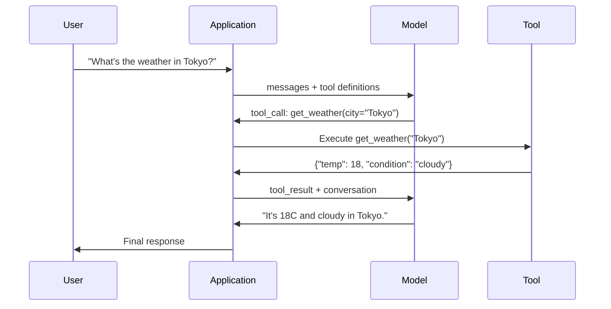

# Chức năng gọi và sử dụng công cụ

> LLM tự thân không thể làm bất cứ điều gì. Chúng tạo văn bản. Đó là toàn bộ năng lực. Chúng không thể xem thời tiết, truy vấn cơ sở dữ liệu. Sending email.

**Type:** Build
**Languages:** Python
**Prerequisites:** Phase 11 Lesson 03 (Structured Outputs)
**Time:** ~75 minutes
**Related:**Giai đoạn 11 · 14 (Mô hình Context Protocol)  当一个工具 需要跨主共享时,应从线上函数调用升级为MCP服务器──本课覆盖线上场景;MCP 覆盖协议 场景──

## Học mục tiêu
- 实现一个函数调用循环:定义工具方案、解析模型的工具调用 JSON、执行函数,并返回结果
- Thiết kế với mô tả rõ ràng và các mô hình thông số được đánh dấu, để mô hình có thể được điều chỉnh đáng tin cậy
- Xây dựng một vòng lặp đại lý đa vòng, qua liên kết nhiều lần gọi chức năng để trả lời các truy vấn phức tạp
-  xử lý chức năng gọi 边界 tình huống: gọi công cụ song song  phát triển lỗi, cũng như ngăn chặn vòng lặp công cụ vô hạn

## 问题
Bạn xây dựng một chatbot. Người dùng hỏi: Thời tiết ở Tokyo là gì ngay bây giờ?

模型回答:Tôi không có quyền truy cập vào dữ liệu thời tiết thời gian thực, nhưng dựa trên mùa, Tokyo có thể là khoảng 15 độ C...

Đó là ảo giác của một người ngoài quần áo. Mô hình không biết thời tiết. Nó sẽ không bao giờ biết. Thời tiết thay đổi mỗi giờ.

Một phần của việc thiếu là: một giao thức cấu trúc, để mô hình có thể nói Tôi cần sử dụng các lập luận này 调用 thời tiết API,并让你的代码执行它,再把结果回模型.

Đây là hàm gọi. mô hình输出 cấu trúc JSON, mô tả cần sử dụng các lập luận nào.

Không có chức năng gọi, LLM là một tập hợp.

## 概念
### Phương pháp gọi vòng lặp

Mỗi lần sử dụng công cụ 交互都遵循同一个五步循环.



Bước 1: người dùng gửi tin nhắn. Bước 2: mô hình nhận tin nhắn và định nghĩa công cụ. Bước 3: mô hình không trực tiếp trả lời văn bản, mà là xuất ra một cuộc gọi công cụ, đó là bao gồm tên chức năng và các đối tượng JSON cấu trúc của các lập luận. Bước 4: Cód của bạn thực hiện chức năng và nắm bắt kết quả. Bước 5: kết quả trở lại cho mô hình, mô hình hiện có dữ liệu thực, có thể tạo ra câu trả lời cuối cùng.

Mô hình không thực hiện bất cứ điều gì. Nó chỉ quyết định điều gì được sử dụng, cũng như những lập luận nào được sử dụng.

### Các định nghĩa công cụ: Hợp đồng JSON Schema

Mỗi công cụ được định nghĩa bởi một JSON Schema, nó cho mô hình biết chức năng này làm gì, nhận được những lập luận nào, cũng như những lập luận này phải là loại gì.

```json
{
  "type": "function",
  "function": {
    "name": "get_weather",
    "description": "Get current weather for a city. Returns temperature in Celsius and conditions.",
    "parameters": {
      "type": "object",
      "properties": {
        "city": {
          "type": "string",
          "description": "City name, e.g. 'Tokyo' or 'San Francisco'"
        },
        "units": {
          "type": "string",
          "enum": ["celsius", "fahrenheit"],
          "description": "Temperature units"
        }
      },
      "required": ["city"]
    }
  }
}
```

`description`Các trường quan trọng. mô hình sẽ đọc chúng, để quyết định khi nào và làm thế nào để sử dụng công cụ. mô tả:

### So sánh nhà cung cấp

Mỗi nhà cung cấp chính đều hỗ trợ gọi chức năng, nhưng bề mặt API có những điểm khác nhau.

| Provider | API Parameter | Tool Call Format | Parallel Calls | Forced Calling |
|----------|--------------|-----------------|---------------|----------------|
| OpenAI (GPT-5, o4) | `tools` | `tool_calls[].function` | Yes (multiple per turn) | `tool_choice="required"` |
| Anthropic (Claude 4.6/4.7) | `tools` | `content[].type="tool_use"` | Yes (multiple blocks) | `tool_choice={"type":"any"}` |
| Google (Gemini 3) | `function_declarations` | `functionCall` | Yes | `function_calling_config` |
| Open-weight (Llama 4, Qwen3, DeepSeek-V3) | Native `tools` on Llama 4; Hermes or ChatML on others | Mixed | Model-dependent | Prompt-based or `tool_choice` if supported |

Đến năm 2026, ba nhà cung cấp đóng cửa đã nhận được gần như giống nhau dựa trên định dạng của JSON Schema.`tools`Field,形状与 OpenAI 匹配──Open-weight fine-tunes 仍然各不相同, trong đó Hermes format(NousResearch) là các hình thức phổ biến nhất trong các hình thức fine-tune của bên thứ ba── đối với các máy chủ chung chia sẻ, ưu tiên sử dụng MCP(Phase 11 · 14), thay vì gọi hàm trực tuyến, vì máy chủ đối với tất cả các máy chủ đều giống nhau──

### Chọn công cụ: tự động, yêu cầu, cụ thể

Bạn có thể kiểm soát mô hình khi sử dụng công cụ.

**Auto**(默认):模型自行决定是调用工具 还是直接答案── 2+2 là gì?会直接答── 天气 là gì?会调用工具──

**Required**Model phải có ít nhất một công cụ. Khi bạn biết người dùng muốn cần công cụ, bạn có thể sử dụng nó. Nó có thể ngăn chặn model không truy vấn dữ liệu thực và đoán trực tiếp.

**Specific function**: Mô hình bắt buộc调用 một chức năng cụ thể.`tool_choice={"type":"function", "function": {"name": "get_weather"}}`Bảo đảm công cụ thời tiết Sẽ được điều chỉnh, bất kể truy vấn là gì. Nó sẽ được sử dụng để định tuyến, đó là logic dòng chảy trên đã quyết định được thiết bị cần thiết nào.

### Hướng gọi hàm song song

GPT-4o 和 Claude có thể trong một lượt 中调用多个功能──用户问:Tình ảnh thời tiết ở Tokyo và New York?模型会同时输出两个工具调用:

```json
[
  {"name": "get_weather", "arguments": {"city": "Tokyo"}},
  {"name": "get_weather", "arguments": {"city": "New York"}}
]
```

Bạn có thể thực hiện hai điều đó (đối hợp lý thì并发执行), trả lại hai kết quả, sau đó mô hình tạo ra một câu trả lời thống nhất.

### Kết quả cấu trúc so với việc gọi chức năng

Bài học 03 覆盖了结构化输出――Fungsi calling 使用相同套 JSON Schema 机制, nhưng mục đích khác nhau――

**Structured outputs**: Mô hình bắt buộc tạo dữ liệu theo hình dạng cụ thể.`{name, price, in_stock}`

**Function calling**Mô hình tuyên bố thực hiện một hành động.`get_weather(city="Tokyo")`, mô hình là yêu cầu một hành động, chứ không phải tạo ra câu trả lời cuối cùng.

Khi bạn cần khai thác dữ liệu, sử dụng các đầu ra có cấu trúc. Khi bạn cần mô hình với hệ thống bên ngoài.

### An ninh: Quy tắc không thể thỏa hiệp

Việc gọi chức năng là khả năng nguy hiểm nhất của LLM. Nếu bộ công cụ của bạn chứa các truy vấn cơ sở dữ liệu,模型 sẽ tạo ra các truy vấn. Nếu nó chứa các lệnh shell,模型 sẽ viết chúng.

**Rule 1: Never pass model-generated SQL directly to a database.**模型可能且确实会生成 DROP TABLE、UNION injections, hoặc trả lại mỗi dòng truy vấn──始终参数化──始终验证──始终使用操作允许──始终使用操作允许──始终使用操作允许──始终使用操作允许──始终验证──始终验证──始终验证──始终验证──始终验证──始终验证──始终验证──始终验证──始终验证──始终验证──始终验证──始终验证──始终验证──始终验证──始终验证──始终验证──始终验证──始终验证──始终验证──始终验证──始终验证──始终验证

**Rule 2: Allowlist functions.**模型 chỉ có thể调用 các chức năng bạn xác định rõ ràng. Không bao giờ xây dựng một công cụ phổ biến  theo tên 执行任意 function. Nếu bạn có 50 chức năng nội bộ, chỉ tiết lộ 5 chức năng mà người dùng cần.

**Rule 3: Validate arguments.**模型可能传入一个城市名称:`"; DROP TABLE users; --"` thực hiện trước cần dựa trên các loại dự đoán, dãy và định dạng 验证 từng lập luận.

**Rule 4: Sanitize tool results.**Nếu công cụ trả lại dữ liệu nhạy cảm (API keys, PII, internal errors), trong đó sẽ đưa ra các kết quả của công cụ trong phản ứng của nó.

**Rule 5: Rate limit tool calls.**处于循环中的模型可能调调用工具 数百次――设置一个最大值(每次对话 10-20次调用是合理的) ――打断无限循环――

### Việc xử lý lỗi

Các công cụ 会失败──API 会超时──Dữ liệu cơ sở dữ liệu 会机──File không tồn tại──Model cần biết công cụ何时失败以及为何失败──

Để lỗi  như kết quả công cụ cấu trúc  trả lại, thay vì loại bỏ ngoại lệ:

```json
{
  "error": true,
  "message": "City 'Toky' not found. Did you mean 'Tokyo'?",
  "code": "CITY_NOT_FOUND"
}
```

模型读取这个结果,调整论点,并重试――Models 很擅长从结构化错误信息中自我纠正──它们不擅长从空响或泛泛的发生错误中恢复──

### MCP: Mô hình giao thức ngữ cảnh

MCP là một tiêu chuẩn mở của sự tương tác công cụ của nhân loại. Nó không cho phép mỗi ứng dụng xác định các công cụ của riêng mình, mà cung cấp một giao thức phổ quát: các công cụ được cung cấp bởi các máy chủ MCP, được cung cấp bởi các khách hàng MCP (như Claude Code, Cursor hoặc ứng dụng của bạn) tiêu thụ.

Một máy chủ MCP có thể được tiếp cận với bất kỳ khách hàng nào có khả năng dung lượng  Khơi bày các công cụ. Một máy chủ MCP sau phát triển  Cho bất kỳ đại lý nào tương thích với MCP  Nhận quyền truy cập cơ sở dữ liệu. Một máy chủ MCP GitHub  Cho bất kỳ đại lý nào Nhận quyền truy cập kho.

MCP 之于函数调用,就像 HTTP 之于网络化──它 tiêu chuẩn hóa lớp vận chuyển, làm cho các công cụ 变得便携式──


```figure
mx-tool-call-loop
```

##  xây dựng nó
### 步骤 1: Định nghĩa sổ đăng ký công cụ

 xây dựng một registry, dùng để định nghĩa công cụ lưu trữ  và các thực hiện của nó.

```python
import json
import math
import time
import hashlib


TOOL_REGISTRY = {}


def register_tool(name, description, parameters, function):
    TOOL_REGISTRY[name] = {
        "definition": {
            "type": "function",
            "function": {
                "name": name,
                "description": description,
                "parameters": parameters,
            },
        },
        "function": function,
    }
```

### 步骤 2: Thực hiện 5 công cụ

Xây dựng một máy tính, tìm kiếm thời tiết, mô phỏng tìm kiếm trên web, đọc tệp và chạy mã.

```python
def calculator(expression, precision=2):
    allowed = set("0123456789+-*/.() ")
    if not all(c in allowed for c in expression):
        return {"error": True, "message": f"Invalid characters in expression: {expression}"}
    try:
        result = eval(expression, {"__builtins__": {}}, {"math": math})
        return {"result": round(float(result), precision), "expression": expression}
    except Exception as e:
        return {"error": True, "message": str(e)}


WEATHER_DB = {
    "tokyo": {"temp_c": 18, "condition": "cloudy", "humidity": 72, "wind_kph": 14},
    "new york": {"temp_c": 22, "condition": "sunny", "humidity": 45, "wind_kph": 8},
    "london": {"temp_c": 12, "condition": "rainy", "humidity": 88, "wind_kph": 22},
    "san francisco": {"temp_c": 16, "condition": "foggy", "humidity": 80, "wind_kph": 18},
    "sydney": {"temp_c": 25, "condition": "sunny", "humidity": 55, "wind_kph": 10},
}


def get_weather(city, units="celsius"):
    key = city.lower().strip()
    if key not in WEATHER_DB:
        suggestions = [c for c in WEATHER_DB if c.startswith(key[:3])]
        return {
            "error": True,
            "message": f"City '{city}' not found.",
            "suggestions": suggestions,
            "code": "CITY_NOT_FOUND",
        }
    data = WEATHER_DB[key].copy()
    if units == "fahrenheit":
        data["temp_f"] = round(data["temp_c"] * 9 / 5 + 32, 1)
        del data["temp_c"]
    data["city"] = city
    return data


SEARCH_DB = {
    "python function calling": [
        {"title": "OpenAI Function Calling Guide", "url": "https://platform.openai.com/docs/guides/function-calling", "snippet": "Learn how to connect LLMs to external tools."},
        {"title": "Anthropic Tool Use", "url": "https://docs.anthropic.com/en/docs/tool-use", "snippet": "Claude can interact with external tools and APIs."},
    ],
    "MCP protocol": [
        {"title": "Model Context Protocol", "url": "https://modelcontextprotocol.io", "snippet": "An open standard for connecting AI models to data sources."},
    ],
    "weather API": [
        {"title": "OpenWeatherMap API", "url": "https://openweathermap.org/api", "snippet": "Free weather API with current, forecast, and historical data."},
    ],
}


def web_search(query, max_results=3):
    key = query.lower().strip()
    for db_key, results in SEARCH_DB.items():
        if db_key in key or key in db_key:
            return {"query": query, "results": results[:max_results], "total": len(results)}
    return {"query": query, "results": [], "total": 0}


FILE_SYSTEM = {
    "data/config.json": '{"model": "gpt-4o", "temperature": 0.7, "max_tokens": 4096}',
    "data/users.csv": "name,email,role\nAlice,alice@example.com,admin\nBob,bob@example.com,user",
    "README.md": "# My Project\nA tool-use agent built from scratch.",
}


def read_file(path):
    if ".." in path or path.startswith("/"):
        return {"error": True, "message": "Path traversal not allowed.", "code": "FORBIDDEN"}
    if path not in FILE_SYSTEM:
        available = list(FILE_SYSTEM.keys())
        return {"error": True, "message": f"File '{path}' not found.", "available_files": available, "code": "NOT_FOUND"}
    content = FILE_SYSTEM[path]
    return {"path": path, "content": content, "size_bytes": len(content), "lines": content.count("\n") + 1}


def run_code(code, language="python"):
    if language != "python":
        return {"error": True, "message": f"Language '{language}' not supported. Only 'python' is available."}
    forbidden = ["import os", "import sys", "import subprocess", "exec(", "eval(", "__import__", "open("]
    for pattern in forbidden:
        if pattern in code:
            return {"error": True, "message": f"Forbidden operation: {pattern}", "code": "SECURITY_VIOLATION"}
    try:
        local_vars = {}
        exec(code, {"__builtins__": {"print": print, "range": range, "len": len, "str": str, "int": int, "float": float, "list": list, "dict": dict, "sum": sum, "min": min, "max": max, "abs": abs, "round": round, "sorted": sorted, "enumerate": enumerate, "zip": zip, "map": map, "filter": filter, "math": math}}, local_vars)
        result = local_vars.get("result", None)
        return {"success": True, "result": result, "variables": {k: str(v) for k, v in local_vars.items() if not k.startswith("_")}}
    except Exception as e:
        return {"error": True, "message": f"{type(e).__name__}: {e}"}
```

### 步骤 3: Đăng ký tất cả các công cụ

```python
def register_all_tools():
    register_tool(
        "calculator", "Evaluate a mathematical expression. Supports +, -, *, /, parentheses, and decimals. Returns the numeric result.",
        {"type": "object", "properties": {"expression": {"type": "string", "description": "Math expression, e.g. '(10 + 5) * 3'"}, "precision": {"type": "integer", "description": "Decimal places in result", "default": 2}}, "required": ["expression"]},
        calculator,
    )
    register_tool(
        "get_weather", "Get current weather for a city. Returns temperature, condition, humidity, and wind speed.",
        {"type": "object", "properties": {"city": {"type": "string", "description": "City name, e.g. 'Tokyo' or 'San Francisco'"}, "units": {"type": "string", "enum": ["celsius", "fahrenheit"], "description": "Temperature units, defaults to celsius"}}, "required": ["city"]},
        get_weather,
    )
    register_tool(
        "web_search", "Search the web for information. Returns a list of results with title, URL, and snippet.",
        {"type": "object", "properties": {"query": {"type": "string", "description": "Search query"}, "max_results": {"type": "integer", "description": "Maximum results to return", "default": 3}}, "required": ["query"]},
        web_search,
    )
    register_tool(
        "read_file", "Read the contents of a file. Returns the file content, size, and line count.",
        {"type": "object", "properties": {"path": {"type": "string", "description": "Relative file path, e.g. 'data/config.json'"}}, "required": ["path"]},
        read_file,
    )
    register_tool(
        "run_code", "Execute Python code in a sandboxed environment. Set a 'result' variable to return output.",
        {"type": "object", "properties": {"code": {"type": "string", "description": "Python code to execute"}, "language": {"type": "string", "enum": ["python"], "description": "Programming language"}}, "required": ["code"]},
        run_code,
    )
```

### 步骤 4: Xây dựng hàm gọi vòng

Đó là động cơ cốt lõi. Nó mô hình mô hình quyết định sử dụng công cụ nào, thực hiện công cụ đó, và sẽ có kết quả.

```python
def simulate_model_decision(user_message, tools, conversation_history):
    msg = user_message.lower()

    if any(word in msg for word in ["weather", "temperature", "forecast"]):
        cities = []
        for city in WEATHER_DB:
            if city in msg:
                cities.append(city)
        if not cities:
            for word in msg.split():
                if word.capitalize() in [c.title() for c in WEATHER_DB]:
                    cities.append(word)
        if not cities:
            cities = ["tokyo"]
        calls = []
        for city in cities:
            calls.append({"name": "get_weather", "arguments": {"city": city.title()}})
        return calls

    if any(word in msg for word in ["calculate", "compute", "math", "what is", "how much"]):
        for token in msg.split():
            if any(c in token for c in "+-*/"):
                return [{"name": "calculator", "arguments": {"expression": token}}]
        if "+" in msg or "-" in msg or "*" in msg or "/" in msg:
            expr = "".join(c for c in msg if c in "0123456789+-*/.() ")
            if expr.strip():
                return [{"name": "calculator", "arguments": {"expression": expr.strip()}}]
        return [{"name": "calculator", "arguments": {"expression": "0"}}]

    if any(word in msg for word in ["search", "find", "look up", "google"]):
        query = msg.replace("search for", "").replace("look up", "").replace("find", "").strip()
        return [{"name": "web_search", "arguments": {"query": query}}]

    if any(word in msg for word in ["read", "file", "open", "cat", "show"]):
        for path in FILE_SYSTEM:
            if path.split("/")[-1].split(".")[0] in msg:
                return [{"name": "read_file", "arguments": {"path": path}}]
        return [{"name": "read_file", "arguments": {"path": "README.md"}}]

    if any(word in msg for word in ["run", "execute", "code", "python"]):
        return [{"name": "run_code", "arguments": {"code": "result = 'Hello from the sandbox!'", "language": "python"}}]

    return []


def execute_tool_call(tool_call):
    name = tool_call["name"]
    args = tool_call["arguments"]

    if name not in TOOL_REGISTRY:
        return {"error": True, "message": f"Unknown tool: {name}", "code": "UNKNOWN_TOOL"}

    tool = TOOL_REGISTRY[name]
    func = tool["function"]
    start = time.time()

    try:
        result = func(**args)
    except TypeError as e:
        result = {"error": True, "message": f"Invalid arguments: {e}"}

    elapsed_ms = round((time.time() - start) * 1000, 2)
    return {"tool": name, "result": result, "execution_time_ms": elapsed_ms}


def run_function_calling_loop(user_message, max_iterations=5):
    conversation = [{"role": "user", "content": user_message}]
    tool_definitions = [t["definition"] for t in TOOL_REGISTRY.values()]
    all_tool_results = []

    for iteration in range(max_iterations):
        tool_calls = simulate_model_decision(user_message, tool_definitions, conversation)

        if not tool_calls:
            break

        results = []
        for call in tool_calls:
            result = execute_tool_call(call)
            results.append(result)

        conversation.append({"role": "assistant", "content": None, "tool_calls": tool_calls})

        for result in results:
            conversation.append({"role": "tool", "content": json.dumps(result["result"]), "tool_name": result["tool"]})

        all_tool_results.extend(results)
        break

    return {"conversation": conversation, "tool_results": all_tool_results, "iterations": iteration + 1 if tool_calls else 0}
```

### 步骤 5: Định giá lý lẽ

构建一个验证器,在执行前根据 JSON Schema 检查工具调用参数。

```python
def validate_tool_arguments(tool_name, arguments):
    if tool_name not in TOOL_REGISTRY:
        return [f"Unknown tool: {tool_name}"]

    schema = TOOL_REGISTRY[tool_name]["definition"]["function"]["parameters"]
    errors = []

    if not isinstance(arguments, dict):
        return [f"Arguments must be an object, got {type(arguments).__name__}"]

    for required_field in schema.get("required", []):
        if required_field not in arguments:
            errors.append(f"Missing required argument: {required_field}")

    properties = schema.get("properties", {})
    for arg_name, arg_value in arguments.items():
        if arg_name not in properties:
            errors.append(f"Unknown argument: {arg_name}")
            continue

        prop_schema = properties[arg_name]
        expected_type = prop_schema.get("type")

        type_checks = {"string": str, "integer": int, "number": (int, float), "boolean": bool, "array": list, "object": dict}
        if expected_type in type_checks:
            if not isinstance(arg_value, type_checks[expected_type]):
                errors.append(f"Argument '{arg_name}': expected {expected_type}, got {type(arg_value).__name__}")

        if "enum" in prop_schema and arg_value not in prop_schema["enum"]:
            errors.append(f"Argument '{arg_name}': '{arg_value}' not in {prop_schema['enum']}")

    return errors
```

### 步骤 6: Run Demo

```python
def run_demo():
    register_all_tools()

    print("=" * 60)
    print("  Function Calling & Tool Use Demo")
    print("=" * 60)

    print("\n--- Registered Tools ---")
    for name, tool in TOOL_REGISTRY.items():
        desc = tool["definition"]["function"]["description"][:60]
        params = list(tool["definition"]["function"]["parameters"].get("properties", {}).keys())
        print(f"  {name}: {desc}...")
        print(f"    params: {params}")

    print(f"\n--- Argument Validation ---")
    validation_tests = [
        ("get_weather", {"city": "Tokyo"}, "Valid call"),
        ("get_weather", {}, "Missing required arg"),
        ("get_weather", {"city": "Tokyo", "units": "kelvin"}, "Invalid enum value"),
        ("calculator", {"expression": 123}, "Wrong type (int for string)"),
        ("unknown_tool", {"x": 1}, "Unknown tool"),
    ]
    for tool_name, args, label in validation_tests:
        errors = validate_tool_arguments(tool_name, args)
        status = "VALID" if not errors else f"ERRORS: {errors}"
        print(f"  {label}: {status}")

    print(f"\n--- Tool Execution ---")
    direct_tests = [
        {"name": "calculator", "arguments": {"expression": "(10 + 5) * 3 / 2"}},
        {"name": "get_weather", "arguments": {"city": "Tokyo"}},
        {"name": "get_weather", "arguments": {"city": "Mars"}},
        {"name": "web_search", "arguments": {"query": "python function calling"}},
        {"name": "read_file", "arguments": {"path": "data/config.json"}},
        {"name": "read_file", "arguments": {"path": "../etc/passwd"}},
        {"name": "run_code", "arguments": {"code": "result = sum(range(1, 101))"}},
        {"name": "run_code", "arguments": {"code": "import os; os.system('rm -rf /')"}},
    ]
    for call in direct_tests:
        result = execute_tool_call(call)
        print(f"\n  {call['name']}({json.dumps(call['arguments'])})")
        print(f"    -> {json.dumps(result['result'], indent=None)[:100]}")
        print(f"    time: {result['execution_time_ms']}ms")

    print(f"\n--- Full Function Calling Loop ---")
    test_queries = [
        "What's the weather in Tokyo?",
        "Calculate (100 + 250) * 0.15",
        "Search for MCP protocol",
        "Read the config file",
        "Run some Python code",
        "Tell me a joke",
    ]
    for query in test_queries:
        print(f"\n  User: {query}")
        result = run_function_calling_loop(query)
        if result["tool_results"]:
            for tr in result["tool_results"]:
                print(f"    Tool: {tr['tool']} ({tr['execution_time_ms']}ms)")
                print(f"    Result: {json.dumps(tr['result'], indent=None)[:90]}")
        else:
            print(f"    [No tool called -- direct response]")
        print(f"    Iterations: {result['iterations']}")

    print(f"\n--- Parallel Tool Calls ---")
    multi_city_query = "What's the weather in tokyo and london?"
    print(f"  User: {multi_city_query}")
    result = run_function_calling_loop(multi_city_query)
    print(f"  Tool calls made: {len(result['tool_results'])}")
    for tr in result["tool_results"]:
        city = tr["result"].get("city", "unknown")
        temp = tr["result"].get("temp_c", "N/A")
        print(f"    {city}: {temp}C, {tr['result'].get('condition', 'N/A')}")

    print(f"\n--- Security Checks ---")
    security_tests = [
        ("read_file", {"path": "../../etc/passwd"}),
        ("run_code", {"code": "import subprocess; subprocess.run(['ls'])"}),
        ("calculator", {"expression": "__import__('os').system('ls')"}),
    ]
    for tool_name, args in security_tests:
        result = execute_tool_call({"name": tool_name, "arguments": args})
        blocked = result["result"].get("error", False)
        print(f"  {tool_name}({list(args.values())[0][:40]}): {'BLOCKED' if blocked else 'ALLOWED'}")
```

## Sử dụng nó
### OpenAI Calling Function

```python
# from openai import OpenAI
#
# client = OpenAI()
#
# tools = [{
#     "type": "function",
#     "function": {
#         "name": "get_weather",
#         "description": "Get current weather for a city",
#         "parameters": {
#             "type": "object",
#             "properties": {
#                 "city": {"type": "string"},
#                 "units": {"type": "string", "enum": ["celsius", "fahrenheit"]}
#             },
#             "required": ["city"]
#         }
#     }
# }]
#
# response = client.chat.completions.create(
#     model="gpt-4o",
#     messages=[{"role": "user", "content": "Weather in Tokyo?"}],
#     tools=tools,
#     tool_choice="auto",
# )
#
# tool_call = response.choices[0].message.tool_calls[0]
# args = json.loads(tool_call.function.arguments)
# result = get_weather(**args)
#
# final = client.chat.completions.create(
#     model="gpt-4o",
#     messages=[
#         {"role": "user", "content": "Weather in Tokyo?"},
#         response.choices[0].message,
#         {"role": "tool", "tool_call_id": tool_call.id, "content": json.dumps(result)},
#     ],
# )
# print(final.choices[0].message.content)
```

OpenAI sẽ gọi công cụ  trả lại cho `response.choices[0].message.tool_calls` Mỗi cuộc gọi đều có một`id`, bạn phải có nó khi trả lời kết quả. mô hình sử dụng ID này sẽ kết quả phù hợp với các cuộc gọi. GPT-4o có thể trả lời nhiều cuộc gọi trong một phản ứng, cần phải trải qua và thực hiện tất cả các cuộc gọi.

### Sử dụng công cụ nhân loại

```python
# import anthropic
#
# client = anthropic.Anthropic()
#
# response = client.messages.create(
#     model="claude-sonnet-4-20250514",
#     max_tokens=1024,
#     tools=[{
#         "name": "get_weather",
#         "description": "Get current weather for a city",
#         "input_schema": {
#             "type": "object",
#             "properties": {
#                 "city": {"type": "string"},
#                 "units": {"type": "string", "enum": ["celsius", "fahrenheit"]}
#             },
#             "required": ["city"]
#         }
#     }],
#     messages=[{"role": "user", "content": "Weather in Tokyo?"}],
# )
#
# tool_block = next(b for b in response.content if b.type == "tool_use")
# result = get_weather(**tool_block.input)
#
# final = client.messages.create(
#     model="claude-sonnet-4-20250514",
#     max_tokens=1024,
#     tools=[...],
#     messages=[
#         {"role": "user", "content": "Weather in Tokyo?"},
#         {"role": "assistant", "content": response.content},
#         {"role": "user", "content": [{"type": "tool_result", "tool_use_id": tool_block.id, "content": json.dumps(result)}]},
#     ],
# )
```

Anthropic sẽ gọi công cụ  quay lại vì带有 `type: "tool_use"`Các khối nội dung của công cụ kết quả  đặt 带有`type: "tool_result"`█████████████████████████████████████████████████████████████████████████████████████████████████████████████████████████████████████████████████████████████████████████████████████████████████████████████████████████████████████████████████████████████████████████████████████████████████████████████████████████████████████████████████████████████████████████████████████████████████████████████████████████████████████████████████████████████████████████████████████████████████████████████████████████████`input_schema`定义 các tham số công cụ, còn OpenAI sử dụng `parameters`

### Kết hợp MCP

```python
# MCP servers expose tools over a standardized protocol.
# Any MCP-compatible client can discover and call these tools.
#
# Example: connecting to a Postgres MCP server
#
# from mcp import ClientSession, StdioServerParameters
# from mcp.client.stdio import stdio_client
#
# server_params = StdioServerParameters(
#     command="npx",
#     args=["-y", "@modelcontextprotocol/server-postgres", "postgresql://localhost/mydb"],
# )
#
# async with stdio_client(server_params) as (read, write):
#     async with ClientSession(read, write) as session:
#         await session.initialize()
#         tools = await session.list_tools()
#         result = await session.call_tool("query", {"sql": "SELECT count(*) FROM users"})
```

MCP sẽ triển khai công cụ và tiêu thụ công cụ 解──Postgres server 了解 SQL──GitHub server 了解 API──你的代理 只是发现并调用工具,它不需要每个集成──编写供应商特定代码──

## 交付 nó
本课会产出 `outputs/prompt-tool-designer.md`, đây là một mẫu đơn giản có thể sử dụng để thiết kế định nghĩa công cụ. Cho nó một mô tả về công cụ bạn muốn làm gì, nó sẽ tạo ra định nghĩa JSON Schema đầy đủ, bao gồm mô tả, kiểu và hạn chế.

Nó sẽ xuất hiện.`outputs/skill-function-calling-patterns.md`, Đây là một khung quyết định được sử dụng trong sản xuất để thực hiện gọi chức năng, bao gồm thiết kế công cụ, xử lý lỗi, an ninh và các mô hình cụ thể cho nhà cung cấp.

## 练习
1. **Add a 6th tool: database query.**实现一个模拟 SQL tool, sử dụng trong bộ nhớ bảng。该工具接收表名 和过条件(不是原始SQL)。验证表名 位于允许列中,并且过操作员 仅限于`=``>``<``>=``<=`△ sẽ phù hợp hàng 作为 JSON 返回──

2. **Implement retry with error feedback.**Khi công cụ gọi 失败时(ví dụ thành phố không được tìm thấy),把 lỗi thông báo 回 mô hình quyết định chức năng,并让它 sửa chữa các lập luận──记录 mỗi cuộc gọi 需要多少次重试──为每一个工具调用 设置最多3次重试──

3. **Build a multi-step agent.**某些 queries 需要串联工具调用:Đọc tập tin cấu hình và cho tôi biết mô hình nào được cấu hình, sau đó tìm kiếm trên web về giá của mô hình đó. 实现一个循环,持续运行直到模型决定不再需要工具,并把累积结果传进每个决策步――限制为10次回复,以防止无限循环──

4. **Measure tool selection accuracy.**创建 30 带有预期工具名的测试查询── 在全部30 查询 上运行你的决策功能,并衡量它选择正确工具的比例──识别哪些查询最容易导致工具之间的混──

5. **Implement tool call caching.**Nếu cùng một công cụ trong 60 giây được sử dụng với cùng một lập luận, thì trả lại kết quả được lưu trữ trong cache, thay vì tái thực hiện.`(tool_name, frozenset(args.items()))`为 key 的字典──衡量包含 20 个查询 的对话 中的缓存击率──

## 关键术语
| Term | What people say | What it actually means |
|------|----------------|----------------------|
| Function calling | “Tool use” | 模型输出结构化 JSON，描述要用特定 arguments 调用的 function，由你的代码执行，而不是模型执行 |
| Tool definition | “Function schema” | 一个 JSON Schema object，描述 tool 的 name、purpose、parameters 和 types，模型读取它来决定何时以及如何使用该 tool |
| Tool choice | “Calling mode” | 控制模型必须调用 tool（required）、可以调用 tool（auto），还是必须调用特定 tool（named） |
| Parallel calling | “Multi-tool” | 模型在单个 turn 中输出多个 tool calls，从而减少 round trips，GPT-4o 和 Claude 都支持这一点 |
| Tool result | “Function output” | 执行 tool 后得到的 return value，作为 message 发回模型，使它能在 response 中使用真实数据 |
| Argument validation | “Input checking” | 在执行 tool 前，验证模型生成的 arguments 是否匹配预期 types、ranges 和 constraints |
| MCP | “Tool protocol” | Model Context Protocol，即 Anthropic 的 open standard，用于通过 servers 暴露 tools，让任何兼容 client 都能发现并调用 |
| Agent loop | “ReAct loop” | model-decides-tool、code-executes-tool、result-feeds-back 的迭代循环，直到模型拥有足够信息作出回答 |
| Tool poisoning | “Prompt injection via tools” | 一种攻击，其中 tool results 包含会操纵模型行为的 instructions，因此要 sanitize 所有 tool outputs |
| Rate limiting | “Call budget” | 设置每个 conversation 中 tool calls 的最大数量，以防止 infinite loops 和失控的 API costs |

## 延伸阅读
- [OpenAI Function Calling Guide](https://platform.openai.com/docs/guides/function-calling) Sử dụng GPT-4o  quyền sử dụng công cụ, bao gồm các cuộc gọi song song ∞ gọi buộc và các lập luận có cấu trúc
- [Anthropic Tool Use Guide](https://docs.anthropic.com/en/docs/tool-use) Claude sử dụng công cụ 实现, bao gồm input_schema、multi-tool respons 和 tool_choice cấu hình
- [Model Context Protocol Specification](https://modelcontextprotocol.io) 跨 AI ứng dụng của công cụ tương tác mở tiêu chuẩn, bao gồm các máy chủ / khách hàng kiến trúc
- [Schick et al., 2023 — “Toolformer: Language Models Can Teach Themselves to Use Tools”](https://arxiv.org/abs/2302.04761)  Về việc đào tạo LLM quyết định khi nào và làm thế nào để sử dụng các công cụ bên ngoài
- [Patil et al., 2023 — “Gorilla: Large Language Model Connected with Massive APIs”](https://arxiv.org/abs/2305.15334)  Định nghĩa API của các API 1.645  gọi chính xác API đối với LLM  để điều chỉnh tinh tế, và giảm ảo giác
- [Berkeley Function Calling Leaderboard](https://gorilla.cs.berkeley.edu/leaderboard.html) 实时基准, đối với GPT-4o、Claude、Gemini và mô hình mở tính chính xác gọi hàm
- [Yao et al., “ReAct: Synergizing Reasoning and Acting in Language Models” (ICLR 2023)](https://arxiv.org/abs/2210.03629) Thought-Action-Observation loop, nó là mỗi lần gọi công cụ ngoài tầng của agent loop; 本课结束的处处,正是阶段14 接续的处处.
- [Anthropic — Building effective agents (Dec 2024)](https://www.anthropic.com/research/building-effective-agents) Từ một công cụ sử dụng nguyên thủy 构建出五种可组合模式 ((quan hệ lập tức, định tuyến, song song, nhạc công, người đánh giá-optimizer) 
