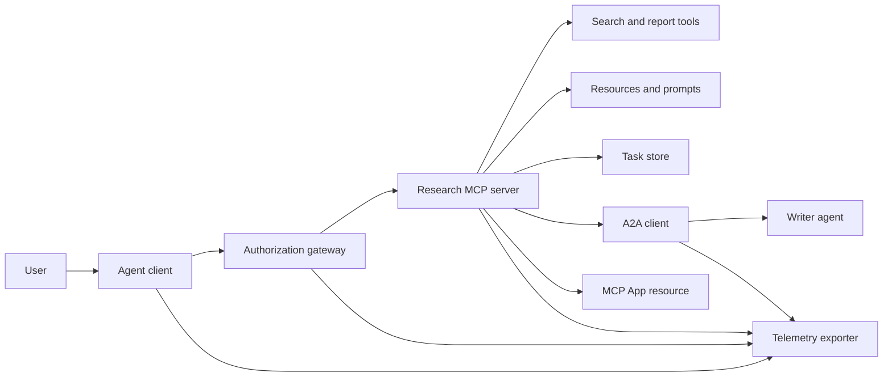
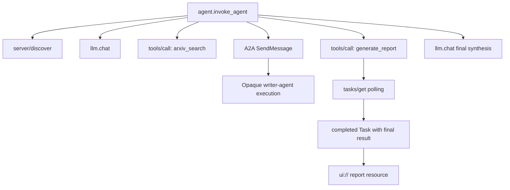
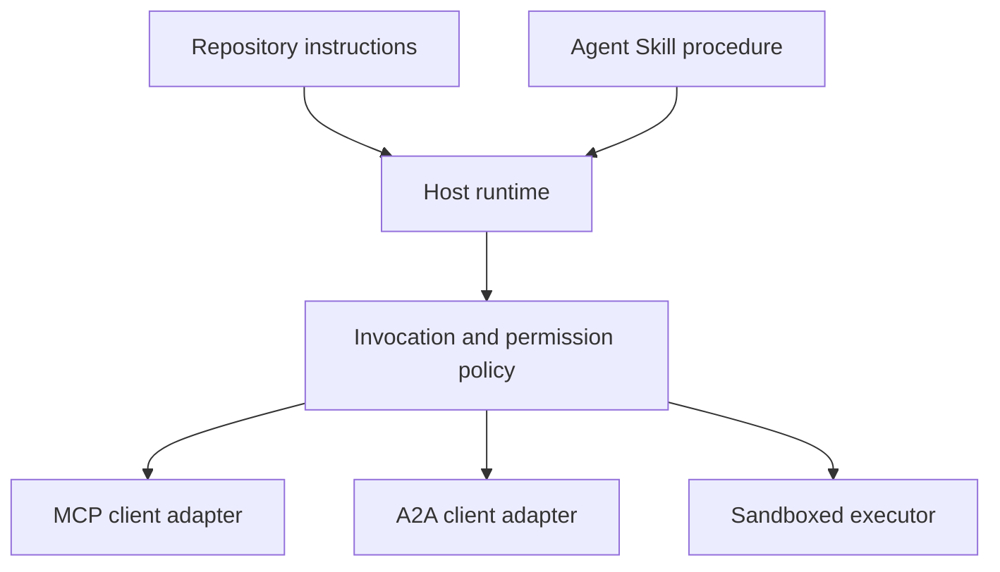

# 综合实战项目:无状态工具生态系统

> Các hệ thống đại lý sản xuất là một tập hợp của các biên giới rõ ràng, nhưng không đặc trưng đơn giản.

**Type:** Build
**Languages:** Python (stdlib, in-process simulation)
**Prerequisites:** Phase 13 · 01 through 22, using MCP revision `2026-07-28`
**Time:** ~120 minutes

## Học mục tiêu

- Để sử dụng công cụ 调用 任务级结果 跨代理 委托 UI 资源 授权策略及分布式追踪记录有机融合成单流水线――
- Trong mỗi MCP yêu cầu trong nghiêm ngặt mang theo phiên bản giao ước, danh tính và khả năng của khách hàng, hoàn toàn từ bỏ sự phụ thuộc vào các cuộc họp cấp truyền.
- Trong khi đó, các công ty đã được triển khai để phát triển các công ty.
- 清晰区分符合协议形态的本地模拟 (nước tính hình thức mô phỏng) với thực tế MCP、A2A、OAuth 及 OpenTelemetry 生产实现──
- Để xác định rõ ràng mỗi giới hạn trừu tượng trong mô phỏng, cần phải thay thế các thành phần vật lý trong sản xuất.
- 确保 `AGENTS.md`、Công viên Kỹ năng、运行时适配器、工具 及安全策略 │
- 明确 chỉ ra những tuyên bố kỹ thuật có thể được trực tiếp xuất ra bằng chứng địa phương, những gì phải phụ thuộc vào thực tế kết thúc kết thúc tập hợp thử nghiệm.

## 问题

 thiết kế một hệ thống nghiên cứu và báo cáo: User request query about agent 通信协议的论文──系统检查论文目录、委托编写总结、生成分析报告、返回 UI 交互资源,并完整记录系统执行的链路踪迹──

Câu nói này có vẻ đơn giản, thực tế ẩn chứa nhiều hiệp ước độc lập với nhau:

- 面向模型的工具方案声明;
- 无状态请求信封与服务发现契约;
- 针对主体 (主体) ‧ ‧ ‧ phạm vi và công cụ ‧ 身份的网关决策;
- 长周期任务操作契约;
- 跨 agent 委托协作协议(A2A);
- Cầu giao thông giữa 宿主与前端应用 (MCP App)
- 链路追踪的上下文传播与导出;
- 可复用标准化操作规程 (có khả năng)

`code/main.py`Sử dụng phông hàm và thư ký Python làm cho biên giới trên rõ ràng có thể nhìn thấy. Nó không mở mạng giám sát, không thực sự yêu cầu arXiv, không thực hiện thực tế OAuth, không sử dụng A2A dịch vụ, không làm cho MCP App, cũng không xuất khẩu dữ liệu từ xa. Điều này giúp kiểm soát dòng chảy rất dễ dàng đơn giản và dễ hiểu, đồng thời tránh được sai lầm trong các dịch vụ sản xuất phù hợp với quy tắc.

## 概念

### 目标架构



Các cấu trúc này là một bộ hợp khái niệm về mô hình giao ước tiêu chuẩn công cộng, không phải là một thực hiện riêng tư trong bất kỳ sản phẩm độc quyền nào.

### 目标 phân tán theo dõi



Trong thực tế, mỗi bước nhảy trên mạng đều phải được truyền tải đúng trên theo dõi.

### 当前协议交互表面

Sử dụng tên của phương pháp được định nghĩa trong quy định mới nhất hiện tại, không thể theo dõi những ký ức trong bản thảo cũ:

| 边界 | 当前标准交互表面 | 本实战项目的本地模拟实现 |
|---|---|---|
| MCP 服务发现 | 强制性的 `server/discover` | 返回版本、capabilities 和服务器身份的直接函数 |
| MCP 请求上下文 | 每个 `params._meta` 均携带版本、capabilities 及客户端信息 | 传递给每次模拟调用的全新请求元数据 |
| MCP 工具调用 | `tools/call` | Python 本地函数直接分发 |
| MCP 任务轮询 | `io.modelcontextprotocol/tasks` 扩展与 `tasks/get` | 先返回处理中的任务句柄，后返回内联最终结果的完成任务 |
| A2A 跨代理委托 | gRPC 和 JSON-RPC 中为 `SendMessage`；HTTP+JSON 中为 `POST /message:send` | 无远程调用与人为延迟的单层嵌套 Span |
| MCP App 调用宿主工具 | `app.callServerTool({ name, arguments })` | 无实时通信桥梁的纯 HTML 字符串 |
| OAuth 鉴权 | 授权服务器、受保护资源元数据、Audience 与 Scope 校验 | 静态 Token 字典查找与 Scope 集合判断 |
| OpenTelemetry | SDK、传播器（Propagator）、导出器（Exporter）及收集器（Collector） | 纯内存 Span 字典数组 |

协议名称 chỉ là biểu tượng bên ngoài nhất. 协议名称仅仅是最外层的表象. 协议测试必须覆盖真实网络线缆上的序列化反序列化. 协议名称仅仅是最外层的表象. 协议测试必须覆盖真实网络线缆上的序列化反序列化. 协议测试不成功. 协议测试不断. 协议重试以及协议多版本兼容.

### 无状态 MCP 重构集成边界

`2026-07-28`修订版本 hoàn toàn di chuyển phiên giao ước và `initialize`- `notifications/initialized`握手阶段──同时废除 `Mcp-Session-Id` Mọi người đều yêu cầu `params._meta`中携带如下命名空间字段:

```json
{
  "io.modelcontextprotocol/protocolVersion": "2026-07-28",
  "io.modelcontextprotocol/clientCapabilities": {
    "extensions": {
      "io.modelcontextprotocol/tasks": {}
    }
  },
  "io.modelcontextprotocol/clientInfo": {
    "name": "capstone-client",
    "version": "1.0.0"
  }
}
```

服务端 phải được thực hiện `server/discover`◊ thường规结果使用 `resultType: "complete"`; quay lại nhiệm vụ句柄时使用 `resultType: "task"` Mỗi kết quả đều nên ở `_meta.io.modelcontextprotocol/serverInfo`Trung biểu lộ dịch vụ tự mình danh tính.

Nhiệm vụ 扩展包含 `tasks/get``tasks/update`Và `tasks/cancel`✿ Công cụ 首次调用可以回来 `resultType: "task"`; và tiếp theo`tasks/get`本身回归 `resultType: "complete"`, và hoàn thành `Task`đối tượng trực tiếp trong liên kết cuối cùng kinh doanh xuất khẩu.`tasks/result`Với`tasks/list`已被彻底移除. 客户端 phải nhận được cùng một yêu cầu trong yêu cầu hỗ trợ.`io.modelcontextprotocol/tasks`扩展; Nếu chưa tuyên bố,端服务将返回 `-32021`错误, và `requiredCapabilities`Trung明指出缺失的扩展项──

###  安全态势 (Tình trạng an ninh)

预期的生产部署环境必须采用全深防御:

-                                                                                                                                                                                                                                                                                                                                                                                                                                                                                                                              
- 为签发的 Access Token 强制实施资源 (tài nguyên) 与受众 (khán giả) 绑定;
- 网关 dựa trên vai trò nghiêm ngặt được sử dụng công cụ và phạm vi quyền hạn;
-  truy cập vào API chính của API nghiêm cấm được phơi bày trong mô hình có thể nhìn thấy trên văn bản bên dưới;
- 严格锁定并审查 công cụ 描述元数据清单(Manifest);
- 针对 không tin vào, dữ liệu nhạy cảm và ảnh hưởng bên ngoài lớn thực hiện toàn diện 两人法则(Rule of Two);
- Trong một hộp thực hiện riêng biệt, hạn chế hệ thống tài liệu, quy trình, mạng, giấy phép và tiêu thụ tài nguyên, phải được giới hạn trong hiệu lực bắt buộc của Bộ Khả năng bên ngoài.

Bài học này chỉ thực hiện các mã biểu tượng tĩnh ỹ ỹ ỹ ỹ ỹ ỹ ỹ ỹ ỹ ỹ ỹ ỹ ỹ ỹ ỹ ỹ ỹ ỹ ỹ ỹ ỹ ỹ ỹ ỹ ỹ ỹ ỹ ỹ ỹ ỹ ỹ ỹ ỹ ỹ ỹ ỹ ỹ ỹ ỹ ỹ ỹ ỹ ỹ ỹ ỹ ỹ ỹ ỹ ỹ ỹ ỹ ỹ ỹ ỹ ỹ ỹ ỹ ỹ ỹ ỹ ỹ ỹ ỹ ỹ ỹ ỹ ỹ ỹ ỹ ỹ ỹ ỹ ỹ ỹ ỹ ỹ ỹ ỹ ỹ ỹ ỹ ỹ ỹ ỹ ỹ ỹ ỹ ỹ ỹ ỹ ỹ ỹ ỹ ỹ ỹ ỹ ỹ ỹ ỹ ỹ ỹ ỹ ỹ ỹ ỹ ỹ ỹ ỹ ỹ ỹ ỹ ỹ ỹ ỹ ỹ ỹ ỹ ỹ ỹ ỹ ỹ ỹ ỹ ỹ ỹ ỹ ỹ ỹ ỹ ỹ ỹ ỹ ỹ ỹ ỹ ỹ ỹ ỹ ỹ ỹ ỹ ỹ ỹ ỹ ỹ ỹ ỹ ỹ ỹ ỹ ỹ ỹ ỹ ỹ ỹ ỹ ỹ ỹ ỹ ỹ ỹ ỹ ỹ ỹ ỹ ỹ ỹ ỹ ỹ ỹ ỹ ỹ ỹ ỹ ỹ ỹ ỹ ỹ ỹ ỹ ỹ ỹ ỹ ỹ ỹ ỹ ỹ ỹ ỹ ỹ ỹ ỹ ỹ ỹ ỹ ỹ ỹ ỹ ỹ ỹ ỹ ỹ ỹ ỹ ỹ ỹ ỹ ỹ ỹ ỹ ỹ ỹ

### Kỹ năng là quy tắc hoạt động, chứ không phải truyền tải mạng

Agent Skill được sử dụng để nói với bạn khi vận hành làm thế nào để thúc đẩy nghiên cứu công trình, dự kiến phù hợp với các công cụ, thỏa thuận, chứng chỉ kiểm toán quy trình và khi nào kết thúc nhiệm vụ.



Khi quy định hoạt động cần trích dẫn tài liệu tài nguyên phụ, phải được phát triển theo hình thức tài liệu kỹ năng đầy đủ. Các thành phần tài liệu đơn được giao sớm trong khóa học này thuộc về biểu đồ biểu diễn của khóa học, không thể làm bằng chứng của tổ chức hỗ trợ gói chương trình chung.

### 课程产物元数据 là bộ điều chỉnh địa phương

Các chỉ mục và thiết bị của khóa học này có thể nhận dạng tên gọi`skill-*.md`Các tài liệu đơn giản, nhưng thuộc về các dự án cụ thể của kho này, chứ không phải là thông dụng Cơ quan kỹ năng 跨平台标准规范―― của khóa học tối giản tiên quyết 解析器 chỉ có thể đọc tên khóa cấp trên. Vì vậy, bài học này sẽ được chuyển giao tiêu chuẩn字段 với các khóa học chuyên dụng字段 để giữ trong cùng lớp:

```yaml
---
name: ecosystem-blueprint
description: Produce a full Phase 13 ecosystem architecture for a product need.
version: "1.0.0"
phase: "13"
lesson: "23"
tags: [mcp, capstone, ecosystem, architecture, a2a, otel]
---
```

`name`Với`description`là một tiêu chuẩn có thể được chuyển hóa.`version``phase``lesson`和 `tags`☐ hướng tới chương trình lập trình mục đích mở rộng ☐ ☐ ☐ ☐ ☐ ☐ ☐ ☐ ☐ ☐ ☐ ☐ ☐ ☐ ☐ ☐ ☐ ☐ ☐ ☐ ☐ ☐ ☐ ☐ ☐ ☐ ☐ ☐ ☐ ☐ ☐ ☐ ☐ ☐ ☐ ☐ ☐ ☐ ☐ ☐ ☐ ☐ ☐ ☐ ☐ ☐ ☐ ☐ ☐ ☐ ☐ ☐ ☐ ☐ ☐ ☐ ☐ ☐ ☐ ☐ ☐ ☐ ☐ ☐ ☐ ☐ ☐ ☐ ☐ ☐ ☐ ☐ ☐ ☐ ☐ ☐ ☐ ☐ ☐ ☐ ☐ ☐ ☐ ☐ ☐ ☐ ☐ ☐ ☐ ☐ ☐ ☐ ☐ ☐ ☐ ☐ ☐ ☐ ☐ ☐ ☐ ☐ ☐ ☐ ☐ ☐ ☐ ☐ ☐ ☐ ☐ ☐ ☐ ☐ ☐ ☐ ☐ ☐ ☐ ☐ ☐ ☐ ☐ ☐ ☐ ☐ ☐ ☐ ☐ ☐ ☐ ☐ ☐ ☐ ☐ ☐ ☐ ☐ ☐ ☐ ☐ ☐ ☐ ☐ ☐ ☐ ☐ ☐ ☐ ☐ ☐ ☐ ☐ ☐ ☐ ☐ ☐ ☐ ☐ ☐ ☐ ☐ ☐ ☐ ☐ ☐ ☐ ☐ ☐ ☐ ☐ ☐ ☐ ☐ ☐ ☐ ☐ ☐ ☐ ☐ ☐ ☐ ☐ ☐ ☐ ☐ ☐ ☐ ☐`tags`写为单行内联数组, để `--tag capstone`准确匹配.

标准的可移植目录 Khả năng có thể sử dụng có thể chọn `metadata`字典存放自定义扩展数据──但在本仓库单文件中,如果将`version`Hoặc`tags`嵌套缩进写入 `metadata`内部,极简解析器会直接忽略, dẫn đến không thể lấy được phiên bản số và thẻ quá失效;; nhà sản xuất chủ nhà nên sử dụng an toàn nghiêm ngặt của YAML 解析器并校验其正式声明的 Schema;;

### Tương đương với môi trường sản xuất thực tế

| 架构分层 | `code/main.py` 实现 | 生产落地替换方案 | 必须出示的验收证据 |
|---|---|---|---|
| 服务发现 | `server_discover()` 加静态 `TOOLS` | `server/discover` 配合带缓存的 `tools/list` | 报文轨迹、确定性排序与 Schema 校验 |
| 身份认证 | 基于 Token 的内存字典 | 独立的 OAuth 授权服务器与资源服务器验证 | 签发者、受众、Scope、过期与故障降级测试 |
| 授权鉴权 | Scope 集合成员判定 | 绑定主体、tool、目标和租户的网关策略 | 允许与拒绝分支的完整审计日志用例 |
| 论文检索 | 静态论文测试夹具（Fixtures） | 真实检索 API 或专门的 MCP Server | 数据溯源、排序打分与网络异常测试 |
| 异步任务 | 本地句柄加立即 `tasks/get` | 持久化 `io.modelcontextprotocol/tasks` 存储，实现 get/update/cancel 与 TTL | 状态迁移、用户输入、取消及宕机恢复测试 |
| 跨 Agent 委托 | 本地 Sleep 加嵌套 Span | 真实的 A2A 客户端与远程 Agent Card | 契约校验、超时重试与不透明执行测试 |
| 前端交互 App | HTML 字符串与 URI 协议头 | MCP Apps 资源与官方 `App` 通信桥梁 | CSP 安全策略、权限受控、tool 调用与浏览器渲染测试 |
| 链路遥测 | 内存 Python 字典列表 | 完整的 OTel SDK 与远程导出器（Exporter） | 收集端接收凭证与父子 Span 关联断言 |
| 执行沙箱 | 无 | 宿主强制隔离的安全沙箱执行器 | 沙箱逃逸、出站网络、敏感凭证与资源上限测试 |

Các đối số biểu tượng cấu thành kết nối kỹ thuật của biên giới rõ ràng.

### Giai đoạn 13 全景知识图谱

| 课次区间 | 核心贡献与架构职责 |
|---|---|
| 01-05 | Tool 接口标准、模型调用、Schema 设计、结构化输出及确定性校验 |
| 06-14 | 无状态 MCP 请求信封、服务发现、底层传输、资源、Prompt、扩展及 Apps |
| 15-18 | 防投毒安全防线、OAuth 鉴权、网关路由、Registry 准入及生产部署落地 |
| 19 | A2A 协议：跨代理的消息传递与异步任务协作 |
| 20 | 基于 OpenTelemetry 的 GenAI 分布式链路追踪设计 |
| 21 | 面向大模型供应商的智能路由与降级分流层 |
| 22 | 可移植 Agent Skill 契约规范与运行时安全边界 |

```figure
t3-capstone-chain
```

## 动手构建

运行进程内综合实战模拟脚本:

```bash
cd phases/13-tools-and-protocols/23-capstone-tool-ecosystem
python3 code/main.py
```

重点审查:

1. `server/discover`Quả thật là đã tuyên bố.`2026-07-28`协议版本以及任务扩展能力──
2. Alice có thể đọc được bài báo và tạo ra báo cáo, và Bob chỉ có yêu cầu viết vào Scope được kết nối và quyết tâm từ chối.
3. Cùng với các tổ chức thực hiện các phiên bản, tất cả các bản địa Span đều chia sẻ ID Trace duy nhất, và chính xác ghi lại ID Span bậc cha.
4. 报告生成操作首先返回任务句柄──随后`tasks/get`Trở lại nhiệm vụ đã hoàn thành, kết quả cuối cùng cũng bao gồm tổng văn bản và`ui://`资源引用。
5. Được ủy quyền để viết văn phòng  giữ cho việc thực hiện nó hộp đen không minh bạch, biên tập viên chỉ ghi lại bên ngoài xuyên biên giới调用 Span¬¬¬¬¬¬¬¬¬¬¬¬¬¬¬¬¬¬¬¬¬¬¬¬¬¬¬¬¬¬¬¬¬¬¬¬¬¬¬¬¬¬¬¬¬¬¬¬¬¬¬¬¬¬¬¬¬¬¬¬¬¬¬¬¬¬¬¬¬¬¬¬¬¬¬¬¬¬¬¬¬¬¬¬¬¬¬¬¬¬¬¬¬¬¬¬¬¬¬¬¬¬¬¬¬¬¬¬¬¬¬¬¬¬¬¬¬¬¬¬¬¬¬¬¬¬¬¬¬¬¬¬¬¬¬¬¬¬¬¬¬¬¬¬¬¬¬¬¬¬¬¬¬¬¬¬¬¬¬¬¬¬¬¬¬¬¬¬¬¬¬¬¬¬¬¬¬¬¬¬¬¬¬¬¬¬¬¬¬¬¬¬¬¬¬¬¬¬¬¬¬¬¬¬¬¬¬¬¬¬¬¬¬¬¬¬¬¬¬¬¬¬¬¬¬¬¬¬¬¬¬¬¬¬¬¬¬¬¬¬¬¬¬¬¬¬¬¬¬¬¬¬¬¬¬¬¬¬¬¬¬¬¬¬¬¬¬¬¬¬¬¬¬¬¬¬¬¬¬¬¬¬¬¬¬¬¬¬¬¬¬¬¬¬¬¬¬¬¬¬¬¬¬¬¬¬¬¬¬¬¬¬¬¬¬¬¬¬¬¬¬¬¬¬¬¬¬¬¬¬¬¬¬¬¬¬¬¬¬¬¬¬¬¬¬¬¬¬¬¬¬¬¬¬¬¬¬¬¬¬¬¬¬¬¬¬¬¬¬¬¬¬¬¬¬¬¬¬¬¬¬¬¬¬¬¬¬¬¬¬¬¬¬¬¬¬¬¬¬¬¬¬¬¬¬¬¬¬¬¬¬¬¬¬¬¬¬¬¬¬¬¬¬¬¬¬¬¬¬¬¬¬¬¬¬¬¬¬¬¬¬¬¬¬¬¬¬¬¬¬¬¬¬¬¬¬¬¬¬¬¬¬¬¬¬¬¬¬¬¬¬¬¬¬¬
6. 控制台输出没有冒充发生了真实网络请求、OAuth 换标、遥测收集器网络导出、浏览器染或沙箱隔离──

脚本会连续执行两次,分别生成两条独立的根追踪链路──审计日志完全保存在本地内存中,进程退出即重置──

## Sử dụng nó

按部就班将模拟层替换为生产级真实组件:

1. sẽ`server_discover()`和静态 tool 列表替换为标准的 `server/discover`Với`tools/list`网络请求―― 在每个请求中完整携带协议版本、客户端身份与能力──
2. 将静态 Token 字典替换为遵循 RFC 标准的独立授权服务器与受保护资源验证中间件.
3. 完整接入 `io.modelcontextprotocol/tasks`扩展,测试 `tasks/get``tasks/update``tasks/cancel`、超时时间、TTL 清理及进程重启恢复──坚决不增加已废弃的`tasks/result`Hoặc`tasks/list`
4. sẽ ủy nhiệm viết  mã thay thế cho có thể phân tích động tác thẻ đại lý và gửi tin nhắn thực sự A2A 客户端
5. Sử dụng SDK 开发前端交互 App, thông qua `app.callServerTool`规范发起反向工具调用──
6. 将 Span 导出至测试收集器 (Collector), trong thu thập kết quả核验
7. Tất cả các công cụ điều chỉnh và kịch bản thực hiện sẽ được đưa vào quy định của Chương 26 trong hộp đựng an toàn.
8. Việc thực hiện quy định về hoạt động được bao gồm trong danh sách tiêu chuẩn cấp kỹ năng, và thông qua bài phát hành của bài học thứ 27.

Mỗi thay thế một tầng, tất cả phải viết cho nó kiểm tra tích hợp vượt qua các ranh giới vật lý thực này. Đừng bỏ các thử nghiệm chiến lược địa phương cấp thấp sau khi kết nối với mạng thực.

## 交付 nó

本课交付 `outputs/skill-ecosystem-blueprint.md`Đây là một bản đồ cấu trúc đơn, yêu cầu trong một trang dài một cách đầy đủ giải thích các cấu trúc cơ bản, các tình trạng an toàn, ủy quyền qua đại diện, kiểm tra và kiểm tra, sắp xếp cấu trúc bao bì, và các rủi ro nghiêm trọng nhất.

Vì nó là một bản kế hoạch đơn, do đó không thể mang theo các tài liệu tham chiếu, kịch bản, tài sản hoặc đánh giá  thử nghiệm. Khi xây dựng các kỹ năng cấp sản xuất có thể được sử dụng bên ngoài khóa học, cần phải áp dụng các quy tắc quy định của các giáo sư trong các lớp 22 và các lớp 24 đến 27 .

## 课后深练习

1. 运行 `code/main.py`◊仔别控制台输出中已在本地验证的事实,与在生产中仍需出现实集成测试证据的断言──
2. Trong mô phỏng gia tăng thứ hai tĩnh thanh, xác định hai công cụ cùng tên 发生命名冲突时的解决规则── sau đó sẽ thay thế hai danh sách mã cứng thành thực `tools/list`调用。
3. Để thay đổi mã của đại lý viết thành A2A thực tế  kiểm tra máy chủ 记录并审查 Agent Card 消息请求报文 超时异常分支以及返回成果物 
4. Để phát triển trạng thái nhiệm vụ có thể chuyển đổi quá trình khởi động lại các tầng lưu trữ lâu dài.`tasks/get`恢复执行、遵守 `pollIntervalMs`轮询间隔, và không phụ thuộc `tasks/result`n định trực tiếp đọc kết quả cuối cùng của nhiệm vụ đã hoàn thành.
5. Xây dựng một ứng dụng MCP rất đơn giản, trong việc cấu hình CSP nghiêm ngặt và các chiến lược quyền hạn rõ ràng trong môi trường trình duyệt thực sự`app.callServerTool`                                                                                                                                                                                                                                                              
6. Để mô phỏng được tạo ra Span  thông qua OpenTelemetry SDK 导出 đến thực hiện thực hiện thực hiện thực hiện thực hiện thực hiện thực hiện thực hiện thực hiện thực hiện thực hiện thực hiện thực hiện thực hiện thực hiện thực hiện thực hiện thực hiện thực hiện thực hiện thực hiện thực hiện thực hiện thực hiện thực hiện thực hiện thực hiện thực hiện thực hiện thực hiện thực hiện thực hiện thực hiện thực hiện thực hiện thực hiện thực hiện thực hiện thực hiện thực hiện thực hiện thực hiện thực hiện thực hiện thực hiện thực hiện thực hiện thực hiện thực hiện thực hiện thực hiện thực hiện thực hiện thực hiện thực hiện thực hiện thực hiện thực hiện thực hiện thực hiện thực hiện thực hiện thực hiện thực hiện thực hiện thực hiện thực hiện thực hiện thực hiện thực hiện thực hiện thực hiện thực hiện thực hiện thực hiện thực hiện thực hiện thực hiện thực hiện thực hiện thực hiện thực hiện thực hiện thực hiện thực hiện thực hiện thực hiện thực hiện thực hiện thực hiện thực hiện thực hiện thực hiện thực hiện thực hiện thực hiện thực hiện thực hiện thực hiện thực hiện thực hiện thực hiện thực hiện thực hiện thực hiện thực hiện thực hiện thực hiện thực hiện thực hiện thực hiện thực hiện thực hiện thực hiện thực hiện thực hiện thực hiện thực hiện thực hiện thực hiện thực hiện thực hiện thực hiện thực hiện thực hiện thực hiện thực hiện thực hiện thực hiện thực hiện thực hiện thực hiện thực hiện thực hiện thực hiện
7. Cụ thể viết một quy định cho quy định toàn bộ quy định phát triển`AGENTS.md`, cũng như một bộ phận độc lập về kỹ năng để hướng dẫn nghiên cứu văn bản.

## 关键术语

| 术语 | 通俗说法 | 精确工程含义 |
|---|---|---|
| 实战项目（Capstone） | "把所有东西串起来" | 分阶段构建的集成系统，其本地模拟与真实线上边界保持绝对清晰 |
| 协议形态模拟（Protocol-shaped simulation） | "差不多就是个 MCP" | 在本地构建的与协议数据结构高度相似的代码，但未实现底层的网络传输契约 |
| Tasks 扩展 | "长耗时 tool 调用" | 可选的 `io.modelcontextprotocol/tasks` 扩展规范，定义了持久化标识、轮询、客户端补全、最终结果与取消机制 |
| 不透明边界（Opacity boundary） | "丢给另一个 agent 处理" | 调用方仅能看到公开声明的接口与交付成果，无法窥探其内部思维链与私有状态 |
| 运行时适配器（Runtime adapter） | "接入 Skill 的胶水代码" | 宿主层负责将通用可移植的操作规程映射到服务发现、交互调用、工具权限、安全策略及上下文管理的代码 |
| 集成证据（Integration evidence） | "测试跑通了" | 完整的报文日志、交付产物或接收端实测数据，确凿证明系统跨越了真实的物理边界 |

## 延伸阅读

- [MCP 2026-07-28 核心规范](https://modelcontextprotocol.io/specification/2026-07-28)- Thâm nhập sâu vào yêu cầu không trạng thái, phát hiện dịch vụ, công cụ, quyền nhận và quy định truyền tải cấp dưới.
- [MCP 2026-07-28 关键变更日志](https://modelcontextprotocol.io/specification/2026-07-28/changelog)- hiểu chi tiết về việc chuyển đổi dữ liệu, yêu cầu dữ liệu, MRTR, mở rộng chính thức và loại bỏ các tính năng.
- [MCP Tasks 扩展规范草案](https://tasks.extensions.modelcontextprotocol.io/specification/draft/tasks)- Học tập`tasks/get``tasks/update``tasks/cancel`及 nhiệm vụ kết quả hoàn chỉnh chuyển động cơ chế.
- [MCP Apps 官方 SDK](https://github.com/modelcontextprotocol/ext-apps/blob/main/docs/overview.md)-  nắm bắt `App`类及 `app.callServerTool`                                                                                                                                                                                                                                                              
- [A2A 跨代理协议最新规范](https://a2a-protocol.org/latest/)- Tìm hiểu các thẻ đại lý, thông điệp truyền tải, nhiệm vụ cộng tác, công việc giao hàng và mạng truyền tải được ràng buộc quyền hạn tiêu chuẩn.
- [OpenTelemetry GenAI 语义约定](https://opentelemetry.io/docs/specs/semconv/gen-ai/)- 遵循行业统一的AI 链路追踪与属性命名标准――
- [Agent Skills 规范官方文档](https://agentskills.io/specification)- nắm bắt các quy định trong dự án thực chiến
