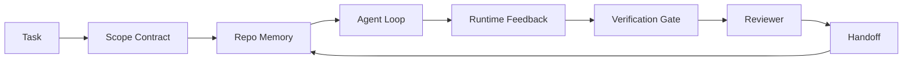

# Cơ quan công nghệ đại lý: Tại sao mô hình năng lực mạnh vẫn sẽ thất bại

> Chỉ có mô hình mạnh mẽ không đủ. Một đại lý đáng tin cậy cần một bảng làm việc: hướng dẫn, trạng thái, phạm vi, phản hồi, xác minh, đánh giá và giao tiếp.

**Type:** Learn + Build
**Languages:** Python (stdlib)
**Prerequisites:** Phase 14 · 01 (Agent Loop), Phase 14 · 26 (Failure Modes)
**Time:** ~45 minutes

## Học mục tiêu
- 区分模型能力与执行可靠性.
- Nói ra quyết định đại lý 能否交付的七个工作桌面面――
- Trong một nhiệm vụ repo nhỏ, so sánh chỉ chạy nhanh với chạy trên bàn làm việc.
- Tạo ra một báo cáo về chế độ thất bại, sẽ mô tả từng bề mặt bị thiếu hụt cho các triệu chứng gây ra nó.

## 问题
Bạn đặt một mô hình biên giới  đưa vào repo thực tế, để nó thêm vào chứng chỉ nhập. Nó mở bốn tệp, viết ra mã có vẻ hợp lý, tuyên bố thành công, rồi dừng lại. Bạn chạy thử nghiệm. Hai thất bại.

模型不是不懂Python──它是不懂这个工作──它不知道什么才算完成──允许写入哪里──哪些测试有权威性,也不知道下一次会议 应该如何接手──

Đây không phải là lỗi mô hình. Đây là lỗi bàn làm việc.

## 概念
workbench là một hệ thống hoạt động trong nhiệm vụ.

| Surface | 它承载什么 | 缺失时的失败 |
|---------|------------|--------------|
| Instructions | 启动规则、禁止动作、完成定义 | Agent 猜测交付意味着什么 |
| State | 当前任务、已触碰文件、blockers、下一步动作 | 每个 session 都从零开始 |
| Scope | 允许文件、禁止文件、验收标准 | 修改泄漏到无关代码 |
| Feedback | 捕获进 loop 的真实命令输出 | Agent 在 400 上宣布成功 |
| Verification | Tests、lint、smoke run、scope check | “看起来不错”进入 main |
| Review | 由不同角色执行的第二遍检查 | Builder 批改自己的作业 |
| Handoff | 改了什么、为什么改、还剩什么 | 下一个 session 重新发现一切 |

workbench 独立于模型──你可以替换模型并保留这些表面──你不能替换表面 还保持可靠性──



Chuyện này  đóng trên trạng thái 文件, chứ không phải lịch sử trò chuyện  trên.

### Bàn làm việc với kỹ thuật nhanh

Việc làm nhanh chóng  nói với mô hình rằng bạn muốn gì  bàn làm việc  nói với mô hình làm thế nào để vượt qua các phiên  bàn làm việc

### Phòng làm việc đối với khung

framework 提供运行时间(LangGraph、AutoGen、Agents SDK)  workbench 给 agent trong đó chạy thời gian  cung cấp một nơi làm việc  cả hai đều cần  cái mini-track 讲的是第二个──

### Từ nguyên thủy xuất phát từ các lý thuyết, chứ không phải từ các phân loại nhà cung cấp xuất phát

Hiện nay có rất nhiều bài viết về kỹ thuật harness. Eddy Osmani, OpenAI, Anthropic, LongChain, Martin Fowler, MongoDB, HumanLayer, Code Augment, Thoughtworks, Walkinglabs, và các bài viết liên tục được thảo luận về nó. Chúng không phù hợp với phạm vi của harness. Chúng tôi không cần phải chọn một lớp UX.

Trước khi tạm thời lấy ra đại lý cái thẻ này. Một lần đại lý chạy là tính toán xuyên thời gian, quá trình và máy tính. Để làm cho nó đáng tin cậy, bạn cần bất kỳ hệ thống sản xuất nào đều cần những nguyên thủy tương tự.

| Primitive | 它是什么 | 它为 agent 承载什么 |
|-----------|----------|---------------------|
| Function | 类型化 handler。尽可能保持纯。拥有自己的 inputs 和 outputs。 | 一次 tool call、一次 rule check、一个 verification step、一次模型调用 |
| Worker | 拥有一个或多个 functions 和 lifecycle 的长生命周期进程 | builder、reviewer、verifier、一个 MCP server |
| Trigger | 调用 function 的事件源 | Agent loop tick、HTTP request、queue message、cron、file change、hook |
| Runtime | 决定什么在哪里运行、使用什么 timeouts 和 resources 的边界 | Claude Code 的 process、LangGraph 的 runtime、一个 worker container |
| HTTP / RPC | caller 与 worker 之间的网络线缆 | Tool-call protocol、MCP request、model API |
| Queue | trigger 与 worker 之间的持久 buffer；back-pressure、retry、idempotency | task board、feedback log、review inbox |
| Session persistence | 在 crashes、restarts、model swaps 后仍保留的 state | `agent_state.json`、checkpoints、KV stores、repo 本身 |
| Authorization policy | 谁能以什么 scope 调用什么 function | allowed/forbidden files、approval boundaries、MCP capability lists |

Bây giờ hãy đưa 7 bề mặt bàn làm việc lên các nguyên thủy này.

- **Instructions** chính sách + hàm metadata。 quy tắc là kiểm tra( chức năng)。đối định tuyến(`AGENTS.md`(c) là một chính sách liên kết với khởi động runtime trên.
- **State** session persistence──runtime 每一步都会读取的键存储──file、KV或DB;persistence semantics 重要,存储后端 不重要──
- **Scope**Chính sách ủy quyền cho mỗi nhiệm vụ  allowed/forbidden globes is ACL  need approvals is permission lattice 
- **Feedback** 写入队列的呼唤日志──每次 shell call 都是一条记录,持久、可重放──
- **Verification** Một chức năng.  đối với các đầu vào 确定性.  bởi nhiệm vụ kết thúc 触发.
- **Review**Một công nhân độc lập, có quyền đọc và viết về các công trình xây dựng, có quyền xem xét các báo cáo chỉ có quyền viết.
- **Handoff** Tầm hiệu cuối phiên ở ra ghi nhớ lâu dài.

Buo mạch nhân viên 本身就是一个工人,它消费事件(user message、工具结果、timer tick),调用函数(先是模型,然后是模型选择的工具),写记录(状态、反),并发发发触发(验证、评论、赠)。没有神秘之处;形状与工作处理器相同──

### 流行模式, chuyển đổi sang nguyên thủy

Mỗi kiểu đeo dây được sử dụng đều có thể được phân loại vào khoảng 8 kiểu nguyên thủy.

| Vendor or community pattern | 它实际是什么 |
|------------------------------|--------------|
| Ralph Loop（Claude Code、Codex、agentic_harness book）— 当 agent 试图过早停止时，把原始意图重新注入一个新的 context window | 一个将 task 以干净 context 重新入队的 trigger；session persistence 负责把目标向前传递 |
| Plan / Execute / Verify (PEV) | 三个 workers，每个角色一个，通过 state 和 phases 之间的 queue 通信 |
| Harness-compute separation（OpenAI Agents SDK，April 2026）— 将 control plane 与 execution plane 分开 | 对 control-plane / data-plane 的重新表述。比 agent 标签早几十年就存在 |
| Open Agent Passport（OAP，March 2026）— 在执行前根据声明式 policy 签名并审计每次 tool call | 由 pre-action worker 强制执行的 authorization policy，并带有 signed audit queue |
| Guides and Sensors（Birgitta Böckeler / Thoughtworks）— feedforward rules + feedback observability | Authorization policy + verification functions + observability traces |
| Progressive compaction, 5-stage（Claude Code reverse engineering，April 2026） | 一个 state-management worker，像 cron 一样在 session persistence 上运行，使其保持在 budget 内 |
| Hooks / middleware（LangChain、Claude Code）— 拦截 model 和 tool calls | 包裹 runtime invocation path 的 triggers + functions |
| Skills as Markdown with progressive disclosure（Anthropic、Flue） | 一个 function registry，其中 function metadata 会 just-in-time 加载到 context 中 |
| Sandbox agents（Codex、Sandcastle、Vercel Sandbox） | compute plane：具备隔离 filesystem、network 和 lifecycle 的 runtime |
| MCP servers | 通过稳定 RPC 暴露 functions 的 workers，capability lists 作为 authorization |

Mỗi mục trong bảng này, là đại lý 社区 đến một nguyên thủy từ đã có trong hệ thống phân tán, sau đó đưa cho nó một tên mới.

### Quản đơn thực tế đã chỉ ra điều gì

Thuyết sử dụng trên mô hình hiện có dữ liệu. Nó đáng để hiểu, vì nó cũng là một phản đối cho dù mô hình thông minh hơn là lý thuyết trung thực duy nhất của mô hình tốt.

- Terminal Bench 2.0  同一个模型, chỉ sử dụng thay đổi 就让一个编码代理从前30 之外提升到第五名(LangChain,*Anatomy of an Agent Harness*) 
- Vercel   xóa 80% các công cụ của đại lý của mình; tỷ lệ thành công từ 80%  nhảy lên 100% (MongoDB) 
- Harvey  đại lý pháp lý  chỉ thông qua tối ưu hóa sử dụng 就让精度 翻倍以上(MongoDB) 
- 88% các dự án đại lý AI doanh nghiệp chưa thể vào sản xuất.
- Một nghiên cứu chuẩn 2025 trong ba khung mã nguồn mở phổ biến 上 báo cáo khoảng 50% hoàn thành nhiệm vụ; Long-context WebAgent trong điều kiện dài ngữ cảnh 下 từ 40-50%  giảm xuống còn 10% dưới đây, chủ yếu do vòng lặp vô hạn và mất mục tiêu(Phần viết đầu năm 2026 được thảo luận rộng rãi)

Điểm là ngày nay, công trình chịu trách nhiệm là xung quanh mô hình, chứ không phải bên trong mô hình; chịu trách nhiệm với những thứ nguyên thủy này, chính là mọi hệ thống sản xuất luôn cần mọi thứ.

### Nhà cung cấp viết 止步的地方

Đó là một phần của việc bạn không cần khách hàng.

- LangChain của *Anatomy of an Agent Harness* đã đưa ra mười một bộ phận  các lời nhắc, công cụ, móng, hộp rác, dàn nhạc, bộ nhớ, kỹ năng, phụ kiện, cũng như một vòng lặp runtime thảm đạm── nó không có danh sách hàng đợi ‒ như một đơn vị triển khai nhân viên ‒ triggers semantics、 như một điểm chú ý độc lập của việc duy trì phiên, hoặc chính sách ủy quyền── nó đưa các harness như một đối tượng bạn sắp xếp, chứ không phải là một hệ thống bạn triển khai──
- Addy Osmani của * Cơ sở kỹ thuật vận động viên *  đề xuất `Agent = Model + Harness`Các mô hình khung và dao, nhưng không có lời giải thích thêm về việc vòng xoắn được tạo thành từ gì. Nó trông giống như một hình dáng, chứ không phải là một spec.
- Anthropic 和 OpenAI đối với bề mặt  thảo luận sâu sắc nhất, nhưng vẫn còn ở trong thời gian chạy riêng trong 内── Tháng 4 năm 2026 Agents SDK trong harness-computing separation thông báo là đầu tiên xác nhận rõ ràng có thể kiểm soát-vầu / dữ liệu-vầu phân chia các nhà cung cấp mảnh── đó là một ý tưởng nguyên thủy, không phải là một thứ mới──
- Agent_harness book 将 harness 视为 config object(Jaymin West của *Agentic Engineering*, chương 6), trong đó có một câu mạnh nhất là:
- Các chủ đề tin tức hacker 一直抵达同一个地方──4 tháng 4 2026 chủ đề *Hành động của đại lý thuộc về bên ngoài hộp cát* 认为该权柄 应该位于更像是一个处在一切之外的、并基于背景 和用户 授权访问的超级浏览器──这是再次作为独立平面的授权政策──

Bạn không cần phải phản đối bất kỳ một bài nào trong những bài viết này, cũng có thể thấy sự thiếu hụt. Chúng tôi viết về một hệ thống đã tồn tại. Chúng tôi viết về hệ thống. Khi hệ thống được xây dựng đúng, bảy bề mặt sẽ tự nhiên xuất hiện từ nguyên thủy.`AGENTS.md`色也修不好缺失的队列──

Vì vậy, khi bạn nghe ở những nơi khác về kỹ thuật harness 时, hãy dịch nó thành nguyên thủy──Prompt và quy tắc là chính sách và chức năng──Scaffolding là thời gian chạy──Guardrails là ủy quyền + xác minh──Hooks là kích hoạt──Memory là session persistence──Ralph Loop là requeue──Subagents là công nhân──Sandboxes là máy tính──词汇会变化;工程不会──workbench là UX đối diện với đại lý;而能够挺过下一次的供应商重构的 harness,本质是函数、工人、触发器、运行时间、排列、persist 和政策被正确连接在一起──


```figure
wb-seven-surfaces
```

##  xây dựng nó
`code/main.py`会把一个微型 repo任务运行两次.第一次是只提示,第二次连接七个表面.

Nhiệm vụ repo 刻意设计得很小: cho một đơn文件 FastAPI-style handler 添加输入验证,并写一个通过测试――

运行 nó:

```
python3 code/main.py
```

输出: 两次运行的隔壁日志,一个总结 暂时运行的`failure_modes.json`, và một dòng phán quyết của việc chạy bàn làm việc.

Agent là một vật liệu dựa trên quy tắc rất nhỏ; trọng tâm là bề mặt, chứ không phải mô hình. Trong phần còn lại của mini-track này, bạn sẽ đặt mỗi bề mặt lại để xây dựng thành vật thực và có thể sử dụng được.

## Sử dụng nó
三个地方已经存在现实中的工作桌面,哪怕没人这样称之它们:

- **Claude Code, Codex, Cursor.** `AGENTS.md`和 `CLAUDE.md`là hướng dẫn bề mặt.Slash lệnh là phạm vi.Hooks là xác minh.
- **LangGraph, OpenAI Agents SDK.**Các điểm kiểm soát và cửa hàng phiên là bề mặt nhà nước.
- **真实 repo 上的 CI。**Các thử nghiệm, lint và kiểm tra kiểu là xác minh.

Kỹ thuật bàn làm việc là một cách thức: làm cho các bề mặt này được hiển nhiên, có thể sử dụng lại, thay vì để mỗi nhóm tự khám phá lại chúng.

## 交付 nó
`outputs/skill-workbench-audit.md`Đó là một kỹ năng có thể di chuyển, để kiểm tra bảy bề mặt bàn làm việc hiện có của repo, và báo cáo những gì thiếu hụt, những phần nào có, những phần nào khỏe mạnh. Đặt nó vào bất kỳ thiết lập đại lý nào bên cạnh; nó sẽ cho bạn biết điều gì trước.

## 练习
1. 选择一个你已经运行代理的 repo――把七个表面从0(缺失) 到2(健康)打分――你最弱的表面是什么?
2. 扩展 `main.py`, để chỉ chạy nhanh cũng tạo ra một tuyên bố thành công giả                                                                                                                                                                                                                                                        
3. Để sản phẩm của bạn thêm một bề mặt thứ tám. Hãy giải thích tại sao nó không thể được phân tích vào một trong bảy mặt hiện có.
4. Với một người khác sẽ ảo giác  thêm tài liệu viết vào của đại lý Stub tái chạy kịch bản.
5. Phase 14 · 26 trong 5 ngành công nghiệp tái phát hiện các chế độ thất bại được mô tả thành bảy bề mặt.

## 关键术语
| Term | What people say | What it actually means |
|------|----------------|------------------------|
| Workbench | “那套 setup” | 围绕模型设计的 engineered surfaces，使工作可靠 |
| Surface | “一个 doc” 或 “一个 script” | agent 每一轮读取或写入的命名、machine-readable input |
| System of record | “那些 notes” | chat history 消失后 agent 视为 truth 的文件 |
| Definition of done | “Acceptance” | 一个客观、file-backed 的 checklist，agent 无法伪造 |
| Workbench audit | “Repo readiness check” | 在工作开始前遍历七个 surfaces，标记缺失部分 |

## 延伸阅读
Hãy coi chúng như các điểm dữ liệu, chứ không phải quyền lực. Mỗi bài viết là một phân loại phân loại.

Các khung của nhà cung cấp:

- [Addy Osmani, Agent Harness Engineering](https://addyosmani.com/blog/agent-harness-engineering/) `Agent = Model + Harness`和 ratchet pattern; cơ sở hạ tầng phần còn yếu hơn
- [LangChain, The Anatomy of an Agent Harness](https://blog.langchain.com/the-anatomy-of-an-agent-harness/) 十一个组件: các lời nhắc, công cụ, móng, dàn nhạc, hộp cát, bộ nhớ, kỹ năng, phụ kiện, thời gian chạy;省略 queues, deployment, autz
- [OpenAI, Harness engineering: leveraging Codex in an agent-first world](https://openai.com/index/harness-engineering/) Codex 团队 đối với thời gian chạy của nó  xung quanh bề mặt
- [OpenAI, Unrolling the Codex agent loop](https://openai.com/index/unrolling-the-codex-agent-loop/) 将 đại lý vòng lặp 归约为函数调用 上一个 `while`
- [Anthropic, Effective harnesses for long-running agents](https://www.anthropic.com/engineering/effective-harnesses-for-long-running-agents)  bề mặt đường chân trời dài trong thời gian chạy cụ thể
- [Anthropic, Harness design for long-running application development](https://www.anthropic.com/engineering/harness-design-long-running-apps)  ứng dụng kiểu thiết kế ghi chép
- [LangChain Deep Agents harness capabilities](https://docs.langchain.com/oss/python/deepagents/harness) bề mặt cấu hình thời gian chạy

Có những chi tiết có thể sử dụng:

- [Martin Fowler / Birgitta Böckeler, Harness engineering for coding agent users](https://martinfowler.com/articles/harness-engineering.html) hướng dẫn(feedforward) + cảm biến(feedback);最清晰的控制理论框架
- [HumanLayer, Skill Issue: Harness Engineering for Coding Agents](https://www.humanlayer.dev/blog/skill-issue-harness-engineering-for-coding-agents) Đây không phải là vấn đề mô hình, mà là cấu hình 问题
- [MongoDB, The Agent Harness: Why the LLM Is the Smallest Part of Your Agent System](https://www.mongodb.com/company/blog/technical/agent-harness-why-llm-is-smallest-part-of-your-agent-system) 证据:Vercel 80% đến 100%,Harvey 2x chính xác,Terminal Bench Top 30 đến Top 5
- [Augment Code, Harness Engineering for AI Coding Agents](https://www.augmentcode.com/guides/harness-engineering-ai-coding-agents) hạn chế đi bộ đầu tiên
- [Sequoia podcast, Harrison Chase on Context Engineering Long-Horizon Agents](https://sequoiacap.com/podcast/context-engineering-our-way-to-long-horizon-agents-langchains-harrison-chase/) mối quan tâm về thời gian chạy 高于 mô hình

书籍、论文 và thực hiện tham chiếu:

- [Jaymin West, Agentic Engineering — Chapter 6: Harnesses](https://www.jayminwest.com/agentic-engineering-book/6-harnesses) xử lý dài sách, sẽ sử dụng 视为 chính ranh giới an ninh
- [preprints.org, Harness Engineering for Language Agents (March 2026)](https://www.preprints.org/manuscript/202603.1756) 将其作为控制 /机构 / runtime 的学术框架
- [walkinglabs/awesome-harness-engineering](https://github.com/walkinglabs/awesome-harness-engineering) 跨文脈、评估、可观察性、配乐的整理阅读清单
- [ai-boost/awesome-harness-engineering](https://github.com/ai-boost/awesome-harness-engineering)  Một danh sách khác được sắp xếp (đồ dùng, các phương pháp, bộ nhớ, MCP, quyền)
- [andrewgarst/agentic_harness](https://github.com/andrewgarst/agentic_harness) thực hiện tham chiếu sẵn sàng để sản xuất,带 bộ nhớ hỗ trợ Redis và bộ phận đánh giá
- [HKUDS/OpenHarness](https://github.com/HKUDS/OpenHarness) 内置 nhân viên của mở đại lý vòng xoáy

Đáng đọc được những phân biệt và không đồng ý của Hacker News  thảo luận:

- [HN: Effective harnesses for long-running agents](https://news.ycombinator.com/item?id=46081704)
- [HN: Improving 15 LLMs at Coding in One Afternoon. Only the Harness Changed](https://news.ycombinator.com/item?id=46988596)
- [HN: The agent harness belongs outside the sandbox](https://news.ycombinator.com/item?id=47990675) 主张将授权 作为独立平面

Các tham chiếu chéo trong chương trình giảng dạy này:

- Giai đoạn 14 · 23  OpenTelemetry GenAI:Sự thuyết trình cảm biến hướng tới lớp quan sát
- Giai đoạn 14 · 26  7 bề mặt  thiết kế để hấp thụ các chế độ thất bại danh mục
- Giai đoạn 14 · 27   nằm trong chính sách ủy quyền nguyên thủy 上的快速注射防御
- Giai đoạn 14 · 29  Thời gian chạy sản xuất(quay 、event、cron):
