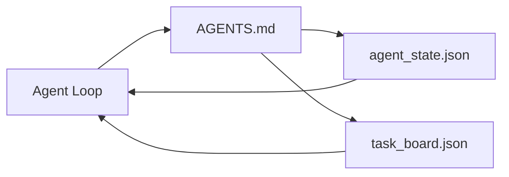

# Cảnh sát nhỏ nhất

> Thang điểm làm việc nhỏ nhất có thể sử dụng chỉ có ba file: một router hướng dẫn gốc, một file trạng thái, và một bảng nhiệm vụ. Tất cả mọi thứ khác đều được đặt trên chúng. Nếu một repo không chịu đựng được ba, không có mô hình nào có thể cứu nó.

**Type:** Build
**Languages:** Python (stdlib)
**Prerequisites:** Phase 14 · 31（为什么强大的模型仍然失败）
**Time:** ~45 分钟

## Học mục tiêu
- 定义构成 tối thiểu thực tế bàn làm việc của三个文件――
-  Giải thích tại sao một bộ định tuyến gốc ngắn hơn một bộ đơn dài `AGENTS.md`
- Xây dựng một đại lý Mỗi vòng đều có thể đọc và viết vào các tập tin nhà nước khi kết thúc.
- Xây dựng một lịch sử trò chuyện không phụ thuộc, cũng có thể hỗ trợ nhiều phiên làm việc.

## 问题
Hầu hết các đội sẽ thông qua một bài viết 3000 行.`AGENTS.md`Để xây dựng một bàn làm việc, sau đó bạn nghĩ đã hoàn thành. mô hình sẽ tải nó, bỏ qua những phần không thể kết luận, sau đó vẫn ở trên cùng một khối lượng bề mặt mà nó đã luôn thất bại.

Bạn cần những thứ ngược lại. Một tệp gốc rất nhỏ, chỉ cần liên quan khi đưa đại lý đi vào các tệp sâu hơn.

Mỗi tài liệu đều có một nhiệm vụ. Mỗi tài liệu đều có thể đọc được bằng máy, sau đó chúng có thể phát triển thành một hệ thống thực sự.

## 概念


### AGENTS.md là router, không phải là thủ công

Được rồi.`AGENTS.md`很短──它把代理指向:

- Lưu ý của tiểu bang
- Đội tác vụ còn còn gì nữa?
- 更深层的规则(在 `docs/agent-rules.md`下) ❖
- Chỉ huy xác minh (How do you know it can work)

Nội dung dài hơn được đưa vào các tài liệu sâu hơn, chỉ cần tải lên.

### agent_state.json là hệ thống ghi chép

State 携带:active task id、被触及文件、已做假设、阻塞,以及下一步行动──Agent 每一轮都会读取它──下一个会议 读取它,而不是重放聊天──

Chính phủ 存在文件里, vì lịch sử trò chuyện không thể tin cậy.

### task_board.json là hàng

Đơn vị nhiệm vụ  mang theo mỗi nhiệm vụ, trạng thái`todo | in_progress | done | blocked` Khi trạng thái vì không gian, nó là đại lý 拉取任务的队列; khi bạn hỏi biết đại lý không đi trên đường thẳng, nó cũng là bạn đọc hàng 

Đội quản trị nhiệm vụ có ID, mục tiêu, chủ sở hữu`builder``reviewer`Hoặc`human`(Bảng có ý định giữ nhỏ: khi nó lớn lên hơn một màn hình, bạn gặp phải là vấn đề lập kế hoạch, chứ không phải vấn đề của hội đồng.

### 3 tài liệu là đường dưới, không phải đường trên.

Các chương trình tiếp theo sẽ thêm các hợp đồng phạm vi, các người chạy phản hồi, cổng xác minh, danh sách kiểm tra của các nhà phê bình và các gói giao tiếp.


```figure
wb-three-files
```

##  xây dựng nó
`code/main.py`会把最小工作桌 写入一个空 repo,并演示单轮代理转,它会:

1. 读取 `agent_state.json`
2. Nếu tình trạng không, hãy từ`task_board.json`拉取下一个任务.
3. Trong phạm vi trong chạm vào một tài liệu.
4. 写回更新后的状态──

运行 nó:

```
python3 code/main.py
```

脚本会在自身旁边创建 `workdir/`, đặt ba tài liệu này, chạy một vòng, sau đó in khác nhau.

## Sử dụng nó
Trong các sản phẩm đại lý sản xuất, ba tài liệu tương tự sẽ xuất hiện với tên khác nhau:

- **Claude Code:**用 `AGENTS.md`Hoặc`CLAUDE.md`作为路由器,用 `.claude/state.json`风格的店铺 作为州,用子 作为板──
- **Codex / Cursor:**Quy tắc không gian làm việc 作为路由器,session memory 作为状态,chate sidebar 中的排队任务 作为板──
- **Custom Python agent:**Đó là những tài liệu mà anh vừa viết.

名称会变──形状不会──

## Thực tế trong tình hình sản xuất

Khi các mô hình được lắp đặt lên bàn làm việc tối thiểu, nó có thể trải qua các bài kiểm tra monorepos thực sự.

**带 nearest-wins precedence 的嵌套 `AGENTS.md`。**OpenAI đã phát hành 88 bản trong repo chính của mình .`AGENTS.md`文件, mỗi phụ thành một·Codex、Cursor、Claude Code 和 Copilot đều sẽ đi từ các file làm việc hiện tại một cách đến các file repo root 遍历, và kết nối theo cách tìm thấy mỗi `AGENTS.md`❖ Sub-directory 文件扩展 root file──Codex 添加了 `AGENTS.override.md`, để thay thế thay vì mở rộng; cơ chế vượt quá là cụ thể cho Codex, làm cross-tool 工作时应避免使用──Augment Code's measurement results才是关键:最好`AGENTS.md`文件带来的质量提升, tương đương với từ Haiku 升级到Opus;文件差的将让输出比完全没有文件更差.

**即使看起来像 coverage，也要拒绝的 anti-patterns。**相互冲突的指示 会把代理从互动模式 降到贪模式(ICLR 2026 AMBIG-SWE:48.8% → 28% tỷ lệ giải quyết);应给优先事项 编号, thay vì đưa chúng ra phẳng chồng lên, 无法验证的风格规则(遵循Google Python Style Guide) Nếu không có lệnh thực thi,就会让代理自行想象遵守;每条风格规则都应配上精确的 lint命令;;以风格开头而不是以命令开头,会埋没验证路径;命令在前风格在后面,在后面──为人类而不是代理写内容浪费文本预算;简洁会是一种特征──

**Cross-tool symlinks。**Một file gốc đơn  cộng với các liên kết sym`ln -s AGENTS.md CLAUDE.md``ln -s AGENTS.md .github/copilot-instructions.md``ln -s AGENTS.md .cursorrules`), để mọi nhân viên mã hóa đều sử dụng cùng một nguồn sự thật.`nx ai-setup`Sẽ dựa trên một cấu hình đơn lẻ, tự động hoàn thành việc này giữa Claude Code,Cursor,Copilot,Gemini,Codex và OpenCode.

## 交付 nó
`outputs/skill-minimal-workbench.md`会为任何新 repo 生成三文件工作台:一个按项目调优的 `AGENTS.md`router ∙ một chứa các khóa chính xác `agent_state.json`, cũng như một sử dụng hiện tại backlog khởi nghiệp `task_board.json`

## 练习
1.  Đưa `agent_state.json`添加一个 `last_run`Tiêu khắc thời gian: Nếu tài liệu sớm hơn 24 giờ, trừ khi nhà khai thác xác nhận, nếu không từ chối vận hành.
2. 给任务板 添加一个 `priority`trường,并 sửa puller, làm cho nó luôn được chọn ưu tiên cấp cao nhất `todo`
3. sẽ`task_board.json`迁移到JSON Lines,让每个任务占一行,并让区别在版本控制中保持清晰──
4. 编写一个 `lint_workbench.py`, là`AGENTS.md`超过80 行,或引用不存在文件时失败.
5. Thẩm phán trong ba tài liệu này, mất đi cái gì gây tổn thương lớn nhất.

## 关键术语
| Term | What people say | What it actually means |
|------|----------------|------------------------|
| Router | `AGENTS.md` | 指向更深层 docs 和 files 的简短 root file |
| State file | "The notes" | 记录 agent 所在位置的 machine-readable 记录，每一轮都会写入 |
| Task board | "The backlog" | 带有 status、owner、acceptance 的工作 JSON queue |
| System of record | "Source of truth" | 当 chat 消失时，workbench 视为权威的文件 |

## 延伸阅读
- [agents.md — the open spec](https://agents.md/) 被 Cursor、Codex、Claude Code、Copilot、Gemini、OpenCode 采用
- [Augment Code, A good AGENTS.md is a model upgrade. A bad one is worse than no docs at all](https://www.augmentcode.com/blog/how-to-write-good-agents-dot-md-files) 测得的质量提升
- [Blake Crosley, AGENTS.md Patterns: What Actually Changes Agent Behavior](https://blakecrosley.com/blog/agents-md-patterns) 什么实实证有效,什么无效
- [Datadog Frontend, Steering AI Agents in Monorepos with AGENTS.md](https://dev.to/datadog-frontend-dev/steering-ai-agents-in-monorepos-with-agentsmd-13g0) thực hành ưu tiên tổ hợp
- [Nx Blog, Teach Your AI Agent How to Work in a Monorepo](https://nx.dev/blog/nx-ai-agent-skills) 跨六种工具的单源生成
- [The Prompt Shelf, AGENTS.md Best Practices: Structure, Scope, and Real Examples](https://thepromptshelf.dev/blog/agents-md-best-practices/) 能经受审  能经受审  能经受审  能经受审  能经受审  经受审  能经受审  经受审  经受审  经受审  经受审  经受审  经受审  经受审  经受审  经受审  经受审  经受审  经受审  经受审  经受审  经受审  经受审  经受审  经受审  经受审  经受审  经受审  经受审  经受审  经受审  经受审  经受审  经受审  经受审  经受审  经受审  经受审  经受审  经受审 经受审  经受审  经受审  经受审  经受审  经受审 经受审 
- [Anthropic, Claude Code subagents and session store](https://docs.anthropic.com/en/docs/agents-and-tools/claude-code/sub-agents)
- Giai đoạn 14 · 31  Mức độ thất bại tối thiểu của việc hấp thụ
- Giai đoạn 14 · 34  本课预览 của kế hoạch trạng thái bền vững
